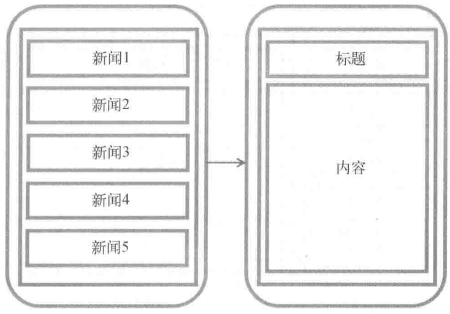
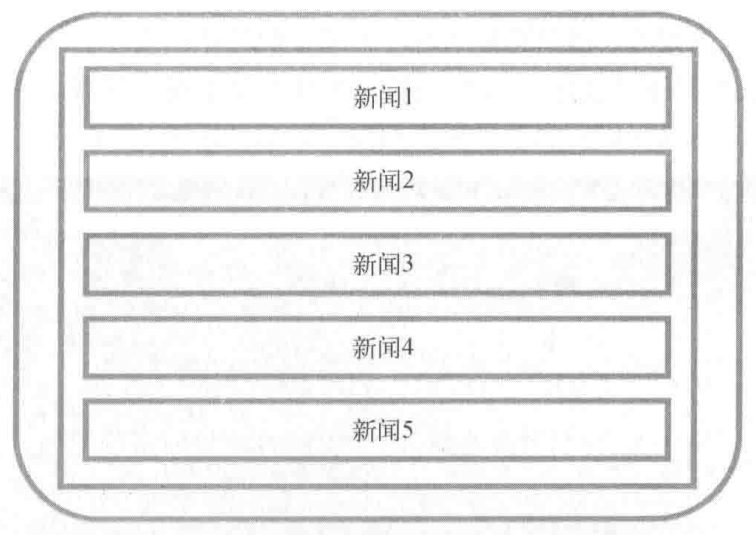
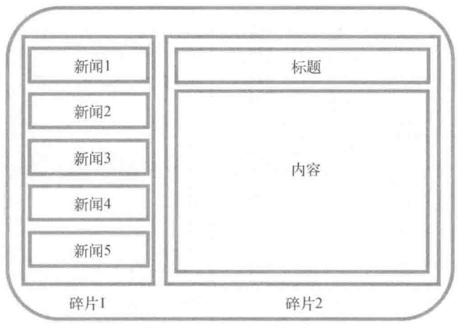
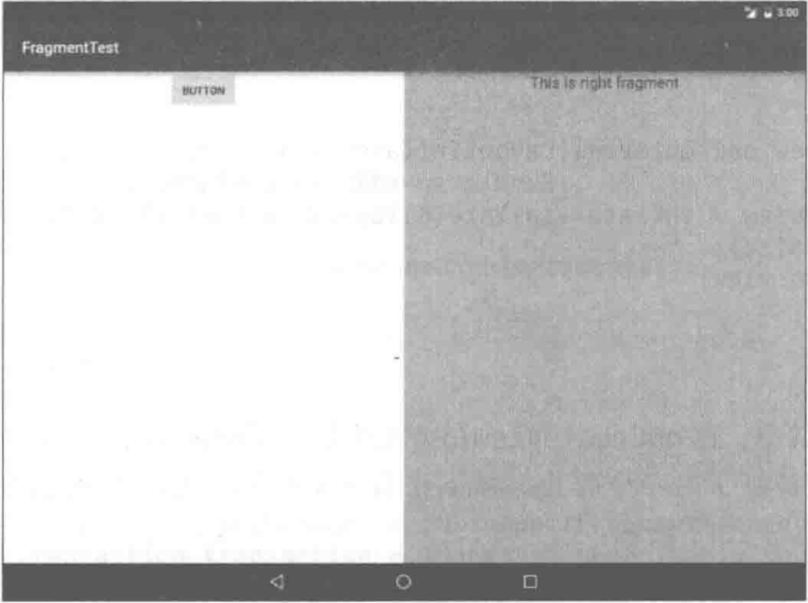

# 碎片

碎片（Fragment）是一种可以嵌入在活动当中的UI片段，它能让程序更加合理和充分地利用大屏幕的空间，因而在平板上应用得非常广泛。虽然碎片对是全新的概念，但它和活动实在是太像了，同样都能包含布局，有自己的生命周期。甚至可以将碎片理解成一个迷你型的活动，虽然这个迷你型的活动有可能和普通的活动是一样大的。

那么究竟要如何使用碎片才能充分地利用平板屏幕的空间呢？想象我们正在开发一个新闻应用，其中一个界面使用RecyclerView展示了一组新闻的标题，当点击了其中一个标题时，就打开另一个界面显示新闻的详细内容。如果是在手机中设计，我们可以将新闻标题列表放在一个活动中，将新闻的详细内容放在另一个活动中。



可是如果在平板上也这么设计，那么新闻标题列表将会被拉长至填充满整个平板的屏幕，而新闻的标题一般都不会太长，这样将会导致界面上有大量的空白区域。



因此，更好的设计方案是将新闻标题列表界面和新闻详细内容界而分别放在两个碎片中，然后在同一个活动里引入这两个碎片，这样就可以将屏幕空间充分地利用起来了，如图所示。



# 碎片的使用方式

新建一个FragmentTest项目。

在一个活动当中添加两个碎片，使其平分活动空间。

新建一个左侧Fragment的布局`left_fragment.xml`，此布局非常简单，只放置了一个按钮，水平居中显示，代码如下所示：

```xml
<?xml version="1.0" encoding="utf-8"?>
<LinearLayout xmlns:android="http://schemas.android.com/apk/res/android"
    android:orientation="vertical"
    android:layout_width="match_parent"
    android:layout_height="match_parent">
    <Button android:id="@+id/button"
        android:layout_width="wrap_content"
        android:layout_height="wrap_content"
        android:layout_gravity="center_horizontal"
        android:text="Button">

    </Button>

</LinearLayout>
```

然后新建右侧是Fragment的布局`right_fragment.xml`，将此布局背景色设置为绿色，放置了一个TextView用于显示一段文本，代码如下所示：

```xml
<?xml version="1.0" encoding="utf-8"?>
<LinearLayout xmlns:android="http://schemas.android.com/apk/res/android"
    android:orientation="vertical"
    android:background="#00ff00"
    android:layout_width="match_parent"
    android:layout_height="match_parent">
    <TextView
        android:layout_width="wrap_content"
        android:layout_height="wrap_content"
        android:layout_gravity="center_horizontal"
        android:textSize="20sp"
        android:text="This is right fragment">
    </TextView>

</LinearLayout>
```

接着新建一个LeftFragment类，并让他继承自Fragment。

> 注意，这里可能会有两个不同包下的Fragment供你选择，一个是系统内置的`android.app.Fragment`，一个是AndroidX库中的`androidx.fragment.app.Fragment`。这里请一定使用AndoridX库中的Fragment，因为它可以让碎片的特性在所有Android系统版本中保持一致。而系统内置的fragment在Android 9.0中已被废弃。使用AndroidX库中的Fragment并不需要在build.gradle文件中添加额外的依赖，只需在创建新项目时勾选了`Use androidx.* artifacts`选项，Android Studio会自动帮你导入必要的AndroidX库。

编写一下LeftFragment中的代码，如下所示：

```java
public class LeftFragment extends Fragment {
    @Override
    public View onCreateView(LayoutInflater inflater, ViewGroup container,
                             Bundle savedInstanceState) {
        View view = inflater.inflate(R.layout.left_fragment, container, false);
        return view;
    }
    
}
```

这里仅仅是重写了Fragment的onCreateView方法，然后在这个方法中通过Layoutlnflater的inflate方法将刚才定义的left_fragment布局动态加载进来，整个方法简单明了。接着用同样的方法再新建一个 RightFragment，代码如下所示：

```java
public class RightFragment extends Fragment {
    @Override
    public View onCreateView(LayoutInflater inflater, ViewGroup container,
                             Bundle savedInstanceState) {
        View view = inflater.inflate(R.layout.right_fragment, container, false);
        return view;
    }
}
```

下来修改`activity_main.xml`中的代码，如下所示：

```xml
<?xml version="1.0" encoding="utf-8"?>
<LinearLayout xmlns:android="http://schemas.android.com/apk/res/android"
    android:layout_width="match_parent"
    android:layout_height="match_parent"
    android:orientation="horizontal"> <!-- 水平排布 -->
    <fragment android:id="@+id/leftFrag"
        android:layout_width="0dp"
        android:layout_height="match_parent"
        android:name="com.example.fragmenttest.LeftFragment"
        android:layout_weight="1">

    </fragment>
    <fragment android:id="@+id/rightFrag"
        android:layout_width="0dp"
        android:layout_height="match_parent"
        android:name="com.example.fragmenttest.RightFragment"
        android:layout_weight="1">

    </fragment>
</LinearLayout>
```

可以看到，我们使用了`<fragment>`标签在布局中添加碎片，需要通过`android:name`属性来显式指明要添加的碎片类名，注意一定要将类的包名也加上。

现在运行一下程序，效果如图所示。



# 动态添加碎片

已经实践在布局文件中添加碎片，不过碎片真正的强大之处在于，它可以在程序运行时动态地添加到活动当中。根据具体情况来动态地添加碎片，就可以将程序界面定制得更加多样化。
我们还是在上一节代码的基础上继续完善，新建`another_right_fragment.xml`，代码如下：

```xml
<?xml version="1.0" encoding="utf-8"?>
<LinearLayout xmlns:android="http://schemas.android.com/apk/res/android"
    android:orientation="vertical"
    android:background="#ffff00"
    android:layout_width="match_parent"
    android:layout_height="match_parent">
    <TextView
        android:layout_width="wrap_content"
        android:layout_height="wrap_content"
        android:layout_gravity="center_horizontal"
        android:textSize="24sp"
        android:text="This is another right fragment">
        
    </TextView>

</LinearLayout>
```

这个布局文件的代码和`right_fragment.xml`中的代码基本相同，只是将背景色改成了黄色，并将显示的文字改了改。然后新建`AnotherRightFragment`作为另一个右侧碎片，代码如下所示：

