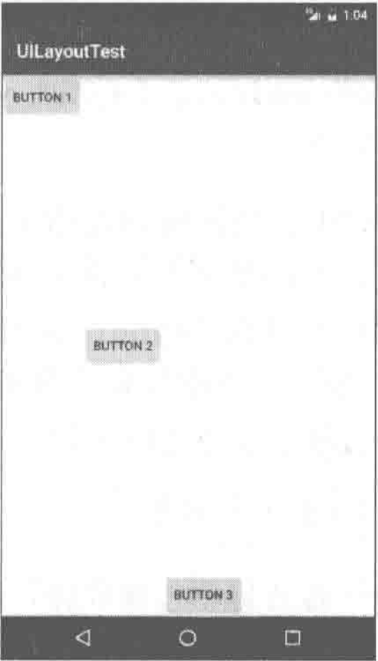
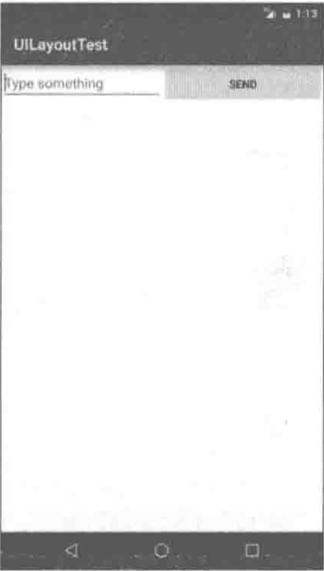
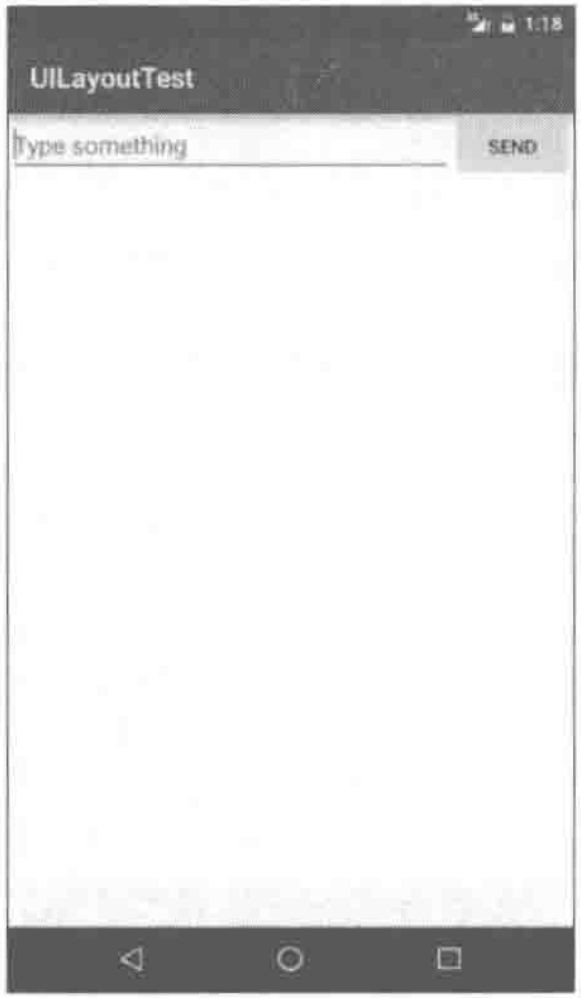
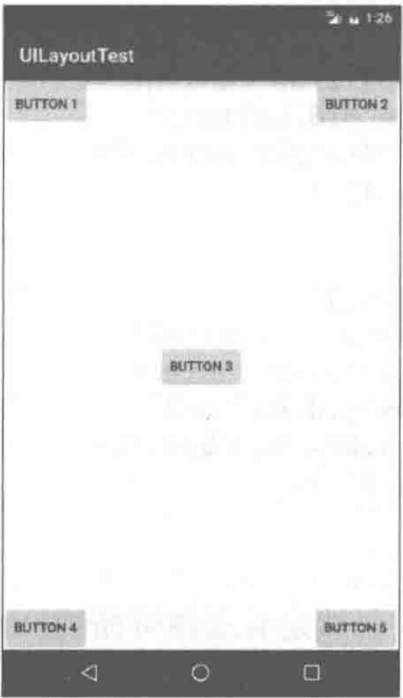
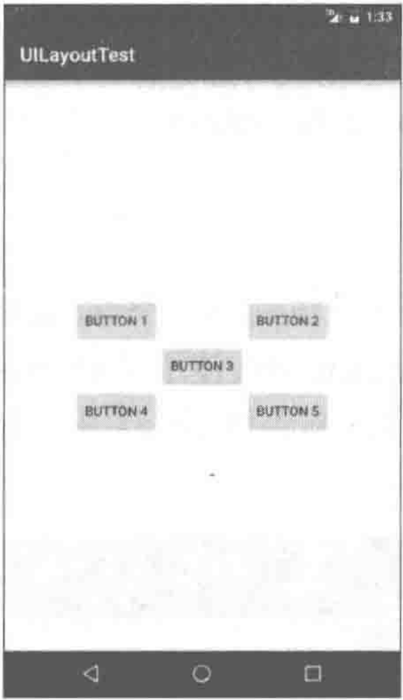
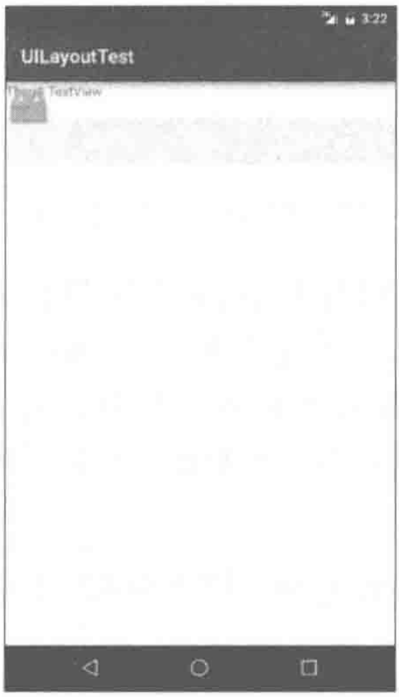
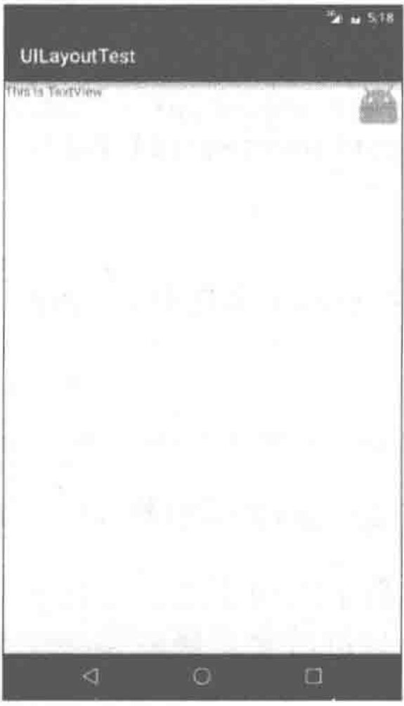
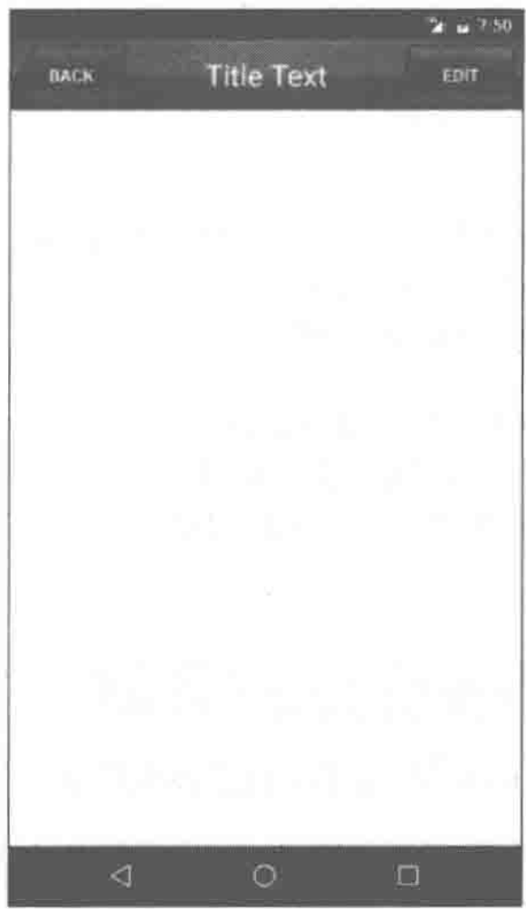
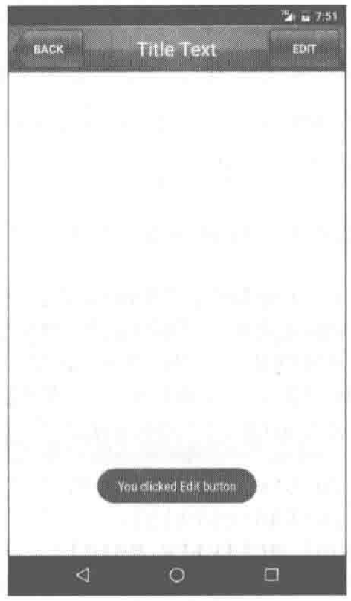

# 如何编写程序界面

Android中有多种编写程序界面的方式可供选择。Android Studio和Eclipse中都提供了相应的可视化编辑器，允许使用拖放控件的方式来编写布局，并能在视图上直接修改控件的属性。不过并不推荐使用这种方式来编写界面，因为可视化编辑工具并不利于去真正了解界面背后的实现原理。通过这种方式制作出的界面通常不具有很好的屏幕适配性，而且当需要编写较为复杂的界面时可视化编辑工具将很难胜任。

因此所有的界面都将通过最基本的方式去实现，即编写XML代码。完全掌握了使用XML来编写界面的方法之后，不管是进行高复杂度的界面实现，还是分析和修改当前现有界面，都将是手到擒来。讲了这么多理论的东西，也是时候学习一下到底如何编写程序界面了，下面就从Android中几种常见的控件开始。

# 常用控件的使用方法

Android提供了大量的UI控件，合理地使用这些控件就可以非常轻松地编写出相当不错的界面，下面我们就挑选几种常用的控件，详细介绍一下它们的使用方法。

首先新建一个UIWidgetTest项目，简单起见，我们还是允许Android Studio自动创建活动。活动名和布局名都使用默认值。

```xml
<?xml version="1.0" encoding="utf-8"?>
<LinearLayout xmlns:android="http://schemas.android.com/apk/res/android"
    android:orientation="vertical"
    android:layout_width="match_parent"
    android:layout_height="match_parent">
    <TextView
        android:layout_width="match_parent"
        android:layout_height="wrap_content"
        android:id="@+id/text_view"
        android:gravity="center"
        android:textSize="24sp"
        android:textColor="#00ff00"
        android:text="This is TextView">

    </TextView>
    <Button android:id="@+id/button"
        android:layout_width="match_parent"
        android:layout_height="wrap_content"
        android:textAllCaps="false"
        android:text="Button">

    </Button>
    <EditText android:id="@+id/edit_text"
        android:layout_width="match_parent"
        android:layout_height="wrap_content">

    </EditText>
</LinearLayout>
```

Android控件的使用规律：用法基本上都很相似，给控件定义一个id，再指定控件的宽度和高度，然后再适当加入一些控件特有的属性就差不多了。所以使用XML来编写界面其实一点都不难，完全可以不用借助任何可视化工具来实现。

一些做得比较人性化的软件会在输入框里显示一些提示性的文字，然后一旦用户输入了任何内容，这些提示性的文字就会消失。这种提示功能在Android里是非常容易实现的，我们甚至不需要做任何的逻辑控制，因为系统已经帮我们都处理好了。修改`activity_main.xml`，如下所示：

```xml
    <EditText android:id="@+id/edit_text"
        android:layout_width="match_parent"
        android:layout_height="wrap_content"
        android:hint="Type something here">
        <!-- 这里使用android:hint 属性指定了一段提示性的文本 -->
    </EditText>
```

# 3种基本布局

一个丰富的界面总是要由很多个控件组成的，那如何才能让各个控件都有条不紊地摆放在界面上，而不是乱糟糟的呢？这就需要借助**布局**来实现了。布局是一种可用于放置很多控件的容器，它可以按照一定的规律调整内部控件的位置，从而编写出精美的界面。当然，布局的内部除了放置控件外，也可以放置布局，通过多层布局的嵌套，我们就能够完成一些比较复杂的界面实现。

准备工作：新建一个UILayoutTest项目。

## 线性布局

LinearLayout又称作线性布局。

这个布局会将他所包含的控件在线性方向上依次排列。

### 排列方向：orientation

`android:orientation`属性指定了排列方向。若指定`vertical`则会在垂直方向排列，如果指定的是horizontal则会在水平方向排列。如果不指定`android:orientation`属性的值，默认的排列方向就是`horizontal`。

如果LinearLayout的排列方向是horizontal，内部的控件就绝对不能将`宽度`指定为`match_parent`，因为这样的话，单独一个控件就会将整个水平方向占满，其他的控件就没有可放置的位置了。同样的道理，如果LinearLayout的排列方向是vertical，内部的控件就不能将`高度`指定为`match_parent`。

### 对齐方式：layout_gravity

`android:layout_gravity`属性，和`android:gravity`属性看起来有些相似，这两个属性有什么区别呢？其实从名字就可以看出，`android:gravity`用于指定文字在控件中的对齐方式，而`android:layout_gravity`用于指定控件在布局中的对齐方式。`android:layout_gravity`的可选值和`android:gravity`差不多，但是需要注意，当LinearLayout的排列方向是`horizontal`时，只有垂直方向上的对齐方式才会生效，因为此时水平方向上的长度是不固定的，每添加一个控件，水平方向上的长度都会改变，因而无法指定该方向上的对齐方式。同样的道理，当LinearLayout的排列方向是`vertical`时，只有水平方向上的对齐方式才会生效。`layout_gravity`支持的选项：`center_vertical`、`center`、`bottom`、`center_horizontal`、`clip_horizontal`、`clip_vertical`、`end`、`fill`、`fill_horizontal`、`fill_vertical`、`left`、`right`、`start`、`top`。

修改`activity_main.xml`中的代码：

```xml
<LinearLayout xmlns:android="http://schemas.android.com/apk/res/android"
    android:orientation="horizontal"
    android:layout_width="match_parent"
    android:layout_height="match_parent">
    <Button android:id="@+id/button1"
        android:layout_height="wrap_content"
        android:layout_width="wrap_content"
        android:layout_gravity="top"
        android:text="Button 1">
    </Button>
    <Button android:id="@+id/button2"
        android:layout_height="wrap_content"
        android:layout_width="wrap_content"
        android:layout_gravity="center_vertical"
        android:text="Button 1">
    </Button>
    <Button android:id="@+id/button3"
        android:layout_height="wrap_content"
        android:layout_width="wrap_content"
        android:layout_gravity="bottom"
        android:text="Button 1">
    </Button>

</LinearLayout>
```



### 比例占位：layout_weight

此属性允许我们使用比例的方式来指定控件的大小，它在手机屏暮的适配性方面可以起到非常重要的作用。比如我们正在编写一个消息发送界面、需要一个文本编辑框和一个发送按钮，修改`activity_main.xml`中的代码、如下所示：

```xml
<LinearLayout xmlns:android="http://schemas.android.com/apk/res/android"
    android:orientation="horizontal"
    android:layout_width="match_parent"
    android:layout_height="match_parent">
    <EditText android:id="@+id/input_message"
        android:layout_width="0dp"
        android:layout_height="wrap_content"
        android:layout_weight="1"
        android:hint="Type something">
        
    </EditText>
    <Button android:id="@+id/send"
        android:layout_width="0dp"
        android:layout_height="wrap_content"
        android:layout_weight="1"
        android:text="Send">
        
    </Button>

</LinearLayout>
```

这里将EditText和Button的宽度都指定成了`0dp`，这样文本编辑框和按钮还能显示出来吗？不用担心，由于使用了`android:layout_weight`属性，此时控件的宽度就不应该再由`android:layout_width`来决定，这里指定成`0dp`是一种比较规范的写法。在EditText和Button里都将`android:layout_weight`属性的值指定为1。这表示EditText和Button将在水平方向平分宽度。

> dp是Android中用于指定控件大小、间距等属性的单位。

为什么将`android:layout_weight`属性的值同时指定为1就会平分屏幕宽度呢？其实原理也很简单，系统会先把LinearLayout下所有控件指定的`layout_weight`值相加，得到一个总值，然后每个控件所占大小的比例就是用该控件的`layout_weight`值除以刚才算出的总值。因此如果想让EditText占据屏幕宽度的3/5。Button占据屏幕宽度的2/5，只需要将EditText的`layout_weight`改成3，Button的`layout_weight`改成2就可以了。



我们还可以通过指定部分控件的`layout_weight`值来实现更好的效果。修改`activity_main.xml`中的代码，如下所示：

```xml
<LinearLayout xmlns:android="http://schemas.android.com/apk/res/android"
    android:orientation="horizontal"
    android:layout_width="match_parent"
    android:layout_height="match_parent">
    <EditText android:id="@+id/input_message"
        android:layout_width="0dp"
        android:layout_height="wrap_content"
        android:layout_weight="1"
        android:hint="Type something">
    </EditText>
    <Button android:id="@+id/send"
        android:layout_width="wrap_content"
        android:layout_height="wrap_content"
        android:text="Send">        
    </Button>
        
</LinearLayout>
```

这里我们仅指定了EditText的`android:layout_weight`属性，并将Button的宽度改回`wrap_content`。这表示Button的宽度仍然按照`wrap_content`来计算，而EditText则会占满屏幕所有的剩余空间。使用这种方式编写的界面，不仅在各种屏幕的适配方面会非常好，而且看起来也更加舒服。



## 相对布局

RelativeLayout又称作相对布局，也是一种非常常用的布局。和LinearLayout的排列规则不同，RelativeLayout显得更加随意一些，它可以通过相对定位的方式让控件出现在布局的任何位置。也正因为如此，RelativeLayout中的属性非常多，不过这些属性都是有规律可循的，其实并不难理解和记忆。

### 相对于parent

修改`activity_main.xml`中的代码，如下所示：

```xml
<RelativeLayout xmlns:android="http://schemas.android.com/apk/res/android"
    android:layout_width="match_parent"
    android:layout_height="match_parent">
    <Button
        android:layout_width="wrap_content"
        android:layout_height="wrap_content"
        android:layout_alignParentLeft="true"
        android:layout_alignParentTop="true"
        android:text="Button 1">

    </Button>
    <Button
        android:layout_width="wrap_content"
        android:layout_height="wrap_content"
        android:layout_alignParentLeft="true"
        android:layout_alignParentBottom="true"
        android:text="Button 2">

    </Button>
    <Button
        android:layout_width="wrap_content"
        android:layout_height="wrap_content"
        android:layout_centerInParent="true"
        android:text="Button 3">

    </Button>
    <Button
        android:layout_width="wrap_content"
        android:layout_height="wrap_content"
        android:layout_alignParentRight="true"
        android:layout_alignParentTop="true"
        android:text="Button 4">

    </Button>
    <Button
        android:layout_width="wrap_content"
        android:layout_height="wrap_content"
        android:layout_alignParentRight="true"
        android:layout_alignParentBottom="true"
        android:text="Button 5">

    </Button>
</RelativeLayout>
```

以上代码已经不需要再做过多解释了，因为实在是太好理解了。我们让`Button1`和父布局的左上角对齐，`Button2`和父布局的右上角对齐，`Button3`居中显示，`Button4`和父布局的左下角对齐，`Button5`和父布局的右下角对齐。虽然`android:layout_alignParentLeft`、`android:Layout alignParentTop`、`android:layout_alignParentRight`、`android:layout_alignParentBottom`、`android:layout_centerInParent`这几个属性我们之前都没接触过，可是它们的名字已经完全说明了它们的作用。



### 相对于控件

上面例子中的每个控件都是相对于父布局进行定位的，那控件可不可以相对于控件进行定位呢？当然是可以的，修改`activity_main.xml`中的代码，如下所示：

```xml
<RelativeLayout xmlns:android="http://schemas.android.com/apk/res/android"
    android:layout_width="match_parent"
    android:layout_height="match_parent">
    <Button android:id="@+id/button3"
        android:layout_width="wrap_content"
        android:layout_height="wrap_content"
        android:layout_centerInParent="true"
        android:text="Button 3">
    </Button>
    <Button android:id="@+id/button1"
        android:layout_width="wrap_content"
        android:layout_height="wrap_content"
        android:layout_above="@id/button3"
        android:layout_toLeftOf="@id/button3"
        android:text="Button 1">
    </Button>
    <Button android:id="@+id/button2"
        android:layout_width="wrap_content"
        android:layout_height="wrap_content"
        android:layout_above="@id/button3"
        android:layout_toRightOf="@id/button3"
        android:text="Button 2">
    </Button>
    <Button android:id="@+id/button4"
        android:layout_width="wrap_content"
        android:layout_height="wrap_content"
        android:layout_below="@id/button3"
        android:layout_toLeftOf="@id/button3"
        android:text="Button 4">
    </Button>
    <Button android:id="@+id/button5"
        android:layout_width="wrap_content"
        android:layout_height="wrap_content"
        android:layout_below="@id/button3"
        android:layout_toRightOf="@id/button3"
        android:text="Button 5">
    </Button>
</RelativeLayout>
```

这次的代码稍微复杂一点，不过仍然是有规律可循的。`android:layout_above`属性可以让一个控件位于另一个控件的上方，需要为这个属性指定相对控件id的引用，这里我们填入了`@id/button3`，表示让该控件位于Button3的上方。其他的属性也都是相似的，`android:layout_below`表示让一个控件位于另一个控件的下方，`android:layout_toLeftOf`表示让一个控件位于另一个控件的左侧，`android:layout_toRightOf`表示让一个控件位于另一个控件的右侧。

> 注意，当一个控件去引用另一个控件的id时，该控件一定要定义在引用控件的后面，不然会出现找不到id的情况。



RelativeLayout中还有另外一组相对于控件进行定位的属性，`android:layout_alignLeft`表示让一个控件的左边缘和另一个控件的左边缘对齐，`android:layout_alignRight`表示让一个控件的右边缘和另一个控件的右边缘对齐。此外，还有`android:layout_alignTop`和`android:layout_alignBottom`，道理都是一样的。

## 帧布局

FrameLayout又称作帧布局，它相比于前面两种布局就简单太多了，因此它的应用场景也少了很多。这种布局没有方便的定位方式，所有的控件都会默认摆放在布局的左上角。修改`activity_main.xml`中的代码，如下所示：

```xml
<FrameLayout xmlns:android="http://schemas.android.com/apk/res/android"
    android:layout_width="match_parent"
    android:layout_height="match_parent">
    <TextView
        android:layout_width="wrap_content"
        android:layout_height="wrap_content"
        android:text="This is Text View">
    </TextView>
    <ImageView
        android:layout_width="wrap_content"
        android:layout_height="wrap_content"
        android:src="@mipmap/ic_launcher">
    </ImageView>

</FrameLayout>
```

FrameLayout中只是放置了一个TextView和一个ImageView。需要注意的是，当前项目我们没有准备任何图片，所以这里ImageView直接使用了mipmap来访问`ic_launcher`这张图。



可以看到，文字和图片都是位于布局的左上角。由于ImageView是在 TextView之后添加的，因此图片压在了文字的上面。当然除了这种默认效果之外，我们还可以使用`layout_gravity`属性来指定控件在布局中的对齐方式，这和LinearLayout中的用法是相似的。修改`activity_main.xml`中的代码，如下所示：

```xml
<FrameLayout xmlns:android="http://schemas.android.com/apk/res/android"
    android:layout_width="match_parent"
    android:layout_height="match_parent">
    <TextView
        android:layout_width="wrap_content"
        android:layout_height="wrap_content"
        android:layout_gravity="left"
        android:text="This is Text View">
    </TextView>
    <ImageView
        android:layout_width="wrap_content"
        android:layout_height="wrap_content"
        android:layout_gravity="right"
        android:src="@mipmap/ic_launcher">
    </ImageView>

</FrameLayout>
```

我们指定TextView在FrameLayout中居左对齐，指定ImageView在FrameLayout中居右对齐。



总体来讲，FrameLayout由于定位方式的欠缺，导致它的应用场景也比较少，不过在用碎片的时候我们还是可以用到它的。

# 自定义控件

前面没有关注控件和布局的继承结构。

我们所用的所有**控件**都是直接或间接继承自View的，所用的所有**布局**都是直接或间接继承自ViewGroup的。View是Android中最基本的一种UI组件，它可以在屏幕上绘制一块矩形区域，并能响应这块区域的各种事件，因此，我们使用的各种控件其实就是在View的基础之上又添加了各自特有的功能。而ViewGroup则是一种特殊的View，它可以包含很多子View和子ViewGroup。是一个用于放置控件和布局的容器。

当系统自带的控件并不能满足我们的需求时，可以利用上面的继承结构来创建自定义控件呢。有两种简单方法创建自定义控件。

先将准备工作做好，创建一个UICustomViews项目。

## 引入布局

如果用过iPhone应该会知道，几乎每一个iPhone应用的界面顶部都会有一个标题栏，标题栏上会有一到两个按钮可用于返回或其他操作（iPhone没有实体返回键）。现在很多Android程序也都喜欢模仿iPhone的风格，在界面的顶部放置一个标题栏。虽然Android系统已经给每个活动提供了标题栏功能，但这里我们决定先不使用它，而是创建一个自定义的标题栏。

经过前面的知识，创建一个标题栏布局不是什么困难的事情了，只需要加入两个Button和一个TextView，然后在布局中摆放好就可以了。可是这样做却存在着一个问题，一般我们的程序中可能有很多个活动都需要这样的标题栏，如果在每个活动的布局中都编写一遍同样的标题栏代码，明显就会导致代码的大量重复。这个时候我们就可以使用**引入布局**的方式来解决这个问题，新建一个布局`title.xml`，代码如下所示：

```xml
<LinearLayout xmlns:android="http://schemas.android.com/apk/res/android"
    android:layout_width="match_parent"
    android:layout_height="wrap_content"
    android:background="@drawable/title_bg">
    <Button
        android:id="@+id/title_back"
        android:layout_width="wrap_content"
        android:layout_height="wrap_content"
        android:layout_gravity="center"
        android:layout_margin="5dp"
        android:background="@drawable/back_bg"
        android:text="Back"
        android:textColor="#fff">
        
    </Button>
    <TextView
        android:id="@+id/title_text"
        android:layout_width="0dp"
        android:layout_height="wrap_content"
        android:layout_gravity="center"
        android:layout_weight="1"
        android:gravity="center"
        android:text="Title Text"
        android:textColor="#fff"
        android:textSize="24sp">
        
    </TextView>
    <Button
        android:id="@+id/title_edit"
        android:layout_width="wrap_content"
        android:layout_height="wrap_content"
        android:layout_gravity="center"
        android:layout_margin="5dp"
        android:background="@drawable/edit_bg"
        android:text="Edit"
        android:textColor="#fff">
        
    </Button>
</LinearLayout>
```

可以看到，我们在LinearLayout中分别加入了两个Button和一个TextView，左边的Button可用于返回，右边的Button可用于编辑，中间的TextView则可以显示一段标题文本。上面代码中的大多数属性都是你已经见过的，下面我来说明一下几个之前没有讲过的属性。`android:background`用于为布局或控件指定一个背景，可以使用颜色或图片来进行填充，这里提前准备3张图片`title_bg.png`、`back_bg.png`和`edit_bg.png`，分别用于作为标题栏、返回按钮和编辑按钮的背景。另外，在两个Button中都使用 `android:layout_marqin`这个属性，它可以指定控件在上下左右方向上偏移的距离，当然也可以使用`android:layout_marginLeft`或`android:layout_marginTop`等属性来单独指定控件在某个方向上偏移的距离。现在标题栏布局已经编写完成了，剩下的就是如何在程序中使用这个标题栏了，修改`activity_main.xml`中的代码，如下所示：

```xml
<LinearLayout xmlns:android="http://schemas.android.com/apk/res/android"
    android:layout_width="match_parent"
    android:layout_height="match_parent">
    
    <include layout="@layout/title"/>
    
</LinearLayout>
```

只需要通过一行include语句将标题栏布局引入进来就可以了。

最后别忘了在MainActivity中将系统自带的标题栏隐藏掉，代码如下所示：

```java
public class MainActivity extends AppCompatActivity {
    @Override
    protected void onCreate(Bundle savedInstanceState) {
        super.onCreate(savedInstanceState);
        setContentView(R.layout.activity_main);
        ActionBar actionBar = getSupportActionBar();
        if (actionBar != null) {
            actionbar.hide();
        }
    }
}
// 这里调用了getSupportActionBar方法来获得ActionBar的实例，然后再调用ActionBar的hide方法将标题栏隐藏起来。
```



## 创建自定义控件

引入布局的技巧确实解决了重复编写布局代码的问题，但是如果布局中有一些控件要求能够响应事件，我们还是需要在每个活动中为这些控件单独编写一次事件注册的代码。比如说标题栏中的返回按钮，其实不管是在哪一个活动中，这个按钮的功能都是相同的，即销毁当前活动。而如果在每一个活动中都需要重新注册一遍返回按钮的点击事件，无疑会增加很多重复代码，这种情况最好是使用自定义控件的方式来解决。新建TitleLayout继承自LinearLayout，让它成为我们自定义的标题栏控件，代码如下所示：

```java
public class TitleLayout extends LinearLayout {
    public TitleLayout(Context context, AttributeSet attrs) {
        super(context, attrs);
        LayoutInflater.from(context).inflate(R.layout.title, this);
    }
}
```

首先我们重写了LinearLayout中带有两个参数的构造函数，在布局中引入TitleLayout控件就会调用这个构造函数。然后在构造函数中需要对标题栏布局进行动态加载，这就要借助`LayoutInflater`来实现了。通过Layoutlnflater的from方法可以构建出一个LayoutInflater对象，然后调用inflate方法就可以动态加载一个布局文件，inflate方法接收两个参数，第一个参数是要加载的布局文件的id，这里我们传入 `R.layout.titel`，第二个参数是给加载好的布局再添加一个父布局，这里我们想要指定为TitleLayout，于是直接传入this。现在自定义控件已经创建好了，然后我们需要在布局文件中添加这个自定义控件，修改`activity_main.xml`中的代码，如下所示：

```xml
<LinearLayout xmlns:android="http://schemas.android.com/apk/res/android"
    android:layout_width="match_parent"
    android:layout_height="match_parent">
    <com.example.uicustomviews.TitleLayout
        android:layout_width="match_parent"
        android:layout_height="wrap_content"/>

</LinearLayout>
```

添加自定义控件和添加普通控件的方式基本是一样的，只不过**在添加自定义控件的时候需要指明控件的完整类名**，包名在这里是不可以省略的。重新运行程序，会发现此时效果和使用引入布局方式的效果是一样的。下面尝试为标题栏中的按钮注册点击事件，修改TitleLayout中的代码，如下所示：

```java
public class TitleLayout extends LinearLayout {
    public TitleLayout(Context context, AttributeSet attrs) {
        super(context, attrs);
        LayoutInflater.from(context).inflate(R.layout.title, this);
        Button titleBack = (Button) findViewById(R.id.title_back);
        Button titleEdit = (Button) findViewById(R.id.title_edit);
        titleBack.setOnClickListener(new OnClickListener() {
            @Override
            public void onClick(View view) {
                ((Activity) getContext()).finish();
            }
        });
        titleEdit.setOnClickListener(new OnClickListener() {
            @Override
            public void onClick(View view) {
                Toast.makeText(getContext(), "You clicked Edit button",
                        Toast.LENGTH_SHORT).show();
            }
        });
    }
}
```

如此一来，原有的标题栏布局在MainActivity中隐藏，后来的自定义标题栏在TitleLayout.java中动态加载。



首先还是通过`findViewById`方法得到按钮的实例，然后分别调用setOnClickListener方法给两个按钮注册了点击事件，当点击返回按钮时销毁掉当前的活动，当点击编辑按钮时弹出一段文本。

这样的话，每当我们在一个布局中引入TitleLayout时，返回按钮和编辑按钮的点击事件就已经自动实现好了，这就省去了很多编写重复代码的工作。
