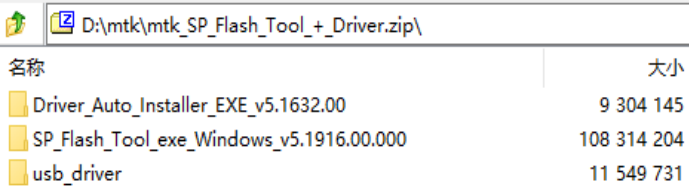

# git

参考文章：[Git三大特色之Stage](https://blog.csdn.net/qq_32452623/article/details/78417609)

## 三个区

Git本地数据管理，大概可以分为三个区，工作区、暂存区、版本库。

1. 工作区（Working Directory）是我们直接编辑的地方，例如 Android Studio 打开的项目，记事本打开的文本等，肉眼可见，直接操作。
2. 暂存区（Stage 或 Index）是数据暂时存放的区域，可在工作区和版本库之间进行数据的友好交流。
3. 版本库（commit History）存放已经提交的数据，push 的时候，就是把这个区的数据 push 到远程仓库了。

## Stage（暂存区）赋予Git更多灵活性

* 修改了4个文件，在不放弃任何修改的情况下，其中一个文件不想提交，如何操作？（没add: `git add`；已经add: `git reset --soft`）
* 修改到一半的文件，突然间不需要或者放弃修改了，怎么恢复未修改前文件？ (`git checkout`)
* 代码写一半，被打断去做其他功能开发，未完成代码保存？(`git stash`)
* 代码写一半，发现忘记切换分支了？(`git stash & git checkout`)
* 代码需要回滚了？（`git reset`）

上面提到的 checkout & stash & reset 等命令，通过不同的参数搭配使用，可以在工作区，暂存区和版本库之间，轻松进行数据的来回切换。

## stash的使用场景

此时我在`feature_666`分支，非常聚精会神加持高专注地实现一个功能666模块，简直键盘如飞的编写代码。然后这时，客户反馈出一个bug，非常严重，必须立马解决，优先级为0！于是，我需要去到release分支去checkout新的分支去工作了，但是666功能还没完成怎么办？

此时面临着一个选择题：

A：提交后切换，代码保存到分支`feature_666`，却产生一个无意义的提交。

B：不提交直接切换，然而这个选项根本没人会选。

是不是很难选，此时，别忘记还有C选项！

C：使用`git stash`，将当前修改(未提交的代码)存入缓存区，切换分支修改`bug`，回来再通过`git stash pop`取出来。

# repo

```
usage: repo COMMAND [ARGS]
The most commonly used repo commands are:
  abandon        Permanently abandon a development branch
  branch         View current topic branches
  branches       View current topic branches
  checkout       Checkout a branch for development
  cherry-pick    Cherry-pick a change.
  diff           Show changes between commit and working tree
  diffmanifests  Manifest diff utility
  download       Download and checkout a change
  gitc-delete    Delete a GITC Client.
  gitc-init      Initialize a GITC Client.
  grep           Print lines matching a pattern
  info           Get info on the manifest branch, current branch or unmerged branches
  init           Initialize a repo client checkout in the current directory
  list           List projects and their associated directories
  overview       Display overview of unmerged project branches
  prune          Prune (delete) already merged topics
  rebase         Rebase local branches on upstream branch
  smartsync      Update working tree to the latest known good revision
  stage          Stage file(s) for commit
  start          Start a new branch for development
  status         Show the working tree status
  sync           Update working tree to the latest revision
  upload         Upload changes for code review
See 'repo help <command>' for more information on a specific command.
See 'repo help --all' for a complete list of recognized commands.
```

## repo init

`repo init -u git@gitlab.gz.cvte.cn:tc02_mtk_android10_0/manifest.git -m mtk8788_s..wo_tc02a_sys828.xml -b develop_dt15`

repo init：Initialize a repo client checkout in the current directory，选项：（可通过`repo help init`查看）

| 选项                                        | 含义                                                |
| ------------------------------------------- | --------------------------------------------------- |
| `-u URL`, `--manifest-url=URL`              | manifest repository location                        |
| `-m NAME.xml`, `--manifest-name=NAME.xml`   | initial manifest file                               |
| `-b REVISION`, `--manifest-branch=REVISION` | manifest branch or revision (use HEAD for  default) |

## repo sync

repo sync：Update working tree to the latest revision。可带`-j10`指定并行数量。

### 描述

```
Update working tree to the latest revision

Usage: repo sync [<project>...]

Options:
  -h, --help            show this help message and exit
  -j JOBS, --jobs=JOBS  number of jobs to run in parallel (default: 1; based
                        on number of CPU cores)
  --jobs-network=JOBS   number of network jobs to run in parallel (defaults to
                        --jobs)
  --jobs-checkout=JOBS  number of local checkout jobs to run in parallel
                        (defaults to --jobs)
  -f, --force-broken    obsolete option (to be deleted in the future)
  --fail-fast           stop syncing after first error is hit
  --force-sync          overwrite an existing git directory if it needs to
                        point to a different object directory. WARNING: this
                        may cause loss of data
  --force-remove-dirty  force remove projects with uncommitted modifications
                        if projects no longer exist in the manifest. WARNING:
                        this may cause loss of data
  -l, --local-only      only update working tree, don't fetch
  --no-manifest-update, --nmu
                        use the existing manifest checkout as-is. (do not
                        update to the latest revision)
  -n, --network-only    fetch only, don't update working tree
  -d, --detach          detach projects back to manifest revision
  -c, --current-branch  fetch only current branch from server
  --no-current-branch   fetch all branches from server
  -m NAME.xml, --manifest-name=NAME.xml
                        temporary manifest to use for this sync
  --clone-bundle        enable use of /clone.bundle on HTTP/HTTPS
  --no-clone-bundle     disable use of /clone.bundle on HTTP/HTTPS
  -u MANIFEST_SERVER_USERNAME, --manifest-server-username=MANIFEST_SERVER_USERNAME
                        username to authenticate with the manifest server
  -p MANIFEST_SERVER_PASSWORD, --manifest-server-password=MANIFEST_SERVER_PASSWORD
                        password to authenticate with the manifest server
  --fetch-submodules    fetch submodules from server
  --use-superproject    use the manifest superproject to sync projects;
                        implies -c
  --no-use-superproject
                        disable use of manifest superprojects
  --tags                fetch tags
  --no-tags             don't fetch tags (default)
  --optimized-fetch     only fetch projects fixed to sha1 if revision does not
                        exist locally
  --retry-fetches=RETRY_FETCHES
                        number of times to retry fetches on transient errors
  --prune               delete refs that no longer exist on the remote
                        (default)
  --no-prune            do not delete refs that no longer exist on the remote
  -s, --smart-sync      smart sync using manifest from the latest known good
                        build
  -t SMART_TAG, --smart-tag=SMART_TAG
                        smart sync using manifest from a known tag

  Logging options:
    -v, --verbose       show all output
    -q, --quiet         only show errors

  Multi-manifest options:
    --outer-manifest    operate starting at the outermost manifest
    --no-outer-manifest
                        do not operate on outer manifests
    --this-manifest-only
                        only operate on this (sub)manifest
    --no-this-manifest-only, --all-manifests
                        operate on this manifest and its submanifests

  repo Version options:
    --no-repo-verify    do not verify repo source code

Description

The 'repo sync' command synchronizes local project directories with the remote
repositories specified in the manifest. If a local project does not yet exist,
it will clone a new local directory from the remote repository and set up
tracking branches as specified in the manifest. If the local project already
exists, 'repo sync' will update the remote branches and rebase any new local
changes on top of the new remote changes.

'repo sync' will synchronize all projects listed at the command line. Projects
can be specified either by name, or by a relative or absolute path to the
project's local directory. If no projects are specified, 'repo sync' will
synchronize all projects listed in the manifest.

The -d/--detach option can be used to switch specified projects back to the manifest revision. This option is especially helpful if the project is currently on a topic branch, but the manifest revision is temporarily needed.

The -s/--smart-sync option can be used to sync to a known good build as
specified by the manifest-server element in the current manifest. The
-t/--smart-tag option is similar and allows you to specify a custom tag/label.

The -u/--manifest-server-username and -p/--manifest-server-password options can
be used to specify a username and password to authenticate with the manifest
server when using the -s or -t option.

If -u and -p are not specified when using the -s or -t option, 'repo sync' will
attempt to read authentication credentials for the manifest server from the
user's .netrc file.

'repo sync' will not use authentication credentials from -u/-p or .netrc if the
manifest server specified in the manifest file already includes credentials.

By default, all projects will be synced. The --fail-fast option can be used to
halt syncing as soon as possible when the first project fails to sync.

The --force-sync option can be used to overwrite existing git directories if
they have previously been linked to a different object directory. WARNING: This
may cause data to be lost since refs may be removed when overwriting.

The --force-remove-dirty option can be used to remove previously used projects
with uncommitted changes. WARNING: This may cause data to be lost since
uncommitted changes may be removed with projects that no longer exist in the
manifest.

The --no-clone-bundle option disables any attempt to use $URL/clone.bundle to
bootstrap a new Git repository from a resumeable bundle file on a content
delivery network. This may be necessary if there are problems with the local
Python HTTP client or proxy configuration, but the Git binary works.

The --fetch-submodules option enables fetching Git submodules of a project from
server.

The -c/--current-branch option can be used to only fetch objects that are on the
branch specified by a project's revision.

The --optimized-fetch option can be used to only fetch projects that are fixed
to a sha1 revision if the sha1 revision does not already exist locally.

The --prune option can be used to remove any refs that no longer exist on the
remote.

SSH Connections

If at least one project remote URL uses an SSH connection (ssh://, git+ssh://,
or user@host:path syntax) repo will automatically enable the SSH ControlMaster
option when connecting to that host. This feature permits other projects in the
same 'repo sync' session to reuse the same SSH tunnel, saving connection setup
overheads.

To disable this behavior on UNIX platforms, set the GIT_SSH environment variable
to 'ssh'. For example:

  export GIT_SSH=ssh
  repo sync

Compatibility

This feature is automatically disabled on Windows, due to the lack of UNIX
domain socket support.

This feature is not compatible with url.insteadof rewrites in the user's
~/.gitconfig. 'repo sync' is currently not able to perform the rewrite early
enough to establish the ControlMaster tunnel.

If the remote SSH daemon is Gerrit Code Review, version 2.0.10 or later is
required to fix a server side protocol bug.
```

### `-d`, `--detach`

参考文章：https://segmentfault.com/a/1190000021005727

使用repo sync命令来同步远端服务器的Android代码，如果本地修改了代码但还没有commit，会提示无法sync：`error: android/frameworks/base/: contains uncommitted changes`。此时，可以使用git reset命令丢弃本地修改（如果没有git add到暂存区，其实git checkout也可以），然后再执行repo sync来同步代码。如果想要不丢失本地修改，强制同步远端服务器代码，可以加上-d选项，`repo sync -d`命令会将HEAD强制指向repo manifest版本，而忽略本地的改动。

**注意**：加上`-d`选项只表示忽略本地改动，可以强制同步远端服务器的代码，但是**本地修改的文件还是保持改动不变，不会强制覆盖掉本地修改**。而且同步之后，本地的分支指向会发生变化，不再指向原来的分支。具体举例如下。

1. 执行`repo sync -d`之前的分支信息：
   ```
   $ git branch
   * curent_branch_xxx
   ```

2. 执行`repo sync -d`之后的分支信息：
   ```
   $ git branch
   * (detached from 715faf5)
     curent_branch_xxx
   ```

   即，从远端服务器同步的代码，是同步到跟踪远端服务器的分支，还没有从git仓库把代码checkout到本地，而当前本地修改的代码处在未命名分支下，是不同的分支，互不干扰，才能在不丢弃本地修改的情况下，强制同步远端服务器代码。

3. 执行`git status`命令，可以看到本地还是有修改过且还没有 commit 的文件，同步远端服务器代码后，并不会强制覆盖本地文件的修改：
   ```
   $ git status
   HEAD detached at 715faf5
   Changes not staged for commit:
     (use "git add <file>..." to update what will be committed)
     (use "git checkout -- <file>..." to discard changes in working directory)
           modified:   vendor/chioverride/default/g_pipelines.h
           modified:   vendor/topology/g_usecase.xml
   ```

即，如果想要丢弃本地修改、让本地代码跟同步后的 git 仓库代码一致，`repo sync -d`命令达不到这个效果。

另外，repo sync有一个`--force-sync`选项，具体说明如下：

> **--force-sync**
> overwrite an existing git directory if it needs to point to a different object directory. WARNING: this may cause loss of data

从说明来看，像是可以强制同步，且可能丢失本地改动。但是实际测试发现，这个选项并不能强制覆盖本地的改动。如果本地文件发生改动，加上这个选项也是会 sync 报错：

```bash
$ repo sync --force-sync .
Fetching project tools/
error: tools/: contains uncommitted changes
```

如果想要覆盖本地修改的代码，则需要继续：

```bash
# 将HEAD强制指向manifest库，忽略本地的改动
repo sync -d
# Remove all working directory (and staged) changes
repo forall -c 'git reset --hard'
# Clean untracked files
repo forall -c 'git clean -f -d'
# 拉代码
repo sync -c # fetch only current branch from server
```

> forall的作用：Run a shell command in each project
```
Usage: repo forall [<project>...] -c <command> [<arg>...]
repo forall -r str1 [str2] ... -c <command> [<arg>...]

Options:
  -h, --help            show this help message and exit
  -j JOBS, --jobs=JOBS  number of jobs to run in parallel (default: 8; based
                        on number of CPU cores)
  -r, --regex           execute the command only on projects matching regex or
                        wildcard expression
  -i, --inverse-regex   execute the command only on projects not matching
                        regex or wildcard expression
  -g GROUPS, --groups=GROUPS
                        execute the command only on projects matching the
                        specified groups
  -c, --command         command (and arguments) to execute
  -e, --abort-on-errors
                        abort if a command exits unsuccessfully
  --ignore-missing      silently skip & do not exit non-zero due missing
                        checkouts
  --interactive         force interactive usage

  Logging options:
    -v, --verbose       show all output
    -q, --quiet         only show errors
    -p                  show project headers before output

  Multi-manifest options:
    --outer-manifest    operate starting at the outermost manifest
    --no-outer-manifest
                        do not operate on outer manifests
    --this-manifest-only
                        only operate on this (sub)manifest
    --no-this-manifest-only, --all-manifests
                        operate on this manifest and its submanifests

Run `repo help forall` to view the detailed manual.

Description

Executes the same shell command in each project.

The -r option allows running the command only on projects matching regex or
wildcard expression.

By default, projects are processed non-interactively in parallel. If you want to
run interactive commands, make sure to pass --interactive to force --jobs 1.
While the processing order of projects is not guaranteed, the order of project
output is stable.
```
因此，`repo forall -c 'git reset --hard'`表示，在每一个repo下属的git仓库目录中都执行`git reset --hard`指令。

## repo start

repo start：Start a new branch for development。选项：`--all`, begin branch in all projects。

# 编译

参考文章：[android编译分析之2—envsetup.sh](https://blog.51cto.com/u_15147256/2792451)

总的来说，android编译分两部分：

1. 编译前的准备工作，主要是在shell环境中提前设置了很多变量和函数；
2. 执行make进行编译，产生各种镜像文件。

## 流程

1. `source build/envsetup.sh`
2. `lunch`
3. pick a combo

```
$ . build/envsetup.sh
including device/mediatek/build/vendorsetup.sh
$ lunch
You're building on Linux

Lunch menu... pick a combo:
     1. aosp_arm-eng
     2. aosp_arm64-eng
     3. aosp_blueline-userdebug
     4. aosp_bonito-userdebug
     5. aosp_car_arm-userdebug
     6. aosp_car_arm64-userdebug
     7. aosp_car_x86-userdebug
     8. aosp_car_x86_64-userdebug
     9. aosp_cf_arm64_phone-userdebug
     10. aosp_cf_x86_64_phone-userdebug
     11. aosp_cf_x86_auto-userdebug
     12. aosp_cf_x86_phone-userdebug
     13. aosp_cf_x86_tv-userdebug
     14. aosp_crosshatch-userdebug
     15. aosp_marlin-userdebug
     16. aosp_sailfish-userdebug
     17. aosp_sargo-userdebug
     18. aosp_taimen-userdebug
     19. aosp_walleye-userdebug
     20. aosp_walleye_test-userdebug
     21. aosp_x86-eng
     22. aosp_x86_64-eng
     23. beagle_x15-userdebug
     24. fuchsia_arm64-eng
     25. fuchsia_x86_64-eng
     26. full_tb8321p2_bsp-eng
     27. full_tb8321p2_bsp-user
     28. full_tb8321p2_bsp-userdebug
     29. full_tb8321p2_bsp_2g-eng
     30. full_tb8321p2_bsp_2g-user
     31. full_tb8321p2_bsp_2g-userdebug
     32. full_tb8765ap1_64_bsp-eng
     33. full_tb8765ap1_64_bsp-user
     34. full_tb8765ap1_64_bsp-userdebug
     35. full_tb8765ap1_bsp-eng
     36. full_tb8765ap1_bsp-user
     37. full_tb8765ap1_bsp-userdebug
     38. full_tb8765ap1_bsp_1g-eng
     39. full_tb8765ap1_bsp_1g-user
     40. full_tb8765ap1_bsp_1g-userdebug
     41. full_tb8766p1_64_bsp-eng
     42. full_tb8766p1_64_bsp-user
     43. full_tb8766p1_64_bsp-userdebug
     44. full_tb8766p1_bsp_1g-eng
     45. full_tb8766p1_bsp_1g-user
     46. full_tb8766p1_bsp_1g-userdebug
     47. full_tb8768p1_64_bsp-eng
     48. full_tb8768p1_64_bsp-user
     49. full_tb8768p1_64_bsp-userdebug
     50. full_tb8768p2_64_bsp_sp-eng
     51. full_tb8768p2_64_bsp_sp-user
     52. full_tb8768p2_64_bsp_sp-userdebug
     53. full_tb8768tp1_64_bsp-eng
     54. full_tb8768tp1_64_bsp-user
     55. full_tb8768tp1_64_bsp-userdebug
     56. full_tb8788m1_64_wifi-eng
     57. full_tb8788m1_64_wifi-user
     58. full_tb8788m1_64_wifi-userdebug
     59. full_tb8788p1_64_bsp-eng
     60. full_tb8788p1_64_bsp-user
     61. full_tb8788p1_64_bsp-userdebug
     62. full_tb8788p1_64_wifi-eng
     63. full_tb8788p1_64_wifi-user
     64. full_tb8788p1_64_wifi-userdebug
        ...
     
Which would you like? [aosp_arm-eng] full_tb8788p1_64_wifi-userdebug
Enter customer product(default: s..wo):
not specific S..WO_CUSTOMER_PRODUCT, reset to s..wo.
device/mediateksample/tb8788p1_64_wifi/device.mk:196: warning: "---------Including s..wo apps---------"
```

lunch提示你做选择，可以直接回车，可以输入序号，也可以输入序号后的字符串。

编译时，直接执行make即可。AOSP代码的根目录下有一个`Makefile`，但是内容只有一句，包含了`build/core`目录下的`main.mk`，正如名字所示，`main.mk`是android编译系统中最主要的makefile。

```shell
### DO NOT EDIT THIS FILE ###
include build/make/core/main.mk
### DO NOT EDIT THIS FILE ###
```

## m、mm、mmm的区别

首先，使用这三个编译命令，需要提前在源码目录下执行如下命令，否则会提示命令找不到：

```bash
$ . build/envsetup.sh # 或者 source build/envsetup.sh
including device/mediatek/build/vendorsetup.sh
```

build/envsetup.sh这个脚本包含了很多的shell函数，有些函数是非常有用的，envsetup.sh中的第一个函数为hmm，类似于`-help`的功能，提示当执行完source后，android系统目前能干些什么，执行hmm。

```
~/myProject/DT15/alps$ hmm
Run "m help" for help with the build system itself.

Invoke ". build/envsetup.sh" from your shell to add the following functions to your environment:
- lunch:      lunch <product_name>-<build_variant>
              Selects <product_name> as the product to build, and <build_variant> as the variant to
              build, and stores those selections in the environment to be read by subsequent
              invocations of 'm' etc.
- tapas:      tapas [<App1> <App2> ...] [arm|x86|mips|arm64|x86_64|mips64] [eng|userdebug|user]
- croot:      Changes directory to the top of the tree, or a subdirectory thereof.
- m:          Makes from the top of the tree.
- mm:         Builds all of the modules in the current directory, but not their dependencies.
- mmm:        Builds all of the modules in the supplied directories, but not their dependencies.
              To limit the modules being built use the syntax: mmm dir/:target1,target2.
- mma:        Builds all of the modules in the current directory, and their dependencies.
- mmma:       Builds all of the modules in the supplied directories, and their dependencies.
- provision:  Flash device with all required partitions. Options will be passed on to fastboot.
- cgrep:      Greps on all local C/C++ files.
- ggrep:      Greps on all local Gradle files.
- jgrep:      Greps on all local Java files.
- resgrep:    Greps on all local res/*.xml files.
- mangrep:    Greps on all local AndroidManifest.xml files.
- mgrep:      Greps on all local Makefiles files.
- sepgrep:    Greps on all local sepolicy files.
- sgrep:      Greps on all local source files.
- godir:      Go to the directory containing a file.
- allmod:     List all modules.
- gomod:      Go to the directory containing a module.
- pathmod:    Get the directory containing a module.
- refreshmod: Refresh list of modules for allmod/gomod.

Environment options:
- SANITIZE_HOST: Set to 'true' to use ASAN for all host modules. Note that
                 ASAN_OPTIONS=detect_leaks=0 will be set by default until the
                 build is leak-check clean.
- ANDROID_QUIET_BUILD: set to 'true' to display only the essential messages.

Look at the source to view more functions. The complete list is:
addcompletions add_lunch_combo allmod build_build_var_cache cgrep check_product check_type check_variant choosecombo chooseproduct choosetype choosevariant _complete_android_module_names core coredump_enable coredump_setup cproj croot _croot destroy_build_var_cache enable_zsh_completion findmakefile get_abs_build_var getbugreports get_build_var getlastscreenshot get_make_command getprebuilt getscreenshotpath getsdcardpath gettargetarch gettop ggrep godir gomod hmm is isviewserverstarted jgrep key_back key_home key_menu lunch _lunch m make mangrep mgrep mm mma mmm mmma pathmod pez printconfig print_lunch_menu provision qpid rcgrep refreshmod resgrep runhat runtest sepgrep setpaths set_sequence_number set_stuff_for_environment sgrep should_add_completion smoketest source_s..wo_setup source_vendorsetup startviewserver stopviewserver systemstack tapas tracedmdump treegrep validate_current_shell _wrap_build

```

- m：Makes from the top of the tree. 编译整个安卓源码树。即找到最顶层目录编译android。
- mm：Builds all of the modules in the current directory, but not their dependencies. 编译当前目录下的模块，当前目录下需要有Android.mk这个makefile文件，否则就往上找最近的Android.mk文件。
- mmm：Builds all of the modules in the supplied directories, but not their dependencies. To limit the modules being built use the syntax: `mmm dir/:target1,target2`. 编译指定路径下的模块，指定的路径下面需要有Android.mk这个文件。

```
~/myProject/DT15/alps$
mmm vendor/mediatek/proprietary/packages/apps/MtkSettings/
```

# adb push

项目开发中需要向安卓的目录下传输一些文件，因此记录一下adb pull的使用方式和adb push的使用。摸索完毕后，做一个记录。

首先声明一下，这两种使用方式都仅能在adb device列表里只有一个设备的时候使用，否则需要带上ip。

由于adb push表示向设备传输，adb pull表示向设备外传输。但是二者的用法都是从地址1向地址2传输因此，只介绍adb push。

## 传输文件

可以指定目标地点文件的名字，此时会对该文件进行覆盖，不要求传输的目标文件后缀和待传输文件一致，例如：`adb push C:\Users\Administrator\Desktop\123.txt /sdcard/test/321.c`，相当于传输到目的后进行了一次重命名。

也可以省略目标地点的名字，此时会在目标地点生成一个和传输文件同名的文件，同样会对目的地同名文件进行覆盖，例如：`adb push C:\Users\Administrator\Desktop\123.txt /sdcard/test/`

## 传输文件夹

传输文件夹时，只会在目的目录下生成一个同名的子目录，不论传输前是否包含斜杠作为结尾，例如：`adb push C:\Users\Administrator\Desktop\video\ /sdcard/test/`。上面这个语句在video后面或者是test后面不论加不加斜杠，都会在test目录下创建一个叫video的文件夹，并且包含vidio内原本的内容。

如果希望传输文件夹内的文件而不是传输文件夹，那么需要加上`.`，例如：`adb push C:\Users\Administrator\Desktop\video\. /sdcard/test/`，此时就会在test文件夹下放置video文件夹内的内容了。

`/drives/q/myProject/DT15/alps/out/target/product/tb8788p1_64_wifi  adb push . /product/priv-app/;adb shell stop;adb shell start`

## Android Q remount步骤

1. `adb shell am start com.android.settings/.Settings`
2. 关于，版本号，快速连续点击，进入开发者模式
3. `adb shell am start -a com.android.settings.APPLICATION_DEVELOPMENT_SETTINGS`
4. 打开OEM解锁
5. adb reboot bootloader
6. fastboot flashing unlock
7. press volume up-key（按音量上键）
8. fastboot reboot
9. adb root
10. adb disable-verity
11. adb reboot
12. adb root
13. adb remount

# 总结

大致测试了以上内容，基本够简单的使用了，如果连接了多个设备又想指定一台进行传输，那么指令上需要在adb和push直接加入`-s deviceId`，其中deviceId需要替换成用adb devices命令查看到的设备的名称（有可能是ip地址+端口）。例如：`adb -s 192.168.10.12:5432 push`

# 额外

```
  11/08/2022   11:04.56   /drives/q/myProject/DT15/alps/out/target/product/tb8788p1_64_wifi  adb root;adb remount product
adbd is already running as root
E Skipping /product
W No partitions to remount
/system/bin/remount exited with status 7
remount failed
                                                                                                                                                                                                 ✓

  11/08/2022   11:05.14   /drives/q/myProject/DT15/alps/out/target/product/tb8788p1_64_wifi  adb root;adb remount vendor
adbd is already running as root
E Skipping /vendor
W No partitions to remount
/system/bin/remount exited with status 7
remount failed
                                                                                                                                                                                                 ✓

  11/08/2022   11:05.21   /drives/q/myProject/DT15/alps/out/target/product/tb8788p1_64_wifi  adb reboot bootloader
                                                                                                                                                                                                 ✓

  11/08/2022   11:06.07   /drives/q/myProject/DT15/alps/out/target/product/tb8788p1_64_wifi  fastboot devices
S..WOS202110120008      fastboot
                                                                                                                                                                                                 ✓

  11/08/2022   11:06.26   /drives/q/myProject/DT15/alps/out/target/product/tb8788p1_64_wifi  fastboot flashing unlock
(bootloader) Start unlock flow

OKAY [  6.276s]
Finished. Total time: 6.276s
                                                                                                                                                                                                 ✓

  11/08/2022   11:07.02   /drives/q/myProject/DT15/alps/out/target/product/tb8788p1_64_wifi  fastboot reboot
Rebooting                                          OKAY [  0.003s]
Finished. Total time: 0.003s
                                                                                                                                                                                                 ✓
  11/08/2022   11:08.03   /drives/q/myProject/DT15/alps/out/target/product/tb8788p1_64_wifi  adb connect 192.168.137.230
connected to 192.168.137.230:5555
                                                                                                                                                                                                 ✓
  11/08/2022   11:09.42   /drives/q/myProject/DT15/alps/out/target/product/tb8788p1_64_wifi  adb root
restarting adbd as root
                                                                                                                                                                                                 ✓
  11/08/2022   11:09.45   /drives/q/myProject/DT15/alps/out/target/product/tb8788p1_64_wifi  adb disable-verity
using overlayfs
Successfully disabled verity
Now reboot your device for settings to take effect
                                                                                                                                                                                                 ✓

  11/08/2022   11:09.51   /drives/q/myProject/DT15/alps/out/target/product/tb8788p1_64_wifi  adb reboot
                                                                                                                                                                                                 ✓
  11/08/2022   11:10.37   /drives/q/myProject/DT15/alps/out/target/product/tb8788p1_64_wifi  adb root;adb remount
remount succeeded
                                                                                                                                                                                                 ✓
  11/08/2022   11:10.48   /drives/q/myProject/DT15/alps/out/target/product/tb8788p1_64_wifi  adb root;adb remount ;adb push product/priv-app/MtkSettings/ /product/priv-app/
adbd is already running as root
remount succeeded
product/priv-app/MtkSettings/: 3 files pushed, 0 skipped. 11.3 MB/s (34525797 bytes in 2.918s)
                                                                                                                                                                                                 ✓
  11/08/2022   11:11.11   /drives/q/myProject/DT15/alps/out/target/product/tb8788p1_64_wifi  adb root;adb remount ;adb push product/priv-app/MtkSettings/ /product/priv-app/;adb shell stop;adb shell start
adbd is already running as root
remount succeeded
product/priv-app/MtkSettings/: 3 files pushed, 0 skipped. 11.2 MB/s (34525817 bytes in 2.945s)
```

# MTK烧录

## 准备流程

软件：Windows系统、MTK烧录工具及驱动包 - `mtk_SP_Flash_Tool_+_Driver.zip`

解压MTK烧录工具及驱动包，有以下文件：



驱动安装：

1. 打开SP驱动安装程序：
   `Driver_Auto_Installer_EXE_v5.1632.00\Driver_Auto_Installer_SP_Drivers_20160804\DriverInstall.exe`。
2. 打开USB驱动安装程序：`usb_driver\setup.exe`

烧录工具程序：`SP_Flash_Tool_exe_Windows_v5.1916.00.000\flash_tool.exe`

1. 点击Download-Agent右边的choose按钮，选择当前烧录工具目录下的`MTK_AllInOne_DA.bin`文件；
2. 点击Scatter-loading File栏右边的choose按钮，选择系统固件包里的`MT6771_Android_scatter.txt`。
3. 选择三种模式之一，最后点击Download准备烧录。
4. 重启设备，进行烧录写入。
5. 烧录完成后，拔插设备电源，开机即可进入系统。

## 三种模式的差异

1. Format All + Download，对应的是全擦升级，会把各种标识擦除，比如写标识位、机器SN码。
2. Firmware Upgrade，也会重写各种标识，常在不同开发版本之间转换时使用，如user和userdebug之间转换。
3. Download Only，一般是同一开发版本下新旧版本号的切换，或者同版本号不同代码的调试使用。
