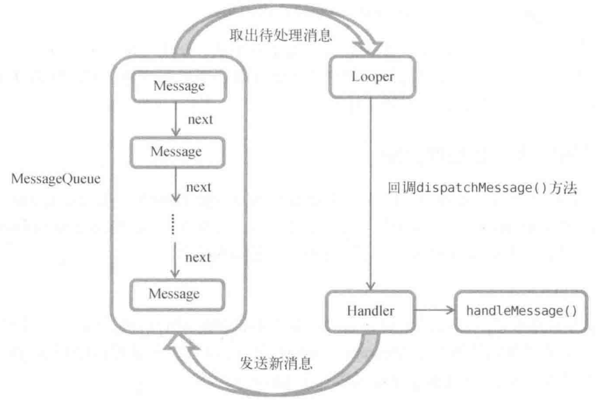

# 服务

服务是Android中实现程序后台运行的解决方案，适合不需要和用户交互而且长期运行的任务。服务的运行不依赖于任何用户界面，即使程序被切换到后台，或者用户打开了另外一个应用程序，服务仍然能够保持正常运行。不过需要注意的是，服务并不是运行在一个独立的进程当中的，而是依赖于创建服务时所在的应用程序进程。当某个应用程序进程被杀掉时，所有依赖于该进程的服务也会停止运行。另外，也不要被服务的后台概念所迷惑，实际上服务并不会自动开启线程，所有的代码都是默认运行在主线程当中的。也就是说，我们需要在服务的内部手动创建子线程，并在这里执行具体的任务，否则就有可能出现主线程被阻塞住的情况。

# Android多线程编程

当我们需要执行一些耗时操作，比如说发起一条网络请求时，考虑到网速等其他原因，服务器未必会立刻响应我们的请求，如果不将这类操作放在子线程里去运行，就会导致主线程被阻塞住，从而影响用户对软件的正常使用。

## 线程的基本用法

### 继承Thread

Android多线程编程其实并不比Java多线程编程特殊，基本都是使用相同的语法。比如说，定义一个线程只需要新建一个类继承自Thread，然后重写父类的run方法，并在里面编写耗时逻辑即可，如下所示：

```java
class MyThread extends Thread {
    @Override
    public void fun() {
        // 处理具体的逻辑
    }
}
```

那么该如何启动这个线程呢？其实很简单，只需要new出MyThread的实例，然后调用它的start方法，这样run方法中的代码就会在子线程当中运行了，如下所示：

```java
new MyThread().start();
```

### 实现接口Runnable

当然，使用继承的方式耦合性有点高，更多的时候我们都会选择使用实现Runnable接口的方式来定义一个线程，如下所示：

```java
class MyThread implements Runnable {
    @Override
    public void run() {
        // 处理具体的逻辑
    }
}
```

如果使用了这种写法，启动线程的方法也需要进行相应的改变，如下所示：

```java
MyThread myThread = new MyThread();
new Thread(myThread).start();
```

可以看到，Thread的构造函数接收一个Runnable参数，而我们new出的MyThread正是一个实现了Runnable接口的对象，所以可以直接将它传人到Thread的构造函数里。接着调用Thread的start方法，run方法中的代码就会在子线程当中运行了。

### 匿名类

如果你不想专门再定义一个类去实现Runnable接口，也可以使用匿名类的方式，这种写法更为常见。如下所示：

```java
new Thread(new Runnable() {
    @Override
    public void run() {
        // 处理具体的逻辑
    }
}).start();
```

以上几种线程的使用方式在Java中创建和启动线程也是使用同样的方式。了解线程的基本用法后，下面我们来看一下Android多线程编程与Java多线程编程不同的地方。

# 子线程中更新UI

和许多其他的GUI库一样，Android的UI也是线程不安全的。也就是说，如果想要更新应用程序里的UI元素，则必须在主线程中进行，否则就会出现异常。眼见为实，通过一个具体的例子来验证一下。新建一个AndroidThreadTest项目，然后修改`activity_main.xml`中的代码，如下所示：

```xml
<RelativeLayout xmlns:android="http://schemas.android.com/apk/res/android"
    android:layout_width="match_parent"
    android:layout_height="match_parent">
    <Button
        android:id="@+id/change_text"
        android:layout_width="match_parent"
        android:layout_height="wrap_content"
        android:text="Change Text">
    </Button>
    <TextView
        android:id="@+id/text"
        android:layout_width="wrap_content"
        android:layout_height="wrap_content"
        android:layout_centerInParent="true"
        android:text="Hello world"
        android:textSize="20sp">
    </TextView>
</RelativeLayout>
```

布局文件中定义了两个控件，TextView用于在屏幕的正中央显示一个Hello world字符串，Button用于改变TextView中显示的内容，我们希望在点击Button后可以把TextView中显示的字符串改成Nice to meet you。

接下来修改MainActivity中的代码，如下所示：

```java
public class MainActivity extends AppCompatActivity implements View.OnClickListener {
    private TextView text;
    @Override
    protected void onCreate(Bundle savedInstanceState) {
        super.onCreate(savedInstanceState);
        setContentView(R.layout.activity_main);
        text = (TextView) findViewById(R.id.text);
        Button changeText = (Button) findViewById(R.id.change_text);
        changeText.setOnCLickListener(this);
    }
    @Override
    public void onCLick(View v) {
        switch(v.getId()) {
            case R.id.change_text:
                new Thread(new Runnable() {
                    @Override
                    public void run(){
                        text.setText("Nice to meet you");
                    }
                }).start();
                break;
            default:
                break;
        }
    }
}
```

可以看到，我们在Change Text按钮的点击事件里面开启了一个子线程，然后在子线程中调用TextView的setText方法将显示的字符串改成Nice to meet you。代码的逻辑非常简单，只不过我们是在子线程中更新UI的。现在运行一下程序并点击Change Text按钮，程序果然崩溃。

logcat错误日志：

```
android.view.ViewRootImpl$CalledFromWrongThreadException: Only the original thread that created a view hierarchy can touch its views.
```

# 安卓异步消息处理机制

由此证实了Android确实是不允许在子线程中进行UI操作的。但是有些时候必须在子线程里去执行一些耗时任务，然后根据任务的执行结果来更新相应的UI控件。对于这种情况，Android提供了一套异步消息处理机制，完美地解决了在子线程中进行UI操作的问题。

修改MainActivity中的代码，如下所示：

```java
public class MainActivity extends AppCompatActivity implements View.OnClickListener {
    public static final int UPDATE_TEXT = 1;
    private TextView text;
    private Handler handler = new Handler() {
        public void handleMessage(Message msg) {
            switch (msg.what) {
                case UPDATE_TEXT:
                    // 可以在这里进行UI操作
                    text.setText("Nice to meet you");
                    break;
                default:
                    break;
            }
        }
    };
    ...
    @Override
    public void onClick(View v) {
        switch (v.getId()) {
            case R.id.change_text:
                new Thread(new Runnable() {
                    @Override
                    public void run() {
                        Message message = new Message();
                        message.what = UPDATE_TEXT;
                        handler.sendMessage(message); // 将Message对象发送出去
                    }
                }).start();
                break;
            default:
                break;
        }
    }
}
```

这里我们先是定义了一个整型常量`UPDATE_TEXT`，用于表示更新TextView这个动作。然后新增一个Handler对象，并重写父类的`handleMessage`方法，在这里对具体的Message进行处理。如果发现Message的what字段的值等于UPDATE_TEXT，就将TextView显示的内容改成Nice to meet you。

下面再来看一下Change Text按钮的点击事件中的代码。可以看到，这次我们并没有在子线程里直接进行UI操作，而是创建了一个Message( android.os.Message)对象，并将它的what字段的值指定为`UPDATE_TEXT`，然后调用Handler的sendMessage方法将这条Message发送出去。很快，Handler就会收到这条Message，并在handleMessage方法中对它进行处理。注意此时handleMessage方法中的代码就是在主线程当中运行的了，所以我们可以放心地在这里进行UI操作。接下来对Message携带的what字段的值进行判断，如果等于UPDATE_TEXT，就将TextView显示的内容改成Nice to meet you。

这样就已经掌握了Android异步消息处理的基本用法，使用这种机制就可以出色地解决掉在子线程中更新UI的问题（其实本质上是子线程发消息给主线程，主线程更新UI）。下面我们就来分析一下Android异步消息处理机制到底是如何工作的。

## 原理

Android中的异步消息处理主要由4个部分组成：Message、Handler、MessageQueue和Looper。
1. Message
  1. Message是在线程之间传递的消息，它可以在内部携带少量的信息，用于在不同线程之间交换数据。上一小节中我们使用到了Message的what字段，除此之外还可以使用arg1和arg2字段来携带一些整型数据，使用obj字段携带一个Object对象。
2. Handler
  1. Handler顾名思义也就是处理者的意思，它主要是用于发送和处理消息的。发送消息一般是使用Handler的sendMessage方法，而发出的消息经过一系列地辗转处理后，最终会传递到Handler的handleMessage方法中。
3. MessageQueue
  1. MessageQueue是消息队列的意思，它主要用于存放所有通过Handler发送的消息。这部分消息会一直存在于消息队列中，等待被处理。每个线程中只会有一个MessageQueue对象。
4. Looper
  1. Looper是每个线程中的MessageQueue的管家，调用Looper的Loop方法后，就会进入到一个无限循环当中，然后每当发现MessageQueue中存在一条消息，就会将它取出，并传递到Handler的handleMessage方法中。每个线程中也只会有一个Looper对象。

了解了Message、Handler、MessageOueue以及Looper的基本概念后，我们再来把异步消息处理的整个流程梳理一遍。首先需要在主线程当中创建一个Handler对象，并重写handLeMessage方法。然后当子线程中需要进行UI操作时，就创建一个Message对象，并通过Handler将这条消息发送出去。之后这条消息会被添加到MessageQueue的队列中等待被处理，而Looper则会一直尝试从MessageQueue中取出待处理消息，最后分发回Handler的handleMessage方法中。由于Handler是在主线程中创建的，所以此时handleMessage方法中的代码也会在主线程中运行，于是我们在这里就可以安心地进行UI操作了。整个异步消息处理机制的流程如图所示。



# 使用AsyncTask

不过为了更加方便我们在子线程中对UI进行操作，Android还提供了另外一些好用的工具，比如AsyncTask。借助AsyncTask，即使你对异步消息处理机制完全不了解，也可以十分简单地从子线程切换到主线程。当然，AsyncTask背后的实现原理也是基于异步消息处理机制的，只是Android帮我们做了很好的封装而已。首先来看一下AsyncTask的基本用法，由于AsyncTask是一个抽象类，所以如果我们想使用它，就必须要创建一个子类去继承它。在继承时我们可以为AsyncTask类指定3个泛型参数，这3个参数的用途如下。

1. Params。在执行AsyncTask时需要传入的参数，可用于在后台任务中使用。
2. Progress。后台任务执行时、如果需要在界面上显示当前的进度，则使用这里指定的泛型作为进度单位。
3. Result。当任务执行完毕后，如果需要对结果进行返回，则使用这里指定的泛型作为返回值类型。

因此，一个最简单的自定义AsyncTask就可以写成如下方式：

```java
class DownloadTask extends AsyncTask<Void, Integer, Boolean> {
    ...
}
```

这里我们把AsyncTask的第一个泛型参数指定为Void，表示在执行AsyncTask的时候不需要传入参数给后台任务。第二个泛型参数指定为Integer，表示使用整型数据来作为进度显示单位。第三个泛型参数指定为Boolean，则表示使用布尔型数据来反馈执行结果。

当然，目前我们自定义的DownloadTask还是一个空任务，并不能进行任何实际的操作，我们还需要去重写AsyncTask中的几个方法才能完成对任务的定制。经常需要去重写的方法有以下4个。

1. `onPreExecute()`
   1. 这个方法会在后台任务开始执行之前调用，用于进行一些界面上的初始化操作，比如显示一个进度条对话框等。
2. `doInBackground(Params...)`
   1. 这个方法中的所有代码都会在子线程中运行，我们应该在这里去处理所有的耗时任务。任务一旦完成就可以通过return语句来将任务的执行结果返回，如果AsyncTask的第三个泛型参数指定的是Void就可以不返回任务执行结果。注意，在这个方法中是不可以进行UI操作的，如果需要更新UI元素，比如说反馈当前任务的执行进度，可以调用`publishProgress(Progress...)`方法来完成。
3. `onProgressUpdate(Progress...)`
   1. 当在后台任务中调用了`publishProgress(Progress...)`方法后，`onProgressUpdate(Progress...)`方法就会很快被调用，该方法中携带的参数就是在后台任务中传递过来的。在这个方法中可以对UI进行操作，利用参数中的数值就可以对界面元素进行相应的更新。
4. `onPostExecute(Result)`
   1. 当后台任务执行完毕并通过return语句进行返回时，这个方法就很快会被调用。返回的数据会作为参数传递到此方法中，可以利用返回的数据来进行一些 U操作，比如说提醒任务执行的结果，以及关闭掉进度条对话框等。

因此，一个比较完整的自定义AsyncTask就可以写成如下方式：

```java
class DownloadTask extends AsyncTask<Void, Integer, Boolean> {
    @Override
    protected void onPreExecute() {
        progressDialog.show(); // 显示进度对话框
    }
    @Override
    protected Boolean doInBackground(Void... params) {
        try {
            while (true) {
                int downloadPercent = doDownload();
                publishProgress(downloadPercent);
                if(downloadPercent >= 100) {
                    break;
                }
            }
        } catch (Exception e) {
            return false;
        }
        return true;
    }
    @Override
    protected void onProgressUpdate(Integer... values) {
        // 在这里更新下载进度
        progressDialog.setMessage("Download " + values[0] + "%");
    }
    @Override
    protected void onPostExecute(Boolean result) {
        progressDialog.dismiss(); // 关闭进度对话框
        // 在这里提示下载结果
        if (result) {
            Toast.makeText(context, "Download succeeded", Toast.LENGTH_SHORT).show();
        } else {
            Toast.makeText(context, "Download failed", Toast.LENGTH_SHORT).show();
        }
    }
}
```

在这个DownloadTask中，我们在doInBackground方法里去执行具体的下载任务。这个方法里的代码都是在子线程中运行的，因而不会影响到主线程的运行。注意这里虚构了一个doDownload方法，这个方法用于计算当前的下载进度并返回，我们假设这个方法已经存在了在得到了当前的下载进度后，下面就该考虑如何把它显示到界面上了，由于doInBackground方法是在子线程中运行的，在这里肯定不能进行UI操作，所以我们可以调用publishProgress方法并将当前的下载进度传进来，这样onProgressUpdate方法就会很快被调用，在这里就可以进行UI操作了。

当下载完成后，doInBackground方法会返回一个布尔型变量，这样onPostExecute方法就会很快被调用，这个方法也是在主线程中运行的。然后在这里我们会根据下载的结果来弹出相应的Toast提示，从而完成整个DownloadTask任务。

简单来说，使用AsyncTask的诀窍就是，在doInBackground方法中执行具体的耗时任务。在onProgressUpdate方法中进行UI操作，在onPostExecute方法中执行一些任务的收尾工作。

如果想要启动这个任务，只需编写以下代码即可：

```java
new DownLoadTask().execute();
```


以上就是AsyncTask的基本用法，我们并不需要去考虑什么异步消息处理机制，也不需要专门使用一个Handler来发送和接收消息。只需要调用一下publishProgress方法，就可以轻松地从子线程切换到UI线程了。
