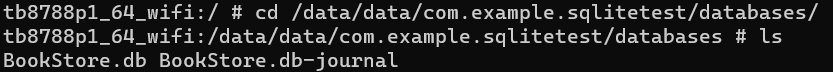
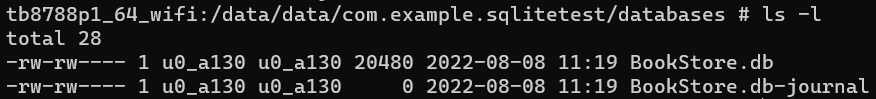
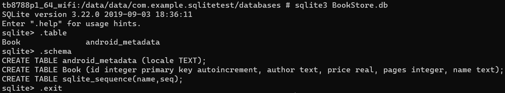
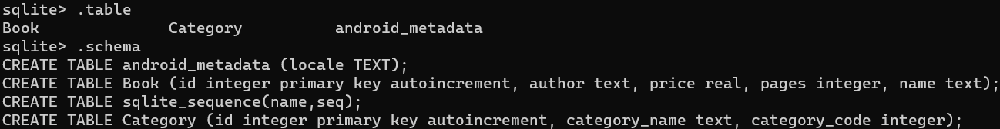
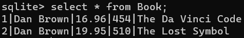
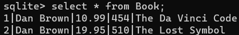
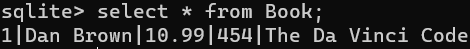
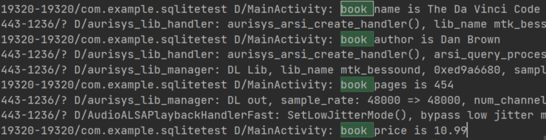

# 数据和文件存储概览

Android使用的文件系统类似于其他平台上基于磁盘的文件系统，提供了以下几种保存应用数据的选项：

- **应用专属存储空间**：存储仅供应用使用的文件，可以存储到内部存储卷中的专属目录或外部存储空间中的其他专属目录。使用内部存储空间中的目录保存其他应用不应访问的敏感信息。
- **共享存储**：存储与其他应用共享的文件，包括媒体、文档和其他文件。
- **偏好设置**：以键值对形式存储私有原始数据。
- **数据库**：使用Room持久性库将结构化数据存储在专用数据库中。

下表汇总了这些选项的特点：

||内容类型|访问方法|所需权限|其他应用是否可访问| 卸载应用时是否移除文件 |
|-|-|-|-|-|-|
|应用专属文件|仅供应用使用的文件|从内部存储空间访问，可以使用`getFilesDir()`或`getCacheDir()`方法；从外部存储空间访问，可以使用`getExternalFilesDir()`或`getExternalCacheDir()`方法 | 从内部存储空间访问不需要任何权限。如果应用在搭载Android 4.4（API级别19）或更高版本的设备上运行，从外部存储空间访问不需要任何权限 |否|是|
| 媒体 | 可共享的媒体文件（图片、音频文件、视频） | `MediaStore` API                                             | 在Android 11（API级别30）或更高版本中，访问其他应用的文件需要`READ_EXTERNAL_STORAGE`在Android 10（API级别29）中，访问其他应用的文件需要`READ_EXTERNAL_STORAGE`或`WRITE_EXTERNAL_STORAGE`在Android 9（API级别28）或更低版本中，访问所有文件均需要相关权限 | 是，但其他应用需要`READ_EXTERNAL_STORAGE`权限 | 否                       |
| 文档和其他文件 | 其他类型的可共享内容，包括已下载的文件   | 存储访问框架                                                 | 无                                                           | 是，可以通过系统文件选择器访问                  | 否                       |
| 应用偏好设置 | 键值对                                   | Jetpack Preferences库 | 无                                                           | 否                                              | 是                       |
| 数据库                                                       | 结构化数据                               | Room持久性库 | 无                                                           | 否                                              | 是                       |

应根据自己的具体需求选择解决方案：

- 数据需要占用多少空间？

  内部存储空间中用于存储应用专属数据的空间有限。如果需要保存大量数据，应使用其他类型的存储空间。

- 数据访问需要达到怎样的可靠程度？

  如果应用的基本功能需要某些数据（例如应用启动时需要的数据），可以将相应数据存放到内部存储目录或数据库中。存储在外部存储空间中的应用专属文件并非一直可以访问，因为有些设备允许用户移除外部存储实体设备。

- 需要存储哪类数据？

  如果数据仅供您的应用使用，应使用应用专属存储空间。对于可分享的媒体内容，应使用共享的存储空间，以便其他应用可以访问相应内容。对于结构化数据，应使用偏好设置（适合键值对数据）或数据库（适合包含2个以上列的数据）。

- 数据是否应仅供你的应用使用？

  在存储敏感数据（不可通过任何其他应用访问的数据）时，应使用内部存储空间、偏好设置或数据库。内部存储空间的一个额外优势是用户无法看到相应数据。

# 存储位置的类别

Android提供两类物理存储位置：内部存储空间和外部存储空间。在大多数设备上，内部存储空间小于外部存储空间。不过，所有设备上的内部存储空间都是始终可用的，因此在存储应用所依赖的数据时更为可靠。

可移除卷（例如SD卡）在文件系统中属于外部存储空间。Android使用路径（例如`/sdcard`）表示这些存储设备。

>注意：可用于保存文件的确切位置可能因设备而异。因此，请勿使用硬编码的文件路径。

默认情况下，应用本身存储在内部存储空间中。不过，如果APK非常大，也可以在应用的清单文件中指明偏好设置，以便将应用安装到外部存储空间：

```xml
<manifest ...
    android:installLocation="preferExternal" >
    ...
</manifest>
```

# 对外部存储空间的访问和所需权限

Android定义了以下与存储相关的权限：`READ_EXTERNAL_STORAGE`、`WRITE_EXTERNAL_STORAGE`和 `MANAGE_EXTERNAL_STORAGE`。

在较低版本的Android系统中，应用需要声明`READ_EXTERNAL_STORAGE`权限才能访问位于外部存储空间中应用专属目录之外的任何文件。此外，应用需要声明`WRITE_EXTERNAL_STORAGE`权限才能向应用专属目录以外的任何文件写入数据。

Android系统的版本越新，就越依赖于文件的用途而不是位置来确定应用对特定文件的访问和写入能力。特别是，如果应用以Android 11（API级别30）或更高版本为目标平台，`WRITE_EXTERNAL_STORAGE`权限完全不会影响应用对存储的访问权限。这种基于用途的存储模型可增强用户隐私保护，因为应用只能访问其在设备文件系统中实际使用的区域。

Android 11引入了`MANAGE_EXTERNAL_STORAGE`权限，该权限提供对应用专属目录和`MediaStore`之外文件的写入权限。此权限使大多数应用无需声明此权限即可实现其用例，参阅有关如何[管理存储设备上所有文件](https://developer.android.com/training/data-storage/manage-all-files?hl=zh-cn)的指南。

# 分区存储

为了让用户更好地管理自己的文件并减少混乱，以Android 10（API级别29）及更高版本为目标平台的应用在默认情况下被授予了对外部存储空间的分区访问权限（即分区存储）。此类应用只能访问外部存储空间上的应用专属目录，以及本应用所创建的特定类型的媒体文件。

> 注意：如果应用在运行时请求与存储空间相关的权限，面向用户的对话框会表明应用正在请求对外部存储广泛的访问，即使启用分区存储也是如此。

除非应用需要访问存储在应用专属目录和`MediaStore` API可以访问的目录之外的文件，否则请使用分区存储。如果将应用专属文件存储在外部存储空间中，则可以将这些文件存放在外部存储空间中的应用专属目录内，以便更加轻松地采用分区存储。这样，在启用分区存储后，应用将可以继续访问这些文件。

如需应用适合分区存储，参阅[存储用例和最佳实践](https://developer.android.com/training/data-storage/use-cases?hl=zh-cn)指南。如应用有其他用例未包含在分区存储范围内，请[提交功能请求](https://source.android.com/setup/contribute/report-bugs?hl=zh-cn)。可以[暂时选择停用分区存储](https://developer.android.com/training/data-storage/use-cases?hl=zh-cn#opt-out-scoped-storage)。

# 文件存储

文件存储不对存储的内容进行任何格式化处理，所有数据原封不动地保存到文件当中，因而比较适合存储一些简单的文本数据或二进制数据。如果想使用文件存储的方式来保存一些较为复杂的结构化数据，需要定义一套自己的格式规范，方便之后将数据从文件中重新解析出来。

## 写入到文件中

`Context`类中提供了一个`openFileOutput()`方法，可以用于将数据存储到指定的文件中。此方法接受两个参数：第一个参数是文件名，在文件创建的时候使用，注意此文件名不可包含路径，因为所有的文件都默认存储到`/data/data/<package name>/files/`目录下；第二个参数是文件的操作模式，主要有`MODE_PRIVATE`和`MODE_APPEND`两种模式可选。默认是`MODE_PRIVATE`，表示当指定相同文件名时，直接覆盖原文件内容。`MODE_APPEND`则表示追加内容。`MODE_WORLD_READABLE`和`MODE_WORLD_WRITEABLE`表示允许其他应用程序对程序的文件进行读写操作，由于这两种模式过于危险，容易引起应用的安全漏洞，已在Android 4.2版本中废弃。

`openFileOutput()`方法返回一个`FileOutputStream`对象，得到这个对象之后借助它构建出OutputStreamWriter对象，再使用OutputStreamWriter对象构建出BufferedWriter对象，如此就可以使用通过BufferedWriter将文本内容写入文件。这就是用Java流的方式将数据写入文件中。

java代码示例：

```java
public void save() {
    String somedata = "Data to save";
    FileOutputStream out = null;
    BufferedWriter writer = null;
    try {
        out = openFileOutput("data", Context.MODE_PRIVATE);
        writer = new BufferedWriter(new OutputStreamWriter(out));
        writer.write(somedata);
    } catch (IOException e) {
        e.printStackTrace();
    } finally {
        try {
            if (writer != null) {
                writer.close();
            }
        } catch (IOException e) {
            e.printStackTrace();
        }
    }
}
```

kotlin代码示例：

```kotlin
fun save(inputText: String) {
    // kotlin没有异常检查机制，意味着使用kotlin编写的所有代码不会强制要求你进行异常捕获或异常抛出；
    // 此处的try catch代码块是参照Java的编程规范添加的，即使不写依然可以编译通过
    try {
        val output = openFileOutput("data", Context.MODE_PRIVATE)
        val writer = BufferedWriter(OutputStreamWriter(output))
        // kotlin提供的一个内置扩展函数，保证在lambda表达式中的代码全部执行完之后自动将外层的流关闭，
        // 这样就不用再编写一个finally语句手动去关闭流了。
        writer.use {
            it.write(inputText)
        } catch (e: IOException) {
            e.printStackTrace();
        }
    }
}
```

### 实例

创建一个FilePersistenceTest项目，修改activity_main.xml中的代码，如下：

```xml
<LinearLayout xmlns:android="http://schemas.android.com/apk/res/android"
    android:orientation="vertical"
    android:layout_width="match_parent"
    android:layout_height="match_parent" >
    <EditText
        android:id="@+id/editText"
        android:layout_width="match_parent"
        android:layout_height="wrap_content"
        android:hint="Type something here" >
    </EditText>
</LinearLayout>
```

这里是在布局中加入了一个EditText，用于输入文本内容。

此时运行程序，街面上有一个文本输入框，输入内容后，按下Back键，输入的内容就丢失了，因为此时它是一个瞬时数据，在Activity销毁后会被回收。现在要做的是，在数据被回收之前将它存储到文件中。修改MainActivity代码：

java版：

```java
public class MainActivity extends AppCompatActivity() {
    private EditText edit;
    @Override
    protected void onCreate(Bundle savedInstanceState) {
        super.onCreate(savedInstanceState);
        setContentView(R.layout.activity_main);
        edit = (EditText) findViewById(R.id.edit);
    }
    @Override
    protected void onDestroy() {
        super.onDestory();
        String inputText = edit.getText().toString();
        save(inputText);
    }
    public void save(String inputText) {
        FileOutputStream out = null;
        BufferedWriter writer = null;
        try {
            out = openFileOutput("data", Context.MODE_PRIVATE);
            writer = new BufferedWriter(new OutputStreamWriter(out));
            writer.write(inputText);
        } catch (IOException e) {
            e.printStackTrace();
        } finally {
            try {
                if (writer != null) {
                    writer.close();
                }
            } catch (IOException e) {
                e.printStackTrace();
            }
        }
    }
}
```

kotlin版：

```kotlin
class MainActivity : AppCompatActivity() {
    override fun onCreate(savedInstanceState : Bundle?) {
        super.onCreate(savedInstanceState)
        setContentView(R.layout.activity_main)
    }
    override fun onDestroy() {
        super.onDestroy()
        val inputText = editText.text.toString()
        save(inputText)
    }
    private fun save(inputText: String) {
        try {
            val output = openFileOutput("data", Context.MODE_PRIVATE)
            val writer = BufferedWriter(OutputStreamWriter(output))
            writer.use {
                it.write(inputText)
            }
        } catch (e: IOException) {
            e.printStackTrace()
        }
    }
}
```

进入`/data/data/com.example.filetest/files/`目录，即可以看到有一个data文件。

需要想办法在下次启动程序时让这些数据能够还原到EditText中。

## 从文件中读取数据

类似于将数据存储到文件中，Context类中还提供了一个`openFileInput`方法，用于从文件中读取数据，只接收一个参数，即要读取的文件名，然后系统会自动到`/data/data/<package name>/files/`目录下去加载这个文件，并返回一个FileInputStream对象，得到了这个对象之后再通过Java流的方式就可以将数据读取出来了。

Java版：

```java
public String load() {
    FileInputStream in = null;
    BufferedReader reader = null;
    StringBuilder content = new StringBuilder();
    try {
        in = openFileInput("data");
        reader = new BufferedReader(new InputStreamReader(in));
        String line = "";
        while((line = reader.readLine()) != null) {
            content.append(line);
        }
    } catch (IOException e) {
        e.printStackTrace();
    } finally {
        if (reader != null) {
            try {
                reader.close();
            } catch (IOException e) {
                e.printStackTrace();
            }
        }
    }
    return content.toString();
}
```

kotlin版：

```kotlin
fun load(): String {
    val content = StringBuilder()
    try {
        val input = openFileInput("data")
        val reader = BufferedReader(InputStreamReader(input))
        reader.use {
            // 此处使用了一个forEachLine函数，是Kotlin提供的一个内置扩展函数，它会将读到的每行内容都回调到lambda表达式中，在lambda表达式中完成拼接逻辑即可
            reader.forEachLine {
                content.append(it)
            }
        }
    } catch (e: IOException) {
        e.printStackTrace()
    }
    return content.toString()
}
```

在这段代码中，首先通过`openFileInput`方法获取到了一个`FileInputStream`对象，然后借助它又构建出了一个`InputStreamReader`对象，接着再使用`InputStreamReader`构建出一个`BufferedReader` 对象，这样我们就可以通过`BufferedReader`进行一行行地读取，把文件中所有的文本内容全部读取出来，并存放在一个`StringBuilder`对象中，最后返回StringBuilder的toString就可以了。

修改MainActivity中的代码，使得重新启动程序时EditText中能够保留我们上次输入的内容。如下所示：

Java版

```java
public class MainActivity extends AppCompatActivity {
    private EditText edit;
    @Override
    protected void onCreate(Bundle savedInstanceState) {
        super.onCreate(savedInstanceState);
        setContentView(R.layout.activity_main);
        edit = (EditText) findViewById(R.id.edit);
        String inputText = load();
        if (!TextUtils.isEmpty(inputText)) {
            edit.setText(inputText);
            edit.setSelection(inputText.length());
            Toast.makeText(this, "Restoring succeeded", Toast.LENGTH_SHORT).show();
        }
    }
    ...
    public String load() {
        FileInputStream in = null;
        BufferedReader reader = null;
        StringBuilder content = new StringBuilder();
        try {
            in = openFileInput("data");
            reader = new BufferedReader(new InputStreamReader(in));
            String line = "";
            while((line = reader.readLine()) != null) {
                content.append(line);
            }
        } catch (IOException e) {
            e.printStackTrace();
        } finally {
            if (reader != null) {
                try {
                    reader.close();
                } catch (IOException e) {
                    e.printStackTrace();
                }
            }
        }
        return content.toString();
    }
}
```

kotlin版：

```kotlin
class MainActivity : AppCompatActivity() {
    override fun onCreate(savedInstanceState: Bundle?) {
        super.onCreate(savedInstanceState)
        setContentView(R.layout.activity_main)
        val inputText = load()
        if(inputText.isNotEmpty()) {
            editText.setText(inputText)
            editText.setSelection(inputText.length)
            Toast.makeText(this, "Restoring succeeded", Toast.LENGTH_SHORT).show()
        }
    }
    private fun load(): String {
        val content = StringBuilder()
        try {
            val input = openFileInput("data")
            val reader = BufferedReader(InputStreamReader(input))
            reader.use {
                reader.forEachLine {
                    content.append(it)
                }
            }
        } catch (e: IOException) {
            e.printStackTrace()
        }
        return content.toString()
    }
    ...
}
```

可以看到，在onCreate方法中调用load方法来读取文件中存储的文本内容，如果读到的内容不为null，就调用EditText的setText方法将内容填充到EditText里，并调用setSelection方法将输入光标移动到文本的末尾位置以便于继续输入，然后弹出一句还原成功的提示。

注意，上述代码在对字符串进行非空判断的时候使用了TextUtils.isEmpty方法，这是一个非常好用的方法，它可以一次性进行两种空值的判断。当传入的字符串等于null或者等于空字符串的时候，这个方法都会返回true，从而使得我们不需要先单独判断这两种空值再使用逻辑运算符连接起来了。

现在重新运行一下程序，刚才保存的Content字符串肯定会被填充到EditText中，然后编写一点其他的内容，比如在EditText中输入Hello，接着按下Back键退出程序，再重新启动程序，这时刚才输入的内容并不会丢失，而是还原到了EditText中。

## 总结

文件存储的核心技术就是Context类中提供的openFileInput和openFileOutput方法，之后就是利用Java的各种流来进行读写操作。

但是文件存储的方式并不适合用于保存一些较为复杂的文本数据。

# SQLite数据库存储

Android系统内置了SQLite数据库。SQLite是一款轻量级的关系型数据库，运算速度快，占用资源少，通常只需要几百KB的内存就够了，因而特别适合在移动设备上使用。

SQLite不仅支持标准的SQL语法，还遵循了数据库的ACID事务。

前面的文件存储只适用于保存一些简单的数据和键值对，当需要存储大量复杂的关系型数据的时候就需要用到数据库。比如短信程序中可能会有很多个会话，每个会话中又包含了很多条信息内容，并且大部分会话还可能各自对应了电话簿中的某个联系人。

## 创建数据库

Android为了让我们能够更加方便地管理数据库，专门提供了一个SQLiteOpenHelper帮助类，借助这个类就可以非常简单地对数据库进行创建和升级。

SQLiteOpenHelper是一个抽象类，这意味着要创建一个自己的帮助类继承它。SQLiteOpenHelper中有两个抽象方法，分别是onCreate和onUpgrade，必须重写这两个方法，然后分别在这两个方法中去实现创建、升级数据库的逻辑。

SQLiteOpenHelper中还有两个非常重要的实例方法：getReadableDatabase和getWritableDatabase。这两个方法都可以创建或打开一个现有的数据库（如果数据库已存在则直接打开，否则创建一个新的数据库）并返回一个**可对数据库进行读写操作的对象**。不同的是，当数据库不可写入的时候（如磁盘空间已满），getReadableDatabase方法返回的对象将以只读的方式去打开数据库，而getWritableDatabase方法则将出现异常。

SQLiteOpenHelper中有两个构造方法可供重写，一般使用参数少的那个构造方法即可。这个构造方法中接收4个参数，第一个参数是Context，必须要有它才能对数据库进行操作。第二个参数是数据库名，创建数据库时使用的就是这里指定的名称。第三个参数允许我们在查询数据的时候返回一个自定义的 Cursor，一般都是传入null。第四个参数表示当前数据库的版本号，可用于对数据库进行升级操作。构建出SQLiteOpenHelper的实例之后，再调用它的getReadableDatabase或getWritableDatabase方法就能够创建数据库了，数据库文件会存放在`/data/data/<package name>/databases/`目录下。此时，重写的onCreate方法也会得到执行，所以通常会在这里去处理一些创建表的逻辑。

示例：我们希望创建一个名为BookStore.db的数据库，然后在这个数据库中新建一张Book表，表中有id（主键）、作者、价格、页数和书名等列。Book表建表语句：

```sqlite
create table Book (
    id     integer primary key autoincrement,
    author text,
    price  real,
    pages  integer,
    name   text)
```

SQLite的数据类型很简单，integer表示整型，real表示浮点型，text表示文本类型，blob表示二进制类型。另外，上述建表语句中还使用了`primary key`将`id`列设为主键，并用`autoincrement`关键字表示id列是自增长的。然后需要在代码中去执行这条SQL语句，才能完成创建表的操作。新建MyDatabaseHelper类继承SQLiteOpenHelper，代码如下所示：

```java
public class MyDatabaseHelper extends SQLiteOpenHelper {
    public static final String CREATE_BOOK = "create table Book ("
        + "id integer primary key autoincrement, "
        + "author text, "
        + "price real, "
        + "pages integer, "
        + "name text)";
    private Context mContext;
    public MyDatabaseHelper(Context context, String name,
                            SQLiteDatabase.CursorFactory factory, int version) {
        super(context, name, factory, version);
        mContext = context;
    }
    @Override
    public void onCreate(SQLiteDatabase db) {
        db.execSQL(CREATE_BOOK);
        Toast.makeText(mContext, "Create succeeded", Toast.LENGTH_SHORT).show();
    }
    @Override
    public void onUpgrade(SQLiteDatabase db, int oldVersion, int newVersion) {
        
    }
}
```

建表语句定义成了一个字符串常量，然后在onCreate方法中又调用了SQLiteDatabase的execSQL方法去执行这条建表语句，并弹出一个Toast提示创建成功，这样就可以保证在数据库创建完成的同时还能成功创建Book表。

修改`activity_main.xml`中的代码：

```xml
<LinearLayout xmlns:android="http://schemas.android.com/apk/res/android"
    android:orientation="vertical"
    android:layout_width="match_parent"
    android:layout_height="match_parent" >
    <Button
        android:id="@+id/create_database"
        android:layout_width="match_parent"
        android:layout_height="wrap_content"
        android:text="Create database">
    </Button>
</LinearLayout>
```

布局文件很简单，就是加入了一个按钮，用于创建数据库最后修改MainActivity中的代码，如下所示：

```java
public class MainActivity extends AppCompatActivity {
    private MyDatabaseHelper dbHelper;
    @Override
    protected void onCreate(Bundle savedInstanceState) {
        super.onCreate(savedInstanceState);
        setContentView(R.layout.activity_main);
        dbHelper = new MyDatabaseHelper(this, "BookStore.db", null, 1);
        Button createDatabase = (Button) findViewById(R.id.create_database);
        createDatabase.setOnClickListener(new View.OnClickListener() {
            @Override
            public void onClick(View v) {
                dbHelper.getWritableDatabase();
            }
        });
    }
}
```

在onCreate方法中构建了一个MyDatabaseHelper对象，并且通过构造函数的参数将数据库名指定为 "BookStore.db"，版本号指定为1，然后在按钮的点击事件里调用了getWritableDatabase方法。这样当第一次点击按钮时，就会检测到当前程序中并没有BookStore.db数据库，于是会创建该数据库并调用MyDatabaseHelper中的onCreate方法，这样Book表也就得到了创建，然后会弹出一个Toast提示创建成功。再次点击按钮时，会发现此时已经存在BookStore.db数据库了，因此不会再创建一次。

怎样才能证实数据库的确创建成功了？如果还是使用File Explorer，那么最多只能看到databases目录下出现了一个BookStore.db文件，Book表是无法通过File Explorer看到的。因此换一种查看方式：使用adb shell来对数据库和表的创建情况进行检查。

adb是Android SDK中自带的一个调试工具，使用这个工具可以直接对连接在电脑上的手机或模拟器进行调试操作。它存放在sdk的platform-tools目录下，如果想要在命令行中使用这个工具，就需要先把它的路径配置到环境变量里。

如果使用的是Windows系统，在系统变量里找到Path并点击编辑，将platform-tools目录配置进去；如果使用的是Linux或Mac系统，可以在home路径下编辑`.bash`文件，将platform-tools目录配置进去即可。

打开命令行界面，输人adb shell，就进入到设备的控制台，输入su命令切换成超级管理员，接下来使用cd命令进入到`/data/data/com.example.databasetest/databases/`目录下，并使用ls命令查看到该目录里的文件。



这个目录下出现了两个数据库文件，一个正是我们创建的BookStore.db而另一个BookStore.db-journal则是为了让数据库能够支持事务而产生的临时日志文件，通常情况下这个文件的大小都是0字节。



接下来借助`sqlite`命令打开数据库，只需要键入`sqlite3`，后面加上数据库名即可。

首先来看一下目前数据库中有哪些表，键入`.table`命令，可以看到此时数据库中有两张表，`android_metadata`表是每个数据库中都会自动生成的，而另外一张Book表就是我们在MyDatabaseHelper中创建的。这里还可以通过`.schema`命令来查看它们的建表语句。

由此证明，BookStore.db数据库和Book表确实已经创建成功了。之后键入`.exit`或`.quit`命令可以退出数据库的编辑，再键入`exit`命令就可以退出设备控制台了。



## 升级数据库

onUpgrade方法是用于对数据库进行升级的。

目前项目中已经有一张Book表用于存放书的各种详细数据，如果我们想再添加一张Category表用于记录图书的分类，该怎么做呢？比如Category表中有id（主键）、分类名和分类代码这几个列，那么建表语句就可以写成：
```sqlite
create table Category (
    id            integer primary key autoincrement,
    category_name text,
    category_code integer)
```

接下来我们将这条建表语句添加到MyDatabaseHelper中，代码如下所示：

```java
public class MyDatabaseHelper extends SQLiteOpenHelper {
    public static String CREATE_BOOK = "create table Book ("
        + "id integer primary key autoincrement, "
        + "author text, "
        + "price real, "
        + "pages integer, "
        + "name text)";
    public static final String CREATE_CATEGORY = "create table Category ("
        + "id integer primary key autoincrement, "
        + "category_name text, "
        + "category_code integer)";     //+
    private Context mContext;
    public MyDatabaseHelper(Context context, String name,
                            SQLiteDatabase.CursorFactory factory, int version) {
        super(Context, name, factory, version);
        mContext = context;
    }
    @Override
    public void onCreate(SQLiteDatabase db) {
        db.execSQL(CREATE_BOOK);
        db.execSQL(CREATE_CATEGORY);    //+
        Toast.makeText(mContext, "Create succeeded", Toast.LENGTH_SHORT).show();
    }
    @Override
    public void onUpgrade(SQLiteDatabase db, int oldVersion, int newVersion) {
        
    }
}
```

可见，此程序企图通过MyDatabaseHelper构造时自动调用onCreate来创建Category数据库，但是现在我们重新运行一下程序并点击按钮，没有弹出创建成功的提示。当然，可以通过adb工具到数据库中再去检查一下，这样会更加地确认Category表没有创建成功。因为按钮绑定的点击事件回调是`dbHelper.getWritableDatabase();`，而此时BookStore.db数据库已经存在了，之后不管我们怎样点击按钮，`getWritableDatabase()`都不会使MyDatabaseHelper中的onCreate方法再次执行，因此新添加的表也就无法得到创建了。可以看出，`getWritableDatabase()`只能用于创建一次数据库，之后只是单纯地打开现有的数据库并返回一个可对数据库进行读写操作的对象。

正确的做法是运用SQLiteOpenHelper的升级功能，修改MyDatabaseHelper类中的代码：

```java
public class MyDatabaseHelper extends SQLiteOpenHelper {
    ...
    @Override
    public void onUpgrade(SQLiteDatabase db, int oldVersion, int newVersion) {
        db.execSQL("drop table if exists Book");
        db.execSQL("drop table if exists Category");
        onCreate(db);
    }
}
```

可以看到，我们在onUpgrade方法中执行了两条DROP语句，如果发现数据库中已经存在Book表或Category表了，就将这两张表删除掉。然后再调用onCreate方法重新创建。这里先将已经存在的表删除掉。接下来的问题就是如何让onUpgrade方法能够执行了，还记得SQLiteOpenHelper的构造方法里接收的第四个参数表示当前数据库的版本号，之前我们传人的是1，现在只要传入一个比1大的数，就可以让 onUpgrade方法得到执行了。修改MainActivity中的代码，如下所示：

```java
public class MainActivity extends AppCompatActivity {
    private MyDatabaseHelper dbHelper;
    @Override
    protected void onCreate(Bundle savedInstanceState) {
        super.onCreate(savedInstanceState);
        setContentView(R.layout.activity_main);
        dbHelper = new MyDatabaseHelper(this, "BookStore.db", null, 2);
        Button createDatabase = (Button) findViewById(R.id.create_database);
        createDatabase.setOnClickListener(new View.OnClickListener() {
            @Override
            public void onClick(View v) {
                dbHelper.getWritableDatabase();
            }
        });
    }
}
```

这里将数据库版本号指定为2，表示我们对数据库进行升级了。现在重新运行程序，并点击按钮，这时就会再次弹出创建成功的提示。为了验证Category表已经创建成功，在adb shell中打开BookStore.db数据库，然后键入`.table`命令，接着键入`.schema`命令查看一下建表语句。由此可以看出，Category表已经创建成功了，同时也说明我们的升级功能的确起到了作用。



## 添加数据

如果你比较熟悉SQL语言的话，一定会知道添加数据时使用insert，查询数据时使用select，更新数据时使用update，删除数据时使用delete。但是开发者的水平总会是参差不齐的，未必每一个人都能非常熟悉地使用SQL语言，因此Android也提供了一系列的辅助性方法，使得在Android中即使不去编写SQL语句，也能轻松完成所有的CRUD操作。

前面我们已经知道，调用SQLiteOpenHelper的getReadableDatabase或getwritableDatabase方法是可以用于创建和升级数据库的，不仅如此，这两个方法还都会返回一个`SQLiteDatabase`对象，借助这个对象就可以对数据进行CRUD操作了。

首先向数据库的表添加数据。SQLiteDatabase中提供了一个`insert`方法：这个方法就是专门用于添加数据的。它接收3个参数，第一个参数是表名；第二个参数用于在未指定添加数据的情况下给某些可为空的列自动赋值NULL，一般我们用不到这个功能，直接传入null即可。第三个参数是一个`ContentValues`对象，它提供了一系列的`put`方法重载，用于向ContentValues中添加数据，只需要将表中的每个列名以及相应的待添加数据传入即可。这就是基本用法，接下来通过例子测试。修改`activity_main.xml`中的代码，如下所示：

```xml
<LinearLayout xmlns:android="http://schemas.android.com/apk/res/android"
    android:orientation="vertical"
    android:layout_width="match_parent"
    android:layout_height="match_parent" >
    
    ...
    
    <Button
        android:id="@+id/add_data"
        android:layout_width="match_parent"
        android:layout_height="wrap_content"
        android:text="Add data">
    </Button>
</LinearLayout>
```

在布局文件中又新增了一个按钮，稍后就会在这个按钮的点击事件里编写添加数据的逻辑。接着修改MainActivity中的代码，如下所示：

```java
public class MainActivity extends AppCompatActivity {
    private MyDatabaseHelper dbHelper;
    @Override
    protected void onCreate(Bundle savedInstanceState) {
        super.onCreate(savedInstanceState);
        setContentView(R.layout.activity_main);
        dbHelper = new MyDatabaseHelper(this, "BookStore.db", null, 2);
        ...
        Button addData = (Button) findViewById(R.id.add_data);
        addData.setOnClickListener(new View.OnClickListener() {
            @Override
            public void onClick(View v) {
                SQLiteDatabase db = dbHelper.getWritableDatabase();
                ContentValues values = new ContentValues();
                // 开始组装第一条数据
                values.put("name", "The Da Vinci Code");
                values.put("author", "Dan Brown");
                values.put("pages", 454);
                values.put("price", 16.96);
                db.insert("Book", null, values); // 插入第一条数据
                values.clear();
                // 组装第二条
                values.put("name", "The Lost Symbol");
                values.put("author", "Dan Brown");
                values.put("pages", 510);
                values.put("price", 19.95);
                db.insert("Book", null, values); // 插入第一条数据
                values.clear();
            }
        });
    }
}
```

这里只对Book表里其中四列的数据进行了组装，id那一列没并没给它赋值。这是因为在前面创建表的时候，我们就将id列设置为自增长了，它的值会在入库的时候自动生成。接下来使用ContentValues分别组装了两次不同的内容，并调用了两次insert方法。



## 更新数据

接下来看看怎样修改表中已有的数据。SQLiteDatabase中也提供了一个非常好用的update方法，用于对数据进行更新，这个方法接收4个参数，第一个参数和insert方法一样是表名。第二个参数是ContentValues对象，要把更新数据在这里组装进去。第三、第四个参数用于约束更新某一行或某几行中的数据，不指定的话默认就是更新所有行。

比如说修改第一本书的价格。应该怎么操作呢？首先修改`activity_main.xml`中的代码，如下所示：

```xml
<LinearLayout xmlns:android="http://schemas.android.com/apk/res/android"
    android:orientation="vertical"
    android:layout_width="match_parent"
    android:layout_height="match_parent" >
    ...
    <Button
        android:id="@+id/update_data"
        android:layout_width="match_parent"
        android:layout_height="wrap_content"
        android:text="Update data">
    </Button>
</LinearLayout>
```

添加了一个用于更新数据的按钮。然后修改MainActivity中的代码，如下所示：

```java
public class MainActivity extends AppCompatActivity {
    private MyDatabaseHelper dbHelper;
    @Override
    protected void onCreate(Bundle savedInstanceState) {
        super.onCreate(savedInstanceState);
        setContentView(R.layout.activity_main);
        dbHelper = new MyDatabaseHelper(this, "BookStore.db", null, 2);
        ...
        Button updateData = (Button) findViewById(R.id.update_data);
        updateData.setOnClickListener(new View.OnClickListener() {
            @Override
            public void onClick(View v) {
                SQLiteDatabase db = dbHelper.getWritableDatabase();
                ContentValues values = new ContentValues();
                values.put("price", 10.99);
                db.update("Book", values, "name = ?", new String[]{"The Da Vinci Code"});
            }
        });
    }
}
```

这里在更新数据按钮的点击事件里面构建了一个ContentValues对象，并且只给它指定了一组数据，说明只是想把价格这一列的数据更新成10.99。然后调用了SQLiteDatabase的update方法去执行具体的更新操作，可以看到，这里使用了第三、第四个参数来指定具体更新哪几行。**第三个参数对应的是SQL语句的where部分**，表示更新所有`name`等于`?`的行，而`?`是一个占位符，可以通过第四个参数提供的一个字符串数组为第三个参数中的每个占位符指定相应的内容。因此上述代码想表达的意图是将名字是The Da Vinci Code的这本书的价格改成10.99。



## 删除数据

SQLiteDatabase中提供了一个delete方法，专门用于删除数据，这个方法接收3个参数。第一个参数仍然是表名，这个已经没什么好说的了，第二、第三个参数又是用于约束删除某一行或某几行的数据，不指定的话默认就是删除所有行。修改`activity_main.xml`中的代码，如下所示：

```xml
<LinearLayout xmlns:android="http://schemas.android.com/apk/res/android"
    android:orientation="vertical"
    android:layout_width="match_parent"
    android:layout_height="match_parent" >
    ...
    <Button
        android:id="@+id/delete_data"
        android:layout_width="match_parent"
        android:layout_height="wrap_content"
        android:text="Delete data">
    </Button>
</LinearLayout>
```

修改MainActivity代码：

```java
public class MainActivity extends AppCompatActivity {
    private MyDatabaseHelper dbHelper;
    @Override
    protected void onCreate(Bundle savedInstanceState) {
        super.onCreate(savedInstanceState);
        setContentView(R.layout.activity_main);
        dbHelper = new MyDatabaseHelper(this, "BookStore.db", null, 2);
        ...
        Button deleteData = (Button) findViewById(R.id.delete_data);
        deleteData.setOnClickListener(new View.OnClickListener() {
            @Override
            public void onClick(View view) {
                SQLiteDatabase db = dbHelper.getWritableDatabase();
                db.delete("Book", "pages > ?", new String[]{"500"});
            }
        });
    }
}
```

可以看到，我们在删除按钮的点击事件里指明去删除Book表中的数据，并且通过第二、第三个参数来指定仅删除那些页数超过500页的书。当然这个需求很奇怪，这里也仅仅是为了做个测试。你可以先查看一下当前Book表里的数据，其中The Lost Symbol这本书的页数超过了500页，也就是说当我们点击删除按钮时，这条记录应该会被删除掉。



## 查询数据

此处只介绍Android上的查询功能。

SQLiteDatabase中还提供了一个query方法用于对数据进行查询。这个方法的参数非常复杂、最短的一个方法重载也需要传人7个参数。第一个参数还是表名；第二个参数用于指定去查询哪几列，如果不指定则默认查询所有列；第三、第四个参数用于约束查询某一行或某几行的数据，不指定则默认查询所有行的数据；第五个参数用于指定需要去group by的列，不指定则表示不对查询结果进行group by操作；第六个参数用于对group by之后的数据进行进一步的过滤，不指定则表示不进行过滤；第七个参数用于指定查询结果的排序方式，不指定则表示使用默认的排序方式。更多详细的内容可以参考下表。其他几个query方法的重载其实也大同小异，这里就不再进行介绍了。

| query方法参数 | 对应SQL部分               | 描述                            |
| ------------- | ------------------------- | ------------------------------- |
| table         | from table_name           | 指定表名                        |
| columns       | select column1, column2   | 指定列名                        |
| selection     | where column = value      | 指定where约束条件               |
| selectionArgs | -                         | 为where条件中的占位符提供具体值 |
| groupBy       | group by column           | 指定需要group by的列            |
| having        | having column = value     | 对group by后的结果进一步约束    |
| orderBy       | order by column1, column2 | 指定查询结果的排序方式          |

虽然query方法的参数非常多，但是不要对它产生畏惧，因为我们不必为每条查询语句都指定所有的参数，多数情况下只需要传入少数几个参数就可以完成查询操作了。调用query方法后会返回一个Cursor对象，查询到的所有数据都将从这个对象中取出。

修改`activity_main.xml`中的代码，如下所示：

```xml
<LinearLayout xmlns:android="http://schemas.android.com/apk/res/android"
    android:orientation="vertical"
    android:layout_width="match_parent"
    android:layout_height="match_parent" >
    ...
    <Button
        android:id="@+id/query_data"
        android:layout_width="match_parent"
        android:layout_height="wrap_content"
        android:text="Query data">
    </Button>
</LinearLayout>
```

修改MainActivity中的代码：

```java
public class MainActivity extends AppCompatActivity {
    private MyDatabaseHelper dbHelper;
    @Override
    protected void onCreate(Bundle savedInstanceState) {
        super.onCreate(savedInstanceState);
        setContentView(R.layout.activity_main);
        dbHelper = new MyDatabaseHelper(this, "BookStore.db", null, 2);
        ...
        Button queryData = (Button) findViewById(R.id.query_data);
        queryData.setOnClickListener(new View.OnClickListener() {
            @Override
            public void onClick(View view) {
                SQLiteDatabase db = dbHelper.getWritableDatabase();
                Cursor cursor = db.query("Book", null, null, null, null, null, null);
                if(cursor.moveToFirst()) {
                    do {
                        // 遍历Cursor对象，取出数据并打印
                        String name = cursor.getString(cursor.getColumnIndex("name"));
                        String author = cursor.getString(cursor.getColumnIndex("author"));
                        int pages = cursor.getInt(cursor.getColumnIndex("pages"));
                        double price = cursor.getDouble(cursor.getColumnIndex("price"));
                        Log.d("MainActivity", "book name is " + name);
                        Log.d("MainActivity", "book author is " + author);
                        Log.d("MainActivity", "book pages is " + pages);
                        Log.d("MainActivity", "book price is " + price);
                    } while (cursor.moveToNext());
                }
                cursor.close();
            }
        });
    }
}
```

我们首先在查询按钮的点击事件里面调用了SQLiteDatabase的query方法去查询数据。这里的query方法非常简单，只是使用了第一个参数指明去查询Book表，后面的参数全部为null。这就表示希望查询这张表中的所有数据，虽然这张表中目前只剩下一条数据了。查询完之后就得到了一个Cursor对象，接着我们调用它的moveToFirst方法将数据的指针移动到第一行的位置，然后进入了一个循环当中，去遍历查询到的每一行数据。在这个循环中可以通过Cursor的getColumnIndex方法获取到某一列在表中对应的位置索引，然后将这个索引传入到相应的取值方法中，就可以得到从数据库中读取到的数据了。接着我们使用Log的方式将取出的数据打印出来，借此来检查一下读取工作有没有成功完成。最后别忘了调用close方法来关闭Cursor。

点击一下Querydata按钮后，查看logcat的打印内容。



## 使用SQL操作数据库

虽然Android已经给我们提供了很多非常方便的API用于操作数据库，不过有一些人不习惯去使用这些辅助性的方法，而是更加青睐于直接使用SQL来操作数据库。这种人一般都属于SQL大牛，Android充分考虑到了这些人的编程习惯，同样提供了一系列的方法，使得可以直接通过SQL来操作数据库。下面就来简略使用SQL来完成前面的CRUD操作。

* 添加数据的方法如下：
  ```java
  db.execSQL("insert into Book (name, author, pages, price) values(?, ?, ?, ?)",
             new String[]{"The Da Vinci Code", "Dan Brown", "454", "16.96"});
  db.execSQL("insert into Book (name, author, pages, price) values(?, ?, ?, ?)",
             new String[]{"The Lost Symbol", "Dan Brown", "510", "19.95"});
  ```

* 更新数据的方法如下：
  ```java
  db.execSQL("update Book set price = ? where name = ?",
             new String[]{"10.99", "The Da Vinci Code"});
  ```

* 删除数据的方法如下：
  ```java
  db.execSQL("delete from Book where pages > ?", new String[]{"500"});
  ```

* 查询数据的方法如下：
  ```java
  db.rawQuery("select * from Book", null);
  ```

可以看到，除了查询数据的时候调用的是SQLiteDatabase的rawQuery方法，其他的操作都是调用的execSQL方法。选择使用哪一种方式就看你个人的喜好了。
