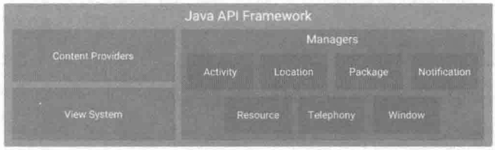
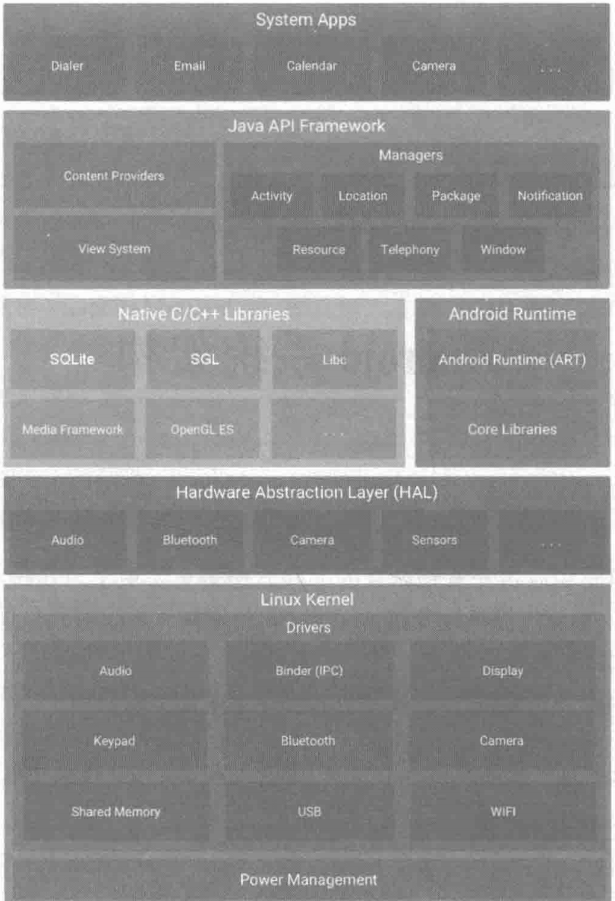

# 分层

Android大致可以分为四层架构：Linux内核层、系统运行库层、应用框架层和应用层。

1. 应用层。系统内置的应用程序以及非系统级的应用程序都属于应用层，负责与用户进行直接交互，通常都是用Java开发。

2. 应用框架层。这一层是由Java代码编写的，可以称为Java API Framework。这一层主要提供了构建应用程序时可能用到的各种API，Android自带的一些核心应用就是使用这些API完成的，开发者也可以通过这些API来构建自己的应用程序。开发者API可以直接映射到底层HAL接口，并可提供与实现驱动程序相关的实用信息。这一层所提供的主要组件有：

   1. Activity Manager，活动管理器。管理各个应用程序生命周期，以及常用的导航回退功能。
   2. Location Manager，位置管理器。提供地理位置及定位功能服务。
   3. Package Manager，包管理器。管理所有安装在Android系统中的应用程序。
   4. Notification Manager，通知管理器。使得应用程序可以在状态栏中显示自定义的提示信息。
   5. Resource Manager，资源管理器。提供应用程序使用的各种非代码资源，如本地化字符串、图片、布局文件、颜色文件等。
   6. Telephony Manager，电话管理器。管理所有的移动设备功能。
   7. Window Manager，窗口管理器。管理所有开启的窗口程序。
   8. Content Provider，内容提供器。使得不同应用程序之间可以共享数据。
   9. View System，视图系统。构建应用程序的基本组件。

   

3. Binder IPC。Binder 进程间通信 (IPC) 机制允许应用框架跨越进程边界并调用Android系统服务代码，这使得高级框架API能与Android系统服务进行交互。在应用框架级别，开发者无法看到此类通信的过程，但一切似乎都在“按部就班地运行”。

4. 系统服务层。系统服务是专注于特定功能的模块化组件，例如窗口管理器、搜索服务或通知管理器。应用框架 API 所提供的功能可与系统服务通信，以访问底层硬件。Android 包含两组服务：“系统”（诸如窗口管理器和通知管理器之类的服务）和“媒体”（涉及播放和录制媒体的服务）。
   1. 这一层通过一些`C/C++`库来为Android系统提供了主要的特性支持。如SQLite库提供了数据库的支持，`OpenGL|ES`库提供了3D绘图的支持，Webkit库提供了浏览器内核的支持等。
   2. 这一层还有Android运行时库，它主要提供了一些核心库，能够允许开发者使用Java语言来编写Android应用。另外，Android运行时库中还包含了Dalvik虚拟机（5.0系统之后改为ART运行环境），它使得每一个Android应用都能运行在独立的进程当中，并且拥有一个自己的Dalvik虚拟机实例。相较于Java虚拟机，Dalvik是专门为移动设备定制的，它针对手机内存、CPU性能有限等情况做了优化处理。

5. 硬件抽象层。HAL 可定义一个标准接口以供硬件供应商实现，这可让 Android 忽略较低级别的驱动程序实现。借助 HAL，您可以顺利实现相关功能，而不会影响或更改更高级别的系统。HAL 实现会被封装成模块，并会由 Android 系统适时地加载。如需了解详情，请参阅[硬件抽象层 (HAL)](https://source.android.com/devices/architecture/hal)。

6. Linux内核。Android系统是基于Linux内核的，这一层为Android设备的各种硬件提供了底层的驱动，如显示驱动、音频驱动、照相机驱动、蓝牙驱动、Wi-Fi驱动、电源管理等。开发设备驱动程序与开发典型的 Linux 设备驱动程序类似。Android 使用的 Linux 内核版本包含一些特殊的补充功能，例如低内存终止守护进程（一个内存管理系统，可更主动地保留内存）、唤醒锁定（一种 [`PowerManager`](https://developer.android.com/reference/android/os/PowerManager.html) 系统服务）、Binder IPC 驱动程序，以及对移动嵌入式平台来说非常重要的其他功能。这些补充功能主要用于增强系统功能，不会影响驱动程序开发。您可以使用任意版本的内核，只要它支持所需功能（如 Binder 驱动程序）即可。不过，我们建议您使用 Android 内核的最新版本。如需了解详情，请参阅[构建内核](https://source.android.com/setup/building-kernels)一文。

# HIDL(HAL接口定义语言) - AIDL

HAL Interface Definition Language。

Android 8.0 重新设计了 Android 操作系统框架（在一个名为“Treble”的项目中），以便让制造商能够以更低的成本更轻松、更快速地将设备更新到新版 Android 系统。在这种新架构中，HAL 接口定义语言（HIDL，发音为“hide-l”）**指定了 HAL 和其用户之间的接口，让用户无需重新构建 HAL，就能替换 Android 框架**。在 Android 10 中，HIDL 功能已整合到 AIDL(Android Interface Definition Language, 即Android接口定义语言)中。此后，HIDL 就被废弃了，并且仅供尚未转换为 AIDL 的子系统使用。

# Android进阶解密中的分层

Android系统架构分为5层，从上到下依次是应用层、应用框架层、系统运行库层、硬件抽象层和Linux内核层。

1. 应用层（System Apps）

   1. 系统内置的应用程序以及非系统级的应用程序都属于应用层，负责与用户进行直接交互，通常都是用Java进行开发的。

2. 应用框架层（Java API Framework）

   1. 应用框架层为开发人员提供了开发应用程序所需要的API，我们平常开发应用程序都是调用这一层所提供的API，当然也包括系统应用。这一层是由Java代码编写的，可以称为Java Framework。下面来看这一层所提供的主要组件。

   2. | 名称                               | 功能描述                                                     |
      | ---------------------------------- | ------------------------------------------------------------ |
      | Activity Manager（活动管理器）     | 管理各个应用程序生命周期。以及常用的导航回退功能             |
      | Location Manager（位置管理器）     | 提供地理位置及定位功能服务                                   |
      | Package Manager（包管理器）        | 管理所有安装在Android系统中的应用程序                        |
      | Notification Manager（通知管理器） | 使得应用程序可以在状态栏中显示自定义的提示信息               |
      | Resource Manager（资源管理器）     | 提供应用程序使用的各种非代码资源，如本地化字符串、图片、布局文件、 颜色文件等 |
      | Telephony Manager（电话管理器）    | 管理所有的移动设备功能                                       |
      | Window Manager（窗口管理器）       | 管理所有开启的窗口程序                                       |
      | Content Provider（内容提供器）     | 使得不同应用程序之间可以共享数据                             |
      | View System（视图系统）            | 构建应用程序的基本组件                                       |

3. 系统运行库层（Native）。系统运行库层分为两部分，分别是`C/C++`程序库和Android运行时库

   1. `C/C++`程序库能被Android系统中的不同组件所使用，并通过应用程序框架为开发者提供服务，表列出了主要的`C/C++`程序库。

      | 功能描述        | 名称                                                         |
      | --------------- | ------------------------------------------------------------ |
      | OpenGL ES       | 3D绘图函数库                                                 |
      | Libc            | 从BSD继承来的标准C系统函数库，专门为基于嵌入式Linux的设备定制 |
      | Media Framework | 多媒体库。支持多种常用的音频。视频格式录制和回放             |
      | SQLite          | 轻型的关系型数据库引擎                                       |
      | SGL             | 底层的2D图形渲染引擎                                         |
      | SSL             | 安全套接层，是一种为网络通信提供安全及数据完整性的安全协议   |
      | FreeType        | 可移植的字体引擎，它提供统一的接口来访问多种字体格式文件     |

   2. Android运行时库又分为核心库和ART（Android 5.0系统之后，Dalvik虚拟机被ART取代）。

      1. 核心库提供了Java语言核心库的大多数功能，这样开发者可以使用Java语言来编写Android应用。
      2. 与JVM相比，Dalvik虚拟机（DVM）是专门为移动设备定制的，允许在有限的内存中同时运行多个虚拟机的实例，并且每一个Dalvik应用作为一个独立的Linux进程执行。独立的进程可以防止在虚拟机崩溃的时候所有程序都被关闭。DVM中的应用每次运行时，字节码都需要通过即时编译器（Just In Time，JIT）转换为机器码，这会使得应用的运行效率降低。而ART的机制与DVM不同，在ART中，系统在安装应用时会进行一次预编译（Ahead Of Time，AOT），将字节码预先编译成机器码并存储在本地，这样应用每次运行时就不需要执行编译了，运行效率也大大提高。

4. 硬件抽象层（HAL）

   1. 硬件抽象层是位于操作系统内核与硬件电路之间的接口层，其目的在于将硬件抽象化，为了保护硬件厂商的知识产权，它隐藏了特定平台的硬件接口细节，为操作系统提供虚拟硬件平台，使其具有硬件无关性，可在多种平台上进行移植。从软硬件测试的角度来看，软硬件的测试工作都可分别基于硬件抽象层来完成，使得软硬件测试工作的并行进行成为可能。通俗来讲，就是将控制硬件的动作放在硬件抽象层中。

5. Linux内核层（Linux Kernel）

   1. Android的核心系统服务基于Linux内核，在此基础上添加了部分Android专用的驱动。系统的安全性、内存管理、进程管理、网络协议栈和驱动模型等都依赖于该内核。
