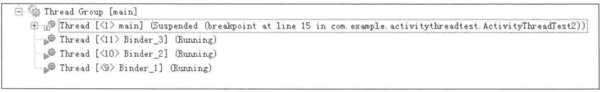

# Activity启动后生成几个Thread

Activity启动后，除了main thread，还有两个Binder Thread。

# 主线程是怎么产生的

1. 由ZygoteInit启动，经由一系列系统调用后最终才执行Activity本身的onCreate函数，Zygote为Activity创建的主线程是ActivityThread。

# Service的主线程是什么

1. Service也是寄存于ActivityThread之中的，并且启动流程和Activity基本一致；即Activity和Service应用程序的主线程都是ActivityThread。
2. 启动Service时，也同样需要两个Binder线程的支持。

# 同一个程序包中有两个Acivity

两个Activity之间是什么关系？需要有多少线程的支持？

AndroidManifest.xml：

```xml
/* AndroidManifest.xml */
<activity android:name="./ActivityThreadTest"
          android:label="@string/title_activity_activity_thread_test" >
    <intent-filter>
        <action android:name="android.intent.action.MAIN" />
        <category android:name="android.intent.category.LAUNCHER" />
    </intent-filter>
</activity>

<activity android:name=".ActivityThreadTest2"
          android:label="@string/title_activity_activity_thread_test" >
</activity>
```

ActivityThreadTest.java

```java
/* ActivityThreadTest.java */
public void onCreate(Bundle savedInstanceState) {
    super.onCreate(savedInstanceState);
    Log.i("ActivityThreadTest1", "We are in ThreadTest1");
    setContentView(R.layout.activity_activity_thread_test);
    Intent intentThread2 = new Intent(this, ActivityThreadTest2.class);
    startActivity(intentThread2);
}
```

当断点停在ActivityThreadTest2的onCreate函数中时，线程的分布情况如下：



其中揭示了以下几个现象。
> 当ActivityThreadTest2被执行时，主线程始终只有一个。
> 此时ActivityThreadTest暂时退出了运行。
> Binder线程数量有所变化。

## 同一个AndroidManifest.xml中定义的组件都运行于同一个进程中

对于同一个AndroidManifest.xml中定义的四大组件，除非有特别声明，否则它们都运行于同一个进程中（并且均由主线程来处理事件）。

根据操作系统的基础知识，如果两个对象处于同一个进程空间中，那么内存区域应该是可共享访问的。可以利用这个原理来论证先后启动的同一个包里的两个Activity是否共存于同一个进程中。先让ActivityThreadTest拥有一个static的变量，如下所示。

```java
/* ActivityThreadTest.java */
public class ActivityThreadTest extends Activity {
    static int TestForCoexist = -1;
    @Override
    public void onCreate(Bundle savedInstanceState) {
        super.onCreate(savedInstanceState);
        Log.i("ActivityThreadTest1", "We are in ThreadTest1");
        setContentView(R.layout.activity_activity_thread_test);
        Intent intentThread2 = new Intent(this, ActivityThreadTest2.class);
        TestForCoexist = 2;
        startActivity(intentThread2);
    }
}
```

ActivityThreadTest中有一个静态的变量TestForCoexist。其初始值为-1，并在Activity启动后（onCreate 中）被修改为2。

接着看ActivityThreadTest2的源码实现：

```java
/* ActivityThreadTest2.java */
public class ActivityThreadTest2 extends Activity {
    @override
    public void onCreate(Bundle savedInstanceState)
    super.onCreate(savedInstanceState);
    Log.i("ActivityThreadTest2","We are in ThreadTest2");
    setContentView(R.layout.activity_activity_thread_test);
    Log.i("ActivityThreadTest2","TestForCoexist="
          + ActivityThreadTest.TestForCoexist);//实验结果将在这里呈现
}
```


运行这个应用程序，来看看最终的输出，TestForCoexist为2。

这就足够证明两个 Activity 是在同一个进程空间中了。

仔细观察，还会发现二者所处的应用程序PID和TID值是相同的。这都证明了一个结论，那就是同一个程序包里的两个Activity默认确实都运行于同一个进程中。

# 让不同包的组件运行于相同的进程中

Android提供了特殊的方式让不是同一个包里的组件也可以运行于相同的进程中。优势就是，它们可以非常方便地进行资源共享，而不用经过费时费力的进程间通信。分为两种情况：

## 针对个别组件

可以在`AndroidManifest.xml`文件中的`<activity>`、`<service>`、`<receiver>`和`<provider>`（四大组件都支持，可以根据需要来添加）标签中加入`android:process`属性来表明这一组件想要运行在哪个进程空间中。

## 针对整个程序包

可以直接在`<application>`标签中加入`android:process`属性来指明想要依存的进程环境。

# 结论

1. 四大组件并不是程序（进程）的全部，而只是它的"零件"。
2. 应用程序启动后，将创建ActivityThread主线程。
3. 同一个包中的组件将运行在相同的进程空间中。
4. 不同包中的组件可以通过一定的方式运行在一个进程空间中。
5. 一个Activity应用启动后至少会有3个线程：即一个主线程和两个Binder线程。