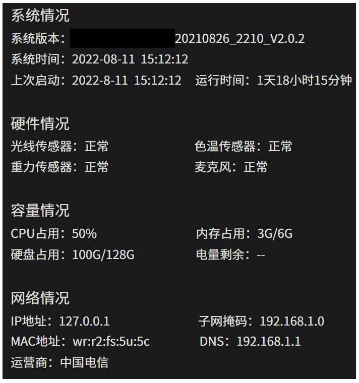

# 需求

远程诊断，诊断信息包括基础系统信息、硬件信息、容量信息、网络信息等，兼容旧平台远程诊断逻辑和旧版本固件。

前端模拟效果：



| 远程诊断属性                    | 备注                                                         |
| ------------------------------- | ------------------------------------------------------------ |
| 光线传感器                      | 当前数值，或异常                                             |
| 色温传感器                      | 当前数值，或异常                                             |
| 重力传感器                      | 当前数值（x，y，z），或异常                                  |
| 麦克风                          | 正常或异常                                                   |
| DNS                             | 可能有多个地址。                                             |
| 网络诊断模块 - 抖动、丢包、延时 | 可能需要参考多个地址，如果只按希沃后台来诊断，则不能判断第三方是否有问题 |
| 网络诊断模块 - 当前局域网设备数 | 获取局域网其他设备数可能不具有参考价值，重点需要判断设备本身的网络情况 |

# 设备端主要任务

1. 系统版本
2. 获取时间
   1. 系统当前时间
   2. 已运行时间
   3. 上次启动时间，无直接获取的API，系统当前时间减去已运行时间即可。
3. 感知状态
   1. 三个传感器，异步获取其即时值。
   2. 麦克风状态，异步检测。
4. 硬件负载
   1. CPU负载计算
   2. 内存、硬盘状态信息获取
5. 网卡信息获取
   1. 内网IP地址
   2. 子网掩码
   3. MAC地址
   4. DNS配置地址
6. 外网信息
   1. 外网IP地址
   2. 运营商名称

# 链路

设备端服务程序常运行，监听后端IOT下发指令。设备进行一系列信息抓取、硬件检查后，doput上报。

# 框架设计

```kotlin
/**
 * 约定分发规则：
 * 服务类型: key = method
 * 属性类型: key = thing.property.get#属性名 或者 thing.property.get#属性名
 */
object ExtHandlerManager : CoroutineScope {
    override val coroutineContext: CoroutineContext
        get() = Dispatchers.Default
    private val serviceMap = hashMapOf<String, IServiceHandler>()
    private val propertyMap = hashMapOf<String, IPropertyHandler>()
    var iotClient: ICIoTClient? = null
    
    init {
        //service
        serviceMap["thing.service.sendDiagnosisFetchMinder"] = SendDiagnosisFetchMinderHandler()
    }
    fun registerHandlers(manger: IHandlerManager?) {
        manger?.apply {
            for ((k, v) in serviceMap) {
                registerServiceHandler(k, v)
            }
            for ((k, v) in propertyMap) {
                registerPropertyHandler(k, v)
            }
            startHandle()
        }
    }

    fun unregisterHandlers(manger: IHandlerManager?) {
        manger?.apply {
            for ((k, v) in serviceMap) {
                unregisterServiceHandler(k, v)
            }
            for ((k, v) in propertyMap) {
                unregisterPropertyHandler(k, v)
            }
        }
    }
}
```

## Handler接口

IOT下发指令，向设备请求。设备端收到请求后，用对应的handler进行请求参数的处理。即实现onRequest方法。其中，请求可带参数，约定为json串，可下发一个taskUid，方便后续设备发送响应时回传。

```kotlin
interface IServiceHandler {
    fun onRequest(topic: String?, method: String?, params: String?, traceId: String?)
}
```

接到请求后，启一个Runnable线程，线程函数里执行`DiagnosisFetchListener().sendDiagnosisFetchMinder(taskUid)`，开始进行设备信息的抓取和诊断，之后整合为json串后响应给IOT后台。

```kotlin
/**
 * RemoteDetectSystemInfoHandler
 * @Author xingchenggong 2022/08/23
 */
class SendDiagnosisFetchMinderHandler : IServiceHandler, CoroutineScope {
    private val TAG = "SendDiagnosisFetchMinderHandler"
    override val coroutineContext: CoroutineContext
        get() = Dispatchers.Default
    private val handler = Handler(Looper.getMainLooper())

    //{
    //    "uid": "text, 32字节"
    //}
    override fun onRequest(topic: String?, method: String?, params: String?, traceId: String?) {
        Log.i(TAG, ">>> topic: $topic, method:$method, params:$params, traceId:$traceId")
        var taskUid: String? = null
        if(!params.isNullOrEmpty()) {
            taskUid = JSONObject(params).get("taskUid") as String
            val paramsAvailable = checkParamsAvailable(taskUid)
        } else {
            Log.e(TAG, "DiagnosisFetch error, cause params is empty")
            return
        }
        try {
            val diagnosisFetchInfo = Runnable { DiagnosisFetchListener().sendDiagnosisFetchMinder(taskUid) }
            handler.post(diagnosisFetchInfo)
        } catch (e: IllegalStateException) {
            Log.e(TAG, ">>> onRequest:java.lang.IllegalStateException")
        }
    }
    private fun checkParamsAvailable(uid: String): Boolean {
        var paramsAvailable = true
        if(uid.isBlank()) {
            Log.e(TAG, "checkParamsAvailable failed, uid is empty")
            paramsAvailable = false
        }
        return paramsAvailable
    }

}
```

# 设备信息抓取和诊断以及之后响应后台的实现

## 数据模型

```kotlin
data class DiagnosisReportInfo(
    val taskUid: String,
    val diagnosisResultBo: DiagnosisFetchInfo,
    val taskStatus: Int
)
data class OuterNetInfo(
    val ip: String,         //外网ip
    val netOperator: String //外网运营商
)
data class InnerNetInfo(
    val ip: String,         //内网ip
    val subNetMask: String, //子网掩码
    val mac: String,        //网卡地址
    val dns: List<String>   //dns
)
data class DiagnosisFetchInfo(
    val version: String,
    val systemTime: Long,
    val lastStartTime: Long,
    val runningTime: Long,
    val lightSensorData: String,
    val colorTemperatureSensorData: String,
    val gravitySensorData: String,
    val microphoneState: String,
    val cpuInfo: Float,
    val totalMemory: Float,
    val usageMemory: Float,
    val totalStorage: Float,
    val usageStorage: Float,
    val outerNetInfo: OuterNetInfo,
    val innerNetInfoWifi: InnerNetInfo,
    val innerNetInfoEth: InnerNetInfo
)
```

## 时间获取

```kotlin
import android.os.SystemClock
/**
 * @author: xingchenggong 2022/08/22
 */
object SystemTimeUtils {

    fun getCurrentSystemTimestamp(): Long{
        try {
            return System.currentTimeMillis()
        } catch (e: Exception) {
            e.printStackTrace()
        }
        return 0
    }
    fun getElapsedTimeMillis(): Long {
        try {
            return SystemClock.elapsedRealtime()
        } catch (e: Exception) {
            e.printStackTrace()
        }
        return 0
    }
    fun getLastStartTimestamp(): Long {
        var timestamp = getCurrentSystemTimestamp() - getElapsedTimeMillis()
        return if(timestamp >= 0) {
            timestamp
        } else {
            0
        }
    }
}
```

## 传感器状态获取

```java
import android.content.Context;
import android.hardware.Sensor;
import android.hardware.SensorEvent;
import android.hardware.SensorEventListener;
import android.hardware.SensorManager;
import android.os.Handler;
import android.os.HandlerThread;
import android.os.Looper;
import android.os.Message;

import androidx.annotation.NonNull;

import java.util.ArrayList;
import java.util.List;

public class SensorUtil {
    private SensorResultCallback mSensorResultCallback;
    private H mHandler;
    private Looper mLooper;
    private SensorManager mSensorManager = null;
    private SensorEventListener mSensorEventListener;
    private boolean mIsAlreadyGetResult = false;

    private final static int MSG_GET_SENSOR_TIME_OUT = 100;
    private final static int MSG_GET_SENSOR_NORMAL = 101;
    private String mSensorName;
    public SensorUtil(String name) {
        mSensorName = name;
    }

    public Boolean startRegisterListener(Context context, int sensorType, SensorResultCallback callback) {
        mSensorResultCallback = callback;
        HandlerThread thread = new HandlerThread(mSensorName);
        thread.start();
        mLooper = thread.getLooper();
        mHandler = new H(mLooper);

        mSensorManager = (SensorManager) context.getSystemService(Context.SENSOR_SERVICE);
        Sensor sensor = mSensorManager.getDefaultSensor(sensorType);

        if (sensor == null) {
            return false;
        }

        mSensorEventListener = new SensorEventListener() {
            @Override
            public void onSensorChanged(SensorEvent event) {
                if (!mIsAlreadyGetResult) {
                    mIsAlreadyGetResult = true;
                    mHandler.removeMessages(MSG_GET_SENSOR_TIME_OUT);
                    mHandler.removeMessages(MSG_GET_SENSOR_NORMAL);
                    List<Float> result = new ArrayList<Float>(3);  //TODO get result
                    int i = event.values.length;
                    for (float val : event.values) {
                        result.add(val);
                    }
                    mHandler.obtainMessage(MSG_GET_SENSOR_NORMAL, 0, 0, result).sendToTarget();
                }
            }

            @Override
            public void onAccuracyChanged(Sensor sensor, int accuracy) {

            }
        };

        mSensorManager.registerListener(mSensorEventListener, sensor, SensorManager.SENSOR_DELAY_NORMAL);

        mHandler.removeMessages(MSG_GET_SENSOR_TIME_OUT);
        mHandler.sendEmptyMessageDelayed(MSG_GET_SENSOR_TIME_OUT, 5000);
        return true;
    }

    private void stopListener() {
        if (mSensorManager != null && mSensorEventListener != null) {
            mSensorManager.unregisterListener(mSensorEventListener);
        }

        if (mLooper != null) {
            mLooper.quitSafely();
        }
    }

    public interface SensorResultCallback {
        void onDataCallBack(List<Float> result);
        void onGetDataTimeout();
    }

    private class H extends Handler {
        private H() {
            super();
        }

        private H(Looper looper) {
            super(looper);
        }

        @Override
        public void handleMessage(@NonNull Message msg) {
            super.handleMessage(msg);

            if (mSensorResultCallback == null) {
                return;
            }

            switch (msg.what) {
                case MSG_GET_SENSOR_NORMAL:
                    mSensorResultCallback.onDataCallBack((List<Float>)msg.obj);
                    break;
                case MSG_GET_SENSOR_TIME_OUT:
                    mSensorResultCallback.onGetDataTimeout();
                    break;
            }
            stopListener();
            mSensorResultCallback = null;
        }
    }
}
```

## 麦克风检测

```kotlin
object DeviceInfoUtils {
    /**
     * 判断当前设备是否是XX15
     */
    @JvmStatic
    fun isXX15Model(): Boolean {
        // XX15
        return Build.MODEL.contains("XX15")
    }

    /**
     * 判断当前设备是否是XX02
     */
    @JvmStatic
    fun isXX02Model(): Boolean {
        // XX02
        return Build.MODEL.contains("XX02")
    }
}

class DetectMicUtils {
    private val audioRecordTest by lazy {
        AudioRecordTest()
    }
    private fun detectMic(): Boolean {
        // 不同设备型号不同的检测方式
        return if (DeviceInfoUtils.isXX15Model()) {
            audioRecordTest.beginTest()
        } else {
            SystemPropertiesUtils.set("mic.hw.test.req", "1")
            Thread.sleep(2000L)
            SystemPropertiesUtils.get("mic.hw.test.ret", "0") == "11"
        }
    }
    fun getMicState(): String {
        return if (detectMic()) {
            "正常"
        } else {
            "异常"
        }
    }
}
```

```kotlin
import android.media.AudioFormat
import android.media.AudioRecord
import android.media.MediaRecorder

class AudioRecordTest {

    private val AUDIO_INPUT = MediaRecorder.AudioSource.VOICE_RECOGNITION
    private val AUDIO_SAMPLE_RATE = 32000
    private val AUDIO_CHANNEL = AudioFormat.CHANNEL_IN_MONO
    private val AUDIO_ENCODING = AudioFormat.ENCODING_PCM_16BIT

    private val MAX_ALLOW_DB_BETWEEN_VALUE = 5
    private val MIN_DB_VALUE = 3 // 只有底噪时会有 0 ~ 2db值
    private var recordBufSize = 0

    private lateinit var recordBuffer: ByteArray
    private var mAudioRecord: AudioRecord? = null
    private lateinit var recordBufferMic: ByteArray
    private lateinit var recordBufferMic1: ByteArray
    private lateinit var recordBufferMic2: ByteArray

    private var isRecording = false
    private var mErrorCounts = 0
    private var mInValidDataCounts = 0
    private var mValidDataCounts = 0

    fun isRecordTesting():Boolean {
        return isRecording
    }

    fun beginTest():Boolean {
        var result = false

        if (isRecording) {
            return result
        }

        recordBufSize =
            AudioRecord.getMinBufferSize(AUDIO_SAMPLE_RATE, AUDIO_CHANNEL, AUDIO_ENCODING)

        mAudioRecord = AudioRecord(AUDIO_INPUT, AUDIO_SAMPLE_RATE, AUDIO_CHANNEL,
            AUDIO_ENCODING, recordBufSize)

        recordBuffer = ByteArray(recordBufSize)

        if (recordBufSize % 4 == 0) {
            recordBufferMic = ByteArray(recordBufSize / 2)
            recordBufferMic1 = ByteArray(recordBufSize / 4)
            recordBufferMic2 = ByteArray(recordBufSize / 4)
        }

        isRecording = true
        mValidDataCounts = 0
        mInValidDataCounts = 0
        mErrorCounts = 0

        mAudioRecord!!.startRecording()

        while (isRecording) {
            val read = mAudioRecord!!.read(recordBuffer, 0, recordBufSize)

            if (read > AudioRecord.SUCCESS) {
                try {
                    var i = 0
                    while (i + 7 < read) {
                        var index = i / 2
                        recordBufferMic[index] = recordBuffer[i]
                        recordBufferMic[index + 1] = recordBuffer[i + 1]
                        recordBufferMic[index + 2] = recordBuffer[i + 2]
                        recordBufferMic[index + 3] = recordBuffer[i + 3]

                        index /= 2

                        recordBufferMic1[index] = recordBuffer[i]
                        recordBufferMic1[index + 1] = recordBuffer[i + 1]

                        recordBufferMic2[index] = recordBuffer[i + 2]
                        recordBufferMic2[index + 1] = recordBuffer[i + 3]

                        i += 8
                    }

                    val origDb = getPcmDB(recordBufferMic, read / 2) // 获取原始mic的分贝值
                    val mic1Db = getPcmDB(recordBufferMic1, read / 4) // 获取mic1的分贝值
                    val mic2Db = getPcmDB(recordBufferMic2, read / 4) // 获取mic2的分贝值

                    if (origDb < 0 && mic1Db < 0 && mic2Db < 0) {
                        if (++mInValidDataCounts >= 100) { // 大约 1s
                            stopRecordTest()
                            result = false
                            break
                        }
                    } else if (Math.abs(origDb - mic1Db) >= MAX_ALLOW_DB_BETWEEN_VALUE
                        || Math.abs(origDb - mic2Db) >= MAX_ALLOW_DB_BETWEEN_VALUE
                        || mic1Db <= MIN_DB_VALUE && mic2Db <= MIN_DB_VALUE) {
                        if (++mErrorCounts >= 10) {
                            stopRecordTest()
                            result = false
                            break
                        }
                    } else {
                        mInValidDataCounts = 0
                        mErrorCounts = 0
                        if (++mValidDataCounts >= 100) {
                            stopRecordTest()
                            result = true
                        }
                    }
                } catch (e: Exception) {
                    stopRecordTest()
                    result = false
                    e.printStackTrace()
                }
            } else if (read < AudioRecord.SUCCESS) {
                stopRecordTest()
                result = false
            }
        }

        return result
    }

    private fun getPcmDB(pcmData: ByteArray, size: Int): Int {
        var sum = 0.0
        var temp: Long
        var i = 0
        while (i < pcmData.size) {
            temp = (pcmData[i + 1].toLong() shl 8) or (pcmData[i].toLong() and 0x000000FF.toLong())
            sum += Math.abs(temp).toDouble()
            i += 2
        }
        return (20 * Math.log10(sum / size.toDouble())).toInt()
    }

    private fun stopRecordTest() {
        if (!isRecording) {
            return
        }
        isRecording = false
        if (null != mAudioRecord) {
            mAudioRecord!!.stop()
            mAudioRecord!!.release()
            mAudioRecord = null
        }
    }
}
```

## 硬件负载情况

### CPU负载

```java
    @SuppressLint({"DefaultLocale", "LongLogTag"})
    public static float getCpuTotalUsageFloat() {
        try {
            double cpuIdleTimePre;
            double cpuOccupiedTimePre;
            double cpuIdleTimeCur;
            double cpuOccupiedTimeCur;

            ShellCommandUtils.CommandResult cpuInfoResult = ShellCommandUtils.executeCommand("cat /proc/stat | head -n 1");
            if (cpuInfoResult.result == 0) {
                String line = cpuInfoResult.successMsg;
                String[] cpuTimeSubInfo = line.split(" ");
                cpuIdleTimePre = Double.parseDouble(cpuTimeSubInfo[5]);//5:idle
                cpuOccupiedTimePre = Double.parseDouble(cpuTimeSubInfo[2]) +//2:user
                        Double.parseDouble(cpuTimeSubInfo[3]) +//3:nice
                        Double.parseDouble(cpuTimeSubInfo[4]) +//4:system
                        Double.parseDouble(cpuTimeSubInfo[6]) +//6:iowait
                        Double.parseDouble(cpuTimeSubInfo[7]) +//7:irq
                        Double.parseDouble(cpuTimeSubInfo[8]);//8:softirq
            } else {
                Log.e(TAG, "getCpuTotalUsage: " + cpuInfoResult.errorMsg);
                return 0.0f;
            }
            try {
                Thread.sleep(360);
            } catch (Exception e) {
                e.printStackTrace();
            }

            cpuInfoResult = ShellCommandUtils.executeCommand("cat /proc/stat | head -n 1");
            if (cpuInfoResult.result == 0) {
                String line = cpuInfoResult.successMsg;
                String[] cpuTimeSubInfo = line.split(" ");
                cpuIdleTimeCur = Double.parseDouble(cpuTimeSubInfo[5]);//5:idle
                cpuOccupiedTimeCur = Double.parseDouble(cpuTimeSubInfo[2]) +//2:user
                        Double.parseDouble(cpuTimeSubInfo[3]) +//3:nice
                        Double.parseDouble(cpuTimeSubInfo[4]) +//4:system
                        Double.parseDouble(cpuTimeSubInfo[6]) +//6:iowait
                        Double.parseDouble(cpuTimeSubInfo[7]) +//7:irq
                        Double.parseDouble(cpuTimeSubInfo[8]);//8:softirq
            } else {
                Log.e(TAG, "getCpuTotalUsage: " + cpuInfoResult.errorMsg);
                return 0.0f;
            }
            double deltaCpuOccupiedTime = 100 * (cpuOccupiedTimeCur - cpuOccupiedTimePre);
            double deltaCpuTotalTime = (cpuOccupiedTimeCur + cpuIdleTimeCur) -
                    (cpuOccupiedTimePre + cpuIdleTimePre);
            BigDecimal deltaCpuOccupiedTimeBigDecimal = new BigDecimal(deltaCpuOccupiedTime);
            BigDecimal deltaCpuTotalTimeBigDecimal = new BigDecimal(deltaCpuTotalTime);
            float cpuUsageIntValue = deltaCpuOccupiedTimeBigDecimal.divide(deltaCpuTotalTimeBigDecimal,
                    BigDecimal.ROUND_HALF_UP).intValue();
            return cpuUsageIntValue;
        } catch (Exception e) {
            e.printStackTrace();
            Log.e(TAG, "getCpuTotalUsage: " + e.getMessage());
        }
        return 0.0f;
    }
```

### 获取存储信息

```kotlin
import android.annotation.SuppressLint
import android.app.ActivityManager
import android.content.Context
import android.content.Context.ACTIVITY_SERVICE
import utils.FormatterUtils.formatFromByteToGB

class SystemMemoryUtils(context: Context) {

    companion object {
        const val TAG = "SystemStorageUtils"
    }

    private val mContext = context

    @SuppressLint("ServiceCast")
    private val mActivityManager =
        mContext.getSystemService(ACTIVITY_SERVICE) as ActivityManager

    val instance by lazy(LazyThreadSafetyMode.SYNCHRONIZED) {
        getCurrentSystemMemoryUsage()
    }

    fun getSystemMemoryTotalFloat(): Float {
        try {
            val memoryInfo = ActivityManager.MemoryInfo()
            mActivityManager.getMemoryInfo(memoryInfo)
            return formatFromByteToGB(memoryInfo.totalMem)
        } catch (e: Exception) {
            e.printStackTrace()
        }
        return 0.0f
    }

    fun getCurrentSystemMemoryUsageFloat(): Float {
        try {
            val memoryInfo = ActivityManager.MemoryInfo()
            mActivityManager.getMemoryInfo(memoryInfo)
            return formatFromByteToGB(memoryInfo.totalMem - memoryInfo.availMem)
        } catch (e: Exception) {
            e.printStackTrace()
        }
        return 0.0f
    }
}
```

```kotlin
import android.app.usage.StorageStatsManager
import android.content.Context
import android.content.Context.STORAGE_STATS_SERVICE
import android.os.Build
import android.os.storage.StorageManager
import androidx.annotation.RequiresApi
import java.io.IOException
import java.text.DecimalFormat

@RequiresApi(Build.VERSION_CODES.O)
class SystemStorageUtils(context: Context) {
    companion object{
        const val TAG = "SystemStorageUtils"
    }
    private val mContext = context
    private val mStorageStatsManager =
        mContext.getSystemService(STORAGE_STATS_SERVICE) as StorageStatsManager

    fun getSystemTotalStorageFloat(): Float {
        return FormatterUtils.formatFromByteToGB(mStorageStatsManager.getTotalBytes(StorageManager.UUID_DEFAULT))
    }

    fun getCurrentSystemStorageUsageFloat(): Float {
        try {
            val totalStorage = mStorageStatsManager.getTotalBytes(StorageManager.UUID_DEFAULT)
            val availableStorage = mStorageStatsManager.getFreeBytes(StorageManager.UUID_DEFAULT)
            return FormatterUtils.formatFromByteToGB(totalStorage - availableStorage)
        } catch (e: IOException) {
            e.printStackTrace()
        }
        return 0.0f
    }
}
```

## 内网网卡信息获取

```java
    public static String getDeviceSpecifiedMacAddress(String NICName) {
        if(NICName == null || NICName.isEmpty())
        {
            return "";
        }
        try {
            Enumeration<NetworkInterface> enumeration = NetworkInterface.getNetworkInterfaces();
            while (enumeration.hasMoreElements()) {
                NetworkInterface networkInterface = enumeration.nextElement();
                if (networkInterface != null && !TextUtils.isEmpty(networkInterface.getName())) {
                    if (networkInterface.getName().equalsIgnoreCase(NICName)) {
                        byte[] arrayOfByte = networkInterface.getHardwareAddress();
                        if (arrayOfByte != null && arrayOfByte.length > 0) {
                            StringBuilder deviceMacAddress = new StringBuilder();
                            // format the mac address
                            for (byte b : arrayOfByte) {
                                deviceMacAddress.append(String.format("%02X:", b));
                            }
                            if (deviceMacAddress.length() > 0) {
                                deviceMacAddress.deleteCharAt(deviceMacAddress.length() - 1);
                            }
                            return deviceMacAddress.toString();
                        }
                    }
                }
            }
        } catch (SocketException e) {
            e.printStackTrace();
            Log.e(TAG, "getDeviceSpecifiedMacAddress: " + e.getMessage());
        }
        return "";
    }
    public static String getDeviceSpecifiedIPAddress(String NICName) {
        if(NICName == null || NICName.isEmpty())
        {
            return "";
        }
        String IPAddress = "";
        try {
            Enumeration<NetworkInterface> enumeration = NetworkInterface.getNetworkInterfaces();
            while (enumeration.hasMoreElements()) {
                NetworkInterface networkInterface = enumeration.nextElement();
                if (networkInterface != null) {
                    if (networkInterface.getName().equalsIgnoreCase(NICName)) {
                        Enumeration<InetAddress> ei = networkInterface.getInetAddresses();
                        while (ei.hasMoreElements()) {
                            InetAddress i = ei.nextElement();
                            if(i instanceof Inet4Address)
                                IPAddress = i.getHostAddress();
                        }
                    }
                }
            }
        } catch (SocketException e) {
            e.printStackTrace();
        }
        return IPAddress;
    }
    /**
     *  Masks a raw IP address byte array with the specified prefix length.
     */
    public static void maskRawAddress(byte[] array, int prefixLength) {
        if (prefixLength < 0 || prefixLength > array.length * 8) {
            throw new RuntimeException("IP address with " + array.length +
                    " bytes has invalid prefix length " + prefixLength);
        }

        int offset = prefixLength / 8;
        int remainder = prefixLength % 8;
        byte mask = (byte)(0xFF << (8 - remainder));

        if (offset < array.length) array[offset] = (byte)(array[offset] & mask);

        offset++;

        for (; offset < array.length; offset++) {
            array[offset] = 0;
        }
    }
    /**
     * Get InetAddress masked with prefixLength.  Will never return null.
     * @param address the IP address to mask with
     * @param prefixLength the prefixLength used to mask the IP
     */
    public static InetAddress getNetworkPart(InetAddress address, int prefixLength) {
        byte[] array = address.getAddress();
        maskRawAddress(array, prefixLength);

        InetAddress netPart = null;
        try {
            netPart = InetAddress.getByAddress(array);
        } catch (UnknownHostException e) {
            throw new RuntimeException("getNetworkPart error - " + e.toString());
        }
        return netPart;
    }
    private static String ipv4PrefixLengthToSubnetMask(int prefixLength) {
        try {
            InetAddress all = InetAddress.getByAddress(
                    new byte[]{(byte) 255, (byte) 255, (byte) 255, (byte) 255});
            return getNetworkPart(all, prefixLength).getHostAddress();
        } catch (UnknownHostException e) {
            return null;
        }
    }
    public static String getDeviceSpecifiedSubNetMaskFromConnectionManager(Context context, String NICName) {
        if(NICName == null || NICName.isEmpty())
        {
            return "";
        }
        String subnet = "";
        if (Build.VERSION.SDK_INT >= 21 && context != null) {
            ConnectivityManager connectivityManager = (ConnectivityManager) context.getSystemService(context.CONNECTIVITY_SERVICE);
            if (connectivityManager != null) {
                for (Network network : connectivityManager.getAllNetworks()) {
                    LinkProperties lp = connectivityManager.getLinkProperties(network);
                    if (lp.getInterfaceName().equals(NICName))
                    {
                        Log.w("SUBNETMASK", NICName);
                        for (LinkAddress addr : lp.getLinkAddresses()) {
                            if (addr.getAddress() instanceof Inet4Address) {
                                subnet = ipv4PrefixLengthToSubnetMask(addr.getPrefixLength());
                            }
                        }
                    }
                }
            }
        }
        return subnet;
    }

    public static List<String> getDeviceActiveNetWorkDnsFromConnectionManager(Context context, int type) {
        ConnectivityManager connectivityManager = (ConnectivityManager) context.getSystemService(context.CONNECTIVITY_SERVICE);
        NetworkInfo activeNetworkInfo = connectivityManager.getActiveNetworkInfo();
        return getDeviceSpecifiedDnsFromConnectionManager(context, activeNetworkInfo.getType());
    }

    public static List<String> getDeviceSpecifiedDnsFromConnectionManager(Context context, int type) {
        List<String> dnsServers = new ArrayList<>();
        if (Build.VERSION.SDK_INT >= 21 && context != null) {
            ConnectivityManager connectivityManager = (ConnectivityManager) context.getSystemService(context.CONNECTIVITY_SERVICE);
            if (connectivityManager != null) {
                for (Network network : connectivityManager.getAllNetworks()) {
                    NetworkInfo networkInfo = connectivityManager.getNetworkInfo(network);
                    if (networkInfo != null && networkInfo.getType() == type) {
                        LinkProperties lp = connectivityManager.getLinkProperties(network);
                        for (InetAddress addr : lp.getDnsServers()) {
                            dnsServers.add(addr.getHostAddress());
                        }
                    }
                }
            }
        }
        return dnsServers;
    }
```

## 外网信息获取

```java
    @SuppressLint("LongLogTag")
    public static String getEthernetIPFromJson(String ethernetJsonStr) {
        try {
            if (ethernetJsonStr.isEmpty()) {
                Log.d(TAG, "getEthernetIPFromJson: Analysis Json is empty!");
                return "NA";
            }
            JSONObject jsonObject = new JSONObject(ethernetJsonStr);
            String msg = jsonObject.getString("msg");
            if (msg.isEmpty()) {
                Log.d(TAG, "getEthernetIPFromJson: Analysis Json no msg tag!");
                return "NA";
            }
            if (!msg.equals("ok")) {
                Log.d(TAG, "getEthernetIPFromJson: Analysis Json TAG ok failed!");
                return "NA";
            }
            jsonObject = jsonObject.getJSONObject("data");
            String ethernetIPFromJson = jsonObject.getString("ip");
            if (ethernetIPFromJson == null || ethernetIPFromJson.isEmpty())
                ethernetIPFromJson = "NA";
            return ethernetIPFromJson;
        } catch (JSONException e) {
            e.printStackTrace();
            Log.e(TAG, "getEthernetIPFromJson: " + e.getMessage());
            return "NA";
        }
    }

    @SuppressLint("LongLogTag")
    public static String getEthernetOperatorFromJson(String ethernetJsonStr) {
        try {
            if (ethernetJsonStr.isEmpty()) {
                Log.d(TAG, "getEthernetIPFromJson: Analysis Json is empty!");
                return "NA";
            }
            JSONObject jsonObject = new JSONObject(ethernetJsonStr);
            String msg = jsonObject.getString("msg");
            if (msg.isEmpty()) {
                Log.d(TAG, "getEthernetIPFromJson: Analysis Json no msg tag!");
                return "NA";
            }
            if (!msg.equals("ok")) {
                Log.d(TAG, "getEthernetOperatorFromJson: Analysis Json TAG ok failed!");
                return "NA";
            }
            jsonObject = jsonObject.getJSONObject("data");
            return jsonObject.getString("operator");
        } catch (JSONException e) {
            e.printStackTrace();
            Log.e(TAG, "getEthernetOperatorFromJson: " + e.getMessage());
        }
        return "NA";
    }
```

## 汇总

```kotlin
class DiagnosisFetchListener {
    private var mSystemVersion : String? = null

    private fun getSystemVersion():String {
        if (mSystemVersion.isNullOrEmpty()) {
            mSystemVersion = SystemPropertiesUtils.get(BuildConfig.SYSTEM_VERSION_PROP, "xxxOS")
        }
        return mSystemVersion as String
    }
    //方法：thing.event.sendDiagnosisFetchMinder.post
    //{
    //    "method": "thing.event.sendDiagnosisFetchMinder.post",
    //}
    fun sendDiagnosisFetchMinder(taskUid: String) {
        GetEthernetInfoRequestJson().getEthernetRequest(object : GetEthernetInfoRequestJson.AnalysisEthernetJson {
            @RequiresApi(Build.VERSION_CODES.O)
            override fun analysisEthernetFromJson(json: String) {
                if (json.isEmpty()){
                    Log.e(
                        DeviceReport.TAG,
                        ">>> analysisEthernetFromJson(): origin json string is empty, return")
                    return
                }
                val ip: String = RemoteDetectSystemInfoUtil.getEthernetIPFromJson(json)
                val netOperator: String = RemoteDetectSystemInfoUtil.getEthernetOperatorFromJson(json)

                if (ip.isEmpty() || netOperator.isEmpty()) {
                    Log.d(DeviceReport.TAG, ">>> CIot-ext-Handler sendDiagnosisFetchMinder!! ip or netOperator is null!")
                }
                val version: String = getSystemVersion()
                //systemTime, millis
                val systemTime: Long = SystemTimeUtils.getCurrentSystemTimestamp()
                //lastStartTime, millis
                val lastStartTime: Long = SystemTimeUtils.getLastStartTimestamp()
                //runningTime, millis
                val runningTime: Long = SystemTimeUtils.getElapsedTimeMillis()

                //lightSensor
                val lightSensorUtil = SensorUtil("lightSensor")
                var lightSensorData: String = ""
                if(! lightSensorUtil.startRegisterListener(
                        ContextHelper.getApplicationContext(),
                        Sensor.TYPE_LIGHT, object: SensorUtil.SensorResultCallback {
                            override fun onDataCallBack(result: List<Float>) {
                                lightSensorData = result[0].toString() + "lux"
                            }
                            override fun onGetDataTimeout() {
                                lightSensorData = "超时异常"
                            }

                        }))
                {
                    lightSensorData = "获取传感器失败，可能是硬件异常"
                }
                //colorTemperatureSensor
                val colorTemperatureSensorUtil = SensorUtil("colorTemperatureSensor")
                var colorTemperatureSensorData: String = ""
                if(! colorTemperatureSensorUtil.startRegisterListener(
                        ContextHelper.getApplicationContext(),
                        36, object: SensorUtil.SensorResultCallback {
                            override fun onDataCallBack(result: List<Float>) {
                                colorTemperatureSensorData = result[0].toString() + "k"
                            }
                            override fun onGetDataTimeout() {
                                colorTemperatureSensorData = "超时异常"
                            }

                        }))
                {
                    colorTemperatureSensorData = "获取传感器失败，可能是硬件异常"
                }
                //gravitySensorData
                val gravitySensorUtil = SensorUtil("gravitySensor")
                var gravitySensorData: String = ""
                if(! gravitySensorUtil.startRegisterListener(
                        ContextHelper.getApplicationContext(),
                        Sensor.TYPE_ACCELEROMETER, object : SensorUtil.SensorResultCallback {
                            override fun onDataCallBack(result: List<Float>) {
                                gravitySensorData = "x:" + result[0].toString() +
                                                    " y:" + result[1].toString() +
                                                    " z:" + result[2].toString()
                            }
                            override fun onGetDataTimeout() {
                                gravitySensorData = "超时异常"
                            }
                        }))
                {
                    gravitySensorData = "获取传感器失败，可能是硬件异常"
                }
                //microphoneState
                val microphoneState: String = DetectMicUtils().getMicState()
                // 容量情况
                val cpuInfo: Float = RemoteDetectSystemInfoUtil.getCpuTotalUsageFloat()
                val totalMemory: Float = SystemMemoryUtils(ContextHelper.getApplicationContext()).getSystemMemoryTotalFloat()
                val usageMemory: Float = SystemMemoryUtils(ContextHelper.getApplicationContext()).getCurrentSystemMemoryUsageFloat()
                val totalStorage: Float = SystemStorageUtils(ContextHelper.getApplicationContext()).getSystemTotalStorageFloat()
                val usageStorage: Float = SystemStorageUtils(ContextHelper.getApplicationContext()).getCurrentSystemStorageUsageFloat()

                // 内网情况
                // ip, 子网掩码, mac地址, DNS(可能有多个),
                val wlan0ip: String = RemoteDetectSystemInfoUtil.getDeviceSpecifiedIPAddress("wlan0")
                val wlan0subnetmask: String = RemoteDetectSystemInfoUtil.
                        getDeviceSpecifiedSubNetMaskFromConnectionManager(ContextHelper.getApplicationContext(),"wlan0")
                val wlan0mac: String = RemoteDetectSystemInfoUtil.getDeviceSpecifiedMacAddress("wlan0")
                val wlan0dns: List<String> = RemoteDetectSystemInfoUtil.
                        getDeviceSpecifiedDnsFromConnectionManager(getApplicationContext(), ConnectivityManager.TYPE_WIFI)

                val eth0ip: String = RemoteDetectSystemInfoUtil.getDeviceSpecifiedIPAddress("eth0")
                val eth0subnetmask: String = RemoteDetectSystemInfoUtil.
                        getDeviceSpecifiedSubNetMaskFromConnectionManager(ContextHelper.getApplicationContext(), "eth0")
                val eth0mac: String = RemoteDetectSystemInfoUtil.getDeviceSpecifiedMacAddress("eth0")
                val eth0dns: List<String> = RemoteDetectSystemInfoUtil.
                        getDeviceSpecifiedDnsFromConnectionManager(getApplicationContext(), ConnectivityManager.TYPE_ETHERNET)

                var outerNetInfo: OuterNetInfo = OuterNetInfo(ip, netOperator)

                var innerNetInfoWifi: InnerNetInfo = InnerNetInfo(wlan0ip,wlan0subnetmask, wlan0mac, wlan0dns)

                var innerNetInfoEth: InnerNetInfo = InnerNetInfo(eth0ip,eth0subnetmask, eth0mac, eth0dns)

                val diagnosisFetchInfo = DiagnosisFetchInfo(
                    version,
                    systemTime,
                    lastStartTime,
                    runningTime,
                    lightSensorData,
                    colorTemperatureSensorData,
                    gravitySensorData,
                    microphoneState,
                    cpuInfo,
                    totalMemory,
                    usageMemory,
                    totalStorage,
                    usageStorage,
                    outerNetInfo,
                    innerNetInfoWifi,
                    innerNetInfoEth
                )
                val diagnosisReportInfo = DiagnosisReportInfo(taskUid, diagnosisFetchInfo, 2)

                HttpHelper.getInstance().doPut(HttpConstants.updateDiagnosisPutUrl(), diagnosisReportInfo, object: Callback {
                    override fun onFailure(call: Call, e: IOException) {
                        Log.e(DeviceReport.TAG, "updateDiagnosisPutUrl:response onFailure")
                    }

                    override fun onResponse(call: Call, response: Response) {
                        val body = response.body!!.string()
                        try {
                            if (response.isSuccessful && isJsonAndGetCode(body) == 0) {
                                Log.d(DeviceReport.TAG, "updateDiagnosisPutUrl:response $body")
                            } else {
                                Log.e(DeviceReport.TAG, "updateDiagnosisPutUrl failed ${response.code}")
                            }
                        } catch (e: Exception) {
                            Log.e(DeviceReport.TAG, e.printStackTrace().toString())
                        }
                    }
                })
            }
        })
    }
    private fun isJsonAndGetCode(str: String): Int {
        try {
            val jsonStr = JSONObject(str)
            if (jsonStr.has("code")) {
                Log.d(DeviceReport.TAG, "code = " + jsonStr.getInt("code"))
                return jsonStr.getInt("code")
            }
        } catch (e: Exception) {
            e.printStackTrace()
        }
        return -1
    }
}
```

# 响应：doPut方法

实现于HttpHelper类。

```java
    private static final String TAG = "HttpHelper";
    private static final MediaType MEDIA_TYPE = MediaType.parse("application/json; charset=UTF-8");
    private static final String KEY_HEADER_APP_CODE = "x-app-code";
    private static final String KEY_HEADER_APP_VERSION = "x-app-version";
    private static final String KEY_HEADER_CONTENT_TYPE = "Content-Type";
    private static final String KEY_HEADER_REQ_IP = "x-req-ip";
    public static final String KEY_HEADER_AUTH_TOKEN = "x-auth-token";
    

    private Request.Builder addHeaders() {
        // todo fix version name to xxx.xxx.xxx
        Request.Builder builder = new Request.Builder()
                .addHeader("Connection", "keep-alive")
                .addHeader(KEY_HEADER_APP_CODE, BuildConfig.DEF_APP_CODE)
                .addHeader(KEY_HEADER_APP_VERSION, "3.0.0");
        if (mToken != null) {
            builder.addHeader(KEY_HEADER_AUTH_TOKEN, mToken);
        }
        return builder;
    }

    public int doPut(String url, Object src, Callback callback) {
        return localDoPut(url, src, callback);
    }

    private int localDoPut(String url, Object src, Callback callback) {
        String json = new Gson().toJson(src);
        Log.d(TAG, json);
        RequestBody requestBody = RequestBody.create(MEDIA_TYPE, json);
        Request request = addHeaders().addHeader(KEY_HEADER_CONTENT_TYPE, "application/json").url(url).put(requestBody).build();
        Call call = mOkHttpClient.newCall(request);  // 开始调用请求put
        if (callback != null) {
            call.enqueue(callback);
        }
        mId++;
        return mId;
    }
```

# 最终后台收到的json串

```json
{
    "diagnosisResultBo": {
        "colorTemperatureSensorData": "4652.254k",
        "cpuInfo": 4.0,
        "gravitySensorData": "x:9.122001 y:-0.162 z:0.722",
        "innerNetInfoEth": {
            "dns": [],
            "ip": "",
            "mac": "",
            "subNetMask": ""
        },
        "innerNetInfoWifi": {
            "dns": [
                "10.254.254.254",
                "10.21.41.2"
            ],
            "ip": "176.20.209.204",
            "mac": "FA:04:1B:4C:E4:99",
            "subNetMask": "255.255.240.0"
        },
        "lastStartTime": 1661398955912,
        "lightSensorData": "219.675lux",
        "microphoneState": "正常",
        "outerNetInfo": {
            "ip": "172.20.209.204",
            "netOperator": ""
        },
        "runningTime": 11675621,
        "systemTime": 1661410631533,
        "totalMemory": 6.1607113,
        "totalStorage": 128.0,
        "usageMemory": 1.7563075,
        "usageStorage": 24.85746,
        "version": "20220805_1045_userdebug_V3.0.1"
    },
    "taskStatus": 2,
    "taskUid": "123321"
}
```

