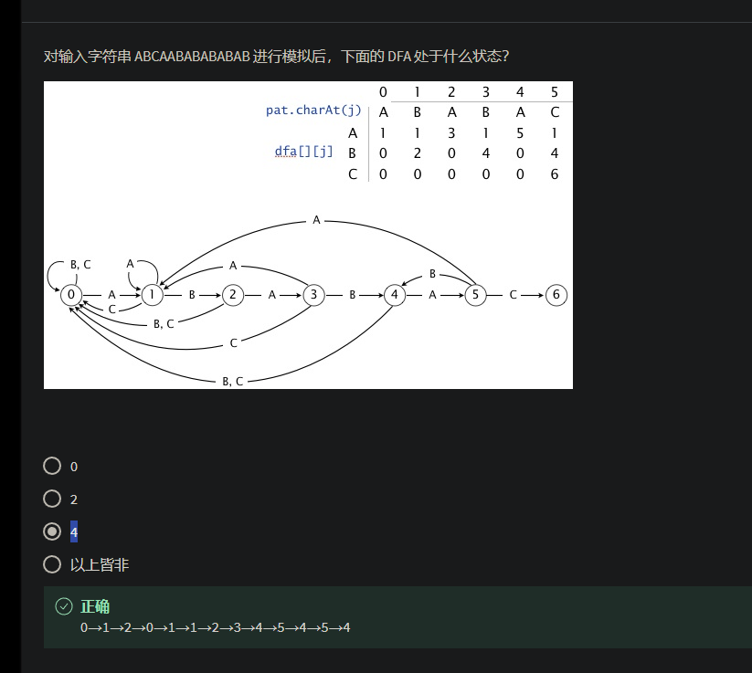

# 串的匹配

串的匹配就是从大的字符串中找到字串，并且返回第一个字串的位置。

C语言库函数有一个`strstr`，是朴素的串匹配算法，也叫BF算法。
```c
int BF(string source, string pattern)
{
    int i = 0;
    int j = 0;
    while(i < source.size() && j < pattern.size())
    {
        if(source[i] == pattern[j])
        {
            ++i;
            ++j;
        }
        else
        {
            i = i - j + 1;//后退j个字符，再进1
            j = 0;
        }
    }
    if(j == pattern.size())//如果pattern的j走到了最后，则说明已经全部匹配
    {
        return i - j;
    }
    return -1;
}
```

# KMP算法

是一个升级版的串匹配算法，名字取自三个人名（Knuth-Morris-Pratt）。

总地来说，KMP的核心效果就是让原串的指示器不用退回。如何达到这个效果？就是考虑和模式串已经匹配的部分。这一部分模式串的**子串**，如果后缀有和前缀相重复的部分，则就可以跳过这些部分，即跳过前缀，在前缀的后一个字符开始再次比对（实际操作中，原串指示器不动，而是模式串的指示器回退到当时**子串**前缀的后一个字符位置）。

于是，整个问题的核心，就从关注原串变到关注模式串本身了。需要找到模式串的不同长度（起点一致，不能从中间分割）下子串的前缀后缀相等的前缀（后缀）最大长度，从而建立一个所谓的next数组。

这个next数组，教科书的求法是：
```c
int * getNext(string str)
{
    int * next = new int[str.size()];
    
    int j = 0;   // j 用来遍历子串
    int k = -1;   // k 用来表示公共前后缀的长度
    next[0] = -1; // 表示，当第0个字符都已经匹配失败了，则原串前进1，模式串位置给-1，前进1后自然地（巧妙处理）到0位置。
    while(j < str.size() - 1)//size不包括\0，即不处理最后一位字符位置
    {
        if(-1 == k || str[j] == str[k])
        {
            ++j;
            ++k;
            next[j] = k;
        }
        else
        {
            k = next[k];     //如果在找相同的后缀失配，同样也可以使用KMP的思想，在已匹配的这部分字符串中找相同的前后缀部分，从而去回溯k！比如：如果没有相同前后缀，则k为0
            // 这里巧妙地复用了next数组，因为在推进k的过程中，观察的也是这个模式串的一部分，所以可以使用此next作为前缀的next！
        }
    }
}
int KMP(string source, string pattern)
{
    int i = 0;
    int j = 0;
    int * next = getNext(pattern);//add
    while(i < source.size() && j < pattern.size())
    {
        if(source[i] == pattern[j])
        {
            ++i;
            ++j;
        }
        else// modify
        {
            j = next[j];   
        }
    }
    if(j == pattern.size())//如果pattern的j走到了最后，则说明已经全部匹配
    {
        return i - j;
    }
    return -1;
}
```
上面这个求next数组的代码虽然看起来很简洁，但要彻底理解，还是比较难的，因为代码的细节处理得很巧妙，其中`k = next[k]`更是复用了KMP的next数组思想。
这个求`getNext`的函数可以优化，避免模式串中重复的字段：见ShiLei算法180节
比如：`abcabc`的next数组如果没有优化，则会成为`-1 0 0 0 1 2`，而经过优化以后：`-1 0 0 -1 0 0`
```c
int * getNext(string str)
{
    int * next = new int[str.size()];
    
    int j = 0;   // j 用来遍历子串
    int k = -1;   // k 用来表示公共前后缀的长度
    next[0] = -1; // 表示，当第0个字符都已经匹配失败了，则原串前进1，模式串位置给-1，前进1后自然地（巧妙处理）到0位置。
    while(j < str.size() - 1)//size不包括\0，即不处理最后一位字符位置
    {
        if(-1 == k || str[j] == str[k])
        {
            ++j;
            ++k;
            // 优化：如果发现此时k的位置字符和j的字符一样，则说明遇到了重复的字段，则继续进行回退，就省去了在kmp处理中多余的回退。
            if(str[k] == str[j])
            {
                next[j] = next[k];
            }
            else
            {
                next[j] = k;
            }
        }
        else
        {
            k = next[k];     //如果在找相同的后缀失配，同样也可以使用KMP的思想，在已匹配的这部分字符串中找相同的前后缀部分，从而去回溯k！比如：如果没有相同前后缀，则k为0
            // 这里巧妙地复用了next数组，因为在推进k的过程中，观察的也是这个模式串的一部分，所以可以使用此next作为前缀的next！
        }
    }
}
```
还有一个更直白的找模式串子串的前后缀最大长度的方法如下：
```c
int PMT[50] = {0};
void init_pmt(char const * pattern)
{
    int len = strlen(pattern);
    char sub[50] = {'\0'};
    for(int i = 1; i <= len; ++i)
    {
        strncpy(sub, pattern, i);
        sub[i] = '\0';
        char prefix[50] = {'\0'};
        char suffix[50] = {'\0'}
        for(int j = 1; j <= i - 1; ++j)
        {
            strncpy(prefix, sub, j);
            prefix[j] = '\0';
            strcpy(suffix, sub + i - j);
            if(strcmp(prefix, suffix) == 0)
            {
                PMT[i - 1] = j;
            }
        }
    }
}
int kmp(char const * source, char const * pattern)
{
    //i 指示 原串，j指示模式串
    int i = 0, j = 0;
    while(source[i] && pattern[j])
    {
        if(source[i] == pattern[j])
        {
            ++i;
            ++j;
        }
        else //仅仅是这里与BF不一样。
        {
            // 首位不相等，i进1
            if(j == 0)
            {
                ++i;
            }
            else// 除了首位不相等j归0外，其他情况为回退j，回退多少？查表
            {
                j = PMT[j - 1];// j - 1是已匹配了的最后位置
            }
        }
    }
    if(pattern[j] == '\0')//如果j移到了最后，说明已经匹配到
    {
        return i - j;//返回的是原串中 匹配到的模式串的起始位置
    }
    return -1;
}
```


# Bayer Moore

## 坏字符

每次把目标字符串和原字符串从后往前比较，如果某位置对应不上，则原字符串的这个字符称为“坏（bad）”字符。需要在目标字符串从后往前**继续寻找**（已经在之前匹配上的字符跳过）与这个bad字符相等的字符，然后按照这个相等字符的位置与原字符串的坏字符位置对齐（后移目标字符串）；如果在目标字符串中没找到坏字符，则把目标字符串整体后移到坏字符位置的下一个位置。对齐之后，重新把目标字符串和原字符串从后往前比较。

找匹配串中下一个坏字符，需要告诉：当前坏字符是什么（原串中的字符），当前坏字符位置在哪（模式串中的下标值），以及目标串指针。即从匹配串中的坏字符的位置的前一个位置开始找下一个相同的字符。

```c
int next_bad(char bad, char const * pattern, int wherebad)
{
    // pattern串中从后往前找与原串的坏字符相同的字符，从哪里坏的位置的前一个开始
    // 若未找到字符则i = -1自然退出
    int i = -1;
    for (i = wherebad - 1; i >= 0; --i)
    {
        if (pattern[i] == bad)
        {
            break;
        }
    }
    return i;
}
```

## 好后缀

在模式字符串从后往前与原串一一匹配的过程中，遇到了坏字符，那么坏字符之后的，即已经匹配上了的在后面的部分串称之为好后缀。那么，我们可以去寻找模式字符串中还是否存在好后缀。如果存在，则可以让模式字符串的下一个好后缀与原串的当前位置的好后缀对齐，从而达到让模式串快速前进。

**好后缀的思想很类似于KMP算法，即找公共前后缀，让重复的前缀对齐原串的后缀位置。但是区别就在于，BM算法是从后往前去匹配的，找到好后缀的同时，顺带着也找到了坏字符的位置。**

下一个坏字符与原串当前坏字符对齐，或者下一个好后缀与原串当前好后缀对齐，模式字符串前进的步数会不一样，那么，就可以去对比哪个可以前进得更多。

那么，类似于KMP地，去聚焦于模式字符串本身，不同点在于，每次寻找后缀都是从右向左寻找最近的下一个好后缀。（如果找的不是最近的而是靠左的下下个好后缀的话，那么模式字符串在BM算法前进过程中就会步子迈大了，跳过了可能完全成功匹配的机会）

去建立一个`SUFFIX_TB`表格，下标值`i`代表**此位置**开始的后缀字符串，内容值`SUFFIX_TB[i]`代表**左边下一个最近的好后缀的下标位置**。
`SUFFIX_TB`表格起初把全部值初始化为`-1`。表示当前`i`位置时没找到下一个好后缀。
```c
int SUFFIX_TB[50] = {0};
void init_suffix(char const * const pattern)
{
    int pattern_len = strlen(pattern);
    char sub[50] = {'\0'};
    
    for(int i = 0; i < 50; ++i)
    {
        SUFFIX_TB[i] = -1;
    }
    // i指示的是后缀的起始位置，从第1个下标位置开始找
    for(int i = 1; i < pattern_len; ++i)
    {
        // 当前要找的好后缀为 i下标位置开始到最后 
        strcpy(sub, pattern + i);
        // 从好后缀开始的位置（i下标）的上一个开始，从右向左比较，因为要找最近的
        for(int j = i - 1; j >= 0; --j)
        {
            // sub是要找的好后缀。pattern + j是要对比的字符串的起始位置，他们的长度都应为pattern_len - i
            if(strncmp(sub, pattern + j, pattern_len - i) == 0)
            {
                // 找到从右往左的最近的下一个好后缀，更新表格。i代表此位置开始的后缀字符串。j代表下一个好后缀的起始位置。
                SUFFIX_TB[i] = j;
                // 不要忘记break！如果不break继续找的话，左边可能有另一个完全匹配的好后缀，会覆盖掉
                break;
            }
        }
    }
}
```
封装到`next_good`函数，参数只需要一个wherebad，即坏字符的位置（模式串中的下标值），那么就可以确定好后缀的位置了（即坏字符的下一个位置）。
```c
int next_good(int wherebad)
{
    return SUFFIX_TB[wherebad+1];
}
```
## 实现BM算法

每次比较选择坏字符和好后缀哪个可以让模式字符串走的更远。参数一个原串指针，一个模式串指针。返回值为匹配成功后，原串中目标子串的起始下标值。如果没找到则返回`-1`。

```c
int boyer_moore(char const* const source, char const* const pattern)
{
    init_suffix(pattern);
    int src_len = strlen(source), pattern_len = strlen(pattern);
    // 因为BM是从后往前比对的，因此，初始值都是 模式串 最后位置的下标值-1
    int i = pattern_len - 1, j = pattern_len - 1;
    // 循环寻找目标串的条件是 原串i 没到结尾
    // 这个循环处理的是i，即只要遇到失配的情况，则i前进，j重新对齐下一个位置进行再次一一匹配。
    while (i < src_len)
    {
        // 这个循环处理的是j。只要模式串j和原串i位置的字符相等，则j和i同时左移1。同时j的值需要大于等于0。
        while (source[i] == pattern[j] && j >= 0)
        {
            --i;
            --j;
        }
        // 如果退出了小while循环，则有两种情况
        //情况1： j < 0, 说明模式串j走到最左，则完全匹配。此时i位置处在目标子串开始的前一个位置。则结果应返回i+1
        if (j < 0)
        {
            return ++i;
        }
        //情况2： 此时出现失配，即原串的i位置字符失配。
            // 参数：当前坏字符是什么（原串中的字符）；目标串指针；当前坏字符位置在哪（模式串中的下标值）
        int next_bad_index = next_bad(source[i], pattern, j);
        int next_good_index = next_good(j);
        // 对比这两个值。选择哪个？

        // 如果坏字符、好后缀都没找到      0  0 模式串起始点重新对齐到i的下一个位置，i再挪到最后
        // 如果没找到坏字符，找到了好后缀  0  1 由于没找到坏字符，则有好后缀也没意义了，所以与0 0一样：模式串起始点重新对齐到i的下一个位置，i再挪到最后
        // 如果找到了坏字符，没找到好后缀  1  0 虽然好后缀是-1，看起来可以跳过很多，但是！由于存在坏字符，不能一下略过去，所以不能选择好后缀。要选择坏字符位置值
        // 
        // 总结：只要有一个没找到，则二者最小值为 -1。模式串起始点都是重新对齐到i的下一个位置

        // 如果找到了坏字符，找到了好后缀   1  1
            // 再次分情况：看next_good和next_bad谁值小，选谁。
        //总结：取二者最小值。
            //如果是好后缀则将相当于可以把模式串后移j - next_good + 1。
            //如果是坏字符则将相当于可以把模式串后移j -  next_bad。
                //如果两个都是最小值。即相等，则优先选择好后缀，因为对齐时，好后缀比坏字符更能多进1位。
                //如果最小值为-1，则模式串起始点重新对齐到i的下一个位置
        if (next_bad_index == -1 || next_good_index == -1)
        {
            if (next_bad_index == -1)
            {
                i += j + 1;
            }
            else if(next_good_index == -1)
            {
                i += pattern_len - 1 - next_bad_index;
            }
        }
        else if (next_bad_index < next_good_index)
        {
            //i += pattern_len - 1 - j + j - next_bad_index;
            i += pattern_len - 1 - next_bad_index;
        }
        else if (next_good_index <= next_bad_index)
        {
            i += pattern_len - 1 - next_good_index + 1;
        }
        j = pattern_len - 1;
    }
    return -1;
}
```
测试
```c
int main()
{
    int res = boyer_moore("GATTGCTAGATTAACTATACTAA", "CTATACTA");
    return 0;
}
// 结果：14
```
总结来说，
1. 如果坏字符、好后缀都找到了。那么取最小值作为下一个的对齐点。
    1. 如果二者相等，则优先取好后缀。因为模式字符串重新对齐时，好后缀比坏字符更能多进1位。
2. 如果至少有一个没找到：
    1. BM算法最大的易错点：**如果找到了坏字符而没找到好后缀，则必须去对齐坏字符。因为好后缀有时候找不到是很正常的。如果跳过了这个坏字符，那么就会忽略中间的情况！**
    2. 如果找到了好后缀而没找到坏字符，则忽略这个好后缀。因为模式串中根本就没有下一个坏字符，你去对齐好后缀是没意义的！所以，没找到坏字符就相当于二者都没找到！见2.3。
    3. 如果都没找到，则模式串起始点重新对齐到当前原串指示位置`i`的下一个位置（实际上是调整`i`的值来做到对齐），j再挪到模式串的最后，重新从后向前一一匹配！
# 实际的场景

线上项目涉及到数据搜索、字符串匹配，如果数据量很大时，应用最多的其实是字典树、倒排索引的数据结构。例子：百度搜索、开源的Lucene、ElasticSearch（ElasticSearch是一个基于Lucene构建的开源项目）

```
Lucene 和 Elasticsearch（ES）都主要基于倒排索引（Inverted Index）进行高效率搜索。

倒排索引是一种数据结构，用于快速查找包含特定词条（term）的文档。它将文档中的每个词条映射到包含该词条的文档列表，这样的索引结构使得搜索过程能够快速定位到包含特定词条的文档，而无需扫描整个文档集合。

在倒排索引中，每个词条都关联着一个包含该词条的文档列表（称为倒排列表），并且可以附加一些额外的信息，如词频、位置等。这使得搜索引擎可以快速定位到满足查询条件的文档，并根据相关度进行排序。

Lucene 是基于 Java 编写的搜索引擎库，提供了倒排索引的实现和管理功能，开发人员可以使用 Lucene 来构建自己的搜索引擎或搜索功能。而 Elasticsearch 是一个基于 Lucene 构建的分布式搜索和分析引擎，它使用 Lucene 的倒排索引作为核心数据结构，同时提供了分布式存储、查询和分析等功能，使得用户可以轻松地构建和管理大规模的搜索应用。

因此，倒排索引是 Lucene 和 Elasticsearch 实现高效率搜索的关键数据结构之一。
```

## 字典树

字典树是指基于树的一种数据结构，用于以一种能够高效搜索、插入和删除操作的方式存储一组键（通常是字符串）。Trie树（又称prefix tree）和三叉搜索树（Ternary Search Tree，又称T-tree、T树）是字典树的具体实现，各自具有其特点和优势。

1. Trie树（前缀树）特别适用于需要进行前缀匹配和检索的任务，例如字典实现和自动完成系统。
2. T树（三叉搜索树）在空间效率和快速字符串搜索操作之间提供了平衡。它们也适用于字典实现以及拼写检查和近似字符串匹配等任务。

总之，虽然Trie树和三叉搜索树是不同的实现，但它们都属于字典树类别，用于高效存储和检索键-值对，尤其是字符串。

## 其他树
### B树

B树的全名是“Bayer–McCreight B树”。这是一种由Rudolf Bayer和Edward M. McCreight于1972年引入的数据结构。B树的名称来自于这两位作者姓氏的首字母。B树被广泛应用于数据库和文件系统中，用于高效地存储和检索数据，尤其是在处理大型数据集和基于磁盘的存储时。
### `T*`树
  
`T*`树是B树数据结构的一种变体，旨在提高范围查询的性能，例如查找在给定范围内的所有值，与传统的B树相比。

在`T*`树中，每个节点可以有不同数量的子节点，通常范围在$\sqrt d​到2d$之间，其中$d$是树的最大度数。这允许更灵活地平衡树，并且可以使得树的高度相比传统的B树更浅，尤其是对于大型数据集而言。

`T*树`通过在其内部节点中存储额外的摘要信息来实现高效的范围查询性能，例如存储在其子树中的键的聚合值或范围。这样在范围查询期间可以更快地遍历和修剪不必要的子树。

总的来说，`T*`树旨在在保持B树的优点，如高效的插入、删除和搜索操作的同时，提供改进的范围查询性能。它们在数据库系统和其他需要高效范围查询的应用中被广泛使用。

### `B*`树

`B*`树是B树的一种改进版本，旨在减少节点的分裂和合并操作，从而减少树的高度，提高查询性能。
与普通的B树不同，`B*`树在节点填满时不会立即进行分裂，而是等到达到阈值时才分裂，这样可以减少分裂的频率，减小树的高度。

`B*`树还通过在非叶节点中保留更多的键来减少合并操作的频率，从而进一步减小树的高度。

虽然`B*`树和`T*`树都是B树的变体，但它们的设计目标和实现方式略有不同。`B*`树的重点是减少树的高度，而`T*`树的重点是提高范围查询的性能。