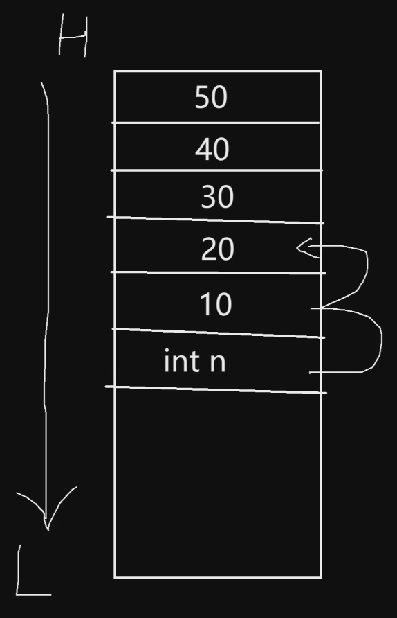

# 函数

1. 每个编程语言都有函数。
2. 函数是代码的模块/容器/载体，代码如果要执行，必须在函数内才能执行。

# 内存结构、地址空间

1. 对于可执行文件（Windows下是exe文件；Linux下是out文件），可执行文件有固定格式，从磁盘中加载到内存后，文件中相应部分的代码、数据等会映射到内存的五个不同的模块中。
2. 每个程序都认为自己独占了整个的地址空间。如果是32位系统，则程序认为独占了32位的内存空间（0到4G）。这就是虚拟地址空间，自从386就开始有这个概念，便于多路程运行。

# 栈帧

1. m和n是actual parameters.（实参）
2. a和b是formal parameters.（形参）
3. 所有的参数都是按值传递的。

```c
#include<stdio.h>
void bar(int a, int b);

int main()
{
    int m = 5, n = 6;
    bar(m, n);
    return 0;
}
void bar(int a, int b)
{
    int c = a + b;
    printf("%i\n", c);
}
```

反了？


栈是从高地址向低地址扩展的。越后定义的变量地址越低。

`int m = 5, n = 6;`这条语句：先定义n，再定义m，因此n在高地址、m在低地址。

# printf的参数

variable parameters

```c
int printf(char const * const _Format, ...);
```

启示：对外开放的函数，如果要防止误改内容，则加const表明只读，否则别人不敢传参数。

## const是什么

const有三个位置可以放。

看表达式：
1. 无论右侧是什么，左侧是int，则右侧也是一个int
   1. 左侧一个int，右侧一个a。

```c
int a;
```

   2. 左侧一个int，右侧是`*a`。`*a`是一个int：表示a这个变量解引用之后则是一个int，则a是一个指向int的指针。
```c
int *a;
```

2. const是修饰右侧东西的。
   1. 如果在`int`后写const：`*a`是一个不能修改的int值。同理const写到int前面也一样：`const int * a;`。

```c
int const * a;
```

   2. 如果在`*`后写const：a是一个不能修改的值。`*a`是一个能修改的int值，a这个变量解引用之后则是一个int，则a是一个指向int的指针，但a是一个不能修改的值。

### 后缀为`.c`测试

```c
int main()
{
    char * p = "xxx"; //可以编译通过
    p[1] = 'M';       //可以编译通过
}
```

但在运行阶段，会抛出异常：write access violation

不要企图改变常量区。

### 后缀为`.cpp`测试

```c
int main()
{
    char str[] = "Hello";
    char * p = str;
    p[2] = 'x';
}// 是可以通过p间接修改str[]中的值的。
//最后str[]变为"Hexlo"
```

```c
int main()
{
    char str[] = "Hello";
    char * p = str; 
    p = "xxx";// error      //char * p虽然可以改变指针值，但是不能指向常量字符串
}
```

```c
int main()
{
    char str[] = "Hello";
    const char * p = str; 
    p = "aaa";      //char * p既可以改变指针值，也可以指向常量字符串
    p[2] = 'x';     //error 虽然p可以指向常量字符串，但是不能间接修改值
}
```

```c
int main()
{
    char str[] = "Hello";
    const char * const p = str; 
    p = "aaa";//error  //char * p不可以改变指针值，也不能通过p间接修改值
    p[2] = 'x';//error
}
```

## 可变参数

欲用show打印可变参数中第n个值：

需要取函数栈帧中n变量的地址，然后向上寻找n个int大小（因为参数是从高地址到低地址扩展的），即得到可变参数中第n个参数的地址。

栈帧示意图：



```c
void show(int n, ...);
int main()
{
    show(2, 10, 20, 30, 40, 50);  // 欲打印第2个值，20
}
void show(int n, ...)
{
    // 指针进行整数加运算。
    printf("%i\n", *(&n + n));
}
//64位下：打印10
//32位下：正确，打印20
```

奇怪的是，64位下：打印10；32位下：打印20。因为：int固然是4字节大小，而且`int`的指针加减`1`的大小也应该是4字节（`p + n = p的值 + sizeof(int)* n`）。但是，**在64位下的字长是8字节的，因为地址总线每一次至少会传64位（8字节）的内容。因此，每个int实际占用了8个字节。**所以我们`p+n`仅仅移动了8个字节，只能打到10。

经过调试，可以看到实际的内存内容（16进制）：


可以看到，`02` `0a` `14` `1e` `28` `32`依次是6个int参数，实际都占用了8个字节。大端地址存放高字节。则如果要打印可变参数中的第n个int，需要`*(&n + 2 * n)`或者把`&n`强制转换为64位大小的`long long*`：`*((long long*)&n + n)`。

```c
void show(int n, ...);
int main()
{
    show(2, 10, 20, 30, 40, 50);  // 欲打印第2个值，20
}
void show(int n, ...)
{
    // 指针进行整数加运算。
    printf("%i\n", *((long long*)&n + n));
}
//64位下：正确，打印20
//32位下：错误，打印286331153
```

但是，这样的话，虽然64位下打印正确了，但是32位下又错了！因为移动了n个8字节，打到了函数栈帧之外！所以，必须想一个能判断32位、64位的通用方法，去控制int指针的大小（即64位下8字节、32位下4字节）。

`Ctrl + 左键`点入`size_t`，会出来一些宏定义：

```c
#ifdef _WIN64
    typedef unsigned __int64 size_t;
    typedef __int64          ptrdiff_t;
    typedef __int64 intptr_t;
#else
    typedef unsigned int     size_t;
    typedef int              ptrdiff_t;
    typedef int              intptr_t;
```

在程序为64位编译时，上面三个会生效、下面会失效；32位编译时反之。

通过这个，可以控制int指针的大小。

```c
void show(int n, ...);
int main()
{
    show(2, 10, 20, 30, 40, 50);  // 欲打印第2个值，20
}
void show(int n, ...)
{
    // 指针进行整数加运算。
    printf("%i\n", *((intptr_t*)&n + n));
}
//64位下：正确，打印20
//32位下：正确，打印20
```

# 数组和函数

```c
#include<stdio.h>
void bar(int a[8]);
int main()
{
    int arr[] = { 1, 2, 3, 4, 5, 6, 7, 8 };
    bar(arr);
    return 0;
}
// 虽然传的是数组类型，但实际退化为指针了
void bar(int a[8])
{
    printf("%i\n", sizeof a);
}
// 64位：8
// 32位：4
```

虽然形参写的是带元素个数的数组类型，但是因为实际退化为指针了，所以写不写具体数目无所谓：`int a[]`，甚至直接写个`int * a`也是一样的。如果要告知数组具体个数，需要另传一个int参数n。

```c
#include<stdio.h>
void bar(int * a, int n);
int main()
{
    int arr[] = { 1, 2, 3, 4, 5, 6, 7, 8 };
    bar(arr, sizeof arr / sizeof arr[0]);
    return 0;
}
void bar(int * a, int n)
{
    for(int i = 0; i < n; ++i)
    {
        printf("%i\n", a[i]);
    }
}// 1 2 3 4 5 6 7 8 
```

## 二维数组

行信息丢失，需要用int n代替，而我们要保留列信息，才能保证二维数组的有效。

即传一个包含4列元素的行指针。

```c
void bar(int(*a)[4], int n);
int main()
{
    int arr[2][4] = {{1, 2, 3, 4}, {5, 6, 7, 8}};
    bar(arr, sizeof arr / sizeof arr[0]);
    return 0;
}
void bar(int(*a)[4], int n)
{
    for(int i = 0; i < n; ++i, printf("\n");)
    {
        for(int j = 0; j < 4; ++j)
        {
            printf("%i\n", a[i][j]);
        }
    }
}
// 1 2 3 4
// 5 6 7 8 
```

# main参数

```c
int main(int ac, char * av[])
{
    return 0;
}
```

ac指argument count；av指argument value。

```c
int main(int ac, char * av[])
{
    for(int i = 0; i < ac; ++i)
    {
        printf("%s\n", av[i]);
    }
    return 0;
}
```

编译程序后，在生成目录下命令行（cmd）测试

```sh
C:\Users\xcg\Project1.exe #输入的

C:\Users\xcg\Project1.exe #输出的

C:\Users\xcg\Project1.exe -h -m #输入的

#输出的
C:\Users\xcg\Project1.exe
-h
-m

```

## 实质上

实质上，av的类型被退化为了二级指针。

```c
int main(int ac, char ** av)
{
    for(int i = 0; i < ac; ++i)
    {
        printf("%s\n", *(av + i));
    }
    return 0;
}
```

更安全地，加const，让av指向的内容、av的行数组、av本身不可变

```c
int main(int ac, char const * const * const av)
{
    for(int i = 0; i < ac; ++i)
    {
        printf("%s\n", *(av + i));
    }
    return 0;
}
```

# 递归

递归表现在：行为一致，只是每次数据不一样。

递归的两大要素：递推公式（状态转移方程）；终止条件。

> 1. 下降的时候执行行为，即行为在调用递归之前，叫首递归
> 2. 上升的时候执行行为，即行为在调用递归之后，叫尾递归
> 3. 如果递归前后都有行为，叫中间递归

```c
void show(int n); // show(10) -> 10 9 8 ... 1
int main()
{
    show(10);
}
void show(int n)
{
    if(n < 1) return;
    printf("%i\n", n);
    show(n - 1);
}
```

```c
void show(int n); // show(10) -> 1 2 3 ... 10
int main()
{
    show(10);
}
void show(int n)
{
    if(n < 1) return;
    show(n - 1);
    printf("%i\n", n);
}
```

## 求加和

```c
int sum(int n); // 1 + 2 + 3 + ... + 10
int main()
{
    int r = sum(10);
}
int sum(int n)
{
    if(n == 1) return 1;
    return n + sum(n - 1);
}// r = 55
```

## Hanoi

把`1 ~ n`的盘子通过A、B、C三个柱子挪到全部C。小的在上面，大的在下面。

```c
void hanoi(int n, char from, char via, char to)
{
    if(n == 0) return;
    hanoi(n - 1, from, to, via);
    printf("%d: %c --> %c\n", n, from, to);
    hanoi(n - 1, via, from, to);
}
```

测试

```c
int main()
{
    hanoi(3, 'A', 'B', 'C');
}
```

```
1: A --> C
2: A --> B
1: C --> B
3: A --> C
1: B --> A
2: B --> C
1: A --> C
```
