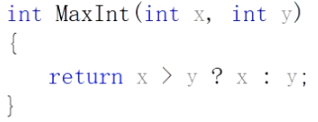
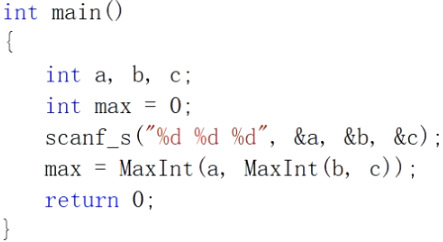
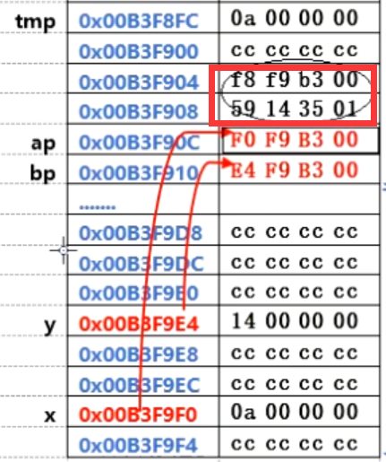
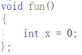
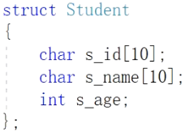
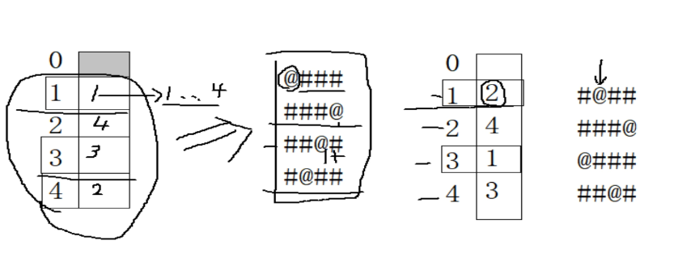
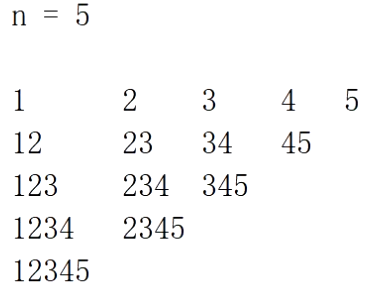

# bool类型

bool只有true 和false；在C语言中0是false，其他情况(非0)都为true。
在.c文件中需要引入头文件<stdbool.h>；在.cpp文件中直接使用。
注意：VS2012不完全支持C99标准，不能引入头文件stdbool.h 。但文件后缀为.cpp可以直接使用bool类型。

也可以自己构造bool 类型（但没必要，因为cpp文件下可以直接用）。
## 构造bool类型代码示例
```c
// test.c 文件 注意文件后缀是 C 文件。
#include<stdio.h>
typedef int bool;
#define true 1
#define false 0
int main()
{
	bool xtag = true;
	return 0;
}
```


```c
#include<stdio.h>
int main()
{
    bool x = false;
    printf("%d \n",x);//0
    ++x;
    printf("%d \n",x);//1
    ++x;
    printf("%d \n",x);//1
    ++x;
    printf("%d \n",x);//1
    return 0;
}
```

```c
#include<stdio.h>
int main()
{
    bool x = false;
    printf("%d \n",x);//0
    --x;//0 --> -1 转为1
    printf("%d \n",x);//1
    --x;//1 --> 0
    printf("%d \n",x);//0
    --x;//0 --> -1 转为1
    printf("%d \n",x);//1
    return 0;
}
```

# 关系表达式

关系表达式运算结果是bool值。关系运算符都是双目运算符，其结合性均为左结合。关系运算符的优先级低于算术运算符，高于赋值运算符。在六个关系运算符中，`<`、`<=`、`>`、`>=`的优先级相同，高于`==`和`!=`，`==`和`!=`的优先级相同。
需要特别注意：`==` 才表示等于比较，而 `=` 表示赋值，大家要注意区分，切勿混淆。


## 该死的`=`号

```c
#include<stdio.h>
int main()
{
    int age = 0;
	scanf("%d",&age);
	if(age = 3)  //if(age==3) //if(3==age)
	{
		printf("该上幼儿园了 \n");
	}
	else
	{
		printf("hehe \n");
	}
	return 0;
}
```

此例中if圆括号内的表达式为`"age=3"`，是一个常量赋值给变量的操作，一定会通过导致表达式结果值为1，所以无论在外输入什么此处判断都会为true。这是因为少打了一个=号造成等值判断误成为了赋值语句。为了规避这个错误，我们应该在使用等值判断语句时尽量把常量放在左边，把待比较的变量放在右边。这样的话，如果写成`"3=age"`后，编译时期即会报错，而不是把错误延续给运行时期！
# 逻辑表达式

逻辑表达式运算结果是bool值。


## 与运算(`&&`)
又称截断与、简洁与。参与运算的两个表达式都为真时，结果才为真，否则为假。
## 或运算(`||`)
又称截断或、简洁或。参与运算的两个表达式只要有一个为真，结果就为真；两个表达式都为假时结果才为假。
## 非运算(`!`)
参与运算的表达式为真时，结果为假；参与运算的表达式为假时，结果为真。
## 优先级
逻辑运算符和其它运算符优先级从低到高依次为：
赋值运算符(`=`)　`<`　`&&`和`||`　`<`　`关系运算符`　`<`　`算术运算符`　`<`　非(`!`)
`&&`和`||`低于`关系运算符`，`!`高于`算术运算符`。
# 分支语句

## 双分支语句加几行代码变单分支

```c
#include<stdio.h>
int main()
{
    int a=0,b=0;
    int max=0;
    scanf("%d %d",&a,&b);
    if(a>b)
    {
        max = a;
    }else
    {
        max = b;
    }
    return 0;
}
```

```c
#include<stdio.h>
int main()
{
    int a=0,b=0;
    int max=0;
    scanf("%d %d",&a,&b);
    max = a;
    if(max<b)
    {
        max = b;
    }
    return 0;
}
```

## 三目运算符替代简单的if语句

```c
#include<stdio.h>
int main()
{
    int a=0,b=0;
    int max=0;
    scanf("%d %d",&a,&b);
    max = (a>b)?a:b;
    return 0;
}
```

　　if 语句在某些情况下可以用条件运算符“?:”来简化表达。“ ? :”是一个三元运算符，其构成的表达式格式为：<表达式1> ? <表达式2> : <表达式3>；执行逻辑：先计算表达式1，若其值为真（或非0），则计算表达式2（不计算表达式3），并将该值作为整个表达式的值；反之，即表达式1 的值为假或为0，则计算表达式3（不计算表达式2），并将该值作为整个表达式的值。

## if-else多分支语句

### 判断字符类别

判别键盘输入字符的类别，是否是数字字符，是否是小写字符，是否是大写字符，还有其它字符。

```c
//输入字符给变量有两种写法。
char ch;
scanf_s("%c",&ch);//a
ch=getchar();
//以上两种写法是等效的。
```

#### 相应的头文件`<ctype.h>`

##### 函数

###### 字符分类

1. `isalnum(char)`;判断一个字符是否是字母或数字
2. `isalpha(char)`;判断一个字符是否是字母
3. `islower(char);`判断一个字符是否是小写字母
4. `isupper(char);`判断一个字符是否是大写字母
5. `isdigit(char);`判断一个字符是否是数字
6. `isxdigit(char);`判断一个字符是否是十六进制数字字符（`0123456789abcdefABCDEF`）
7. `iscntrl(char);`判断一个字符是否是控制字符
8. `isspace(char);`判断一个字符是否是空白字符
9. `isblank(char);`判断一个字符是否是空格字符（`C99`）
10. `ispunct(char);`判断一个字符是否是一个标点符号
###### 字符操作
1. `tolower(char);`将字符转换成小写
2. `toupper(char);`将字符转换成大写
### 良好的代码风格


## switch多分支结构

# 函数初步

在结构化程序设计中，函数是将任务进行模块划分的基本单位。通过函数，可以把一个复杂任务分解成为若干个易于解决的小任务。充分体现结构化程序设计由粗到精，逐步细化的设计思想。一个大的程序一般应分为若干个程序模块，每个模块实现一个特定的功能，这些模块称为子程序，在C语言中子程序用函数实现。

什么时候我们认为模块是足够小的：功能是单一的。


## 按是否系统预定义分两类

### 编译系统预定义

一类是编译系统预定义的，称为库函数或标准函数，如一些常用的数学计算函数、字符串处理函数、图形处理函数、标准输入输出函数等。这些库函数都按功能分类，集中说明在不同的头文件中。用户只需在自己的程序中包含某个头文件，就可直接使用该文件中定义的函数。
1. `<asserst.h>`
2. `<ctype.h>`
3. `<math.h>`
4. `<stdio.h>`
把函数名字、函数功能记下来。
### 用户自定义
另一类是用户自定义函数，用户可以根据需要将某个具有相对独立功能的程序定义为函数。
自定义函数有：`函数返回类型` + `函数名` + `形参列表` + `函数体构成` ；
#### 函数的命名要求
1. 拿英文命名函数
2. 第二个要求：见名知义，不要用汉语拼音，有歧义。
#### 函数的声明、定义注意事项
##### 原则
1. 需要外部输入的（比如scanf）写到形参中；
2. 需要打印、输出的，return返回。
##### 该死的形参

###### 形参变量类型名后的标识符要不要省

1. 函数的声明中形参列表可以省去形参名（标识符），但不能省去类型名。因为虽然函数不识别名称，但必须识别类型；
2. 而函数定义就要把形参名写全，因为函数体中要操作之；
3. 函数的调用中，参数前不能加类型名。
###### 形参变量的定义必须每个参数都有一个类型和一个名称

形参变量的定义与局部变量定义是有区别的。局部变量是可以`int x,y;`这样定义的，但形参定义不可以，必须是一个类型匹配一个名称！
##### 函数声明、定义后的分号

函数声明是一个语句，所以要加分号。但是定义函数完成后花括号后加分号也没影响，因为那是个空语句，但也没必要！

##### 一定要在函数被调用前声明或定义

被调用函数要在调用者调用它之前的区域声明或定义，不然编译是不会通过的！
##### 不允许函数的嵌套定义

C语言中不允许函数的嵌套定义，即在一个函数中定义另一个函数。
##### 函数的调用是允许嵌套的


### 示例


定义函数时可能会涉及若干个变量，究竟哪些变量应当作为函数的参数？哪些应当定义在函数体内？这有一个原则：
作为一个相对独立的模块，函数在使用时完全可以被看成 “黑匣子”，除了输入输出外，其他部分可不必关心。从函数的定义看出，函数头正是用来反映函数的功能和使用接口，它所定义的是“做什么”，在这部分必须明确“黑匣子”的输入输出部分，输出就是函数的返回值，输入就是参数。因此，只有那些功能上起自变量作用的变量才必须作为参数定义在参数表中；函数体中具体描述“如何做”，因此除参数之外的为实现算法所需用的变量应当定义在函数体内。
## 形参和实参

### 形式参数（形参）

只能等到函数被调用时接收传递进来的数据，所以称为形式参数，简称形参。

形式参数是指函数名后括号中定义的变量，形式参数只有在函数被调用的过程中给于赋值（分配存储空间）。函数执行完后形式参数变量就自动释放了，所以形式参数只在函数中可见（作用域）。
### 实参（实际参数）

调用函数时给出的参数包含了实实在在的数据，所以称为实际参数，简称实参。

实参可以是：常量、变量、表达式或函数等。无论实参是何种类型的量，在进行函数调用时，它们都**必须有确定的值**，以便把这些值传送给形参。
### 功能

形参和实参的功能是传递数据，发生函数调用时，实参的值会传递给形参。
### 形参实参的区别与联系

1. 形参变量只有在函数被调用时才会分配内存（在stack 中），调用结束后，立刻释放内存，所以形参变量只有在函数内部有效，不能在函数外部使用。
2. 实参可以是常量、变量、表达式、函数等，无论实参是何种类型的数据，在进行函数调用时，它们都必须有确定的值，以便把这些值传送给形参，所以应该提前用赋值、输入等办法使实参获得确定值。
3. 实参和形参在数量上、类型上、顺序上必须严格一致，否则会发生“类型不匹配”的错误。当然，如果能够进行自动类型转换，或者进行了强制类型转换，那么实参类型也可以不同于形参类型。
4. 函数调用中发生的数据传递是单向的，只能把实参的值传递给形参，而不能把形参的值反向地传递给实参；换句话说，一旦完成数据的传递，实参和形参就再也没有关系，所以，在函数调用过程中，形参的值发生改变并不会影响实参的值。

## 函数调用中的内存分配


假如内存共有1M空间。我们会把它分解成若干个栈帧（**下去查询VS如何设置栈的大小和栈帧的大小**），主函数调用时，会把底层的栈帧分配给主函数，如果将要占用很多的空间，我们就得继续往上占用上层的栈帧。每当有一个函数调用，即分配一个栈帧。

```c
int a = 10;
int b = 20;
int* p = &a;//星号在类型和标识符之间时是声明。//p=>&a;  //*p（星号在指针变量前是解引用）=>*&a=>a;
```

## 传地址交换值--间接改变值


### 问题1
`int tmp = *ap;`通过指针指向取x的值并修改tmp值的底层实现是如何的？
`mov eax,10;`
`mov ebx,0x00b3f9f0;`
`mov [ebx],100h;`
直接访问、间接访问。任何一本讲微机原理的书都有讲解。
### 问题2

仔细观察，发现未曾开辟定义的存储空间中都是随机值"`cccccccc`"，而有两个地址很特殊，就是`Swap_p`的函数域中`ap`指针变量的地址之上的两个地址`"0X00B3F9F8"`和`"01351459"`。这两个值是什么值呢？
C语言的面试：指针、编译链接过程、函数调用过程中**线程的保护、恢复**是怎么实现的。调用函数、现场保护，调用完后要实现现场的恢复。这是区分学的好不好、自学能力强不强的标准。C语言全部讲完后，分模块讲时再说。
## 函数调用机制


C语言中，先把y入栈，再把x入栈，函数参数入栈的顺序是从右向左的！有些编程语言是从左向右的。

函数调用首先要进行参数传递，参数传递的方向是由实参传递给形参。传递过程是，先计算实参表达式的值，再将该值传递给对应的形参变量。一般情况下，实参和形参的个数和排列顺序应一一对应，并且对应参数应类型匹配（赋值兼容）,即实参的类型可以转化为形参类型。而对应参数的参数名则不要求相同。
在示例中`int MaxInt(int a,int b)`，a和b是形参，在main中 x, y 是实参。

查：被调用函数MaxInt return c给主函数中的max变量时，肯定不能直接赋值，而是用临时空间先存放，再取出送给这个max。这个临时空间谁来担当？

## 多文件结构

# 循环语句

## while语句

### 示例--打印平方表

```c
#include<stdio.h>
int main()
{
	int i = 0, n = 0;
	printf("Enter number of entries in table: ");
	scanf("%d",&n);
	i = 1;
	while(i <= n)
	{
		printf("%10d%10d\n",i,i*i);
		++i;
	}
	printf("\n");
	return 0;
}
```

## do-while循环

特点是先执行，后判断。要有一个条件使之退出while才行。

```c
//计算一个正整数的位数
#include<stdio.h>
int main()
{
    int digits = 0,n;
    printf("Enter a nonnegative integer: ");
    scanf("%d",&n);
    do
    {
        n/=10;
        digits++;
    }while(n>0);
    printf("The Number has %d digit \n",digits);
    return 0;
}
```

但是do-while有一个漏洞，就是如果上例代码输入了一个"0"值的话，还是会执行一次，最后输出1位。但是实际上0是不占位数的。

## for循环

1. 表达式1只执行一次
2. 表达式2判断为真才执行循环体
3. 循环体执行完后才执行表达式3
特点是：编程的执行顺序和我们编写他的顺序不符合，所以有些人不习惯for语句。
### VS和VC++编译器对于for语句中表达式1的区别

VS2012/2019中的`for(int i=0;i<10;++i)`中i的作用域只在for块内

VC++中i的作用域在块外也有，因此不能重新声明i

VC++中`.c`文件中的for语句中表达式1不能同时定义、初始化。只能在for外先定义i。

### for循环的惯用法

对于向上加（变量自增）或向下减（变量自减）的循环来说，for语句通常是最好的选择。

```c
// 从0 向上加到n-1
for(i = 0; i < n; ++i) ...
// 从1 向上加到n
for(i = 1; i <= n; ++i) ...
// 从n-1 向下减到0
for(i = n-1; i >= 0; --i) ...
//从n 向下减到1
for(i = n; i > 0; --i) ...
//编写的控制表达式中把 i < n 写成 i <= n , 会犯"循环次数差一次" 错误
```

```c
#include<stdio.h>
int main
{
    int i = 0;
    int n = 5;
    for(i = n; i > 0;--i)
    {
        printf("%d ",i);//执行n次
    }
    printf("for end: \n");//输出for循环退出后i的值
    printf("%d \n", i);
    return 0;
}
```

### 循环语句圆括号中省略表达式

```c
int n=10;
int i=1;
for(;;)//for(int i=0;i<n;++i)
{
    if(i>=n)
    {
        break;
    }
    ++i;
}
```

对于for省略：如果省略了表达式2，那么是死循环的效果

对于while，省略圆括号内表达式，不可行。
### 三种死循环
#### for

```c
for(;;)
{
    ;
}
```

```c
//如何把死循环写法改为之前for(int i=0;i<n;++i)的效果
int n=10;
int i=1;
for(;;)//for(int i=0;i<n;++i)
{
    if(i>=n)
    {
        break;
    }
    ++i;
}
```

#### while

```c
while(1)
{
    ;
}
```

#### do-while

```c
do
{
    ;
}while(1);
```

### 0716重点：跳转语句

实际上，`break/continue/return`都是`goto`的变种。
#### break
语句只能用在switch语句和循环语句中，用来跳出switch语句或提前终止循环，**转去执行switch语句或循环语句之后的语句**。


需要注意的是：**break语句只能跳出一层循环**。
#### continue

语句只能用在循环语句中，用来终止本次循环。当程序执行到continue语句时，将**跳过其后尚未执行的循环体语句，开始下一次循环**。**下一次循环是否执行仍然取决于循环条件的判断**。continue语句与break语句的区别在于，continue语句结束的只是本次循环，而break结束的是整个循环。

但上面这段话没说明本质。


##### continue对于for语句

continue对于for语句跳到的是表达式3。如果处理不当就会出问题：

```c
//打印：1 3 5 7 9
int main()
{
    int n=10;
    for(int i=0;i<n;++i)
    {
        if(i&2==0)
        {
            continue;
        }
        printf("%d ",i);
        //++i;//如果把for圆括号中的表达式3挪下来写到循环块内的最后一句，则此循环将成为死循环。因为continue针对for循环是跳到表达式3的，如果表达式3是空语句则不执行任何语句，徒劳。
    }
    printf("\n");
    return 0;
}
```

##### continue对于while和do-while语句

continue对于while和do-while语句，continue跳到的是圆括号内的判断。如果处理不当，更会出问题。

如何将上述for的代码由for改为while循环？

```c
#include<stdio.h>
//错误示范
int main()
{
    int n=10;
    int i=0;
    while(i<n)
    {
        if(i%2==0)
        {
            continue;
        }
        printf("%d ",i);
        ++i;
    }
    printf("\n");
}
```

```c
#include<stdio.h>
int main()
{
    int n=10;
    int i=0;
    while(i<n)
    {
        ++i;
        if(i%2==0)
        {
            continue;
        }
        printf("%d ",i);
    }
    printf("\n");
}
```

#### goto

**语句**和**标号语句**一起使用，所谓标号语句是**用标识符标识的语句**，它控制程序从goto语句所在的地方转移到标号语句处。

goto语句会导致程序结构混乱，可读性降低，而且它所完成的功能完全可以用算法的三种基本结构实现，因此一般不提倡使用goto语句。

```c
#include<stdio.h>
int main()
{
	int i = 0,j = 0,k = 0;
	for(i = 0;i<10;++i)
	{
		for(j = 0;j<10;++j)
		{
			for(k = 0;k<10;++k)
			{
				if(i+j+k == 10)
				{
					goto input;
				}
			}
		}
	}
	input:
	printf(" main end \n");
	return 0;
}
```
##### 适用场合

在某些特定场合下goto语句可能会显出价值，比如在多层循环嵌套中，要从深层地方跳出所有循环，如果用break语句，不仅要使用多次，而且可读性较差，这时goto语句可以发挥作用。

```c
#include<stdio.h>
int main()
{
    
}
```

##### 注意

1. goto最好只用它来从上到下跳。不要从下到上跳，因为可能会产生程序的二义性。
2. 不能在函数间跳转，不能跨越两个函数。只能在本函数的作用域、可见性中跳转。
##### VS2019
#### return

语句用于结束函数的执行，返回调用者，如果是主函数，则返回至操作系统（终止程序的执行）。
利用一个return语句可以将一个数据返回给调用者。

return本质上就是goto连带一个数据返回。与goto的区别就是goto不能带一个数据，return可以。

##### 主函数中的return与子函数中的return

1. 主函数return后，程序结束。子函数return只是本函数结束。
2. 主函数的return是返回给操作系统。

##### return与exit函数的区别

在主函数中，`exit(1);`与`return 0;`的效果是一样的。都是结束程序的执行；但在子函数中就和return语句不一样了，子函数中调用`exit()`也会直接终止整个程序的执行。

调用exit()函数会直接终止程序的进行，需要引入头文件`<stdlib.h>`。

传递给exit函数的实际参数和main函数的返回值具有相同的含义：两者都说明程序终止时的状态，为了表示正常
终止，传递0，即 exit(0)；因为0 有点模糊，所以C语言允许用`EXIT_SUCCESS`来替代（效果相同）。exit(0);等同于`exit(EXIT_SUCCESS)`;，表示程序正常退出；exit(1);等同于exit(EXIT_FAILURE);，表示程序异常退出。

```c
exit(EXIT_SUCCESS); /* normal termination */
exit(EXIT_FAILURE); /* abnormal termination */  //传递EXIT_FAILURE表示异常终止：
EXIT_SUCCESS和EXIT_FAILURE都是定义在<stdlib.h>中的宏。
EXIT_SUCCESS和EXIT_FAILURE的值都分别是0和1.
```
##### 返回类型为void

通常，当函数的返回类型为void时， return语句可以省略，如果使用也仅作为函数或程序结束的标志。有些编译器可以写成`return void;`，但在VS2019中不可以。
#### 总结

都是goto的变种。

# 空语句

语句可以为空，也就是除了末尾处的**分号**以外什么符号也没有。

## 所带来的问题

### 圆括号后放置空语句

不小心在if、while 或 for 语句的圆括号后放置分号会创建空语句，从而造成if、 while 或 for 语句提前结束。if 语句中，如果在圆括号后放置分号，无论条件表达的值是什么，if 语句执行的动作都一样，都会执行if块内的代码：

#### if语句

```c
if(d == 0)  ;
{
    printf("Error: Division by zero \n");
}
```

#### while语句

while 语句中，如果在圆括号后放置分号，会产生无限循环：

```c
i = 10;
while(i>0) ;
{
	printf("%d ",i);
	--i;
}
```

另一种可能是循环终止，但是在循环终止后只执行一次循环体语句：

```c
i = 10;
while(--i>0) ;
{
	printf("%d ",i);
}
```

#### for语句

for 语句中，如果在圆括号后放置分号，会导致只执行一次循环体语句：

```c
for(i = 10; i > 0 ; --i) ;
{
    printf("value: %d ",i);
}
```

## 要注意的地方

### 该死的分号;

#### 函数后的分号

##### 函数声明语句

函数声明时加分号。

##### 函数定义语句

在大括号后加了分号也没事，因为这是空语句，无大碍。

##### 结构体定义语句

结构体定义结束时，在大括号后必须加分号。表示结束。

# 逗号表达式

逗号表达式只能写类型一致的声明，`int i = 0, float = 2.0`是不对的。

```c
#include<stdio.h>
int main()
{
    int a=10,b=20,c-30;
    int x=0;
    //下面两句看似说明逗号运算符和分号没什么区别
    x=a,a=b,c+=10;
    x=a;a=b;c+=10;
    //但是，如下两句就能体现出了逗号运算符的方便
    x = (a+10, a=b, c += 10);//编译通过
    x = (a+10; a=b; c += 10);//程序编译不通过，因为分号不可被包在括号里。
}
```

上例中，`x = (a+10, a=b, c += 10);`这句表达式如何运算呢？首先执行`a+10`，但a的值不变；再执行`a=b`，将b的值赋给，a的值变成20；再让`c+=10`，c的值变为40。那么x的值会被赋为多少呢？答案是40，因为逗号表达式的值是取最后一条表达式的值。

按照逗号表达式的运行机制，我们可以优化一个事情，就是下面讲到的scanf的代码位置。
## `scanf_s`函数的机制

```c
#include<stdio.h>
int main()
{
    int n=0,m=0;
    printf("Enter integers (0 to erminate)\n");
    scanf_s("%d",&n);
    while(n!=0)
    {
        sum = sum + n;
        scanf_s("%d",&n);
    }
    printf("sum %d \n",sum);
    return 0;
}
```

stdin标准输入文件流
stdout标准输出文件流
stderr错误流

标准输入/输入文件流他们都带有缓冲区。stdin从键盘上输入数据的时候，就先把数据放到标准输入文件流的缓冲区中了。stdin还有一个能力，会把缓冲区中的内容回显在屏幕上。如果没有回车，我们就认为这个输入没有结束。如果打了回车，就相当于通知scanf从缓冲区中取值。可以每输入一个数据回车一次后scanf读取此数，接下来输入后面的数据并回车时，就会把前面的缓冲区覆盖掉；也可以使多个数据空格隔开全输入完，再一次性回车，交给scanf依次读取。两种方式最大的不同就在于缓冲区存储的数据不一样多。

这种输入的形式，有个不好的地方，就是while外一个scanf，while内有个scanf。怎么样使之更为简洁呢？就用到了逗号表达式。

```c
#include<stdio.h>
int main()
{
    int n=0,sum=0;
    printf("Enter integers (0 to terminate)\n");
    while(scanf_s("%d",&n),n!=0)
    {
        sum = sum + n;
    }
    printf("sum %d \n",sum);
    return 0;
}
```

while最终要判断的是逗号表达式最后的一个表达式即`n!=0`。所以这样做不但不影响while的正确判断还简化了代码编写。
# 0715作业

1. 两个for循环（二维数组）打印一个乘法口诀表。
```c
#include<stdio.h>
void MultiTable(int n)
{
    for(int i=1;i<=n;++i)
    {
        for(int j=1;j<=i;++j)
        {
            printf("%d*%d=%d ",j,i,i*j);
        }
        printf("\n");
    }
}
int main()
{
    int n = 0;
    scanf_s("%d",&n);
    MultiTable(n);
}
```
2. 仔细观察如何把一维数组转化输出为一个二维平面？-->为N后做准备

3. 选做题：仔细观察，n=5，从输出的角度如何打印成这样的效果：

   （提示：第一行每个数只有1位，每一行都比上一行少一个数）
   如果是整型数
   如果是字符数组：滑动动态窗口方式。
4. 输入任意顺序的三位数，都能正确找到其中间大小的数。

```c
#include<stdio.h>
int MaxInt(int x,int y)
{
    return x > y ? x : y;
}
//错误写法
int MidInt(int a,int b,int c)
{
    a = a > b ? a : b;
    return a < c ? a : c;
}
//逻辑法
int MidInt(int a, int b, int c)
{
    if(a>=b&&a<=c)
    {
        return a;
    }
    else if(b>=a&&b<=c)
    {
        return b;
    }
    else
    {
        return c;
    }
}
//先冒泡排序，后输出b
int MidInt(int a, int b, int c)
{
    if(a>b){Swap_Int(&a,&b);}
    if(b>c){Swap_Int(&b,&c);}
    if(a>b){Swap_Int(&a,&b);}
    return b;
}
//1 2 3=>2
//1 3 2=>2
//2 3 1=>2
//2 1 3=>2
//3 1 2=>2
//3 2 1=>2
int main()
{
    int a,b,c;
    int max=0,mid=0;
    scanf_s("%d %d %d",&a,&b,&c);
    max = MaxInt(a,MaxInt(b,c));
    mid = MidInt(a,b,c);
    printf("max=%d,mid=%d",max,mid);
    return 0;
}
```
5. 下去查询VS如何设置栈的大小和栈帧的大小


6. 下去查：每一个工程的入口函数默认是主函数，怎么设置其他函数为入口？


7. 查：直接访问、间接访问。讲微机原理的书都有讲解。
   `mov eax,10;`
   `mov ebx,0x00b3f9f0;`
   `mov [ebx],100h;`
8. 被调用函数return一个数给主函数中的一个变量时，肯定不能直接赋值，而是用临时空间先存放，再取出送给这个变量。这个临时空间谁来担当？
9. EAX惯用于“累加器”(accumulator)，它是很多加法乘法指令的缺省寄存器；还用来存放函数返回值；占用32个2进制位，4个字节。eax的后16位为ax，后16位中，前8位为ah，后8位为al，前16位的访问需要右移。有时EAX也用于程序数据的返回值。
    1. EBX惯用于“基地址”(base)寄存器，在内存寻址时存放基地址。多与指针相关。
    2. ECX惯用于“计数器”(counter)，是重复(REP)前缀指令和LOOP指令的内定计数器。用于循环的计数。
    3. EDX：I/O设备的地址编号大于255时，存放设备的端口号。
    4. 在进行乘除法运算时，EAX用来存商，EDX用来存余数。
    5. 临时量具有常性，只读不可写，Add(x,y)=100;是不可行的，是不能给函数的返回值赋值的。
# 0716作业

1. 查：如何产生随机值
   https://blog.csdn.net/w_y_x_y/article/details/80199694
```c
这里对程序中用到的产生随机数的函数进行解释。
1、srand（）函数：随机数发生器的初始化函数，需要提供一个种子，这个种子会对应一个随机数。如果使用相同的种子,rand() 函数会出现一样的随机数。默认种子数是1，即srand(1)。
2、rand（）函数：伪随机数发生器，需要先调用srand初始化，一般用当前日历时间初始化随机数种子，这样每行代码都可以产生不同的随机数。
3、随机数产生的原理：随机数中的变量种子rand初始会赋值给holdrand，然后holdrand和一个公式计算出新的随机数并赋值给holdrand再返回，循环产生随机数，每次得到的结果只与上次随机数的值有关，如果想要每次生成的新随机数和上次随机数没有关联，可以通过每次利用(srand((unsigned)time(0)))改变种子进而初始化holdrand得到随机数。
```
2. 做一个简单的计算器，弄一个.h和.cpp文件


```c
#ifndef
#表明是预处理命令
ifndef意为if not defined sth.
它与ifdef都可用于条件编译
即
#ifdef 标识符A
程序段1
#else
程序段2
#endif
意为若所指定的标识符A已经被#define命令定义过则编译程序段1，否则编译程序段2

同理
#ifndef 标识符B
程序段1
#else
程序段2
#endif
意为若所指定的标识符B未被#define命令定义过则编译程序段1，否则编译程序段2
```
