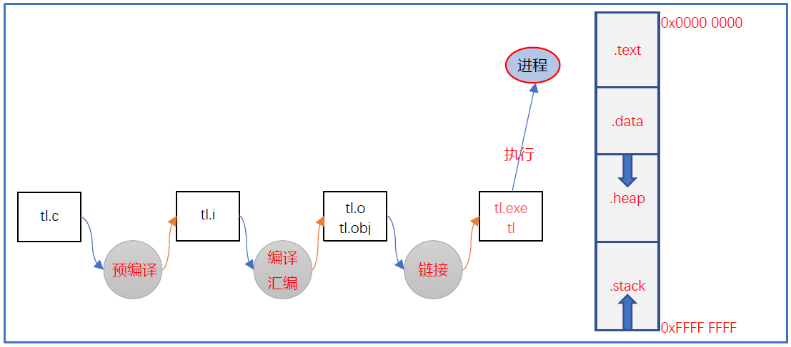
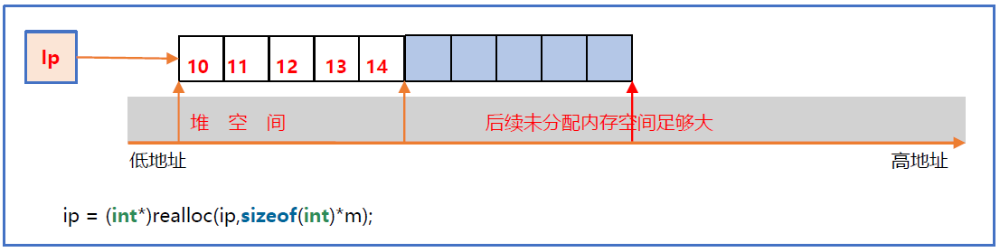
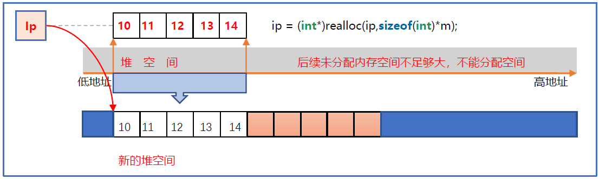

# 本章内容

1. 什么是动态内存
2. 动态内存管理函数
3. 动态内存的使用
4. 动态内存与结构体

# 什么是动态内存

先看一段程序：

```c
#include<stdio.h>
int main()
{
    char str[1024 * 1024];	// 需要1MB存储空间
    print("hehe \n");
    return 0;
}
```


运行时程序崩溃（在Windows系统下）。这是为什么呢？

> 注意报错信息：
>
> `0xC00000FD`: Stackoverflow

再次分析编译链接过程：



先来谈栈区，我们知道栈区的空间在函数被调时会分配，用于存放函数的参数值，局部变量等值。在Windows中栈的默认大小是`1MB`，在vs中可以设置栈区的大小；在Linux中栈的默认大小是`10MB`，在gcc编译时可以设置栈区的大小。

再看堆区，程序运行时可以在堆区动态地请求一定大小的内存，并在用完之后归还给堆区。在Liunx系统中用户可用的堆区的大小接近`3GB`。Windows下的用户堆区大小是接近`2G`。可参考此文章：[栈和堆的大小，申请一个整形数组最大可以达到多少（Linux和Windows）](https://www.its203.com/article/qq_37200329/97949658)

**如果我们需要大块内存，或者程序在运行的过程中才知道所需内存大小，我们就从堆区分配空间**。

## 动态内存分配函数

C语言中动态内存管理的有四个函数：`malloc`，`calloc`，`realloc`，`free`，都需要引用`stdlib.h`或`malloc.h`文件。

# malloc

向堆区申请一块指定大小的连续内存空间。
```c
using size_t = unsigned int;
void* malloc(size_t size);
参数：
	size	- 要分配的字节数
返回值：
	成功时, 返回指向新分配内存的指针;
	失败时, 返回空指针。
```

1. 分配`size`字节的未初始化内存。
2. 若分配成功，则返回为任何拥有**基础对齐**的对象类型对齐的指针。
3. 若`size`为零，则`malloc`的行为是实现定义的。例如可返回空指针，亦可返回非空指针，但不应当**解引用**这种非空指针，而且应将它传递给以避免内存泄漏。

# free

用来释放且仅能释放从`malloc`，`realloc`，`calloc`成功获取到的动态内存分配的空间。释放的不是指针本身，而是指针所指的堆区空间。

```cpp
void free(void * ptr);
```

释放之前由`malloc()`、`calloc()`、`aligned_alloc() (C11起)`或`realloc()`分配的空间。

1. 若`ptr`为空指针，则函数不进行操作。
2. 若`ptr`的值不是之前从`malloc()`、`calloc()`、`realloc()`或`aligned_alloc() (C11起)`返回的值，则行为未定义。
3. 若`ptr`所指代的内存区域已经被解分配，则行为未定义。
4. 若在`free()`返回后通过指针`ptr`访问内存，则行为未定义（除非另一个分配函数恰好返回等于`ptr`的值）。

**参数**
ptr 指向要解分配的内存的指针
**返回值（无）**
注解
此函数接收空指针（并对其不处理）以减少特例的数量。不管分配成功与否，分配函数返回的指针都能传递给 free() 。

## 示例


## 面试重点


# calloc

分配并使用零初始化连续内存空间

```c
void * calloc(size_t num, size_t size);
参数:
	num		- 对象（元素）数目
	size	- 每个对象（元素）的大小
返回值:
	成功时，返回指向新分配内存的指针。
	失败时，返回空指针。
```

为`num`个对象（元素）的数组分配内存，并初始化所有分配存储中的字节为零。

1. 若分配成功，会返回指向分配内存块最低位（首位）字节的指针，它为任何类型适当地对齐。
2. 若`size`为零，则行为是实现定义的（可返回空指针，或返回不可用于访问存储的非空指针）。

## 模拟实现

实际上，calloc是基于malloc实现的。

```c
void* my_calloc(size_t count, size_t size)
{
    void* s = malloc(count * size);
    if(s != NULL)
    {
        memset(s, 0, count * size);
    }
    return s;
}
```

# realloc

扩充之前分配的内存块(重新分配内存块)。

```c
void * realloc(void * ptr, size_t new_size);
参数:
	ptr			- 指向需要重新分配的内存区域的指针
	new_size	- 数组的新大小（字节数）
返回值:
	成功时，返回指向新分配内存的指针。原指针ptr失效，而且任何通过它的访问是未定义行为（即使重分配是就地的）。
	失败时，返回空指针。原指针ptr保持有效。
```

重新分配给定的内存区域。它必须是之前为`malloc()`、`calloc()`或`realloc()`所分配，并且仍未被`free`或`realloc`的调用所释放。否则，结果未定义。

重新分配按以下二者之一执行：

1. 可能的话，扩张或收缩`ptr`所指向的已存在内存。内容在新旧大小中的较小者范围内保持不变。若扩张范围，则数组新增部分的内容是未定义的。
2. 分配一个大小为`new_size`字节的新内存块，并复制大小等于新旧大小中较小者的内存区域，然后释放旧内存块。

1. 若无足够内存，则不释放旧内存块，并返回空指针。
2. 若`ptr`是`NULL`，则行为与调用`malloc(new_size)`相同。
3. 若`new_size`为零，则行为是实现定义的（可返回空指针，此情况下可能或可能不释放旧内存，或返回不会用于访问存储的非空指针）。

## 示例

```c
#include<stdlib.h>
#include<stdio.h>
int main()
{
    int n = 10;
    int m = 5;
    int dm = 3;
    //现在申请 m 个int空间。
    int* p = (int*)malloc(sizeof(int) * m);
    if (p == NULL)
    {
        exit(1);
    }
    for (int i = 0; i < m; ++i)
    {
        p[i] = i;
    }
	//现在扩展到 n 个int空间。
    int* newdata = (int*)realloc(p, sizeof(int) * n);//扩展到n个，不是扩展n个
    if (NULL == newdata)
    {
        printf("堆无更多空间，增容失败\n");
        exit(1);
    }
    p = newdata;
}
```

## 扩容

realloc扩容有3种情况。

### 1 - 后面足够, 就地

后续有足够的可分配空间。图示如下：



1. 下越界标记后移。
2. 修改上越界标记之上的信息为最新大小值。

### 2 - 后面不足, 搬到更大的空地

后续未分配内存空间不足够大，不能分配空间。图示如下：



1. 在堆内存其他区域开辟要扩展的大小。
2. 原本的内存内容拷贝到新空间。
3. 原本的内存释放。
4. 原来的指针失效，需要重新接收新指针（返回值）。

### 3 - 堆空间不足, 会产生内存泄漏

```c
int main()
{
    int m = 100;
    int n = 1000;
    int * p = (int*)malloc(sizeof(int) * m);
    for(int i = 0; i<m; ++i)
    {
        p[i] = i;
    }
    // 由 100个空间扩展到1000个空间
    p = (int*)realloc(p, sizeof(int) * n);
    //如果返回了一个NULL呢？把p给冲掉了！
}
```

堆内存不足，扩展空间失败，`realloc`函数返回NULL。

此时会产生一个**巨大的坑**。

如果你没有事先保存指针p的值，那么p的值将会丢失。就产生了内存泄漏。

> 内存泄漏指的不是p所指的空间被释放了，而是p指针所指的地址无从查找了，从而无法管理原有的内存空间了。

#### 安全的方案

```c
int main()
{
    int m = 100;
    int n = 1000;
    int * p = (int*)malloc(sizeof(int) * m);
    for(int i = 0; i<m; ++i)
    {
        p[i] = i;
    }
    // 由 100个空间扩展到1000个空间
    int * newdata = (int*)realloc(p, sizeof(int)*n);
    if(newdata == NULL)
    {
        printf("内存不足, realloc失败\n");
    }
    else
    {
        free(p);		//内存足够, free掉原有空间
        p = newdata;
    }
}
```

## 模拟实现 - 扩容

```c
void my_realloc(void* p, size_t old_sz, size_t new_sz)
{
    void* newdata = malloc(size);
    if(newdata!=NULL)
    {
        memmove(newdata, p, old_sz);
    }
    return newdata;
}//只能模拟第二种情况，第一种情况需要知道内存后面是否有足够空间，需要系统调用。
```

# 单链表

```c
#pragma once
#include<stdio.h>
#include<stdlib.h>
#include<string.h>
#include<assert.h>
typedef int ElemType;
typedef struct ListNode
{
    ElemType data;
    struct ListNode* next;
}ListNode;
typedef struct
{
    ListNode* head;
    int cursize;
}LinkList;//链表
ListNode* Buynode()
{
    ListNode* s = (ListNode*)malloc(sizeof(ListNode));
    if (NULL == s)
    {
        exit(1);
    }
    memset(s, 0, sizeof(ListNode));
    return s;
}
void Freenode(ListNode* p)
{
    free(p);
}
void InitList(LinkList* plist)
{
    assert(plist != nullptr);
    plist->head = Buynode();
    plist->cursize = 0;
}
int GetSize(const LinkList* plist)
{
    assert(plist != nullptr);
    return plist->cursize;
}
bool isEmpty(const LinkList* plist)
{
    return GetSize(plist) == 0;
}
void PrintList(LinkList* plist)
{
    assert(plist != nullptr);
    ListNode* p = plist->head->next;
    while (p != NULL)
    {
        printf("%d ", p->data);
        p = p->next;
    }
    printf("\n");
}
ListNode* FindValue(LinkList* plist, ElemType val)
{
    assert(plist != nullptr);
    ListNode* p = plist->head->next;
    while (p != NULL && p->data != val)
    {
        p = p->next;
    }
    return p;
}
ListNode* FindValue_Prev(LinkList* plist, ElemType val)
{
    assert(plist != nullptr);
    ListNode* pre = plist->head;
    ListNode* pnode = pre->next;
    while (pnode != NULL && pnode->data != val)
    {
        pre = pnode;
        pnode = pnode->next;
    }
    if (pnode == NULL)
    {
        pre = NULL;
    }
    return pre;
}
bool Insert_Next(LinkList* plist, ListNode* ptr, ElemType val)//向plist链表中的ptr结点（假设已经找到）之后插入新结点。为其他插入函数服务
{
    assert(plist != nullptr);
    if (ptr == NULL)return false;
    ListNode* pnode = Buynode();
    pnode->data = val;
    pnode->next = ptr->next;
    ptr->next = pnode;
    plist->cursize += 1;
    return true;
}
void Push_Front(LinkList* plist, ElemType val)
{
    Insert_Next(plist, plist->head, val);
}
void Push_Back(LinkList* plist, ElemType val)
{
    ListNode* pnode = plist->head;
    while (pnode->next != nullptr)
    {
        pnode = pnode->next;
    }
    Insert_Next(plist, pnode, val);
}
bool Remove(LinkList* plist, ElemType val)
{
    assert(plist != NULL);
    ListNode* p = FindValue_Prev(plist, val);
    return Erase_Next(plist, p);
}
//最垃圾的219版
void Remove_All(LinkList* plist, ElemType val)
{
    assert(plist != NULL);
    ListNode* p = NULL;
    while ((p = FindValue_Prev(plist, val)) != NULL)
    {
        Erase_Next(plist, p);
    }
}
//技能提升班版本
void Remove_All(LinkList* plist, ElemType val)
{
    assert(plist != NULL);
    ListNode* p = plist->head;
    while (p->next != NULL)//说明p有后继
    {
        if (p->next->data == val)
        {
            ListNode* q = p->next;
            p->next = q->next;
            Freenode(q);
            plist->cursize--;
        }
        else
        {
            p = p->next;
        }
    }
}
//技能提升班版本改进，215版本
void Remove_All(LinkList* plist, ElemType val)
{
    assert(plist != NULL);
    ListNode* p = plist->head;
    while (p->next != NULL)//说明p有后继
    {
        if (p->next->data == val)
        {
            Erase_Next(plist, p);
        }
        else
        {
            p = p->next;
        }
    }
}
//B站版本
void Remove_All(LinkList *plist, ElemType val)
{
    assert(plist != NULL);
    ListNode *pre = plist->head;
    ListNode *p = plist->head->next;
    while(p!=NULL)
    {
        if(val!=p->data)
        {
            pre = pre->next;
            Swap(&pre->data,&p->data);
        }
        p = p->next;
    }
    while(pre->next!=NULL)
    {
        Erase_Next(plist,pre);
    }
}
bool IsEmpty(const LinkList* plist)
{
    assert(plist != NULL);
    return plist->cursize == 0;
}
void ClearList(LinkList* plist)
{
    assert(plist);
    while (!IsEmpty(plist))
    {
        Pop_Front(plist);
    }
}
void DestroyList(LinkList* plist)
{
    assert(plist);
    ClearList(plist);
    Freenode(plist->head);
    plist->head = NULL;
}
ListNode* FindPrevNode_Pos(const LinkList* plist, int pos)
{
    assert(plist != nullptr);
    if (pos<1 || pos > plist->cursize + 1)return NULL;
    ListNode* pnode = plist->head;  //0
    for (int i = 0; i < pos - 1;++i)	//pos: pos=5->1 2 3 4;pos=1 -> 0
    {
        pnode = pnode->next;
    }
    return pnode;
}
ListNode* FindNode_Pos(const LinkList* plist, int pos)
{
    assert(plist != nullptr);
    if (pos<1 || pos > plist->cursize)return NULL;
    ListNode* pnode = FindPrevNode_Pos(plist, pos);
    return pnode->next;
}
void Insert_Item(LinkList* plist, ElemType x, ElemType val)
{

}
bool Erase_Next(LinkList* plist, ListNode* ptr)//删除ptr的后续节点
{
    assert(plist != nullptr);
    ListNode* pnode = ptr->next;
    if (NULL == ptr || pnode == nullptr)return false;
    ptr->next = pnode->next;
    free(pnode);
    plist->cursize -= 1;
    return true;
}
void Pop_Front(LinkList* plist)//头删法
{
    Erase_Next(plist, plist->head);
}
void Pop_Back(LinkList* plist)//尾删法
{
    ListNode* pnode = FindPrevNode_Pos(plist, plist->cursize);
    Erase_Next(plist, pnode);
}
```

# 双链表

```c
//My_DuLinkList.h
#ifndef MY_DULINKLIST_H
#define MY_DULINKLIST_H
typedef int ElemType;
typedef struct DuLNode
{
    struct DuLNode* prev;
    struct DuLNode* next;
    ElemType data;
}DuLNode,*PDuLNode;
typedef struct
{
    PDuLNode head;
    int cursize;
}DuLinkList;
DuLNode* Buynode();
void Freenode(DuLNode* p);
void InitDuList(DuLinkList* plist);
void ClearDuList(DuLinkList* plist);
void DestroyDuList(DuLinkList* plist);
int GetSize(const DuLinkList* plist);
bool IsEmpty(const DuLinkList* plist);
bool Insert_Prev(DuLinkList* plist, DuLNode* ptr, ElemType val);
void Push_Front(DuLinkList* plist, ElemType val);
void Push_Back(DuLinnkList* plist, ElemType val);
bool Erase(DuLinkList* plist, DuLNode* ptr);
void Pop_Front(DuLinkList* plist);
void Pop_Back(DuLinkList* plist);
void Remove(DuLinkList* plist, ElemType val);
void RemoveAll(DuLinkList* plist, ElemType val);
void PrintDuList(const DuLinkList* plist);
DuLNode* FindValue(const DuLinkList* plist, ElemType val);
DuLNode* FindPos(const DuLinkList* plist, int pos);
#endif
```

```c
//My_DuLinkList.cpp
#include<stdlib.h>//malloc free
#include<string.h>//memset
#include<stdio.h>//printf scanf
#include"My_DuLinkList.h"
#include<assert.h>
DuLNode* Buynode()
{
    DuLNode* s = (DuLNode*)malloc(sizeof(DuLNode));
    if(NULL==s)exit(1);
    memset(s,0,sizeof(DuLNode));
    return s;
}
void Freenode(DuLNode* p)
{
    free(p);
}
void InitDuList(DuLinkList* plist)
{
    assert(plist !=NULL);
    plist->cursize = 0;
    plist->head = Buynode();
    plist->head->prev = plist->head;
    plist->head->next = plist->head;
}
void PrintDuList(const DuLinkList* plist)
{
    assert(plist!=NULL);
    DuLNode* pnode = plist->head->next;
    while(pnode!=plist->head)
    {
        printf("%d ",pnode->data);
        pnode = pnode->next;
    }
    printf("\n");
}
int GetSize(const DuLinkList* plist)
{
    assert(plist!=NULL);
    return plist->cursize;
}
bool IsEmpty(const DuLinkList* plist)
{
    assert(plist != NULL);
    return Getsize(plist)==0;
}
DuLNode* FindValue(const DuLinkList* plist, ElemType val)
{
    assert(plist!=NULL);
    DuLNode* pnode = plist->head->next;
    while(pnode!=plist->head&&pnode->data!=val)
    {
        pnode = pnode->next;
    }
    if(plist->head == p)pnode = NULL;
    return pnode;
}
//插到节点ptr的前驱
bool Insert_Prev(DuLinkList* plist, DuLNode* ptr, ElemType val)
{
    assert(plist!=NULL);
    if(ptr==NULL)return false;
    DuLNode* s = Buynode();
    
    s->prev = ptr->prev;
    s->next = ptr;
    ptr->prev->next = s;
    ptr->prev = s;
    /*第二种写法
    s->prev = ptr->prev;
    s->next = ptr;
    ptr->prev = s;
    s->prev->next = s;
    */
    /*第三种写法
    	//先处理next
    s->next = ptr;
    s->prev->next = s;
    	//后处理prev
    s->prev = ptr->prev;
    ptr->prev = s;
    */
    
    s->data = val;
    plist->cursize++;
    return true;
}
void Push_Front(DuLinkList* plist, ElemType val)
{
    assert(plist!=NULL);
    Insert_Prev(plist, plist->head->next, val);
}
void Push_Back(DuLinnkList* plist, ElemType val)
{
    assert(plist!=NULL);
    Insert_Prev(plist, plist->head, val);
}
bool Erase(DuLinkList* plist, DuLNode* ptr)
{
    assert(plist!=NULL);
    if(ptr==NULL)return false;
    ptr->prev->next = ptr->next;
    ptr->next->prev = ptr->prev;
    Freenode(ptr);
    plist->cursize--;
    return true;
}
void Pop_Front(DuLinkList* plist)
{
    assert(plist!=NULL);
    if(!IsEmpty(plist))
    {
        Erase(plist,plist->head->next);
    }
}
void Pop_Back(DuLinkList* plist)
{
    assert(plist!=NULL);
    if(!IsEmpty(plist))
    {
        Erase(plist,plist->head->prev);
    }
}
void Remove(DuLinKList* plist, ElemType val)
{
    assert(plist!=NULL);
    Erase(plist, FindValue(plist, val));
}
void RemoveAll(DuLinkList* plist, ElemType val)
{
    
}
void ClearDuList(DuLinkList* plist)
{
    assert(plist != NULL);
    while(!Empty(plist))
    {
        Pop_Front(plist);
    }
}
void DestroyDuList(DuLinkList* plist)
{
    assert(plist!=NULL);
    ClearDuList(plist);
    Freenode(plist->head);
}
DuLNode* FindPos(const DuLinkList* plist, int pos)
{
    assert(plist!=NULL);
    
}
```


```c
//test.cpp
#include<assert.h>
#include<string.h>
#include"My_DuLinkList.h"
int main()
{
    int ar[] = {12,23,34,45,56,67,78,89,90,100};
    int n = sizeof(ar)/sizeof(ar[0]);
    DuLinkList mylist;
    InitDuList(&mylist);
    for(int i = 0;i<n;++i)
    {
        Push_Back(&mylist);
        PrintDuList(&mylist);
    }
}
```

