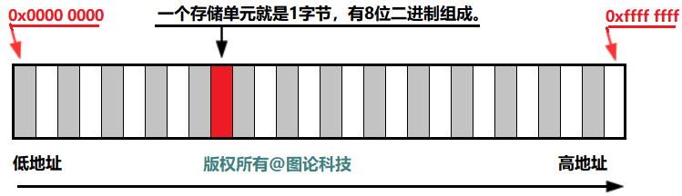
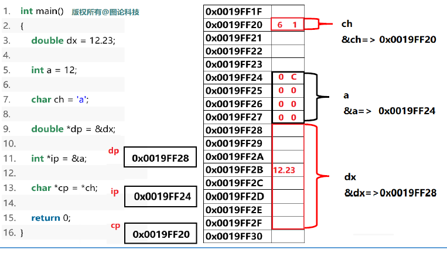
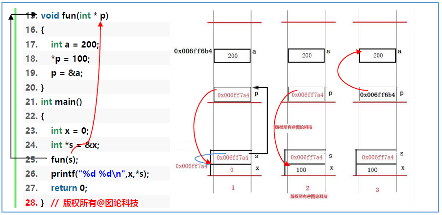
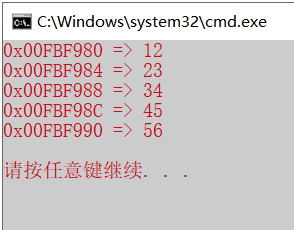
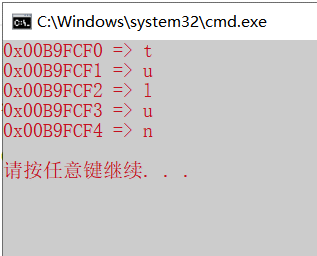
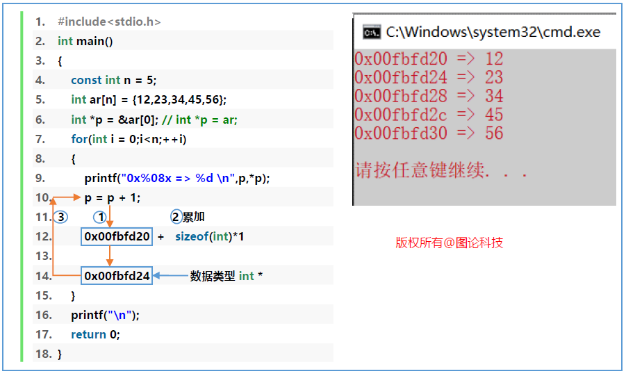
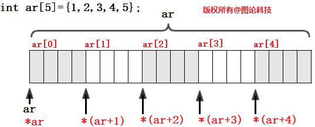
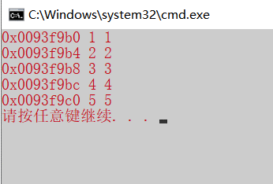
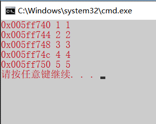

本章内容：
1. 什么是指针
2. 指针的定义
3. 指针的应用
4. 指针的运算
5. 指针与数组的关系
6. 指针和数组，函数示例
7. 二级指针
# 什么是指针

计算机中所有的数据都必须放在内存中，不同类型的数据占用的字节数不一样，例如`int`占用 4 个字节，char 占用 1 个字节。为了正确地访问这些数据，必须为每个字节都编上号码，就像门牌号一样，每个字节的编号是唯一的，根据编号可以准确地找到某个字节。 我们将内存中字节的编号称为地址（Address）或指针（Pointer）。地址从 0 开始依次增加，对于 32 位环境，程序能够使用的内存为 4GB。
最小的地址为`0x0000 0000`，最大的地址为`0XFFFF FFFF`。

## 对星号`*`的总结
1. 表示乘法。
2. 表示定义一个指针变量，以和普通变量区分开
3. 表示解引用。获取指针指向的数据，是一种间接操作。

`*`号运算符所在的环境不一样，`*`号的含意也不一样。
```c
int main()
{
	int a = 10, b = 20;
	int c = a * b;//表示乘号
    
    int * p;//声明指针
    p = &a;
    * p = 100;//解引用
    
    return 0;
}
```
# 定义指针变量
## 一定要在定义时初始化
要么初始化为空，要么指向已有变量的地址。否则指针指向的位置不可控，可能在操作指针时会改变其他正在运转的值。
```c
int main()
{
    int *p , s; // p 是整型指针变量，s 是整型变量。
    char *cpa , *cpb; // cpa 和 cpb 都是char 类型指针变量。
    int a = 10;
    // 以下两句与 int *p = &a; 等价
    int * ip; // 未初始化的指针，不良的定义习惯
    ip = &a; 
    return 0;
}
```
## 图解

定义指针变量时，类型对指针变量起到2个作用：
1. 解析存储单元的大小;
2. 指针变量加1的能力。

如：
1. `double da = *dp;`
2. `int ib = *ip;`
3. `char cc = *cp;`
## 综合实例
```c
void fun(int *p)
{
    int a = 200;
    *p = 100;
    p = &a;
}
int main()
{
    int x = 0;
    int *s = &x;
    fun(s);
    printf("%d %d\n",x,*s);//x=100, *s=200或失效，因为int a在fun函数调用后释放了。错！*s是100。
    return 0;
}
```

# 指针的运算
## 指针+1
`typename * p;`
`p = p + 1;`被编译器解释成：`p = p + sizeof(typename) * 1;`
### 示例1：int指针变量加1
```c
#include<stdio.h>
int main()
{
    const int n = 5;
    int ar[n]={12,23,34,45,56};
    int *ip = &ar[0]; // int *ip = ar;
    for(int i = 0;i<n;++i)
    {
        printf("0x%08X => %d \n",ip,*ip);
        ip = ip + 1;
    }
    printf("\n");
    return 0;
}
```

### 示例2：char类型指针变量+1
```c
#include<stdio.h>
int main()
{
    const int n = 5;
    char ar[n]={'t','u','l','u','n'};
    char *cp = &ar[0]; // char *cp = ar;
    for(int i = 0;i<n;++i)
    {
        printf("0x%08X => %c \n",cp,*cp);
        // printf("%#p => %c \n",cp,*cp);
        cp = cp + 1;
    }
    printf("\n");
    return 0;
}
```

### 示例3：double类型指针变量+1
```c
#include<stdio.h>
int main()
{
    const int n = 5;
    double ar[n]={1.2, 2.3, 3.4, 4.5, 5.6};
    double *dp = &ar[0]; // char *cp = ar;
    for(int i = 0;i<n;++i)
    {
        printf("0x%08X => %f \n",dp,*dp);
        // printf("%#p => %f \n",dp,*dp);
        dp = dp + 1;
    }
    printf("\n");
    return 0;
}
```
### 指针+1详解


## 思考下面代码运行结果
```c
int main()
{
    int ar[5]={12, 23, 34, 45, 56 };
    int *p = ar; // int *p = &ar[0];
    int x = 0;
    int y = 0;
    x = *p++; //int x = *p; p++;
    y = *p;
    printf("%d %d \n",x,y);
    x = ++*p;
    y = *p;
    printf("%d %d \n",x,y);
    x = *++p;
    y = *p;
    printf("%d %d \n",x,y);
    return 0;
}
```


## 总结
### 指针的类型决定了两个能力
1. +1的能力，偏移量。
2. 对内存的解析能力。


```c
ix=0x12345678  sx=0x5678 cx=0x78
```
### 指针有两个要素
1. 地址值
2. 指针指向的数据类型
# 指针与数组的关系
1. 数组名被看作该数组的第一个元素在内存中的首地址（仅在`sizeof`操作中例外，该操作给出数组所占内存大小）。
2. 数组名在表达式中被自动转换为一个指向数组第一个元素的指针常量。
3. 数组名是指针，非常方便，但是却丢失了数组另一个要素：数组的大小，即数组元素的数量。编译器按数组定义时的大小分配内存，但运行时（run time）对数组的边界不加检测。这会带来无法预知的严重错误。



C提供根据数组的存储地址访问数组元素的方法。上图中`ar`是数组第一个元素的地址，所以`*ar`是数组的第一个元素`ar[0]`，而`ar+1`是数组第二个元素的地址，`*(ar+1)`是第二个元素`ar[1]`本身。指针加1，则地址移动一个数组元素所占字节数。

C语言的下标运算符`[]`是以指针作为操作数的，`ar[i]`被编译系统解释为`*(ar+i)`，即表示为`ar`所指（固定不可变）元素向后第`i`个元素。无论以下标方式或指针方式存取数组元素时，系统都是转换为指针方法实现。逻辑上有两种方式，物理上只有一种方式。
## 数组名访问
```c
int main()
{
    const int n = 5;
    int ar[n] = {1, 2, 3, 4, 5};
    for(int i = 0;i < n;++i)
    {
        printf("0x%08x %d %d \n",ar+i, ar[i], *(ar+i));
    }
    return 0;
}
```

## 指针访问

```c
int main()
{
    const int n = 5;
    int ar[n] = {1,2,3,4,5};
    int *p = ar;
    for(int i = 0;i<n;++i)
    {
        printf("0x%08x %d %d\n",p+i,p[i],*(p+i));
    }
    return 0;
}
```

## 数组的退化

用数组作为函数的形参，数组将退化为指针类型。

如果想要在函数中传递一个一维数组作为参数，必须以下面三种方式来声明函数形式参数，这三种声明方式的结果是一样的，因为每种方式都会转成指针。

```c
void Print_Array(int br[],int n); //形式参数是一个未定义大小的数组：
void Print_Array(int br[5],int n); //形式参数是一个已定义大小的数组
void Print_Array(int *br,int n)； //形式参数是一个指针
```

要点：为什么数组作为函数的形参会退化为指针呢？我们将从时间效率和空间效率上分析。

我们先假设数组作为函数的形参，我们分析一下调用过程；

```c
void Print_Array(int br[5],int n)
{
	int ar_len = sizeof(br);
	printf("ar_len : %d \n",ar_len);
}
int main()
{
	const int n = 5;
	int ar[n] = {1,2,3,4,5};
	Print_Array(ar,n);
	return 0;
}
```

```c
#include<stdio.h>
void Print_Ar(int br[10])//如果如此定义，传参数前，主函数开辟了数组空间，传参数时，栈区又会开辟10个空间！而且又要浪费时间把数组中的数据依次传入。既浪费空间又浪费空间。
{
    int size=sizeof(br);//只会是4，因为(int br[10]退化成了(int *br)
    printf("size: %d \n",size);
}
```
### 二维数组的退化
```c
//打印二维数组
void Print_Ar(int(*br)[4],int row,int col)
{
    //int n = sizeof(**br);//虽然可以通过sizeof(**br);算出column即列数。但为了使程序更加方便化，定义形参col
    printf("%d %d\n", row, n);
    for (int i = 0;i < row;++i)
    {
        for (int j = 0;j < col;++j)
        {
            printf("%d ", br[i][j]);
        }
        printf("\n");
    }
    printf("\n");
}
```

如果二维数组的形参定义为：`int [4][5]`，同一维数组的道理一样，将会退化为`int(*br)[4]`。
## 数组名表示数组首元素的地址

数组名表示数组首元素的地址，而不是数组的地址。
## 数组的地址
```c
int main()
{
    const int n =5;
    int ar[n] = {12,23,34,45,56};
    
    int* ip = ar;//&a[0]
    int (*s)[5] = &ar;//
    int* pa[5];
    return 0;
}
```

```c
int main()
{
    int a = 10;
    int* p = &a;
    //p: int*, *p: int
    int a[5];
    int(*p)[5] = &a;
    //p: int [5]*, *p: int [5]
}
```
## 指针与字符串

```c
char c = "xcgong"[2];//此句话编译后等效于：字符串数组的首元素地址即'y'的地址p，+2取值后*(p+2)赋值给c，即'g'。
```
## 总结
访问数组时，编译器会把`x[y]`转换为：`*(x+y)`，对应机器码的基变址寻址。`x`是基地址。
# const
不带const修饰的指针是自由的，一是自身的值可以改变，二是指向的值可以改变。
```c
int a = 10, b = 20;
int *p = &a;
*p = 100;
p = &b;
```
## 带const
```c
int a=10,b=20;
//以下的const在*的左边，修饰的是指向能力（修饰“修改指向的值”的能力），两句话等价
const int *p = &a;
int const *p = &a;
*p = 100;//error
p = &b;  //OK
//以下的const在*的右边，修饰指针自身，可读不可改变自身的值
int * const p = &a;
int x = *p;
*p = 100;//OK
p = &b;  //error
//有两个const，第一个修饰的是指向能力（修饰“修改指向的值”的能力），第二个修饰的是指针自身
const int * const p = &a;
int const * const p = &a;
*p = 100;//error
p = &b;  //error
```

```c
int a=10;
const int b=20;
int *pa=&a;//*pa=100;//ok
const int* pa1=&a;//*pa1=100;//error

int* pb=&b;//error
const int* pb=&b; //ok
```

```c
//.cpp下编译
int main()
{
    const int a=10;
    int b=0;
    int* p=(int*)&a;
    *p=100;
    b=a;//编译时自动把a替换成了10
    printf("a=%d\n",a);//打印10
    printf("b=%d\n",b);//打印10
    printf("*p=%d\n",*p);//打印100
}
```
# str相关函数
## strlen
### 第一次编的
```c
#include<stdio.h>
int my_strlen(char* string)
{
    int count = 0;
    while (*string++ != '\0')
    {
        ++count;
    }
    return count;
}
```
### 老师的改进
```c
#include<stdio.h>
#include<assert.h>
int my_strlen(const int* string)
{
    assert(string != NULL);
    int i=0;
    while(string[i]!='\0')
    {
        ++i;
    }
    return i;
}
```
### 另有方法：利用指针地址计算
指针地址的计算——算头不算尾
```c
#include<stdio.h>
#include<assert.h>
int my_strlen(const int* str)
{
    assert(str!=nullptr);
    const char* cp = str;
    while(*cp!='\0')
    {
        cp++;
    }
    return (cp-str);
}
```
#### 变种问题
不让用计数变量计算字符串长度--指针地址计算

不让用任何变量计算字符串长度--递归函数
```c
int my_strlen2(const char* string)
{
    assert(string != nullptr);
    if (*string++)
    {
        return my_strlen2(string)+1;
    }
    else return 0;
}
```
## cpy
```c
char* my_strcpy(char* dest,const char* src)
{
    assert(dest != NULL && src != NULL);
    char* cp = dest;
    while (*src != '\0')
    {
        *dest = *src;
        dest++;
        src++;
        //也可以一句话解决，while(*dest++ = *src++);//因为赋值语句有返回值是赋值的值，但可读性不好
    }
    *dest = '\0';
    return dest;//返回dest即目的拷贝字符串，便于函数嵌套达到可以实现连续拷贝
}
```
对于`*dest++ = *src++`可以看一下汇编代码，就清楚了


## strcat
### 定义一个指针变量
```c
#include<stdio.h>
#include<assert.h>
char* my_strcat(char* dest, const char* src)
{
    assert(dest != nullptr && src != nullptr);
    char* cp = dest;
    while (*cp != '\0') ++cp;
    while (*cp++ = *src++);
    return dest;
}
```
### 不用定义指针变量，利用len获取下标
```c
#include<stdio.h>
#include<assert.h>
char* my_strcat(char* dest, const char* src)
{
    assert(dest != nullptr && src != nullptr);
    int index = my_strlen(dest);
    my_strcpy(dest+len, src);
    return dest;
}
```
## strcmp
```c
int main()
{
    char* stra = "yhp";
    char* strb = "yhp";
    
    char strc[]="yhp";
    char strd[]="yhp";
    
    bool x = (stra==strb);//1
    bool y = (strc==strd);//0
    printf("x = %d y = %d\n",x,y);
}
```

```c
#include<stdio.h>
#include<assert.h>
int my_strcmp(const char* ap, const char* bp)
{
    //ap="yhping" bp="yhping" 0
    //ap="yhxing" bp="yhping" >0
    //ap="yhping" bp="yhxing" <0
    assert(ap!=nullptr&&bp!=nullptr);
    while((ap||bp)&&(*ap==*bp))
    {
        ap++;
        bp++;
        if(*ap=='\0'||*bp=='\0')break;
    }
    return *ap-*bp;
}
int main()
{
    char stra[10] = "yhping";
    char strb[10] = "yhxing";
    int ans = my_strcmp(stra,strb);
    printf("%d\n", ans);
}
```
# 练习
## 判断当前系统是小端地址还是大端地址（可通过指针强转来探测）
```c
int main()
{
    short st = 0x0001;
    char* cp = (char*)&st;
    if(*cp==0x01)
    {
        printf("小端\n");
    }
    else
    {
        printf("大端\n");
    }
}
```
## 不让用任何变量计算字符串长度--递归函数
```c
int my_strlen2(const char* string)//不定义变量，递归求解
{
    assert(string != nullptr);
    if (*string++)
    {
        return my_strlen2(string)+1;
    }
    else return 0;
}
```
## 给出以下的代码输出结果
```c
int main()
{
    char* stra = "yhp";
    char* strb = "yhp";
    
    char strc[]="yhp";
    char strd[]="yhp";
    
    bool x = (stra==strb);//1
    bool y = (strc==strd);//0
    printf("x = %d y = %d\n",x,y);
}
```
## strcmp函数
```c
//ap="yhping" bp="yhping" 0
//ap="yhxing" bp="yhping" >0
//ap="yhping" bp="yhxing" <0
int my_strcmp(const char* ap, const char* bp)
{
    assert(ap != nullptr && bp != nullptr);
    while (ap&&bp&&*ap == *bp)//有一个不为空且依次相等
    {
        ap++;
        bp++;
    }
    return *ap - *bp;
}
```
## 冒泡排序
```c

```
## 二分查找
```c
int FindValue(int* ar,int n,int val)
{
    assert(ar != nullptr);
    int pos = -1;
    int left = 0, right = n - 1;
    //为什么left还要等于right呢？left和right表示数据的规模，如果left=right说明还要再寻找一次。当right和right错位，说明没有数据了。
    while (left<=right)
    {
        int mid = (left + right) >>2;
        if (val < ar[mid])
        {
            right = mid-1;//val值在mid下标前，mid下标已经没必要比较，而且必须-1，因为如果这个值在数组中没有，而在mid下标值和mid-1下标值之间的话
        }
        else if (val > ar[mid])
        {
            left = mid+1;
        }
        else
        {	//如果有重复的值，则向前探测相同值。
            //但也要注意越界问题。mid-1不要<0
            while (mid > left && ar[mid - 1] == ar[mid])
            {
                --mid;
            }
            pos = mid;
            break;
        }
    }
    return pos;
}
```
1. 如果数据量非常大，`left+right`可能会溢出，怎么解决——`left + (right - left) / 2`
2. 线性探测如何优化，以加速探测速度。
3. [二分查找及其变种](https://www.cnblogs.com/yumingxing/p/9583154.html)：斐波那契查找的时间复杂度还是$O(\log_2 n)$，但是 与折半查找相比，斐波那契查找的优点是它只涉及加法和减法运算，而不用除法，而除法比加减法要占用更多的时间。
## 循环移动数组
示例：`int ar[10]={1, 2 , 3 , 4 , 5 , 6 , 7 , 8 , 9 , 10};`
右移一个数据元素：输出`{ 10,1,2,3,4,5,6,7,8,9};`
右移`k`个数据元素：如`k = 3;`输出`{8，9，10，1，2，3，4，5，6，7}`

实现函数：
`Right_Move_Array; // 右移一个数据元素`
`Right_Move_Array_K; // 右移k 个数据元素`
`Left_Move_Array;`
`Left_Move_Array_K;`

https://blog.csdn.net/weixin_45007066/article/details/116057402
https://blog.csdn.net/weixin_45332776/article/details/116333199
## 改进冒泡排序
```c

```
## `my_memset()`
```c
void my_memset(void* src, int val, int size)
{
    assert(src != nullptr);
    char* cp = (char*)src;
    for (int i = 0;i < size;++i,++cp)
    {
        *cp = 0;
    }
}
```
## `my_memmove()`
```c

```
## `my_atoi()`
字符串数字转换为整型数字
1. `"123"=>123`
2. `"-123"=>-123`
3. `"0123"(8进制)=>`
4. `"0x123Df"=>`
5. `"75894235702389573478903242334537" =>`
6. "505"错写为了"5o5"，要有纠错能力转为505

```c

```