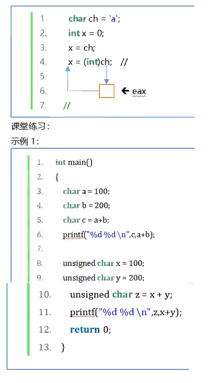
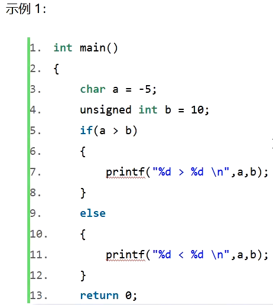
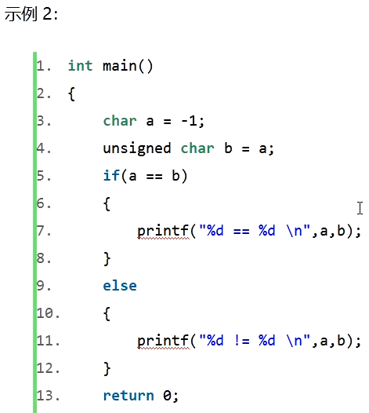
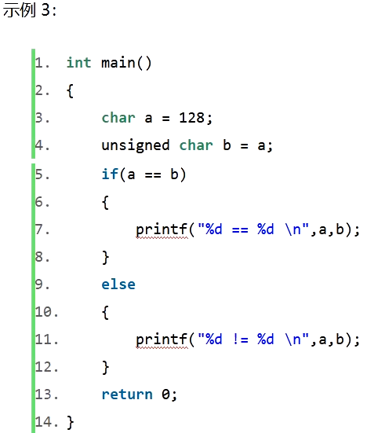
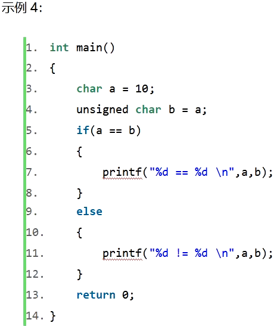

# 课件











# 二进制

二进制怎么转换为十进制？`0101  ->  5`

```
次数：  3  2  1  0
权值：  0  1  0  1
  0 + 1 * 2^2 + 0 + 1 * 2^0
= 0 +   4     + 0 +    1
= 5
```

十进制怎么转换为二进制？`5   ->  101`

```
    2  | 5                     
       ---------               _
      2  | 2   ......     1   /|\    后3位
         ---------             |
        2  | 1   .....    0    |     后2位
            -------            |
              0   ......  1    |     后1位
```

## 负数怎么表示

以下均是在4位机下讨论

负5？

`5 + x = 0 -> 0101 + x = 0 -> 0101 + 1010 = 1111, 1111 + 1 = 0, x = 1010 + 1 = 1011`

负数用补码表示，是原码的反码加1。

负8？

先求8的原码的反码，再加1：`8: 1000 -> 0111 + 1 -> 1000`

负8的补码居然是它自己？

搞了半天发现，我们一开始就说明了，在4位机下讨论，那么有符号数的范围只有`-8 ~ 7`，根本就不存在8一说。所以，无法求得8的原码，也因此无法求8的补码。（为什么1000不能代表8的原码？因为有符号数中第一位代表符号位！）

## 16进制

```
    0101 1100
     5    C
   => 0x5C
```

数字字面常量的规则：只要第一位是数字，那么代表这是个数字。而0开头的数字，不带x的是8进制（`0___`），带x的是16进制（`0x___`），带b的是2进制（`0b___`）。

16进制的格式化输出的描述符为`%x`，代表`unsigned hexadecimal integer`，是无符号十六进制整型。

```c
int main()
{
    unsigned char ucVal = 0x5cu;//0x5c是数字，u是无符号指示
    printf("%hhu\n", ucVal);    //92
    printf("%hhx\n", ucVal);    //5c
}
```

### 8进制

8进制的格式化输出的描述符为`%o`，代表`unsigned octal`，是无符号8进制数。

```
    01 011 100
     1   3   4
   => 0134
```

```c
int main()
{
    unsigned char ucVal = 0134u;//0134是数字，u是无符号指示
    printf("%hhu\n", ucVal);    //92
    printf("%hho\n", ucVal);    //134
}
```

### 2进制

输出2进制：需要把C语言设置为17标准。

2进制没有格式化输出的描述符。

```
       0101 1100
 => 0b 0101 1100
```

```c
int main()
{
    unsigned char ucVal = 0b0101'1100u; // '为分割符号，便于人性化输入，可有可无
    printf("%hhu\n", ucVal);    //92
    printf("%hho\n", ucVal);    //134
}
```

# 数据类型

## integer

32 bits, 4 Bytes

1. 区分有符号、无符号，其中有符号的`signed`可以省略；无符号带int的整型的int可以省略，其他无符号整型不能省；long int中的int可以省略
2. 字面常量（8、8u）也是有类型的，不带后缀默认是有符号数，带u是无符号数。

### long int

ISO标准中提到，long int的大小不得小于int。目前微软long int的大小为32bits、4字节；而在Linux下为64bits、8字节。

long指示类型的长度，涉及到长度，格式化输出时，需要注意加上length specifiers，即长度描述符。

### long long int

64bits、8字节

### short int

16bits、2字节

针对于整型字面常量的长度描述符没有专门用于short的，因为C语言字面常量最小为32位。如果比32位小的，一律向下兼容。归根结底是因为数据总线最少一次传32位。

但是，针对于printf中的格式化输出，还是要区分长度的，对应short的长度描述符为h。

### char

如果要打印十进制整数，那么对应char的长度描述符为`hh`。格式描述符为`i`或`u`。

而如果要打印字符，那么对应的格式描述符为`c`。

ASCII码：形式上是字符图形，但本质上是整数，如`'a'`是97。

### 整型类测试

```c
int main()
{
    /* integer: 32bits */
    /*signed*/ int iVal = 8;
    unsigned /*int*/ uVal = 8u;
    printf("%i\n", iVal);
    printf("%u\n", uVal);
    /* long int: 32bits */
    /*signed*/ long /*int*/ lVal = 9l;
    unsigned long /*int*/ ulVal = 9ul;
    printf("%li\n", lVal);
    printf("%lu\n", ulVal);
    /* long long int: 64bits */
    /*signed*/ long long /*int*/ llVal = 9ll;
    unsigned long long /*int*/ ullVal = 9ull;
    printf("%lli\n", llVal);
    printf("%llu\n", ullVal);
    /* short int: 16bits */
    /*signed*/ short /*int*/ sVal = 9; //9后面没有专门用于short的长度指示符
    /*unsigned*/ short /*int*/ usVal = 9u;
    printf("%hi\n", sVal);             //但是格式化输出有，要加上h
    printf("%hu\n", usVal);
    /* char: 8bits */
    /*signed*/ char cVal = 9;
    unsigned char ucVal = 9u;
    printf("%hhi\n", cVal);
    printf("%hhu\n", ucVal);
    unsigned char ucVal2 = 'a';
    printf("%c\n", ucVal2);
}
```

## 浮点型

计算机中整型和浮点型的计算是在不同的处理器下完成的。整型处理器是由x86部分完成的，浮点型处理器是由x87部分完成的。因为整型和浮点型的格式是不一样的。

> 小数默认都是有符号数。

1010.1101二进制小数化为十进制小数。依然按照每一位的权重展开计算：
$$
\begin{align}
& 1\times2^3+0\times2^2+1\times2^1+0\times2^0+1\times2^{-1}+1\times2^{-2}+0\times2^{-3}+1\times2^{-4}\\
& =8+2+\frac{1}{2}+\frac{1}{4}+\frac{1}{16}\\
& =10.8125
\end{align}
$$
10.8125十进制小数如何化为二进制小数？整数部分是一直进行余2运算，而小数部分如何化？即0.1101。
$$
\begin{align}
0.8125\times2&=1.625\cdots1\\
0.625\times2&=1.250\cdots1\\
0.25\times2&=0.500\cdots0\\
0.5\times2&=1.000\cdots1\\
&end
\end{align}
$$
与求整数的二进制不同，求余之后，整数二进制的结果从下往上顺位。而小数二进制是从上往下顺位。

0.13化为二进制小数时会遇到无限循环的现象：
$$
\begin{align}
0.13\times2&=0.26\cdots0\\
0.26\times2&=0.52\cdots0\\
0.52\times2&=1.04\cdots1\\
0.04\times2&=0.08\cdots0 -- cycle\\
0.08\times2&=0.16\cdots0\\
0.16\times2&=0.32\cdots0\\
0.32\times2&=0.64\cdots0\\
0.64\times2&=1.28\cdots1\\
0.28\times2&=0.56\cdots0\\
0.56\times2&=1.02\cdots1\\
0.02\times2&=0.04\cdots0\\
0.04\times2&=0.08\cdots0 -- cycle\\
&\cdots
\end{align}
$$

### float（单精度）

全称：single point float，单精度浮点数。32 bits, 4 Bytes

格式描述符用`f`。代表十进制浮点数（Decimal floating point）

```c
int main()
{
    float fVal = 5.0f;   //加f后缀指示其为float类型字面常量
    printf("%f\n", fVal);
}
```

### double（双精度）

全称：double point float，双精度浮点数。64 bits, 8 Bytes

格式描述符也是用`f`。代表十进制浮点数（Decimal floating point）

```c
int main()
{
    double dVal = 5.0;  //字面小数常量不加后缀，默认为double类型
    printf("%f\n", dVal);
}
```

### long double

Modern Cpp和新的C标准才有的。标准指出long double长度不得小于double。在微软编译器下等于double长度，有些编译器是大于double长度的。为什么微软如此保守呢？因为CPU的字长一般还是64位。如果大小设计超过64位的话，就需要两个时钟周期来完成数据的传输。

需要注意，long double的格式描述符依旧为`f`，`%`后面的长度描述符不再是`l`而是大写的`L`。而字面常量的后缀还是小写的`l`。

```c
int main()
{
    long double ldVal = 5.0l; // 加l后缀
    printf("%Lf\n", ldVal);   // 加L前缀，格式描述符
}
```

### 科学计数法

651.32怎么表示（字面常量）？

1. `651.32`
2. `6.52132e+2`，其中`+`可以省略

科学计数法的格式描述符为`e`或`E`。表示：Scientific notation (mantissa/exponent), lowercase/uppercase

0.065132呢？`6.5132e-2`

```c
int main()
{
    double dVal = 6.52132e+2;
    printf("%f\n", dVal); // 652.132000
    printf("%e\n", dVal); // 6.521320e+02
    printf("%E\n", dVal); // 6.521320E+02
}
```

### float内存结构

IEEE754标准。所有处理器，无论手机上的ARM架构还是服务器处理器都是遵循这个标准。

三部分：

1. sign（符号位） - 1 bit - 1代表负，0代表正

2. exponent（指数） - 8 bits - 标准里规定：

   1. 在exp位模式（the bit pattern of exp）既不全为0，也不全为1时，浮点数值为**规格化的值**。阶码字段在这种情况下，被解释为以偏置（biased）形式表示的**有符号整数**（原文：the exponent field is interpreted as representing a signed integer in *biased* form）。那么，阶码字段的值为：$E = e - Bias$。其中$e$是无符号数，即直接通过exp位模式计算得出。$Bias$是一个固定值$2^{k-1}-1, k = exp的位数, 单精度下是8位, 双精度下是11位$。单精度下$Bias=2^7-1=127$。因此$E$范围：$(1-127)\sim(254-127)=-126\sim127$，表示在2进制下可以右移127位、左移126位。e和最终的移位值之间的对应关系：`1 ~ -126`、`2 ~ -125`，...，`253 ~ 126`、`254 ~ 127`。

      > 由此，看出，不能简单地把exp位模式看做有符号数直接计算得到移位数值，如果直接当做有符号数计算的话，范围变成了：`1000'0000 ~ 0111'1111 = -128 ~ 127`。和标准规定的对应不上！

   2. 为什么要预留出来exp位模式全0或全1的情况？

      1. 全0是为了能让浮点数可以表示0或者表示非常接近于0.0的数。此情况在标准中称为：“**非规格化**的值”。这种情况下，阶码值（移位值）规定为$E=1-Bias$。并且要特别注意：底数的值是位模式直接计算出来的，也就是小数字段的值，不包含隐含的开头的1。即：`0.XXXX`，不再是`1.XXXX`！
         >使阶码值为$1-Bias$而不是简单的$-Bias$​似乎是违反直觉的。但是这种方式提供了一种从非规格化值平滑转换到规格化值的方法。

         1. 非规格化数有两个用途。首先，它们提供了一种表示数值0的方法，因为使用规格化数，我们必须总是使$M\geq1$，因此就不能表示0。实际上，$+0.0$的浮点表示的位模式为全0：符号位是0，阶码字段全为0（表明是一个非规格化值），而小数域也全为0，这就得到$M=f=0$。令人奇怪的是，当符号位为1，而其他域全为0时，我们得到值$-0.0$。根据IEE的浮点格式，值$+0.0$和$-0.0$在某些方面被认为是不同的，而在其他方面是相同的。
         2. 非规格化数的另外一个功能是表示那些非常接近于$0.0$的数。这提供了一种属性，称为逐渐溢出（gradual underflow），其中，可能的数值分布均匀地接近于$0.0$。而刚才提到的使阶码值为$1-Bias$而不是简单的$-Bias$，就是为这个做铺垫的！详看CSAPP-3rd P80。

      2. 全1是为了能让浮点数表示

         1. 无穷大 - 底数全0时
         2. NaN - 底数非0时

3. mantissa（底数） - 23 bits - 范围、**精度**：$\lg 2^{24} \approx 7.2247$，即可以表示7位十进制数。

   1. 因为要用科学计数法，底数第一位必须是1，因此可以省略第一位。因此此处的23位可以表达24位二进制数。

7.25的IEEE754表示：

`0 1000'0001 110'1000'0000'0000'0000'0000`

### 浮点数的好处

1. 虽然精度小，但是可表示的范围大（指数的作用）。
2. 能表达实数（除了小数，也能表示整数、0）
3. 能表达NaN（Not A Number），0除以0的结果就是NaN。
   1. `0 1111'1111 100'0000'0000'0000'0000'0000`
4. 能表达正负inf（无穷大），比如1除以0。
   1. 正无穷：`0 1111'1111 000'0000'0000'0000'0000'0000`
   2. 负无穷：`1 1111'1111 000'0000'0000'0000'0000'0000`

### 练习题

CSAPP-3rd P93 2.84

```c
填写下列程序的返回值，这个程序测试它的第一个参数是否小于或者等于第二个参数。假定函数f2u返回一个无符号32位数字，其位表示与它的浮点参数相同。你可以假设两个参数都不是NaN。两种0，+0和一0被认为是相等的。
int float_1e(float x, float y){
unsigned ux=f2u(x);
unsigned uy=f2u(y);
/*Get the sign bits*/
unsigned sx=ux >>31;
unsigned sy=uy >>31;
/*Give an expression using only ux，uy，sx，and sy*/
return;
}
如果使用判断就比较简单，下面是不使用判断.
第一个参数是否小于等于第二个参数，将可能满足的情况（即会返回1的情况）进行分类处理。
情况一：两个参数相等且为0， 根据IEEE规则，0用Denormalized表示，且有+0(0x0)和-0(0x80000000)两种表示 所以通过左移一位来比较
==>ux << 1 == 0 && uy << 1 == 0
情况二：第一个参数为负(此时ux>>31为sx=0x1得到!sx=0) ，第二个参数为0或者正数(此时uy>>31为sy=0x0 !sy=1)
==>(sx && !sy)
反之，若第一个参数为正或者0， 第二个参数为负，这种情况肯定返回0，就不需要特殊处理。
情况三：两个参数都为正
==>(!sx && !sy && ux <= uy)
情况四：两个参数都为负，此时根据IEEE的定义 正数可以用无符号整数的升序进行排列（正数越大 无符号数越大） 负数可以用无符号整数的升序进行排列（负数越小，无符号数越大）
==>(sx && sy && ux >= uy)
四种情况或运算,满足一种就返回1。
```

# 两道诡异的题目

```c
int main()
{
    char a = 100;
    char b = 200;
    char c = a + b;
    printf("%d %d\n", c, a+b);
}
//输出结果为44 44
```

a和b同为8位有符号整型类数据。直接加和，a+b等于300。a和b都是char型，最后得出的结果也是char型：因为溢出了8位的最大范围（0~255），所以需要模256，最终300转换后的结果等效于44。

44是存储在内存中的数据，最终显示给人类的还是44，因为44没有超过127，也就不用涉及到补码来表示负数。（反之的情况，如果模后的结果是128，则表示人类所看到的负数-128；如果模后的结果是255，则表示-1）

既然a和b都是char型，最后得出的结果也是char型，所以"c"和"a+b"两者代表的意义是一样的，最终都是char型下的44。于是输出结果为44。

上面的题目只是乐呵一下，下面的题目才诡异莫测，如果对计算机的底层运算法则、流程不详，那么是无法领会的。

```c
int main()
{
    unsigned char a = 100;
    unsigned char b = 200;
    char c = a + b;
    printf("%d %d\n", c, a+b);
}
//输出结果为44 300
```

我们默认我们在x86体系架构下的、字长为32位的环境下运行。根据微机原理x86的描述，我们的通用寄存器有`eax/ebx/ecx/edx`。其中低16位叫做`ax/bx/cx/dx`。再分，低16位中的高8位叫做`ah/bh/ch/dh`、低8位叫做`al/bl/cl/dl`。

经过测试，在VS2019编译器下，反汇编代码得出：`a+b`这个语句的运算首先要把a和b的值分别存放到寄存器`eax/ecx`中。注意：eax和ecx都是32位寄存器，**如果把a和b的值分别存放到寄存器eax/ecx中，意味着存放了原来的8位有效数据外，前面的24位都需要补位**，而无符号整型数据补前位时用0补位。
存数据之后，对两数的加操作是：`add eax,ecx`。**即加操作是在寄存器内累加的**。那么即使300超过了255，本应溢出的数据仍然能有效保存在寄存器eax中（即关键的第9位——"1"）。

接下来：

**对于`char c = a + b`;**，对c的赋值是通过eax赋值的，因为声明了c是有符号char型，赋值时存在隐形类型转换，即要进行隐式的切片操作，将切除前24位，留下后8位。所以：这里编译器只把低八位即AL赋给了c。因此，上述的eax寄存器中关键的第9位——"1"失效了，只保留了后八位，最终打印c的结果是44。


**对于`a + b`;**，a和b在eax寄存器中直接加和的结果是300，即使超过了255，本应溢出的数据仍然能有效保存在寄存器eax中（即关键的第9位——"1"）。而我们格式化控制的输出是`%d`，即我们要拿4个字节即**32位有符号整型**来识别内存的数据，**并在最后转为十进制数**，所以打印出来是300。（其实如果拿`%u`来打印更合适，即**32位无符号整型**来识别内存的数据，**并在最后转为十进制数**，最后打印出来也是300）

## 习题

```c
int main()
{
    char c = 128;
    unsigned char uc = 128;
    unsigned short us = 0;
    us = c + uc;
    printf("%x \n",us);//0
    
    us = (unsigned char)c+uc;
    printf("%x \n",us);//16:100->10:256
    
    us = c+(char)uc;
    printf("%x \n",us);//2:1111 1111 1000 0000+1111 1111 1000 0000=>(1) 1111 1111 0000 0000 -> 16:ff00
    
    //同us = c + uc;原理一样，都是相当于把c存放到16位ax寄存器中，自然需要补位，而c原本是有符号数，则补符号位"1"。
	//强转为(unsigned short)就表示存放到16位ax寄存器中。其实我们不用人为地显式写出"(unsigned short)"，因为c+uc肯定需要达到统一类型，自然要把char c隐式转为unsigned short，即无符号16位数据。
    us = (unsigned short)c+uc;
    printf("%x \n",us);//1111 1111 1000 0000+0000 0000 1000 0000=>(1) 0000 0000 0000 0000 =>0 -> 16:0
    
    return 0;
}//0 100 ff00 0
```


# 高超的技艺

```c
//最拉跨的
int Get1Bit(int x)
{
    int sum = 0;
    while(x)
    {
        if(x & 0x01)
        {
            sum += 1;
        }
        x = x >> 1;
    }
    return sum;
}
//面试宝典中
//老师不讲，学生永远不知道
int Get1Bit(int x)
{
    int sum = 0;
    while(x)
    {
        x = x &(x-1);
        sum+=1;
    }
    return sum;
}
//查表方案
int Get1Bit(int x)
{
    int ar[] = {0,1,1,2,1,2,2,3,1,2,2,3,2,3,3,4};
    int sum = 0;
    for(int i = 0;i<sizeof(x)*2;++i)
    {
        sum = sum + ar[x & 0x0f];
        x = x >> 4;
    }
    return sum;
}
```

这个减1就与原数按位与，每次都会少个1。


计算一个4字节整型的二进制格式中1的个数。

有一位图论的学生，面试时通过此题进入了腾讯。


# 断位

```c
struct Node
{
    char a:4;
    unsigned char b:3;
    
    unsigned char c:5;
};
int main()
{
    struct Node x={};
    x.a = 4;
    x.b = 2;
    x.c = 5;
}
```

# 刷题


```c
int getDecimalValue(struct ListNode* head)
{
    int res = 0;
    struct ListNode* p = head;
    while (p != NULL)
    {
        res = res << 1 | p->val;
        p = p->next;
    }
    return res;
}
```

