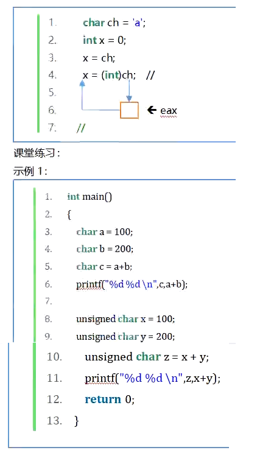
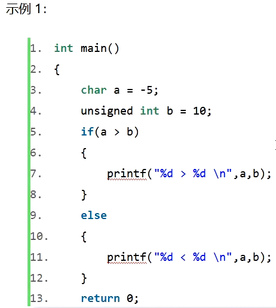
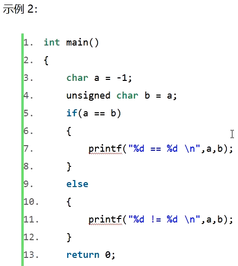
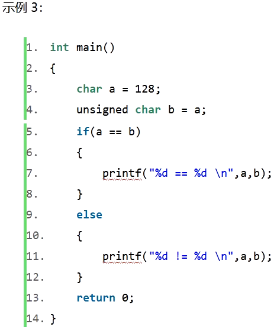
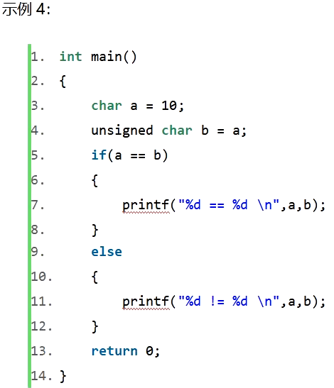

# 课件











# 二进制

二进制怎么转换为十进制？`0101  ->  5`

```
次数：  3  2  1  0
权值：  0  1  0  1
  0 + 1 * 2^2 + 0 + 1 * 2^0
= 0 +   4     + 0 +    1
= 5
```

十进制怎么转换为二进制？`5   ->  101`

```
    2  | 5                     
       ---------               _
      2  | 2   ......     1   /|\    后3位
         ---------             |
        2  | 1   .....    0    |     后2位
            -------            |
              0   ......  1    |     后1位
```

## 负数怎么表示

以下均是在4位机下讨论

负5？

`5 + x = 0 -> 0101 + x = 0 -> 0101 + 1010 = 1111, 1111 + 1 = 0, x = 1010 + 1 = 1011`

负数用补码表示，是原码的反码加1。

负8？

先求8的原码的反码，再加1：`8: 1000 -> 0111 + 1 -> 1000`

负8的补码居然是它自己？

搞了半天发现，我们一开始就说明了，在4位机下讨论，那么有符号数的范围只有`-8 ~ 7`，根本就不存在8一说。所以，无法求得8的原码，也因此无法求8的补码。（为什么1000不能代表8的原码？因为有符号数中第一位代表符号位！）

## 16进制

```
    0101 1100
     5    C
   => 0x5C
```

数字字面常量的规则：只要第一位是数字，那么代表这是个数字。而0开头的数字，不带x的是8进制（`0___`），带x的是16进制（`0x___`），带b的是2进制（`0b___`）。

16进制的格式化输出的描述符为`%x`，代表`unsigned hexadecimal integer`，是无符号十六进制整型。

```c
int main()
{
    unsigned char ucVal = 0x5cu;//0x5c是数字，u是无符号指示
    printf("%hhu\n", ucVal);    //92
    printf("%hhx\n", ucVal);    //5c
}
```

### 8进制

8进制的格式化输出的描述符为`%o`，代表`unsigned octal`，是无符号8进制数。

```
    01 011 100
     1   3   4
   => 0134
```

```c
int main()
{
    unsigned char ucVal = 0134u;//0134是数字，u是无符号指示
    printf("%hhu\n", ucVal);    //92
    printf("%hho\n", ucVal);    //134
}
```

### 2进制

输出2进制：需要把C语言设置为17标准。

2进制没有格式化输出的描述符。

```
       0101 1100
 => 0b 0101 1100
```

```c
int main()
{
    unsigned char ucVal = 0b0101'1100u; // '为分割符号，便于人性化输入，可有可无
    printf("%hhu\n", ucVal);    //92
    printf("%hho\n", ucVal);    //134
}
```
# integer

32 bits, 4 Bytes

1. 区分有符号、无符号，其中有符号的`signed`可以省略；无符号带int的整型的int可以省略，其他无符号整型不能省；long int中的int可以省略
2. 字面常量（8、8u）也是有类型的，不带后缀默认是有符号数，带u是无符号数。

## long int

ISO标准中提到，long int的大小不得小于int。目前微软long int的大小为32bits、4字节；而在Linux下为64bits、8字节。

long指示类型的长度，涉及到长度，格式化输出时，需要注意加上length specifiers，即长度描述符。

## long long int

64bits、8字节

## short int

16bits、2字节

针对于整型字面常量的长度描述符没有专门用于short的，因为C语言字面常量最小为32位。如果比32位小的，一律向下兼容。归根结底是因为数据总线最少一次传32位。

但是，针对于printf中的格式化输出，还是要区分长度的，对应short的长度描述符为h。

## char

如果要打印十进制整数，那么对应char的长度描述符为`hh`。格式描述符为`i`或`u`。

而如果要打印字符，那么对应的格式描述符为`c`。

ASCII码：形式上是字符图形，但本质上是整数，如`'a'`是97。

## 整型类测试

```c
int main()
{
    /* integer: 32bits */
    /*signed*/ int iVal = 8;
    unsigned /*int*/ uVal = 8u;
    printf("%i\n", iVal);
    printf("%u\n", uVal);
    /* long int: 32bits */
    /*signed*/ long /*int*/ lVal = 9l;
    unsigned long /*int*/ ulVal = 9ul;
    printf("%li\n", lVal);
    printf("%lu\n", ulVal);
    /* long long int: 64bits */
    /*signed*/ long long /*int*/ llVal = 9ll;
    unsigned long long /*int*/ ullVal = 9ull;
    printf("%lli\n", llVal);
    printf("%llu\n", ullVal);
    /* short int: 16bits */
    /*signed*/ short /*int*/ sVal = 9; //9后面没有专门用于short的长度指示符
    /*unsigned*/ short /*int*/ usVal = 9u;
    printf("%hi\n", sVal);             //但是格式化输出有，要加上h
    printf("%hu\n", usVal);
    /* char: 8bits */
    /*signed*/ char cVal = 9;
    unsigned char ucVal = 9u;
    printf("%hhi\n", cVal);
    printf("%hhu\n", ucVal);
    unsigned char ucVal2 = 'a';
    printf("%c\n", ucVal2);
}
```

# 浮点型

计算机中整型和浮点型的计算是在不同的处理器下完成的。整型处理器是由x86部分完成的，浮点型处理器是由x87部分完成的。因为整型和浮点型的格式是不一样的。

> 小数默认都是有符号数。

1010.1101二进制小数化为十进制小数。依然按照每一位的权重展开计算：
$$
\begin{align}
& 1\times2^3+0\times2^2+1\times2^1+0\times2^0+1\times2^{-1}+1\times2^{-2}+0\times2^{-3}+1\times2^{-4}\\
& =8+2+\frac{1}{2}+\frac{1}{4}+\frac{1}{16}\\
& =10.8125
\end{align}
$$
10.8125十进制小数如何化为二进制小数？整数部分是一直进行余2运算，而小数部分如何化？即0.1101。
$$
\begin{align}
0.8125\times2&=1.625\cdots1\\
0.625\times2&=1.250\cdots1\\
0.25\times2&=0.500\cdots0\\
0.5\times2&=1.000\cdots1\\
&end
\end{align}
$$
与求整数的二进制不同，求余之后，整数二进制的结果从下往上顺位。而小数二进制是从上往下顺位。

0.13化为二进制小数时会遇到无限循环的现象：
$$
\begin{align}
0.13\times2&=0.26\cdots0\\
0.26\times2&=0.52\cdots0\\
0.52\times2&=1.04\cdots1\\
0.04\times2&=0.08\cdots0 -- cycle\\
0.08\times2&=0.16\cdots0\\
0.16\times2&=0.32\cdots0\\
0.32\times2&=0.64\cdots0\\
0.64\times2&=1.28\cdots1\\
0.28\times2&=0.56\cdots0\\
0.56\times2&=1.02\cdots1\\
0.02\times2&=0.04\cdots0\\
0.04\times2&=0.08\cdots0 -- cycle\\
&\cdots
\end{align}
$$

## float（单精度）

全称：single point float，单精度浮点数。32 bits, 4 Bytes

格式描述符用`f`。代表十进制浮点数（Decimal floating point）

```c
int main()
{
    float fVal = 5.0f;   //加f后缀指示其为float类型字面常量
    printf("%f\n", fVal);
}
```

## double（双精度）

全称：double point float，双精度浮点数。64 bits, 8 Bytes

格式描述符也是用`f`。代表十进制浮点数（Decimal floating point）

```c
int main()
{
    double dVal = 5.0;  //字面小数常量不加后缀，默认为double类型
    printf("%f\n", dVal);
}
```

## long double

Modern Cpp和新的C标准才有的。标准指出long double长度不得小于double。在微软编译器下等于double长度，有些编译器是大于double长度的。为什么微软如此保守呢？因为CPU的字长一般还是64位。如果大小设计超过64位的话，就需要两个时钟周期来完成数据的传输。

需要注意，long double的格式描述符依旧为`f`，`%`后面的长度描述符不再是`l`而是大写的`L`。而字面常量的后缀还是小写的`l`。

```c
int main()
{
    long double ldVal = 5.0l; // 加l后缀
    printf("%Lf\n", ldVal);   // 加L前缀，格式描述符
}
```

## 科学计数法

651.32怎么表示（字面常量）？

1. `651.32`
2. `6.52132e+2`，其中`+`可以省略

科学计数法的格式描述符为`e`或`E`。表示：Scientific notation (mantissa/exponent), lowercase/uppercase

0.065132呢？`6.5132e-2`

```c
int main()
{
    double dVal = 6.52132e+2;
    printf("%f\n", dVal); // 652.132000
    printf("%e\n", dVal); // 6.521320e+02
    printf("%E\n", dVal); // 6.521320E+02
}
```

## float内存结构（IEEE754标准）

IEEE754标准。所有处理器，无论手机上的ARM架构还是服务器处理器都是遵循这个标准。

三部分：sign（符号位）、exponent（指数）、mantissa（底数）
### sign（符号位）
sign（符号位） - 1 bit - 1代表负，0代表正
### exponent（指数）

首先，指数是一个有符号数。
负数，是补码表达的。八位二进制来说，0000 0000表示0，则 1111 1111表示-1，1000 0000表示-128，0111 1111表示127，这是有符号正数的最大值，再加1就溢出了。本来的范围是：`-128 ~ 127`
但是，浮点数中指数位置存储的是偏移值，如果是float，存储的值是加了127的。因此，指数为1时，应该存储`1 + 127 = 128`，存储`1000 0000`；指数为2时，应该存储`2 + 127 = 129`，存储`1000 0001`。因此，加127后，范围就变成了：`-1 ~ 254`。
而指数全0、全1，在浮点数中有特殊含义。所以，范围就变成了：`1 ~ 254`。减去127之后，实际的范围就变成了：`-126 ~ 127`。

举一个例子：`7.25`怎么表示？先转化为二进制：`0111.01`，带权的形式则是：`1.1101 * 2^2`，即右移2位，指数为2。
实际存储的二进制形式：
```
0     1000 0001            (1)110 1000 0000 0000 0000 0000`
符   指数位（2+127=129）    底数位（23位）前面有个隐藏的1，不在这23位中
```

exponent（指数） - 8 bits - 标准里规定：

在exp位模式（the bit pattern of exp）既不全为0，也不全为1时，浮点数值为**规格化的值**。
阶码字段在这种情况下，被解释为以偏置（biased）形式表示的**有符号整数**（原文：the exponent field is interpreted as representing a signed integer in *biased* form）。
那么，阶码字段的值为：$E = e - Bias$。
其中$e$是无符号数，即直接通过exp位模式计算得出。
$Bias$是一个固定值$2^{k-1}-1, k = exp的位数, 单精度下是8位, 双精度下是11位$。比如，float，指数二进制位数为8位时，Bias就是128-1=127。
单精度下$Bias=2^7-1=127$。
因此$E$范围：$(1-127)\sim(254-127)=-126\sim127$，表示在2进制下可以右移127位、左移126位。
e和最终的移位值之间的对应关系：`1 = -126`、`2 = -125`，...，`253 = 126`、`254 = 127`。

> 由此，看出，不能简单地把exp位模式看做有符号数直接计算得到移位数值，如果直接当做有符号数计算的话，范围变成了：`1000'0000 ~ 0111'1111 = -128 ~ 127`。和标准规定的对应不上！

为什么要预留出来exp位模式全0或全1的情况？
1. **全0是为了能让浮点数可以表示0或者表示非常接近于0.0的数**。此情况在标准中称为：“**非规格化**的值”。这种情况下，阶码值（移位值）规定为$E=1-Bias$。并且要特别注意：底数的值是位模式直接计算出来的，也就是小数字段的值，不包含隐含的开头的1。即：`0.XXXX`，不再是`1.XXXX`！

>使阶码值为$1-Bias$而不是简单的$-Bias$​似乎是违反直觉的。但是这种方式提供了一种从非规格化值平滑转换到规格化值的方法。

2. 非规格化数有两个用途。首先，它们提供了一种表示数值0的方法，因为使用规格化数，我们必须总是使$M\geq1$，因此就不能表示0。实际上，$+0.0$的浮点表示的位模式为全0：符号位是0，阶码字段全为0（表明是一个非规格化值），而小数域也全为0，这就得到$M=f=0$。令人奇怪的是，当符号位为1，而其他域全为0时，我们得到值$-0.0$。根据IEE的浮点格式，值$+0.0$和$-0.0$在某些方面被认为是不同的，而在其他方面是相同的。
3. 非规格化数的另外一个功能是表示那些非常接近于$0.0$的数。这提供了一种属性，称为逐渐溢出（gradual underflow），其中，可能的数值分布均匀地接近于$0.0$。而刚才提到的使阶码值为$1-Bias$而不是简单的$-Bias$，就是为这个做铺垫的！**详看CSAPP-3rd P80**。
4. 全1是为了能让浮点数表示
     1. 无穷大 - 底数全0时
     2. NaN - 底数非0时
### mantissa（底数）
4. mantissa（底数） - 23 bits - 范围、**精度**：$\lg 2^{24} \approx 7.2247$，即可以表示7位十进制数。
    1. 因为要用科学计数法，底数第一位必须是1，因此可以省略第一位。因此此处的23位可以表达24位二进制数。

7.25的IEEE754表示：

`0 1000'0001 110'1000'0000'0000'0000'0000`

## 浮点数的好处

1. 虽然精度小，但是可表示的范围大（指数的作用）。
2. 能表达实数（除了小数，也能表示整数、0）
3. 能表达NaN（Not A Number），0除以0的结果就是NaN。
    1. `0 1111'1111 100'0000'0000'0000'0000'0000`
4. 能表达正负inf（无穷大），比如1除以0。
    1. 正无穷：`0 1111'1111 000'0000'0000'0000'0000'0000`
    2. 负无穷：`1 1111'1111 000'0000'0000'0000'0000'0000`
## 怎么比较浮点数
### 首先是不带等号的大小判断（<、>）
- 对于 `a < b`、`a > b` 这种​**​大小关系比较​**​，通常可以​**​安全地直接使用运算符​**​。
- 因为即使存在微小的舍入误差，只要这个误差不足以改变大小关系的本质（即误差远小于 `a` 和 `b` 本身的差值），结果就是正确的。
- 判断 `a` 是否严格大于 `b` 时，应该使用 `a > b`，而不是 `!(a <= b)`（后者涉及相等判断，不精确）。
### 特殊值的比较
- 特殊值如 `NaN` (Not a Number) 与任何值（包括自己）比较，`==` 都返回 `false`，`!=` 都返回 `true`。必须用专门的函数检查：
    - Python: `math.isnan(x)`
    - C/C++: `isnan(x)` (来自 `math.h` 或 `cmath`)
    - Java: `Double.isNaN(x)` / `Float.isNaN(x)`
- 检查无穷大：
    - Python: `math.isinf(x)`
    - C/C++: `isinf(x)`
    - Java: `Double.isInfinite(x)` / `Float.isInfinite(x)`
### 涉及到两个浮点数是否相等时
**绝对不能直接用 `==` 或 `!=` 来判断两个浮点数是否“相等”！​**​ 
因为浮点数在计算机内部使用 IEEE 754 标准以二进制存储小数，很多十进制小数无法精确表示（例如 `0.1`），计算过程中也会积累微小的舍入误差。
正确的比较方法是​**​允许一定的误差范围（容差 epsilon）​**​：
1. ​**​检查近似相等 (Approximate Equality)：​**​
    - 计算两个浮点数 `a` 和 `b` 的绝对差值：`diff = abs(a - b)`
    - 定义一个非常小的正数作为容忍度 `epsilon`（例如 `1e-9`, `1e-12`, 具体值取决于你的精度要求）。
    - 如果 `diff <= epsilon`，则认为 `a` 和 `b` 在 `epsilon` 的误差范围内是“相等”的。
    - 但是这个容差是绝对容差，有缺陷，见下：
- **检查相对相等 (Relative Equality - 更稳健)：​**​
    - 当数值大小差异巨大时，固定绝对容差可能不合适（比如比较 1e9 和 1e9+1e-9 时差值很小，但比较 1e-9 和 2e-9 时用绝对容差 1e-9 会认为相等）。相对容差考虑数值的大小。
    - `rel_tol`: 相对容差（如 1e-5, 1e-9）
    - `abs_tol`: 绝对容差下限（保证接近零的数也能比较，例如设为 `1e-12`）

下面主要论述，为什么需要相对相等（使用相对容差）

直接使用绝对相等的容差（比如 `abs(a - b) <= 1e-9`）在大多数情况下是有效的。但是，它有一个显著的缺点：当比较的数值本身非常大或者非常小（靠近零）时，这个固定大小的绝对容差就显得不合理了。

1. ​**​问题场景一：数值巨大​**​
    
    - 例子：比较 `a = 1, 000, 000, 000 (1e9)` 和 `b = 1, 000, 000, 001 (1e9 + 1)`
    - 它们的绝对差是 `|a - b| = 1`。
    - 如果你设定的绝对容差 `epsilon = 1e-9`（即 0.000000001），那么 `1 > 1e-9`，程序会判断它们​**​不相等​**​。
    - 但直觉上，10亿和10亿零1之间的_相对误差_非常小（大约是 `1 / 1e9 = 1e-9`）。在很多科学计算或工程领域，这个精度已经足够了，我们可能希望认为它们_相对相等_。
    - ​**​结论：​**​ 当数值本身很大时，一个固定的小绝对容差过于严格，忽略了数值的量级。
2. ​**​问题场景二：数值极小（接近零）​**​
    
    - 例子：比较 `a = 0.000001 (1e-6)` 和 `b = 0.000002 (2e-6)`
    - 它们的绝对差是 `|a - b| = 0.000001 (1e-6)`。
    - 如果你设定的绝对容差 `epsilon = 1e-9`（即 0.000000001），那么 `1e-6 > 1e-9`，程序会判断它们​**​不相等​**​。
    - 但是，它们的相对差非常大（一个是另一个的两倍，相对误差高达 `1e-6 / 1e-6 = 1` 或 100%）。实际上，它们_不应_被看作是近似相等的。
    - ​**​结论：​**​ 当数值本身很小时，一个固定的小绝对容差又过于宽松，可能把差别很大的两个数判断为相等。
    - ​**​更麻烦的问题：比较接近零的数​**​
        - 例子：比较 `a = 0.000000001 (1e-9)` 和 `b = 0.000000002 (2e-9)`
        - 绝对差 `|a - b| = 1e-9`，如果我们设定的绝对容差也是 `1e-9`，那么程序会认为它们相等。
        - 例子：比较 `a = 1e-20` 和 `b = 2e-20`
        - 绝对差 `|a - b| = 1e-20`。一个合理的绝对容差（比如 `1e-9`）远远大于这个差值（`1e-9 > 1e-20`），所以程序也会认为它们相等。但从相对角度看，`b` 是 `a` 的两倍！
        - ​**​总结：​**​ 对于非常接近零的数，即使设置了一个看似很小的绝对容差，也可能过于宽松，无法反映数值之间的真实相对误差。这时甚至需要一个更小的、不切实际的绝对容差才能区分它们，而相对相等可以自然地处理这种情况（此时相对误差会很大）。

​**​相对相等的解决方案：引入相对容差​**​

相对相等的核心思想是：​**​判断两个数是否近似相等的标准，应该与它们自身的_大小_有关。​**​

1. ​**​核心公式：​**​
    
    `abs(a - b) <= max(rel_tol * max(|a|, |b|), abs_tol)`
    
    - `rel_tol`: ​**​相对容差（relative tolerance）​**​。这是一个很小的正数，表示你能接受的_最大相对误差_（例如 `0.01` 表示 1% 的相对误差，`1e-5` 表示 0.001% 的相对误差，`1e-9` 表示极小的相对误差）。这个值需要根据你的具体应用场景（你对精度的要求）来设定。
    - `abs_tol`: ​**​绝对容差下限（absolute tolerance）​**​。这也是一个很小的正数（例如 `1e-12`）。它的作用是确保当 `a` 和 `b` 都_非常非常接近零_时，公式仍然有效。
2. ​**​公式解读：​**​
    
    - `max(|a|, |b|)`: 取 `a` 和 `b` 的绝对值中较大的那个。这代表了参与比较的两个数在数值上的大致_量级（Scale）_。
    - `rel_tol * max(|a|, |b|)`: ​**​动态计算的相对容差​**​。这个容差会根据 `a` 和 `b` 的当前量级自动调整：
        - 当 `a` 和 `b` 很大时，这个值会变大，可以容忍较大的绝对差值（只要相对误差小）。
        - 当 `a` 和 `b` 很小时（但还没有小到必须依赖 `abs_tol`），这个值会变小，要求更小的绝对差值才能被视为相等。
    - `max( ..., abs_tol)`: 取 `动态计算的相对容差` 和 `abs_tol` 中​**​较大的那个​**​作为最终的容差阈值。
        - 当 `a` 和 `b` 远离零时，`动态计算的相对容差` 通常会远大于 `abs_tol`，所以`max` 的结果就是相对容差。
        - 当 `a` 和 `b` 非常接近零（或者其中一个为零）时，`动态计算的相对容差` (`rel_tol * max(|a|, |b|)`) 会变得非常小（接近于零）。如果此时没有 `abs_tol`，即使两个非常接近零但彼此不同的数（比如 `1e-20` 和 `2e-20`，差值 `1e-20`），也会因为 `1e-20` > `某个几乎为零的动态相对容差` (比如 `1e-9 * 2e-20 = 2e-29`) 而被错误地认为_不相等_（而实际上根据相对误差，它们差异很大）。更极端的是比较 `0` 和一个很小的数（比如 `1e-30`），`动态计算的相对容差` 会变成 `0`，没有 `abs_tol` 就无法进行有效比较。加入 `abs_tol` 提供了这个绝对下限。
        - `abs_tol` 就是为了确保在这种情况下，公式不会因为 `动态计算的相对容差` 太小而失效。它会提供一个最低限度的绝对容差保证（比如 `1e-12`）。如果 `|a - b| <= abs_tol`，即使 `a` 和 `b` 本身很小（导致 `rel_tol * max(|a|, |b|)` 更小），也能认为它们在绝对意义上足够接近零。
3. ​**​举例说明：​**​
    
    - ​**​情况一：大数值（相对容差主导）​**​
        - `a = 1e9`, `b = 1e9 + 1000` (`|a-b|=1000`)
        - 设 `rel_tol=1e-6`, `abs_tol=1e-9`
        - `max(|a|,|b|) ≈ 1e9`
        - `动态相对容差 = 1e-6 * 1e9 = 1000`
        - `max(1000, 1e-9) = 1000`
        - `1000 (|a-b|) <= 1000 (阈值)` → ​**​相对相等（成立）​**​
    - ​**​情况二：中等数值（相对容差主导）​**​
        - `a = 3.141592`, `b = 3.141593` (`|a-b|=0.000001`)
        - 设 `rel_tol=1e-6`, `abs_tol=1e-9`
        - `max(|a|,|b|) ≈ 3.1416`
        - `动态相对容差 ≈ 1e-6 * 3.1416 ≈ 3.1416e-6`
        - `max(3.1416e-6, 1e-9) ≈ 3.1416e-6`
        - `0.000001 (1e-6) ≈ 1e-6 < 3.1416e-6 (阈值)` → ​**​相对相等（成立）​**​
        - 注意：如果只用 `abs_tol=1e-9`，`1e-6 > 1e-9`，会被判为不相等。相对容差（`≈ 3e-6`）更合理。
    - ​**​情况三：小数值（绝对容差主导）​**​
        - `a = 1e-10`, `b = 2e-10` (`|a-b|=1e-10`)
        - 设 `rel_tol=1e-6`, `abs_tol=1e-12`
        - `max(|a|,|b|) = 2e-10`
        - `动态相对容差 = 1e-6 * 2e-10 = 2e-16` (非常小！)
        - `max(2e-16, 1e-12) = 1e-12` (因为 `1e-12` 远大于 `2e-16`)
        - `1e-10 (|a-b|) <= 1e-12`? ​**​1e-10 > 1e-12​**​ → ​**​不相等（成立）​**​
            - _解释：_ 虽然它们很小（都在 `1e-10` 量级），但`b`是`a`的2倍！相对误差极大。绝对容差 `1e-12` 无法容忍 `1e-10` 这么大的差，所以正确判定不相等。动态相对容差 `2e-16` 在这里太小而没起作用，`abs_tol` `1e-12` 提供了合适的判断依据。
    - ​**​情况四：非常接近零（绝对容差主导）​**​
        - `a = 0`, `b = 1.5e-12`
        - 设 `rel_tol=1e-6`, `abs_tol=1e-12`
        - `max(|a|,|b|) = 1.5e-12`
        - `动态相对容差 = 1e-6 * 1.5e-12 = 1.5e-18` (极其小！)
        - `max(1.5e-18, 1e-12) = 1e-12`
        - `1.5e-12 (|a-b|) <= 1e-12`? ​**​1.5e-12 > 1e-12​**​ → ​**​不相等（成立）​**​
        - _想让它被判定为接近零（相等）：_
            - 可以设置更大的 `abs_tol`，比如 `abs_tol=1.6e-12`
            - `1.5e-12 <= 1.6e-12` → ​**​相对相等（成立）​**​
    - ​**​情况五：相对容差和绝对容差都参与（通常发生在中等或较小数值）​**​
        - 公式选取两者中较大的作为最终容差，确保在两种标准中满足其一即可视为相等。

**在代码中使用：​**​

在 Python 中，推荐使用标准库 `math.isclose`：
```python
import math

if math.isclose(a, b, rel_tol=1e-9, abs_tol=1e-12):
    print("a and b are considered close")
```
- `rel_tol`：相对容差，通常 `1e-9` 是一个较高的精度要求，`1e-6` 或 `1e-3` 可能用于精度要求较低的领域。根据你的需求设定。
- `abs_tol`：绝对容差下限，通常设置为一个非常小的数（如 `0.0`， `1e-12`, `1e-15`），或者当你知道要处理接近零的数时，设置成一个合适的、比“显著差异”要小的值（例如，如果你的数据精度极限是 `1e-10`，`abs_tol=1e-12` 可能就太小了，需要设成 `1e-9` 或更大，但这时最好通过相对容差来覆盖非零区域）。 `abs_tol` 最主要的作用是确保 `a` 和 `b` 都接近零时比较逻辑仍然工作。

​**​总结：​**​

相对相等 (`abs(a - b) <= max(rel_tol * max(|a|, |b|), abs_tol)`) 是一种更​**​稳健（Robust）​**​的浮点数近似相等判断方法。它通过结合​**​相对容差​**​（`rel_tol`）来解决大数值比较的问题，以及​**​绝对容差下限​**​（`abs_tol`）来解决非常接近零的数值比较的问题，从而在各种不同的数值量级上提供更合理、更一致的比较结果。在复杂应用中，优先考虑使用相对相等而不是简单的绝对容差相等。
## 练习题

### CSAPP-3rd P93 2.84

```c
填写下列程序的返回值，这个程序测试它的第一个参数是否小于或者等于第二个参数。假定函数f2u返回一个无符号32位数字，其位表示与它的浮点参数相同。你可以假设两个参数都不是NaN。两种0，+0和一0被认为是相等的。
int float_1e(float x, float y){
unsigned ux=f2u(x);
unsigned uy=f2u(y);
/*Get the sign bits*/
unsigned sx=ux >>31;
unsigned sy=uy >>31;
/*Give an expression using only ux，uy，sx，and sy*/
return;
}
如果使用判断就比较简单，下面是不使用判断.
第一个参数是否小于等于第二个参数，将可能满足的情况（即会返回1的情况）进行分类处理。
情况一：两个参数相等且为0， 根据IEEE规则，0用Denormalized表示，且有+0(0x0)和-0(0x80000000)两种表示 所以通过左移一位来比较
==>ux << 1 == 0 && uy << 1 == 0
情况二：第一个参数为负(此时ux>>31为sx=0x1得到!sx=0) ，第二个参数为0或者正数(此时uy>>31为sy=0x0 !sy=1)
==>(sx && !sy)
反之，若第一个参数为正或者0， 第二个参数为负，这种情况肯定返回0，就不需要特殊处理。
情况三：两个参数都为正
==>(!sx && !sy && ux <= uy)
情况四：两个参数都为负，此时根据IEEE的定义 正数可以用无符号整数的升序进行排列（正数越大 无符号数越大） 负数可以用无符号整数的升序进行排列（负数越小，无符号数越大）
==>(sx && sy && ux >= uy)
四种情况或运算,满足一种就返回1。
```
### 讨论题
下列哪些浮点数是符合标准的？`1.e0`、`1.2e0`、`.2e0`、`123`、`1e0`、`2e4.2`、`1.2`、`.e5`
​​`2e4.2`：不符合​。指数部分 (`e4.2`) 包含了小数点 `.`。指数必须是一个​**​整数​**​（可正可负，如 `4`, `-2`, `+10`）。
`.e5`：​​不符合​。尾数部分 `.e5` 缺少有效的数字。前面只有小数点 `.` 而没有跟随任何数字。必须在小数点前后至少有一方包含数字（如 `.1`, `1.`, `1.2`, `1e5`）。
# 两道诡异的题目

```c
int main()
{
    char a = 100;
    char b = 200;
    char c = a + b;
    printf("%d %d\n", c, a+b);
}
//输出结果为44 44
```

a和b同为8位有符号整型类数据。直接加和，a+b等于300。a和b都是char型，最后得出的结果也是char型：因为溢出了8位的最大范围（0~255），所以需要模256，最终300转换后的结果等效于44。

44是存储在内存中的数据，最终显示给人类的还是44，因为44没有超过127，也就不用涉及到补码来表示负数。（反之的情况，如果模后的结果是128，则表示人类所看到的负数-128；如果模后的结果是255，则表示-1）

既然a和b都是char型，最后得出的结果也是char型，所以"c"和"a+b"两者代表的意义是一样的，最终都是char型下的44。于是输出结果为44。

上面的题目只是乐呵一下，下面的题目才诡异莫测，如果对计算机的底层运算法则、流程不详，那么是无法领会的。

```c
int main()
{
    unsigned char a = 100;
    unsigned char b = 200;
    char c = a + b;
    printf("%d %d\n", c, a+b);
}
//输出结果为44 300
```

我们默认我们在x86体系架构下的、字长为32位的环境下运行。根据微机原理x86的描述，我们的通用寄存器有`eax/ebx/ecx/edx`。其中低16位叫做`ax/bx/cx/dx`。再分，低16位中的高8位叫做`ah/bh/ch/dh`、低8位叫做`al/bl/cl/dl`。

经过测试，在VS2019编译器下，反汇编代码得出：`a+b`这个语句的运算首先要把a和b的值分别存放到寄存器`eax/ecx`中。注意：eax和ecx都是32位寄存器，**如果把a和b的值分别存放到寄存器eax/ecx中，意味着存放了原来的8位有效数据外，前面的24位都需要补位**，而无符号整型数据补前位时用0补位。
存数据之后，对两数的加操作是：`add eax,ecx`。**即加操作是在寄存器内累加的**。那么即使300超过了255，本应溢出的数据仍然能有效保存在寄存器eax中（即关键的第9位——"1"）。

接下来：

**对于`char c = a + b`;**，对c的赋值是通过eax赋值的，因为声明了c是有符号char型，赋值时存在隐形类型转换，即要进行隐式的切片操作，将切除前24位，留下后8位。所以：这里编译器只把低八位即AL赋给了c。因此，上述的eax寄存器中关键的第9位——"1"失效了，只保留了后八位，最终打印c的结果是44。


**对于`a + b`;**，a和b在eax寄存器中直接加和的结果是300，即使超过了255，本应溢出的数据仍然能有效保存在寄存器eax中（即关键的第9位——"1"）。而我们格式化控制的输出是`%d`，即我们要拿4个字节即**32位有符号整型**来识别内存的数据，**并在最后转为十进制数**，所以打印出来是300。（其实如果拿`%u`来打印更合适，即**32位无符号整型**来识别内存的数据，**并在最后转为十进制数**，最后打印出来也是300）

## 习题

```c
int main()
{
    char c = 128;
    unsigned char uc = 128;
    unsigned short us = 0;
    us = c + uc;
    printf("%x \n",us);//0
    
    us = (unsigned char)c+uc;
    printf("%x \n",us);//16:100->10:256
    
    us = c+(char)uc;
    printf("%x \n",us);//2:1111 1111 1000 0000+1111 1111 1000 0000=>(1) 1111 1111 0000 0000 -> 16:ff00
    
    //同us = c + uc;原理一样，都是相当于把c存放到16位ax寄存器中，自然需要补位，而c原本是有符号数，则补符号位"1"。
	//强转为(unsigned short)就表示存放到16位ax寄存器中。其实我们不用人为地显式写出"(unsigned short)"，因为c+uc肯定需要达到统一类型，自然要把char c隐式转为unsigned short，即无符号16位数据。
    us = (unsigned short)c+uc;
    printf("%x \n",us);//1111 1111 1000 0000+0000 0000 1000 0000=>(1) 0000 0000 0000 0000 =>0 -> 16:0
    
    return 0;
}//0 100 ff00 0
```


# 高超的技艺

```c
//最拉跨的
int Get1Bit(int x)
{
    int sum = 0;
    while(x)
    {
        if(x & 0x01)
        {
            sum += 1;
        }
        x = x >> 1;
    }
    return sum;
}
//面试宝典中
//老师不讲，学生永远不知道
int Get1Bit(int x)
{
    int sum = 0;
    while(x)
    {
        x = x &(x-1);
        sum+=1;
    }
    return sum;
}
//查表方案
int Get1Bit(int x)
{
    int ar[] = {0,1,1,2,1,2,2,3,1,2,2,3,2,3,3,4};
    int sum = 0;
    for(int i = 0;i<sizeof(x)*2;++i)
    {
        sum = sum + ar[x & 0x0f];
        x = x >> 4;
    }
    return sum;
}
```

这个减1就与原数按位与，每次都会少个1。


计算一个4字节整型的二进制格式中1的个数。

有一位图论的学生，面试时通过此题进入了腾讯。


# 断位

```c
struct Node
{
    char a:4;
    unsigned char b:3;
    
    unsigned char c:5;
};
int main()
{
    struct Node x={};
    x.a = 4;
    x.b = 2;
    x.c = 5;
}
```

# 刷题


```c
int getDecimalValue(struct ListNode* head)
{
    int res = 0;
    struct ListNode* p = head;
    while (p != NULL)
    {
        res = res << 1 | p->val;
        p = p->next;
    }
    return res;
}
```

