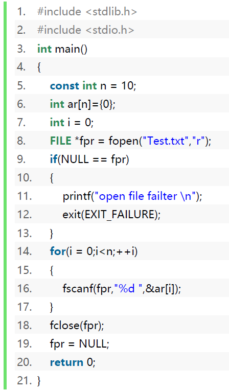

# 本章内容

1. C 语言中的文件是什么？
2. 流的概念及分类
3. 文本文件和二进制文件到底有什么区别
4. C 语言与文件读写
5. 缓冲和非缓冲文件系统
6. 文件的顺序读写
7. 文件的随机读写

重点掌握：第一，FILE，即文件结构体。第二，文件位置指针。

# C 语言中的文件是什么？

　　所谓文件（file）一般指存储在外部介质上数据的集合，比如我们经常使用的txt、bmp、jpg、exe、rmvb 等等。这些文件各有各的用途，我们通常将它们存放在磁盘或者可移动盘等介质中。
　　文件无非就是一段数据的集合，这些数据可以是有规则的集合，也可以是无序的集合。操作系统也就是以文件为单位对数据进行管理的。也就是说，要访问外部介质上的数据，必须先按照文件名进行查找，然后从该文件中读取数据。要想写数据到外部介质，必须得建立一个文件，然后再写入。因此，你眼前的文件只是数据的集合。

## 三要素：文件路径、文件名、后缀

　　由于在 C 语言中'\\'一般是转义字符的起始标志，故在路径中需要用两个'\\'表示路径中目录层次的间隔，也可以使用 '/' 作为路径中的分隔符。

　　例如: "D:\\\\tulun\\\\test.c"或者"D:/tulun/test.c"，表示文件 test.c 保存在 D 盘tulun 目录下；"tu.txt" 表示当前目录下的文件 tu.txt。

### 文件路径

* **以盘符开头的**，可以显式指出其绝对路径，如上面的”D:\\\\”或者”D:/”等。
* 如果没有显式指出其路径，默认为当前路径。也就是相对路径。

　　**数据的输入和输出几乎伴随着每个 C 语言程序，所谓输入就是从“源端”获取数据，所谓输出可以理解为向“终端”写入数据。**这里的源端可以是键盘、鼠标、硬盘、光盘、扫描仪等输入设备，终端可以是显示器、硬盘、打印机等输出设备。在 C 语言中，把这些输入和输出设备也看作“文件”。**要注意，我们所站的角度是执行程序的角度，以执行程序为主讨论输入输出**。

## C 语言文件系统中的类型

* FILE：对象类型，足以保有控制 C I/O 流所需的全部信息
* fpos_t：非数组完整对象类型，足以唯一指定文件的位置和多字节剖析状态

每个 FILE 对象直接或间接保有下列信息：

1. (C95)字符宽度：未设置、窄或宽。
2. (C95)多字节与宽字符间转换的分析状态（ mbstate_t 类型对象）
3. 缓冲状态：无缓冲、行缓冲、全缓冲。
4. 缓冲区，可为外部的用户提供缓冲区所替换。
5. I/O 模式：输入、输出或更新（兼具输入与输出）。
6. 二进制/文本模式指示器。
7. 文件尾指示器。
8. 错误状态指示器。
9. 文件位置指示器，可作为 fpos_t 类型对象访问，对于宽流包含剖析状态。
10. (C11)在多个线程读、写、寻位或查询流时避免数据竞争的再入锁。

## 预定义标准流

1. stdin 与标准输入流关联的 FILE\* 类型表达式
2. stdout 与标准输出流关联的 FILE\* 类型表达式（有缓冲区）
3. stderr 与标准错误输出流关联的 FILE\* 类型表达式（实际上和stdout一样，只不过无缓冲区）

## 宏常量

| 名称         | 描述                                      | 举例                    |
| ------------ | ----------------------------------------- | ----------------------- |
| EOF          | int 类型的负值整数常量表达式              | #define EOF (-1)        |
| FOPEN_MAX    | 能同时打开的文件数                        | #define FOPEN_MAX 20    |
| FILENAME_MAX | 保有最长受支持文件名所需的 char 数组大小  | define FILENAME_MAX 260 |
| BUFSIZ       | setbuf() 所用的缓冲区大小                 | #define BUFSIZ 512      |
| _IOFBF       | 指示全缓冲 I/O 的 setvbuf() 参数          | #define _IOFBF 0x0000   |
| _IOLBF       | 指示行缓冲 I/O 的 setvbuf() 参数          | #define _IOLBF 0x0040   |
| _IONBF       | 指示无缓冲 I/O 的 setvbuf() 参数          | #define _IONBF 0x0004   |
| SEEK_SET     | 指示从文件首开始寻位的 fseek() 参数       | #define SEEK_SET 0      |
| SEEK_CUR     | 指示从文件当前位置开始寻位的 fseek() 参数 | #define SEEK_CUR 1      |
| SEEK_END     | 指示从文件尾开始寻位的 fseek() 参数       | #define SEEK_END 2      |
| TMP_MAX      | tmpnam 所能生成的最大独有文件数           | #define TMP_MAX 32767   |
| TMP_MAX_S    | tmpnam_s 所能生成的最大独有文件数         |                         |
| L_tmpnam     | 保有 tmpnam 结果所需的 char 数组大小      |                         |
| L_tmpnam_s   | 保有 tmpnam_s 结果所需的 char 数组大小    |                         |

# 流的概念及分类

　　I/O 设备的多样性及复杂性，给程序设计者访问这些设备带来了很大的难度和不便。为此，ANSIC 的 I/O 系统即标准 I/O 系统（即“流”），把任意输入的源端或任意输出的终端，都抽象转换成了概念上的“标准 I/O 设备”或称“标准逻辑设备”。

　　流是一种抽象的概念，负责在数据的产生者和数据的使用者之间建立联系，并管理数据的流动。

　　**为什么如此设计：因为程序写出到的外部设备的种类很多，只需要一个统一的接口，使程序绕过具体设备，直接与该“标准逻辑设备”进行交互。**这样就为程序设计者提供了一个不依赖于任何具体 I/O 设备的统一的操作接口，通常把抽象出来的“标准逻辑设备”或“标准文件”称作“流”。**思想：适配器设计方案。**
　　把任意 I/O 设备，转换成逻辑意义上的标准 I/O 设备或标准文件的过程，并不需要程序设计者感知和处理，是由标准 I/O 系统自动转换完成的。故从这个意义上，可以认为任意输入的源端和任意输出的终端均对应一个“流”。

* 流按**方向**分为：输入流和输出流。从文件获取数据的流称为输入流，向文件输出数据称为输出流。
* 流按**数据形式**分为：文本流和二进制流。文本流是 ASCII 码字符（0 000 0000\~0  111 1111即0\~127）序列，而二进制流是字节序列。从某种意义上来说，文本流是一种特殊的二进制流。

图示：


# 文本文件和二进制文件到底有什么区别

https://www.zhihu.com/question/19971994/answer/17256634

https://www.zhihu.com/question/24662572/answer/28541822

https://zhuanlan.zhihu.com/p/51828216

根据文件中数据的组织形式的不同，可以把文件分为：文本文件和二进制文件。

* 文本文件：把要存储的数据当成一系列字符组成，把每个字符的 ASCII 码值存入文件中。每个 ASCII 码值占一个字节，每个字节表示一个字符。故文本文件也称作字符文件或 ASCII 文件，是字符序列文件。
* 二进制文件：把数据对应的二进制形式存储到文件中，是字节序列文件。


## 关于字符集的个人总结

理论上，文本文件可以看作特殊的二进制文件。

你比如说，图片和视频都是二进制文件，他们的区别就在于编码与解码的格式不同，比如某种图片以jpg格式打开，某种视频以mp4格式打开。

而文本文件同样可以类比，文本文件实际上就是二进制文件，只不过有好几种文本文件，有不同的编码和解码方式。比如汉字“我”在ASCII码中没有规定，而在GBK字符集的编码为：(CE D2)16，Unicode字符集的UTF-8方式编码为：(62 11)16。所以，不同格式的文本文件用不同的解码方式转换出来的文本就不一样。很容易就导致乱码现象的产生。而Unicode字符集规范了世界上所有地区的语言。

UTF-8（8位元，Universal Character Set/Unicode Transformation Format）是针对Unicode的一种可变长度字符编码。它可以用来表示Unicode标准中的任何字符，而且其编码中的第一个字节仍与[ASCII](https://baike.baidu.com/item/ASCII/309296)相容，使得原来处理ASCII字符的软件无须或只进行少部分修改后，便可继续使用。

# C 语言与文件读写，文件库函数stdio.h

链接： http://www.cplusplus.com/reference/cstdio/

C 语言操作文件分为三步

1. 打开文件
2. 读写文件
3. 关闭文件

## 打开文件fopen

FILE \* fopen ( const char \* filename, const char \* mode );

### 函数参数

| 参数名   | 描述                                                         |
| -------- | ------------------------------------------------------------ |
| filename | 文件名，包括路径，如果不显式含有路径，则表示当前路径。例如，“D:\\text.txt”表示 D 盘根目录下的文件 text.txt 文件。“tulun.txt”表示当前目录下的文件 tulun.txt |
| mode     | 文件打开模式，指出对该文件可进行的操作。常见的打开模式如 "r" 表示只读，"w" 表示只写，"rw" 表示读写，"a" 表示追加写入。**注意，" "代表一个字符串，不是字符。** |


虽然fopen以写方式打开文件时，若文件不存在可以创建新文件后写入，但只是针对存在的目录而言的，如果前面的目录位置不存在，是不会给你创建文件夹的。比如fopen("D:/yhp.txt","w");是可以的。而fopen("D:/yhp/yhp.txt","w");在D:/yhp目录不存在时将无法创建yhp.txt，并且返回空指针。


### 返回值

| 状态     | 返回值                           |
| -------- | -------------------------------- |
| 打开成功 | 返回该文件对应的 FILE 类型的指针 |
| 打开失败 | 返回 NULL                        |

根据返回值表，需定义 FILE 类型的指针变量，保存该函数的返回值。可根据该函数的返回值判断文件打开是否成功。

### 写入文件-代码案例

```c
#include<stdio.h>
int main()
{
    //第一部分代码-打开文件
    FILE* fp = NULL;
    fp = fopen("yhping","w"); //与malloc类似，要从系统里申请文件资源。如果没有申请到，则返回空。
    if(NULL==fp)
    {
        printf("file open error\n");
        return 1;
    }
    
    //第二部分代码-定义数据
    int ar[10]={12,23,34,45,56,67,78,89,90,100};
    int n = sizeof(ar)/sizeof(ar[0]);
    
    //第三部分代码-写数据到文件
    for(int i= 0;i<n;++i)
    {
        //printf("%d ",ar[i]);		//默认写到stdout，等效于fprintf(stdout, "%d ", ar[i]);
        fprintf(fp, "%d ", ar[i]);	//写到fp中，但是只是写到了缓冲区，还没写到磁盘中。内部还要调用itoa函数，把整型转换为字符串（ASCII码串）
    }
    
    //第四部分代码-善后处理
    fclose(fp);//不仅把文件流对象资源归还系统，还把缓冲区的数据输出到文件中。之后，fp指针就失效了，记得free
    free(fp);
    
    return 0;
}
```

注意观察FILE结构体的cnt信息，写了第一个数加一个空格后，cnt由4096减去了3。


两种缓冲区：

1. 全缓冲区——缓冲区满后写到磁盘。
2. 行缓冲区——遇到\\n写到磁盘。
3. 无缓冲区——不经过缓冲区，直接把文件流写入到磁盘中。

### 读出文件-代码案例

```c
int main()
{
    //1.
    FILE* fp = fopen("yhp.txt","r");
    if(NULL==fp)
    {
        return 1;
    }
    //2.
    int ar[10]={};
    
    //3.
    for(int i = 0;i<10;++i)
    {
        fscanf(fp,"%d",&ar[i]);//内部调用atoi(),把字符串转换为整型数据
    }
    //4.
    fclose(fp);
    fp = nullptr;
}
```

注意观察FILE结构体cnt的信息，原本"12 23 34 45 56 67 78 89 90 100 "十个数据加上十个空格，不包括'\\0'的长度为9\*2+3+10=31。当我们读出了1个数据后，（没读空格），31减去了2变为了29。


#### 回忆知识

三种scanf：

1. scanf是从标准输入设备读出
2. sscanf是从输入缓冲区（buff字符串）中读出
3. fscanf是从指定文件中读出

## 关闭函数fclose

int fclose (FILE \* stream);

### 函数参数

| 名称  | 描述                   |
| ----- | ---------------------- |
| strem | 指向要关闭流对象的指针 |

### 返回值

| 状态         | 返回值      |
| ------------ | ----------- |
| 流被成功关闭 | 返回0 值    |
| 失败         | 返回EOF(-1) |

即使调用失败，作为参数传递的流将不再与文件或其缓冲区关联。

## 字符串格式化函数sprintf

int sprintf (char \* str, const char \* format, ... );

### 函数参数

| 参数名 | 描述                                                         |
| ------ | ------------------------------------------------------------ |
| str    | 指向缓冲区指针，缓冲区足够大                                 |
| format | 格式化字符串，该字符串遵循与printf 中的格式相同的规范        |
| ...    | 附加可变参数。 根据格式化字符串的不同，函数可能需要一系列附加参数，每个参数都包含一个值，用于替换格式字符串中的格式说明符。 |

### 返回值

如果成功，将返回写入的字符总数。此计数不包括自动附加在字符串末尾的额外空字符。失败返回负数。


注意： Windows OS 上的 C 流在输出时将 '\\n' 转换为 '\\r\\n' ，输入时将 '\\r\\n' 转换为 '\\n' 。

## 格式化写入函数

int fprintf ( FILE \* stream, const char \* format, ... )；


## 从流中读取格式化数据函数

int fscanf ( FILE \* stream, const char \* format, ... );

### 函数参数

| 参数名 | 参数描述                                               |
| ------ | ------------------------------------------------------ |
| stream | 指向文件对象的指针，该对象标识要从中读取数据的输入流。 |
| format | 格式化字符串，该字符串遵循与scanf 中的格式相同的规范。 |

### 返回值

| 状态                                                         | 值                                                           |
| ------------------------------------------------------------ | ------------------------------------------------------------ |
| receiving arguments successfully assigned. 传入的参数输入成功，匹配成功。 | Number of receiving arguments successfully assigned. 成功赋值的接收参数的数量 |
| in case a matching failure occurred before the first receiving argument was assigned. 输入成功，但传入的参数第一次就匹配失败了 | 0                                                            |
| if input failure occurs before the first receiving argument was assigned | EOF（-1）                                                    |

## 二进制文件的读写

### （字节）块数据写入函数

`size_t fwrite ( const void * ptr, size_t size, size_t count, FILE * stream );`

将内存中数组的内容写到文件中。功能类似于`fprintf`

#### 函数参数

| 参数名 | 参数描述                                                     |
| ------ | ------------------------------------------------------------ |
| buffer | 指向将要**被写出**到文件里的元素数组的指针                   |
| size   | 这是要**被写出到文件里**的每个元素的大小，以字节为单位。     |
| count  | 这是**要写的**总共的元素个数，每个元素的大小为 size 字节。   |
| stream | 这是指向 FILE 对象的指针，该 FILE 对象指定了一个输出流（相对内存而言，输出到文件的流）。 |

#### 返回值

返回成功地被写出的元素的个数，如果出现错误，可能比count小。
如果传入的参数size 或count 为零，fwrite返回0且不做任何动作。

### 块数据读出函数

`size_t fread ( void * ptr, size_t size, size_t count, FILE * stream );`

#### 函数参数

| 参数名 | 参数描述                                                     |
| ------ | ------------------------------------------------------------ |
| buffer | 指向大小至少为（size\*count）字节的内存块的指针，从流中读出的数据存储到buffer指向的内存。 |
| size   | 读取元素的大小，unsigned int。                               |
| count  | 被读取元素的个数                                             |
| stream | 是指向 FILE 对象的指针，该 FILE 对象指定了一个输入流（相对内存而言的，从外部的文件输入到内存中）。 |

#### 返回值

返回成功被读取的元素个数count，若出现错误或到达文件末尾，则可能小于count。
如果传入的参数size 或count 为零，fread返回0且不做任何动作。
fread 不区分文件尾和错误，因此调用者必须用feof 和ferror 才能判断发生了什么。

### 二进制方式-代码案例

注意，不仅要打开时按照wb打开，还要把读写函数改为fwrite和fread

```c
#include<stdio.h>
int main()
{
    int ar[10]={12,23,34,45,56,67,78,89,90,100};
    int n = sizeof(ar)/sizeof(ar[0]);
    FILE* fp = NULL;
    fp = fopen("yhpBin.txt","wb"); //与malloc类似，要从系统里申请文件资源。如果没有申请到，则返回空。
    if(NULL==fp)
    {
        printf("file open error\n");
        return 1;
    }
    
    fwrite(ar,sizeof(int),n,fp);	//专门写入二进制文件
    
    fclose(fp);//不仅把文件流对象资源归还系统，还把缓冲区的数据输出到文件中。之后，fp指针就失效了，记得free
    free(fp);
    
    return 0;
}
//通过记事本打开文件，发现显示的是：□ □ - 8 C N Y Z d 。通过观察，发现正好对应于各自的ASCII码值"\12 \23 \34 \45 \56 \67 \78 \89 \90 \100 "
```

因为我们是用记事本打开的（系统自动解析为UTF-8编码），**系统对这些数据的处理是按照ASCII码处理的**。所以出现了以下的情况！


每个int型数据占据了4字节。我们输入的数据都没有用到第二个字节，则正好限制在了0~127这个ASCII码区间内，12和23表示控制符，显示不出来，故显示为□。剩下的00通过文本格式解码变成了空格。


```c
int main()
{
    int ar[10]={};
    FILE* fp = fopen("yhpBin.txt","rb");
    if(NULL==fp)
    {
        return 1;
    }
    
    fread(ar,sizeof(int),n,fp);//从fp读出数据到ar数组中
    
    fclose(fp);
    fp = nullptr;
}
```

### 总结

二进制读写（fwrite和fread）是按着把数据“本该在内存中的样子”原封不动地存入到文件中。

# 缓冲和非缓冲文件系统

在ANSI C 标准中，使用的是“缓冲文件系统”。

所谓缓冲文件系统指系统自动地在内存为每一个正在使用的文件名开辟一个缓冲区，从内存向磁盘输出数据必须先送到内存中的缓冲区，装满后再一起送到磁盘去。反向也是如此。

## vs2012中的FILE 结构体


## 写数据


## 读数据


## fflush
```cpp
int fflush( FILE *stream);
```
### 功能

清除读写缓冲区，在需要立即把输出缓冲区的数据进行物理写入时。
### 函数说明

如果指针指向一个输出流或者是一个最近的一次操作不是输入的更新流，输出刷新将会创造任意未写入的数据给将要被写入文件的流和最近的数据被修改流，并且最后的文件状态改变应该被标记为更新的基础文件的时间戳。
对于打开以使用基础文件描述进行读取的流，如果文件尚未处于EOF，并且该文件是能够搜索的文件，则基础打开文件描述的文件偏移量应设置为流的文件位置，并且任何未被从流中读取的`ungetc（）`或`ungetwc（）`推回到流上的字符都将被丢弃（不再进一步改变文件偏移量）。
如果stream 是空指针，则fflush()将对上面定义了行为的所有流执行此刷新操作。

### 返回值

如果成功刷新，fflush 返回0。指定的流没有缓冲区或者只读打开时也返回0 值。返回EOF 指出一个错误。

### 注意

如果fflush 返回EOF,数据可能由于写错误已经丢失。当设置一个重要错误处理器时,最安全的是用setvbuf函数关闭缓冲或者使用低级IO例程,如open、close 和write 来代替流I/O 函数。

### 其他用法

`fflush(stdin)`刷新标准输入缓冲区，把输入缓冲区里的东西丢弃[非标准]
`fflush(stdout)`刷新标准输出缓冲区，把输出缓冲区里的东西打印到标准输出设备上

### 注意事项

C 和`C++`的标准里从来没有定义过`fflush(stdin)`。也许有人会说：“可是我用`flush(stdin)`解决了这个问题，你怎么能说是错的呢？”的确，某些编译器（如VC6）支持用 `fflush(stdin)`来清空输入缓冲，但是并非所有编译器都支持这个功能（linux 下的gcc 就不支持），因为标准中根本没有定义`fflush(stdin)`。MSDN 文档里也清楚地写着：fflush on input stream is an extension to the C standard （fflush 操作输入流是对C 标准的扩充）。
以下是 C99 对 fflush 函数的定义：
`int fflush(FILE *stream);`
如果stream 指向输出流或者更新流（update stream），并且这个更新流最近执行的操作不是输入，那么fflush函数将把任何未被写入的数据写入stream 指向的文件（如标准输出文件stdout）。否则，fflush 函数的行为是不确定的。`fflush（NULL）`清空所有输出流和上面提到的更新流。如果发生写错误，flush 函数会给那些流打上错误标记，并且返回EOF，否则返回0。
由此可知，如果 stream 指向输入流（如 stdin），那么 fflush 函数的行为是不确定的。故而使用`fflush(stdin)`是不正确的。

## setbuf
```cpp
void setbuf( FILE *stream, char *buffer );
```
### 功能

设置用于流操作的内部缓冲区。其长度至少应该为 BUFSIZ 个字符。
若 buffer 非空，则等价于`setvbuf(stream, buffer, _IOFBF, BUFSIZ)`
若 buffer 为空，则等价于`setvbuf(stream, NULL, _IONBF, 0)`，这会关闭缓冲。

### 参数

stream :要设置缓冲区的文件流
buffer:指向文件流所用的缓冲区的指针。若提供空指针，则关闭缓冲。

### 返回值

无

### 注解

若 BUFSIZ 不是适合的缓冲区大小，则能用 setvbuf 更改它。
setvbuf 亦应当用于检测错误，因为 setbuf 不指示成功或失败。
此函数仅可在已将 stream 关联到打开的文件后，但要在任何其他操作（除了对 setbuf/setvbuf 的失败调用）前使用。

一个常见错误是设置 stdin 或 stdout 的缓冲区为生存期在程序终止前结束的数组：

```c
int main(void) {
char buf[BUFSIZ];
setbuf(stdin, buf);
} // buf 的生存期结束，未定义行为
```

示例

```c
int main()
{
	char buff[256];
	int a = 10, b = 20;
	FILE *pf = fopen("yhp.txt","w");
	setbuf(pf,buff);
	fprintf(pf,"a = %d b = %d \n",a,b);
	fclose(pf);
	pf = NULL;
	return 0;
}
```

## setvbuf
```cpp
int setvbuf( FILE * stream, char * buffer, int mode, size_t size );
```
以 mode 所指示值更改给定文件流 stream 的缓冲模式。另外，
▪ 若 buffer 为空指针，则重设内部缓冲区大小为 size 。
▪ 若 buffer 不是空指针，则指示流使用始于 buffer 而大小为 size 的用户提供缓冲区。必须在 buffer 所指向的数组的生存期结束前（用 fclose ）关闭流。成功调用 setvbuf 后，数组内容不确定，而任何使用它的尝试是未定义行为。
### 参数

stream：要设置缓冲的文件流
buffer：指向要使用的流缓冲区的指针，或若仅更改大小和模式则为空指针
mode：使用的缓冲模式。它能是下列值之一：

1. \_IOFBF: 全缓冲，当缓冲区为空时，从流读入数据。或者当缓冲区满时，向流写入数据。
2. \_IOLBF: 行缓冲，每次从流中读入一行数据或向流中写入一行数据。
3. \_IONBF: 无缓冲，直接从流中读入数据或直接向流中写入数据，缓冲设置无效。

size：缓冲区的大小

### 返回值

成功时为0，失败时为非零。

### 注意

此函数仅可在已将 stream 关联到打开的文件后，但要在任何其他操作（除了对 setbuf/setvbuf 的失败调用）前使用。不是所有 size 字节都需要用于缓冲：实际缓冲区大小通常向下取整到 2 的倍数、页面大小的倍数等。
多数实现上，行缓冲仅对终端输入流可用。
一个常见错误是设置 stdin 或 stdout 的缓冲区为生存期在程序终止前结束的数组：

```c
int main(void) {
char buf[BUFSIZ];
setbuf(stdin, buf);
} // buf 的生存期结束，未定义行为
```

期待默认缓冲区大小 BUFSIZ 为实现上文件 I/O 的最高效缓冲区大小，但 POSIX fstat 经常提供更好的估计。

# 文件位置

| 函数名  | 描述                                   |
| ------- | -------------------------------------- |
| ftell   | 返回当前的文件位置指示值               |
| fgetpos | 获取文件位置指示器                     |
| fseek   | 将文件位置指示符移动到文件中的指定位置 |
| fsetpos | 将文件位置指示器移动到文件中的指定位置 |
| rewind  | 将文件位置指示器移动到文件首           |

## 当前的文件位置
```cpp
long ftell(FILE *stream);
```

注：long占四个字节，范围为`-2^31~2^31-1`。实际上和int一样。因为int当年有时是占两个字节，所以出现了long。而后来int也变为4了，long没变。

返回stream的**文件位置指示值**。
若流以二进制模式打开，则由此函数获得的值是从文件开始的字节数。
若流以文本模式打开，则由此函数返回的值未指定，且仅作为 `fseek()` 的输入才有意义。

### 参数

stream：要检验的文件流

### 返回值

成功时为文件位置指示器，若失败发生则为 `-1L` 。失败时，设 errno 对象为实现定义的正值。

```c
int main()
{
    int ar[]={12,23,34,45,56,67,78,89,90,100};
    int n = sizeof(ar)/sizeof(ar[0]);
    FILE* pf = NULL;
    //pfa = fopen("yhp.txt","w");//VS2019中不能运行
    erron_t tag = fopen_s(&pf,"yhp.txt","w");//此时pfa指针就指向了系统产生的一个文件流对象。那么对文件流对象的操作就可以间接操作磁盘中的数据。文件流对象内部包含缓冲区。//"a"代表追加写入，并且找不到文件时主动创建。
    if(NULL==pfa)
    {
        printf("open file error: %d\n",tag);
        exit(EXIT_FAILURE);
    }
    
    long pos;
    for(int i=0;i<n;++i)
    {
        pos = ftell(pf);
        printf("%d ",pos);
        fprintf(pf,"%5d",ar[i]);
        //pos从0开始，每次调用一次fprintf后pos都会加5
        //即屏幕输出0 5 10 15 20 ...
    }
    fclose(pf);
    pfa = NULL;
    return 0;
}
```

## fgetpos
```cpp
int fgetpos(FILE * stream, fpos_t * pos );
```

注：`fpos_t`是`__int`类型，即64位整型。在32位机中，用这种表示64位整型数据，而在C99后新增了long long类型，实际上和`__int`一样。只是不同编译器环境下效果不同。
关于C语言中long long与`__int64`的区别：http://c.biancheng.net/cpp/html/2975.html

获得文件流 stream 的文件位置指示器和当前分析状态（若存在），并将它们存储于 pos 所指向的对象。存储的值仅在作为 fsetpos 的输入的情况有意义。

### 参数

stream 要检验的文件流
pos 指向要存储文件位置指示器到的 fpos_t 对象的指针

### 返回值

成功时为0，否则非零值。

```c
int main()
{
    int ar[]={12,23,34,45,56,67,78,89,90,100};
    int n = sizeof(ar)/sizeof(ar[0]);
    FILE* pf = NULL;
    //pfa = fopen("yhp.txt","w");//VS2019中不能运行
    erron_t tag = fopen_s(&pf,"yhp.txt","a");//此时pfa指针就指向了系统产生的一个文件流对象。那么对文件流对象的操作就可以间接操作磁盘中的数据。文件流对象内部包含缓冲区。//"a"代表追加写入，并且找不到文件时主动创建。
    if(NULL==pf)
    {
        printf("open file error: %d\n",tag);
        exit(EXIT_FAILURE);
    }
    
    fpos_t pos; //64位整型
    
    for(int i=0;i<n;++i)
    {
        pos = ftell(pf);
        fgetpos(pf,&pos)
        printf("%d ",pos);
        fprintf(pf,"%d ",ar[i]);
        //pos从0开始，每次pos都会加若干值
        //即屏幕输出0 5 10 15 20 ...
    }
    fclose(pf);
    pfa = NULL;
    return 0;
}
```

## ⭐文件位置指针移动fseek
```cpp
int fseek(FILE *stream, long offset, int origin);
```

设置文件流 stream 的文件位置指示器为 offset 所指向的值。

1. 若 stream 以二进制模式打开，则新位置准确地是文件起始后（若 origin 为 `SEEK_SET` ）或当前文件位置后（若 origin 为 `SEEK_CUR` ），或文件结尾后（若 origin 为 `SEEK_END` ）的 offset 字节。不要求二进制流支持 `SEEK_END` ，尤其是是否输出附加的空字节。
2. 若 stream 以文本模式打开，则仅有的受支持 offset 值为零（可用于任何 origin ）和先前在关联到同一个文件的流上对 ftell 的调用的返回值（仅可用于 SEEK_SET 的 origin ）。
3. 若 stream 为宽面向，则一同应用对文本和二进制流的限制（允许 ftell 的结果与 `SEEK_SET` 一同使用，并允许零 offset 以 `SEEK_SET` 和 `SEEK_CUR` 但非 `SEEK_END` 为基准）。除了更改文件位置指示器， fseek 还撤销 ungetc 的效果并清除文件尾状态，若可应用。
若发生读或写错误，则设置流的错误指示器（ ferror ）而不影响文件位置。

### 参数

stream：要修改的文件流
offset：相对 origin 迁移的字符数
origin：offset 所加上的位置。它能拥有下列值之一： `SEEK_SET`（从起始位置开始移动）、 `SEEK_CUR`（当前位置）、 `SEEK_END`（末尾位置）

### 返回值

成功时为 0 ，否则为非零。

### 举例

比如我们调用了`fseek(pf, 2, SEEK_CUR);`那么，文件位置指针将会从当前位置（`SEEK_CUR`）向后偏移2字节。假如调用前文件位置指针指向4位置，那么调用后文件位置指针将指向6。

相应地，`SEEK_SET`是从0位置开始移动的。`SEEK_END`是从文件末尾开始移动的。如果我们调用`fseek(pf, 0, SEEK_END);`，那么我们将使文件位置指针指向文件末尾。


```C
#include<stdio.h>
#include<stdlib.h>
int main()
{
    FILE* pf = NULL;
    errno_t tag = fopen_s(&pf, "Test8_25.cpp", "rb");
    if (NULL == pf)
    {
        printf("file open error: %d\n", tag);
        exit(1);
    }

    fseek(pf, 0, SEEK_END);//为了可以获取文件的长度，我们要调用fseek实现了文件位置指针指向文件末尾
    //fseek(pfs, 1, SET_END);//文件位置指针指向了文件末尾前一个，不是后一个
    int len = ftell(pf);
    printf("%d \n", len);

    fseek(pf, 0, SEEK_SET);//现在为了要从头输出文件内容，我们需要将文件位置指针指向文件开头。
    //也可以使用rewind(pf);
    char ch;
    for (int i = 0;i < len;++i)
    {
        fscanf_s(pf,"%c", &ch,1);
        printf("%c", ch);
    }
    fclose(pf);
    pf = NULL;
    return 0;
}
```
### 棘手的问题

如果我们执行上述程序。会发现，打印出来的最后一个字符会重复多次打印。


我们在scanf语句执行一次后进行对变量的监视，发现文件结构体中的成员的信息有所端倪：


我们计算求得的len值是760。此处的`_cnt`表示还未读入的剩余字节数，为731个左右。也就是说，他实际最多可读的有效数据是731左右个字节，但我们却输出了760个字节。这显然会出错的。

那么，`_cnt`和`len`为何有差异？

此时就要谈论到二进制打开和文本格式打开的差异了！

我们这里的文件在VS2019中的编辑器编写的，右下角的编辑方式默认为“CRLF”，即我们按下键盘的“enter”键时，相当于在文件中存放了0D 0A两个控制符，即回车+换行。


分析了实际保存的内容后。再分析：我们上面的程序是r方式打开的，即文本方式打开。文本方式打开，对于fscanf函数来说，“0D 0A”只识别“0A”即换行符，忽略“0D”即回车符。这是文本文件的特殊之处。但！虽然是文本格式打开的，而对于fseek函数和ftell而言一视同仁，都看作是二进制文件，把0D也算了进去。所以，len比`_cnt`多了29个字节（刚刚好和程序代码的行数一样，所以这不是巧合）。

**所以，文本文件是一种特殊的二进制文件，在有些环境下，如果以文本方式打开文件，解码器将会自动处理其中的某些数据，比如把0D0A中的0D去掉！**

经过调试，fscanf读取了731个字节之后，fscanf就不会再读入有效数据给ch了，因此ch的值不会改变，将会定格在文件的最后一个字符。操蛋的地方就在于`fscanf_s`函数也没给我们报错，偷偷地将其结构体中成员`_ptr`指向了文件的开头，即`_base`的值。


分析至此，因为ch的值没有变化，依旧是`}`，而循环仍在继续，所以打印了文本文件的行数的个数的`}`！

因此，经过上述分析后，我们解决方案有两个。

一是以“rb”方式打开文本文件。

二是用pf结构体中的实际剩余读入数目值来代替len。

```c
#include<stdio.h>
#include<stdlib.h>
int main()
{
    FILE* pf = NULL;
    errno_t tag = fopen_s(&pf, "Test8_25.cpp", "rb");
    if (NULL == pf)
    {
        printf("file open error: %d\n", tag);
        exit(1);
    }

    fseek(pf, 0, SEEK_END);//为了可以获取文件的长度，我们要调用fseek实现了文件位置指针指向文件末尾
    //fseek(pfs, 1, SET_END);//文件位置指针指向了文件末尾前一个，不是后一个
    fseek(pf, 0, SEEK_SET);//现在为了要从头输出文件内容，我们需要将文件位置指针指向文件开头。
    
    
    char ch;
    fscanf_s(pf,"%c",&ch);
    int len = pf->_cnt;	//改为实际的剩余要读的数目
    for (int i = 0;i < len;++i)
    {
        fscanf_s(pf,"%c", &ch,1);
        printf("%c", ch);
    }
    fclose(pf);
    pf = NULL;
    return 0;
}
```

### 二进制文件的案例

```c
int main()
{
    const int n = 10;
    int ar[n] = {0,1,2,3,4,5,6,7,8,9};
    FILE* pf = NULL;
    errno_t tag = fopen_s(&pf,"TestBin.txt","wb");
    if(NULL==pf)
    {
        exit(1);
    }
    fwrite(ar,sizeof(int),n,pf);
    fclose(pf);
    pf=nullptr;
    ////////////////
    tag = fopen_s(&pf,"TestBin.txt"."rb");
    if(NULL=pf)
    {
        exit(1);
    }
    int val;
    int pos;
    while(1)
    {
        scanf_s("%d",&pos);
        if(pos<0)break;
        fseek(pf,pos,SEEK_SET);//偏移pos个字节
        fread(&val,sizeof(int),1,pf);//参数意义：读出到哪个变量，一次读多少字节，一次读几个，从哪个文件读
        printf("%d \n",val);
    }
    fclose(pf);
    pf=nullptr;
    return 0;
}
```

**故意留坑**：这个程序原本的意思想要达到“文件中存储了数据`‘0 1 2 3 4 5 6 7 8 9’`，我们输入`0`，就输出文件中偏移0位置的整型值0；输入1，本应该输出文件中偏移1位置的整型值1”。但是，运行测试发现输入1程序输出的是16777216。


通过对这个数的观察，转为16进制我们发现他是“0100 0000”。

已经有些端倪了，那就是“`fseek(pf,pos,SEEK_SET);//偏移pos个字节`”这里出错了。正确的写法应该是`fseek(pf,pos*(sizeof(int) )  ),SEEK_SET);//偏移4*pos个字节`，因为int型占4字节。

那么我们分析一下，为何只偏移1个字节时会打印16777216?

因为前四个字节存的是“00 00 00 00”，之后是“01 00 00 00”。我们只偏移了一个字节，读取的是“00 00 00 01”！然而！我们还要清醒的是！我们在内存中默认下的状态是小端存放数据，因此01是高位！人类的读数据顺序应该是“01 00 00 00”，因此算下来是16777216！到此，我只有一句感慨，那就是计算机中处处都是坑啊！都是基础知识点的体现！


因此，改正以下语句。程序才能达到预期的效果。

```c
fseek(pf,pos*sizeof(int),SEEK_SET);//偏移(pos*int大小)个字节
```

### 总结

文件定位指针函数如fseek、ftell对二进制文件是最合适的。

scanf对文本文件操作更合适。

因此，不要拿scanf去读取fseek、ftell操作过的文件。

## fsetpos
```cpp
int fsetpos( FILE *stream, const fpos_t *pos );
```
按照 pos 所指向的值，设置文件流 stream 的文件位置指示器和多字节分析状态（若存在）。
除了建立新的分析状态和位置，调用此函数还会撤销 ungetc 的效果，并若设置了文件尾状态则清除之。
若读或写出现错误，则设置流的错误指示器（ ferror ）。
参数
stream 要修改的文件流
pos 指向 fpos_t 对象的指针，用作文件位置指示器的新值
返回值
成功时为 0 ，否则为非零值。
## rewind
```cpp
void rewind( FILE *stream );
```
移动文件位置指示器到给定文件流的起始。函数等价于 fseek(stream, 0, SEEK_SET); ，除了它清除文件尾和错误
指示器。
此函数丢弃任何来自先前对 ungetc 调用的效果。
参数
stream 要修改的文件流
返回值（无）

# 错误处理

| 函数名   | 函数功能                         |
| -------- | -------------------------------- |
| clearerr | 清楚错误                         |
| feof     | 检查文件结尾                     |
| ferror   | 检查文件错误                     |
| perror   | 显示对应当前错误的字符串到stderr |

## clearerr
```cpp
void clearerr( FILE *stream );
```
重置给定文件流的错误标志和 EOF 指示器。

### 参数

stream： 要重置错误标志的文件流

### 返回值

无

## ⭐feof
```cpp
int feof( FILE *stream );

```
检查是否已抵达给定文件流的结尾。

### 参数

stream 要检验的文件流

### 返回值

若已抵达流尾则为非零值，否则（未抵达）为 0

### 注意

此函数仅报告最近一次 I/O 操作所报告的流状态，而不检验关联的数据源。例如，若最近一次 I/O 是抵达文件最
后字节的 fgetc ，则 feof 返回零。下个 fgetc 失败并更改流状态为文件尾。然后 feof 才返回非零。
典型用法中，输入流处理在任何错误时停止；而 feof 和 ferror 用于区别不同错误条件。

```c
//本文件名为FileTest.cpp
#include<stdio.h>
#include<stdlib.h>
int main()
{
    char ch;
    FILE* pf = nullptr;
    errno_t tag = fopen_s(&pf,"FileTest.cpp","r");
    if(nullptr==pf)
    {
        exit(1);
    }
    while(!feof(pf))//未抵达末尾
    {
        ch = fgetc(pf);
        printf("%c",ch);
    }
    fclose(pf);
    pf = nullptr;
    return 0;
}
```

怎么达到模拟缓慢打字的效果

```c
#include<stdio.h>
#include<stdlib.h>
#include<Windows.h>
int main()
{
    char ch;
    FILE* pf = nullptr;
    errno_t tag = fopen_s(&pf, "Test8_25.cpp", "rb");
    if (nullptr == pf)
    {
        exit(1);
    }
    while (!feof(pf))//未抵达末尾
    {
        ch = fgetc(pf);
        printf("%c", ch);
        Sleep(50);
    }
    fclose(pf);
    pf = nullptr;
    return 0;
}
```

如果想让这个速度更快一些，我们可以采取“缓存区”思想，每次存20个，打印20个。 可以提高打印效率

```c
#include<stdio.h>
#include<stdlib.h>
#include<Windows.h>
int main()
{
    //char ch;
    char str[20];
    FILE* pf = nullptr;
    errno_t tag = fopen_s(&pf, "Test8_25.cpp", "rb");
    if (nullptr == pf)
    {
        exit(1);
    }
    while (!feof(pf))//未抵达末尾
    {
        fgets(str,20,pf);
        //puts(str);//printf("%s\n",str);
        printf("%s", str);
        Sleep(1);
    }
    fclose(pf);
    pf = nullptr;
    return 0;
}
```

## ferror
```cpp
int ferror( FILE *stream );

```
检查给定文件流的错误。

### 参数

stream 要检查的文件流

### 返回值

若文件流已出现错误则为非零值，否则为 0

## perror
```cpp
void perror( const char *s );

```
打印当前存储于系统变量 errno 的错误码到 stderr 。

通过连接下列组分构成描述：
* s 所指向的空终止字节字符串的内容后随 ": " （除非 s 为空指针或 s 所指向字符为空字符）实现定义的，描述存储于 errno 的错误码的错误消息字符串后随`'\n'`。
* 错误消息字符串等同于 `strerror(errno)` 的结果。
### 参数

s 指向带解释消息的空终止字符串的指针
### 返回值

无

# 文件操作

| 函数名    | 描述                   |
| --------- | ---------------------- |
| remove    | 删除文件               |
| rename    | 重命名文件             |
| tmpfile   | 返回指向临时文件的指针 |
| tmpfile_s | （c11）                |

## remove
```cpp
int remove( const char *fname );

```
删除 fname 所指向的字符串所标识的文件。若文件为当前进程或另一进程打开，则此函数行为是实现定义的。具体而言， POSIX 系统解链接文件名，到最后一个运行的进程关闭该文件为止，即使这是最后一个到文件的硬链接也不回收文件系统空间。 Windows 不允许删除该文件。

### 参数

fname 指向空终止字符串的指针，字符串含标识待删除文件的路径

### 返回值

成功时为0，错误时为非零值。

### 注意

POSIX 指定此函数行为的许多额外细节。

## rename
```cpp
int rename( const char *old_filename, const char *new_filename );
```
更改文件的文件名。该文件以 old_filename 所指向的字符串标识。新文件名以 `new_filename` 所指向的字符串标识。若 `new_filename` 存在，则行为是实现定义的。

### 参数

`old_filename` 指向包含标识要重命名的文件的路径的空终止字符串的指针
`new_filename` 指向包含文件新路径的空终止字符串的指针

### 返回值

成功时为0，失败时为非零值。

# 无格式输入/输出

这里的无格式的意思是，对二进制文件和文本文件都通用。无论是什么文件，都会一个字节一个字节地读出。

就比如putchar函数，当我们输入了一个“烫”时，getchar却被调用了两次。而且在第一个putchar断点时，输不出烫，运行完第二个putchar时，才出现“烫”。证明此类`get/put`读写函数是针对字节而言的，而不是官方文档中针对“字符”操作。

```c
#include<stdio.h>
#include<stdlib.h>
int main()
{
    char* pch = (char*)calloc(1,3);
    for(int i = 0;i<2;++i)
    {
        pch[i] = getchar();
    }
    getchar();//消除回车
	putchar(pch[0]);
	putchar(pch[1]);
    return 0;
}
```

比如`getchar()`，通过调试，我们发现：

```c
int main()
{
    char test = getchar();
    printf("%d\n",test);
    test = getchar();
    printf("%d\n",test);
}
```

程序让你输入时，你按住Alt键+小键盘的10，意思是将10转换为一个ASCII码字符，10表示换行，这时控制台的输入指示标志挪到了下一行，但是屏幕上没有输出“10”。说明getchar对ASCII码为10对应的换行符不敏感。

重新进入程序，第一次输入，按住Alt键+小键盘的13（仅仅进行此操作，没有另外按enter键），意思是将13转换为一个ASCII码字符，13表示回车，这时控制台立马在下一行显示了“10”字样。这说明，我们在控制台输入一个“ASCII码为13对应的回车符”时，getchar对回车符敏感，仿佛是把回车符变成了换行符。这时，我们可以猜测，系统对标准输入设备的回车操作视为某一阶段的输入完成，可以开始推流，并且最后加了一个换行符。**以前我们以为换行符才是控制输入结束的标志，现在看来，回车符才是！**


接着测试，重新进入程序。我们第一次输入，按住ALT键+10，控制台的输入标志切到了下一行，没有输出数据。第二次输入，按住ALT键+13，按完后，没有其他操作，控制台输出了两行10。进一步证明了换行符10不是控制输入结束的标志，而是回车符13。


然后，我们在VS2019编辑器中创建了一个txt文件，以文本格式编辑时，右下角有`CRLF/LF/CR`三种模式可以切换，当你选择了其中的一种模式，那么你键盘上的enter键就对应着什么意思。比如，若我们选择了LF模式（enter为换行），那么按一下enter键就意味着给文件输入了一个“0A”；若我们选择了CR模式（enter为回车），那么按一下enter键就意味着给文件输入了一个“0D”；若我们选择了CRLF模式（enter为回车+换行），那么按一下enter键就意味着给文件输入了一个“0D 0A”；

那么，我们可以推断，为什么我们在输入时，打一个回车会结束输入呢？关键在于控制台收到了“阶段结束标志”，这个标志很有可能是回车符0D，因为我们的程序经验表明，按下enter键时，不但结束了输入，而且缓冲区中多了换行符，因此给很多输入的控制带来了干扰，比如菜单选择的程序中，如果不注意消除缓冲区的换行符，那么用户在没有输入下一个字符时，缓冲区中的换行符就偷偷地替代了用户的输入工作，造成输入干扰。这意味着我们的控制台把换行符0A看作是一个可以实际输入的字符，而不是当作一个结束输入的标志。由此可以推断，我们在Windows控制台的enter键实际上默认是CRLF模式。即：既告诉控制台我们结束了输入，又给你打了个换行符。

最后，对于以下程序，我们再归纳一下0D0A的坑：

```c
//本文件名为Test8_25.cpp
#include<stdio.h>
#include<stdlib.h>
int main()
{
    FILE* pf = NULL;
    errno_t tag = fopen_s(&pf, "Test8_25.cpp", "rb");
    if (NULL == pf)
    {
        printf("file open error: %d\n", tag);
        exit(1);
    }

    fseek(pf, 0, SEEK_END);//为了可以获取文件的长度，我们要调用fseek实现了文件位置指针指向文件末尾
    //fseek(pfs, 1, SET_END);//文件位置指针指向了文件末尾前一个，不是后一个
    int len = ftell(pf);
    printf("%d \n", len);

    fseek(pf, 0, SEEK_SET);//现在为了要从头输出文件内容，我们需要将文件位置指针指向文件开头。
    //也可以使用rewind(pf);
    char ch;
    for (int i = 0;i < len;++i)
    {
        fscanf_s(pf,"%c", &ch,1);
        printf("%c", ch);
    }
    fclose(pf);
    pf = NULL;
    return 0;
}
```

* rb打开文本文件时，对于0D0A的处理等同于用户原先在编辑此文本文件选择的enter模式。
* fread读取rb打开的文本文件时，对于0D0A的处理等同于用户原先在编辑此文本文件选择的enter模式。
* scanf读取r模式打开的文本文件时，对于0D0A的处理只读取了0A，把0D去除了。这说明r模式下的enter模式很有可能是LF模式；scanf读取rb模式打开的文本文件时，对于0D0A的处理等同于用户原先在编辑此文本文件选择的enter模式，也就是说，如果用户是CRLF编辑的，那么读入的数据0D0A都包含。
* **综上三个现象，说明：对于0D0A的处理方式，取决于你打开文件的方式。最好以rb方式打开，原样呈现。不建议以r打开（即文本模式），因为会使源文件的真实数据丢失，比如原本的0D0A，抛弃了0D。**

| 函数名     | 描述                    |
| ---------- | ----------------------- |
| fgetc/getc | 从文件流获取一个字节    |
| fgets      | 从文件流获取一个字节串  |
| fputc/putc | 将一个字节写入文件流    |
| fputs      | 将一个字节串写入文件流  |
| getchar    | 从 stdin 读取一个字节   |
| gets       | (C11 中移除)            |
| gets_s     | 从 stdin 读取一个字节串 |
| putchar    | 将一个字节写入 stdout   |
| puts       | 将一个字节串写入 stdout |
| ungetc     | 将一个字节送回文件流    |


```c
int main()
{
    char buff[128];
    scanf_s("%s",buff,128);
    printf("%s \n",buff);
    gets_s("%s",buff,128);
    printf("%s \n",buff);
    return 0;
}//如果我们只输入一次"123 345 567 789"并回车，那么我们的屏幕上将会打印：
123
 345 567 789
/*原因：
scanf("%s",...);我们是给了格式控制的，遇到空格就结束了。
gets();是遇到回车就结束。注意，上面已经讨论过了，是遇到“回车符”结束，遇到“换行符”不会控制输入结束。
*/
```


```c
int main()
{
    char ch;
    int select;
    do
    {
        printf("**********\n");
        printf(" 1.       \n");
        printf(" 2.       \n");
        printf(" 3.       \n");
        printf(" 4.       \n");
        printf("select:\n");
        scanf_s("%d",&select);
        switch(select)
    	{
            case 1:
                break;
            case 2:
                break;
            default:
                break;
    	}
        printf("是否继续(y/n):");
        getchar();//消除回车的影响。
        ch = getchar();
    }while(ch=='y'||ch=='Y');
    
    printf("main end \n");
    return 0;
}
```

## getc/fgetc
```cpp
int fgetc( FILE * stream );
int getc( FILE * stream );
```

从给定的输入流读取下一个字符。 `getc()` 可以实现为宏。
### 参数

stream 读取字符的来源

### 返回值

成功时为获得的字符，失败时为 EOF 。
若文件尾条件导致失败，则另外设置 stream 上的文件尾指示器（见 `feof()` ）。若某些其他错误导致失败，则设
置 stream 上的错误指示器（见 `ferror()` ）。

## fgets
```cpp
char * fgets(char * str, int count, FILE * stream );

```
从给定文件流读取最多 `count - 1` 个字符并将它们存储于 str 所指向的字符数组。若文件尾出现或发现换行符则终
止分析，后一情况下 str 将包含一个换行符。若读入字节且无错误发生，则紧随写入到 str 的最后一个字符后写入空字
符。

### 参数

str 指向 char 数组元素的指针
count 写入的最大字符数（典型的为 str 的长度）
stream 读取数据来源的文件流

### 返回值

成功时为 str ，失败时为空指针。
若遇到文件尾条件导致了失败，则设置 stream 上的文件尾指示器（见 feof() ）。这仅若它导致未读取字符才是失
败，该情况下返回空指针且不改变 str 所指向数组的内容（即不以空字符覆写首字节）。
若某些其他错误导致了失败，则设置 stream 上的错误指示器（见 ferror() ）。 str 所指向的数组内容是不确定的
（甚至可以不是空终止）。

### 注解

POSIX 额外要求若 fgets 遇到异于文件尾条件的失败则设置 errno 。
尽管标准规范在 count<=1 的情况下不明，常见的实现
* 若 count < 1 则不做任何事并报告错误
* 若 count == 1 ，则某些实现不做任何事并报告错误，其他实现不读内容，存储零于 str[0] 并报告成功
## putc/fputc
```cpp
int fputc( int ch, FILE *stream );
int putc( int ch, FILE *stream );
```

写入字符 ch 到给定输出流 stream 。 putc() 可以实现为宏并对 stream 求值超过一次，故对应的参数决不应是有副
效应的表达式。在内部，在写入前将字符转换为 unsigned char 。

### 参数

ch 要被写入的字符
stream 输出流

### 返回值

成功时，返回被写入字符。
失败时，返回 EOF 并设置 stream 上的错误指示器（见 ferror() ）。

## fputs
```cpp
int fputs( const char \* str, FILE \* stream );
int fputs( const char \* restrict str, FILE \* restrict stream );
```

将以NULL 结尾的字符串 str 的每个字符写入到输出流 stream ，如同通过重复执行 fputc 。
不将 str 的空字符写入。

### 参数

str 要写入的空终止字符串
stream 输出流

### 返回值

成功时，返回非负值。
失败时，返回 EOF 并设置 stream 上的错误指示器（见 ferror ）。

### 注意

相关函数 puts 后附新换行符到输出，而 fputs 写入不修改的字符串。不同的实现返回不同的非负数：一些返回最后写入的字符，一些返回写入的字符数（或若字符串长于 INT_MAX 则为该值），一些简单地非负常量，例如零。

## getchar
```cpp
int getchar(void);
```
从 stdin 读取下一个字符。等价于 `getc(stdin)`。

### 参数

无

### 返回值

成功时为获得的字符，失败时为 EOF 。
若失败由文件尾条件产生，则另外设置 stdin 上的文件尾指示器（见 feof() ）。若失败由某些其他错误产生，则设
置 stdin 上的错误指示器（见 ferror() ）。

## gets/gets_s
```cpp
char * gets(char * str); //C11 中移除
char * gets_s(char * str, rsize_t n); //C11 起
```

1. 从 stdin 读入 str 所指向的字符数组，直到发现换行符或出现文件尾。在读入数组的最后一个字符后立即写入空字符。换行符被舍弃，但不会存储于缓冲区中。
2. 从 stdin 读取字符直到发现换行符或出现文件尾。至多写入 n-1 个字符到 str 所指向的数组，并始终写入空终止字符（除非 str 是空指针）。若发现换行符，则忽略它并且不将它计入写入缓冲区的字符数。

在运行时检测下列错误并调用当前安装的制约处理函数：
* n 为零
* n 大于 RSIZE_MAX
* str 是空指针
* 在存储 n-1 个字符到缓冲区后没有遇到换行符或文件尾。

任何情况下，`gets_s` 首先结束读取并忽略来自 stdin 的字符，直到换行符、文件尾条件，或在调用制约处理前的
读取错误。
同所有边界检查函数， `gets_s` 仅若实现定义 `__STDC_LIB_EXT1__`且用户在包含 `stdio.h` 前定
义`__STDC_WANT_LIB_EXT1__`为整数常量 1 才保证可用。

### 参数

str 要被写入的字符串
n char 数组的最大长度

### 返回值

成功时为 str ，失败时为空指针。
若文件尾条件导致了失败，则附加设置 stdin 的文件尾指示器（见 feof() ）。若其他某些原因导致了失败，则设
置 stdin 的错误指示器（见 ferror() ）。

### 注解

gets() 函数不进行边界检查，从而此函数对缓冲区溢出攻击极度脆弱。无法安全使用它（除非程序运行的环境限定
能出现在 stdin 上的内容）。因此，此函数在 C99 的第三次勘误中被弃用，而在 C11 标准发布时被移除。推荐的替代
品是 fgets() 和 `gets_s()` 。绝对不要用 gets() 。

## putchar
```cpp
int putchar( int ch );

```
写字符 ch 到 stdout 。在内部，字符于写入前被转换到 unsigned char 。
等价于 `putc(ch, stdout)`。

### 参数

ch 要被写入的字符

### 返回值

成功时返回写入的字符。
失败时返回 EOF 并设置 stdout 上的错误指示器（见 ferror() ）

示例：putchar 带错误检查

## puts
```cpp
int puts( const char *str );
```
写入每个来自空终止字符串 str 的字符及附加换行符`'\n'`到输出流 stdout ，如同以重复执行 putc 写入。
不写入来自 str 的空终止字符。

### 参数

str 要写入的字符串

### 返回值

成功时返回非负值
失败时，返回 EOF 并设置 stdout 的错误指示器（见 ferror() ）。

### 注意

puts 函数后附一个换行字符到输出，而 fputs 不这么做。
不同的实现返回不同的非负数：一些返回最后写入的字符，一些返回写入的字符数（或若字符串长于`INT_MAX`则返回
它），一些简单地返回非负常量。
在重定向 stdout 到文件时，导致 puts 失败的典型原因是用尽了文件系统的空间。

## ungetc
```cpp
int ungetc( int ch, FILE *stream );

```
若 ch 不等于 EOF ，则推入字符 ch （转译为 unsigned char ）到与流 stream 关联的输入缓冲区，方式满足从 stream 的后继读取操作将取得该字符。不修改与流关联的外部设备。
流重寻位操作 fseek 、 fsetpos 和 rewind 弃去 ungetc 的效果。
若调用 ungetc 多于一次，而无中间读取或重寻位，则可能失败（换言之，保证大小为 1 的回放缓冲区，但任何更大的缓冲区是实现定义的）。若成功进行多次 ungetc ，则读取操作以 ungetc 的逆序取得回放的字符。
若 ch 等于 EOF ，则操作失败而不影响流。
对 ungetc 的成功调用清除文件尾状态标志 feof 。
在二进制流上对 ungetc 的成功调用将流位置指示器减少一（若流位置指示器为零，则行为不确定）。
在文本流上对 ungetc 的成功调用以未指定方式修改流位置指示器，但保证在以读取操作取得所有回放字符后，流位置指示器等于其在 ungetc 之前的值。

### 参数

ch 要推入输入流缓冲区的字符
stream 要回放字符到的文件流

### 返回值

成功时返回 ch 。
失败时返回 EOF ，而给定的流保持不变。

### 注意

实践中，回放缓冲区的大小会在 4k （ Linux 、 MacOS ）和 4 （ Solaris ）或保证的最小值 1 （ HPUX 、AIX ）间变化。
若回放的字符等于存在于外部字符序列中该位置的字符，则回放缓冲区的表观大小可以更大（实现可以简单地自减读取的文件位置指示器，并避免维护回放缓冲区）。

# 附录：C11 标准

fopen变换了，要用`fopen_s`。里面的pf指针要取其地址写成`&pf`。要返回一个`errno_t`值。可以返回错误标识值。

```c
#include<stdio.h>
#include<stdlib.h>
int main()
{
    float ar[]={1.2,2.3,3.4,4.5,5.6,6.7,7.8,8.9,9.0,1.00};
    int n = sizeof(ar)/sizeof(ar[0]);
    FILE* pf = NULL;
    //pfa = fopen("yhp.txt","w");//VS2019中不能运行
    errno_t tag = fopen_s(&pf,"yhp.txt","a");//此时pf指针就指向了系统产生的一个文件流对象。那么对文件流对象的操作就可以间接对磁盘中的文件进行操作。文件流对象内部包含缓冲区。//"a"代表追加写入，并且找不到文件时主动创建。
    if(NULL==pf)
    {
        printf("open file error: %d\n",tag);
        exit(EXIT_FAILURE);
    }
    for(int i=0;i<n;++i)
    {
        fprintf(pf,"%f ",ar[i]);
    }
    fclose(pf);
    pf = NULL;
    return 0;
}
```


# 关于回车和换行在文件中的表现方式

# 主函数带参

## 这是不带参的

```c
int main()
{
    
}
```

## 这是两个参数的

以下程序可以输出目前argv数组的元素个数和内容，但是直接运行的话只会输出1。
我们在cmd.exe中运行此程序时，可以在后面加字符串，比如`tulun219.exe yhp hello newdata print`
会输出5（字符串个数），以及各字符串的内容。

```c
int main(int argc, char* argv[])
{
    printf("%d \n",argc);
    for(int i = 0;i<argc;++i)
    {
        printf("%s \n",argv[i]);
    }
    return 0;
}
```


此处的应用价值有很多，比如我们操作控制台的时候，dir表示查看目录信息的**命令程序**，后面跟的/D就是其参数。很好地类比了“程序名 str1 str2”的命令控制格式。


### 实现cmd下依靠程序进行文件的复制

`tulun219.exe Test.cpp yhp.cpp`

输入以上信息可以达到一个传参的效果。通过fopen把Test.cpp打开，通过fopen，创建yhp.cpp。然后读取数据写入到yhp.cpp中。就可以实现文件的复制。

```c
int main(int argc, char* argv[])//tulun219.exe Test.cpp yhp.cpp
{
    char ch;
    if(argc<3)return 1;
    FILE* fpr = nullptr;FILE* fpw = nullptr;
    errno_t tag = fopen_s(&fpr,argv[1],"rb");
    if(nullptr==fpr)
    {
        printf("src file open error:%d\n",tag);
        return 1;
    }
    tag = fopen_s(&fpw,argv[2],"wb");
    if(nullptr==fpw)
    {
        printf("des file open error:%d\n",tag);
        return 1;
    }
    fseek(pfr,0,SEEK_END);
    int len = ftell(pf);
    printf("len:%d \n",len);
    rewind(pfr);
    
    char* str = (char*)malloc(sizeof(char)*len);
    fread(str,sizeof(char),len,fpr);
    fwrite(str,sizeof(char),len,fpw);
    fclose(fpr);
    fclose(fpw);
    fpr = fpw = nullptr;
    return 0;
}
```

#### 问题：argv里的字符串存放在哪个区域？

```c
#include<stdio.h>
int main(int argc, char* argv[])
{
    printf("%s \n",argv[0]);
    return 0;
}
```

上面这个程序会打印：


那么就像这样的字符串是在哪呢？代码区不可能，因为传参的时候代码早已经加载完了。堆区也不可能，因为堆区的数据都是malloc产生的。目前剩下数据区和栈区。我们仔细观察，思考，既然我们给的参数字符串可以修改，而且char \* argv[]前面没有const修饰，所以肯定不是在数据区的。那么，结论就是字符串指针数组和字符串均在主函数的栈帧之下。


## 这是三个参数的

三个参数的main函数，前两个参数是配合使用的。第三个参数engv可以读取系统的环境变量。

```c
int main(int argc, char* argv[], char* engv[])
{
    for(int i = 0;engv[i]!=NULL;++i)
    {
        printf("%s\n",engv[i]);
    }
    return 0;
}
```


# 序列化-反序列化

把链表变成一组数据。

要求可以根据这组数据在另一个机子上构建出来链表。

```c
//本文件名为MyLinkList.h
#ifndef MYLINKLIST_H
#define MYLINKLIST_H
typedef int ElemType;
typedef struct ListNode
{
	ElemType data;
	struct ListNode* next;
}ListNode;
typedef struct
{
	ListNode* head;
	int cursize;
}LinkList;
void InitLink(LinkList* plist);
void ClearLink(LinkList* plist);
void DestroyLink(LinkList* plist);
int GetSize(const LinkList* plist);
bool IsEmpty(const LinkList* plist);
void Insert_Next(LinkList* plist, ListNode* ptr, ElemType val);
void Push_Front(LinkList* plist, ElemType val);
void Push_Back(LinkList* plist, ElemType val);
bool Erase_Next(LinkList* plist, ListNode* ptr);
void Pop_Front(LinkList* plist);
void Pop_Back(LinkList* plist);
void Remove(LinkList* plist, ElemType val);
void Remove_All(LinkList* plist, ElemType val);
void PrintLink(const LinkList* plist);
ListNode* FindValue_pre(const LinkList* plist, ElemType val);
ListNode* FindValue(const LinkList* plist, ElemType val);
ListNode* FindPos_pre(const LinkList* plist, int pos);
ListNode* FindPos(const LinkList* plist, int pos);
#endif
```

现要求写两个函数：
1. `void ListSave(LinkList* plist);`把链表的数据保存到本计算机的磁盘中。通过写入到文件实现。序列化。
2. `void ListLoad(LinkList* plist);`加载收到的文件中的数据，在内存中构建一个链表，重载数据。反序列化。

```c
//MyLinkList.cpp
#include<stdio.h>
#include"MyLinkList.h"
void ListSave(LinkList* plist)
{
    assert(plist!=NULL);
    if(IsEmpty(plist))return;
    FILE* pf = NULL;
    errno_t tag = fopen_s(&pf,"List.dat","wb");
    if(fp == NULL)
    {
		printf("file open error:%d\n",tag);
        exit(1);
    }
    fprintf(pf,"%d\n",plist->cursize);
    ListNode* pnode = plist->head->next;
    while(pnode!=NULL)
    {
        fprintf(pf,"%d\n",pnode->data);
        pnode=pnode->next;
    }
    fclose(pf);
    pf=NULL;
}
void ListLoad(LinkList* plist)
{
    assert(plist!=NULL);
    FILE* pf = NULL;
    errno_t tag = fopen_s(&pf,"List.dat","rb");
    if(pf==NULL)
    {
        printf("file open error:%d\n");
        exit(1);
    }
    int n = 0;
    fscanf_s(pf,"%d",&n);
    for(int i = 0;i<n;++i)
    {
        int val=0;
        fscanf_s(pf,"%d",&val);
        Push_Back(plist,val);
    }
    fclose(pf);
    pf=NULL;
}
int main()
{
    LinkList mylist;
    InitLink(&mylist);
    
    int val;
    while(scanf_s("%d",&val),val!=-1)
    {
        Push_Front(&mylist,val);
    }
    PrintLink(&mylist);
    //以上程序运行时，输入12 23 34 45 56 67 78 89 90 100 -1
    //输入100 90 89 78 67 56 45 34 23 12 （因为是头插）
    ListSave(&mylist);
    
    LinkList newlist;
    InitLink(&newlist);
    ListLoad(&newlist);
    PrintLink(&newlist);
    
    
    DestoryLink(&mylist);
    DestoryLink(&newlist);
    return 0;
}
```

# json专题

```c
//json对象结构：
/* The cJSON structure: */
typedef struct cJSON {
	struct cJSON *next,*prev;
	struct cJSON *child;
	int type;
	char *valuestring;
	int valueint;
	double valuedouble;
	char *string;
}cJSON;
```

```json
//yhp.json文件
{
    "name":"杨和平",
    "age":17,
    "LOVE":["Study","Programming","Go shopping"],
    "score":145,
    "address":"shanxi"
}
```


## 有价值的问题

如何把数据通过json把数据写到文件，

如何通过文件写到程序中。

## `cJSON_InitHooks`

`extern void cJSON_InitHooks(cJSON_Hooks* hooks);`

向cJSON 提供malloc 和free 函数：挂接内存池

## `cJSON_Parse`

`extern cJSON* cJSON_Parse(const char *value);`

提供一个JSON 块，然后返回一个可以查询的cJSON 对象。完成后不要忘了调用`cJSON_Delete`。

## `cJSON_Print`

`extern char* cJSON_Print(cJSON\* item);`

将cJSON 实体呈现为用于传输/存储的文本。完成后释放char\*。


```c
#include<stdio.h>
#include<stdlib.h>  // malloc free  exit
#include<assert.h>
#include<string.h>
#include"cJSON.h"
struct Student
{
    char s_id[20];
    char s_name[20];
    char s_sex[8];
    int s_age;
};
int main()
{
    struct Student *pstud;
    int n = 0;
    char *buff = NULL;
    int len = 0;
    FILE *fp = fopen("Student.json","rb");
    if(fp == NULL) exit(1);
    fseek(fp,0,SEEK_END);
    len = ftell(fp);  // file size 
    rewind(fp);
    
    buff = (char*)calloc(sizeof(char),len+1);
    //fgets(buff,len+1,fp); // 
    fread(buff,sizeof(char),len+1,fp);
    fclose(fp); 
    fp = NULL;
    printf("%s\n",buff);
    cJSON *json = cJSON_Parse(buff);
    free(buff); buff = NULL;
    cJSON *array = cJSON_GetObjectItem(json,"Student");
    
    n = cJSON_GetArraySize(array);
    
    printf("n : %d \n",n);
    
    pstud = (struct Student*)calloc(sizeof(struct Student),n);
    for(int i = 0;i<n;++i)
    {
        cJSON *obj = cJSON_GetArrayItem(array,i);
        cJSON *id = cJSON_GetObjectItem(obj,"id");
        cJSON *name = cJSON_GetObjectItem(obj,"name");
        cJSON *sex = cJSON_GetObjectItem(obj,"sex");
        cJSON *age = cJSON_GetObjectItem(obj,"age");
        strcpy(pstud[i].s_id,id->valuestring);
        strcpy(pstud[i].s_name,name->valuestring);
        strcpy(pstud[i].s_sex,sex->valuestring);
        pstud[i].s_age=age->valueint;
        char *s = cJSON_Print(obj);
        printf("%s \n",s);
        free(s);
        printf("id: %s,name: %s,sex: %s,age: %d\n",pstud[i].s_id,pstud[i].s_name,pstud[i].s_sex,pstud[i].s_age);
    }

    return 0;
}

#if 0
int main()
{
    struct Student stud[]=
    {
        {"09001","yhping","man",23},
        {"09002","lijianli","man",90},
        {"09003","tianjia","man",12},
        {"09004","liulu","woman",18},
        {"09005","baihen","man",17}
    };
    int n = sizeof(stud)/sizeof(stud[0]); 
    cJSON *json = cJSON_CreateObject();
    cJSON *array = cJSON_CreateArray();
    cJSON_AddItemToObject(json,"Student",array);
    for(int i = 0;i<n;++i)
    { // 11:53
        cJSON *obj = cJSON_CreateObject();
        cJSON_AddItemToArray(array,obj);
        //cJSON_AddItemToObject(obj,"id",cJSON_CreateString(stud[i].s_id));
        cJSON_AddStringToObject(obj,"id",stud[i].s_id);
        cJSON_AddStringToObject(obj,"name",stud[i].s_name);
        cJSON_AddStringToObject(obj,"sex",stud[i].s_sex);
        cJSON_AddNumberToObject(obj,"age",stud[i].s_age);
    }
    char *s = cJSON_Print(json);
    printf("%s \n",s);
    FILE *fp = fopen("Student.json","wb");
    if(fp == NULL) exit(1);
    fwrite(s,sizeof(char),strlen(s),fp);
    fclose(fp);
    fp = NULL;
    free(s);
    s = NULL;
    cJSON_Delete(json);
    json = NULL;
    return 0;
}
int main()
{
    cJSON *json = cJSON_CreateObject();
    // "{}"
    cJSON_AddItemToObject(json,"name",cJSON_CreateString("yhping"));
    //" {\"name\":\"yhping\"} "
    cJSON_AddItemToObject(json,"sex",cJSON_CreateString("man"));// object =>key:value
    //cJSON *sex = cJSON_CreateString("man");
    //cJSON_AddItemToObject(json,"sex",sex);
    //"  {\"name\":\"yhping\" , \"sex\":\"man\"} "
    cJSON_AddItemToObject(json,"age",cJSON_CreateNumber(23));
    //"  {\"name\":\"yhping\" , \"sex\":\"man\", \"age\":23} "
    
    cJSON *array = NULL;
    cJSON_AddItemToObject(json,"LOVE",array = cJSON_CreateArray());
    // "  {\"name\":\"yhping\" , \"sex\":\"man\", \"age\":23,"LOVE":[]} "
    cJSON_AddItemToArray(array,cJSON_CreateString("Study"));
    // "  {\"name\":\"yhping\" , \"sex\":\"man\", \"age\":23,"LOVE":["Study"]} "
    cJSON_AddItemToArray(array,cJSON_CreateString("Programming"));
    cJSON_AddItemToArray(array,cJSON_CreateString("Go shopping"));
    
    cJSON_AddItemToObject(json,"score",cJSON_CreateNumber(145));
    //cJSON_AddNumberToObject(json,"score",145);
    
    cJSON_AddItemToObject(json,"address",cJSON_CreateString("shanxi"));
    //cJSON_AddStringToObject(json,"addree","shanxi");
    
    char *str = cJSON_Print(json);
    printf("%s \n",str);
    
    free(str);
    str = NULL;
    cJSON_Delete(json);
    json = NULL;
    
    return 0;
}

int main()
{
    char *buff = NULL;
    int len = 0;
    FILE *fp = fopen("Testcjson.json","rb");
    if(fp == NULL) exit(1);
    fseek(fp,0,SEEK_END);
    len = ftell(fp);  // file size 
    rewind(fp);
    
    buff = (char*)calloc(sizeof(char),len+1);
    //fgets(buff,len+1,fp); // 
    fread(buff,sizeof(char),len+1,fp);
    
    cJSON *json = cJSON_Parse(buff);
    
    int n = cJSON_GetArraySize(json);
    
    fclose(fp);
    fp = NULL;
    free(buff);
    buff = NULL;
    return 0;
}
int main()
{
    char str[]="{ \"name\":\"yhping\" ,\"sex\":\"man\",\"age\":23 }";
    
    char stra[]="{name: yhping,sex:man,age:23}";
    cJSON *json = cJSON_Parse(str);
    
    char *s = cJSON_Print(json);
    char *p = cJSON_PrintUnformatted(json);
    FILE *fp = fopen("Testcjson.json","w");
    
    printf("%s \n",s);
    printf("%s \n",p);
    fprintf(fp,"%s",s);
    fclose(fp);
    
    free(s);
    s = NULL;
    
    return 0;
}
#endif
```

改进

```c
typedef struct cJSON
{
    struct cJSON* next,*prev;
    struct cJSON* child;
    int type;
    union
    {
        char* valuestring;
        int valueint;
        double valuedouble;
    }
    char* string;
}
```
# 总结

w/a可以主动创建文件，r不能创建文件。