# BST（Binary Search Tree，二叉搜索树）

Binary Search Tree，二叉搜索树，也称为二叉排序树。
BST（二叉搜索树）具有以下性质：
1. **有序性**：对于任意节点，其左子树中所有节点的值均小于该节点的值，右子树中所有节点的值均大于该节点的值。
2. **递归结构**：左子树和右子树本身也是BST。

```c
struct _TreeNode{
    unsigned key;
    char val;
    struct _TreeNode * left;
    struct _TreeNode * right;
}
```
例如下图的树就是一个BST：
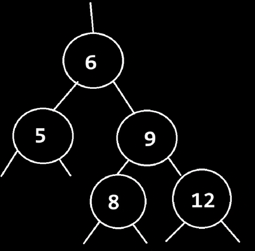
## 性质
1. 可以发现，BST树不一定是完全二叉树。
2. 关于前、中、后序遍历的有序性：
    - **中序遍历**（左 → 根 → 右）的结果是**升序有序序列**。这是由BST的性质直接保证的。
    - **前序遍历**（根 → 左 → 右）和**后序遍历**（左 → 右 → 根）的结果**通常不是有序序列**。仅在某些特殊结构有序（如退化为单链表形态的左斜树或右斜树）。
## 插入

在当前节点下插入元素，返回新的root。

>为什么要求返回一个新的root呢？
>
>1. 便于返回新的root。根节点不一定不变，比如之后如果有平衡化的操作。
>2. 便于进行递归，因为树本身就是递归结构，完成insert也可以依赖递归进行，在递归过程中，root是动态变化的，层层递进。

如果遇到插入key相同的情况，将value内容替代。

以下是自己写的版本：left、right指针没有接上新节点！

```c
PTreeNode insert(PTreeNode root, PTreeNode node)
{
    if(root == NULL) return node;//终止条件，root为空时，直接将node作为根
    if(node->key == root->key)
    {
        root->val = node->val;
        return root;
    }
    if(node->key < root->key)
    {
        root = root->left;
    }
    else
    {
        root = root->right;
    }
    insert(root, node);
}
```

简洁明了的正确版本：

```c
PTreeNode insert(PTreeNode root, PTreeNode node)
{
    if(!root) return node;//终止条件，插入的地方为空时，返回node本身作为根
    if(node->key < root->key) // key小于root时，插入到左侧
    {
        root->left = insert(root->left, node);
    }
    else if(node->key > root->key)
    {
        root->right = insert(root->right, node);
    }
    else
    {
        root->val = node->val;
        free(node);//实际上不该由此函数处理，应该由外部处理
    }
    return root;
}
```

## 创建节点

```c
PTreeNode make_tree_node(unsigned key, char val)
{
    PTreeNode node = (PTreeNode)malloc(sizeof(TreeNode));
    node->key = key;
    node->val = val;
    node->left = NULL;
    node->right = NULL;
    return node;
}
```

测试

```c
int main(void)
{
    PTreeNode root = NULL;
    root = insert(root, make_tree_node(3, 'c'));
    root = insert(root, make_tree_node(2, 'b'));
    root = insert(root, make_tree_node(4, 'd'));
    root = insert(root, make_tree_node(1, 'a'));
}
```

## 查找

建立树就是为了查找，虽然插入困难了些，但是一旦有建立好的树，则搜索要简单得多。

```c
PTreeNode search(PTreeNode root, unsigned key)
{
    if(!root) return NULL;
    if(key < root->key)
    {
        return search(root->left, key);
    }
    else if(key > root->key)
    {
        return search(root->right, key);
    }
    return root;
}
```

测试

```c
int main(void)
{
    PTreeNode root = NULL;
    root = insert(root, make_tree_node(3, 'c'));
    root = insert(root, make_tree_node(2, 'b'));
    root = insert(root, make_tree_node(4, 'd'));
    root = insert(root, make_tree_node(1, 'a'));
    PTreeNode node = search(root, 2);
    PTreeNode node2 = search(root, 20);
}
```

## 删除

给定一个root，查找特定的key，删除后，返回0或1（C语言中没有bool类型，用int代替）

>需要考虑：
>
>1. 删除的节点如果有子树怎么办？

首先递归查找key，如果找到了指定key，则有以下几种情况：

1. 要删除的节点为叶子节点：直接删除
2. 要删除的节点只有一支子树（左子树或右子树）：子树节点代替上来即可
3. 要删除的节点有两支子树：在两棵子树中找到一个值大小邻近的节点，交换位置后，就可以转化为上述1、2的情况，就可以简化删除过程。
    1. 可以选择左子树的最右侧节点：左子树中最大值，但其有可能有左子树（一定不会存在右子树的），因此转化为2。如果没有子树，则转化为1，直接删除。
    2. 也可以选择右子树的最左侧节点：右子树中最小值，但其有可能有右子树（一定不会存在左子树的），因此转化为2。如果没有字树，则转化为1，直接删除。

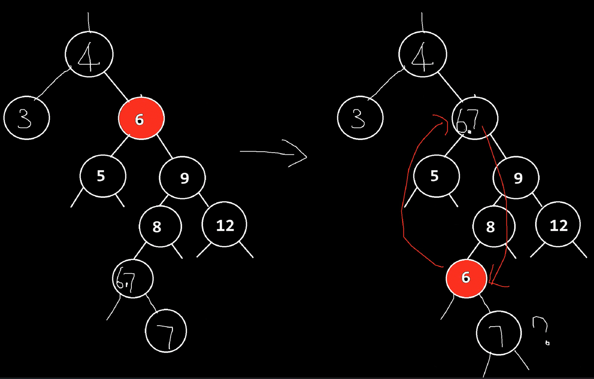

remove也是一种递归，终止条件为当前root为空。

> 1. 找到节点为叶子节点时，发现返回值应当为PTreeNode，因为你递归删除子树时，需要反馈给上层一个节点地址信息，以更新上层root的孩子链接。
> 2. 当目标节点有两支子树时，从左右侧找相邻值均可。我们选择从右子树找最小值。
> 3. remove和系统库函数名字冲突，需要改名为`remove_node`

```c
int remove_node(PTreeNode root, unsigned key)
{
    if(!root) return NULL;
    if(key < root->key)
    {
        root->left = remove_node(root->left, key);
    }
    else if(key > root->key)
    {
        root->right = remove_node(root->right, key);
    }
    else // 找到key
    {
        // 情况1：叶子节点
        if(root->left == NULL && root->right == NULL)
        {
            free(root);
            root = NULL;
        }
        // 情况3：同时有两支子树
        // 当目标节点有两支子树时，从左右侧找相邻值均可。我们选择从右子树找最小值。
        else if(root->left != NULL && root->right != NULL)
        {
            PTreeNode right_min = find_right_min(root);
            exchange(right_min, root);
            // root已经交换到深层，其可能成为了叶子节点，也可能存在一支右子树。再次递归走情况1、2删除。
            root->right = remove_node(root->right, key);
        }
        else// 情况2：有且仅有一支子树
        {
            PTreeNode newroot = NULL;
            if(root->left != NULL)
            {
                newroot = root->left;
            }
            else
            {
                newroot = root->right;
            }
            free(root);
            root = newroot;
        }
    }
    return root;
}
```

```c
//除了交换val值，不要忘记交换key值
void exchange(PTreeNode n1, PTreeNode n2)
{
    unsigned key = n1->key;
    n1->key = n2->key;
    n2->key = key;
    
    char val = n1->val;
    n1->val = n2->val;
    n2->val = val;
}
```

```c
PTreeNode find_right_min(PTreeNode root)
{
    //形参传入的是根节点，不是根节点的右子树，所以初始化一定注意应当传入root->right
    PTreeNode right_min = root->right;
    while(right_min->left)
    {
        right_min = right_min->left;
    }
    return right_min;
}
```

# 树的遍历方式

树是一种非线性结构，既然要遍历就得按照一定顺序。

1. 若按深度优先（DFS），从访问根节点的时机来看，有前序、中序、后序。
    1. 首先访问根节点，第二遍历左子树，第三遍历右子树：是前序
    2. 首先遍历左子树，第二访问根节点，第三遍历右子树：是中序
    3. 首先遍历左子树，第二遍历右子树，第三访问根节点：是后序
2. 若按广度优先（BFS），则按层次遍历。

## 前序（PreOrder）

前序是先访问根节点，再访问左子树、右子树。

```c
void visit(void PTreeNode root)
{
    printf("key: %u, val: %c\n", root->key, root->val);
}
void preorder(PTreeNode root)
{
    //终止条件，根节点为空
    if(!root){
        return;
    }
    //访问根节点
    visit(root);
    //遍历左子树
    preorder(root->left);
    //遍历右子树
    preorder(root->right);
}
```

前序遍历测试代码如下，结果应为：3 2 1 4

```c
int main(void)
{
    PTreeNode root = NULL;
    root = insert(root, make_tree_node(3, 'c'));
    root = insert(root, make_tree_node(2, 'b'));
    root = insert(root, make_tree_node(4, 'd'));
    root = insert(root, make_tree_node(1, 'a'));
    preorder(root);
}
```

## 中序（InOrder）

```c
void inorder(PTreeNode root)
{
    //终止条件，根节点为空
    if(!root){
        return;
    }
    //遍历左子树
    inorder(root->left);
    //访问根节点
    visit(root);
    //遍历右子树
    inorder(root->right);
}
```

中序遍历测试代码如下，结果应为：1 2 3 4

```c
int main(void)
{
    PTreeNode root = NULL;
    root = insert(root, make_tree_node(3, 'c'));
    root = insert(root, make_tree_node(2, 'b'));
    root = insert(root, make_tree_node(4, 'd'));
    root = insert(root, make_tree_node(1, 'a'));
    inorder(root);
}
```

## 后序（PostOrder）

```c
void postorder(PTreeNode root)
{
    //终止条件，根节点为空
    if(!root){
        return;
    }
    //遍历左子树
    postorder(root->left);
    //遍历右子树
    postorder(root->right);
    //访问根节点
    visit(root);
}
```

后序遍历测试代码如下，结果应为：1 2 4 3

```c
int main(void)
{
    PTreeNode root = NULL;
    root = insert(root, make_tree_node(3, 'c'));
    root = insert(root, make_tree_node(2, 'b'));
    root = insert(root, make_tree_node(4, 'd'));
    root = insert(root, make_tree_node(1, 'a'));
    postorder(root);
}
```

## 层序（BFS）

递归思想、栈结构对于层序遍历不太好使，需要换一种思路，队列、先进先出（FIFO）。

```c
void bfs(PTreeNode root)
{
    push_node(root);
    while(queue_size() > 0)
    {
        PTreeNode top = pop();
        visit(top);
        if(top->left != NULL)
        {
            push_node(top->left);
        }
        if(top->right != NULL)
        {
            push_node(top->right);
        }
    }
}
```

### 队列设计

使用链表充当队列。

```c
typedef struct _QueueNode
{
    PTreeNode val;
    struct _QueueNode * next;
}QueueNode, * PQueueNode;

PQueueNode queue_top = NULL;

PQueueNode make_queue_node(PTreeNode treeNode)
{
    PQueueNode queue_node = (PQueueNode)malloc(sizeof(QueueNode));
    queue_node->val = treeNode;
    queue_node->next = NULL;
    return queue_node;
}

void push_node(PTreeNode treeNode)
{
    PQueueNode queue_node = make_queue_node(treeNode);
    //判断目前是否有首节点，没有就当作首节点
    if(queue_top == NULL)
    {
        queue_top = queue_node;
    }
    else
    {
        PQueueNode cur_node = queue_top;
        while(cur_node->next)
        {
            cur_node = cur_node->next;
        }
        cur_node->next = queue_node;
    }
}
unsigned queue_size()
{
    unsigned cnt = 0u;
    PQueueNode node = queue_top;
    while(node)
    {
        ++cnt;
        node = node->next;
    }
}
PTreeNode pop()
{
    if(queue_top == NULL)return NULL;
    PTreeNode treeNode = queue_top->val;
    PQueueNode oldNode = queue_top;
    queue_top = queue_top->next;
    free(oldNode);
    oldNode = NULL;
}
```

层序遍历测试代码如下，结果应为：3 2 4 1

```c
int main(void)
{
    PTreeNode root = NULL;
    root = insert(root, make_tree_node(3, 'c'));
    root = insert(root, make_tree_node(2, 'b'));
    root = insert(root, make_tree_node(4, 'd'));
    root = insert(root, make_tree_node(1, 'a'));
    bfs(root);
    return 0;
}
```

# B树（2-3-(4)树）

B代表Balanced，据说也代表波音公司，因为它是由Rudolf Bayer和Edward M. McCreight在波音研究实验室工作时发明的。
其性质是为了解决BST树的退化问题的，比如说一直向左子树插入一个边缘值，就会导致树退化为链表，这种不平衡导致效率降低。

B树派生出好多种形态的树，2-3-(4)树就是B树的4阶形式。红黑树又是2-3-(4)树的一种形式，是一种多叉树的二叉树实现。
## B树、AVL树、红黑树的对比
AVL树、B树、红黑树，都是解决BST树退化问题的自平衡结构。
1. 结构上：
    1. AVL树和红黑树都是二叉树。节点中都记录了平衡状态。
        1. AVL存储平衡因子。
        2. 红黑树存储颜色标记。
    2. B树为多路树，节点有多个键、子节点指针。
2. 性能上：
    1. AVL树，严格平衡。查询效率最高。
    2. 红黑树，不严格平衡。查询效率略慢于AVL树。
        1. 但在数学上，AVL和红黑树的增删查时间复杂度都是大O(log n)。
        2. 对于插入操作，AVL和红黑树都是最多旋转2次。
        3. 对于删除操作，AVL树由于需要严格平衡，旋转次数可能需要O(log n)次，而红黑树可以通过翻转颜色，让旋转次数最多3次。
            1. 为什么不能直接说“logn 次”？
                1. 平衡因子：每个节点的左右子树高度差（Balance Factor, BF）的绝对值不超过1。
                2. 高度约束：对于包含 n 个节点的AVL树，其高度 h≤1.44log2​n（基于斐波那契数列的黄金分割比例）。
                3. 树高与路径长度：若树高为 h，删除节点的路径长度最多为 h。
                4. 每层最多一次旋转：每层失衡节点需一次或两次旋转（如双旋），但旋转次数的增长趋势仍为 O(h)。
                5. 最终结果：最坏旋转次数=O(h)=O(logn)
    3. B树也是平衡的，但其只适用于外存（磁盘）IO操作。
        1. 见“高级数据结构_B树”
        2. B树不需要旋转节点。是通过分裂、合并节点达到平衡的。
        3. 为什么B树不像AVL、红黑树那样适用于内存操作：
            1. **指针操作开销**：B树的插入/删除涉及多次指针调整（分裂或合并节点），而AVL/红黑树的旋转操作仅需修改少量指针。
            2. B树节点的数据量通常较大（例如一个节点占4KB），可能超出CPU缓存行（通常64B-256B），导致缓存未命中率增加。
            3. 总之，**局部性差**：二叉树的节点较小，更容易被缓存命中；而B树的节点遍历需要访问更多内存块，降低缓存利用率。
    4. 因此。AVL树适合读多写少；红黑树适合写多读少。

与B树不同的是，AVL是一种BST，是二叉树，即比平衡二叉搜索树多了平衡的概念，具体来说多了旋转的操作、节点的状态。
B树在原型上，是多叉树，且节点可有多个值。由于B树不是二叉树，因此B树不属于BST。

对于AVL和红黑树：由于AVL是严格平衡的，在查询效率上略优于红黑树这种不严格平衡的树，但它们的时间复杂度都是$O(\log n)$;
但是，对于AVL和B树而言，搜索算法没什么差异，AVL树和B树同样都是二分查找的分治策略, 时间复杂度都为$O(\log n)$;
## 节点形态

有2型节点、3型节点。

2型节点是节点内部有1个key，可以有两个子节点；3型节点是内部有2个key，可以有三个子节点。2-3树的意思是，树中可能包含2型节点和3型节点。

插入节点位置的规则遵循BSTree的规则，即从左往右按从小到大的顺序，左侧最小、右侧最大。如果是3型节点，则需要满足：左侧最小，key1次小，中子树是中值，key2次大，右侧最大。
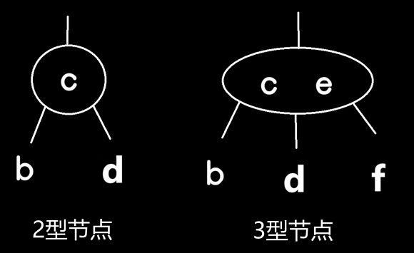

除了以上规则以外，为了能更好地控制2-3-(4)树，多了一个特殊的附加规则：**2、3、4型节点要么是叶子节点（没有子节点），要么子节点全都占满，没有中间状态**。
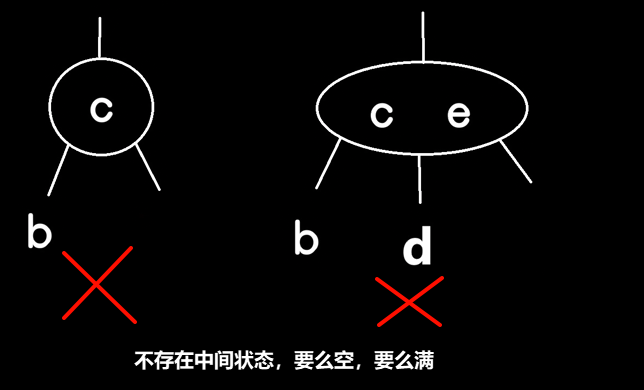
1. 假设目前有一个内含6的2型节点
   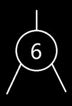
2. 要插入9，由于子树要么空要么满，所以只能将其与6并列放入2型节点中，变为一个内含6、9的3型节点。
   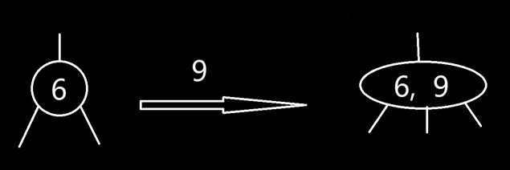
3. 继续插入7，会进入一个临时状态，即将其与6、9并列，变为一个内含6、7、9的4型节点。但是紧接着，会分裂为3个2型节点：7作为根节点，左子树为6，右子树为9。
   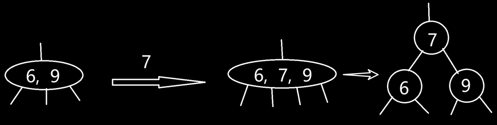
4. 继续插入5，经过对比，向7的左子树6插入，与6并列，变为一个内含5、6的3型节点。
   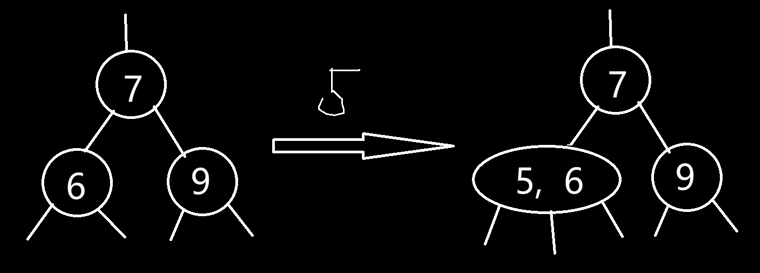
5. 继续插入4，经过对比，向7的左子树（5、6）插入，与5、6并列，变为一个内含4、5、6的4型节点。
6. 紧接着，左子树又要面临分裂为3个2型节点，但如果单纯地分别把4、6下裂后，只有左支的深度单独加1，会导致整个树的不平衡（左偏）。
7. 但如果换个方向，向父节点推5，会巧妙地保持整个树深度同步。
8. 而5上推与7并列后，根节点变为3型节点，需要有三个子树，那么9保留原位，而4、6正好可以各占一个子树的位置。所以，最终结果为：整根为（5、7），子树1为4，子树2为6，子树3为9。
   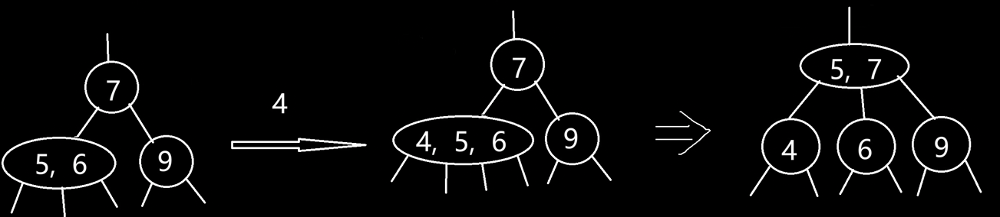
## 实现
1. 其中一个比较棘手的问题是，凡是两个数以上的比较，都需要一个机制来对比，哪怕是三个数的对比。
2. 2-3-4树的数据结构不确定，有中间不稳定的4型节点，所以不能简单地用left、middle、right对比。
3. 如果B树单个节点中有上千个数据，那么就用数组来存放。但是如果此B树是2-3-4树，则数组就显得比较大动干戈了。
4. 综上原因，我们想到一个巧妙的方法，就是用颜色来代替某些支。由此产生了：红黑树

# 红黑树（二叉搜索红黑树）

红黑树其实是2-3树的一个变形（不存在4型节点）。

我们加以人为规定：把原先2-3树，同一节点中的较小数裂在根节点的左侧子树。这样的话，3型节点就转化成了二叉树。

>当然也可以人为规定把较大数放在右侧子树，甚至说同时存在较小数放左、较大数放右的情况。这样徒使程序变得很复杂，失去了简化2-3树的意义。所以为了编写程序简单，统一规定都按左侧（左斜）处理。


上图的 c 用红线相连，指向 a，称 a 为红色节点，代表 a、c 原先在2-3树中曾为同一节点。红色代表鲜明，可以理解为：有血肉联系。
## 红黑树对应2-3树的有效形式
1. 我们将树中的链接分为两种类型：
    1. 红链接将两个2- 结点连接起来构成一个3- 结点
    2. 黑链接则是2-3 树中的普通链接。
    3. 确切地说，我们将3- 结点表示为由一条左斜的红色链接（两个2-结点其中之一是另一个的左子结点）相连的两个2- 结点。
    4. 规定只能左红，不能出现右红。
2. 规定只能连续一支红线，即一个节点最多只能由一个红线连接，即表示在2-3树中的3型节点。不能出现连续两支红线。
3. 在实际程序中，因为每个结点都只会有一条指向自己的链接（从它的父结点指向它），我们把颜色存储在左子树节点。
4. 如果指向它的链接是红色的，那么为红色。我们约定空链接为黑色（因此根节点存储的应当总是黑色。我们在每次插入后都要将根结点设为黑色。注意，每当根结点由红变黑时树的黑链接高度就会加1）。
5. 有这样的性质，红黑树最长支的长度 不超过 最短支的长度的2倍。虽然AVL树最大差1，但AVL树插入性能太慢。红黑树就很好地平衡了层数差异和性能。

## 极端形式

二叉树的极端形式就是：一支最长、一支最短：左子树最长情况下是一红线一黑线交替穿插。右子树最短情况下是全黑。这种情况下，左支和右支的高度差最大是2倍。这个高度差是可以接受的，因为红黑树相比于其他树来说插入较简单，比如两边最多差1的AVL树插入是很费劲的，时间复杂度太高。而又能兼顾到查找的速度。

## 应用

STL中的map（dictionary）、set；

Linux中网络编程中epoll用到的数据结构

## 节点定义

> 用直观的符号代替不直观的内容（整数，不能是小数）。通常需要typedef，否则在声明、初始化枚举类时，需要写出全称`enum Color`。
```c
typedef enum _Color
{
    Black = 0,
    Red
}Color;
```

```c
typedef struct _RBNode
{
    unsigned key;
    char val;
    Color color;
    struct _RBNode * left;
    struct _RBNode * right;
}RBNode, *PRBNode;
```

## 插入

我们可以默认创造出的新节点都是红色的，因为2-3树在插入节点时，节点总是试图与上层节点结合成为同一节点。
### 创建节点（默认红色）
```c
PRBNode make_rb_node(unsigned key, char val)
{
    PRBNode node = (PRBNode)malloc(sizeof(RBNode));
    node->val = val;
    node->key = key;
    node->color = Red;
    node->left = NULL;
    node->right = NULL;
}
```
### 根节点的颜色问题（插入空树）
在下面插入的过程中，可能会有颜色转换操作，会使根结点变为红色。这也可能出现在很大的红黑树中。严格地说，红色的根结点说明根结点是一个3- 结点的一部分，但实际情况并不是这样。因此我们在每次插入后都会将根结点设为黑色。注意，每当根结点由红变黑时树的黑链接高度就会加1。
```cpp
// 树空时插根节点的情况。
PRBNode insert_rb_node(PRBNode root, PRBNode node)
{
    if(root == NULL)return node;
    //...
}
PRBNode insert_node(PRBNode root, PRBNode node)
{
    root = insert_rb_node(root, node);
    //在插入过程中，根节点有可能变红，插入后要把根设为黑色。
    if(is_red(root))
    {
        root->color = Black;
    }
    return root;
}
```
### 插入到2-型节点
1. 比如向一个内含 c 的 2-型节点插入 a，已知 2-型节点没有子树，则将 a 插入到 c 左子树，则相当于在 2-3 树中合并节点的情况，在红黑树中则相当于 c 的颜色设为红色即可。c 默认就是红色，不用操作。最后：c 红，a 黑。
2. 比如向一个内含 c 的 2-型节点插入 d，2-型节点没有子树，则将之插入到右子树，因为 c 没有子树，则相当于在 2-3树中合并节点的情况。由于默认创建出来的节点是红的，造成**右红**，那么就需要**左旋操作**：即让 d 上位，c 下位至 d 的左子树，且 c 右支接管 d 原先的左子树。插入之前，b 是黑色，c 是红色，插入之后，还需将 b、c 的颜色交换。

```c
PRBNode left_rotate(PRBNode root)
{
    PRBNode newroot = root->right;
    root->right = newroot->left;
    newroot->left = root;
    return newroot; //new root
}
```

```c
void exchange_color(PRBNode n1, PRBNode n2)
{
    Color color = n1->color;
    n1->color = n2->color;
    n2->color = color;
}
```

### 插入到3-型节点
该3-型节点此时一定有左子树，且左子树一定为红色，右子树不可能是红的。
1. **左红右红**：向（c、f）节点（没有右子树）插入 h ： h 将要插到 f 的右子树，但 h 默认为红色，**出现了左红右红**，需要调整。此时相当于在2-3-4树中合并为过渡4-型节点的情况，之后即将分裂为3个2-型节点。而在红黑树中，自然地省去了分裂的步骤，此时需要把 c、h 节点的红色反转为黑色（flip color）。注意！还需要把 f 的颜色反转为红色，因为在2-3-4树中的分裂操作中，被上推的节点企图与上层进行结合，一旦结合，就成红色了。总之，**3 节点翻转颜色**。

```c
int flip_color(PRBNode root)
{
    if(root == NULL)return 0;
    if(root->color == Red)
    {
        root->color = Black;
    }
    else
    {
        root->color = Red;
    }
    return 1;
}
void flip_colors(PRBNode root)
{
    //如果根节点颜色反转成功，则才能继续反转子节点
    if(flip_color(root))
    {
        flip_color(root->left);
        flip_color(root->right);
    }
}
```
2. **左连续红**：向（c、f）节点（没有右子树）插入 a ：a 将要插到 c 的左子树，但 a 默认为红色， **出现了左支连续红色**，需要调整。此时相当于在2-3-4树中合并为过渡4-型节点的情况，之后即将分裂为3个2-型节点，把 c 上推，把 a、f 下裂。在红黑树中，则需要**右旋**操作： f 下位至 c 的右子树，且 f 的左支接管 c 原先的右子树。此时又出现了**左红右红**，效仿情况1，把3个节点颜色全部反转即可。则最后：a 黑、c 红、f 黑。
    1. 颜色问题：右旋前的颜色为：a 红、c 红、f 黑，右旋后的颜色为：a 红、c 黑、f 红。为什么上移的 c 变黑了？因为 c（newRoot）相当于替代了 f（oldRoot）的位置，旧根本来就是黑的，所以 c 要变黑。

```c
PRBNode right_rotate(PRBNode root)
{
    PRBNode x = root->left;
    root->left = x->right;
    x->right = root;
    exchange_color(x, root);
    return x;// new root
}
```
3. **左空右红**：向（c、f）节点（没有右子树）插入 d ：d 将要插到 c 的右子树（注意，不是根节点 f 的右子树，而是其左子树 c 的右子树），但 d 默认为红色，**出现了右支红色**，需要调整。需要以 c 为根**左旋**，之后 c 成了 d 的左支，d 成了 f 的左支，**出现了左支连续红色**。此时和在情况2中一样，需要以 f 为根**右旋**，即把 d 上推，把 c、f 下裂。f 下位至 d 的右子树，且 f 的左支接管 d 原先的右子树。整体来说：先左旋，后右旋。
    1. 像情况2一样，右旋后，又出现了**左红右红**，则需要把3个节点颜色全部反转。最后：c 黑、d 红、f 黑。
### 整体过程
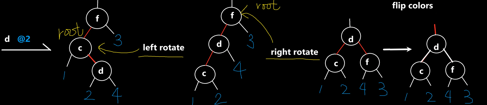
相比于BSTree的插入，前面的流程一致，只是多了插入后的调平的操作。
1. 终止条件是当时的root为空
2. 要插入的node的key与已存在的节点的key相等时，认为是更新节点值的操作
3. 调整——我们需要精心安排 if 的顺序，经过3种情况分析：
    1. 左黑右红：在左旋后会出现左连续红，则需要右旋，之后会出现左红右红。
    2. 左连续红：右旋后会出现左红右红。
    3. 左红右红：翻转颜色即可。
    4. 总体来说：
        1. 1和2是互斥关系：以上图为例，c为根时，只能看到c、d两层，看不到情况 2 从 f 层开始的左连续红。
        2. 1和3也是互斥关系：由于1和2是互斥关系，不会在那一层递归进行对 f 的右旋，所以不会出现左红右红，因此1和3也是互斥关系。
        3. 2和3是并列先后顺序关系。在 情况2 对 f 进行右旋后，能在同一层递归关系中继续看到 c、d、f 的颜色关系，出现左红右红，因此2必须在3前面。
        4. 情况3，对三个节点全部翻转颜色。
4. 最后红黑树还要注意一条规则是总根一定是黑色的。

```c
PRBNode insert_rb_node(PRBNode root, PRBNode node)
{
    if(root == NULL)return node;//此处不用调整了，会由上一层调整
    if(root->key == node->key)
    {
        root->val = node->val;
        return root;
    }
    //递归向下
    //左支递归插入
    if(node->key < root->key)
    {
        root->left = insert_rb_node(root->left, node);
    }
    else//右支递归插入
    {
        root->right = insert_rb_node(root->right, node);
    }
    //递归向上
    //调整
    //左空右红。
    // 左空右红时局部左旋后会出现左侧连续红，
    // 但不能在同一层递归处理后续情况，因此是if-else关系
    if(!is_red(root->left) && is_red(root->right))
    {
        root = left_rotate(root);//可能会更新root
    }
    else
    {
        //左侧连续红
        // 必须排到左红右红前面，因为右旋后出现左红右红，需要在同一层递归处理。因此是if-if先后顺序关系。
        if(is_red(root->left) && is_red(root->left->left))
        {
            root = right_rotate(root);
        }
        //左红右红：反转颜色
        if(is_red(root->left) && is_red(root->right))
        {
            flip_colors(root);
        }
    }
    return root;
}
int is_red(PRBNode root)
{
    if(root)
    {
        return root->color == Red;
    }
    return Black;// 若root为空则返回黑
}
PRBNode insert_node(PRBNode root, PRBNode node)
{
    root = insert_rb_node(root, node);
    //在插入过程中，根节点有可能变红，插入后要把根设为黑色。
    if(is_red(root))
    {
        root->color = Black;
    }
    return root;
}
```

测试

```c
int main()
{
    PRBNode root = NULL;
    root = insert_node(root, make_rb_node(3, 'c'));
    root = insert_node(root, make_rb_node(2, 'b'));
    root = insert_node(root, make_rb_node(4, 'd'));
    root = insert_node(root, make_rb_node(1, 'a'));
    return 0;
}
```

## 支持4-型节点的红黑树（存在左红右红）
Cpp的STL模板库以及其他语言的库，Dictionary和Map中用的都是支持4-型节点的红黑树。

首先我们要明确，我们在2-3树下的红黑树规定了红链接只能出现在左侧。
原先2-3树下的红黑树，插入过程中**临时存在**的4-型节点，只是一个临时、不稳定的中间状态，插入后要立即检查左连续两红、左红右红、左空右红，这几种非法的4-型节点情况，调整。
现在如果支持4-型节点，那么红链接支持出现在右侧。那么就会允许左连续两红、左红右红、左空右红的存在吗？不！仍然不允许，因为这仍是基于左倾的红黑树，实际仅能存在节点为黑色、左右字节点为红色的这样的情况（即左红右红）。

但是，微妙的是，虽然允许了4-型节点的合法存在，但在插入过程中，为了操作简便，把4-型节点又拆解为非4-型节点了，**拆解中用到的旋转操作是我们上文写过的2-3树下的左倾红黑树下的操作。于是树经过拆解后，又变成了2-3树下的左倾红黑树**，就又可以用到之前的操作了。

总之，基于左倾旋转操作的支持4-型节点的红黑树，有以下性质：
一棵红黑树是满足下面红黑性质的二叉搜索树：
1. 每个结点或是红色的，或是黑色的。
2. 根结点是黑色的。
3. 每个叶结点 (NIL) 是黑色的。
4. 如果一个结点是红色的，则它的两个子结点都是黑色的。
5. 对每个结点，从该结点到其所有后代叶结点的简单路径上，均包含相同数目的黑色结点。

如果支持4-型节点稳定存在，在结构上，相比只有2-3型的结构，2-3-4树的层数会更少一些。虽然实际在红黑树的形式下层数没有明显减少，然而，操作效率上会得到改善。
但是，就要解决一个问题，即4-型节点再插入一个节点，怎么处理？是允许临时5-型节点存在吗？这样就使程序复杂化了。
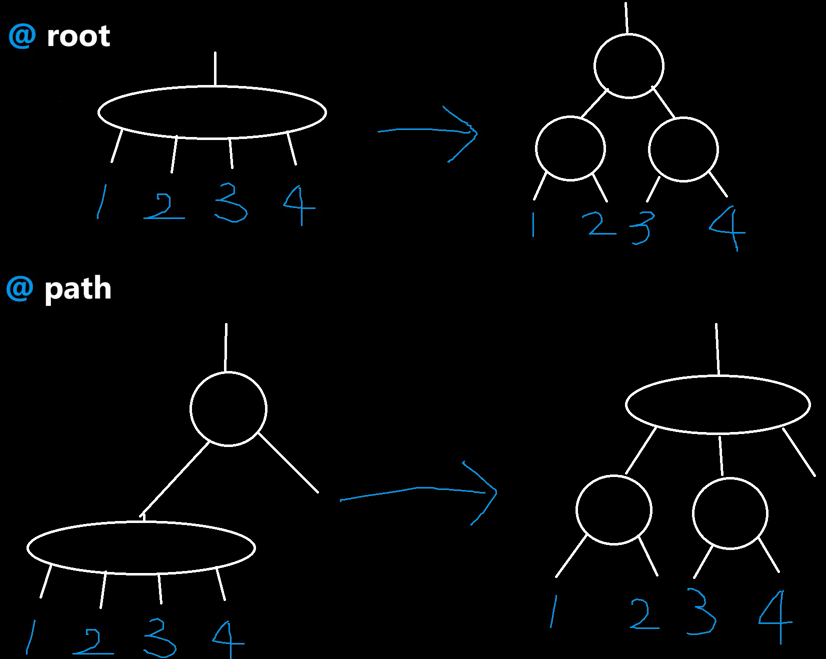
高效、巧妙的处理方式：
1. 在递归向下、插入之前，事先分解掉红黑树中所有的4-型节点（但必须是等价转化，不能让2-3-4树形式上的层数变多，对于红黑树形式来说，可能会多1层，但还是符合平衡的要求范围内的，可以看上图）。这样，后续插入时就不会存在4-型节点，要么是2-型、要么是3-型。
    1. 我们发现，分解4-型节点，其实仅需翻转颜色而已。
2. 插入
3. 插入之后，递归向上调平。
    1. 只需要处理：左黑右红、左连续红的情况。
    2. 左黑右红和左连续红不在同一递归层次中处理，互斥。

```c
PRBNode insert_rb_node(PRBNode root, PRBNode node)
{
    if(root == NULL)return node;//此处不用调整了，会由上一层调整
    if(root->key == node->key)
    {
        root->val = node->val;
        return root;
    }
    //递归向下之前，先分解所有遇到的4-型节点。
    if(is_red(root->left) && is_red(root->right))
    {
        flip_colors(root);
    }
    //递归向下
    //左支递归插入
    if(node->key < root->key)
    {
        root->left = insert_rb_node(root->left, node);
    }
    else//右支递归插入
    {
        root->right = insert_rb_node(root->right, node);
    }
    //递归向上
    //调整
    //左空右红。
    // 左空右红时局部左旋后会出现左侧连续红，
    // 但不能在同一层递归处理后续情况，因此是if-else关系
    if(!is_red(root->left) && is_red(root->right))
    {
        root = left_rotate(root);//可能会更新root
    }
    else
    {
        //左侧连续红
        if(is_red(root->left) && is_red(root->left->left))
        {
            root = right_rotate(root);
        }
        // 在允许4-型的红黑树中，左红右红合法。不用处理。
        //if(is_red(root->left) && is_red(root->right))
        //{ }
    }
    return root;
}
int is_red(PRBNode root)
{
    if(root)
    {
        return root->color == Red;
    }
    return Black;// 若root为空则返回黑
}
PRBNode insert_node(PRBNode root, PRBNode node)
{
    root = insert_rb_node(root, node);
    if(is_red(root))
    {
        root->color = Black;
    }
    return root;
}
```

测试

```c
int main()
{
    PRBNode root = NULL;
    root = insert_node(root, make_rb_node(3, 'c'));
    root = insert_node(root, make_rb_node(2, 'b'));
    root = insert_node(root, make_rb_node(4, 'd'));
    root = insert_node(root, make_rb_node(1, 'a'));
    return 0;
}
```

## 删除

红黑树的删除可以参考BST的过程。

红黑树形式的分析——类比BST树
BST中，如果节点是
1. 叶子节点，直接删除
2. 只有一支子树，则直接删除，删除后让该支子树替代root自身即可（叶子节点的子树为NULL））
3. 如果有两个子树，则选取一个叶子节点交换（选择两支子树中相近大小的节点替代自身），即把将要删除的节点下移至叶子节点或者下移至只有一支子树的状态，就可以转化为情况1、2了。
4. 递归返回后需要调平

2-3-4树形式的分析——类比插入的思想
除此之外，红黑树是2-3-4树，拿2-3-4树的形式来分析，如果要删除的节点在叶子节点中，可能在一个4-型节点、3-型节点、2-型节点中，4-型、3-型可以直接删除，因为不影响该路径层数的平衡。
总之，如果是2-型节点，就不能直接删除。

类比于红黑树避免插入4-型节点而分解所有的4-型节点的道理，我们可以在避免删除2-型节点而让所有的2-型节点扩张为3-型或4-型节点。

因此，4-型节点在红黑树中，既可以存在，也可以不存在。
如果允许存在4-型节点，则删除后不用向上递归分解4-型节点。如果不允许存在4-型节点，则删除后需要向上递归分解4-型节点。

代码可以参照算法（4th）291页3.3.41
# 红黑树非递归版本
见算法（4th）265页3.2.13。
## 模型
我们分析的模型，基于的红黑树形式是：实际4-型节点仅能存在为根黑色、左右字节点为红色的这样的情况（即左红右红）。详见[支持4-型节点的红黑树（存在左红右红）](#支持4-型节点的红黑树（存在左红右红）)。
如果仅分析新节点插到左子树的情况：
1. 爷黑，左红右红。
    1. 爷爷、父、叔全部翻转颜色。爷爷的父节点可能还是红色，需要不断向上调整，直到达到根，根记得设为黑色。
2. 爷黑，左连续两红。
    1. 插到了父节点（红色）的左子树
        1. 翻转父节点、爷爷节点颜色，之后以爷爷节点右旋。
    2. 插到了父节点（红色）的右子树
        1. 先以父节点左旋，就会转化为上面的情况。
3. 爷黑，左黑、右无所谓。直接插

实际上，新节点插到右子树只是上述过程的镜像。所以我们无需再分析。

默认插入的新节点为红色。
若树为空树，则直接插入节点，最后记得根要设为黑色；
若树不为空，且插入位置的父节点为黑色，则直接插入。
若插入位置的父节点为红色：
只分析节点插入到左支的情况。
1. 叔叔节点为红色，插入的位置**不管是父节点的左侧还是右侧**。都相当于爷爷黑、爷爷的左红右红。翻转上面3个节点颜色即可。但是，爷爷变红之后，可能还和爷爷的父节点冲突，需要不断向上调整，直到找到整个树的根，设为黑色。
2. 叔叔节点为黑色，插入的位置是**父节点的左侧**。则相当于爷爷黑、左连续两红。需要先把父节点和爷爷的节点颜色翻转（父设为黑，爷爷设为红）。再以爷爷为轴右旋。则父节点上位，为黑色，结束。
3. 叔叔节点为黑色，插入的位置是**父节点的右侧**。则相当于爷爷黑、左连续两红。以父节点左旋，之后变成了情况2。

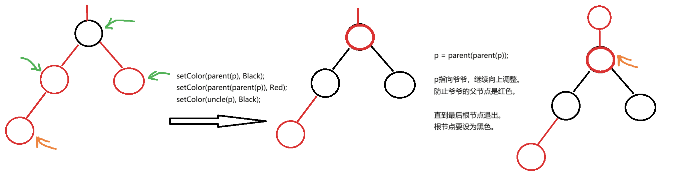

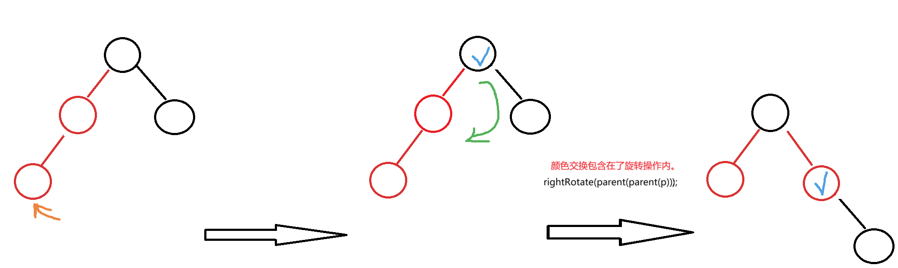

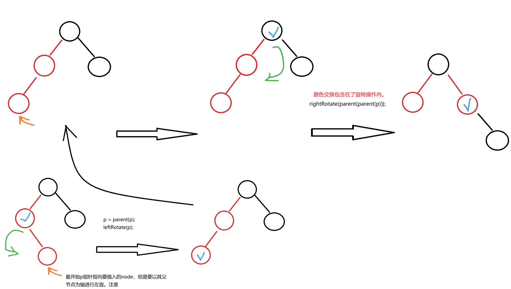

为了能实现回溯之前节点，需要在节点中包含一个父节点指针。
```cpp
template <typename T>
class RBTree
{
    // 节点的颜色
    enum Color
    {
        BLACK,
        RED
    };
    // 节点类型
    struct Node
    {
        Node(T data = T(), Node *parent = nullptr,
             Node *left = nullptr, Node *right = nullptr,
             Color color = BLACK)
            : data_(data), left_(left), right_(right), parent_(parent), color_(color)
        {
        }
        T data_;
        Node *left_;
        Node *right_;
        Node *parent_; // 指向当前节点的父节点
        Color color_;  // 节点的颜色
    };
    // 指向红黑树的根节点
    Node *root_;
};
```
## 插入
```cpp
void insert(const T &val)
{
    if (root_ == nullptr)
    {
        root_ = new Node(val);
        return;
    }

    Node *parent = nullptr;
    Node *cur = root_;
    // BST 插入流程
    while (cur != nullptr)
    {
        if (cur->data_ > val)
        {
            parent = cur;
            cur = cur->left_;
        }
        else if (cur->data_ < val)
        {
            parent = cur;
            cur = cur->right_;
        }
        else
        {
            return;
        }
    }
    // parent现在是node的父节点
    Node *node = new Node(val, parent, nullptr, nullptr, RED);
    // 判断node插到了parent左还是右，然后让其left或right指向node
    if (parent->data_ > val)
    {
        parent->left_ = node;
    }
    else
    {
        parent->right_ = node;
    }

    // 如果新插入的红色节点，父节点也是红色，不满足红黑树性质，进行插入调整操作
    if (RED == color(parent))
    {
        fixAfterInsert(node);
    }
}
// 调平函数
void fixAfterInsert(Node *node)
{
    // 如果当前红色节点的父节点是红色，不断向上调整
    while (color(parent(node)) == RED)
    {
        // 左镜像的3种情况，即插入的节点在左子树当中
        if (left(parent(parent(node))) == parent(node))
        {
            Node *uncle = right(parent(parent(node)));
            if (RED == color(uncle)) // 情况一
            {
                setColor(parent(node), BLACK);
                setColor(uncle, BLACK);
                setColor(parent(parent(node)), RED);
                node = parent(parent(node)); // 继续调整
            }
            else
            {
                // 先处理情况三
                if (right(parent(node)) == node)
                {
                    node = parent(node);
                    leftRotate(node);
                }
                // 统一处理情况二
                rightRotate(parent(parent(node)));
                break; // 调整已经完成
            }
        }
        else // 右镜像的3种情况，即插入的节点在右子树当中
        {
            Node *uncle = left(parent(parent(node)));
            if (RED == color(uncle)) // 情况一
            {
                setColor(parent(node), BLACK);
                setColor(uncle, BLACK);
                setColor(parent(parent(node)), RED);
                node = parent(parent(node)); // 继续调整
            }
            else
            {
                // 先处理情况三
                if (left(parent(node)) == node)
                {
                    node = parent(node);
                    rightRotate(node);
                }
                // 统一处理情况二
                leftRotate(parent(parent(node)));
                break; // 调整已经完成
            }
        }
    }
    // 此处强制root为黑色节点
    setColor(root_, BLACK);
}
```
分析出，红黑树的插入，最多旋转2次：先左旋、再右旋；或者先右旋、再左旋。
## 删除
总体思路：
1. 叶子节点的删除：
    1. 根。先把根清理，再删除。
    2. 红色叶子，直接用BST方式删除。
    3. 黑色叶子，**从兄弟借黑色节点**。
2. 有两个子树的节点删除：
    1. 删除有两个子树的节点，可以把节点与其左子树的最右节点（此时最多有一个子树，或者为叶子节点）替换，然后转化为删除只有一个子树的节点或删除叶子节点。
3. 有一个子树的节点删除：
    1. 主要思想是把孩子替补上来。
        1. 补上来的孩子是红色，直接把孩子涂成黑色。
        2. 补上来的孩子是黑色，无法再从自己孩子这里补充黑色了，需要**从兄弟借黑色节点**。

```cpp
void remove(const T &val)
{
    // 查找
    if(root_ == nullptr)
    {
        return;
    }
    Node* cur = root_;
    while(cur != nullptr)
    {
        if (cur->data_ > val)
        {
            cur = cur->left_;
        }
        else if(cur->data_ < val)
        {
            cur = cur->right_;
        }
        else
        {
            break;
        }
    }
    if(cur == nullptr)
    {
        return;
    }
    // 删除
    // 左右都不为空，则找左子树中的最右值（前驱）或者右子树中的最左值（后继），替换
        // 此处找的是左子树中的最右值（前驱）
    if (cur->left_ != nullptr && cur->right_ != nullptr)
    {
        Node * pre = cur->left_;
        while (pre->right_ != nullptr)
        {
            pre = pre->right_;
        }
        // 替换值
        cur->data_ = pre->data_;
        cur = pre; // 转化为删除pre
    }
    // 删除cur指向的节点，目前可以确定其最多有一棵子树，或者全空
    Node * child = cur->left;
    if (child == nullptr)
    {
        child = cur->right_;
    }
    
    // 如果cur有子树，需要更新cur子树的parent指向cur的parent
    if (child != nullptr)
    {
        child->parent_ = cur->parent_;
        // 如果cur的parent为空，则说明删除cur后，child变成了根
        if (cur->parent_ == nullptr)
        {
            root_ = child;
        }
        else
        {
            // 因为cur是最右节点，不可能有右子树。
            // cur在左支，删除后 需要把孩子继承给cur的parent的左支
            if (cur->parent_->left_ == cur)
            {
                cur->parent_->left_ = child;
            }
            else
            {
                // 因为cur是最右节点，不可能有右子树。
                // cur在右支，删除后 需要把孩子继承给cur的parent的右支
                cur->parent_->right_ = child;
            }
        }
        Color color = color(cur);
        delete cur;
        // 若删除的节点是红色，完毕。
        // 若删除的节点是黑色，需要调整
            // 如果补上来的孩子是红色，直接涂成黑色
            // 如果补上来的孩子是黑色，无法再借孩子黑色，需要借兄弟的。
        if (c == Black)
        {
            fixAfterRemove(child);
        }
    }
    else // cur没有子树。
    {
        // 看parent是否为空，若是，说明其为根节点
        if (cur->parent_ == nullptr)
        {
            delete cur;
            root_ = nullptr;
            return;
        }
        else // 此时删除的节点cur是正常的叶子节点
        {
            // 删除黑色叶子，要借兄弟一个黑色节点
            if (color(cur) == Black)
            {
                fixAfterRemove(cur);
            }
            // 不管叶子是黑还是红，都要走以下步骤
            if (left(parent(cur)) == cur)
            {
                left(parent(cur)) == nullptr;
            }
            else
            {            {
                right(parent(cur)) == nullptr;
            }
            delete cur;
        }
    }
}
```
1. 根黑或者红。兄弟黑
    1. 兄弟的右孩子是红色，左无所谓
        1. **把兄弟的右孩子设为黑色**。以根节点为轴，左旋。完毕。
        2. 总之，借了右支的黑节点。右支需要改一个红色为黑色。
    2. 兄弟的左孩子是红色，右是黑色
        1. 以兄弟为轴右旋，于是转化为了情况1。
        2. 注意兄弟换了，需要更新（`brother=parent->right`）。
    3. 兄弟的两个孩子全黑。
        1. 总体思想：由于左边即将失去一个黑色，可以把**黑色的兄弟涂红**以平衡。
            1. 右支新添了红色节点，回头需看若根节点为红色，则**改为黑色**。结束。
            2. 若根节点为黑色，则向上追溯一个红色节点，**改为黑色**。
2. （情况4）根黑或者红。兄弟红
    1. 兄弟的两个孩子全黑（因为兄弟节点是红，其孩子不能出现红）。意味着根的右支已经没有孩子可借。
        1. 以根为轴，左旋。这样，要删除的节点就有了黑色兄弟。
        2. 但是要注意，要删除的节点的兄弟换了，需要更新（`brother=parent->right`）。
        3. 可以归结到上述兄弟黑的三种情况了。

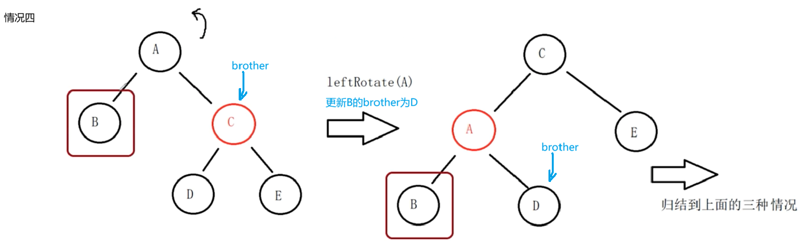

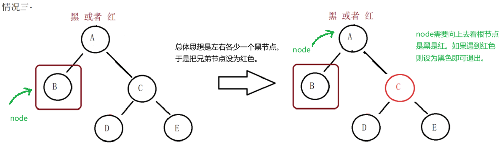

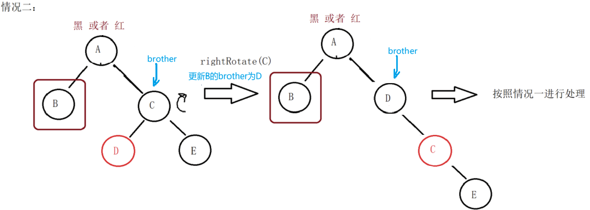

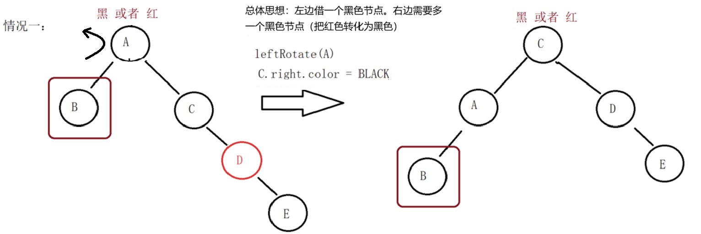

```cpp
// 旋转时产生的颜色交换应集成在旋转函数中
void fixAfterRemove(Node * node)
{
    while (node != root_ && color(node) == Black)
    {
        // 左镜像，即删除的节点在根的左支。
        if (left(parent(node)) == node)
        {
            Node * brother = right(parent(node));
            // 情况4，兄弟红。转化为兄弟黑的情况
            if (color(brother) == RED)
            {
                leftRotate(parent(node));
                brother = right(parent(node));
            }
            // 情况3，兄弟的两个孩子为黑。
            if (color(left(brother)) == Black && color(right(brother)) == Black)
            {
                setColor(brother, Red);
                node = parent(node);
                // 进入下一次while循环看父节点是黑还是红。遇到红则退出。
            }
            else //情况2 兄弟的左孩子是红色，右是黑色
            {
                if (color(right(brother)) == Black)
                {
                    rightRotate(brother);
                    brother = right(parent(node));
                }
                // 情况1 兄弟的右孩子是红色，左孩子无所谓。
                setColor(right(brother), Black);
                leftRotate(parent(node));
                break;
            }
        }
        else // 右镜像，即删除的节点在根的右支。
        {
            Node * brother = left(parent(node));
            // 情况8，兄弟红。转化为兄弟黑的情况
            if (color(brother) == RED)
            {
                rightRotate(parent(node));
                brother = left(parent(node));
            }
            // 情况7，兄弟的两个孩子为黑。
            if (color(left(brother)) == Black && color(right(brother)) == Black)
            {
                setColor(brother, Red);
                node = parent(node);
                // 进入下一次while循环看父节点是黑还是红。遇到红则退出。
            }
            else //情况6 兄弟的右孩子是红色，左是黑色
            {
                if (color(left(brother)) == Black)
                {
                    leftRotate(brother);
                    brother = left(parent(node));
                }
                // 情况5 兄弟的左孩子是红色，右孩子无所谓。
                setColor(left(brother), Black);
                rightRotate(parent(node));
                break;
            }
        }
    }
    // 直到node指向的节点是红色，则直接涂成黑色，结束。
    setColor(node, Black);
}
```
分析出，红黑树的删除，最多旋转3次：先左旋、再右旋、再左旋；或者先右旋、再左旋、再右旋。