# 前言及语录

1. C语言的最根本的一个特点：一定要会上机编程。这是宗旨。不管学的怎么样，程序要会编。程序不会编的话，记那么多规则也是没有用的。即C语言的编程是第一位的要求。
2. [C语言官网](http://www.cplusplus.com) ；[C++参考手册](https://zh.cppreference.com/w)：不会了就可以在这里面查！
3. 注册博客，要求是：把学习内容按照我们的理解写出来，总结自己学到的内容。博客的好处就是避免遗忘。可以翻出来清楚自己学到了哪些，同时能随时补充。
4. 刷题网站：牛客网、力扣网。学完数组、指针、结构体后即可上此平台刷题。绝大部分的题都是要我们自己去刷的。
5. 看的第一本C语言书籍：《高质量程序设计指南——`C++/C`语言》。先看到56页，等学到`C++`再往后看。

C语言概述部分内容简单地把基础知识、基本的语法、指针、结构体介绍。有的详尽，有的不太详尽。后期分专题分析重要的内容。
# 计算机基础知识
## 软件的概念

一系列按照特的那个顺序组织的计算机**数据**和**指令**的集合。简单地说，软件就是程序加文档的集合。
软件一般被划分为系统软件（如安卓操作系统）、应用软件（如Word、编译器）和介于这两者之间的中间件（如Redis）。
## 文件

文件由两部分构成：文件名和文件主体。
文件的一种分类是：可执行文件和不可执行文件。
### 可执行文件
1. 在Windows操作系统中，扩展名为：`*.exe`, `*.bat`, `*.com`等的文件是可执行文件；
2. 可执行文件由指令和数据构成。
3. Linux是靠文件属性来判断是否可执行。
### 不可执行文件
其内容是由数据构成。
### 举例

在`C/C++`语言中，`*.c`/`*.cpp`源文件（文本--`ASCII`码字符构成的），`*.h`头文件（文本），`*.i`预编译文件（文本），`*.s`汇编文件，`*.o/*.obj`二进制目标文件，`*.exe`可执行文件。


在IDE中编译链接后，工程目录下的`Debug`中形成了`obj`文件和`exe`文件。
达到可执行的底层步骤：预编译、编译、链接。
>实际上在编译和链接之间还有汇编这个步骤
## 进制及其转换


我们学习计算机时，如在调试的时候我们看到的底层是以16进制表达的。我们要理解进制。
进制也就是进位计数制，是人为定义的带进位的计数方法。 对于任何一种进制--`X进制`，就表示每一位置上的数运算时都是逢`X`进一位。 如：十进制是逢十进一，十六进制是逢十六进一，二进制就是逢二进一，以此类推，`x`进制就是逢`x`进位。我们日常生活中的进制都哪些？
计算机中的进制分为二进制，八进制，十进制，十六进制。
二进制数、八进制数、十六进制数转换为十进制数的规律是相同的。把二进制数（八进制或十六进制数）按位权形式展开多项式和的形式，求其最后的和，就是其对应的十进制数——简称“按权求和”。如：
`(10100)2`➔`(1 * 2^4 + 0*2^3 + 1 * 2^2 + 0*2^1 + 0*2^0)10`➔`(20)10`

`(245)8`➔`(2 * 8^2 + 4 * 8^1 + 5 * 8^0)10`➔`(165)10`

`(1F2)16`➔`(1 * 16^2 + 15 * 16^1 + 2 * 16^0)10`➔`(498)10`

> 练习：`(103)10`➔`(    )2➔(    )8`➔`(    )16`

# C语言简介

C语言是一种结构化语言，它有着清晰的层次，可按照模块的方式对程序进行编写，十分有利于程序的调试，且C语言的处理和表现能力都非常的强大，依靠非常全面的运算符和多样的数据类型，可以轻易完成各种数据结构的构建，通过指针类型更可对内存直接寻址以及对硬件进行直接操作，因此既能够用于开发系统程序，也可用于开发应用软件。
1982年成立C标准委员会，建立C语言的标准。
1989年，ANSI发布了第一个完整的C语言标准——`ANSIX3.159—1989`，简称“C89”。
1999年，在做了一些必要的修正和完善后，ISO (International Standards Organization)，发布了新的C语言标准，命名为`ISO/IEC 9899: 1999`，简称“C99”。
在2011年12月8日，ISO又正式发布了新的标准，称为`ISO/IEC9899: 2011`，简称为“C11”。 
## 第一个C语言程序

```c
// hello.c  		 //注释	// /* 不容许嵌套 */
#include<stdio.h> 	 //预编译处理
int main() 			 //主函数
{
	printf("hello word !\n"); //语句
	return 0;
}
```
## C源程序的结构特点
1. 一个Ｃ语言源程序可以由一个或多个源文件组成。
2. 每个源文件可由一个或多个函数组成。
3. 一个源程序不论由多少个文件组成，都有一个且**只能有一个main函数**，即主函数。
4. 源程序中可以有预处理命令(include 命令仅为其中的一种)，预处理命令通常应放在源文件或源程序的最前面。
5. 每一个说明，每一个语句都必须以分号结尾。
6. 标识符，关键字之间必须至少加一个空格以示间隔。若已有明显的间隔符，也可不再加空格来间隔。
## C语言的特点
1. 与Java和C++一样，C语言是一种**强类型**语言。即**类型不可变**性。在C语言中，变量、函数一旦定义了类型，它的类型就不变。
2. C语言是函数式编译的。即小函数来套函数，一个一个套接。
### 一段有启发的代码
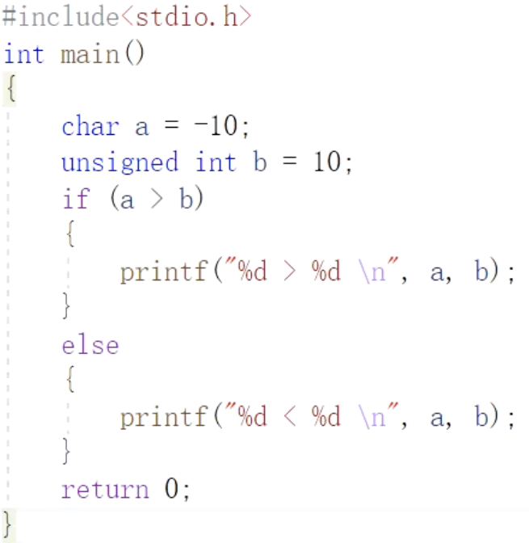
此段代码的运行结果是：`“-10 > 10”`
# 数据类型
## 基本数据类型
必须记住（包括占用字节数），融于血液中。
### 整型
1. `char`; 存放字符的ASCII码值。占用1字节
2. `short`; 短整型，占用2字节
3. `int`; 占用4字节
4. `long int`; 占用4字节
5. `long long`; 占用8字节
### 浮点
1. `float`; 单精度，占用4字节
2. `double`; 双精度，占用8字节
3. `long double`; 双双精度，当前VS编译器占用8字节，dev编译器占用12字节，将来可能占用16字节
### 新类型
`bool`; 占用1字节
### 无类型 - 也属于基本数据类型
`void`; 不能定义变量，所以不占用字节
## 各数据类型的区别

最大的区别在于在定义变量时，它们开辟的空间的字节个数不一样。
## 关键字sizeof

1. 计算**变量占用的存储空间**或**一种类型在定义变量时所占的存储空间**。**不是函数**！
2. 计算出来的数值类型为：`unsigned int`
3. 在编译时进行计算，而不是运行时进行计算。

示例：`int n = sizeof(char);`

```c
const int n = 5;
int ar[n] = {12,23,34,45,56};
sizeof(n);//4
sizeof(ar);//等于sizeof(int)*n 即4*5=20
```

# 变量、常量、标识符

## 变量

以某标识符为名字，其数值可以改变，可读可写。共有三个层次。
### 全局变量

定义在函数（包括主函数）之外的变量。

#### 作用域解析符——`::`

两个冒号，代表我要用全局变量。常用于全局、局部变量名冲突时区别出全局变量。

### 局部变量

定义在函数内部的变量。

### 块内变量

块内可见。块外不可见。

### 代码示例
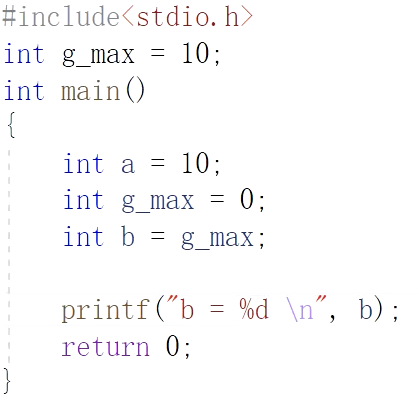
这段代码的输出结果为：“b = 0 ”。
#### 全局与局部冲突时的向上就近原则

说明一个规律、道理：当遇到的变量名字出现全局、局部的冲突时，按**向上就近原则**为主。
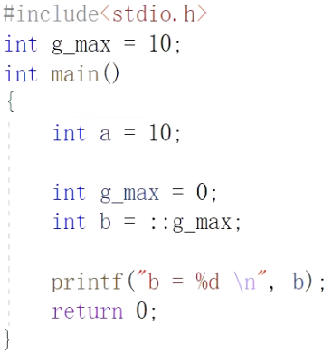
这段代码的输出结果为：`b = 10`。说明了`::`符的作用。
## 常量

其值不可改变，只读不写。
### 字面常量

要注意的是常量不只是有数值，常量也带有类型的意义。比如`7/2=3`。

编程与数学的区别：一个有穷一个无穷；一个有类型一个无类型。
### 宏常量

用#define定义的常量，叫做宏常量。

```C
#define PI 3.14
```

宏的根本概念是一种替换原则。

1. 无类型，只是暂时用字符串来表示
2. 不开辟存储空间
3. 结尾一般不加分号，如果加上分号则把分号也一起看作是替换的值。
4. 在预编译时遇到宏常量字符串时起作用，替换。可以在预编译后Debug文件夹下生成的\*.i文件中看到。
   

   
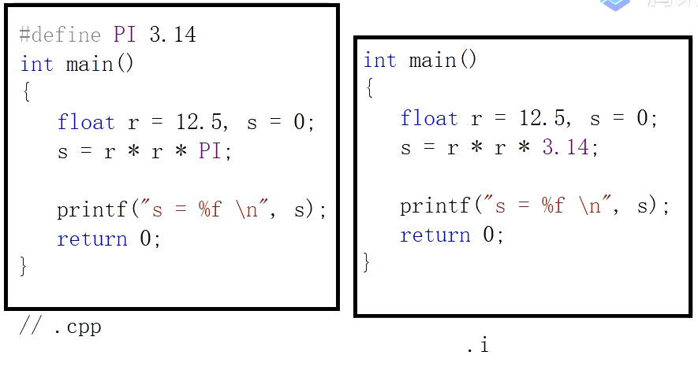
### 常变量

用const关键字修饰的变量，称为常变量。只可读取，不可改变。要开辟空间。
### 枚举常量（enum）

```c
enum week{
    Mon=1,
    Tues=2,
    Wed=3,
    Thurs=4,
    Fri=5,
    Sat=6,
    Sun=7};
```

枚举常量实际上是一种受到限制的**整型量**。不可以是小数。

1. 第一种受限的表现：x不能随便取值，只能从1、2、3、4、5、6、7中赋值。
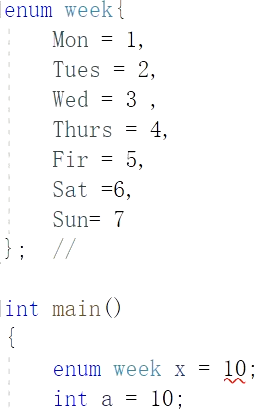
2. 第二种受限的表现：即使从1、2、3、4、5、6、7中赋值也要用定义枚举类的变量名赋值，不可直接用数字。
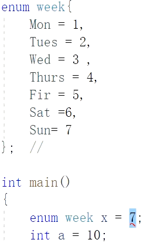
3. 正确写法：
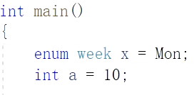
4. 其他约束：运算的约束，比如不可以自增自减。
5. 如果没给第一个变量赋值，则默认第一个变量为0，往后的变量值为依次加1；若没给中间某个变量赋值，则默认为上一个变量值加1。
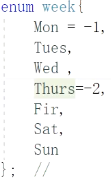
如上图，值依次为：-1、0、1、-2、-1、0、1
### 字符常量和字符串常量

`char ch = 'a';`

给变量ch中存放的不是字符`'a'`，而是字符`'a'`对应的ASCII码值。即编译后转换为`"char ch = 97;"`。

打开内存，查`ch`处的存储内容。发现存的是`97`的十六进制形式`61`。


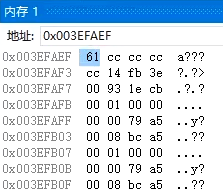
`char`是整型数据类型，`ch`存储的是ASCII码`97`，但输出的形式由我们决定，如果是`printf("%d \n", ch);`那么就是`97`。如果是`printf("%c \n",ch);`那么就是`a`。

关于字符对应的ASCII码，我们重点记忆几个字符即可，比如字符a是97，则可以推出其他字符的值。
#### 特殊符号 - 转义字符及其含义


重点记三个：
1. `\n`是换行符（LF），将当前位置移到下一行开头。ASCII码值是`10`。
2. `\r`是回车符（CR），将当前位置移到本行开头。ASCII码值是`13`。
3. `\t`是水平制表符（HT），跳到下一个TAB位置。ASCII码值是`9`。
4. `\0`是空字符，ASCII码值是`0`。**所以空字符可以有两种赋值形式:`char ch1 = 0;或char ch2 = '\0';`**
如果要表示反斜杠字符，可用`\\`转义。
##### 定界符

单引号是字符的定界符：`'a' -> |97|`。如果要表示单引号字符，可用`\'`转义。
双引号是字符串的定界符：`"a" -> |97|\0|`。如果要表示双引号字符，可用`\"`转义。
#### 关于空字符（`\0`）、空格字符（`' '`）和`'0'`字符
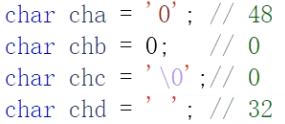
一定要区分。区分的关键是从ASCII码值来理解。
1. 空格字符**不是空字符**。**空格字符的ASCII码值是48**。
2. `char chb = 0;`和`char chc = '\0';`等效，都是给变量赋ASCII码值0。
3. 单引号中只有0的时候是字符'0'，其ASCII码值是48。
#### 头文件`<ctype.h>`
用来确定包含于字符数据中的类型的函数。
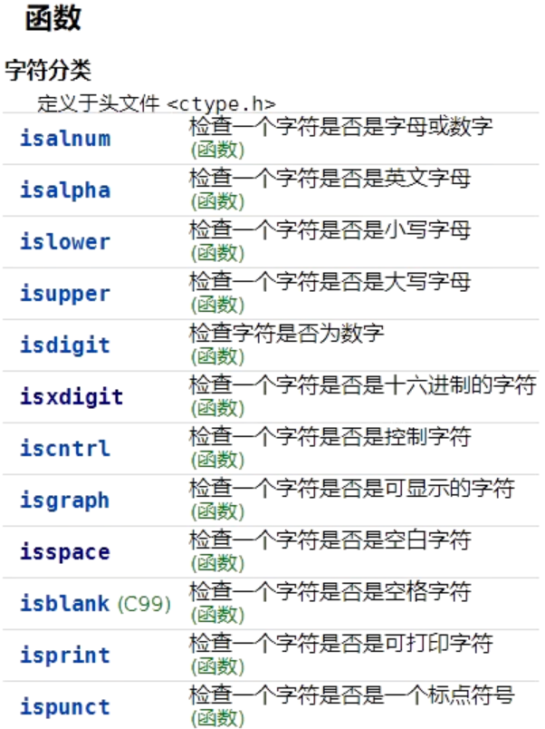
## 标识符

必须是**以下划线或字母开头**的**下划线、字母、数字的组合体**。

`_a`; `a4`; `_3`;均可

变量、函数起名时要见名知义，不要用汉语拼音，因为有同音异词，容易引起歧义。
# 定义和声明

## 定义

所谓的定义就是为这个变量分配一块内存并给它取上一个名字，这个名字就是我们经常所说的变量名。但注意，这个名字一旦和这块内存匹配起来，它们就同生共死，终生不离不弃，并且这块内存的位置也不能被改变。**一个变量在一定的区域内（比如函数内，全局等）只能被定义一次**，如果定义多次，编译器会提示你重复定义同一个变量或对象。
## 声明

什么是声明：有两重含义，如下：
第一重含义：告诉编译器，这个名字已经匹配到一块内存地址上了。（但是如果只是声明的话，不开辟内存空间）
第二重含义：告诉编译器，我这个名字我先预定了，别的地方再也不能用它来作为变量名。
## 示例


示例中`float pi = 3.14f;`，`f`表示此数据为单精度类型，若不带`f`默认为双精度。

# 顺序语句、选择语句、循环语句
## 顺序结构
按照语句出现的先后顺序依次执行。
## 选择结构
根据条件判断是否执行相关语句。
## 循环结构
当条件成立时，重复执行某些语句。

```c
//统计从键盘输入的一行字符的个数。
int main()
{
    int num = 0;
    printf("input a string\n");
    //char ch = '\0';
    //scanf_s("%c",&ch);
    //ch=getchar();
    while (getchar()!='\n')
    {
        num += 1;
    }
    printf("%d \n",num);
    return 0;
}
```

其中，`getchar();`等效于`scanf_s("%c",&ch);`，前者明显比后者简洁。
# 函数

通过函数，可以把一个复杂任务分解为若干个易于解决的小任务。充分体现结构化程序设计由粗到精、逐步细化的设计思想。


## 函数组成部分

```
返回类型 + 函数名称(形参列表)
{
　　函数体
}
```

## 进程与程序的关系


### 进程

进程是程序的一次执行。进程是动态的。

比如，在现实世界中，程序可以看作是乐谱，乐谱不会自己弹奏。有一钢琴，人坐下根据乐谱进行弹奏，弹奏乐谱的过程就是进程。

进程非常重要的概念：以时间为单位进行流失，在经过某几个时间点内要把程序全部执行直至结束。时间点有创建、执行、结束。

### 资源

又如，菜谱给了做饭步骤，菜谱自己不能凭空做出饭。按照菜谱的模式买菜，架火按照菜谱做饭。而做饭要有资源，油、水、调料、火等。

计算机中最重要的两个资源：**时间**和**空间**。

时间针对于CPU，空间针对于内存。

程序被执行时，任何一个进程，将会把用到的存储空间分配给四个区域——**代码区**(test area)、**数据区**(data area)、**堆区**(heap area)、**栈区**(stack area)。

1. data区存放程序的全局变量。
2. heap区对应着malloc和free开辟和释放的存储空间。
3. stack区存放函数中定义的局部变量。
## 可见性（作用域）

可见性指标识符能够被使用的范围：只有在作用域内的标识符才可以被使用。此阶段特性针对**编译和链接**过程。

1. 函数中定义的标识符，包括**形参**和**函数体中定义的局部变量**的作用域都只在该函数内，也称作函数域。
2. 文件作用域也称全局作用域，定义在所有函数之外的标识符，具有文件作用域。作用域为**从定义处到整个源文件结束**。文件中定义的全局变量和函数都具有文件作用域。
## 生存期

生命期指的是标识符从程序开始运行时被创建，具有存储空间，到程序运行结束时消亡时释放存储空间的时间段。此阶段针对的是程序的**执行过程**。

1. 局部变量的生存期是：函数被调用，分配存储空间；函数执行结束，释放空间。stack区。
2. 全局变量的生存期是：从程序执行前开始，到执行后结束。data区。

### 代码示例_生存期

```c
#include<stdio.h>
int* fun()
{
    int ar[10] = {12,23,34,56,78,89,90,100};
    printf("fun \n");
    for(int i = 0;i < 10;++i)
    {
        printf("%d ",ar[i]);
    }
    printf("\n");
    return ar;
}
int main()
{
    int* p = fun();
    printf("main \n");
    for(int i = 0;i < 10;++i)
    {
        printf("%d ",p[i]);
    }
    return 0;
}
```
#### 运行结果_生存期


调用的fun结果正常。而main再遍历ar地址时就失效了，后面的数都是随机数。

此例说明，函数的生存期只有在被调用时才拥有其存储空间，调用结束时，其存储空间将被释放。
#### 思考

数组ar的头地址中的值为何能一直保存？`main`函数自己调用时，为何除了`12`正确，其他都是乱的？

做了以下实验：如果让`fun`函数`return ar+1`，再在`main`函数中遍历，发现运行结果是

即：第一个数据`23`正确保留，后面全乱。由此，对程序的生存期又可见一斑。

但在`dev-C++`环境下不可实现`main`中`for`遍历（运行出错）。这又说明，**不同编译器对于生存期的定义也不尽相同**！

还做了另一实验：将`ar`数组大小调整至`10000`。还是输出`10`个数，输出却正常。

这个例子体现了**指针的失效**！

#### 解释

我们在调用函数时，都会开辟若干个栈帧提供函数中变量的存储空间。在main函数中调用fun()函数时，随即开辟了一些空间存放数组。最后虽然返回了原本数组的首地址并赋给了p指针，但调用结束后变量的生存期殆尽，空间被释放。printf()也是一函数，他的调用难免会覆盖刚才fun()函数占用的栈帧，即残留在栈帧中的数据被重写导致输出达不到预期以为的效果。

而把数组大小调至10000使fun()函数占用的栈帧很大，导致printf()函数等函数正好没有覆盖到刚才某些数组数据占用的空间，最后导致侥幸输出正确。但本质上p指针还是一个失效指针。
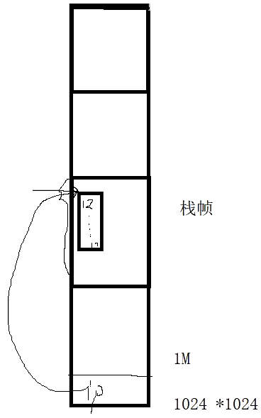
### 动态生命期

动态生命期对应动态内存的分配、管理。
# 数组

数组是包含给定类型的一组数据，即一组相同类型元素的集合。
# 运算符

## 操作数（Operand）

操作数（operand）是程序操纵的数据实体，该数据可以是数值、逻辑值或其他类型。该操作数既可以是常量也可以为变量。
## 运算符（Operator）

运算符（operator）是可以对数据进行相应操作的符号。如对数据求和操作，用加法运算符`'+'`，求积操作使用乘法运算符`'*'`等。

根据运算符可操作操作数的个数可分为一元运算符（单目运算符）、二元运算符（双目运算符）和多元运算符（C语言中只有一个三元运算符`" ? : "`）。
## 运算符优先级


## 运算符举例
### 取模运算符%
在C语言中有很多应用：
1. 判断是否能够整除某个数；
2. 判断奇偶数，判别质数；
3. 计算范围。形成循环。
```c
#include<stdio.h>
int main()
{
//以下均要求每五个数换一行
//从0输出100个数（0~99）
    for(int i=0;i<100;++i)
    {
        if(i%5 == 0 && i!=0)
        {
            printf("\n");
        }
    printf("%3d",i);
}
//重点是条件中加一个边界限制条件i!=0，如果没有的话会在输出前多余一行
//输出效果
//  0  1  2  3  4
//  5  6  7  8  9
//  ...
// 95 96 97 98 99

//从1输出100个数（1~100）
//如果只改变上述代码中for循环中的int i=1;i<=100会出现以下情况：
//  1  2  3  4
//  5  6  7  8  9
//  ...
// 95 96 97 98 99
//100
//所以我们要转变思路，主要转移点就是：先输出，后换行，并限制尾部边界条件，即100输出后不换行。
    for(int i=1;i<=100;++i)
    {
        printf("%3d",i);
        if(i%5==0 &&　i!=100)
        {
            printf("\n");
        }
    }
//而先输出数字后换行的模式如果对于0~99来说又失效了，会出现如下情况：
    for(int i=0;i<100;++i)
    {
        printf("%3d",i);
        if(i%5==0 &&　i!=100)
        {
            printf("\n");
        }
    }
//  0
//  1  2  3  4  5
//  6  7  8  9 10
// ...
// 96 97 98 99
//可进行如下改进
    for(int i=0;i<100;++i)
    {
        printf("%3d",i);
        if((i+1)%5==0 &&　(i+1)!=100)
        {
            printf("\n");
        }
    }
    return 0;
}
```

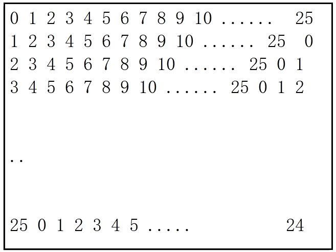

```c
//编程输出如上效果
//主要思路：两层for循环，用取余思想
#include<stdio.h>
int main()
{
    const int n = 26;
    for(int i=0;i<n;++i)
    {
        int k=i;
        for(int j=0;j<n;++j)
        {
            printf("%d",k);
            k=(k+1)%n;//精髓所在
        }
        printf("\n");
    }
    return 0;
}
```
4. 求最大公约数的辗转相除法（欧几里得算法）：`gcd(a, b) = gcd(b, a mod b)`
```c
#include<stdio.h>
int main()
{
    int a = 0, b = 0;
    int i = 0;
    scanf_s("%d %d",&a,&b);
//遍历算法
//i = a < b ? a : b;
//while(i>1)
//{
//    if(a%i==0&&b%i==0)
//    {
//        break;
//    }
//    --i;
//}
//printf("%d \n",i);
//辗转相除法--35和25：35%25=10;25%10=5;10%5=0
    while(b!=0)
    {
        int c = a % b;
        a = b;
        b = c;
    }
    printf("%d \n",a);
    return 0;
}
```

### 取余和取模的区别

对于整型数a，b来说，取模运算或者求余运算的方法都是求整数商
1. `c = [a/b];`
2. 计算模或者余数：`r = a - c * b`

求模运算和求余运算在**第一步不同**：取余运算在取商`c`的值时，向**0方向**舍入(`fix()`函数)；而取模运算在计算商`c`的值时，向**负无穷方向**舍入(`floor()`函数)。
例如计算：`-7 Mod 4`。那么： `a = -7; b = 4;`
第一步：求整数商`c`，如进行求模运算`c=-2`(向负无穷方向舍入)；求余`c = -1`(向0方向舍入);
第二步：计算模和余数的公式相同，但因`c`的值不同，求模时`r = 1`，求余时`r = -3`。
归纳：当`a`和`b`同号时，求模运算和求余运算所得的`c`的值一致，因此结果一致。当符号异号时，结果不—样。
**另外各个环境下`%`运算符的含义不同，比如`c/c++`、java为取余，而python则为取模。**
### `+=, *=`

```c
int a=3,b=5,c=7;
a *= b + c;
//a = a * (b+c); //36
```

说明：别看`*=`里面虽然带乘号，但是它的优先级是很低的。
### 前置`++`、后置`++`

如果没有赋值语句，效果完全一样：先取`a`、`b`中原数到临时空间`eax`（cpu的内部寄存器），临时空间数据`+1`，再把加`1`后的数值更新到`a`、`b`中。
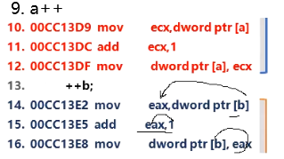
如果有赋值语句。则后置++是先把值赋给c，再+1回写；而前置++是先更新变量值，再赋值到c。

## 其他说明

1. 对于C语言程序，`++i`和`i++`效率是一样的；
2. 对于GoLang，只有`++i`，没有`i++`；
3. 在面向对象语言中如`C++`、Java、Python，`++i`效率比较高，`i++`效率低。至于为何，在C++部分讲述。
# 左值和右值

按字面意思通俗地说。以赋值符号`=`为界，`=`左边的就是左值，`=`右边就是右值。
更深一层，可以将`L-value`理解成可寻址。A value (computer science) that has an address；`R-value`表示可读。
# 指针

内存（在程序中称为主存DRAM）是计算机中重要的部件之一，它是外存（硬盘）与CPU进行沟通的桥梁。


计算机中所有程序的运行都是在内存中进行，为了有效的使用内存，就**把内存以8位二进制（bit）划分为存储单元（也就是 1 字节）**。为了有效的访问到内存的每个存储单元，就给内存存储单元进行了编号，这些编号被称为该**内存存储单元的地址**。


存储地址的变量称为指针变量。在C 语言中指针就是地址。
## 打印地址的方式
### `%x`

```c
#include<stdio.h>
int main()
{
    int a = 10;
    printf("%x \n",&a);//输出了：93fcb4，原本总共是8位，前面的00舍去了
    printf("%08x \n",&a);//输出了006ffbc4。%后面补上08，8代表宽度，0代表宽度不够的时候补0
    printf("%08X \n",&a);//输出了：001AFDA8。x由小写改为大写，代表字母以大写形式输出。
    printf("0X%08X \n",&a);//输出了：0X0113F944。%前加上了"0X"，完整、完美地表示了这是一个16进制数。
    return 0;
    
}
```
### `%p`

```c
#include<stdio.h>
int main()
{
    int a = 10;
    printf("%p \n",&a);//输出了：012FFBA4
    printf("%#p \n",&a);//输出了：0X00AFF8BC，但在VS2019里不支持，VS2012中可以。
    return 0;
}
```
## 该死的星号`*`

```c
C/C++ *
    int a = 10, b = 20;
	int c = a * b;
	
	int * p = &a;//*在此表达式中的作用只是声明、标识。a的地址给的是p而不是*p
	*p = 100;//与上面一句中的*作用不同，此处*的作用是指向、解引用。如果p是a的地址，那么*p就是a本身。
```

上述给了几个表达式。

`a`、`b`、`c`、`p`都是变量。**变量最根本的区别在于：类型**。

要彻底理解星号的不同用处，突破点在于对变量的类型的区分！

`int * p = &a;`此处`*`在左侧的作用只是一个声明。**声明p是一个int类型的指针变量**。就是说，你只要是整型变量，那么我`p`就可以存放你的地址。此例，`a`的地址给的是`p`而不是`*p`。所以`p`和`a`、`b`、`c`不同之处在于，`p`是一个`int`型指针，`a`、`b`、`c`只是`int`型。因此`int p = &a;`这句话就是错误的：`&a`是一个指针，而`p`是`int`型，类型不匹配，无法存放。

`*p = 100;`与`int * p = &a;`中的`*`作用不同，此处`*`的作用是指向、解引用。也就是说，**如果p是a的地址，那么`*p`就是`a`本身**。此处不要拿“间接访问”来解释，在语法上没有这回事。
## 指针的两个值


比如：`int a = 10;` `int* p = &a;`

一个是本身的值，即本身存储的值，即本身存储的某个地址值。即`0x0055f864`。此值说明了其指向谁。即`&a`。

另一个是本身存储的地址值的真实内容值，即`a`。

虽然`p`是一个指针，但它也是一个变量，所以他也有自己的地址，即`0x0055f84c`。
## 逻辑名称与物理地址

比如：我要到邢同学的宿舍去，邢同学的宿舍就是逻辑名称，而12公寓328是其物理地址。那么，邢同学的宿舍和12公寓328实际上就是同一空间。
## 对应到内存条上


> 可以拓展的知识点：小端存放与大端存放

## 指针类型的sizeof

32位机的指针一概都是4；64位机的指针一概都是8！

因为**不管你是char类型、短整型、整型的变量的地址，都只是存放首地址**，对于64位机，某一类型的首地址就占用64位bit位，8个字节才能存放；同理，对于32位机，某一类型的首地址就占用32位bit位，4个字节才能存放。

## 指针的类型

### 野指针

```c
#include<stdio.h>
int main()
{
    int a;
    int* p;
}
```

就像a未初始化，不清楚其值是多少一样。未初始化的p也不知道其指向的是哪个地址。此类指针叫做野指针。
### 空指针

```c
#include<stdio.h>
int main()
{
    int* p=NULL;//此处将用0代替NULL赋值
    int* s=nullptr;//此处将用(void*)0代替nullptr赋值
}
```

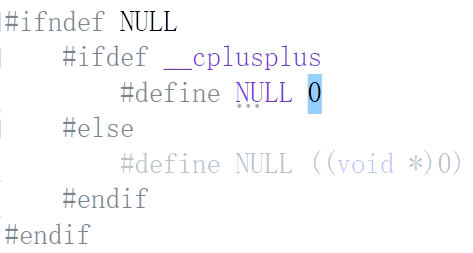
### 失效指针

### [代码示例](#代码示例_生存期)

```c
#include<stdio.h>
int * fun()
{
    int ar[10]={12,23,34,45,56,67,78,89,90,100};
    int* p=&ar[0];
    return p;
}
int main()
{
    inr* ip=fun();
    for(int i=0;i<10;++i)
    {
        printf("%d",*ip);
        ip=ip+1;
    }
}
```

[运行结果](#运行结果_生存期)
## NULL与nullptr

实际上还是有一些小的区别。

```c
int* p = NULL;//此处将用0代替NULL赋值
int* s = nullptr;//此处将用(void*)0代替nullptr赋值
```

# 结构体

程序开发人员可以使用结构体来封装一些属性，根据原有的类型，设计出新的类型，在C语言中称为结构体类型。
在C语言中，结构体是一种数据类型。
## [C语言中的类型](#基本数据类型)

`char; short; int; long int; long long; float; double; long double; bool;`都是**基本类型**。

`char*; short*;`这种指针类型和`int ar[10]; br[20];`这种数组类型都叫做**结构类型**。
## 结构体的使用

```c
#include<stdio.h>
struct Student
{
    char s_id[10];//学号
    char s_name[10];//姓名
    char s_sex[5];//性别
    int s_age;//年龄
};
int main()
{
    //定义结构体变量并初始化
    struct Student stud={"202001","tulun","man",15};
    //sizeof(stud)?
    //使用.（成员选择(对象)运算符）访问结构体变量的成员
    printf("id: %s \n",stud.s_id);
    printf("name: %s \n",stud.s_name);
    printf("sex: %s \n",stud.s_sex);
    printf("age: %d \n",stud.s_age);
    return 0;
}
```

## 结构体的访问形式

```c
Student  sx = {...};
Student* sp = &sx;

形式一：(*sx).s_id = 202001;//注意，*（取值运算符）优先级低于.（成员选择(对象)运算符），使用必须给*sx加上括号，否则sx直接先和.结合，导致错误。
形式二：sp->s_id   = 202001;//成员选择(对象指针)运算符
```

> 掌握如何计算结构体的sizeof。
# 文件

## 数据流

指程序与数据的交互是以流的形式进行的。进行C语言文件的存取时，都会先进行“打开文件”操作，这个操作就是在打开数据流，而“关闭文件”操作就是关闭数据流。
## 缓冲区（Buffer）

指在程序执行时，所提供的一块存储空间（在内存中），可用来暂时存放做准备执行的数据。它的设置是为了提高存取效率，因为内存的存取速度比磁盘驱动器快得多。

C语言的文件处理功能依据系统是否设置“缓冲区”分为两种：一种是设置缓冲区，另一种是不设置缓冲区。由于不设置缓冲区的文件处理方式，必须使用较低级别的 I/O 函数(包含在头文件`io.h`和`fcntl.h`中)来直接对磁盘存取，这种方式的存取速度慢，并且由于不是C的标准函数，跨平台操作时容易出问题。下面只介绍第一种处理方式，即设置缓冲区的文件处理方式。

当使用标准I/O函数（包含在头文件`stdio.h`中）时，系统会自动设置缓冲区，并通过数据流来读写文件。当进行文件读取时，不会直接对磁盘进行读取，而是先打开数据流，将磁盘上的文件信息拷贝到缓冲区内，然后程序再从缓冲区中读取所需数据，如下图所示：


## 文件类型

分为文本文件和二进制文件两种。

文本文件是以字符编码的方式进行保存的。二进制文件将内存中数据原封不至文件中，适用于非字符为主的数据。

如果以记事本打开，只会看到一堆乱码。

其实，除了文本文件外，所有的数据都可以算是二进制文件。二进制文件的优点在于存取速度快，占用空间小，以及可随机存取数据。

## 文件存取方式

包括顺序存取方式和随机存取方式两种。

顺序读取也就是从上往下，一笔一笔读取文件的内容。保存数据时，将数据附加在文件的末尾。这种存取方式常用于文本文件，而被存取的文件则称为顺序文件。

随机存取方式多半以二进制文件为主。它会以一个完整的单位来进行数据的读取和写入，通常以结构为单位。

## C语言提供的标准文件

通常把显示器称为标准输出文件，`printf`就是向这个文件输出数据；

通常把键盘称为标准输入文件，`scanf`就是从这个文件读取数据。


# 关键字
## const

const在实际编程中用得比较多，const是constant的缩写，意思是“恒定不变的”！它是定义**只读变量**的关键字，或者说 const 是定义常变量的关键字。（可读，不可写）

const可以修饰变量，数组，指针等；说const定义的是变量，但又相当于常量；说它定义的是常量，但又有变量的属性，所以叫常变量。

用const定义常变量的方法很简单，就在通常定义变量时前面加 const 即可，如：`const int a = 10;`或`int const a = 10;`而且**可以修饰任何类型的变量**，包括数组。

那么用const修饰后和未修饰前有什么区别呢？用const定义的变量的值是不允许改变的，即不允许给它重新赋值，即使是赋相同的值也不可以。所以说它定义的是只读变量。这也就意味着**必须在定义的时候就给它赋初值**。无论是全局常变量还是局部常变量都必须初始化赋值。
### 注意事项

```c
#include<stdio.h>
int main()
{
    const int a = 10;
    int* ip = &a;//这种写法是错误的，会产生二义性，因为这样写的意义何在？你的a到底能变还是不能变！
    //有一种办法能让此语句成功编译，就是强转类型：int* ip = (int*)&a;但是强转类型会出乱子。详看下文《一家网络公司的某个试题》。
    //还有一种办法能成立，就是把左式声明部分加上const来修饰，即const int* ip = &a;这样做：ip就可以指向a了，但不可以通过ip改变a。而且这样做会导致下面的语句"*ip = 100"报错：“表达式必须是可修改的左值”。因为ip指向的值是拿const修饰的，此处就识别为不可修改了！
    *ip = 100;
    return 0;
}
```

总结：const不只能修饰普通类型、数组，还能修饰指针（比如修饰指针的其一种特性——**修饰指针的指向能力**，达到了保护的效果，就如`const int* ip = &a`，达到了通过ip只能读取a，不可写的效果）。以此类推，C语言还有：`int* const is;` `const int* const ir;`其中`const int* const ir;`的前一个指针是修饰指向不可改变，后一个const是修饰指针自身不可改变。
### 一家网络公司的某个试题

```c
#include<stdio.h>
int main()
{
    const int a = 10;
    int b = 0;
    int* ip = (int*)&a;
    *ip = 100;
    b = a;
    printf("a = %d \n",a);
    printf("b = %d \n",b);
    printf("*ip => %d \n",*ip);
    return 0;
}
```

`*.cpp`文件的运行结果如下，此结果是比较符合const这个关键字的功能的。


但是，此运行结果却和调试过程中的显示结果不一致！


前九行运行是符合普通人（没有深刻理解const）的思路的，`a`通过指针`ip`被赋值`100`。但奇怪的是：第十行运行后`b=a;`这个语句居然是给`b`赋值了`10`。

另外，c文件的输出结果却是：


这又是怎么一回事？详见下面《解释》的论述。
#### 解释
##### cpp文件下的结果
在`*.cpp`文件中，const变量和宏变量都是替换机制来实现的，但const是在编译时期替换的，宏变量是在预编译时期替换的。


再来一段汇编代码，发现`a=b;`这条语句并不是把a取值给b，而是用`0Ah`（10的十六进制）直接赋给b。

所以，无论输出前对a进行了哪些操作都是徒劳的，因为a早已“偷梁换柱”，所以就会出现了我们单步跟踪结果和最终输出结果不一致的情况。

上例给我们一个启发，不要相信你的眼睛，而要相信你所分析的代码。
##### C文件下的结果

C文件下的结果居然又成了`a=100, b=100, *ip=100`。接下来我们来分析：
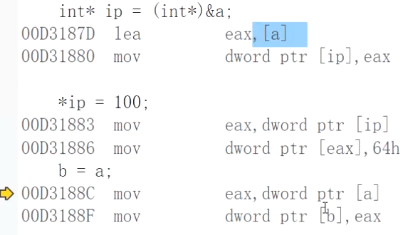
对于`b=a;`这个语句，我们可以看出：不像cpp文件那样用`0Ah`直接赋值，而是先取a的值再赋给b。因为`*ip`改变了a的值，所以b的值也将受到影响。
#### 总结
对于被const关键字修饰的变量：在cpp文件下是编译时期用具体值替换变量名；而在c文件下，编译时期不替换。于是造成了输出结果的差异。
#### 拓展--汇编与程序的联系
**汇编层面下的赋值**（`b=a;`）
cpu中包含着4个通用数据寄存器：叫做`eax`、`ebx`、`ecx`、`edx`。cpu在进行加减乘除、数据运算时不是在内存中运算的，而是把内存数据拉到寄存器中计算，因为内存的计算速度远比cpu计算速度慢。
所以，就出现了为何`b=a;`在汇编语言层面上是取出a的值给eax再由eax赋值给b，而不是a直接赋值给b。

DMA方式，也叫做I/O协处理器。当我们内存要移动大块数据时，如果要介入cpu的话太影响运行效率，所以我们大块数据交给DMA（协处理器）进行数据移动，从而把CPU资源腾出来用于计算，提高效率。
**汇编层面下的解引用**（`*ip=100;`）

首先把ip的值放入到寄存器eax中，那么eax的值就相当于a的地址，再往下，把`64h`（100的十六进制）给了`[eax]`。此时注意：`mov eax,10;`和`mov [eax],10;`这两种访问方式不一样。前者是直接访问方式，把10给了eax；后者是间接访问方式，不是把10给了eax，而是把10给了eax所存放的某个地址里。因此，直接访问是一步汇编实现，间接访问是两步汇编实现，所以直接访问效率要高于间接访问。
## sizeof关键字
已在上面章节论述。

此处再引入几个有启发的例子。
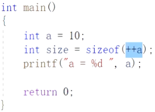
此题运行后的size还是4，a还是10！可从汇编角度观察究竟！
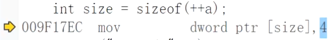
启示：**sizeof只在编译时期计算**而不是运行时期计算，相当于直接替换为4。因此`++a`这个`++`的动作就失去了意义，编译时就直接略去了`++`这个操作。因此后面a的值没有变化。
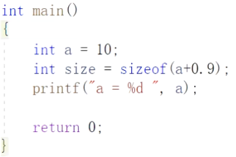
此程序运行后的size大小为8，即double类型所占用的空间。因为在编译时期sizeof就识别到了`(a+0.9)`这个数值为double类型。
**sizeof的本质是只关心你此处的数值最终的类型**。
### sizeof和strlen的差异
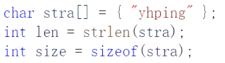
实际结果为：len为6，size为7。因为字符串实际占用了7个字节。字符串的最后是要有`\0`结尾的；而len的计算是：一碰到`\0`就结束计算。
## typedef

typedef是在计算机编程语言中用来为复杂的声明定义简单的别名。它本身是一种存储之类的关键字，与`auto`、`extern`、`mutable`、`static`、`register`等关键字不能出现在同一个表达式中。

```c
#include<stdio.h>
typedef unsigned char u_int8;
typedef unsigned short u_int16;
typedef unsigned int u_int32;
typedef unsigned long long u_int64;
int main()
{
    u_int8 a;//等效于unsigned char a;
    u_int64 x;//等效于unsigned long long x;
    return 0;
}
```

一定要记住：凡是合法的变量名声明、数据声明、指针声明，加一个typedef后我们就可以把变量名转换为类型名，把变量声明定义转换为类型声明定义。

```c
unsigned int UNIT;//原来的变量名声明
typedef unsigned int UNIT;//UNIT由一个全局变量转换成了一个类型！
UNIT a;
```

```c
int Array[10];
typedef int Array[10];//Array由全局变量转换成了一个“开辟10个空间的整型数组类型”
Array ar,br,cr;
```

有人这么认为：认为typedef是用替换原则来实现的，如把`"Array"`替换为`"int[10]"`，即`Array ar, br, cr;`替换为`int[10] ar,br,cr;`，这是不对的。它是一种类型的**声明**概念。

```c
int* PINT;
typedef int* PINT;
PINT p,s;//p,s是什么类型呢？回到typedef int* PINT;，把typedef去掉即可得知——p和s都是int*类型。
```

上例中，`PINT p,s;`和`int* x,y;`是有区别的！我们在编译器中发现，x是整型指针变量，而y是整型变量。因为声明时，我们的星号`*`要和标识符结合，而不是和类型名结合。所以当我们涉及到为多个指针声明时，用到typedef的方式就特别好。


```c
struct ListNode
{
    int data;
    ListNode* next;
};
ListNode* LinkList;//原本是一个“某一结构体类型的指针变量”
typedef ListNode* LinkList;//由全局结构体指针变量转变为了一个类型
//如此定义，那么以下两句就等效
ListNode* p;
LinkList s;
```

```c
//此时，LinkList原本是一个“全局结构体类型的指针变量”
struct ListNode
{
    int data;
    ListNode* next;
}*LinkList;
//我们也加上一个typedef，现在，LinkList就不再是一个指针变量了，而是一个类型。
typedef struct ListNode
{
    int data;
    ListNode* next;
}*LinkList;
//实际上，以上这种typedef直接在定义结构体时加在前面的写法和typedef ListNode* LinkList;这种写法也是等价的。
```

```c
//再来一个奇怪的例子：
//首先，我们知道，int int;是不可能这样声明定义变量名的。因为他拿关键字（基本数据类型名）来起名字。
//但如果没拿关键字起名字的话，变量名和类型名可以一样吗？
struct ListNode
{
    int data;
    ListNode* next;
};
ListNode ListNode;//是可以编译通过的，最多就是警告。
//答案是可以一样！因为此类型名、变量名并非关键字，只要符合标识符的命名规范，是没有任何影响的！

//因此，下例的ListNode原本是一个“结构体类型的变量名”
struct ListNode
{
    int data;
    ListNode* next;
}ListNode;
//如今我们在结构体定义前加一个typedef，他就可以变为了一个类型名！
typedef struct ListNode
{
    int data;
    ListNode* next;
}ListNode;
//那么，
typedef ListNode ListNode;//就与之等效。
//这种定义方式常常出现在开源项目中，迷惑调试器，追踪变量时搞混变量名和类型名。为的就是不让你看懂。
```

```c
//如此，理解了typedef的含义。我们可以如下使用
typedef struct ListNode
{
    int data;
    ListNode* next;
}ListNode,*LinkList;
int main()
{
    ListNode a;
    LinkList p;
    p = &a;
    return 0;
}
```

```c
//也可用作对枚举类型的定义
typedef enum{OK = 0,ERROR = 1} Status;
```
## static
### 修饰局部变量
静态关键字对于局部变量来说是延长寿命的。也就是说，函数只有被调用时，局部变量才会被初始化，函数调用结束时会释放掉所有局部变量。如果我们给局部变量加上了static修饰，那么函数在第一次被调用时初始化了局部变量，即使调用结束后，局部变量也不会释放，即局部变量的寿命比函数要长。

```c
#include<stdio.h>
void fun(int x)
{
    int a = x;
    int b = 0;
    ++a;++b;
    printf("a : %d b = %d \n",a,b);
    return;
}
int main()
{
    for(int i=10;i>0;--i)
    {
        fun(i);
    }
    return 0;
    //将输出：
    //11 1
    //10 1
    //9  1
    //...
    //2  1
}
```

```c
#include<stdio.h>
void fun(int x)
{
    static int a = x;//这一步是定义a并对a初始化，只执行一次。
    int b = 0;
    ++a;++b;
    printf("a : %d b = %d \n",a,b);
    return;
}
int main()
{
    for(int i=10;i>0;--i)
    {
        fun(i);
    }
    return 0;
    //将输出：
    //11 1
    //12 1
    //13 1
    //...
    //20 1
    //此输出结果说明，虽然fun(i)一直在给x传参赋值给a，但是实际上是无效的，因为声明定义语句已经在第一次调用fun函数进行了，“一劳永逸”了
}
```

对于第二段代码：在函数被第一次调用时，我们创建a，并把它存放到数据区（data area）。函数结束后，a也不释放。第二次调用时，`static int a = x;`这一语句不再执行。这一步是定义a并对a初始化，只执行一次。但是写成`a = x;`就不一样了。`a = x;`是一句执行语句，在每次函数调用也还是要执行的！

但，static修饰局部变量不改变其作用域。
### 修饰全局变量

而static修饰全局变量时，不改变其生存期，而改变其可见性（只能在当前cpp文件中可见，即使其他文件中的代码拿extern来修饰这个变量，同一工程的另外cpp文件也不可见）。
## extern

extern用在全局变量或函数的声明前，用来说明“此变量/函数是在别处定义的，要在此处引用”。

假如我们同一个工程下有两个cpp文件，其中有一cpp文件用到了另一个cpp文件的内容。从理论上讲，两个cpp文件各自编译后形成了各自的obj文件，之后链接到了一个exe文件下（这个exe文件就是以工程为单位生成的），理论上，`Test7_10`文件中的`g_max`和`fun()`可以自然地调用`yhp`文件中的变量、函数。编译是可以进行的，但是，生成是不通过的。


我们这时就需要在`Test7_10.cpp`中添加代码了：如下才能运行成功。
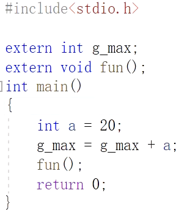
如果在一个cpp文件中，我们不想让其他文件用extern来调用自己的内容，我们可以在这些内容前加上static修饰（需要是全局变量）。因为，在全局变量前加static会改变其可见性。（只能在当前cpp文件中可见，即使其他文件中的代码拿extern来修饰这个变量，同一工程的另外cpp文件也不可见）。

而如果一个cpp文件已经拿static修饰了变量名，另一个cpp还用extern来引用的话，就会失败，这时出现了下面要论述的技术，也就是让这个引用失败的机制——名字粉碎技术。
### 名字粉碎技术
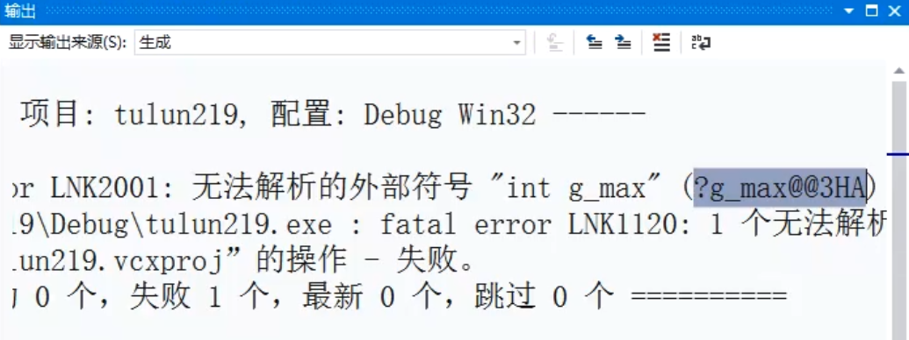
# VS2019的使用

### 创建项目


## scanf的注意事项

S2019中不再使用`scanf`，而是换为了`scanf_s`。
输入数据时，要严格按照双引号内的格式来输入。
### 为何要用`scanf_s`替换`scanf`？

scanf不安全。比如我们定义了一个`int a = 10;` `char buff[8];`
如果用`scanf("%s",buff);`输入字符串超过8位时，比如输入`yhpingaaaaaaaa`，会把a中的信息“冲掉”。（仅限于`VC++ 6.0`这种比较古老的编译器中）
最后用`printf("a=%x",a);`查看a时，发现`a=61616161`。61是十六进制，转为十进制为97，表示字符`'a'`的ASCII码值。所以此处就体现出了scanf对内存的不安全性。
而`scanf_s`则避免了这个问题，我们可以在输入时加一个参数：`scanf_s("%s",buff,8);`限制输入字符串的长度。
# 有启发意义的代码实验


首先我们要清楚16进制与2进制之间的关系，才能清楚存储空间是如何存储数据的。**存储空间中对数据的存放是以十六进制形式存储的**，接下来是对此的举例解释：

比如int占了4个字节，等于占了32个二进制位，而4个二进制位可以转换为1个16进制位，于是int存储的数据可以由`32/4=8位16进制位`来表示。比如我们`int i = 10;`那么在存储空间中就是`(0a 00 00 00)16`。十进制的10转换成了十六进制的a。

接下来我们再来解释为何输出了`"a=61616161"`：

函数中的变量是存放在栈区的，因为先定义了`a`，栈底开辟`a`的空间，`a`占用4个字节先存放数值`12`。而后，`char`类型的`buff[8]`数组占用`a`之上的`8`个字节；`scanf`输入`%s`时，不直接存放字符串，而是存放字符串的ASCII码值，比如字符`'a'`的ASCII码值是91，再转换为十六进制值`61`。在存放了一部分字符串`"yhpingaa"`之后，原本在内存中给`buff`数组存放的空间不足，剩下的`"aaaaaa"`就由上到下（小端存放方式--高位地址存高位数据，低位地址存低位数据）覆盖到了内存中给a变量开辟的存储空间的4个字节中去了，并且还有可能占用了a空间以外的未知内存资源中，因为`int a`只能存放4个字节即4个字符值，而剩余a的数目超过了4个。