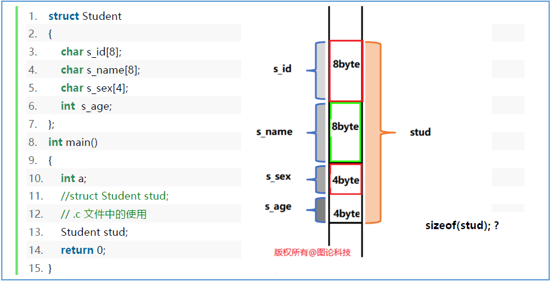
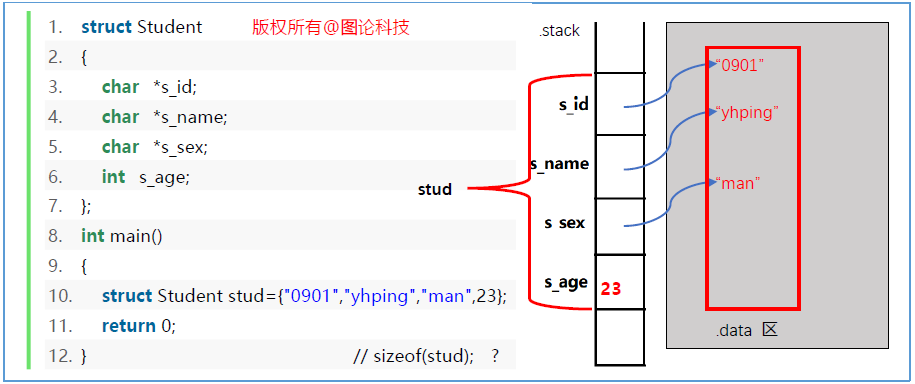
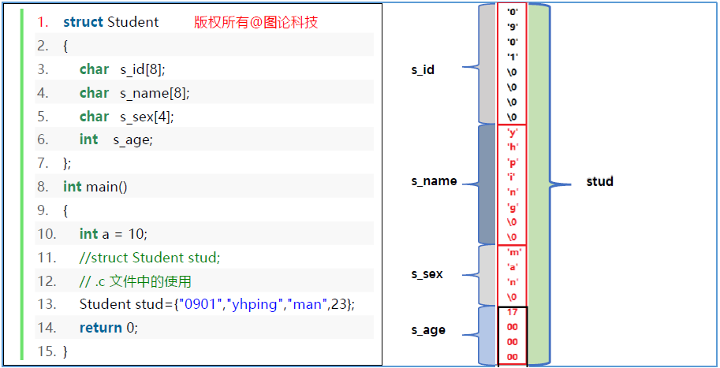
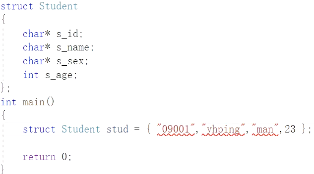
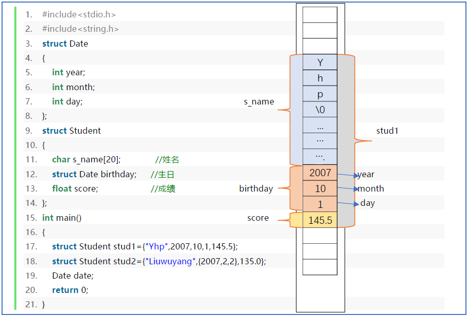
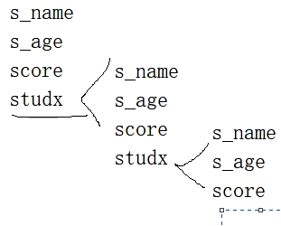
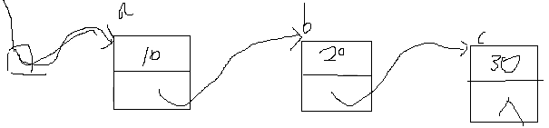
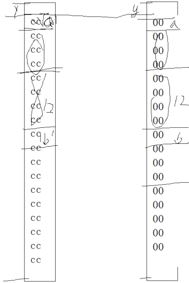
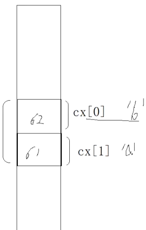

# 本章内容

1. 结构体类型的设计
2. 结构体变量初始化
3. 结构体成员访问
4. 结构体与数组
# 结构体类型的设计

C 语言提供了基本数据类型，如 `char`, `short`, `int`, `float` 等类型，我们称之为内置类型。
程序开发人员可以使用结构体来封装一些属性，设计出新的类型，在 C 语言中称为结构体类型。
在 C 语言中，结构体是一种数据类型。（由程序开发者自己设计的类型）
可以使用结构体（struct）来存放一组不同类型的数据。结构体的定义形式为：
```c
struct 结构体名
{
    成员列表（可以是基本数据类型，指针，数组或其它结构类型）
};
```
## 我们自己设计一个学生类型

客观事物（实体）是复杂的，要描述它必须从多方面进行，也就是用不同的数据类型来描述不同的方面。如学生实体可以这样来描述：
1. 学生学号（用字符串描述）
2. 学生姓名（用字符串描述）
3. 性别（用字符串描述）
4. 年龄（用整型数描述）。
这里用了2种不同数据类型，以及四个**数据成员**（data member）来描述学生实体。
（数据成员，也可称之为属性，不能称之为函数中的变量概念）


# 结构体变量的定义和初始化

既然结构体是一种数据类型，那么就可以用它来定义变量。结构体就像一个“模板”，定义出来的变量都具有相同的性质。
也可以将**结构体比作“图纸”，将结构体变量比作“零件”**，根据同一张图纸生产出来的零件的特性都是一样的。
**结构体是一种数据类型，是创建变量的模板，不占用内存空间；结构体变量才包含了实实在在的数据，需要存储空间**。
## 结构体变量在内存中表示

思考下述代码结构体在内存中的分配是A情况还是B情况？

```c
struct Student
{
    char s_id[8];
    char s_name[8];
    char s_sex[4];
    int s_age;
};
int main()
{
    int a = 10,b = 20;
    struct Student s1 = {"09001","yhping","man",23};
    return 0;
}
```


答案是A，即结构体成员的内存分布顺序是从上到下依次排列。为什么不是像a,b那样的顺序？

我自己的解释：结构体的类型结构声明不像函数中变量的声明定义。我们要区分类型内部的成员和函数内部的变量，两者是截然不同的！结构体类型的抽象是一种类型，是由若干其他类型组成的一种新类型，那么类型内部的成员必然要按照我们在定义时的顺序从上到下分布内存空间，才符合程序设计的逻辑思路。按照如此规则如此分布，才能方便我们进行后续的给结构体变量初始化赋值，大括号内的值的顺序是按照成员顺序来的，而不是随意颠倒顺序，编译器是不会同意的。

示例


如果把`char`数组改为指针：

## 结构变量初始化



大括号内的值的顺序是按照成员顺序来的，而不是随意颠倒顺序，编译器是不会同意的。



如果把char数组改为指针：

这时按照上图的赋值方式，在VS2019中是不能通过的，因为，`"09001"`这种双引号引起来的字符串的类型是常量字符串型即`const char*`（要给`s_id`赋的值本质是字符串首字符`'0'`的指针，此指针只能读数据不能改数据，因此类型是`const char*`），与我们在结构体中声明的`char*`不匹配。

## 结构体嵌套结构体



思考以下结构是否可行？

```c
struct Student
{
    char s_name[8];
    int s_age;
    float score;
    struct Student studx;
};		//sizeof(Student)是计算不出来的，因为如此定义会导致无穷的递归下去。不能被sizeof计算的类型因此也叫做不完整的类型。
```


## 结构体链接结构体

```c
struct Student
{
    char s_name[8];
    int s_age;
    float score;
    struct Student* next;//如此定义才可行。
};		//sizeof(Student)==16
int main()
{
    struct Node a,b,c;
    struct Node* head = &a;
    a.data = 10;
    a.next = &b;
    b.data = 20;
    b.next = &c;
    c.data = 30;
    c.next = NULL;
    
    return 0;
}
```


如何使用循环打印？

```c
void Print_List(const struct Node* head)
{
    const struct Node* p = head;
    while(p!=nullptr)
    {
        printf("%d ",p->data);
        p = p->next;
    }
}
```

# 结构体成员的访问

结构体变量的成员使用`.`访问。
获取和赋值结构体变量成员的一般格式为：`结构体变量.成员名`；
## 结构体变量成员的访问

```c
#include<stdio.h>
#include<string.h>
struct Date
{
	int year;
	int month;
	int day;
};
struct Student stud1
{
	char s_name[20]; //姓名
	struct Date birthday; //生日
	float score; //成绩
};
int main()
{
	struct Student stud1={"Yhp",2007,10,1,145.5};
	struct Student stud2={"Liuwuyang",{2007,2,2},135.0};
    
	int y = stud1.birthday.year;//用.访问结构体变量的成员
    struct Student* sp = &stud1;
    sp->s_name;//用->访问结构体变量指针对应的结构体变量的成员
    (*sp).s_name;//用.访问结构体变量的成员
    sp->birthday.year;//前sp是指针，后birthday是结构体，所以前用->后用.
    
	return 0;
}
```

## 结构体变量（的成员）的赋值

对结构变量整体赋值有三种情况：
1. 定义结构体变量（用{ }花括号初始化）；
2. 用已定义的结构变量初始化；
3. **结构体类型相同的变量可以作为整体相互赋值**。

在其他情况的使用过程中只能对成员逐一赋值。
在 C 语言中不存在对结构体类型的强制转换（和内置类型的区别）。

```c
struct Student
{
	char s_id[8];
    char s_name[8];
    char s_sex[4];
    int s_age;
}Student;
int main
{
    Student stda={"09001","xcg","M",23};
    Student stdb=stda;//调用了memcpy(&stdb,&stda,sizeof(stda));
    Student stdc;
    Student stdx;
    stdc = stda;
    stdx.s_name = stda.s_name;//此语句是错误的。
    strcpy_s(stdx.s_name,stda.s_name);//正确的做法！
}
```

### 关于两结构体变量整体赋值如何实现

首先，抓住两个结构体变量各自的地址，再依次同步迭代拷贝，调用的函数是`memcpy();`如`memcpy(&stdb,&stda,sizeof(stda));`
### 关于上面提到的错误赋值

`stdx.s_name = stda.s_name;`此语句是错误的。`

为什么？

`s_name`是一个数组，数组是不可能给另一个数组直接赋值的。因为：`s_name`代表首元素指针，根据我们数组那一节的知识储备，这个指针是常量（即数组名所代表的指针），`stdx.s_name = stda.s_name`这个语句的意思是把`stda.s_name`这个指针赋给`stdx.s_name`这个指针，这显然是不可行的，数组首元素指针不可能改变！

同理，数组名不可以`++`，如已知`int ar[100]={};`的`ar`数组，`ar++`这个语句是错误的。

应该对数组进行全部迭代拷贝，如调用`strcpy_s(stdx.s_name,stda.s_name);`

### 与数组`{}`花括号赋值的异同

不同点是：数组的花括号内的值类型必须一致，而结构体花括号内的值可能不一致。

共同点：如果`{}`花括号内的内容缺省，默认赋值为0。

## 结构体变量和函数

拿打印函数举例


二个打印函数那个好 ？ 原因是什么？


二个打印函数那个好 ？ 原因是什么？和指针比较的优势？ 限制条件是什么？

肯定是`Print_c`好。优势在于如果不是用指针来传值，那么还要再次开辟空间且给形参复制源变量的信息，导致空间和时间的效率都大大降低。而用指针来传值，直接能操作源变量。而用`const`来读取信息更为谨慎，因为`const`能保证该指针只能读取变量信息而不能改变变量信息。

# 结构体的大小

```c
struct Node_a
{
    char ca;
    int sum;
    char cb;
}
int main()
{
    struct Node_a ax;
    printf("%d %d \n",sizeof(struct Node_a),sizeof(ax));//12 12
}
```

## 为什么要理解字节对齐问题

1. 内存大小的基本单位是字节，理论上来讲，可以从任意地址访问变量，但是实际上，cpu并非逐字节读写内存，而是以 2, 4 或 8 的倍数的字节块来读写内存，因此就会对基本数据类型的地址作出一些限制，即它的地址必须是 2，4 或 8 的倍数。那么就要求各种数据类型按照一定的规则在空间上排列，这就是对齐。
2. 有些平台每次读都是从偶地址开始，如果一个 int 型（假设为 32 位系统）如果存放在**偶地址**开始的地方，那么一个读周期就可以读出这 32 bit，而如果存放在**奇地址**开始的地方，就需要 2 个读周期，并对两次读出的结果的高低字节进行拼凑才能得到该 32 bit 数据。显然在读取效率上下降很多。
3. **由于不同平台对齐方式可能不同，如此一来，同样的结构在不同的平台其大小可能不同，在无意识的情况下，互相发送的数据可能出现错乱，甚至引发严重的问题**。
## 计算规则

由于存储变量地址对齐的问题，计算结构体大小的 3 条规则：
1. 结构体变量的首地址，必须是结构体变量中的“最大基本数据类型成员所占字节数”的整数倍。
2. 结构体变量中，相对于**结构体首地址**，**每个成员**的**偏移量**，都是**成员本身基本数据类型**所占字节数的整数倍。

   ```c
   struct Node
   {
       char ca;//偏移地址为0，占1字节。偏移地址1-7起地址对齐占位作用，内容无实际意义。
       double dx;//偏移地址为8，占8字节。因为要满足原则2即double的偏移量要相对于结构体首地址（视为0），是成员本身基本数据类型所占字节数的整数倍。只有在偏移地址8时，才满足(8-0)/8==1。
       char cb;
   };//24
   ```
3. 结构体变量的总大小，为结构体变量中 “最大**基本数据类型**成员所占字节数”的整数倍。

### 实例/测验

```c
struct node
{
    char cha;
    double da;
    char chb;
};//24,因为da是从0x08开始的。cha和chb都占了8个
```

```c
struct sdate
{
    int year;
    int ia;
    int day;
};
struct Student
{
    char s_id[10];//1-10
    char s_name[8];//11-18
    struct sdate birthday;//21-32
    double grade;//33-40
};//40
```

```c
struct Inventory
{
    char description[15];//货物名称
    char no[10];//货号
    int quantity;//库存数量
    double cost;//成本
    double retail;//零售价格
};//48
```

```c
struct Employee
{
    char name[27];//1-27
    char address[30];//28-57
    long int zip;//61-64
    long int telenum;//65-68
    double salary;//72-80
};//80
```

### 如何巧妙计算偏移量

有`Employee`类型的结构体，成员有`name`, `address`, `zip`, `telenum`, `salary`等，现要求：不要定义任何结构体变量计算`zip`相对结构体自身首地址的偏移量。
利用`宏`+`无中生有`法。

```c
#define my_offset(type,exp) ( (int) & (( (type*)0 )->exp ))
struct Employee
{
    char name[27];//1-27
    char address[30];//28-57
    long int zip;//61-64
    long int telenum;//65-68
    double salary;//72-80
};//80
int main()
{
    int offset = 0;
    //struct Employee x;
    //offset = (char*)&x.salary - (char*)&x;  //72-0==72
    offset = (int) & ( (struct Employee*)0 )->salary;//无中生有  0x00->0x72
    offset = my_offer(struct Employee,zip);//利用宏定义
    printf("%d \n",offset);
}
```
### `#pragma pack`指定对齐值

预处理指令`#pragma pack(n)`可以改变默认对齐数。`n`取值是 `1, 2, 4, 8, 16`。
VS 中默认值` = 8`，gcc 中默认值` = 4`

```c
#pragma pack(1)
struct node
{
    char cha;
    double dx;
    char chb;
};
//若( )内为1->size:10;
//		为2->	12;
//		为4->	16;
//		为8->	24;
//		为16->	24;
#pragma pack
```
### 终极总结

1. 结构体变量的首地址，必须是`MIN{"结构体 最大基本数据类型成员 所占字节数", 指定对齐方式}`的整数倍。
2. 结构体中，相对于结构体首地址，每个成员的偏移量，都是`MIN{该基本数据类型成员, 指定对齐方式}`的整数倍。
3. 结构体的总大小，为`MIN{结构体最大基本数据类型成员所占字节数, 指定对齐方式}`的整数倍。
# 比较结构体变量

不要轻易地使用`memcmp`函数来对比两个结构体变量。因为结构体内存结构层面中，成员间的空隙填充的内容是不可控的，即结构体是一种非连续型内存空间。

```c
struct Node
{
    char cha;
    int ix;
    char chb;
};
//当调用主函数时，将对分配得到的栈帧的每个字节进行刷新，全部赋为'0xcc'
int main()
{
    int ar[10]={};
    int br[10]={};
    int x = memcmp(ar,br,sizeof(ar));
    printf("%d\n",x);
    
    struct Node x = {'a',12,'b'};
    struct Node y = {'a',12,'b'};
    int tag1 = memcmp(&x,&y,sizeof(x));//不要轻易地使用memcmp比较结构体。因为结构体是一种非连续型内存空间。
    struct Node z = {};//{}代表:把12个字节全赋成了0
    z.cha = 'a';
    z.chb = 'b';
    z.ix = 12;
    int tag2 = memcmp(&x,&z,sizeof(x));//返回值0代表相等，1代表大于，-1代表小于
    printf("%d %d\n",tag1,tag2);//0 1
    return 0;
}
```


# 结构体与数组

所谓结构体数组，是指数组中的每个元素都是一个结构体类型。在实际应用中，C 语言结构体数组常被用来表示一个拥有相同数据结构的群体，比如一个班的学生、一个公司的员工等。
# 联合体

联合体(union)与结构体(struct)有一些相似之处。但两者有本质上的不同。在结构体中,各成员有各自的内存空间。而**在联合体中,各成员共享同一段内存空间**, **一个联合体变量的长度等于成员中最长的长度**。
应该说明的是, 这里所谓的共享不是指把多个成员同时装入一个联合变量内, 而是指该联合变量可被赋予任一成员值,但每次只能赋一种值, 赋入新值则冲去旧值。
一个联合体类型必须经过定义之后, 才能使用它，才能把一个变量声明定义为该联合体类型。
联合体不仅可以节省内存空间，最本质、重要的用法是对同一段空间采取不同的类型格式去识别、读取数据。


```c
union Node
{
    short sx;
    char cx[2];
};
int main()
{
    union Node x;
    x.sx = 0x6162;//0x62,0x61
    printf("%c %c \n",x.cx[0],x.cx[1]);//b a 而非a b 
    
    x.cx[0]=1;
    x.cx[1]=2;
    printf("%d \n",x.sx); //0x01,0x02=>0x0201
    return 0;
}
```


## 声明和定义时的注意

设计有名的联合体，同时没有定义变量。

```c
union UnData
{
    short st;
    char cs[2];
};
union UnData x;
```

设计有名的联合体，同时定义变量。与上述代码等效，节省了一行代码。

```c
union UnData
{
    short st;
    char cs[2];
}x;
```

设计无名的联合体，同时定义变量。这样是可行的。

```c
union
{
    short st;
    char cs[2];
}x;
```

但要注意的是，如下做法编译器是不认为x,y属于同一种类型的联合体的。

```c
union
{
    short st;
    char cs[2];
}x;
union
{
    short st;
    char cs[2];
}y;
int main()
{
    x = y;//不可编译通过。编译器不认为x,y属于同一种类型的联合体。
}
```

当然，我们可以用`typedef`关键字把无名的联合体定义出的变量名赋予其类型的性质。

```c
typedef union
{
    short sx;
    char cx[2];
}x;
```

## 重要的面试笔试题目

IP地址本质上是一串32位二进制代码（对于ipv4是32位，ipv6是128位），可看作无符号int数。题目要求把32位二进制代码的每八位转换为一个无符号十进制数，并用“点”隔开，最终转为字符串。同时也要求把该格式的字符串能逆转换为32位二进制代码构成的无符号int数。


### 要运用到的输入/输出函数

```c
char buff[20];
int a = 10,b = 20;

printf();//打印到屏幕上
int len = printf("a = %d b = %d \n",a,b);//将格式化字符串写入到标准输出设备中

sprintf(buff,"%d.%d.%d.%d",x.s4,x.s3,x.s2,x.s1);//将格式化字符串写入到buff中
int sprintf(char* buff,const char* fmt, ...);//返回的值：格式化字符串探测到'\0'时，返回有效字符的长度
int len = sprintf(buff,"a = %d b = %d \n",a,b);

fprintf(stdout,"a = %d b = %d \n",a,b);//将格式化字符串写入到文件指针对应的位置。如果该文件是标准输出设备则是打印到屏幕上。

//由此可知，printf()实际上内部调用了fprintf()，文件指针为stdout；而fprintf()实际上内部调用了sprintf()，buff指针指向文件指针。即sprintf才是根本所在。
```

```c
scanf();//从标准输入设备stdin中输入的数据读取值。

sscanf(char* buff,"%...", &...);//从buff（字符串）中读值。按格式化控制将%...对应的值写到&...中


int main()
{
    int a,b;
    int sum = scanf("%d %d",&a,&b);//scanf返回正确读取到的值的个数，此处若正确输入则返回2。若输入"12,23"则只能正确读取一个值
    //如果输入时两数中间分开的不是空格，则无法正常输入。因此此处就体现了scanf的“格式控制”，那么同样的，我们若想要用户用.来隔开数据，则可以通过限制格式来达到控制效果。
    
    char buff[]={"12,23,34,45"};
    unsigned int s[4];
    //sum = sscanf(buff,"%d.%d.%d.%d",&s[0],&s[1],&s[2],&s[3]);
    //为了能检测到用户多输入了字符，则我们在格式化控制中多加一个哨兵位检测是否多输入了值。
	char ch;
    sum = sscanf(buff,"%d.%d.%d.%d%c",&s[0],&s[1],&s[2],&s[3],&ch);
    //一旦用户多输入了字符如'.'，则sum将大于4，则可以条件判断意外情况。
    printf("%d \n",num);//4为正常，5为多输入了字符-意外情况
}
```

### 代码编写

```c
union IPNode
{
    unsigned int addr;
    struct //没有名字，称为哑元结构（dummy），对应于实元。
    {
        unsigned char s1,s2,s3,s4;//或者声明一个数组也可以。unsigned char s[4];
    };
    //unsigned char s1,s2,s3,s4;不能简单地写成这样，因为这样写的结果是：四个变量都只共享第一个字节。
};
void int_to_str(unsigned int ip,char* buff)
{
    assert(buff!=nullptr);
    union IPNode x;
    x.addr = ip;
    sprintf_s(buff,20,"%d.%d.%d.%d",x.s4,x.s3,x.s2,x.s1);
}
int main()
{
    unsigned int ip = 2394117684;
    char buff[20]={};
    int_to_str(ip,buff);
    return 0;
}
```

```c
unsigned int str_to_int(const char* buff)
{
    unsigned int ip=0;
    if(buff==NULL)return ip;
    
    union IPNode x;
    
    unsigned int s[4]={};
    char ch=0;
    int sum=sscanf_s(buff,"%d.%d.%d.%d%c",&s[3],&s[2],&s[1],&s[0],&ch);
    if(num>4)return ip;
    for(int i=3;i>=0;--i)
    {
        if(s[i]>255)return ip;
        x.s[i]=s[i];
    }
    ip=x.addr;
    return ip;
}
int main()
{
    unsigned int ip = 2394117684;
    char buff[20];
    printf("%u \n",ip);
    
    int_to_str(ip,buff);
    printf("%s \n",buff);
    
    unsigned ipx = str_to_int(buff);
    printf("%u \n",ipx);
}
```

# 作业

1. 给结构体变量赋值和输出结构体变量的值。想尽办法做初始化。

   

