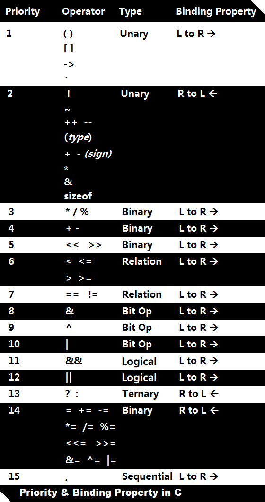
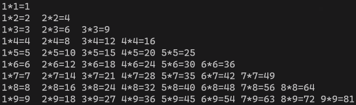

# 优先级表格

左结合的意思：先计算运算符左侧的内容；右结合就是先计算运算符右侧的内容。



## 举几个例子

```c
- 5 + 3 % 2    -> -4
  3 * 7 % 3    -> 0
- i++   (i=5)  -> 表达式值是-5, i值为6
-i+++i++
正确： - i ++ + i ++  -> 表达式值是0 , i值为7
错误： - i + ++i++    -> 错误，因为无论哪个++先操作，返回的都是一个不具名的临时变量，后一个++无法操作于临时无名变量。
```

1. 后置`++`是等整个表达式计算完之后，再进行`++`；前置`++`是先`++`再参与到表达式中。

2. 自增自减符（`++`、`--`）只能用于更改具名的变量，不能更改没有固定内存地址的操作数。

3. 而加减乘除（`+` `-` `*` `/`）不能修改操作数，只能把每个操作数串联起来，组成表达式，最后计算值。
4. 能改变变量本身的运算符只有`++`、`--`和赋值运算符（`=` `+=` `&=` `>>=`等等）

## 赋值运算符

```c
x = 3 * 4    ->  x为12, 表达式也为12
x = y = 3    ->  连续赋值，右结合，先计算y=3子表达式，表达式值为3，则 -> x=3
x += p       ->  x = x + p
x *= y - 3   ->  - 减号优先级大于 *= -> x = x * (y - 3)
```

## 关系运算符

```c
//a = 100, b = 99, c = 101, ch = 98
a > b == c      ->  1 == 101  -> 0
ch > 'a' + 1    ->  98 > 98   -> 0
d = a + b > c   ->  d = 199 > 101 -> d = 1 -> 1
b - 1 == a != c ->  ==和!=同优先级，左结合 -> 98 == 99 != 101 -> 0 != 101 -> 1
```

比较大小的关系运算符会返回boolean（真、假），其中0代表假，非零代表真。系统返回的真值默认为1。

## 逻辑运算符`&&` `||`

`&&`比`||`优先级高。

```c
//a = 100, b = 99, c = 101, x = 4, y = 6
a || b && c       -> 先计算 b&&c -> a || 1      -> 1
!a && b           -> ! 比&&优先级高, 0 && b      -> 0
x >= 3 && x <= 5  -> >=比&&优先级高, 1 && 1      -> 1
!x == 2           -> ! 比==优先级高, 0 == 2      -> 0
a || 3 + 10 && 2  -> + 优先级最高,  a || 13 && 2 -> a || 1 -> 1
```

## 逗号（坑）

1. 逗号用在3个地方。一个是定义和初始化，一个是逗号表达式，还有传参的分隔。
2. 逗号运算符是优先级别最低的（一定要记住，比`=`还低）。
3. 逗号运算符遵循左结合，即从左到右依次计算，最后逗号表达式的值为最右边的值。

```c
int main(void)
{
    int x = 5, y = 7;
    x + y, 6 - y, 9;   //表达式值为9
}
```

### 定义和初始化

```c
int x = 5, y = 7;
int z = x + y, 6 - y, 9; //error，前面如果有声明类型，不能在后面写逗号表达式
```

```c
int x = 5, y = 7, z = 0; 
z = x + y, 6 - y, 9;     //z被赋为12，但是因为逗号的优先级比=低，所以最后这个表达式值为9
```

### 函数传参中的逗号

这里会有坑出现。（ 类似于量子测不准现象 doge

```c
printf("%i\n",  x + y, 6 - y, 9 );   //打印出来为 x+y -> 12
printf("%i\n", (x + y, 6 - y, 9));   //加了括号之后, 打印9
```

这是因为，printf函数中有可变参，如果不加括号，则会把逗号视为参数的分隔符。

```c
printf(const char * const format, ...)
```

### 后置`++`和逗号的爱恨情仇

```c
int x = 5, y = 7, z = 0;
z = (x + y++, 6 - y++, 9, y);  //z最后的值为9
```

在本次测试中，逗号表达式的值为9，即y在逗号表达式结束前就自增了，也就是说后置`++`这个平时动作最慢的老家伙也穿越不了逗号。看来逗号可以被封为无敌懒神。

然而，这只是本次测试的情况，后置`++`有时候比较讨厌，行为有时不一致，这和不同编译器不同的实现有关。

```c
int x = 5, y = 7, z = 0;
z = x + y++, 6 - y++, 9, y;  //z最后的值为12
```

括号是`++`和逗号的他俩的定心丸（其实也称得上搅屎棍），如果括号去掉，则z最后就等于12，即在y自增前把x+7赋给z。

## 按位运算符

位运算符直接操作变量的机器码（二进制）。

### 应用

1. 网络程序中有时要专门处理某些位
2. 工业控制中控制标识位
3. 异或用于加密

```c
#define A 0b0001
#define B 0b0010
#define C 0b0100
#define D 0b1000
```

要求，在不干扰其他灯的情况下，让B灯亮，按位或：

```c
1000  ->  1010
P |= B:
    1000
  | 0010
  -------
    1010
```

检查B灯的亮灭，按位与：

```c
1000  ->  返回一个0值或非0值
P & B:
    1000
  & 0010
  -------
    0000
```

灭掉B，先按位非后按位与：

```c
1010  ->  0000
~B:
  ~ 0010
  -------
    1101
P &= ~B:
    1010
  & 1101
  -------
    1000

```

异或用于加密：

```c
text     ->   1101
password ->   0011
            ^
            -------
locked        1110
password      0011
            ^
            -------
text          1101
```

## 移位运算符

```c
int main(void)
{
    unsigned char a = 14u;     //0000 1110  
    unsigned char b = a >> 1;  //0000 0111  -> 7
}
```

```c
int main(void)
{
    unsigned char a = 128u;     //1000 0000  
    unsigned char b = a >> 1;   //0100 0000  -> 64
}
```

```c
int main(void)
{
    char a = 128u;              //1000 0000  -> 无符号转为有符号 a 为-128
    unsigned char b = a >> 1;   //1100 0000  -> 有符号转为无符号 b 为 192
}
```

可得，对于有符号数，移位运算符保留了符号属性。如果不想保留符号特性，可以让操作数强制转为unsigned，如下：

```c
int main(void)
{
    char a = 128u;         //1000 0000  -> 无符号转为有符号 a 为-128
    unsigned char b = (unsigned char)a >> 1; //0100 0000 -> b为64
}
```

## 总结

（笃定地讲）所有表达式最后肯定会产生一个临时值，如果没有值产生，就不是表达式，而是一个语句。

# 语句

1. 顺序语句
2. 分支语句

   1. if
   2. 
3. 循环

   1. while
   2. do-while
   3. for
   

## 分支语句

```c
int main(void)
{
    if (0)
        printf("true\n");
    else
        printf("false\n");
    return 0;
}
```

```c
int main(void)
{
    int x = 2;
    if (x == 1)
        printf("true\n");
    else if (x == 2)
        printf("true2\n");
    else
        printf("false\n");
    return 0;
}
```

### switch-case

```c
int main()
{
    if(a == 1)
        printf("1\n");
    else if(a == 2)
        printf("2\n");
    else if(a == 3)
        printf("3\n");
    else if(a == 4)
        printf("4\n");
    else
        printf("else\n");
    
    switch(a)
    {
        case 1:
            printf("1\n");
            break;
        case 2:
            printf("2\n");
            break;
        case 3:
            printf("3\n");
            break;
        case 4:
            printf("4\n");
            break;
        default:
            printf("else\n");
            break;
    }
}
```

上面这个程序的所达到的效果，在逻辑上，if-else和switch-case是一样的。

switch后面括号内的变量只支持整型或枚举类型，枚举类型也是整型的一种。

如果分支很多且判别表达式值为整型，则使用switch-case更合适。

如果抛去这两个限制（分支的多少和判别表达式值的类型），则性能上switch-case更有优势：

1. 编译器直接把case中的编号当做偏移量，对应到相应的内存地址上了。
2. 于是直接略过了判断前面的过程，直接去找相应的分支。

## 循环

### while

```c
int main(void)
{
    while (1)
        printf("Hello");
}
```

```c
int main(void)
{
    while (1)
    {
        printf("Hello");
        break;
    }
}
```

continue

```c
int main(void)
{
    while (1)
    {
        printf("Hello");
        continue;
        printf("end"); //不走
    }
}
```

求1到100加和：自然终止

```c
int main(void)
{
    //sum: 1 ~ 100
    int i = 1, sum = 0;
    while (i <= 100)
        sum += i++;
    printf("sum: %i\n", sum); // 5050
}
```

求1到100加和：条件break终止

```c
int main(void)
{
    //sum: 1 ~ 100
    int i = 1, sum = 0;
    while (1)
    {
        sum += i++;
        if (i > 100)
            break;
    }
    printf("sum: %i\n", sum); // 5050
}
```

### do-while

不管while括号内条件是否符合，至少执行一次循环体。

```c
int main()
{
    int i = 10;
    do
    {
        printf("Hello\n");
    }while(i < 10);  // 因为最后不是大括号结尾的，所以要加上;
}
```

### for

for后的括号内是三条语句。第一条只运行一次，第二条是每次进入循环时都要判断，第三条是每次循环体运行完后执行。

```c
int main(void)
{
    //sum: 1 ~ 100
    int sum = 0;
    for (int i = 1; i <= 100; ++i)
    {
        sum += i;
    }
    printf("sum: %i\n", sum); // 5050
}
```

### 九九乘法表

```c
int main(void)
{
    for(int i = 1; i <= 9; ++i, printf("\n"))
    {
        for(int j = 1; j <= i; ++j)
        {
            printf("%i*%i=%-2i ", j, i, i * j);
        }
    }
}
```

1. `printf`中的`%-2i`代表有符号整数，附加的效果是占两位，**左对齐**（负号的作用）。
2. `for`表达式中的第三个表达式是最后做的处理，往往不需要返回值。在本例中，第一层for循环代表行的处理，第二层for循环代表列的处理，每当第二层for循环完毕后，需要换行，即每当第一层for循环体内容结束后，需要做两个事情：1、i加1；2、换行，可以合并为逗号表达式放在for表达式第三个空中。因为for括号中的第三个语句没有人来接受它的返回值，所以可以直接写printf这种无返回值的函数。



### 总结

1. while循环往往适用于不清楚运行次数的，不能精准控制步长的情况。
2. for循环适用于知道运行次数的情况：需要明白i的范围、步长。
