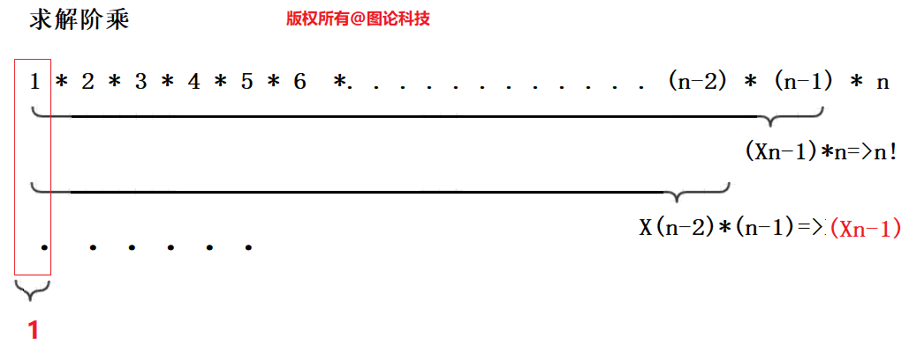
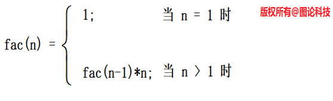
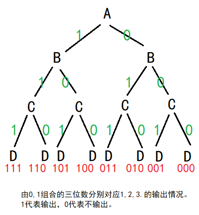
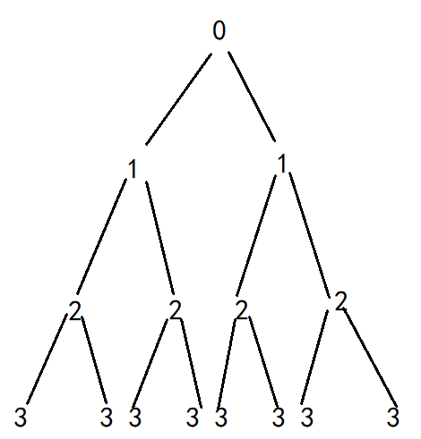
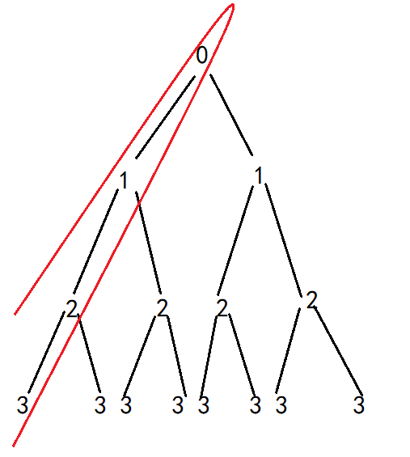
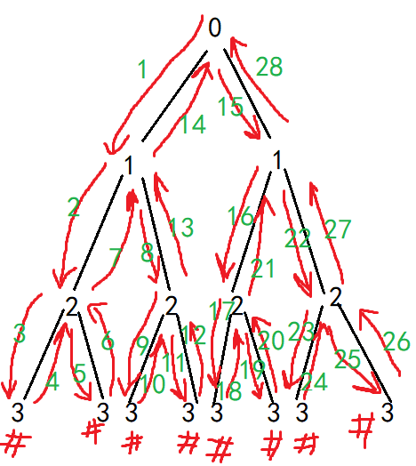
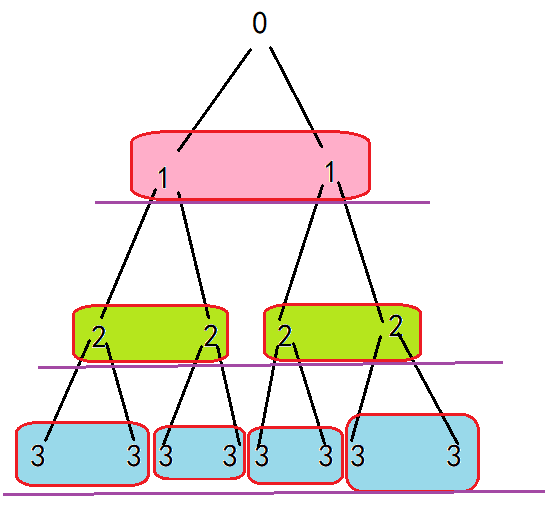

# 递归内容

1. 栈帧的理解
2. 分治策略和递归

# 复习函数

## 编译链接和内存布局


　　根据不同的操作系统，一个进程可能被分配到不同的内存区域去执行。但是不管什么样的操作系统、什么样的计算机架构，进程使用的内存都可以按照功能大致分为以下4个部分：
1) 代码区：这个区域存储着被装入执行的二进制机器代码，处理器(CPU)会到这个区域取指并执行。
2) 数据区：用于存储全局变量, 静态全局变量，静态局部变量，字符串常量等。
3) 堆区：进程可以在堆区动态地请求一定大小的内存，并在用完之后归还给堆区。动态分配和回收是堆区的特点。
4) 栈区：函数被调时分配栈区，用于存放函数的参数值，局部变量等值；还要动态地存储函数之间的关系，以保证被调用函数在返回时恢复到被调用函数中继续执行。

## 函数调用机制

局部变量占用的内存是在程序执行过程中“动态”地建立和释放的。这种“动态”是通过栈由系统自动管理进行的。当任何一个函数调用发生时，系统都要作以下工作：
1) 建立栈帧空间；
2) 保护现场：主调函数运行状态和返回地址入栈；
3) 为被调函数传递数据（进行实参和形参的结合），同时形参获得存储空间；接着给局部变量分配空间；
4) 执行被调函数函数体；
5) 当被调函数执行完成，释放被调函数中局部变量占用的栈空间；
6) 恢复现场：取主调函数运行状态及返回地址，释放栈帧空间；
7) 继续主调函数后续语句。


在进入main函数时，只创建了main函数的栈帧，在调用Add函数时才会建立Add函数的栈帧，当Add函数return时，栈帧收回。

### 有启发的代码

```c
int* fun()
{
    int ar[10]={12,23,34,45,56,67,78,89,90,100};
    return ar;
}
int main()
{
    int* p = fun();
    for(int i = 0;i<10;++i)
    {
        printf("%d ",p[i]);
    }
    printf("\n");
    return 0;
}
```

ar大小为10时，fun函数调用时还正常存在着ar数组的信息，而fun函数调用完后，再循环调用printf函数，致使冲掉了以前栈帧的信息，导致输出错误。


而把fun函数中的ar大小改为1000时，运行结果就不一样了，输出的是正常的。


因为，ar占用的栈帧很多，printf函数未能冲刷到之前ar的原有数据。但是本质上ar的信息还是失效了的。懂了这个例子，会对函数调用与栈帧分配的关系深入理解。

# 分治策略与递归

　　分治策略：是将规模比较大的问题可分割成规模较小的相同问题。**问题不变，规模变小**。这自然导致递归过程的产生。分治与递归像一对孪生兄弟，经常同时应用在算法设计之中，并由此产生许多高效算法。

## 分治法步骤

在分治策略中递归地求解一个问题，在每层递归中应用如下三个步骤：

1. 分解：将问题划分成一些子问题，**子问题的形式与原问题一样，只是规模更小**。
2. 解决：递归地求解子问题。**如果子问题的规模足够小，则停止递归，直接求解**。
3. 合并：将小规模的解组合成原规模问题的解。

　　递归函数的执行分为“递推”和“回归”两个过程，这两个过程由递归终止条件控制，即逐层递推，直至递归终止条件满足，终止递归，然后逐层回归。
　　递归调用同普通的函数调用一样，每当调用发生时，就要分配新的栈帧（形参数据，现场保护，局部变量）；而与普通的函数调用不同的是，由于递推的过程是一个逐层调用的过程，因此存在一个逐层连续的分配栈帧过程，直至遇到递归终止条件时，才开始回归，这时才逐层释放栈帧空间，返回到上一层，直至最后返回到主调函数。

## 经典题目

我们对于递归要达到的初级水平是：可以把循环程序改为递归程序。

最终的目标是：在递归的活动中，直接能捕获到某一步的运行情况。

### 求解阶乘

```
n! = (n-1)!\*n
(n-1)! = (n-2)!\*n-1
(n-2)! = (n-3)!\*n-1
...
2! = 1! \* 2
1! = 1
```
阶乘可递归的定义为：


可以看出是用阶乘定义阶乘，这种拿自己定义自己的方法称为递归定义。

在写出递归程序前，我们先拿循环程序解决一下。

```c
//不考虑整型溢出
int factorial(int n)
{
    int sum=1;
    for(int i=1;i<=n;++i)
    {
        sum=sum*i;
    }
    return sum;
}
```

递归的写法：

```c
int factorial_recursion(int n)//factorial:阶乘 recursion:递归
{
    if(n<=1)
    {
        return 1;
    }
    else//n>1
    {
        return factorial_recursion(n-1)*n;
    }
}
```

可以把一切的循环改为递归，也可把一切的递归改为循环，两者本质上可以相通。

### 整数倒序输出

输入一个整数（无符号整型），用递归算法将整数倒序输出。

循环法

```c
void reverse_print(unsigned int n)
{
    while(n!=0)
    {
        printf("%d ",n%10);//1234%10=4 ...
        n=n/10;
    }
}
```

递归法

```c
void reverse_print(unsigned int n)
{
    if(n!=0)
    {
        printf("%d ",n%10);
        reverse_print(n/10);
    }
}
```

上述递归代码是正确的，即输出了"4 3 2 1 "。而如果调用函数和打印顺序颠倒，则结果会完全不一样。分析代码结构，打印函数是在调用reverse_print之前的，就是说我们是在递推的同时打印模10结果的，而回归时reverse_print函数后面没有语句，因此没有其他的操作。

```c
void fun(unsigned int n)
{
    if(n!=0)
    {
        fun(n/10);
        printf("%d ",n%10);
    }
}
```

上述代码为先递归切割（每次都除10），最后则从1%10开始打印到1234%10，即"1 2 3 4 "。分析递归时，一定要明确各层函数在栈区中的结构和意义。那么我们分析，由于打印函数在fun函数之后，所以这个程序在从1234递推到1的过程中没有打印，而是在递推完毕回归时才打印（即执行fun函数之后的语句）。

### 打印无序数组

有一个整型数组，数值无序，使用循环和递归完成打印和查询。

循环方法：

```c
void Print_Ar(const int* ar, int n)
{
    assert(ar!=NULL);
    for(int i=0;i<n;++i)
    {
        printf("%d ",ar[i]);
    }
    printf("\n");
}
int main()
{
    int ar[]={12,23,34};
    int n = sizeof(ar)/size(ar[0]);
    Print_Ar(ar,n);
}
```

递归方法：

```c
void Print_recursion(const int* ar, int n)
{
    if(n>0)
    {
        Print_recursion(ar,n-1);//n-1代表打印前n-1个元素
    	printf("%d ",ar[n-1]);//n-1代表此时的第n下标值
    }
}
void Print_Ar(const int* ar, int n)
{
    assert(ar!=NULL);
    Print_recursion(ar, n)；
    printf("\n");
}
int main()
{
    int ar[]={12,23,34};
    int n = sizeof(ar)/size(ar[0]);
    Print_Ar(ar,n);
}
```

#### 思考1

如果把递归函数体中的`Print_recursion(ar,n-1);`中的`"n-1"`改为`"n--"`会发生什么现象？

```c
void Print_recursion(const int* ar, int n)
{
    if(n>0)
    {
        Print_recursion(ar,n--);//n-1代表打印前n-1个元素
    	printf("%d ",ar[n-1]);//n-1代表此时的第n下标值
    }
}
void Print_Ar(const int* ar, int n)
{
    assert(ar!=NULL);
    Print_recursion(ar, n);
    printf("\n");
}
int main()
{
    int ar[]={12,23,34};
    int n = sizeof(ar)/size(ar[0]);
    Print_Ar(ar,n);
}
```

答案是运行时内存溢出了。因为`n--`是后置`--`，先取值运行函数，函数调用完才回写减一后的结果。开始时n是3，函数调用时传的值永远都是2。
#### 思考2

如果把递归函数体中的`Print_recursion(ar,n--);`中的`"n--"`改为`"--n"`会发生什么现象？

答案是`"随机值 12 23 "`。因为`--n`是前置`--`，在运行函数前就把`n-1`并回写了，这导致一个问题，函数调用时，n已经减了1，那么打印`ar[n-1]`又会减1，则会导致`n=1`时调用`Print_recursion(ar, n);`时满足条件执行语句`--n`，此时n变0，接下来打印`ar[n-1]`即`ar[-1]`，就产生了越界。
### 查询无序数组某值的下标

```c
int FindValueIndex(const int* ar, int n, int val)
{
	int pos = -1;
	if (n > 0)
	{
		if (ar[n - 1] == val)
		{
			pos = n - 1;
		}
		else
		{
			pos = FindValueIndex(ar, n - 1, val);
		}
	}
	return pos;
}
int findValue(const int*ar, int n,int val)
{
    if(ar==NULL) return -1;
    return FindValueIndex(ar, n, val);
}
```

老师的写法：

```c
int FindValueIndex(const int* ar, int n, int val)
{
	if (n < 1 || ar[n-1] == val)
	{
		return n-1;
	}
    else
    {
        return FindValueIndex(ar, n-1, val);
    }
}
int findValue(const int*ar, int n,int val)
{
    if(ar==NULL) return -1;
    return FindValueIndex(ar, n, val);
}
```

### 全排列/子集问题：树形结构(组合树/子集树)

现要求输出集合`{1,2,3}`的全部子集。




```c
void fun(int* ar,int* br,int i,int n)
{
    if(i==n)
    {
        for(int k=0;i<n;++k)
        {
            if(br[k]==1)
            {
                printf("%d ",ar[k]);
            }
        }
        printf("\n");
        
    }
    else
    {
        br[i]=1;
        fun(i+1,n);
        br[i]=0;
        fun(i+1,n);
    }
}
int main()
{
    const int n = 3;
    int ar[]={1,2,3};
    int br[]={0,0,0};
    fun(ar,br,0,n);
    return 0;
}
```

此类递归程序的时间复杂度为$O(2^n)$，空间复杂度为树的高度$S(n)$。

## 图解递归过程

### 代码的调动过程


### 栈帧的动态调动过程


# 总结

## 关于分配栈帧

函数被调用，不管是自己调用自己，还是被其它函数调用，都将会给被调用函数分配栈帧。

## 关于死循环

存在死循环，但不存在无穷递归。即递归函数必须要有一个是递归结束的出口（要有递归中止的条件语句）。

```c
int factorial(int n)
{
    int sum=1;
    for(int i=1; ;++i)//中间语句缺省，意味着死循环。
    {
        sum=sum*i;
    }
    return sum;
}
```

```c
int factorial_recursion(int n)//factorial:阶乘 recursion:递归
{
    if(false)//达不到原来的函数出口了
    {
        return 1;
    }
    else
    {
        return factorial_recursion(n-1)*n;
    }
}
```

死循环只是重复的在开辟的某一个空间里反复计算赋值，过程都是在一个内存空间完成的。即时间复杂度是$O(n)$，空间复杂度是$S(1)$。死循环只是全负荷的使用CPU的运算资源，但不会影响内存结构。

而无穷递归是反复开辟新的栈帧，时间复杂度是$O(n)$，空间复杂度是$S(n)$，因为栈区的大小是有限的，默认为1M，如果一直递归下去，则会溢出栈区破坏内存结构，则不可能一直递归下去。所以问题的规模不要过大，递归过深，引起栈溢出。

# 找数组某一值

```c
int Find(const int* ar,int n,int val)
{
    if(n<1 || ar[n-1]==val)
    {
        return n-1;
    }
    else
    {
        return Find(ar,n-1,val);
    }
}
```


```c
int Find(const int* ar,int n,int val)
{
	int pos = -1;
	if (n > 0)
	{
		if (ar[n - 1] == val)
		{
			pos=n-1;
		}
		else
		{
			pos = FindValueIndex(ar, n - 1, val);
		}
	}
	return pos;
}
```

# 体会递归的分析

```c
void Print(const int* ar,int n)
{
    if(n>0)
    {
        Print(ar,n-1);//括号内的n-1改成n--和--n,结果都会不一样。
        printf("%d ",ar[n-1]);
    }
}
void Print_Ar(const int* ar,int n)
{
    assert(ar!=nullptr);
    Print(ar,n);
    printf("\n");
}
int main()
{
    int ar[] = { 12,23,34 };
	int n = sizeof(ar) / sizeof(ar[0]);
	Print_Ar(ar, n);
}
```

# 作业

1. 斐波那契数列
   循环法
```c
int fun(int n)
{
   int a=1,b=1,c=1;
   for(int i=3;i<=n;++i)
   {
       c=a+b;
       b=a;
       a=c;
   }
   return c;
}
```

   递归法（目标要达到时间复杂度$O(n)$）
   https://leetcode-cn.com/problems/fei-bo-na-qi-shu-lie-lcof/solution/fei-bo-na-qi-shu-lie-wen-ti-de-si-chong-jie-fa-by-/

```c
int Fibonacci(int n)
{
    if (n == 1 || n == 2)return 1;
    else if (n > 0)
    {
        return Fibonacci(n - 1) + Fibonacci(n - 2);
    }
    else
    {
        return 0;
    }
}
int Fibonacci_Ar(int* ar,int n)
{
    int i = 2;
    for (i; i <= n;++i)
    {
        ar[i] = ar[i - 2] + ar[i - 1];
    }
    return ar[n];
}
int main()
{
    int ar[101] = { 0,1,1 };
    int fibo = Fibonacci_Ar(ar,30);
    printf("%d ", fibo);
}
```

```java
/*记忆化递归解法
解题思路:
既然普通的递归解法产生大量的重复计算，如果已经计算过的f(x) 把结果保存不就减少了计算么？ 用一个数组记忆计算结果，如果f(x)已经计算过了，直接返回a[x]
时间复杂度:
O(n)， 由于计算过的记忆下了，只要n次
空间复杂度:
O(n)， 递归调用栈消耗了线性数量级，记忆数组使用了n的空间
*/
#define N 100 + 1
class Solution {
private:
   int arr[N] = {0, 1, 1, } ;
public:
   int fib(int n) {
       if (arr[n] || !n)
           return arr[n] ;
       return arr[n] = (fib(n-1) + fib(n-2))%1000000007 ;
   }
};
``` 
2. 二分查找递归法
```c
int binary_search(const int* ar, int n, int val, int left, int right)
{
    int pos = -1;
    int mid = (right+left)/2;
    if (n < 1 || ar[mid] == val)
    {
        pos = mid;
    }
    else if(ar[mid]>val)
    {
        return binary_search(ar, n/2, val, left, right-1);
    }
    else
    {
        return binary_search(ar, n/2, val, left+1, right);
    }
    return pos;
}
/*
int FindValueIndex(const int* ar, int n, int val)
{
if (n < 1 || ar[n-1] == val)
{
    return n-1;
}
   else
   {
       return FindValueIndex(ar, n-1, val);
   }
}
*/
int findValue(const int*ar, int n,int val)
{
    if(ar==NULL) return -1;
    return binary_search(ar, n, val, 0, n-1);
}
```
3. 思考以下代码`'#'`会输出几次？
```c
void fun(int i,int n)
{
    if(i==n)
    {
        printf("# ");
    }
    else
    {
        fun(i+1,n);
        fun(i+1,n);
    }
}
int main()
{
    int n = 3;
    fun(0,n);
    return 0;
}
```

答案是输出8次。如果只写了一行`fun(i+1,n);`则只打印1次。思考为什么。
大体上分析用层次分析，具体调动是深度优先搜索分析。

只调用一次的情况：

只有一条路径，即只打印一次。

调用两次的情况：

规律：调用两次时，此类递归程序的时间复杂度为O(2^n)，空间复杂度为树的高度S(n)。

层次分析：（一层一层看，而不是具体的实现步骤）

由此题可以延伸出全排列/子集树(组合树)问题！
