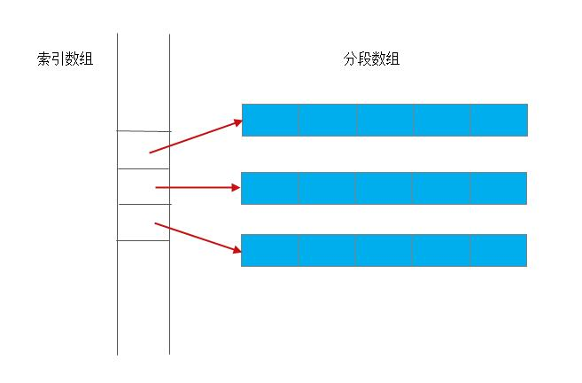

# 内容

1. iterator的分类
2. iterator的属性
3. advance--使迭代器移动n步
4. 针对迭代器的类型萃取
5. SGI萃取的写法
6. distance--计算两迭代器之间的距离

# iterator

```c++
#pragma once
namespace xcg
{
struct input_iterator_tag {};
struct output_iterator_tag {};
struct forward_iterator_tag : public input_iterator_tag {};
struct bidirectional_iterator_tag : public forward_iterator_tag {};
struct random_access_iterator_tag : public bidirectional_iterator_tag {};
using ptrdiff_t = int;

template<class _C, class _Ty, class _D = ptrdiff_t, class _Pointer = _Ty*,
	class _Reference = _Ty&>
	struct iterator
{
	typedef _C			iterator_category;
	typedef _Ty			value_type;
	typedef _D			difference_type;
	typedef _Pointer	pointer;
	typedef _Reference	reference;
};
template<class _Ty, class _D = ptrdiff_t>
struct _Forit : public iterator<forward_iterator_tag, _Ty, _D> {};
template<class _Ty, class _D = ptrdiff_t>
struct _Bidit : public iterator<bidirectional_iterator_tag, _Ty, _D> {};
template<class _Ty, class _D = ptrdiff_t>
struct _Ranit : public iterator<random_access_iterator_tag, _Ty, _D> {};

template<class _II, class _D>
inline void __advance(_II& i, _D n, input_iterator_tag)
{
	while (n--) ++i;
}
template<class _BI, class _D>
inline void __advance(_BI& i, _D n, bidirectional_iterator_tag)
{
	if (n >= 0)
	{
		while (n--) ++i;
	}
	else
	{
		while (n++) --i;
	}
}
template<class _RAI, class _D>
inline void __advance(_RAI& i, _D n, input_iterator_tag)
{
	i += n;
}
template<class _II, class _D>
inline void advance(_II& i, _D n)
{

}
}
```

```c++
template<class _Iterator>
struct iterator_traits
{
    iterator_traits() {}
	typedef typename _Iterator::iterator_category	iterator_category;
	typedef typename _Iterator::value_type			value_type;
	typedef typename _Iterator::difference_type		difference_type;
	typedef typename _Iterator::pointer				pointer;
	typedef typename _Iterator::reference			reference;
};
```

## advance

```c++
inline void advance(_II& i, _D n)
{
	iterator_traits<_II>();
	typedef typename iterator_traits<_II>::iterator_category cate;
	__advance(i, n, cate());
}
```

## 萃取器

首先是针对泛型iterator，其是标准的迭代器，重载了\*和->运算符。这里的萃取器可容纳的不包括裸指针。

```c++
template<class _Iterator>
struct iterator_traits
{
    iterator_traits() {}
	typedef typename _Iterator::iterator_category	iterator_category;
	typedef typename _Iterator::value_type			value_type;
	typedef typename _Iterator::difference_type		difference_type;
	typedef typename _Iterator::pointer				pointer;
	typedef typename _Iterator::reference			reference;
};
```

接下来是针对裸指针作出的模板特化。裸指针可看作是可随机访问的迭代器。

```c++
template<class T>
struct iterator_traits<T*>
{
	iterator_traits() {}
	typedef typename random_access_iterator_tag		iterator_category;
	typedef typename T		value_type;
	typedef typename int	difference_type;
	typedef typename T*		pointer;
	typedef typename T&		reference;
};
```

接着再次对裸指针的萃取器模板作出部分特化，可处理常裸指针。

```c++
template<class T>
struct iterator_traits<const T*>
{
	iterator_traits() {}
	typedef typename random_access_iterator_tag		iterator_category;
	typedef typename T				value_type;
	typedef typename int			difference_type;
	typedef typename const T*		pointer;
	typedef typename const T&		reference;
};
```

## 至此代码版本v1

```c++
#pragma once
namespace xcg
{
struct input_iterator_tag {};
struct output_iterator_tag {};
struct forward_iterator_tag : public input_iterator_tag {};
struct bidirectional_iterator_tag : public forward_iterator_tag {};
struct random_access_iterator_tag : public bidirectional_iterator_tag {};
using ptrdiff_t = int;

template<class _C, class _Ty, class _D = ptrdiff_t, class _Pointer = _Ty*,
	class _Reference = _Ty&>
	struct iterator
{
	typedef _C			iterator_category;
	typedef _Ty			value_type;
	typedef _D			difference_type;
	typedef _Pointer	pointer;
	typedef _Reference	reference;
};

template<class _Iterator>
struct iterator_traits
{
	iterator_traits() {}
	typedef typename _Iterator::iterator_category	iterator_category;
	typedef typename _Iterator::value_type			value_type;
	typedef typename _Iterator::difference_type		difference_type;
	typedef typename _Iterator::pointer				pointer;
	typedef typename _Iterator::reference			reference;
};

template<class T>
struct iterator_traits<T*>
{
	iterator_traits() {}
	typedef typename random_access_iterator_tag		iterator_category;
	typedef typename T		value_type;
	typedef typename int	difference_type;
	typedef typename T*		pointer;
	typedef typename T&		reference;
};
template<class T>
struct iterator_traits<const T*>
{
	iterator_traits() {}
	typedef typename random_access_iterator_tag		iterator_category;
	typedef typename T				value_type;
	typedef typename int			difference_type;
	typedef typename const T*		pointer;
	typedef typename const T&		reference;
};

template<class _Ty, class _D = ptrdiff_t>
struct _Forit : public iterator<forward_iterator_tag, _Ty, _D> {};
template<class _Ty, class _D = ptrdiff_t>
struct _Bidit : public iterator<bidirectional_iterator_tag, _Ty, _D> {};
template<class _Ty, class _D = ptrdiff_t>
struct _Ranit : public iterator<random_access_iterator_tag, _Ty, _D> {};

template<class _II, class _D>
inline void __advance(_II& i, _D n, input_iterator_tag)
{
	while (n--) ++i;
}
template<class _BI, class _D>
inline void __advance(_BI& i, _D n, bidirectional_iterator_tag)
{
	if (n >= 0)
	{
		while (n--) ++i;
	}
	else
	{
		while (n++) --i;
	}
}
template<class _RAI, class _D>
inline void __advance(_RAI& i, _D n, input_iterator_tag)
{
	i += n;
}
template<class _II, class _D>
inline void advance(_II& i, _D n)
{
	iterator_traits<_II>();
	typedef typename iterator_traits<_II>::iterator_category cate;
	__advance(i, n, cate());
}
}
```

## SGI的做法

```c++
//以下三个函数是SGI比较重要的写法模式
template<class _II>
inline typename iterator_traits<_II>::iterator_category
iterator_category(const _II&)
{
	typedef typename iterator_traits<_II>::iterator_category cate;
	return cate();
}
template<class _II>
inline typename iterator_traits<_II>::value_type*
value_type(const _II&)
{
	return static_cast<typename iterator_traits<_II>::value_type*>(0);
}
template<class _II>
inline typename iterator_traits<_II>::difference_type*
difference_type(const _II &)
{
	return static_cast<typename iterator_traits<_II>::difference_type*>(0);
}
```

```c++
template<class _II, class _D>
inline void advance(_II& i, _D n)
{
    //这里是SGI的写法，使代码更加灵活。
	__advance(i, n, iterator_category(i));
}
```

## distance

```c++
template<class _II>
inline typename iterator_traits<_II>::difference_type
__distance(_II _F, _II _L, input_iterator_tag)
{
	typename iterator_traits<_II>::difference_type n = 0;
	while (_F != _L)
	{
		++_F;
		++n;
	}
	return n;
}
template<class _RAI>
inline typename iterator_traits<_RAI>::difference_type
__distance(_RAI _F, _RAI _L, input_iterator_tag)
{
	typename iterator_traits<_RAI>::difference_type n = 0;
	return _L - _F;
}

template<class _II>
inline typename iterator_traits<_II>::difference_type
distance(_II _F, _II _L, input_iterator_tag)
{
	return __distance(_F, _L, iterator_category(_F));
}
```

# 迭代器失效的场景
可以指向元素的工具：迭代器、指针和引用。有时，虽然迭代器失效，但指针和引用不一定失效。

除了元素的迭代器失效的问题，还要考虑容器end这个迭代器是否失效的问题。**`end()` 特性**：只要元素数变了，之前拿到的 `end()` 立刻失效。
## vector、string
1. 只要涉及到扩容，全部迭代器都会失效（包括迭代器、指针和引用）。
2. insert、push_back：之后，插入点（插入后，放的是新元素）到末尾，这一范围全失效（迭代器、指针和引用）。插入点之前的不受影响。
    1. `end()` 迭代器失效
3. erase：之后，删除点（删除后，放的是下一个元素）到末尾，这一范围全失效（迭代器、指针和引用）。删除点之前的不受影响。
    1. `end()` 迭代器失效
## deque
`deque` 不是一整块连续内存，而是**多块定长缓冲区 + 一张“块索引表”(map)**。
插入可能导致扩容（新分配一个连续内存段）。

迭代器里不仅有元素指针，还带着指向块及索引表的位置；**一旦在两端扩展需要改动索引表，所有迭代器都会失效**。但元素本身通常没搬家，所以**引用/指针多数仍然有效**（除非你删的就是它，或在中间插入/删除导致元素搬动）。这正是它与 `vector`/`list` 最大的差异。
1. 插入
    1. 首尾插入
        1. 规定所有的**迭代器**失效（不包括指针、引用）。
        2. 引用/指针通常仍指向原元素，不失效！
            1. 无论是否扩容，其他的元素都是保留在原位置的，因此**其他元素的引用/指针不受影响**。
    2. 在中间插入
        1. **所有全失效**（包括迭代器、指针和引用）。
2. 删除
    1. 首尾元素
        1. 被删除元素的迭代器、指针和引用失效。其他元素不影响！
        2. 如果删除的是首元素，容器的end迭代器不失效（不包括指针、引用）。
            1. 只有这一种情况不使 `end()` 失效，其他情况都不要用旧的end。
                1. 但是，有可能虽然是pop_front，但恰好容器中只有一个元素，此时end也会失效。
        3. 如果删除的是尾元素，容器的end迭代器会失效（不包括指针、引用）。
    2. 删除中间元素
        1. **所有全失效**（包括迭代器、指针和引用）。



## list
1. insert：不会让迭代器失效（所有元素，包括新插入的，都不会失效）。
    1. 但是，插入后，插入点放的是新元素，原来位置的元素被挤到了右边。如果需要继续向右遍历，记得在插入之后单独做一次`++`。
2. erase：之后，仅对删除的元素的迭代器失效。其他仍有效。
## map、multimap、set、multiset
1. insert：无影响：不会让迭代器、指针、引用失效（所有元素，包括新插入的，都不会失效）。
2. erase：仅对删除的元素的迭代器、指针、引用失效。其他元素仍有效。
## unordered_map、unordered_set
哈希表的插入，可能会存在容器增长导致重新哈希。
插入后，新容器的尺寸超过其容量阈值（计算方式为容器的 `bucket_count` 乘以其 `max_load_factor`），则会强制执行重新哈希。删除不涉及重新哈希。
在重新哈希后，容器中的所有迭代器都会失效。（指针、引用仍有效，即使重新哈希）

1. insert：
    1. 如果不涉及到重新哈希。不会让迭代器、指针、引用失效（所有元素，包括新插入的，都不会失效）。
    2. 如果重新哈希，容器中的所有迭代器失效。（**但指针、引用仍有效，即使重新哈希**）
    3. 元素的指针、引用在所有情况下都保持有效，即使在重新哈希之后也是如此。
2. erase：仅对删除的元素的迭代器、指针、引用失效。其他元素仍有效。

## 其他如queue、stack、`priority_queue​`
没有提供迭代器。不用谈失效的概念。
## Array
1. 固定大小；不会插/删；
2. 修改元素值**不**使迭代器失效。
3. `swap(array)` 不失效迭代器（指向同一块内存）。