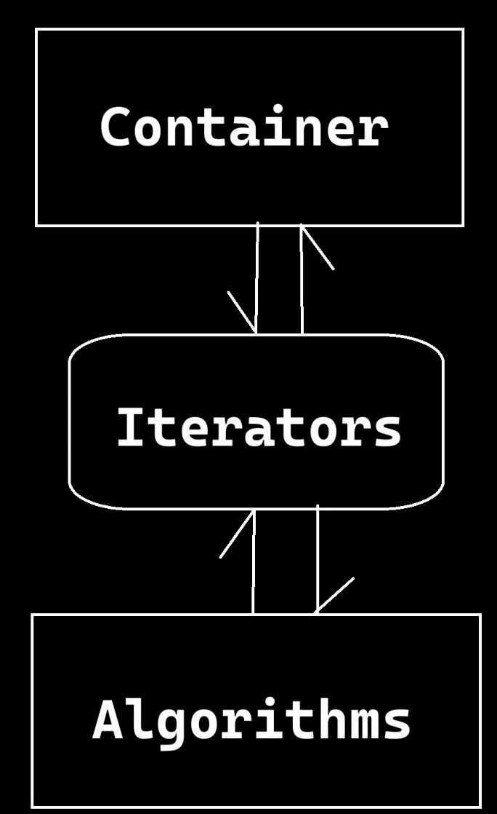
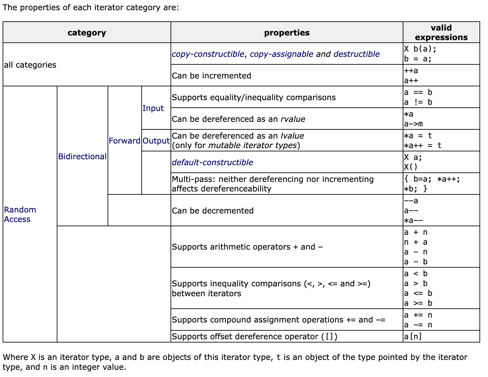
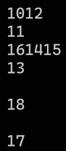
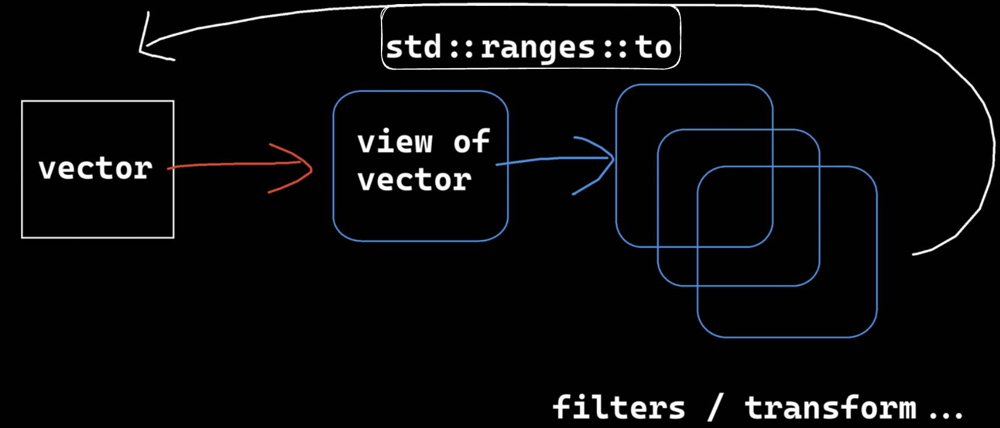

# 模板库是什么
由三部分组成。
1. 容器Container：装数据的
2. 迭代器Iterator：不同容器的结构、算法行为不一样，用迭代器来屏蔽差异。Iterator有好多种，但是有通用的接口，在容器和算法中间，通过迭代器与另一者相互通信。
3. 算法Algorithm：插入、修改、删除等


# 以vector为例
```cpp
template<class T, class Alloc = allocator<T> >
class vector;
```
第一个模板参数是容器中元素的类型。
第二个模板参数是空间配置器。
## 初始化、遍历
遍历示例：
```cpp
int main()
{
    std::vector<int> vec{ 1, 2, 3, 4, 5, 6, 7, 8 };
    std::vector<int>::iterator it = vec.begin();
    for (; it != vec.end(); ++it)
    {
        std::cout << *it << std::endl;
    }
    // 以下是ranged for的遍历写法
    // 取出的是值，不是迭代器。效率较低
    for (auto v : vec)
    {
        std::cout << v << std::endl;
    }
    // 取出的是引用，效率高。实际v的类型是int &
    for (auto&& v : vec)
    {
        std::cout << v << std::endl;
    }
}
```
## size和capacity
1. size是当前容器内有效元素数
2. capacity是当前容器的容量
3. capacity大于等于size
4. 当满容时，vector会扩容到原来的1.5倍。之前的数据拷贝到新区后销毁。
## `push_back`和`emplace_back`
1. `push_back`的语义是把构造好的对象，或用封装的数据临时构造一个对象，再插入到容器的尾部。发生了拷贝构造、右值引用拷贝构造。
2. `emplace_back`是把数据一个一个直接填充到容器尾部的空间上。
    1. 用到了完美转发
```cpp
class Test
{
public:
    Test(int a, int b)
    {
        std::cout << "Test(a, b)" << std::endl;
    }
};
int main()
{
    std::vector<Test> vec{ {10, 20}, {30, 40}, {50, 60}, {70, 80} };
    vec.push_back({ 90, 100 });
    Test test{ 110, 120 };
    vec.push_back(test);
    vec.emplace_back(130, 140);
    std::cout << vec.size() << std::endl;
    std::cout << vec.capacity() << std::endl;
}
```

# 迭代器的分类

1. 所有都：
    1. 支持析构、拷贝构造、拷贝赋值。
    2. Can be incremented `++a or a++`
2. Input/Output：迭代器的输入、输出是相对于算法来说的。
    1. Input：程序通过迭代器向算法传参，可以理解为只读
        1. 支持相等比较
        2. 支持解引用为右值
    2. Output：算法通过迭代器向外输出
        1. 支持解引用为左值
3. Forward
    1. 支持默认的构造
4. Bidirectional
    1. Can be decremented `--a or a--`
5. Random Access
    1. 支持随意加减 `a + n, n + a, a - n, a - b`
    2. 支持和另一迭代器之间的不等比较 `a < b, a > b`
    3. 支持复合赋值运算 `a += n, a -= n`
    4. 支持偏移量（offset）解引用 `a[n]`


## 通过concepts约束迭代器类型

在没有concept之前，编程时乱用不匹配的迭代器编译时是不知道对错的，运行的时候才报错。
而Modern `C++`之后随着模板和concept的发展，可以约束迭代器的行为。比如规定此迭代器类必须支持`++`、`--`操作，从而此迭代器是Bidirectional。
有了concepts，在编译期就能知道程序的对错了。

具体见《Cpp_concept》
## back_inserter
```cpp
template <class Container>
back_insert_iterator<Container> back_inserter (Container& x);
```
构建后插入迭代器
构建一个尾插入迭代器，该迭代器在X的末尾插入新元素。
尾插迭代器是一种特殊的输出迭代器，旨在允许频繁覆盖元素的算法（例如copy）在容器末端自动插入新元素。
X的类型需要具有`push_back`成员函数（例如vector、Deque和List）。
在返回的迭代器上使用赋值运算符（是否解引用），使容器通过一个元素扩展，该元素被初始化为分配的值。
效果就是不用操心给容器扩容了，来一个建一个。
返回的迭代器支持输出迭代器的所有其他典型操作，但失效了：分配的所有值均在容器的末尾插入。

体现了适配器模式。

与之相类似的，还有`front_inserter`，头插迭代器。

示例见`ranges`中`copy_if`的用法
# 删除时迭代器的处理
1. erase后，此it失效。`++`操作也会失效
2. erase返回下一个有效的it，所以，删除后用此返回值赋给it。
3. 其他情况正常`++`
4. 如果只需要删1个，就在erase后`break`，否则后面条件匹配的全部会删除
```cpp
#include<iostream>
#include<vector>
int main()
{
    std::vector<int> vec{ 10, 20, 30, 40, 50, 60, 70, 80 };
    for (auto it = vec.begin(); it != vec.end(); /* 不++ */)
    {
        if (*it == 40)
        {
            // erase后，此it失效。++也会失效
            // erase返回下一个有效的it
            it = vec.erase(it);
            // break;  // 如果只需要删1个，就break，否则全部40删除
        }
        else
        {
            ++it;
        }
    }
    for (auto&& v : vec)
    {
        std::cout << v << std::endl;
    }
}
```
# 算法
`<algorithm>`
## find
```
constexpr _InIt find<_InIt, _Ty>(_InIt _First, const _InIt _Last, const _Ty &_Val);
```
1. InIt表示Input Iterator，指被输入，是用于接收的迭代器，或者理解为只读不修改。
2. First表示搜索范围的上限，Last表示搜索范围的下限。
3. 区间是左闭右开。`[First, Last)`
4. Val是要查找的值
5. 返回指向Val值其位置的迭代器。如果没找到，则返回`xxx.end()`
```cpp
#include <algorithm>
int main()
{
    std::vector<int> vec{ 1, 2, 3, 4, 5, 6, 7, 8 };
    auto it = std::find(vec.begin(), vec.end(), 6);
    if (it != vec.end())
        std::cout << *it << std::endl;
}
```
## find_if、谓词、仿函数
find是默认寻找相等的val。而find_if可以自定义条件。
```cpp
template <class InputIterator, class UnaryPredicate>
InputIterator find_if(InputIterator first, InputIterator last, UnaryPredicate pred);
```
模板参数1是只读迭代器。
模板参数2是一元谓词。

遍历输出容器中所有的奇数：
1. 定义谓词为返回bool的函数
2. 先找一次，返回it
3. 若不为end，打印后，继续循环找、打印
4. 直到it返回end。
```cpp
// 判断是否为奇数
bool is_odd(int const& v)
{
    return v % 2 != 0;
}
int main()
{
    std::vector<int> vec{ 0, 1, 2, 3, 4, 5, 6, 7, 8 };
    auto it = std::find_if(vec.begin(), vec.end(), is_odd);
    while (it != vec.end())
    {
        std::cout << *it << std::endl;
        it = std::find_if(it + 1, vec.end(), is_odd);
    }
    return 0;
}
```
也可以拿仿函数作为谓词。
```cpp
class IsOdd
{
public:
    bool operator () (int const& v)
    {
        return v % 2 != 0;
    }
};
```
使用如下：需要先实例化出一个对象。
```cpp
int main()
{
    std::vector<int> vec{ 0, 1, 2, 3, 4, 5, 6, 7, 8 };
    
    IsOdd is_odd_functor;

    auto it = std::find_if(vec.begin(), vec.end(), is_odd_functor);
    // ...
}
```
也可以使用lambda表达式
```cpp
int main()
{
    std::vector<int> vec{ 0, 1, 2, 3, 4, 5, 6, 7, 8 };
    
    auto it = std::find_if(
        vec.begin(),
        vec.end(),
        [](int const& v) -> bool
        {
            return v % 2 != 0;
        });
    // ...
}
```
### 剖析
1. first和last是迭代器，需要先解引用才能使用pred去判断值。
2. first到last左闭右开，first等于last时结束。
3. 内部封装了pred的实际调用形式`pred(...)`。所以不管是函数、仿函数，只要支持`(...)`的调用形式就能使用。
```cpp
template <class InputIterator, class UnaryPredicate>
InputIterator find_if(InputIterator first, InputIterator last, UnaryPredicate pred)
{
    while (first != last)
    {
        if (pred(*first))
            return first;
        else
            ++first;
    }
    return last;
}
int main()
{
    std::vector<int> vec{ 0, 1, 2, 3, 4, 5, 6, 7, 8 };
    
    IsOdd is_odd_functor;
    // 不是std的find_if 是我们自己写的
    auto it = ::find_if(vec.begin(), vec.end(), is_odd_functor);

    while (it != vec.end())
    {
        std::cout << *it << std::endl;
        it = ::find_if(it + 1, vec.end(), is_odd_functor);
    }
}
```
## `remove_if`
```cpp
template <class ForwardIterator, class UnaryPredicate>
ForwardIterator remove_if (ForwardIterator first, ForwardIterator last, UnaryPredicate pred);
```
需要Iterator可以Forward单向移动。
```cpp
template <class ForwardIterator, class UnaryPredicate>
ForwardIterator remove_if (ForwardIterator first, ForwardIterator last, UnaryPredicate pred)
{
    ForwardIterator result = first;
    while (first != last) {
        if (!pred(*first)) {
            if (result != first)
                *result = std::move(*first);
            ++result;
        }
        ++first;
    }
    return result;
}
```
从实现可以看出：
1. 遍历时遇到要删的，first先往后面继续遍历，result不动；
2. 遇到不匹配条件的（不删的），first的值就往前面与result的值交换，result后移。
3. 最后，result的位置以及之后就是要删的所有数据。
这样是为了防止批量删除时，数据频繁的前移。如此，可以只进行交换，后面一并删除。
因此，`remove_if`不会帮我们删除数据，而是帮我们整理好容器内数据的排布后，再返回一个it迭代器，指示要删除的开始位置。
```
调用前：
{ 0, 1, 2, 3, 4, 5, 6, 7, 8 }
调用后：
{ 0, 2, 4, 6, 8, 1, 3, 5, 7 }
                 ^
                 it -> 要删除的数据的开始位置
```

```cpp
int main()
{
    std::vector<int> vec{ 0, 1, 2, 3, 4, 5, 6, 7, 8 };
    auto it = std::remove_if(
        vec.begin(),
        vec.end(),
        [](int const& v) -> bool {return v % 2 != 0;});
    while (it != vec.end())
    {
        it = vec.erase(it);
    }
    // 也可以这么写：表示从it到end全删完，就不用while了。
    // vec.erase(it, vec.end());
}
```
## for_each
指定范围，每一个元素做某事。

以下表示：从begin到end，每个元素输出自己的值+10的结果。
```cpp
int main()
{
    std::vector<int> vec{ 0, 1, 2, 3, 4, 5, 6, 7, 8 };

    std::for_each(
        vec.begin(),
        vec.end(),
        [](auto const & v)
        {
            std::cout << v + 10 << std::endl;
        });
}
```
### 并行Policy
可以在`for_each`中第一个参数加上`std::execution::par`表示并行处理。
```cpp
int main()
{
    std::vector<int> vec{ 0, 1, 2, 3, 4, 5, 6, 7, 8 };

    std::for_each(
        std::execution::par,
        vec.begin(),
        vec.end(),
        [](auto const & v)
        {
            std::cout << v + 10 << std::endl;
        });
}
```
但是输出可能会乱七八糟的：

这是因为没有加锁、同步机制。
>除了`std::execution::par`还有`std::execution::seq`，表示顺序执行。
## adjacent_find
返回有重复值的开始位置。

|           |                                                                                                                                                                   |
| --------- | ----------------------------------------------------------------------------------------------------------------------------------------------------------------- |
| equality  | `template <class ForwardIterator>`<br>`ForwardIterator adjacent_find (ForwardIterator first, ForwardIterator last);`                                              |
| predicate | `template <class ForwardIterator, class BinaryPredicate>`<br>`ForwardIterator adjacent_find (ForwardIterator first, ForwardIterator last, BinaryPredicate pred);` |
实现：
```cpp
template <class ForwardIterator>
ForwardIterator adjacent_find (ForwardIterator first, ForwardIterator last)
{
    if (first != last)
    {
        ForwardIterator next=first; ++next;
        while (next != last) {
            if (*first == *next)     // or: if (pred(*first,*next)), for version (2)
                return first;
            ++first; ++next;
        }
    }
    return last;
}
```
要求迭代器是const的。
```cpp
int main()
{
    std::vector<int> vec{ 0, 1, 2, 2, 4, 5, 6, 7, 8 };
    //                          ^
    //                          it
    auto it = std::adjacent_find(vec.cbegin(), vec.cend());
    while (it != vec.end())
        std::cout << *it++ << std::endl;
}
/* 输出：
 * 2
 * 2
 * 4
 * 5
 * 6
 * 7
 * 8
 */
```
### 通过二元谓词限定
返回重复值开始位置只是`adjacent_find`的默认行为，实际上是容器内两个相邻元素的一种`==`对比，我们可以自定义对比相邻元素的行为。
```cpp
int main()
{
    std::vector<int> vec{ 0, 1, 2, 3, 4, 5, 6, 7, 8 };
    //                             ^
    //                             it
    auto it = std::adjacent_find(
        vec.cbegin(),
        vec.cend(),
        [](auto const& v, auto const& v2) -> bool)
        {
            return v == 3;
        };
    while (it != vec.end())
        std::cout << *it++ << std::endl;
}
/* 输出：
 * 3
 * 4
 * 5
 * 6
 * 7
 * 8
 */
```
## count、count_if
```cpp
template <class InputIterator, class T>
typename iterator_traits<InputIterator>::difference_type count (InputIterator first, InputIterator last, const T& val);
```
合计从first到last的val值有多少。
### 与execution结合
可以在第一个参数中设定`std::execution::par`以分解任务的并行方式执行。
```cpp
int main()
{
    std::vector<int> vec{ 0, 1, 2, 3, 4, 5, 6, 7, 8, 3};
    auto n = std::count(std::execution::par, vec.cbegin(), vec.cend(), 3);
    // n = 2
}
```
### lambda
如下，统计奇数。
```cpp
int main()
{
    std::vector<int> vec{ 0, 1, 2, 3, 4, 5, 6, 7, 8, 3};
    auto n = std::count_if(
        std::execution::par,
        vec.cbegin(),
        vec.cend(),
        [](auto const& v) -> bool
        {
            return v % 2 != 0;
        });
    // n = 5
}

```
## copy、shuffle、is_permutation
### copy
```cpp
template <class InputIterator, class OutputIterator>
OutputIterator copy (InputIterator first, InputIterator last, OutputIterator result);
```
1. first到last是要被拷贝的数据位置
2. result是要写入的位置
3. result不能指向first到last中的任意一个。
4. 返回写入的最后一个数据的下一个位置。
实现：
```cpp
template<class InputIterator, class OutputIterator>
OutputIterator copy (InputIterator first, InputIterator last, OutputIterator result)
{
    while (first != last) {
        *result = *first;
        ++result;
        ++first;
    }
    return result;
}
```
### shuffle
shuffle意为随机洗牌的意思。
```cpp
template <class RandomAccessIterator, class URNG>
void shuffle (RandomAccessIterator first, RandomAccessIterator last, URNG&& g);
```
1. 参数1、2为可随机访问的迭代器
2. 参数3是URNG，指基于的引擎，常常使用`<random>`中的。
3. 如果需要每次运行时的结果不一样，需要传入种子。
### is_permutation
permutation表示一组数据可能的一种序列、排列。此函数用于检查两个序列是否是彼此的排列（即，两个序列中的元素相同，顺序可能不同）
>permutation and combination   n. 排列组合

|           |                                                                                                                                                                                                               |
| --------- | ------------------------------------------------------------------------------------------------------------------------------------------------------------------------------------------------------------- |
| equality  | `template <class ForwardIterator1, class ForwardIterator2>`<br>`bool is_permutation (ForwardIterator1 first1, ForwardIterator1 last1, ForwardIterator2 first2);`                                              |
| predicate | `template <class ForwardIterator1, class ForwardIterator2, class BinaryPredicate>`<br>`bool is_permutation (ForwardIterator1 first1, ForwardIterator1 last1, ForwardIterator2 first2, BinaryPredicate pred);` |
1. 对比first1到last2是不是first2开始的相同数目的元素的一种排列。
2. 可以加二元谓词，如果不加则默认是用`==`作谓词。
3. 需要注意：
    1. L1元素数目应当小于等于L2的元素数目，
    2. 如果L1元素数目大于L2，则程序崩溃。
    3. L1长度如果小于L2，只和L2的前L1长度个元素进行对比。
    4. 所以如果要得到正确的结果，应该前提知道L1长度等于L2长度。
以下为实现：
```cpp
// 全程中，first1 和 first2、last2一旦确定就固定了。
// it1是L1的末尾边界（开区间），是前进指针。
template <class InputIterator1, class InputIterator2>
bool is_permutation (InputIterator1 first1, InputIterator1 last1, InputIterator2 first2)
{
    // 寻找L1和L2不匹配的地方
    // std::mismatch 函数返回一个 std::pair，其中包含两个迭代器，分别指向两个序列中第一个不匹配的元素。
    std::tie(first1, first2) = std::mismatch(first1, last1, first2);
    // 全匹配，直接true
    if (first1 == last1)
        return true;
    // last2移动last1到first1的差值，确定L2的范围
    InputIterator2 last2 = first2;
    std::advance(last2,std::distance(first1, last1));
    // 总体是计算L1每个出现过的元素在L2中有多少个
    // 里面在first1到it1之间find it1是为了避免重复查询
    for (InputIterator1 it1 = first1; it1 != last1; ++it1) 
    {
        if (std::find(first1, it1, *it1) == it1)
        {
            // 开始计算L1中这个*it1在L2中出现多少次
            auto n = std::count(first2, last2, *it1);
            // 如果在L2中没出现过，肯定false。
            // 计算在L1中的次数。看看和n是否匹配。
                // 即使在L2出现过，但是L2中的次数与L1的次数不对应 则 还是不匹配相同次数。
                // 为何不直接计算、对比两个组中的次数？因为一旦n为0就不用计算L1中次数了，稍稍提升一下效率。
            if (n == 0 || std::count(it1, last1, *it1) != n)
                return false;
        }
    }
    return true;
}
```
### 示例
把vec复制到vec2，vec随机化，然后再判断
```cpp
int main()
{
    std::vector<int> vec{ 0, 1, 2, 3, 4, 5, 6, 7, 8 };
    std::vector<int> vec2(vec.size());

    std::copy(vec.cbegin(), vec.cend(), vec2.begin());
    std::shuffle(vec.begin(), vec.end(), std::default_random_engine());
    bool res = std::is_permutation(vec.cbegin(), vec.cend(), vec2.cbegin());
    if (res) 
        std::cout << "vec经过打乱后，依然是vec2的重新排列" << std::endl;
    else std::cout << "vec不是vec2的重新排列" << std::endl;
    
    for (auto const& v : vec)
        std::cout << v << std::endl;
}
/* 输出：
 * vec经过打乱后，依然是vec2的重新排列
 * 4
 * 0
 * 3
 * 1
 * 5
 * 7
 * 6
 * 2
 * 8
 */
```
## transform
transform range. 经过一个计算操作，变换为另一种单位。
操作可以是一元，也可以是二元。
### 一元
以下操作表示：把vec中的数据每个都平方、转为long long后存到vec2。
```cpp
int main()
{
    std::vector<int> vec{ 0, 1, 2, 3, 4, 5, 6, 7, 8 };
    std::vector<long long> vec2(vec.size());
    std::transform(
        std::execution::par, //依然可以用par执行
        vec.cbegin(),
        vec.cend(),
        vec2.begin(),
        [](auto const& v) -> long long
        {
            return v * v;
        });
}
```
>这里发现一个问题：当`(auto const& v)`中`&`改为`&&`时就运行时报错。
>而去掉`const`后，`(auto && v)`中`&&`就又没问题了。
>看来如果以后想用转发引用`&&`，就不能和const共存。
>经过分析，发现`(auto && v)`是可以推断出v是`const int &`的，因此不要再自己加const了。

### 二元
```cpp
int main()
{
    std::vector<int> vec{ 0, 1, 2, 3, 4, 5, 6, 7, 8 };
    std::vector<int> vec2{ 10, 11, 12, 13, 14, 15, 16, 17, 18 };
    std::vector<long long> vec3(vec.size());
    std::transform(
        std::execution::par, //依然可以用par执行
        vec.cbegin(),
        vec.cend(),
        vec2.cbegin(),
        vec3.begin(),
        [](auto && v, auto && v2) -> long long
        {
            return v + v2;
        });
}
```
### 与`<funcational>`结合
该库中提供了一些运算类。如minus、plus、multiplies
原型：
```cpp
template <class T>
struct plus
{
    T operator() (const T& x, const T& y) const
    {
        return x + y;
    }
    typedef T first_argument_type;
    typedef T second_argument_type;
    typedef T result_type;
};
```
使用：直接放在functor的位置，不用声明参数，直接就给你提取了。甚至可以不填模板参数！太强悍了。
```cpp
#include <functional>
int main()
{
    std::vector<int> vec{ 0, 1, 2, 3, 4, 5, 6, 7, 8 };
    std::vector<int> vec2{ 10, 11, 12, 13, 14, 15, 16, 17, 18 };
    std::vector<long long> vec3(vec.size());
    std::transform(
        std::execution::par, //依然可以用par执行
        vec.cbegin(),
        vec.cend(),
        vec2.cbegin(),
        vec3.begin(),
        std::plus<int>()/* 甚至可以省略为 std::plus() */);
}
// 运行后vec3中结果：10 12 14 16 18 20 22 24 26
```
## accumulate、reduce
来自`<numeric>`
把所有部分累积起来。`C++17`之后演化成了reduce。
reduce可以用par，而accumulate不能。

|        |                                                                                                                                                                  |
| ------ | ---------------------------------------------------------------------------------------------------------------------------------------------------------------- |
| sum    | `template <class InputIterator, class T>`<br>`T accumulate (InputIterator first, InputIterator last, T init);`                                                   |
| custom | `template <class InputIterator, class T, class BinaryOperation>`<br>`T accumulate (InputIterator first, InputIterator last, T init, BinaryOperation binary_op);` |
其中init可以指定一个起始值、基准值。

实现
```cpp
template <class InputIterator, class T>
T accumulate (InputIterator first, InputIterator last, T init)
{
    while (first!=last) {
        init = init + *first;  // or: init=binary_op(init,*first) for the binary_op version
        ++first;
    }
    return init;
}
```
使用
```cpp
#include <numeric>
int main()
{
    std::vector<int> vec{ 1, 2, 3, 4, 5, 6, 7, 8 };
    
    // sum = 36
    auto sum = std::reduce(std::execution::par, vec.cbegin(), vec.cend());
    // sum = 100 + 36
    auto sum = std::reduce(std::execution::par, vec.cbegin(), vec.cend(), 100);
}
```
### 制定reduce规则
使用lambda表达式，指定reduce的计算规则。比如可以让它从累加变为累乘。
如果是二元运算，必须提供init值，作为第一次运算时v1的占位值，（第一次运算，v2占据`vec[0]`，必须提供一个v1搭配，就由init充当）
但是要注意，如果是乘法，则init不可以为0，否则无论如何计算结果都为0，正确的应设置为1。
```cpp
#include <numeric>
int main()
{
    std::vector<int> vec{ 1, 2, 3, 4, 5, 6, 7, 8 };
    
    auto sum = std::reduce(
        std::execution::par,
        vec.cbegin(),
        vec.cend(),
        100,          // 起始值
        [](auto&& v, auto&& v2) -> int
        {
            return v + v2 + 15;
        });
}
```
同理，也可以用`<functional>`中的functor作为谓词。
```cpp
int main()
{
    std::vector<int> vec{ 1, 2, 3, 4, 5, 6, 7, 8 };
    
    auto sum = std::reduce(
        std::execution::par,
        vec.cbegin(),
        vec.cend(),
        0,          // 起始值
        std::plus());
    // sum = 36
}
```
# ranges、面向过程（函数）编程
`C++20`
ranges可以让计算进行流水线化。以下是案例：

把奇数挑出来。并且把每个数做一次变换。
```cpp
class IsOdd
{
public:
    bool operator () (int const& v)
    {
        return v % 2 != 0;
    }
};
int main()
{
    std::vector<int> vec{ 1, 2, 3, 4, 5, 6, 7, 8 };
    std::vector<int> vec2(vec.size());

    auto it = std::copy_if(
        vec.cbegin(),
        vec.cend(),
        vec2.begin(),
        [](auto&& v) -> bool
        {
            return v % 2 != 0;
        });
}
```
## 与尾插迭代器结合
`std::back_inserter(vec2)`只用执行一次，与vec2产生关联，生成一个输出迭代器。在算法发生输出时，就在尾部自动扩容并插入数据。
>但`back_inserter`不适合与vector搭配，因为尾插会造成容量频繁改变。更适合与list搭配。
```cpp
#include <iterator>
int main()
{
    std::vector<int> vec{ 1, 2, 3, 4, 5, 6, 7, 8 };
    // 无需给vec2开辟空间了，下面的back_inserter帮我们处理
    std::vector<int> vec2;
    // filter
    auto it = std::copy_if(
        vec.cbegin(),
        vec.cend(),
        std::back_inserter(vec2),
        [](auto&& v) -> bool
        {
            return v % 2 != 0;
        });
    // transform 
    std::transform(
        std::execution::par,
        vec2.cbegin(),
        vec2.cend(),
        vec2.begin(),
        [](auto && v) -> auto
        {
            return v * v;
        });
}
```
1. 先生成源数据（可以用generator或fill来填充）
2. 选择性拷贝，即filter
    1. 用高阶函数（lambda函数对象）限定filter行为
    2. 用`back_inserter`做输出
3. transform。
这种数据流式（data flow）、流水线式的操作，是一种常见于大型软件的设计模式。这种就很适合用`C++20`中的ranges库来处理、简化。
## 示例
一般的filter如`copy_if`的参数需要两个输入迭代器、一个输出迭代器和一个谓词，现在ranges搭配管道符号，参数只需要填写谓词即可。
filter、transform都是一个view，每一个view在内部都有自己的迭代系统。
```cpp
void example()
{
    std::vector<int> vec{ 1, 2, 3, 4, 5, 6, 7, 8 };
    auto trans_view = vec | std::ranges::views::filter(
        [](auto&& v) -> bool
        {
            return v % 2 != 0;
        }) | std::ranges::views::transform(
            [](auto && v) -> auto
            {
                return v * v;
            });
    for (auto && v : trans_view)
    {
        std::cout << v << std::endl;
    }
}
int main()
{
    example();
    // 输出 1 9 25 49
}
```
调试时，发现首先略过了view，而是到了for循环取结果时才回去求值。这种求值方式称之为：惰性求值。
被过滤掉的值，在原位置上用`ranges::dangling`作占位符。
这种编程范式称之为：functional programming

更简洁的写法：（ranges可以省略，直接写`std::views`）
```cpp
// 更简洁的写法：
void example()
{
    auto is_odd = [](auto& v) -> bool
        {
            return v % 2 != 0;
        };
    auto square = [](auto&& v) -> auto
        {
            return v * v;
        };
     for(auto&& v : vec | std::views::filter(is_odd) | std::views::transform(square))
     {
         std::cout << v << std::endl;
     }
}
```
## views、惰性计算

1. view是依赖vector的，内容来自vector，实际上view对容器的每个元素进行了一些连接
2. view经过各种变换，如`filter`、`transform`，也将变为一个view
3. view可以通过管道+`std::ranges::to`变为一个容器。
惰性计算：
1. view中没有任何实体元素，只是逻辑上的映射。
3. 如果此时view要让元素6加2，则view是把元素6+2的这个操作内容、抽象逻辑传给下一步。在实际操作之前，一系列的操作内容可以积累到一起，到最后再一次性计算。实际的操作只有最后vector被读取、调用的时候才去从vector取元素。
4. 中间的view只是把操作连接上，相当于函数套内部函数，逻辑行为套内部行为。就类似于lambda函数。这种都叫做惰性计算，是面向函数编程范式的特点，更关注于高阶的抽象、干什么逻辑，不关注具体操作。