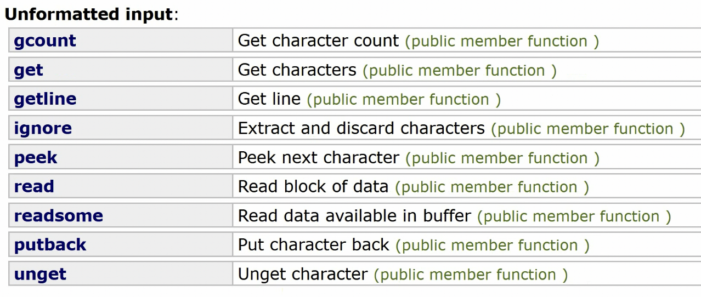

# 内容

1. 分析string的设计、实现
2. 由at方法引出的`C++`异常机制（有单独详细的文章）
3. 由字符串对象的比较引出的`<compare>`库、**比较机制（三路比较）**
4. `cout`输出流机制，以及引出的友元
5. `cin`输入流机制
6. 引入**右值引用**拷贝、赋值
# String的历史
在`C++`手册中的`<string>`header中，Class instantiations（类实例）有：string、u16string、u32string、wstring（宽字符）。
string 是 ANSI 规范的普通字符。
wstring（宽字符）是 Unicode 字符集，开发中推荐使用。
# String方法
1. `length()`：返回字符串有效字符长度，即不包括`\0`。
2. `size()`：也是返回有效字符长度。与`length()`等价。
    1. 但在 vector 中，二者有区别。
    2. Cpp字符串的长度函数是以上两个，调用形式是：`str.size() str.length()`。而C语言的`<cstring>`中的调用形式是`strlen(str)`
# 仿写成员方法

## 基本思想1：体现面向对象中封装的特性：构造
## 基本思想2：RAII
RAII 全称 Resource Acquisition is Initialization. 这是`C++`的设计哲学。
意为：`C++`的对象在创建或构造时意味着初始化的开始，比如`char * _str`成员在string构造时自动地指向一块新申请的区域。那么，相对应的过程是析构就意味着要释放资源。这个过程就是推荐的`C++`对象的自然设计、自然行为。
而Java的设计理念是类启动时并没有进行初始化，还要进行`init()`。
### 常量字符串构造
`std::string str("Hello")`
```cpp
class MyString
{
public:
    MyString(const char * str)
    {
        if(!str) return;
        size_t len = strlen(str);
        _str = new char[len + 1];
        strcpy(_str, str);
    }

    const char * c_str(void) const
    {
        return _str;
    }
private:
    char * _str{ nullptr };
}
```
### 拷贝构造
```cpp
class MyString
{
public:
    MyString(MyString const & str)
    {
        if(!str._str) return;
        size_t len = strlen(str._str);
        _str = new char[len + 1];
        strcpy(_str, str._str);
    }
}
```
## 赋值重载

把旧的内容清空，赋予新的内容。
```cpp
class MyString
{
public:
    MyString& operator = (const char * str)
    {
        if(_str)
        {
            delete[] _str;
            _str = nullptr;
        }
        if(str != nullptr)
        {
            size_t len = strlen(str);
            _str = new char[len + 1];
            strcpy(_str, str);
        }
        return *this;
    }
    MyString& operator = (MyString const & str)
    {
        if(&str == this) return *this;
        if(_str)
        {
            delete[] _str;
            _str = nullptr;
        }
        if(str._str != nullptr)
        {
            size_t len = strlen(str._str);
            _str = new char[len + 1];
            strcpy(_str, str._str);
        }
        return *this;
    }
}
```
## `+=`
两种情况：
1. 类本身是空的，则直接new，复制
2. 类有东西，则想办法搞合适的空间，追加
    1. 可能要扩容原空间

```cpp
class MyString
{
public:
    MyString& operator += (const char * str)
    {
        // 要追加的str为空 退出
        if(!str) return *this;
        
        size_t oldlen = strlen(_str);
        size_t newlen = strlen(str);
        // 要追加的str内容为空串 退出
        if(newlen == 0) return *this;

        // 重新分配更大的空间
        // 需要先备份到newstr临时空间
        char * newstr = new char[oldlen + newlen + 1];
        strcpy(newstr, _str);
        strcat(newstr, str);
        //如果本身串不为空 则需要销毁旧空间
        if(_str != nullptr)
        {
            delete[] _str;
            _str = nullptr;
        }
        _str = newstr;
        return *this;
    }
    MyString& operator += (MyString const & str)
    {
        //
    }
}
```
## 析构

```cpp
~MyString()
{
    if (_str)
    {
        delete[] _str;
        _str = nullptr;
    }
}
```
## Boolean Operator

为了便于运算`if(str)`这类语句。`C++11`版本允许有bool运算符的重载。

bool运算符的重载的特点：
1. 因为布尔运算符的返回值必须为Boolean，锁定了返回值类型，所以可以省略不写。
2. 和小括号运算符不一样，小括号运算符可以返回任何值类型，但bool运算符必须返回boolean类型。
```cpp
class MyString
{
public:
    // 不用写返回值，默认就一定是bool类型
    operator bool() const
    {
        return _str;
    }
}
```
## at（抛异常，检查边界）

有两种：
1. at位置的字符不能修改
2. at位置的字符可以修改

1. 可能会out of range。
2. 返回的都是引用类型，引用不能为空，所以不能通过返回值是否为空来判断是否错误了，所以得用异常机制。
```cpp
#include<exception>
class OutOfRange : public std::exception
{
public:
    OutOfRange() : std::exception{"MyString: out of range!"}
    {
    }
}
class MyString
{
public:
    char & at(const size_t off)
    {
        size_t len = strlen(_str);
        if(off > strlen - 1)
            throw OutOfRange{};
        return _str[off];
    }
    char const & at(const size_t off) const
    {
        size_t len = strlen(_str);
        if(off > strlen - 1)
            throw OutOfRange{};
        return _str[off];
    }
}
int main()
{
    if(str)
    {
        try
        {
            std::cout << str.at(11) << std::endl;
        }
        catch (const std::exception &e)
        {
            std::cout << e.what() << std::endl;
        }
    }
}
```
## `[]`（不抛异常，不检查边界）

与at函数的不同在于，`[]`是不抛出异常的，因此不检查边界。如果越界，则行为未定义。
```cpp
class MyString
{
public:
    char& operator[](const size_t off) noexcept
    {
        return _str[off];
    }
    char const & operator[](const size_t off) const noexcept
    {
        return _str[off];
    }
}
```
## `<=>`三路比较运算符

`C++20`标准中，有`<compare>`库。
1. `strong_ordering`
    1. less
    2. greater
    3. equal：相等
    4. equivalent：等价
2. `weak_ordering`
    1. less
    2. greater
    3. equivalent：等价，或者说模糊的相等
3. `partial_ordering`
    1. less
    2. greater
    3. equivalent
    4. unordered

`strong_ordering`测试如下
```cpp
#include<compare>
int main()
{
    int a = 3;
    int b = 4;
    auto c = a <=> b;//c的类型：std::strong_ordering
    if(c < 0)
        std::cout << "less" << std::endl;
    else if(c > 0)
        std::cout << "greater" << std::endl;
    else if(c == 0)
        std::cout << "equal" << std::endl;
    return 0;
}
```

`partial_ordering`测试如下，主要测试`unordered`的情况。用一个NaN浮点数比较时，就会出现。
>NaN定义于limits库

```cpp
#include<limits>
int main()
{
    double a = 4.0;
    double b = std::numeric_limits<double>::quiet_NaN(); //得出double类型的NaN
    auto c = a <=> b; //c的类型：std::partial_ordering
    if(c < 0)
        std::cout << "less" << std::endl;
    else if(c > 0)
        std::cout << "greater" << std::endl;
    else if(c == 0)
        std::cout << "equivalent" << std::endl;
    else
        std::cout << "unordered" << std::endl;
    return 0;
}
```

对于字符串来说，我们返回一个strong或weak都可以。strong要求肯定更严格一些，比如区分字母大小写等等，而weak要求则松一些，比如不管大小写，都算相等。

类中怎么使用`<=>`
1. default的`<=>`是按照类中的成员顺序依次比较。
2. 如果不是按照默认顺序依次比较，则需要自定义函数逻辑

以下是默认的例子
```cpp
class Point
{
public:
    Point(int x, int y) : _x{ x }, _y{ y }
    {
    }
    std::strong_ordering operator <=> (Point const & pt) const = default;
    
private:
    int _x;
    int _y;
};
int main()
{
    Point pt{1, 2}, pt2{1, 2};
    if(pt == pt2)
    {
        std::cout << "equal" << std::endl;
    }
}
```
### string中的实现
以下回到MyString中的`<=>`比较运算符。我们定义其返回`weak_ordering`。即不管大小写混合与否，都是等价关系。总的来说，我们在大小写不敏感的情况下返回`weak_ordering`。

1. 统一大小写，再比对，一样则返回等价，不一样则返回大、小

```cpp
#include<compare>
class MyString
{
public:
    std::weak_ordering operator <=> (MyString const & other) const noexcept
    {
        // 全部转换为大写或小写。可以使用cctype中的toupper、tolower处理
        /*for
        if(!islower())
        {
            tolower()
        }*/
        int c = strcmp(_str, other.c_str());
        if(c == 0)
            return std::weak_ordering::equivalent;
        else if(c > 0)
            return std::weak_ordering::greater;
        else
            return std::weak_ordering::less;
    }
}
```
类中只要定义了`<=>`这个运算符（参数是一个const 同类引用），那么，外部的比较运算符就转向运行该函数进行比较。
```cpp
int main()
{
    MyString str{ "Hello" };
    MyString str2{ "Hello" };
    if(str == str2)
        std::cout << "equal" << std::endl;
    else if(str < str2)
        std::cout << "less" << std::endl;
    else
        std::cout << "greater" << std::endl;
}
```
## cout识别本类（全局重载）

cout 是 ostream 的实例。如果我们要做到让 cout 认识自定义类 MyString 的话，就需要重载 cout 的`<<`运算符。注意，与 MyString 的成员方法没关系，因为cout的形式是：`std::cout << str`。
```cpp
std::ostream& operator <<(std::ostream &os, MyString const & str)
{
    os << str.c_str();
    return os;
}
```
## 友元

假如类外部需要访问类内私有成员，则需要再类内任意位置授权该类外函数。即在函数声明形式的语句之前，加friend。
这是遵循封装性的程序设计下的一种妥协的通路。在特殊情况下，可以破坏封装性。
```cpp
class MyString
{
    friend std::ostream& operator << (std::ostream& os, MyString const& str);
}
std::ostream& operator <<(std::ostream &os, MyString const & str)
{
    // private
    os << str._str;
    return os;
}
```
## cin
cin 的位置在`<istream>`中。内部有输入缓冲区。以回车标志着输入完毕，空格标志着数据的间隔。
```cpp
#include <iostream>
int main()
{
    std::string str;
    std::string str2;
    std::cin >> str;
    std::cin >> str2;
}
// 输入：12 23 34 回车
// str: 12
// str2:23
```
### cin的方法

`cin.get()`方法不带参数表示从缓冲区析出一个字符，并且不再返回缓冲区。
如果放在`cin >> x`的后面，前面`>>`已经把有效数据拿走，则此时恰好可以在间隔符（空格或回车）的位置上get，因此不会影响正常数据。
```cpp
#include <iostream>
int nums[100];
// 向nums输入数据，以空格为间隔，以回车为结束标志
int main()
{
    int i = 0;
    while (std::cin >> nums[i++])
    {
        if (std::cin.get() == '\n')
            break;    
    }
    for (int j = 0; j < i; ++j)
        std::cout << nums[j] << std::endl;
}
// 输入：1 2 3 4 5 6 7 回车
// 输出：1 2 3 4 5 6 7
```
### cin重载（全局）
首先调用cin的`>>`后用户要先输入一些东西，保存到了缓冲区。
需要用到`cin.get(char* s, streamsize n)`表示从缓冲区析出 n 个字符大小，写入 s 指向的区域中。
```cpp
std::istream& operator >>(std::istream& is, MyString const& str)
{
    char * in_c_str = new char[1024];
    memset(in_c_str, 0, 1024); // <cstring>
    
    is.get(in_c_str, 1024);    // 1. 从缓冲区析出1024个字符，写入到in_c_str中
    
    // 要追加的str为空 退出
    if(!&str) return *this;
    
    size_t inlen = strlen(in_c_str);
    // 要追加的str内容为空串 退出
    if(inlen == 0) return *this;
    
    size_t oldlen = strlen(_str);
    // 重新分配更大的空间
    // 需要先备份到newstr临时空间
    char * newstr = new char[oldlen + newlen + 1];
    strcpy(newstr, _str);
    strcat(newstr, in_c_str);
    //如果本身串不为空 则需要销毁旧空间
    if(_str != nullptr)
    {
        delete[] _str;
        _str = nullptr;
    }
    _str = newstr;

    return is;               // 2. 返回is
}
```
## 测试
```cpp
int main()
{
    MyString str{"Hello"};
    std::cout << str.c_str() << std::endl;
    MyString str2{str};
    // MyString str2 = str; 等效于MyString str2{str}; 都是走拷贝构造
    std::cout << str2.c_str() << std::endl;
    str = "Test =";
    std::cout << str.c_str() << std::endl;
    if(str)
    {
        std::cout << str.c_str() << std::endl;
    }
    str += "Test +=";
    std::cout << str.c_str() << std::endl;

    std::cout << str.at(5) << std::endl;
}
```
# 问题代码


问题：
1. 在`return String(newch)`后，不能delete该函数体中的缓冲区newch，造成内存泄漏。
2. 系统崩溃。因为返回的将亡值`String(newch)`在`s3 = s1 + s2`语句结束前浅拷贝，把有值的str给了s3的str。语句结束后自动析构，释放了堆区空间`(String(newch)).str`，虽然str置空了，但s3的str是脏值。
    1. 首先，由于堆区释放了，s3用不了了
    2. 其次更严重的是，main函数结束时由于s3的str为脏值，不为空，因此会再次`delete[]str`，导致系统崩溃。
# 引入右值赋值函数


此时，等号赋值调用右值移动函数，将临时构造的s1+s2对象的str的拥有权转移给了s3。
# 将亡值

某一句表达式产生了一个不具有名字的实体。
生存期只存在某一句表达式中。
此实体即为将亡值。
# 右值引用

## 1
```c
String fun()
{
    String s2 = ("yhping");
    return s2;
}
int main()
{
    String s1;
    s1 = fun();
    return 0;
}
/*
此程序产生3个对象。
首先main函数产生s1；					1
其次，fun函数栈帧产生s2对象。			2
然后，拷贝s2构造一个无名对象到main函数栈帧。 3	
s1再调用等号赋值，即无名对象的值赋给s1。
*/
```
## 2
```c
String & fun()
{
    String s2 = ("yhping");
    return s2;
}
int main()
{
    String s1;
    s1 = fun();
    cout << s1 << endl;
    return 0;
}
/*
不能这样做。
因为如果要以引用返回，则s1会从析构后的s2上取值，则会产生随机值
*/
```
## 3
右值引用只能引用字面常量或**无名**量。左值引用不能引用无名量。
```c
int main()
{
    String s1;
    
    String & sx = s1;
    String && sy = sx;//error
    String && sz = String("hello");//ok
}
```

```c
String && fun()//error，因为s2有名字，不能以右值引用方式返回。
{
	String s2("yhping");
	return s2;
}
```

```c
int main()
{
    int && a = 10;
    int && b = a;//依然不可以，虽然a是一个右值引用，但是a有了名字，所以b不能右值引用a。
}
```
## 4
```c++
class String
{

public:
    String(String && s)
    {
        cout << "move copy construct :" << this << endl;
        str = s.str;
        s.str = NULL;
    }
    String& operator=(String && s)
    {
        
    }
};
```

# 写时拷贝的String
```c
int main()
{
    String s1("xcgong");
    String s2(s1);
    String s3(s2);
    String s4(s3);
}
/*
有两种情况：
如果是浅拷贝，则会出现重复析构；
如果是深拷贝，则会出现多次重复的堆空间。
*/
```
写时拷贝的String是GCC里String的方案。