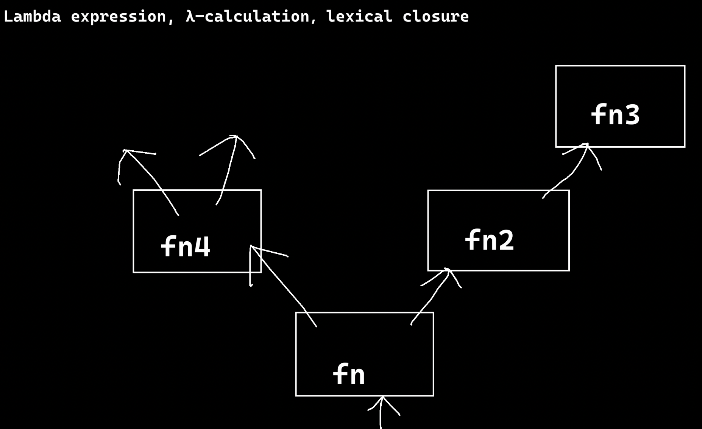

# 仿函数
Functor

仿函数是类。
相比于普通函数，仿函数作为类对象，有更多功能可以集成。

```cpp
class IsOdd
{
public:
    bool operator () (int const& v)
    {
        return v % 2 != 0;
    }
};
```
使用如下：需要先实例化出一个对象。
```cpp
int main()
{
    std::vector<int> vec{ 0, 1, 2, 3, 4, 5, 6, 7, 8 };
    
    IsOdd is_odd_functor;

    auto it != std::find_if(vec.begin(), vec.end(), is_odd_functor);
}
```
## 剖析find_if
1. first和last是迭代器，需要先解引用才能使用pred去判断值。
2. first到last左闭右开，first等于last时结束。
3. 内部封装了pred的实际调用形式`pred(...)`。所以不管是函数、仿函数，只要支持`(...)`的调用形式就能使用。
```cpp
template <class InputIterator, class UnaryPredicate>
InputIterator find_if(InputIterator first, InputIterator last, UnaryPredicate pred)
{
    while (first != last)
    {
        if (pred(*first))
            return first;
        else
            ++first;
    }
    return last;
}
```
# lambda表达式

也叫lambda-calculus（演算）、lexical closure（词法闭包，闭包指穷举所有的状态）

>在`C++`中，本质上是生成了一个类，拥有一个static方法。

为什么叫做词法闭包呢？

假设，fn在内部定义了fn2、fn4，fn2内部定义了fn3。外界调用fn时是看不到它的内部的。但fn的结果依赖于fn2、fn4，fn2依赖于fn3。
总之，定义在内部，外界看不到，类似于黑盒，而且各部分的依赖关系不能断，需要穷尽路线，所以叫闭包。
1. 功能不在全局定义，而是在内部定义。空间不易混乱
2. fn可以直接使用fn2作为部分功能

有了lambda表达式，就可以形式上在函数中嵌套定义函数了。
但有个问题，fn中定义的变量，fn2可以访问吗？
```cpp
#include <iostrean>
void bar(void)
{
    
}
int main()
{
    return 0;
}
```
## 写法形式
```cpp
[Capture List](Parameters) -> ReturnType {};
    ^              ^       ^       ^      ^
 捕获列表          参数   goes to  返回类型  函数体
```
类似于函数，可以互相传递，还可以在中间捕获。
```cpp
#include <iostrean>
int bar(void)
{
    int a = 10;
    // 以下生成了函数对象，可以就地调用：
    int b = [a]() -> void 
        {
            return a + 20;
        }()/* 熟悉的函数调用标志：圆括号 */;
    int c = [a](int v) -> void 
        {
            return a + v + 20;
        }(5);
    return b;
}
int main(void)
{
    int r = bar();
    return 0;
}
```
## 按值捕获
```cpp
int bar()
{
    int a = 10, b = 11;
    int c = [a, b](int v) -> int
        {
            return a + b + v + 20;
        }(5);
    // 也可以在中括号只填一个"="，代表按值捕获全部
    int d = [=](int v) -> int
        {
            return a + b + v + 20;
        }(5);
    return c;
}
```
按值捕获时，内部lambda函数对捕获的变量修改时，外部值不变，相当于成为了自己的局部变量。
这个捕获的局部变量在内部也是默认不能改值的，但可以加mutable。明确告诉编译器自己要修改，并不是误会。但加了mutable依然不会影响外部。
```cpp
int bar()
{
    int a = 10, b = 11;
    int c = [=](int v) -> int
        {
            return a + b++ + v + 20; // error, b can't be modified.
        }(5);
    int d = [=](int v) mutable -> int
        {
            return a + b++ + v + 20; // ok. , b = 12
        }(5);
    return b;  // b = 11
}
```
## 按引用捕获

```cpp
int bar()
{
    int a = 10, b = 11;
    // 如果想要按引用捕获全部变量，可以在[]中只写一个"&"
    int c = [=, &b](int v) -> int
        {
            return a + b++ + v + 20;
        }(5);
    return b;  // b = 12
}
```
1. 如果想要按引用捕获全部变量，可以在`[]`中只写一个"&"
2. 也可以在中括号只填一个"="，代表按值捕获全部
3. 但是不能`[=, &]`既全部按值又全部按引用。同时存在时必须有一个是部分变量如`[=, &b]`
4. 引用可以把外部值联动改变。
## 函数对象
1. 可以用函数对象来存储定义的lambda函数。
2. 不能用函数指针直接引用。
```cpp
int bar()
{
    int a = 10, b = 11;
    
    auto lambda = [=, &b](int v) -> int
        {
            return a + b++ + v + 20;
        };
    return lambda(5);
}
```
以上是使用auto来自动推断、接收。
也可以使用`std::function`准确定义相应的函数对象类型来接收lambda函数。（也可以接收普通函数，只要返回值类型、参数类型符合即可）
```cpp
#include <functional>
int bar()
{
    int a = 10, b = 11;
    
    std::function<int(int)> lambda = [=, &b](int v) -> int
        {
            return a + b++ + v + 20;
        };
    return lambda(5);
}
```
## lambda函数对象的生存周期
```cpp
std::function<int(int)> bar()
{
    int a = 10, b = 11;
    std::function<int(int)> lambda = [=, &b](int v) -> int
        {
            return a + b++ + v + 20;
        }
}
int main()
{
    auto lam = bar();
    int r = lam(5);
    r = lam(5);
}
```
以上main函数调用了两次`bar()`函数内部生成的lambda函数，其中lambda函数自己内部的b是按引用捕获的。
如果是普通函数的栈帧，则bar函数按理来说在第一行代码结束后就会塌陷，导致引用的b空间被污染。
在之前的`C++11`版本确实会存在这类问题，因为`C++`是静态编译期计算的，而Java、C#、Python是有垃圾回收机制的，有一个引用计数，如果仍有人引用b，则不会对其析构，因此往往让这些局部变量在堆上创建。但`C++`早期是建立在栈上，因此会发生问题。
后续版本`C++17`之后克服了此问题，每个厂商具体细节不同，微软公司也是把局部变量建立在堆上了，并用智能指针管理，即使bar函数栈帧塌陷了，也会帮你把类似a、b的局部变量存储到其他地方。
## lambda函数与面向对象结合（捕获this）
比如让lambda函数调用某个对象的成员方法、成员变量，可以在lambda表达式中的捕获列表里写this指针。
# 面向函数编程
比较关心逻辑，不太关心细节。细节用高阶函数来完成。
就像是：如果不使用`copy_if`来做filter，那么就需要另写繁琐的for循环。

