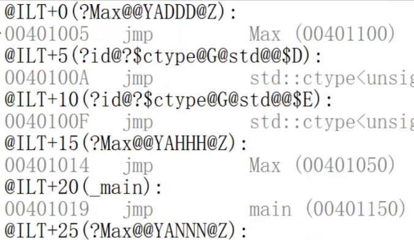

# C++体系内容
要掌握C++，需要建立以下知识体系：
* 编译链接过程
* 函数调用过程
* C和C++区别
    * 基础部分和C++基本一样，只需区分
    * 数组、循环、判断、宏不再讲，一样
* 面向对象
* 运算符重载
* 模板
* 继承与多态
* STL：容器、泛型算法、函数对象
* 智能指针
* C++项目

本篇文章通过介绍C和C++的区别，一窥C++的体系形态。
# 输入输出

```cpp
#include<stdio.h>
int main()
{
    int a = 0;
    char ch = '\0';
    scanf("%d %c", &a, &ch);
    printf("a = %d , ch = %c \n", a, ch);
    return 0;
}
```

```cpp
#include<iostream>
using namespace std;
int main()
{
    int a = 0;
    char ch = '\0';
    cin >> a >> ch;//不可写作cin >> a, ch;
    cout << "a = " << a << "\t" << "ch = " << ch << endl;
    return 0;
}
```

# 函数的区别

## 函数参数默认值

```c++
int fun(int a, int b, int c)
{
    cout << a << endl;
    cout << b << endl;
    cout << c << endl;
    return 0;
}
```


```c++
int fun(int a, int b, int c = 10)
{
    cout << a << endl;//<<为输出运算符。
    cout << b << endl;
    cout << c << endl;
    return 0;
}
int main()
{
    int a = 1;
    int b = 2;
    fun(a,b);
    //知识点：函数的默认值参数：如果不传c，则填充默认值，push 0Ah，其他的参数push eax。
    //在函数声明或者定义的时候给定参数默认值；如果实参传递的时候不给该形参传值，则会按照默认值传参。
    //函数的默认值参数 是在编译期，生成指令的时候，直接生成入参指令。
    //函数参数默认值不能传递变量，必须是常量。因为变量在编译期时无法取值。
    return 0;
}
```

```c++
//以下情况不可以，在调用此函数时，会出现歧义。因此编译器不能通过。
//函数的参数只能从右向左依次连续赋值，不能跳过
int fun(int a, int b = 10, int c)
{
    cout << a << endl;
    cout << b << endl;
    cout << c << endl;
    return 0;
}
```

```c++
//但是如下代码可以运行，结果为1, 10, 20.
//相当于fun函数在定义时定义c的默认值为20，在声明时定义b的默认值为10。
int fun(int a, int b, int c = 20)
{
    cout << a << endl;//<<为输出运算符。
    cout << b << endl;
    cout << c << endl;
    return 0;
}
int fun(int a, int b = 10, int c);
int main()
{
    int a1=1;
    fun(a1);
}
```


```c++
//错误，函数的默认值参数在同一作用域只能赋值一次，不能重复给相同的一个参数赋值。
int fun(int a, int b, int c = 20)
{
    cout << a << endl;//<<为输出运算符。
    cout << b << endl;
    cout << c << endl;
    return 0;
}
int fun(int a, int b, int c = 30);
//无法运行，提示参数默认值重定义赋值。
```

```c++
//不可行。编译是针对单文件的，所以不能知道在其他文件函数中定义的函数参数默认值
#fun.cpp
int fun(int a, int b, int c = 20)
{
    cout << a << endl;
    cout << b << endl;
    cout << c << endl;
    return 0;
}
#main.cpp
int fun(int a, int b, int c);
int main()
{
    int a1 = 1;
    int b1 = 2;
    fun(a1,b1);
    return 0;
}
```

### 总结

因为函数参数的默认值是在编译器带入的，所以函数的参数的默认值只能在本单文件（不包括头文件，头文件的信息是在预编译期就展开了。）生效。

## inline和内联

在调用内联函数时，该函数会在调用点将代码展开（复制）。

```c++
inline int fun1(int a, int b)
{
    int c = a + b;
    cout << c << endl;
    return c;
}
int main()
{
    int a1 = 1;
    int b1 = 2;
    fun1(a1,b1);
    return 0;
}
```

### 与一般函数的对比

* 一般函数调用是一个消耗很大的过程
    1. 传参
    2. call调用函数
    3. 开辟栈帧
    4. 如果有返回值则返回结果
    5. 栈帧回退
    6. 参数清除


* 内联函数
    1. 在函数的调用点展开（函数体中的指令复制过去）
    2. 不用传参
    3. 不用call
    4. 不用...


### debug和release对比

* 在debug版本，内联函数失效，和正常函数调用方式一致；
* 在release版本，在调用内联函数时候，该函数会在调用点展开。

### 哪些函数不能被展开

内联函数是在编译时期，生成指令时展开的。

* 递归函数无法展开。因为递归函数的终止条件一定需要由变量决定，递归层数不定。而编译期是无法得知变量的具体值。所以递归函数不能被处理为内联函数。

### inline和内联的关系

```c++
inline int fun1(int a, int b)
{
    fun1(a,b);
    //不报错，只警告
}
```

为何不会报错？

**inline只是对编译器、CPU的建议**，声明建议将该函数处理为内联。实际情况由编译器视情况决定。意思就是：虽然有的函数加了inline修饰，但是结果不一定被内联处理。

## 宏函数、static函数、内联函数的对比

### 宏函数

```cpp
#define SUM(a,b) {a+b;}
```

1. 预编译时期在调用点展开
2. 无法调试
3. 没有参数类型安全校验，因为它连类型都无法指出
4. 作用域：单文件可见
5. 预编译期就展开了，不生成符号

### static函数

1. 不展开
2. 可以调试
3. 有参数类型安全校验
4. 作用域：单文件可见
5. 生成local型符号

### 内联函数

1. debug版本不展开；release版本在调用点展开
2. debug版本可以调试；release版本不可调试
3. 有参数类型安全校验
4. 作用域：单文件可见
5. debug生成local符号；release版本不生产符号。
    * 为何在release版本不生成符号？：编译期间已经展开了，相当于函数签名是透明的，不能生成符号
    * 为何在debug版本生成符号？：debug要求能够调试函数，既然要调试函数，就要知道函数的详细信息，不能内联处理，所以要生成符号以标识。
    * 为何debug版本生成的是local符号？：编译期只处理、生成单文件，内联函数本意是只展开在本单文件中，不能用于其他文件，所以只能是local符号。

### 普通函数

不展开，可以调试，有参数类型校验，多文件可见，生成global符号。

## 函数的重载-静多态

函数的重载--静多态--编译时期的多态--早绑定

### 函数的原型

函数的重载就要看准函数的原型：包括函数返回类型、函数名、形参列表（其中形参名可省略），且不需要函数体。

但是我们不能拿函数返回类型作为重载的标志，因为会产生**二义性**。

```cpp
char Max(char a, char b)
{
    return a>b?a:b;
}
int Max(char a, char b)
{
    return a>b?a:b;
}
//如此如果能编译通过的话，你说你是返回char还是返回int？char本质上也是一个整型！所以不能这样编写。
```

所以Cpp中的重载就是：函数名相同，参数列表不同。

### 按函数生成的符号区分函数

符号不能同名，否则被认为是重定义。因此生成的符号不能一样。

Cpp中的函数可以重载，C语言不可以。因为C语言和Cpp生成函数符号的效果不同。

* C语言生成函数符号**仅依赖函数名**。

```c++
//c语言的写法
bool compare1(int a, int b)
{
    return a > b;
}
bool compare2(char a, char b)
{
    return a > b;
}
int main()
{
    int a1 = 1;
    int b1 = 2;
    
    char a2 = 'c';
    char b2 = 'b';
    
    compare1(a1,b1);
    compare2(a2,b2);
}
```

* C++生成函数符号依赖**函数名和参数列表**（返回值不影响）。

```c++
bool compare(int a, int b)
{
    cout << "bool compare(int a, int b)" << endl;
}
bool compare(char a, char b)
{
    cout << "bool compare(char a, char b)" << endl;
}
```

### 静多态

函数重载后，究竟调用哪个函数？是在编译时期决定的，因为编译生成指令和符号，才能确定call哪个具体的函数——静多态的一种

```c++
//可以运行，因为虽然main中只是声明，但是会生成UND符号，会寻找链接。
#fun.cpp
bool compare(int a, int b)
{
    cout << "bool compare(int a, int b)" << endl;
}
bool compare(char a, char b)
{
    cout << "bool compare(char a, char b)" << endl;
}
#main.cpp
bool compare(int a, int b);//*UND*
bool compare(char a, char b);
int main()
{
    int a1 = 1;
    int b1 = 2;
    
    char a2 = 'c';
    char b2 = 'b';
    
    compare1(a1,b1);
    compare2(a2,b2);
}
```

### 名字修饰约定（名字粉碎）



#### 修饰名(Decoration name)

“C”或者“C++”函数在内部（编译和链接）通过修饰名识别。修饰名是编译器在编译函数定义或者原型时生成的字符串。有些情况下使用函数的修饰名是必要的，如在模块定义文件里头指定输出“C++”重载函数、构造函数、析构函数，又如在汇编代码里调用“C”或“C++”函数等。

修饰名由函数名、类名、调用约定、返回类型、参数等共同决定。

#### 名字修饰约定

名字修饰约定随调用约定和编译种类(C或C++文件)的不同而变化。下面分别说明。 

* C编译时函数名修饰约定规则：
    1. `__stdcall`调用约定在输出函数名前加上一个下划线前缀，后面加上一个“@”符号和其参数的字节数，格式为`_functionname@number`。
    2. `__cdecl`调用约定仅在输出函数名前加上一个下划线前缀，格式为`_functionname`。
    3. `__fastcall`调用约定在输出函数名前加上一个“@”符号，后面也是一个“@”符号和其参数的字节数，格式为`@functionname@number`。

它们均不改变输出函数名中的字符大小写，这和PASCAL调用约定不同，PASCAL约定输出的函数名无任何修饰且全部大写。

* C++编译时函数名修饰约定规则：
    1. `__stdcall`调用约定：
        1. 以“`?`”标识函数名的开始，后跟函数名；
        2. 函数名后面以“`@@YG`”标识参数表的开始，后跟参数表；
        3. 参数表以代号表示
            1. `X--void ， D--char， E--unsigned char， F--short， H--int，I--unsigned int， J--long， K--unsigned long， M--float，N--double， _N--bool，.... `
            2. `PA`表示指针，后面的代号表明指针类型，如果相同类型的指针连续出现，以“`0`”代替，一个“`0`”代表一次重复；
        4. 参数表的**第一项为该函数的返回值类型**，**其后依次为参数**的**数据类型**，**指针标识在其所指数据类型前**；
        5. 参数表后以“`@Z`”标识整个名字的结束，如果该函数无参数，则以“`Z`”标识结束。
            1. 其格式为“`?functionname@@YA*****@Z`”或“`?functionname@@YG*XZ`”。例如`int Test1(char *var1,unsigned long)`：“`?Test1@@YGHPADK@Z`”
    2. `__cdecl`调用约定：规则同上面的`_stdcall`调用约定，只是参数表的开始标识由上面的“`@@YG`”变为“`@@YA`”。
    3. `__fastcall`调用约定：规则同上面的`_stdcall`调用约定，只是参数表的开始标识由上面的“`@@YG`”变为“`@@YI`”
    4. VC++对函数的缺省声明是"`__cedcl`"，将只能被C/C++调用。

# 符号

符号=数据+指令

## 符号的来源

所有的数据都会生成符号。

指令中（比如函数声明）只有函数名会生成符号。

## 符号又可分为两种

* 全局符号-global符号
    * 所有的文件都可以引入。

* 局部符号-local符号
    * 只有本文件可见。

## 具体表现

* 普通的函数生成的是global符号。
* 被inline修饰的函数，语义为只在本文件可见，所以生成的是local符号。
* 如果函数只是声明而未在本文件定义，生成的符号是UND。
* inline函数在debug版本生成的是local型符号；如果处理为内联之后，在release版本下不生成符号，因为它已在调用点处展开了。

# extern关键字

两种用法：

1. C++中，干预编译器，extern "C"是以C方式编译，extern "C++"是以C++方式编译；
2. C语言中，告诉编译器，函数是外部函数，既可以用在本文件，也可用在其他文件。

## 在cpp文件中调用c文件

矛盾点：

1. C++调用C--C++产生函数符号-（函数名+参数类型列表），C语言产生函数符号-（函数名）
2. C语言调用C++--如果将C++的函数符号改为C语言的函数符号--需要改动C++源文件--不现实。正确解决办法是添加自己实现的C++文件，写**C++函数作为中间层去调用需要的C++函数，然后让自实现的C++函数产生C语言符号（extern C）**。

```c
#func.c

#include<stdio.h>
void fun_C()
{
    printf("void fun_C()");
}
#main.cpp
void fun_C();
//cpp生成的符号的方式是取决于函数名和参数列表。
//而c生成的符号只是函数名
//c和cpp生成符号的规则不一样，所以导致符号找不到。
int main()
{
    fun_C();
    return 0;
}
```

所以，如何在cpp文件中调用c函数？

```cpp
//如何解决——使用C语言的方式编译和生成符号。
extern "C"
{
    void fun_C();//声明
}
int main()
{
    fun_C();
    return 0;
}
```

如果想反过来呢？在c文件中怎么调用cpp的代码？如何解决？

```c++
#fun.cpp
void fun_CPP()//生成的符号：fun_CPP_void
{
    printf("void fun_CPP()");
}

#func.c
void fun_CPP();//生成的符号：fun_CPP
int main()
{
    fun_CPP();
    return 0;
}

```

解决方案：中间加一层

```c++
//C调用C++的代码方法
------------------------------------------
#fun.cpp
int fun_CPP(int a)//生成Cpp符号：fun_CPP_int
{
    printf("int fun_CPP(int a)");
    return a;
}
------------------------------------------
#tmp.cpp
void fun_CPP();			//声明
extern "C"
{
    int fun_CPP_tmp(int a)	//要与fun_CPP形式一致
    {
        return fun_CPP(a);
    }
}
-----------------------------------------
#func.c
int fun_CPP_tmp(int a);//生成C符号：fun_CPP
int main()
{
    int n = 100;
    int res = fun_CPP_tmp(100);
    return 0;
}
```

# namespace

实际上是个头文件。

```c++
//tmp.h
namespace AA
{
    typedef int INT;
    typename char CHAR;
}
```


```c++
#include<iostream>
using namespace AA;
int main()
{
    INT a = 10;//需要使用命名空间AA才能编译通过。
    return 0;
}
```

另外一种使用方式

```c++
using AA::INT;//拿出命名空间中特定的某一个使用。
```

namespace主要作用是封装，防止命名冲突问题。

# 指针和数组

```c++
//fun.cpp
int arr[]={0,1,2,3,4,5,6,7,8,9};
```

```c++
using AA::INT;
extern int* arr;
/*
指针和数组名的区别——什么是指针
*/
int main()
{
    cout << arr << endl;		//
    cout << *arr << endl;	//
    cout << arr[0] << endl;
}
//输出00000000\n 崩溃
int main()
{
    int a = 10;
    int *p = &a;
    int arr1[]={0,1,2,3,4};
    
    cout << arr1 <<endl;
    cout << p <<endl;
    //输出的都是数组的地址，正常
    //汇编代码：
    //1. lea eax,[arr1];  push eax。直接传值给eax
    //2. mov eax,dword ptr [p];  push eax。有dword ptr，去地址中取值
    ///////
    //数组名就是个地址。本质是常量，是个数字
    //指针是变量。
    
    
    
    
    //在编译时，直接把常量的值替换了常量名字。
    
}
//变量和常量有何区别？
int main()
{
    int a = 20;
    int *p = &a;
    int b;
    b = 20;
    b = a;
    //用常量给变量赋值时，直接拿值替换。
    //用变量给变量赋值时，有一次解引用
    
    b = *p;//去p的内存中将存储的地址拿出来。再去拿出来的地址中取出存储的数据。
    //汇编：
    // mov eax,dword ptr [p]
    // mov ecx,dword ptr [eax]
    // mov dword ptr [b],ecx
}
/*
回到最初的问题，我们把arr当作了指针，把常量当作了变量来用。
常量不用下地址，变量需要下地址。
如果把常量当作了变量来用，编译器会将解引用，把解引用到的数据（数组首元素）当作结果来输出了。即00000000
cout << arr << endl;
mov eax,dword [arr]
mov out,eax
*/
```

# const

```c++
//c_main.c
#include<stdio.h>
int main()
{
    const int a = 10;
    a = 20;//报错，必须是可修改的左值。
    
    int *p = &a;
    *p = 20;
    
    
    printf("%d\n",a);
    
    return 0;
}
```

## C：常-变量

不能作为左值。

## C++：常量

```c++
int main()
{
    const int a = 10;
    //a = 20;
    //int *p = &a;
    cout << a <<endl;
    cout << *p <<endl;
    // 10 10
    
    *p = 20;
    cout << a <<endl;
    cout << *p <<endl;
    //10 20
    //C++中，const常量就是纯常量，而不像C语言中可以轻易通过指针间接修改的。
    //mov out, 0Ah ; cout << a
    //常量：在编译期，将常量的值直接传入到目标中。
}
```

## 面试

为什么常量必须初始化？

因为如果要使用常量又不初始化的话，后期没有机会改。使用一个随机值对于程序没有意义。

如果使用变量给const修饰的量初始化，则该量会退化为常变量。

## 指针和const

```c++
int main()
{
    int *p1 = &a;
    const int *p2 = &a;
    int const* p3 = &a;
    int* const p4 = &a;
    
    int *q1 = &a;
    const int* q2 = &a;
    int const* q3 = &a;
    int* const q4 = &a;
}
```

要点1：const修饰的内容不能作为左值

要点2：不能泄露常量的地址给非常量的指针

const修饰的类型是离它最近的第一个成型的类型。其余的是它修饰的内容。

```c++
int fun(int a)
{
    cout << typeid(a).name() << endl;
    return 0;
}
int fun(const int a)
{
    cout << typeid(a).name() << endl;
    return 0;
}
```

如果const修饰的内容不包含指针，则无法参与类型。

# 动态内存

## C语言

malloc-free

```c
//使用malloc和free申请、释放一维数组、二位数组
int main()
{
    const int n = 10;
    //一维数组
    int *ar = (int*)malloc(sizeof(int)*n);
    //二维数组
    int **ar = (int**)malloc(sizeof(int*)*n);
    if(NULL==ar)
    {
        exit(1);
    }
    for(int i=0;i<n;i++)
    {
        ar[i] = (int*)malloc(sizeof(int)*n);
        if(NULL==ar[i])
        {
            exit(1);
        }
        
    }
    for(int i = 0;i<n;i++)
    {
        free(ar[i]);
    }
}

```

## C++

new-delete

```c++
int main()
{
    int *p = new int;
    *p = 10;
    delete p;
    
    int *arr = new int[10];
    arr[0] = 10;
    delete[]arr;//释放数组
}
```

```c++
int main()
{
    int **arr1 = new int* [4];
    for(int i = 0;i<4;i++)
    {
        arr1[i] = new int[5];
    }
    for(int i =0;i<4;i++)
    {
        delete[]arr1[i];
    }
}
```

## new和malloc区别

1. new是关键字，malloc是函数，new调用malloc。
2. new和malloc都是在堆区申请空间
3. new有三个步骤
    1. 开辟空间
    2. 构造函数。---初始化，这是与malloc的区别。
    3. 返回地址
4. new不会强转返回值类型
5. 封装计算sizeof
6. 空间不足时，new会抛异常（bad_alloc）。malloc会返回空指针。（`int *p = new(nothrow) int(20);`）

## new三种调用形式

1. 关键字
    1. `int *p = new int(10);
2. 函数
    1. `int *p = ::operator new(sizeof(int));` 把new当函数调用，类似于malloc，没有初始化！仍需强转和传入sizeof字节数。但是还是会抛异常。
    2. `operator delete(p);`相当于free，需要用函数形式delete释放，即`operator delete(p)`
    3. 与正常new区别就是没有初始化；
    4. 需要用函数形式delete释放，即operator delete(p)
3. 定位new

```c++
int *pa = (int*)::operator new(sizeof(int));
new(pa) int(10);//不开辟空间，而是用int(10)去初始化pa指向的空间。
```
# 引用

## 是什么

张三——有个小名，二狗子。二狗子和张三是同一个人。

```c++
int main()
{
    int a = 10;
    int& b = a;
    
    
    b = 20;//  mov eax,dword ptr [b]
    cout << a <<endl;
    cout << b <<endl;
	// 20 20

	int *p = &a;
    *p = 20;
}
```

引用的底层是一个指针，

在使用到引用的地方，编译期会自动替换成指针的解引用。

```cpp
//c
void Swap_C(int *ap, int *bp)
{
    assert(ap!=NULL&&bp!=NULL);
    int tmp = *ap;
    *ap = *bp;
    *bp = tmp;
}
//cpp
void Swap_Cpp(int& a, int& b)
{
    //无需断言判空，因为不可能有空引用。
    int tmp = a;
    a = b;
    b = tmp;
}
int main()
{
    int x = 10, y = 20;
    Swap_C(&x, &y);
    Swap_Cpp(x, y);
    return 0;
}
```

引用为什么必须初始化？

引用为什么一旦初始化就无法改变引用的方向？

```c++
int main()
{
    const int c = 20;
    int& d = c;//报错
    const int& d = c;
}
```

笔试常见

```c++
int fun1()
{
    return 10;
}

int main()
{
    int& e = fun1();//报错，不能引用寄存器
    const int& e = fun1();
    
    const int& f = 10;
    
    //当引用一个不可取地址的量的时候，使用常引用
    //会生成一个临时量，实际引用的是这个临时量。
    //为什么必须要const来修饰临时量？因为临时量都有常属性。（关于临时量，面向对象还会涉及。
}
```

## 注意点

1. 定义时必须初始化；
2. 没有空引用
3. 没有二级引用

## 常引用

```c++
int a=10;
int &b=a;
const int& c = b;
```

# 两个概念

## 面向过程

```c++
int flag = 0;
void echo()
{
    if(0 == flag)
    {
    	printf("%s\n","printf screen");
    }
    else
    {
        printf("%s\n","printf file");
    }
}
void set_flag_file()
{
    flag = 1;
}
void set_flag_screen()
{
    flag = 0;
}
```


## 面向对象

```c++
class Note
{
public:
    Note()
    {
        _flag = 0;
    }
    void echo()
    {
        if(0 == _flag)
        {
            printf("%s\n","printf screen");
        }
        else
        {
            printf("%s\n","printf file");
        }
    }
    void set_flag_file()
    {
        _flag = 1;
    }
    void set_flag_screen()
    {
        _flag = 0;
    }
private:
    int _flag;
}
int main()
{
    Note n;
    n.echo();
    n.set_flag_file();
    n.echo();
    
    
    return 0;
}
```

