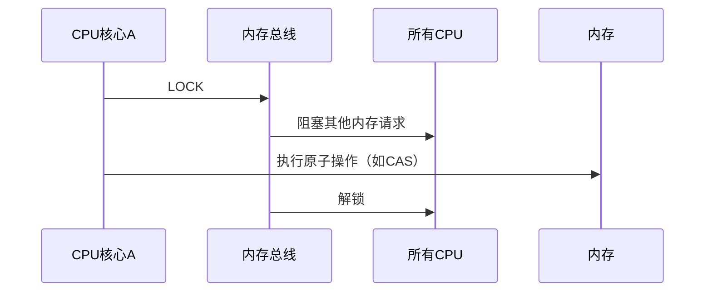

# 线程安全问题

```cpp
int count = 0;
count++;
count--;	/* 是线程不安全的 */
```
后置`++`有多个动作：
1. 取出count的值为tmp
2. 计算`count + 1`
3. `count + 1`的结果赋给count
4. 返回tmp

对应于多条指令。

传统地解决，可以用加锁的方式
```cpp
{
    lock_guard<std::mutex> guard(mtx);
	count++;
}
```
但是，互斥锁是比较耗费资源的，如果临界区的代码比较轻量级，那么传统mutex锁相对而言就比较小题大做了。

现在有新机制解决：指令级并发。

如果想让这么多动作在一条指令内做完的话，需要让处理器支持这样的操作，而不用锁机制，因此这种叫做无锁结构。
# 原子类型
定义于`<atomic>`
原子类型，封装了一个值，保证其的访问不会导致数据竞争，并且可用于同步不同线程之间的内存访问。
## `atomic_flag`
初始化可以赋值为`ATOMIC_FLAG_INIT`，意为无状态，对应false。
1. `test_and_set()`：置位为有状态，对应true，并返回调用之前的状态。这是一个原子操作，不会被其他线程干扰。
2. `clear()`重置flag为无状态
### `atomic_flag`做自旋锁
以下就是一个用`atomic_flag`做忙等待的例子：
1. 初始flag为无状态
2. 调用一次`test_and_set()`置位flag为有状态
3. while中一直调用`test_and_set()`，测试它的状态，直到为无状态时，退出循环，结束程序。

```cpp
#include <atomic>

int main()
{
    std::atomic_flag flag = ATOMIC_FLAG_INIT;
    flag.test_and_set();
    while (flag.test_and_set())
    {
        continue;   
    }
    return 0;
}
```

给定一个`atomic_flag`，初始为无状态，同时启动10个线程，操作之前，调用`test_and_set`，如果测试为无状态，说明没有其他线程在操作，就可以进行操作。
操作完毕后，`clear`重置flag为无状态。下一个线程就可以探测到无状态，开始它的操作。

此时，`atomic_flag`就相当于自旋锁的作用。
```cpp

std::atomic_flag lock_output = ATOMIC_FLAG_INIT;
std::counting_semaphore<10> sema{ 0 };
void worker(int v)
{
    // lock
    while (lock_output.test_and_set())
    {}
    std::cout << "thread #" << v << std::endl;
    // unlock
    lock_output.clear();
}
int main()
{
    std::jthread t[10];
    for (int i = 0; i < 10; ++i)
    {
        t[i] = std::jthread(&worker, i + 1);
    }
    sema.release(10);
    using namespace std::chrono_literals;
    std::this_thread::sleep_for(5s);
    return 0;
}
```
输出：
```
thread #1
thread #5
thread #4
thread #7
thread #2
thread #10
thread #6
thread #3
thread #9
thread #8
```
## atomic
```cpp
template <class T> struct atomic;
```
原子对象的主要特征是，从不同线程访问值不会导致数据竞争（即，这样做是明确定义的行为，访问顺序正确）。
通常，对于所有其他对象，如果同时访问同一对象而导致数据争用，则该操作将被视为未定义行为。

原子对象能够通过**指定不同的内存顺序**来**同步对其线程中其他非原子对象的访问**。
# Relaxed Ordering的问题
```cpp
// Thread 1:
r1 = y.load(std::memory_order_relaxed); // A
x.store(r1, std::memory_order_relaxed); // B
// Thread 2:
r2 = x.load(std::memory_order_relaxed); // C
y.store(42, std::memory_order_relaxed); // D
```
标记为 `memory_order_relaxed` 的原子操作不是同步操作。它们不会在并发内存访问中强加顺序，它们只保证原子性和修改顺序的一致性。
例如，x 和 y 初始为零。
以上程序就会允许产生 `r1 == r2 == 42`，在线程 1 内，A 在 B 之前被排序，并且在线程 2 内，C 在 D 之前被排序。
但是没有什么可以阻止 D 在 A 之前 修改了 y，并且 B 在 C 之前 修改 x 。
D 对 y 的副作用对于线程 1 中的 load A 是可见的，B 对 x 的副作用对于线程 2 中的 load C 是可见的。

特别是，如果在线程 2 中 D 在 C 之前完成，这可能会发生，这可能是在运行时发生的，或者由于编译器重新排序导致的。
>实际上，A、B是不能调换的，因为编译器会看到，同在线程1中，B中的 `r1` 的值依赖于上一句的A对 `r1` 的操作。
>而C、D之间就没有依赖了，因为 D 操作的是 `42`，是个常量。
>所以，经过线程并发、内存重排，可能的执行顺序有：
>A B C D  此时 x、y、r1、r2的值：0、0、0、42
>A B D C  此时 x、y、r1、r2的值：0、42、0、0
>A C D B  此时 x、y、r1、r2的值：0、42、0、0
>A D C B  此时 x、y、r1、r2的值：0、42、0、0
>C A D B  此时 x、y、r1、r2的值：0、42、0、0
>**D A C B**  此时 x、y、r1、r2的值：**42、42、42、42**  => 这时便出现了`r1 == r2 == 42`
>C D A B  此时 x、y、r1、r2的值：42、42、42、0
>D C A B  此时 x、y、r1、r2的值：0、42、42、0

怎么解决呢？
见下文

# 内存顺序
原子操作只是提供了不同线程读写的同步。
但是**没有提供操作顺序的同步**。

比如：线程1修改原子值a，线程2读取原子值a。

两个线程各自的读写操作，确实是保证了不会有脏值。
但是线程1、线程2的顺序没有做控制，
如果线程2想要读出旧值，但是线程1在线程2读值前进行写操作，还是会导致线程2读出脏值。

因此需要提供内存顺序机制。

下面举一个类似的例子，怎么通过原子变量+内存顺序控制，让consumer确保producer执行完毕后，再 load 出 b 的值。
```cpp
void producer(void)
{
    a.store(true, std::memory_order::relaxed);
    b.store(true, std::memory_order::release);
}
void consumer(void)
{
    // memory_order_acquire表示必须排序在x store、y store之后
    while (!b.load(std::memory_order::acquire))
    {}
    if (a.load(std::memory_order::relaxed))
        ++c;
}
int main()
{
    a = false;
    b = false;
    c = 0;
    using namespace std::chrono::literals;
    std::jthread th2(consumer);
    std::this_thread::sleep_for(2s);
    
    std::jthread th(producer);

    th.join();
    th2.join();
}
```


| 类型          | 含义                                                                                                                                                                                  |
| ----------- | ----------------------------------------------------------------------------------------------------------------------------------------------------------------------------------- |
| relaxed     | CPU和编译器可以重新排序变量顺序。<br>这是一种松散的内存顺序，不保证不同线程中的内存访问对原子操作进行排序。                                                                                                                           |
| consume（废弃） | 针对某个原子变量的访问指令（store）重排到此指令（load）前。**即自己load排到针对某个变量的release操作后**。（在`C++26`中被废弃了，推荐用acquire）                                                                                         |
| acquire     | 所有访问指令（store）排到此指令（load）前。**即自己load排到所有release操作后**。                                                                                                                                |
| release     | 所有访问指令（load）排到此指令（store）之后。即自己store排到所有consume、acquire操作之前。<br>扮演了一个同步点（synchronization point）的角色。                                                                                  |
| acq_rel     | The operation loads acquiring and stores releasing。<br>该操作可能扮演两种角色。<br>比如`std::atomic::exchange`操作，两个变量交换：<br>需要load值，可能需要等待release；<br>需要store值，即产生release，需要给其他acquire、consume通知。 |
| seq_cst     | sequentially consistent，意思是该操作以顺序一致的方式排序。一旦所有可能对其他线程产生可见副作用的内存访问已经发生，则所有操作使用此内存顺序。<br>这是最严格的内存顺序，保证了在非原子内存访问中线程交互之间的意外副作用最小。<br>对于consume和acquire的load，顺序一致的store操作被认为是release操作。   |

# lock_free测试
测试以确定原子模板包含的类型是否支持无锁。
```cpp
int main()
{
    std::wcout << std::boolalpha << std::atomic<int>{}.is_lock_free() << std::endl; // true
    std::wcout << std::boolalpha << std::atomic<int>{}.is_always_lock_free << std::endl; // true
}
```
经过测试后发现，不超过8字节（64位）的数据结构，并且没有虚函数表的数据结构，是支持无锁的。
```cpp
struct A {int x, y; A() {}}
struct B {int a[2];}
struct C {int a[3];}

int main()
{
    std::wcout << std::boolalpha << std::atomic<A>{}.is_lock_free() << std::endl; // true
    std::wcout << std::boolalpha << std::atomic<B>{}.is_lock_free() << std::endl; // true
    std::wcout << std::boolalpha << std::atomic<C>{}.is_lock_free() << std::endl; // false
}
```
# 无锁编程的原理
## CAS（Compare-And-Swap）
CAS在执行事务时把整个数据都拷贝到应用中，在数据更新提交的时候比较数据库中的数据与新数据，如果两个数据一模一样则表示没有冲突可以直接提交，如果有冲突就要交给业务逻辑去解决。（具有ABA问题：用版本号或时间戳解决）

现代CPU提供​**​CAS（Compare-And-Swap）​**​ 等原子指令，可在单个指令周期内完成类似以下的判断函数：
```c
bool CAS(T* ptr, T old_val, T new_val)
{
    if (*ptr == old_val)
    {
        *ptr = new_val;
        return true;
    }
    return false;
}
```
以上类似的操作，实际指令执行期间不会被中断，避免了数据竞争。

比如，用这个特性，实现一个自旋锁：
```c
int TestAndSet(int *old_ptr, int new)
{
    int old = *old_ptr;
    *old_ptr = new;
    return old;
}
```

```c
typedef struct lock_t
{
    int flag;
} lock_t;
void init(lock_t *lock)
{
    lock->flag = 0;
}
// 当 flag 为 0 时，函数返回false，退出。加锁成功。flag被修改为 1
void lock(lock_t *lock)
{
    while (TestAndSet(&lock->flag, 1) == 1)
    {} // do nothing
}
void unlock(lock_t *lock)
{
    lock->flag = 0;
}
```
## 内存顺序
```cpp
std::atomic<int> flag(0);
// 线程1
data = 42;                                       // 1. 写数据
flag.store(1, std::memory_order_release);        // 2. 释放屏障：保证 1 一定在 2 前完成

// 线程2
while (flag.load(std::memory_order_acquire) != 1)// 3. 获取屏障：保证读到 flag = 1 时，才退出循环
    ;                                            //    一定能看到data=42
read(data);                                      // 4. 安全读取数据
```
# 无锁数据结构的实现模式
## ”读-修改-写“循环（Read-Modify-Write Loop）
这是实现无锁的关键思维之一：**乐观并发控制**：**先执行操作，提交前，验证数据（tail）未被修改，如果未被修改，再提交**
```cpp
bool CAS(Node* old_ptr, Node* new_ptr)
{
    if (this == old_ptr)
    {
        this = new_ptr;
        return true;
    }
    return false;
}
void push(T value)
{
    Node* new_node = new Node(value);
    Node* old_tail;
    do {
        old_tail = tail.load();              // 读
        new_node->next = old_tail;           // 修改
    } while (!tail.CAS(old_tail, new_node)); // 把 tail 改为 new_node（失败则重试）
}
```
## 帮助机制（Helping Mechanism）​

当线程A发现线程B的操作未完成时，主动协助推进（如无锁队列中帮其他线程移动tail指针）。
## ​​分离并发关注点（如头尾指针分离）​
将数据结构拆分为多个可独立更新的部分，减少竞争点。

这是实现无锁的关键思维之二：​**​局部性原理（Locality Principle）**：通过数据分片（如分槽队列）减少缓存行冲突：
对齐64位。
```cpp
struct alignas(64) PaddedAtomic
{ 
    std::atomic<int> count;  // 独占缓存行
};
```
# ABA问题（乐观锁问题）
乐观锁会出现这种问题。

乐观锁是对于数据冲突保持一种乐观态度，操作数据时不会对操作的数据进行加锁（这使得多个任务可以并行的对数据进行操作），只有到数据提交的时候才通过一种机制来验证数据是否存在冲突（一般实现方式是通过加版本号然后进行版本号的对比方式实现）

特点：乐观锁是一种并发类型的锁，其本身不对数据进行加锁。而是通过业务实现锁的功能。
不对数据进行加锁就意味着允许多个请求同时访问数据，同时也省掉了对数据加锁和解锁的过程。
这种方式节省了悲观锁加锁的操作，所以可以一定程度的的提高操作的性能。
不过在并发非常高的情况下，会导致大量的请求冲突，冲突导致大部分操作无功而返而浪费资源。
所以在高并发的场景下，乐观锁的性能却反而不如悲观锁。
## 问题场景
比如说线程一从数据库中取出库存数 3，这时候线程二也从数据库中取出库存数 3。
**线程二进行了一些操作变成了 2**。**但是然后线程二在线程一拿到操作权之前，又将库存数变成了 3**。
这时候：线程一进行 CAS 操作发现数据库中仍然是 3，然后线程一操作成功。
尽管线程一的 CAS 操作成功，但是不代表这个过程就是没有问题的。
## 解决方案
使用版本戳来对数据进行标记，数据每发生一次修改，版本号就增加1。某条数据在提交的时候，如果数据库中的版本号与自己的一致，就说明数据没有发生修改，否则就认为是脏数据，需要处理。

使用带版本号的指针：
```cpp
struct VersionedPtr
{
    Node* ptr;
    uint64_t version;  // 每次修改+1
};
```
# 内存回收挑战
| 方法                    | 原理                                     | 适用场景      |
| --------------------- | -------------------------------------- | --------- |
| Hazard Pointers       | 线程本地记录"危险指针"（有的也叫风险指针），延迟删除其他线程可能访问的内存 | Linux内核常用 |
| Epoch-Based Reclaim   | 将内存标记为待回收，当所有线程都不持有旧epoch时才删除          | NVIDIA库常用 |
| RCU（Read-Copy-Update） | 读操作无同步，写操作创建副本延迟回收                     | Linux内核链表 |
# MPMC无锁队列
## Node的设计（伪共享预防、ABA问题解决）
- ​**​伪共享预防​**​：`alignas(64)`和填充确保 头尾 在不同缓存行
- **ABA问题防护​**​：通过`version`版本号区分指针复用

```cpp
struct Node
{
    T* data;  // 数据指针（避免拷贝开销）
    std::atomic<Node*> next; // 原子指针
    // 防止伪共享
    char padding[64 - sizeof(T*) - sizeof(std::atomic<Node*>)];
};

struct VersionedPtr
{
    Node* ptr;
    uint64_t version;  // ABA防护
};
```

```cpp
#include <atomic>
#include <memory>

template<typename T>
class LockFreeMPMCQueue {
private:
    // 节点结构：带缓存行填充防止伪共享
    struct Node
    {
        Node() : data(nullptr), next(nullptr)
        {
        
        }
        T* data;  // 存储实际数据指针（避免对象拷贝开销）
        std::atomic<Node*> next;  // 下一个节点指针
        // 确保每个节点独占缓存行（64字节）
        char padding[64 - sizeof(T*) - sizeof(std::atomic<Node*>)];
    };

    // 带版本号的指针（解决ABA问题）
    struct alignas(16) VersionedPtr
    {
        Node* ptr;
        uint64_t version;
    };

    // 保证头尾指针不在同一缓存行
    struct
    {
        alignas(64) std::atomic<VersionedPtr> head;
        char padding[64];  // 填充确保tail在下一个缓存行
    };
    alignas(64) std::atomic<VersionedPtr> tail;
public:
    // ...
};
```
## 队列初始化（哨兵dummy头节点）
**作用​**​：保证非空队列始终存在头节点，避免头尾指针竞态

```cpp
{
// ...
public:
    LockFreeMPMCQueue()
    {
        // 初始化哑元节点（dummy node）
        Node* dummy = new Node();
        
        // 头尾指针指向同一个节点
        VersionedPtr init = {dummy, 0};
        head.store(init, std::memory_order_relaxed);
        tail.store(init, std::memory_order_relaxed);
    }
// ...
};
```
## 入队操作

```cpp
// ...
    // 入队操作（多线程安全）
    bool Enqueue(T value)
    {
        // 1. 创建新节点并填充数据
        Node* new_node = new Node();
        try
        {
            new_node->data = new T(std::move(value));
        }
        catch (...)
        {
            delete new_node;
            return false;
        }

        // 2. CAS循环：找到真正的尾节点
        VersionedPtr current_tail;
        while (true)
        {
            // 原子获取当前尾指针
            // current_tail是std::atomic<VersionedPtr>类型的
            // 还要取出其成员 ptr。是 Node* 类型
            current_tail = tail.load(std::memory_order_acquire);
            Node* real_tail = current_tail.ptr;
            
            // 定义新的 Node * next，先让它指向尾节点的 next
            Node* next = (real_tail->next).load(std::memory_order_acquire);
            
            // 检查期间尾指针是否变化
            if (current_tail.ptr != tail.load(std::memory_order_acquire).ptr)
                continue;  // 发生变化则循环重试
            
            if (next == nullptr)
            {
                // 情况A：尾节点后是空位置（理想情况）
                VersionedPtr new_ptr{new_node, current_tail.version + 1};
                // 尝试将新节点链接到尾节点后面
                // 关键CAS：
                    // 如果成功，则 原子更新尾节点的 next 指针，即尾节点的 next 指向 new_node
                    // 如果失败，则 real_tail->next 的值 写入到 next 中（详见函数的作用）
                    // 总之不会阻塞。
                if (real_tail->next.compare_exchange_weak(
                    next, new_node, 
                    std::memory_order_release,
                    std::memory_order_relaxed)) 
                {
                    break; // 链接成功，退出循环
                }
            }
            else
            {
                // 情况B：发现尾指针滞后，帮助其它线程推进
                // 意思就是说，现在的 next 不是 null，说明这是一个其他人入队创建的节点
                VersionedPtr other_ptr{next, current_tail.version + 1};
                
                // 尝试更新尾指针到后继节点（避免竞争导致的阻塞）
                // 即，把队列的 tail 改为 other_ptr
                tail.compare_exchange_strong(
                    current_tail, other_ptr,
                    std::memory_order_release,
                    std::memory_order_relaxed);
            }
        }
        
        // 3. 尝试更新全局尾指针（允许失败，因为有可能有人帮忙推进了）
        // 即，把队列的 tail 改为 new_tail
        VersionedPtr new_tail{new_node, current_tail.version + 1};
        tail.compare_exchange_strong(
            current_tail, new_tail,
            std::memory_order_release,
            std::memory_order_relaxed);
        
        return true;
    }
// ...
```
### `compare_exchange_weak`和strong
```cpp
bool compare_exchange_weak(T& expected, T desired,
                           std::memory_order success,
                           std::memory_order failure) noexcept;
bool compare_exchange_strong(T& expected, T desired,
                             std::memory_order success,
                             std::memory_order failure) noexcept;
```
两个函数都是：
Atomically compares the [value representation](https://en.cppreference.com/w/cpp/language/objects.html "cpp/language/object") (since C++20) of `*this` with that of expected. If those are bitwise-equal, replaces the former with desired (performs read-modify-write operation). Otherwise, loads the actual value stored in `*this` into expected (performs load operation).
比较`*this`和`expected`的值，若相等，则把`*this`替换为`desired`（执行`read-modify-write operation`，即：读-修改-写），返回真。否则，把`*this`实际的值，存到`expected`中（执行`load operation`），返回假。

参数：
`compare_exchange_weak`和`compare_exchange_strong`都在后面有两个内存顺序的参数，第一个内存顺序指的是，成功时，做`read‑modify‑write operation`的内存顺序；第二个内存顺序指的是，失败时，做`load operation`的内存顺序。

与 [compare_exchange_strong](https://legacy.cplusplus.com/atomic_compare_exchange_strong) 不同的是，这个弱版本允许通过返回 `false`来虚假地失败，即使`*expected` 确实与 obj 中包含的值相等。
对于某些循环算法来说，这可能是可接受的行为，并且可能在某些平台上导致显著更好的性能。
对于这些虚假的失败，函数返回`false`，但不修改预期。

## 出队操作
```cpp
// ...
    // 出队操作（多线程安全）
    bool Dequeue(T& result)
    {
        VersionedPtr current_head;
        Node* real_tail;
        Node* next;

        while (true)
        {
            // 1. 原子获取头尾指针（关键）
            current_head = head.load(std::memory_order_acquire);
            Node* real_head = current_head.ptr;
            
            real_tail = tail.load(std::memory_order_acquire).ptr;
            
            next = (real_head->next).load(std::memory_order_acquire);

            // 一致性检查：防止读取过程中数据结构变化
            if (current_head.ptr != head.load(std::memory_order_acquire).ptr)
                continue;
                
            // 2. 队列状态判断
            if (real_head == real_tail)
            {
                if (next == nullptr)
                {
                    // 情况A：队列为空
                    return false;
                }
                
                // 情况B：尾指针滞后，帮助推进
                VersionedPtr new_tail{next, tail.load().version + 1};
                tail.compare_exchange_strong(
                    tail.load(), new_tail,
                    std::memory_order_release,
                    std::memory_order_relaxed);
            }
            else
            {
                // 情况C：正常出队
                // 移动数据前预先加载（减少持有锁时间）
                // 注意，我们是有哑元节点的，现在获取到的head不是真实的head，而是dummy
                // dummy的下一个才是真实有数据的head，因此在这里取next的data
                T* data_ptr = next->data;
                
                // 尝试移动头指针
                VersionedPtr new_head{next, current_head.version + 1};
                if (head.compare_exchange_strong(
                    current_head, new_head,
                    std::memory_order_release,
                    std::memory_order_relaxed)) 
                {
                    // 出队成功：转移数据
                    result = std::move(*data_ptr);
                    
                    // 安全删除旧头节点（工业实现需延迟回收）
                    delete data_ptr;
                    delete real_head;  // 实际应使用危险指针回收
                    return true;
                }
            }
        }
    }
// ...
```
## 析构
```cpp
// ...
    ~LockFreeMPMCQueue()
    {
        // 遍历删除所有节点（实际应用中需处理并发安全）
        while (Node* node = head.load().ptr)
        {
            head.store({node->next, 0}, std::memory_order_relaxed);
            delete node->data;
            delete node;
        }
    }
// ...
```
## 完整代码
```cpp
#include <atomic>
#include <memory>

template<typename T>
class LockFreeMPMCQueue {
private:
    // 节点结构：带缓存行填充防止伪共享
    struct Node {
        Node() : data(nullptr), next(nullptr) {}
        
        T* data;  // 存储实际数据指针（避免对象拷贝开销）
        std::atomic<Node*> next;  // 下一个节点指针

        // 确保每个节点独占缓存行（64字节）
        char padding[64 - sizeof(T*) - sizeof(std::atomic<Node*>)];
    };

    // 带版本号的指针（解决ABA问题）
    struct alignas(16) VersionedPtr {
        Node* ptr;
        uint64_t version;
    };

    // 保证头尾指针不在同一缓存行
    struct {
        alignas(64) std::atomic<VersionedPtr> head;
        char padding[64];  // 填充确保tail在下一个缓存行
    };
    alignas(64) std::atomic<VersionedPtr> tail;

public:
    LockFreeMPMCQueue() {
        // 初始化哑元节点（dummy node）
        Node* dummy = new Node();
        
        // 头尾指针指向同一个节点
        VersionedPtr init = {dummy, 0};
        head.store(init, std::memory_order_relaxed);
        tail.store(init, std::memory_order_relaxed);
    }

    ~LockFreeMPMCQueue() {
        // 遍历删除所有节点（实际应用中需处理并发安全）
        while (Node* node = head.load().ptr) {
            head.store({node->next, 0}, std::memory_order_relaxed);
            delete node->data;
            delete node;
        }
    }

    // 入队操作（多线程安全）
    bool Enqueue(T value) {
        // 1. 创建新节点并填充数据
        Node* new_node = new Node();
        try {
            new_node->data = new T(std::move(value));
        } catch (...) {
            delete new_node;
            return false;
        }

        // 2. CAS循环：找到真正的尾节点
        VersionedPtr current_tail;
        while (true) {
            // 原子获取当前尾指针
            current_tail = tail.load(std::memory_order_acquire);
            Node* real_tail = current_tail.ptr;
            
            // 尝试将新节点链接到尾节点后面
            Node* next = real_tail->next.load(std::memory_order_acquire);
            
            // 检查期间尾指针是否变化
            if (current_tail.ptr != tail.load(std::memory_order_acquire).ptr) 
                continue;  // 发生变化则重试

            if (next == nullptr) {
                // 情况A：尾节点后是空位置（理想情况）
                VersionedPtr new_ptr{new_node, current_tail.version + 1};
                
                // 关键CAS：原子更新尾节点的next指针
                if (real_tail->next.compare_exchange_weak(
                    next, new_node, 
                    std::memory_order_release,
                    std::memory_order_relaxed)) 
                {
                    break; // 链接成功，退出循环
                }
            } else {
                // 情况B：发现尾指针滞后，帮助其它线程推进
                VersionedPtr new_ptr{next, current_tail.version + 1};
                
                // 尝试更新尾指针到后继节点（避免竞争导致的阻塞）
                tail.compare_exchange_strong(
                    current_tail, new_ptr,
                    std::memory_order_release,
                    std::memory_order_relaxed);
            }
        }
        
        // 3. 尝试更新全局尾指针（允许失败）
        VersionedPtr new_tail{new_node, current_tail.version + 1};
        tail.compare_exchange_strong(
            current_tail, new_tail,
            std::memory_order_release,
            std::memory_order_relaxed);
        
        return true;
    }

    // 出队操作（多线程安全）
    bool Dequeue(T& result) {
        VersionedPtr current_head;
        Node* real_tail;
        Node* next;

        while (true) {
            // 1. 原子获取头尾指针（关键）
            current_head = head.load(std::memory_order_acquire);
            Node* real_head = current_head.ptr;
            real_tail = tail.load(std::memory_order_acquire).ptr;
            next = real_head->next.load(std::memory_order_acquire);

            // 一致性检查：防止读取过程中数据结构变化
            if (current_head.ptr != head.load(std::memory_order_acquire).ptr)
                continue;
                
            // 2. 队列状态判断
            if (real_head == real_tail) {
                if (next == nullptr) {
                    // 情况A：队列为空
                    return false;
                }
                
                // 情况B：尾指针滞后，帮助推进
                VersionedPtr new_tail{next, tail.load().version + 1};
                tail.compare_exchange_strong(
                    tail.load(), new_tail,
                    std::memory_order_release,
                    std::memory_order_relaxed);
            } else {
                // 情况C：正常出队
                // 移动数据前预先加载（减少持有锁时间）
                T* data_ptr = next->data;
                
                // 尝试移动头指针
                VersionedPtr new_head{next, current_head.version + 1};
                if (head.compare_exchange_strong(
                    current_head, new_head,
                    std::memory_order_release,
                    std::memory_order_relaxed)) 
                {
                    // 出队成功：转移数据
                    result = std::move(*data_ptr);
                    
                    // 安全删除旧头节点（工业实现需延迟回收）
                    delete data_ptr;
                    delete real_head;  // 实际应使用危险指针回收
                    return true;
                }
            }
        }
    }
};
```

## 内存回收（危险指针）
```cpp
// Hazard Pointer简单实现（线程本地注册）
thread_local std::vector<Node*> hp_records(2);  // 通常每个线程2个足够

void RetireNode(Node* old)
{
    // 检查其他线程是否引用该节点
    if (!IsPointerHazard(old))
    {
        delete old;
    }
    else
    {
        // 加入待删除列表（延迟处理）
        retired_list.push_back(old);
    }
}
```
# 无锁是忙等待吗？
无锁编程并不等同于忙等待（Busy-Waiting），其核心在于「非阻塞」，而非具体等待方式。​​
1. ​**​「非阻塞」的定义​**
    - _Lock-Free_：至少一个线程能前进
    - _Wait-Free_：所有线程都能在有限步完成
2. ​**​延迟与吞吐的权衡​**​
    - ​**​忙等待​**​：牺牲CPU，以降低延迟（高频交易系统）
    - ​**​阻塞等待​**​：加大延迟，以加大吞吐（Web服务器连接池）

无锁编程可​**​根据竞争强度动态选择等待策略​**​：
1. 低竞争时短暂自旋（利用CPU流水线）
2. 中竞争时退避+主动让出CPU
3. 高竞争时进入操作系统阻塞队列  

​**​核心目标是以最小开销维持「至少一个线程前进」的非阻塞特性​**​，而非强制忙等待。

实际无锁设计中可通过多种策略避免忙等：
## 操作系统级阻塞等待
```cpp
// C++20 前（使用 futex）
while (!atomic_var.compare_exchange_weak(...))
{
    syscall(SYS_futex, &atomic_var, FUTEX_WAIT, ...);  // 主动让出CPU
}

// C++20 后（std::atomic::wait）
atomic_var.wait(old_val, std::memory_order_relaxed);  // 线程挂起直到值变化
```
## 定时退避策略
```cpp
int retries = 0;
while (!CAS(ptr, old_val, new_val))
{
    if (retries++ > MAX_SPIN)
    {
        std::this_thread::yield();     // 放弃时间片，通知调度器切换
        retries = 0;
    }
    else
    {
        _mm_pause();                  // x86 自旋等待指令（降低CPU功耗）
    }
}
```
## 队列化竞争机制（排队锁）
```cpp
struct Waiter { std::atomic<Waiter*> next; };
std::atomic<Waiter*> tail_{nullptr};

void lock()
{
    Waiter w;
    w.next = nullptr;
    Waiter* prev = tail_.exchange(&w, std::memory_order_acq_rel);
    if (prev)
    {
        prev->next = &w;                      // 排队
        while (w.next.load() != &w) {}       // 等待前驱节点唤醒
    }
}

void unlock()
{
    Waiter* w = ...;
    if (!w->next)
    {                           // 无后续等待者
        if (tail_.compare_exchange_strong(w, nullptr)) return;
    }
    while (!w->next.load())    // 等待后继节点就绪
    {}
    // 唤醒下一个
    w->next.load()->next.store(w->next.load()->next, ...); 
}
```
## 对比
|**策略​**​|实现方式|适用场景|CPU占用|延迟|
|---|---|---|---|---|
|​**​忙等待​**​|`while(!CAS)`|极低延迟场景（<100ns）|100%核心|极低|
|​**​主动退让​**​|`std::this_thread::yield()`|用户态竞争适中|< 30%|微秒级|
|​**​操作系统阻塞​**​|`futex` / `atomic::wait`|高竞争/长等待|~0%|毫秒级|
|​**​队列化调度​**​|MCS锁等排队机制|严格公平性要求|随队列转移|亚毫秒级|
## 工业级案例
### Linux内核Futex
- 首次CAS竞争失败后，通过`FUTEX_WAIT`系统调用挂起线程
- 解锁时通过`FUTEX_WAKE`唤醒等待线程
### ​​Java的AQS（Abstract Queued Synchronizer）​
```java
final boolean acquireQueued(...)
{
    for (;;)
    {
        if (tryAcquire(arg)) return true;  // 无锁尝试
        if (shouldParkAfterFailedAcquire()) 
            LockSupport.park(this);       // 挂起线程（JVM层面）
    }
}
```
### C++20原子等待
```cpp
std::atomic<int> flag(0);
// 消费者
while (!flag.wait(1, std::memory_order_seq_cst)); // 阻塞直至值!=1
// 生产者
flag.store(2);
flag.notify_all();  // 唤醒所有等待者
```
# 总线锁和缓存锁
## 总线锁（Bus Lock）
当CPU执行带`LOCK`前缀的指令（如`CMPXCHG`）时，会通过芯片组发出​**​硬件信号​**​，​**​独占整个内存总线（Bus）​**​ 。此时其他CPU的所有内存访问请求将被阻塞，直到当前操作完成。


特点
- ​**​全局性锁定​**​：锁定期间所有内存操作均被阻塞（包括非竞争数据）
- ​**​性能开销大​**​：原子操作串行化，多核性能急剧下降
- ​**​兼容性强​**​：早期x86处理器的唯一选择（如80486）
## 缓存锁（Cache Locking）—— MESI优化
核心：缓存一致性协议（Cache Coherence）

现代CPU通过​**​MESI协议​**​（Modified/Exclusive/Shared/Invalid）维护多核缓存一致性：


### 缓存锁的触发条件（以Intel CPU为例）
当原子操作访问的数据满足：
1. ​**​对齐在缓存行内​**​（通常64字节对齐）
2. ​**​目标地址未跨缓存行​**​（Non-split Access）
3. ​**​CPU支持缓存锁定技术​**​（几乎所有现代处理器）

### 工作流程
```cpp
// 示例：两个线程在核 0 和核 1 上执行原子操作
// 初始状态：变量 X 被核 0 和核 1 缓存（Shared状态）
1. 核0执行原子操作（如X++）:
   - 发出RFO（Request For Ownership）消息
   - 其他核心将X的缓存行置为Invalid
   - 核0将缓存行置为Modified状态
   - 执行修改（未触发总线锁）
2. 核1尝试操作X：
   - 发现缓存失效（Invalid）
   - 从核0的缓存中读取最新数据（缓存行状态转为Shared）
```
### 避免缓存冲突
#### 内存对齐避免总线锁
```cpp
// 错误：变量可能跨缓存行
struct Unaligned
{
    char padding[62]; // 62字节填充
    std::atomic<int> x; // 位于62-66字节（跨越两个缓存行）
};

// 正确：强制缓存行对齐
struct alignas(64) Aligned
{
    std::atomic<int> x; // 独占一个缓存行
};
```
>检测方法：Linux下`perf c2c`可检测缓存行冲突（False Sharing）

#### 写竞争下的性能差异​
当两个CPU核心频繁写​**​同一缓存行​**​时：
- ​**​缓存锁场景​**​：缓存行在`Modified`↔`Invalid`状态间震荡，产生大量RFO消息
- ​**​解决方案​**​：​**​伪共享隔离（False Sharing Elimination）**

```cpp
// 多核计数器优化（每个核独占缓存行）
struct PerCoreCounter
{
    alignas(64) std::atomic<int> value;
};
PerCoreCounter counters[CPU_CORES]; 
```
## 特殊场景总线锁不可避免
```asm
LOCK XCHG [mem], reg  ; 显式LOCK前缀
CMPXCHG16B m128       ; 128位跨缓存行操作
一个未对齐的LOCK操作    ; 如对跨64字节边界的int操作
```
## 对比
| ​**​特征​**​   | 总线锁           | 缓存锁             |
| ------------ | ------------- | --------------- |
| ​**​锁定范围​**​ | 整个内存总线        | 单个缓存行           |
| ​**​性能影响​**​ | 全局停顿，性能损失严重   | 仅影响涉及特定缓存行的操作   |
| ​**​触发条件​**​ | `LOCK`前缀指令    | 内存对齐且未跨缓存行的原子操作 |
| ​**​实现技术​**​ | 硬件信号硬阻塞       | MESI缓存一致性协议     |
| ​**​现代应用​**​ | 仅作兜底（如跨缓存行操作） | 99%原子操作的默认实现    |
| ​**​能耗​**​   | 高（总线开关）       | 低（仅缓存状态切换）      |
