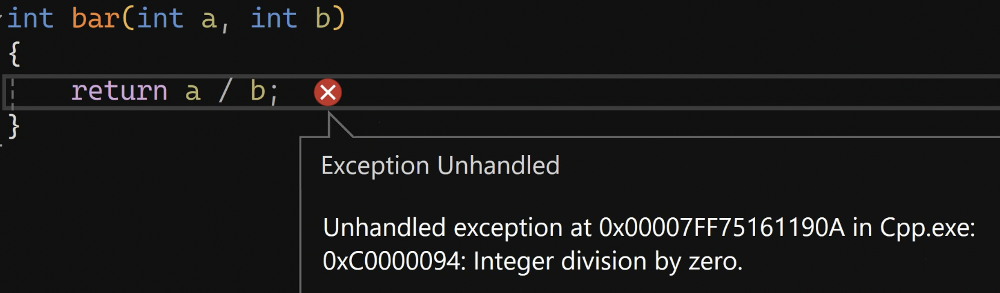
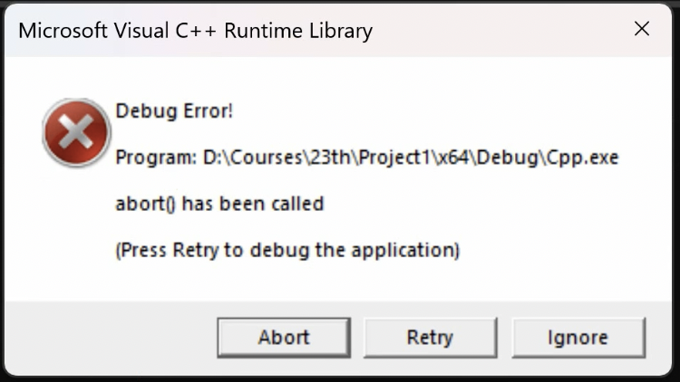
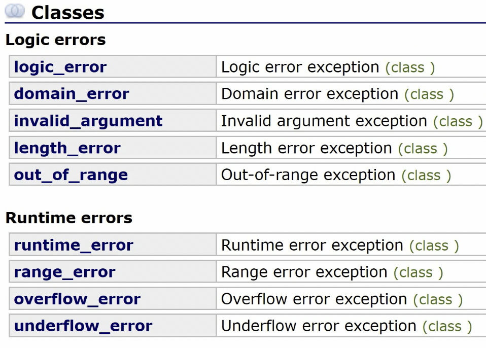
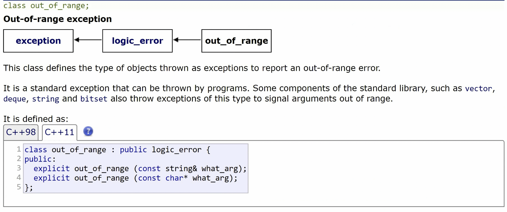

# `C++`异常处理机制

```cpp
int bar(int a, int b)
{
    return a / b;
}
int main()
{
    int result = 0;
    result = bar(10, 0);
    return 0;
}
```
以上会产生除0异常：


如果是Release的程序，不处理异常，就会造成闪退。
## throw
throw可以是任何东西，一个对象，一个指针，一个值。
只要throw了，那么程序就会中断、跳转，如果有try-catch就走catch，如果没有则进行下一条语句。
```cpp
int bar(int a, int b)
{
    if(b == 0)
    {
        throw e;
    }
}
```
## try-catch
类似于switch-case，但是case值不限制类型。可以通过`catch(...)`代表default。
```cpp
int main()
{
    int result = 0;
    try
    {
        result = bar(10, 0);
    }
    catch (const double& e)
    {
        std::cout << e << std::endl;
    }
    catch (const int& e)
    {
        std::cout << e << std::endl;
    }
    catch (...)
    {
        std::cout << "Unhandled Exception!" << std::endl;
    }
    std::cout << result << std::endl;
    return 0;
}
```
# noexcept关键字

声明该函数不抛出异常。
```cpp
int bar(int a, int b) noexcept;
```
但是一旦实际运行时抛出了异常，程序就会直接挂掉。

# 异常库`<stdexcept>`

该库下，有两类errors：
1. Logic Errors
2. Runtime Errors

## `std::exception`
基本上所有的exception类都继承于`std::exception`。如`out_of_range`：

`std::exception`可以拿字符串构造，然后用`what()`方法打印这个异常信息。
```cpp
#include <exception>
std::exception bar_exception{ "bar exception!" };

int bar(int a, int b)
{
    if(b == 0)
        throw bar_exception;
    return a / b;
}
```

```cpp
#include <exception>
int main()
{
    int result = 0;
    try
    {
        result = bar(10, 0);
    }
    catch (std::exception const& e)
    {
        std::cout << e.what() << std::endl;
    }
    catch (...)
    {
        std::cout << "Unhandled Exception!" << std::endl;
    }
    std::cout << result << std::endl;
    return 0;
}
```
## 自定义exception
```cpp
class BarException : public std::exception
{
public:
    char const* what() const override
    {
        return "bar exception!";
    }
};
```

```cpp
#include <exception>
int bar(int a, int b)
{
    if(b == 0)
        throw BarException{};
    return a / b;
}
int main()
{
    int result = 0;
    try
    {
        result = bar(10, 0);
    }
    catch (std::exception const& e) // 可以接受bar_exception
    {
        std::cout << e.what() << std::endl;
    }
    catch (...)
    {
        std::cout << "Unhandled Exception!" << std::endl;
    }
    std::cout << result << std::endl;
    return 0;
}
```
# 实例
异常用在什么地方呢？不能通过函数的返回值来判断正确与否的时候。如下：
## string的at（抛异常，检查边界）

有两种：
1. at位置的字符不能修改
2. at位置的字符可以修改

1. 可能会out of range。
2. 返回的都是引用类型，引用不能为空，所以不能通过返回值是否为空来判断是否错误了，所以得用异常机制。
```cpp
#include<exception>
class OutOfRange : public std::exception
{
public:
    OutOfRange() : std::exception{"MyString: out of range!"}
    {
    }
}
class MyString
{
public:
    char & at(const size_t off)
    {
        size_t len = strlen(_str);
        if(off > strlen - 1)
            throw OutOfRange{};
        return _str[off];
    }
    char const & at(const size_t off) const
    {
        size_t len = strlen(_str);
        if(off > strlen - 1)
            throw OutOfRange{};
        return _str[off];
    }
}
int main()
{
    if(str)
    {
        try
        {
            std::cout << str.at(11) << std::endl;
        }
        catch (const std::exception &e)
        {
            std::cout << e.what() << std::endl;
        }
    }
}
```
## string的`[]`（不抛异常，不检查边界）

与at函数的不同在于，`[]`是不抛出异常的，因此不检查边界。如果越界，则行为未定义。
```cpp
class MyString
{
public:
    char& operator[](const size_t off) noexcept
    {
        return _str[off];
    }
    char const & operator[](const size_t off) const noexcept
    {
        return _str[off];
    }
}
```
# 总结

1. 异常用在什么地方呢？不能通过函数的返回值来判断正确与否的时候。比如返回值是引用，引用没有空值。
2. 如果函数在内部自己处理了异常，即不会抛出异常，那么最好声明为noexcept。代表别人调用此函数时，别人就不用try-catch了。