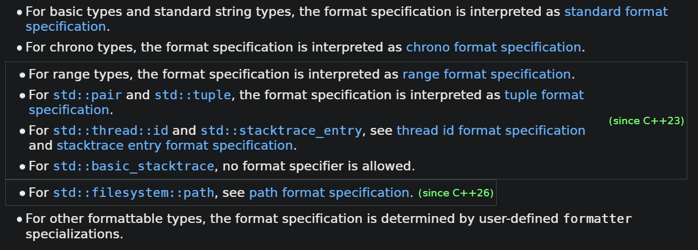
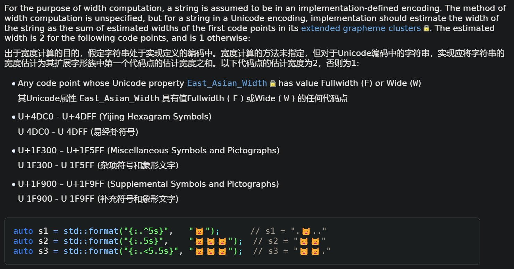

```cpp
{
    case WM_LBUTTONDOWN:
    {
        int x_coord = lparam & 0xffff;
        int y_coord = lparam >> 16;
        // 拼接x、y，最后效果："x, y"
    }
}
```
# C风格：swprintf
使用C语言的`wchar_t`宽字符数组，加上swprintf
```cpp
{
    {
        // ...
        wchar_t text[50] = L"";
        swprintf(text, 50, L"%i, %i", x_coord, y_coord);
    }
}
```
# string风格
使用`C++`的string库
```cpp
{
    {
        // ...
        std::wstring text;
        text += std::to_wstring(x_coord);
        text += L", ";
        text += std::to_wstring(y_coord);
    }
}
```
# 流式风格
使用`C++`的流式IO
```cpp
{
    {
        // ...
        std::wstringstream wss;
        wss << x_coord << L", " << y_coord;
    }
}
```
# format库
使用`C++`的format库，format是`C++20`标准库引入的。类似于C语言的标准格式化输出。[std::format - cppreference.com](https://en.cppreference.com/w/cpp/utility/format/format)。相应地，给出了标准格式化规格：[Standard format specification - cppreference.com](https://en.cppreference.com/w/cpp/utility/format/spec)
```cpp
{
    {
        // ...
        std::wstring text = std::format(L"{0}, {1}", x_coord, y_coord);
    }
}
```
相当于用大括号替代了C语言格式化输出中的`%?`。
```cpp
#include <format>
#include <iostream>
int main()
{
    std::cout << std::format("{} {}!", "Hello", "world", "something");
}
```
如果需要控制格式化输出（即后面有一些可变参数），大括号是必须要写。它是占位的，而大括号里面的内容有可选的内容，具体参考[std::format](https://en.cppreference.com/w/cpp/utility/format/format)中fmt参数的replacement fields：
1. `{ arg-id (optional) }`
    1. replacement field without a format specification
2. `{ arg-id (optional) : format-specification }`
    1. replacement field with a format specification

`arg-id`: specifies the index of the argument in `args` whose value is to be used for formatting; if it is omitted, the arguments are used in order. The arg-id s in a format string must all be present or all be omitted. Mixing manual and automatic indexing is an error.

`format-spec`: the format specification defined by the `std::formatter` specialization for the corresponding argument. Cannot start with `}`.

有很多format specification：

这里重点看一下[standard format specification](https://en.cppreference.com/w/cpp/utility/format/spec "cpp/utility/format/spec")：
值得注意的是，cppreference承认了Standard format specification基于Python中的格式规范，供基本类型和字符串类型使用。
## 格式规范
格式规范的语法是：（不同控制项以空格为间隔；每一项都是optional）
```
fill-and-align  sign # 0 width precision L type
```
其中`sign`、 `#`和 `0` 选项仅在使用整数或浮点表示类型时有效。
### fill-and-align
填充和对齐

可以填可选的`fill（填充）字符`（`'{'` 或 `'}'` 以外的任何字符），后跟一个`align（对齐）`选项 `<` ， `>` ， `^` 。
* 填充字符需要注意：
    1. 如果未指定填充字符，则默认为空格字符。
    2. 填充字符必须对应于单个Unicode标量值。
* 对齐选项需要注意：
    1. `<` : 通过在格式化参数后插入n个填充字符，强制格式化参数与可用空间的开头对齐。如果使用非整数非浮点表示类型时，此为默认选项（`<`）。
        1. 一句话说：填充字符填充到右边
    2. `>` : 通过在格式化参数之前插入n个填充字符，强制格式化参数与可用空间的末尾对齐。使用整数或浮点表示类型时，此为默认选项。
        1. 一句话说：填充字符填充到左边
    3. `^`：通过在格式化参数前面插入`⌊ n/2 ⌋`（向下取整）个字符，在格式化参数后面插入` ⌈ n / 2 ⌉`（向上取整）个字符来强制格式化参数在可用空间内居中。
        1. 一句话说：填充字符填充到两边，填充奇数份时，左比右少1个。

示例：
```cpp
char c = 120;
std::format("{:6}", 42);    // value of s0 is "    42"
std::format("{:>6}", 42);   // value of s0 is "    42"
std::format("{:6}", 'x');   // value of s1 is "x     "
std::format("{:<6}", 'x');  // value of s1 is "x     "
std::format("{:*<6}", 'x'); // value of s2 is "x*****"
std::format("{:*>6}", 'x'); // value of s3 is "*****x"
std::format("{:*^6}", 'x'); // value of s4 is "**x***"
std::format("{:6d}", c);    // value of s5 is "   120"
std::format("{:6}", true);  // value of s6 is "true  "
```
### `sign`, `#`, `0`

`sign`选项可以是以下选项之一：
- `+` : 表示对于非负数和负数都显示符号。对于非负数，在输出值之前插入 `+` 符号。
- `-` : 仅负数显示符号 (这是默认的sign值)。
- `空格`: 非负数前面显示前导空格位，负数显示负号。

要注意：
1. 负零被视为负数。
2. sign选项也适用于浮点无穷大和NaN。

`#`和`0`暂略。
### width and precision
宽度和精度

width是正十进制数或嵌套替换字段 ( `{}` 或 `{ n }` )。如果存在，则它指定最小字段宽度。

precision是一个点 ( `.` )后跟一个非负的十进制数或嵌套的替换字段。此字段指示精度或最大字段大小。它只能用于浮点和字符串类型。
* 对于浮点类型，此字段指定格式精度。
* 对于字符串类型，它为要复制到输出的字符串的前缀的估计宽度 (见下文) 提供了上限。对于Unicode编码的字符串，要复制到输出的文本是整个扩展字形簇（extended grapheme clusters）的最长前缀，其估计宽度不大于精度。

注意：
1. 如果嵌套替换字段用于宽度或精度，而相应的参数不是整数类型（直到`C++23`）、标准有符号或无符号整数类型（从`C++23`开始），或者它是负数，则会抛出`std::format_error`类型的异常。
2. 字符串的宽度被定义为适于在终端中显示它的列位置的估计数量。


示例：
```cpp
float pi = 3.14f;
s1 = std::format("{:10f}", pi);           // s1 = "  3.140000" (width = 10)
s2 = std::format("{:{}f}", pi, 10);       // s2 = "  3.140000" (width = 10)
s3 = std::format("{:.5f}", pi);           // s3 = "3.14000" (precision = 5)
s4 = std::format("{:.{}f}", pi, 5);       // s4 = "3.14000" (precision = 5)
s5 = std::format("{:10.5f}", pi);         // s5 = "   3.14000"
                                               // (width = 10, precision = 5)
s6 = std::format("{:{}.{}f}", pi, 10, 5); // s6 = "   3.14000"
                                               // (width = 10, precision = 5)
 
b1 = std::format("{:{}f}", pi, 10.0);     // throws: width is not of integral type 
b2 = std::format("{:{}f}", pi, -10);      // throws: width is negative
b3 = std::format("{:.{}f}", pi, 5.0);     // throws: precision is not of integral type
```
# print println
这是`C++23`引入的。
不带流参数的，在`<print>`库中定义。
带流参数的，在`<ostream>`库中定义。

```cpp
print("Hello, {}!\n", "world");
// 等价于
println("Hello, {}!", "world");
print(stdout, "Hello, {}!\n", "world");
println(stdout, "Hello, {}!", "world");
```
但是，截止2025年8月27日，print还不支持输出宽字符。