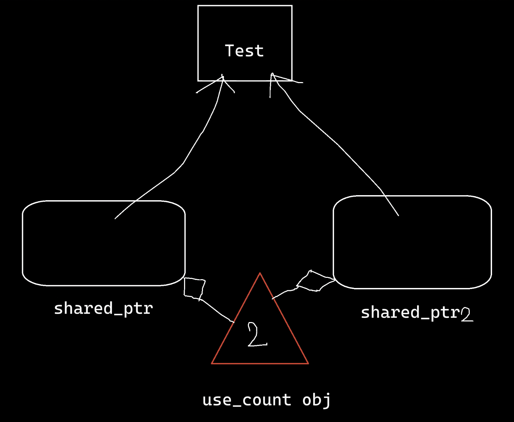

`C++`中的智能指针定义于`<memory>`中。
# 内容
1. RAII
2. auto_ptr
3. unique_ptr
4. shared_ptr
5. weak_ptr
# RAII

堆上空间进行自动化管理，利用对象自动析构的机制。

# auto_ptr
这是旧版本的智能指针，在`C++11`之后被废弃。

1. 不能使用同一个裸指针赋值/初始化多个`auto_ptr`。
2. 拷贝构造和等号运算符，会将源智能指针置空。
3. release(): 返回当前指向的地址（存到tmp中），并将当前智能指针置空
4. reset(): 将当前智能指针指向的内存释放，指针置空。

## 问题

### 拷贝构造函数意义不明确
1. 如果拷贝构造按浅拷贝形式进行，则会导致重复析构，崩溃。
2. 如果拷贝构造按**转移资源**进行，则会导致意想不到的严重后果：如以下代码，在调用fun函数按值传入`my_auto_ptr`对象时，调用拷贝构造，拷贝构造释放自己的拥有权，给了apx。在fun函数外再找原指针时，原对象的指针信息已丢失。

```c++
class my_auto_ptr
{
public:
    my_auto_ptr(const my_auto_ptr& op)
        : _Owns(op._Owns), _Ptr(op.release())
    {
    }
    
    _Ty* release() const
    {
        _Ty* tmp = NULL;
        if (_Owns)
        {
            _Owns = false;
            tmp = _Ptr;
            _Ptr = NULL;
        }
        return tmp;
    }
};
    void fun(my_auto_ptr<Object> apx)
    {
        int x = apx->Value();
        cout << x << endl;
    }
int main()
{
    my_auto_ptr<Object> pobja(new Object(10));
    fun(pobja);
    int a = pobja->Value();//error!
    cout << a << endl;
}
```
### 赋值重载意义不明确
```c++
class my_auto_ptr
{
public:
    my_auto_ptr & operator=(const my_auto_ptr& _Y)
    {
        if(this == & _Y)return *this;
        if(_Owns){delete _Ptr;}
        _Owns = _Y._Owns;
        _Ptr = _Y.release();
    }
    _Ty* release() const
    {
		_Ty* tmp = NULL;
		if (_Owns)
		{
			_Owns = false;
			tmp = _Ptr;
			_Ptr = NULL;
		}
		return tmp;
    }
};
void fun(my_auto_ptr<Object> apx)
{
    int x = apx->Value();
    cout << x << endl;
}
int main()
{
    my_auto_ptr<Object> pobja(new Object(10));
    fun(pobja);
    int a = pobja->Value();//error!
    cout << a << endl;
}
```
# unique_ptr
以下是传统的不使用智能指针的写法。
```cpp
#include <iostream>
#include <memory>
class Test
{
public:
    Test(void)
    {
        std::cout << "Test()" << std::endl;
    }
    ~Test()
    {
        std::cout << "~Test()" << std::endl;
    }
    void show(void) const
    {
        std::cout << "show()" << std::endl;
    }
};
void foo()
{
    Test * test = new Test;
    test->show();
    delete test;
    test = nullptr;
}
int main()
{
    foo();
    return 0;
}
```
如今不推荐这么写了，
如何实现让test对象一出foo函数就自动析构呃呢？使用智能指针解决。
```cpp
void foo()
{
    std::unique_ptr<Test> test{ new Test };
    test->show();
    // 不用释放了，不用置空了。
}
```
用智能指针管理时，就不用手动释放new出来的Test对象了，因为智能指针是在栈上建立的，函数调用结束后栈帧析构时，智能指针就会自动析构，从而把绑定的对象也析构。
## 特性：unique

1. 把拷贝构造函数禁用了。
2. 如果想要迁移原智能指针，可以用move
```cpp
void foo()
{
    std::unique_ptr<Test> test{ new Test };
    std::unique_ptr<Test> test2 = std::move(test);
    if (test)
        test->show();
    if (test2)
        test2->show();
}
```
# 方法
智能指针对象的`->`对应的是其持有对象的方法。
`.`出来的方法才是其本身拥有的方法。
## release（不析构旧对象）
```cpp
pointer release() noexcept;
```
释放管理权，返回其持有对象的指针。
智能指针不再管理该对象，程序员需要自己处理析构。
```c++
class Test
{
public:
    Test(void)
    {
        std::cout << "Test()" << std::endl;
    }
    ~Test()
    {
        std::cout << "~Test()" << std::endl;
    }
    void show(void) const
    {
        std::cout << "show()" << std::endl;
    }
private:
    int         _v{ 5 };
};
void foo()
{
    std::unique_ptr<Test> test{ new Test };
    Test* raw_ptr = test.release();
    if (test)
        test->show();
    delete raw_ptr;
    raw_ptr = nullptr;
}
int main()
{
    foo();
    return 0;
}
```
## reset（会析构旧对象）

接收一个同类对象的指针，或nullptr。

原本的智能指针不再指向旧的对象地址，转而指向新的对象地址。

1. 如果旧对象没有其他智能指针引用，则析构旧对象
2. 指向新对象或nullptr
```cpp
void foo()
{
    std::unique_ptr<Test> test{ new Test };
    test.reset(new Test);
    if (test)
        test->show();
}
```
# 自实现
```cpp
template <typename T>
class SmartPtr
{
public:
    SmartPtr(nullptr_t) : _t{ nullptr } {}
    SmartPtr(void) : _t{ nullptr } {}
    SmartPtr(T* t) : _t{ t } {}
    ~SmartPtr()
    {
        if (_t)
        {
            delete _t;
            _t = nullptr
        }
    }
    
private:
    T*           _t;
};
int main()
{
    SmartPtr test{ new Test };
}
```
## 处理对象数组
用模板特化。
```cpp
template <typename T>
class SmartPtr<T[]>
{
public:
    SmartPtr(T* t) : _t{ t } {}
    ~SmartPtr()
    {
        if (_t)
        {
            delete [] _t;
            _t = nullptr;
        }
    }
    // ...
private:
    // ...
};
void foo()
{
    SmartPtr<Test[]> test{ new Test[5] };
}
```
## `->`重载
1. `->`的重载比较有意思，我们想要实现的效果是`smartPtr->objFunc()`，而`->`先返回的是`obj*`，本来应该还需要一个`->`才正确，但系统默认一个`->`就懂你的意思。
```c++
template <typename T>
class SmartPtr
{
public:
    // ...
    T* operator-> (void)
    {
        return _t;
    }
private:
    // ...
};
```
## `bool运算符`重载
```cpp
template <typename T>
class SmartPtr
{
public:
    // ...
    operator bool(void)
    {
        return _t;
    }
private:
    // ...
};
void foo()
{
    SmartPtr<Test> test{ new Test };
    if (test)
        test->show();
}
```
## unique的转移
1. 禁用拷贝构造
2. 提供右值引用拷贝构造
3. 实现一个release方法，在右值引用拷贝构造中复用
```cpp
template <typename T>
class SmartPtr
{
public:
    // ...
    SmartPtr(SmartPtr const&) = delete;
    SmartPtr(SmartPtr && other) noexcept
    {
        _t = other.release();
    }
    T* release()
    {
        auto t = _t;
        _t = nullptr;
        return t;
    }
private:
    // ...
};
void foo()
{
    SmartPtr<Test> test{ new Test };
    SmartPtr<Test> test2 = std::move(test);
    
    if (test)
        test->show();
    if (test2)
        test2->show();
}
```

# shared_ptr
多个智能指针共享一个对象。

支持拷贝构造。

某个`shared_ptr`析构时，所持有的对象不会析构，直到此对象没有其他`shared_ptr`引用。这是用内部依赖的引用计数机制实现的。


## 两种构建方式

```c++
int main()
{
    std::shared_ptr<Object> op1(new Object(10));
    std::shared_ptr<Object> op2(std::make_shared<Object>(10));
}
```

## 方法
没有release，只有reset。
可以通过`reset(nullptr)`或`reset()`达到release的效果。
### use_count
```cpp
void foo()
{
    std::shared_ptr<Test> test(new Test);
    std::cout << test.use_count() << std::endl;
}
```
### owner_before
```cpp
void foo()
{
    std::shared_ptr<Test> test(new Test);
    std::shared_ptr<Test> test2 = test;
    test.reset();
    bool is_true = test.owner_before(test2); // true
    is_true = test2.owner_before(test);      // false
}
```
对被reset的对象test来说，判断是不是之前test2所持对象的拥有者。
要想返回true需要满足：
1. test已经被reset
2. 指定的智能指针确实是test之前指向的对象
```cpp
void foo()
{
    std::shared_ptr<Test> test(new Test);
    std::shared_ptr<Test> test2 = test;
    // test.reset();
    bool is_true = test.owner_before(test2); // false
}
```
## 应用场景
返回一个指针时。即，用于函数间传递指针。
省去了程序员去判断何时需要析构的难题。
```cpp
std::shared_ptr<Test> foo()
{
    std::shared_ptr<Test> test(new Test);
    test->show();
    return test;
}
int main()
{
    std::shared_ptr<Test> test = foo();
    if (test)
        test->show();
    return 0;
}
```
# weak_ptr
```cpp
class B; // incomplete class
class A
{
public:
    A(void)
    {
        std::cout << "A()" << std::endl;
    }
    ~A()
    {
        std::cout << "~A()" << std::endl;
    }
    void set_b(std::shared_ptr<B> b)
    {
        _b = b;
    }
private:
    std::shared_ptr<B> _b;
};
class B
{
public:
    B(void)
    {
        std::cout << "B()" << std::endl;
    }
    ~B()
    {
        std::cout << "~B()" << std::endl;
    }
    void set_a(std::shared_ptr<A> a)
    {
        _a = a;
    }
private:
    std::shared_ptr<A> _a;
};
void bar()
{
    std::shared_ptr<A> a(new A);
    std::shared_ptr<B> b(new B);
    a->set_b(b);
    b->set_a(a);
}
int main()
{
    bar();
    return 0;
}
```
上面程序将输出：
```
A()
B()
```
意味着A、B对象在最后没有被析构，造成内存泄漏。

本身a、b是一个引用计数。
又因为两个类内部都存在另一个类对象的`shared_ptr`指针，那么a、b的引用计数又会各自加1变成2。
bar函数调用结束后智能指针a、b析构，但引用计数只减1，无法归零，都在等对方先析构，形成了僵局。
因此当多方内部可能存在交叉、互相引用对方的`shared_ptr`时，需要改其为一种不会增加引用计数的特殊指针。则`weak_ptr`应运而生。
```cpp
void bar()
{
    // std::weak_ptr<A> a(new A); // error, weak_ptr不能直接管理对象。
    std::shared_ptr<A> a(new A);
    std::weak_ptr<A> w_a = a;
    std::cout << a.use_count << std::endl; // 1
    std::cout << w_a.count << std::endl; // 1
}
```
`weak_ptr`不能直接管理对象。而是可以通过一个已经存在的`shared_ptr`赋值。

此时`weak_ptr`作为一个观察者。不能直接引用对象。
想调用的时候，通过以下方法：
## 方法
1. expired用于判断此`weak_ptr`是否过期了。
2. lock用于把`weak_ptr`升级为一个`shared_ptr`。lock锁定是为了防止在提升等级的期间指针过期，但是取出来之后仍有可能过期，因此需要先if判断取出的指针是否为空。
3. 也可以直接lock，但是expired比lock代价小，通过先判断是否过期从而可能省略代价大的lock。

```cpp
void bar()
{
    std::shared_ptr<A> a(new A);
    std::weak_ptr<A> w_a = a;
    if(!w_a.expired())
    {
        if(std::shared_ptr<A> a2 = w_a.lock())
        {
            a2->show();
        }
    }
}
```
## A、B正确的定义
只需要一方的内部的`shared_ptr`降级定义为`weak_ptr`即可解决僵局。
以下，将B内部的引用A的智能指针成员变量改为弱指针。
```cpp
class B; // incomplete class
class A
{
public:
    A(void)
    {
        std::cout << "A()" << std::endl;
    }
    ~A()
    {
        std::cout << "~A()" << std::endl;
    }
    void show() const
    {
        std::cout << "A::show()" << std::endl;
    }
    void set_b(std::shared_ptr<B> b)
    {
        _b = b;
    }
    // 由于B只在上面声明，因此不能在此定义有关B的函数，而是单独定义。
    void show_b() const;
private:
    std::shared_ptr<B> _b;
};
class B
{
public:
    B(void)
    {
        std::cout << "B()" << std::endl;
    }
    ~B()
    {
        std::cout << "~B()" << std::endl;
    }
    void show() const
    {
        std::cout << "B::show()" << std::endl;
    }
    void set_a(std::shared_ptr<A> a)
    {
        _a = a;
    }
    void show_a() const
    {
        if(!_a.expired())
        {
            if(auto a = _a.lock())
            {
                a->show();
            }
        }
    }
private:
    std::weak_ptr<A> _a;
};

void A::show_b() const
{
    if (_b)
    {
        _b->show();
    }
}

void bar()
{
    std::shared_ptr<A> a(new A);
    std::shared_ptr<B> b(new B);
    a->set_b(b);
    b->set_a(a);

    a->show_b();
    b->show_a();
}
int main()
{
    bar();
    return 0;
}
```
正确的输出：
```
A()
B()
B::show()
A::show()
~A()
~B()
```