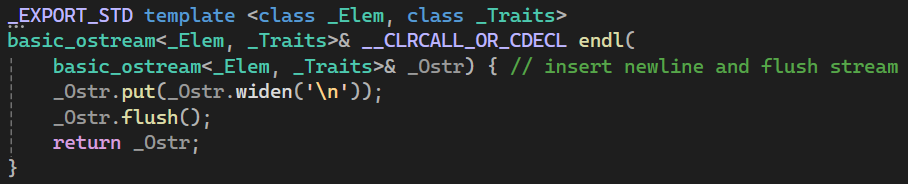
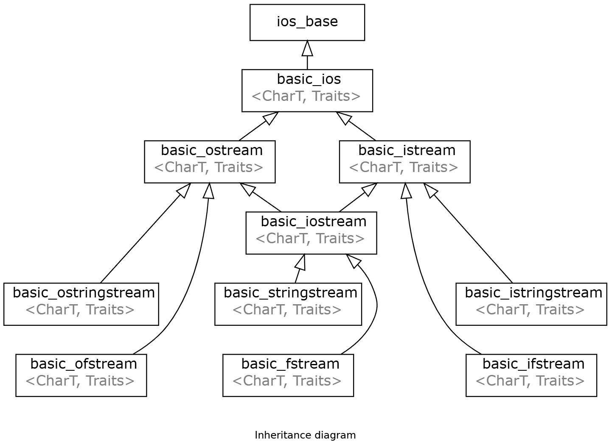
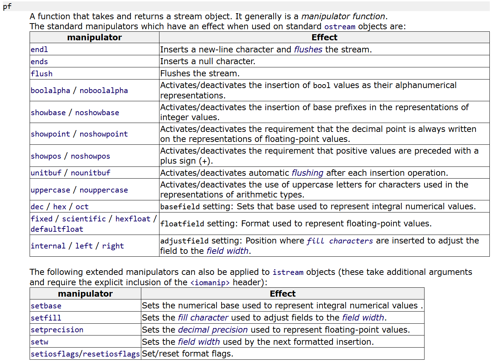
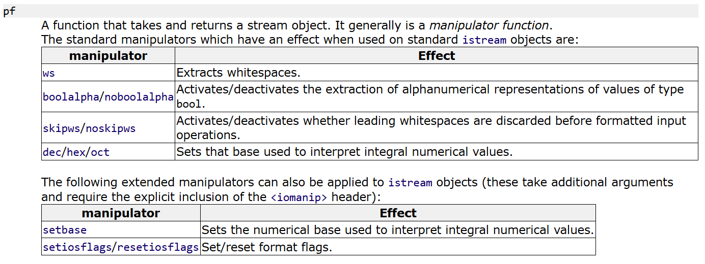

# 内容

Cpp的基于流的IO系统
1. ostream中`<<`运算符方法中的参数：pf控制符
# `<<`
`<<`叫做**流插入**运算符（insertion operator）。把后面跟随的内容插入到流中。
```cpp
int main()
{
    std::cout << "Hello" << "\n";
    return 0;
}
```
## `<<`后面支持跟着哪些东西
1. 数字类型（arithmetic types）
2. 流缓冲（stream buffers）
3. 控制符（manipulators）
# `>>`
`>>`称作流析出运算符（extraction operator）。
# 控制符号
## `std::endl`
end of line

`std::endl`是定义在`ostream`中的**函数**。

实际上就是输出了一个`\n`，并且刷新缓冲区。
# cout哪来的？ostream
在`<iostream>`中，cout是这么定义的：
```cpp
extern ostream cout;
```

`iostream`是继承于ostream、iostream的。

在`<ostream>`中，ostream是`basic_ostream<char>`的别名。
```cpp
typedef basic_ostream<char> ostream;
```
cout、cerr、clog是定义于`basic_ostream<char>`，即ostream的对象。
关于详细的：[ostream](https://legacy.cplusplus.com/reference/ostream/ostream/)
# ostream的方法
## width方法控制数字宽度

cout本身有一些方法，比如width就是。通过`std::cout.width(n)`进行调用。
这个变量是继承于`std::ios_base`得来的。[std::ios_base::width - cppreference.com](https://en.cppreference.com/w/cpp/io/ios_base/width)

```cpp
int main()
{
    int val = 90;
    std::cout.width(10);
    std::cout << val << std::endl;
    return 0;
}
```
输出：
```
12345678
        90
```
可以看到，width为10时，如果不足10个字符，则前面空出补位。
## precision方法控制浮点数的精度
[precision](https://legacy.cplusplus.com/ios_base::precision)
和width一样，是cout的方法。
```cpp
#include<iostream>
int main()
{
    double f = 3.14159;
    std::cout.precision(5);
    std::cout << f << std::endl;
}
```
output:
```
3.1416
```
# 基于流插入的形式进行的字符控制
## ostream中的pf
https://legacy.cplusplus.com/reference/ostream/ostream/operator%3C%3C/
pf是`<<`方法中值得注意的参数。pf是一个函数指针。可以填入不同的操作符（manipulator）。

## 操作符（manipulator）
### endl
其实我们最常见的`std::endl`就是一个。
```cpp
// Defined in header <ostream>
ostream& endl (ostream& os);
```
可以看到，endl实际上是一个函数。作用是往cout写入一个`\n`，然后flush一下cout，最后再返回cout。
### boolalpha控制bool输出形式

除了endl这个manipulator，还有其他更专用的。如`boolalpha / noboolalpha`。（定义于标准库标头`<ios>`）
默认下的bool类型：false输出0，true输出1。插入boolalpha后，就会false输出false、true输出true。而且一旦插入了boolalpha，就会持续保持状态，因为cout是一个全局对象。如果要恢复原态需要再次插入noboolalpha。
```cpp
int main()
{
    bool d{ false };
    // 默认下的bool类型：false输出0，true输出1
    std::cout << d << std::endl;
    // 插入boolalpha后，就会false输出false、true输出true。
    std::cout << std::boolalpha << d << std::endl;
    // 插入noboolalpha后，就会false输出0、true输出1。
    std::cout << std::noboolalpha << d << std::endl;
}
```
### setw
在`<iomanip>`定义的`std::setw`也可以控制width：
[std::setw - cppreference.com](https://en.cppreference.com/w/cpp/io/manip/setw)

>setw是一个扩展的manipulator。需要另外引入`<iomanip>`

它也可以控制宽度，但较于width，它是基于流插入的形式进行的。通过`std::setw(n)`进行。
```cpp
#include<iostream>
#include<iomanip>
int main()
{
    std::cout << std::setw(6) << std::right << -77 << '\n';
}
```
output:
```cpp
   -77
```
### left、right、internal
可以配合internal、left、right进行对齐。（from `<ios>`）
[std::left, std::right, std::internal - cppreference.com](https://en.cppreference.com/w/cpp/io/manip/left)
1. internal是符号左、数字右；
2. left是符号和数字整体左；
3. right是符号和数字整体右。
### 示例
经过测试，必须每次都事先设置width，才能有效果。
```cpp
int main()
{
    int n = -77;
    std::cout.width(6);
    std::cout << std::internal << n << '\n';
    std::cout.width(6);
    std::cout << std::left << n << '\n';
    std::cout.width(6);
    std::cout << std::right << n << '\n';
}
```
output:
```cpp
-   77
-77   
   -77
```
### setprecision
[std::setprecision - cppreference.com](https://en.cppreference.com/w/cpp/io/manip/setprecision)
setprecision也是一个扩展的manipulator。（from `<iomanip>`）
和precision方法一样，可以用于控制数字的精度，但setprecision是基于插入形式的。
```cpp
#include<iostream>
#include<iomanip>
int main()
{
    double f = 3.14159;
    std::cout << std::setprecision(5) << f << '\n';
    std::cout << std::setprecision(9) << f << '\n';
    std::cout << std::fixed;
    std::cout << std::setprecision(5) << f << '\n';
    std::cout << std::setprecision(9) << f << '\n';
}
```
output:
```cpp
3.1416
3.14159
// fixed
3.14159
3.141590000
```
### 控制数字类型的输出

还有showbase、showpoint、showpos、uppercase、`dec / hex / oct`等等（from `<ios>`）

`dec / hex / oct`的作用在于控制输出数字类型的进制。比如
```cpp
int main()
{
    std::cout << std::hex << 10 << '\n';   // a
}
```

showbase的作用在于输出时不同进制数加前缀，比如开启了showbase后，输出16进制数：
```cpp
int main()
{
    int n = 20;
    std::cout << std::hex << std::showbase << n << '\n';   //0x14
    std::cout << std::hex << std::noshowbase << n << '\n'; //14
}
```

uppercase的作用是输出**数字类型**时，区分大小写格式。比如开启uppercase后16进制数`0x4d`就会变为`0X4D`。
```cpp
int main()
{
    std::cout << std::showbase << std::hex;
    std::cout << std::uppercase << 77 << '\n';   //0X4D
    std::cout << std::nouppercase << 77 << '\n'; //0x4d
}
```
### fixed
当 floatfield 设置为 fixed 时，浮点值将使用**定点表示法**写入：该值的小数部分位数与精度字段( [precision](https://legacy.cplusplus.com/ios_base::precision) ) 指定的位数完全相同，并且没有指数部分。
### 默认浮点表示法、定点表示法、科学计数法
默认浮点表示法和定点表示法以及科学计数法之间有所不同（请参阅 [precision](https://legacy.cplusplus.com/ios_base::precision) ）。在默认浮点表示法中，精度字段指定小数点前后显示的是最大有意义位数，而在定点表示法和科学计数法中，精度字段精确指定小数点后显示多少位数字，即使这些数字是小数点后的零。
```cpp
// modify floatfield
#include <iostream>     // std::cout, std::fixed, std::scientific

int main () {
  double a = 3.1415926534;
  double b = 2006.0;
  double c = 1.0e-10;

  std::cout.precision(5);

  std::cout << "default:\n";
  std::cout << a << '\n' << b << '\n' << c << '\n';

  std::cout << '\n';

  std::cout << "fixed:\n" << std::fixed;
  std::cout << a << '\n' << b << '\n' << c << '\n';

  std::cout << '\n';

  std::cout << "scientific:\n" << std::scientific;
  std::cout << a << '\n' << b << '\n' << c << '\n';
  return 0;
}
```
output:
```
default:
3.1416
2006
1e-010

fixed:
3.14159
2006.00000
0.00000

scientific:
3.14159e+000
2.00600e+003
1.00000e-010
```
# 基于流析出的形式
`>>`称作流析出运算符（extraction operator）。
## istream中的pf

可以看到，相比于ostream的pf，istream中的可选项少了一些。
1. boolalpha，可以通过输入false、true字符串从而给bool变量写值的操作。
2. `dec/hex/oct`，可以通过输入十进制、十六进制、八进制数字进而给整型变量写值。