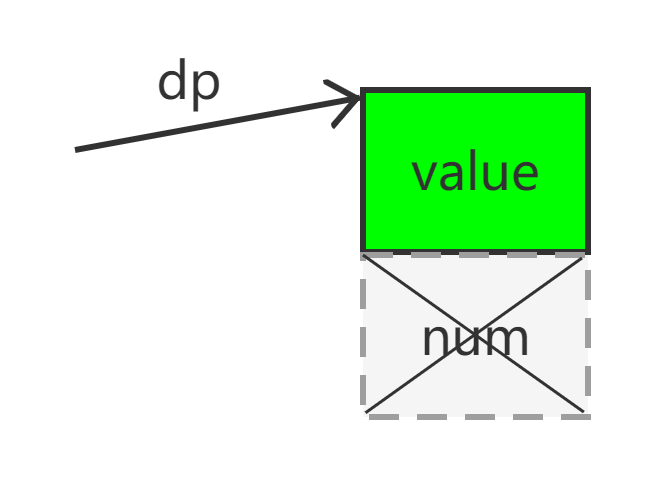

# 内容
1. 总述
2. 通过单参数的构造函数实现类型转换
3. 通过类型转换运算符实现类型转换
4. explicit
5. 隐式转换
6. 四个关键字
    1. `static_cast`
    2. `const_cast`
    3. `reinterpret_cast`
    4. `dynamic_cast`
# 类型转换运算符
使用接收单参数的构造函数执行类型转换虽然便捷，但有时候并非如愿。
并且构造函数无法指定：
1. 从用户自定义类型向内置类型的隐式转换（因为内置类型不是类）
2. 从新类到先前定义的类的转换，（而不修改旧类的声明？）。

我们可以通过为源类型定义一个类型转换运算符(conversion operator)来解决上述问题。成员函数`X::operator T()`定义了从X到T的类型转换，其中T是一个类型名。例如，我们定义一种只占6个二进制位的整数Tiny。我们希望在算术运算中它可以和普通的整数完美地融合在一起，并且当Tiny的值超出其范围时抛出`Bad_range`异常：

```c++
class Tiny
{
    char v;
    void assign(int i)
    {
        // 检查是否越界
        if(i & ~077) throw Bad_range();
        v = i;
    }
    class Bad_range{};
    Tiny(int i)				//用int构造Tiny
    {
        assign(i);
    }
    Tiny & operator=(int i)	//int赋值给Tiny
    {
        assign(i);
        return *this;
    }
    //默认的拷贝构造 和 同类赋值重载
    Tiny(const Tiny&) = default;
    Tiny & operator=(const Tiny&) = default;
    operator int() const
    {
        return v;	//conversion to int
    }
}
```

用int初始化Tiny或者给它赋值时进行越界检查（溢出，包括上溢、下溢）。相反，当拷贝Tiny的时候无须检查是否越界，因此默认的拷贝构造函数和赋值运算是正确的，无须修改。

为了让Tiny可以使用int的常规操作，我们定义了从Tiny向int的隐式类型转换`Tiny::operator int()`。请注意，目标类型已经作为运算符名字的一部分出现，因此不必再重复出现在转换函数返回值的位置了。

```c++
Tiny::operator int() const {return v;}		//正确
int Tiny::operator int() const {return v;}	//错误，没必要加返回类型
```

从这层意义上来说，类型转换运算符类似于构造函数。

如果在需要int的地方出现了Tiny，它会自动转换为对应的int值。例如：

```c++
int main()
{
    Tiny c1 = 2;		//调用 Tiny(int)
    Tiny c2 = 62;
    Tiny c3 = c2 - c1;
    Tiny c4 = c3;
    int i = c1 + c2;	//调用 operator int()
    c1 = c1 + c2;		
    i = c3 - 64;		//调用 operator int()
    c2 = c3 - 64;
    c3 = c4;
}
```

通常情况下，最好尽量避免使用类型转换运算符，一旦过度使用的话可能引起程序的二义性。如果既有用户自定义的类型转换函数，又有用户自定义的运算符，则这两者间可能产生二义性。例如：

```c++
int operator+(Tiny, Tiny);
void f(Tiny t, int i)
{
    t + i;	//错误，二义性问题："operator+(t, Tiny(i))" 还是 "int(t)+i" ?
}
```

因此，对于某种给定的数据类型，最好不要同时提供用户自定义的类型转换和用户自定义的运算符，在它们之间选择一种即可。

# explicit类型转换运算符

类型转换运算符也许能用在代码的任何地方。然而，最优的选择是把类型转换运算符声明成explicit并且明确只有当**直接初始化**时才能使用它，当然我们也可以在此处使用等价的excplict构造函数。例如，标准库unique_ptr含有一个转换目标为bool的转换运算符。

```c++
template<typename T, typename D = default_delete<T>>
class unique_ptr
{
public:
    // ...
    explicit operator bool() const noexcept;	//
};
```

之所以把这个类型转换运算符声明成explicit是因为他可能出现在某些意想不到的上下文中。

```c++
void use(unique_ptr<Record> p, unique_ptr<int> q)
{
    if(!p)			//这是正确的用法，!p 调用 operator bool()
        throw Invalid_unique_ptr{};
    bool b = p;		//禁止的用法	禁止把p隐式转换为bool
    int x = p+q;	//禁止的用法	禁止把p、q隐式转换为bool/int
}
```
# 四个cast关键字
## static_cast
### 用与基本类型间的转换
这些基本类型大都可以进行隐式转换。如把int转换为char，把int转换为float/double。

```c++
int main()
{
    float f = 12.23;
    int a = (int)f;		//虽然达到了强转的效果，但是强转的目的没有写出
    int b = static_cast<int>f;
}
```

```cpp
int main()
{
    int a = 10;
    char ch = 'a';
    double dx = 12.23;
    
    a = ch;//ok
    ch = a;//ok
    a = static_cast<int>(ch);//ok
    ch = static_cast<char>(a);//ok
    
    a = dx;//ok
    dx = a;//ok
    a = static_cast<int>(dx);//ok
    dx = static_cast<double>(dx);//ok
}
```
### 用于指针转换

```cpp
int main()
{
    int a = 10;
    int * ip = nullptr;
    ip = &a;//ok
    ip = (int*)&a;//有脱裤子放屁的嫌疑;
    ip = static_cast<int*>(&a);//ok
}
```

```cpp
int main()
{
    const int a = 10;
    int * ip = nullptr;
    ip = &a;//error
    ip = (int*)&a;//ok, c语言原生方法
    ip = static_cast<int*>(&a);//error, a是一个const量
    return 0;
}
```

```cpp
int main()
{
    const int a = 10;
    const int * ip = nullptr;
    ip = &a;//ok
    ip = (int*)&a;//ok, const int * 可以接收int *
    ip = static_cast<const int*>(&a);//ok
}
```

```cpp
int main()
{
    int a = 10;
    char * cp = nullptr;
    cp = static_cast<char*>(&a);//error, 对于指针类型, int*和char*不同。
}
```
### 总结
综上所述，`static_cast`不仅能针对基本类型，还可以进行针对指针类型，要求只有一个，即`static_cast`进行的类型转换，结果接受者和转换者的类型要相同，或相互之间可以进行隐式转换。
### static_cast不能去常性

```cpp
int main()
{
    const int a = 10;
    int * p = nullptr;
    p = static_cast<const int*>(&a);//error, p是int *, 而&a是const int *类型, int *不能接收const int *
    p = static_cast<int*>(&a);//error, static_cast没有去常性的用法, 要用const_cast才行。
}
```
### 引用之间的转换

可以把左值强转为右值引用。

```cpp
int main()
{
    int a = 10;
    int & b = static_cast<int&>(a);
    int && c = static_cast<int&&>(a);//相当于int && c = (int&&)a;
}
```

### `void*`之间的转换 - 不安全

```cpp
int main()
{
    int a = 10;//占4个字节
    void * vp = &a;
    char * cp = static_cast<char*>(vp);//把无类型指针转为了char*类型, 以1字节解析原来的4字节
    float * fp = static_cast<float*>(vp);//把无类型指针转为了float*类型, 以4字节解析原来的4字节, 但是解析方式是把原来的4字节int内容看作float内容
    double * dp = static_cast<double*>(vp);//把无类型指针转为了double*类型, 以8字节解析原来的4字节
}
```

### 转为void - 以弃值为目的的转换

把一个值转为void类型，语义是我们不需要这个值，即废弃。

```cpp
int main()
{
    int a = 10, b = 20;
    static_cast<void>(a + b);
}
```

### 继承关系中的转换

```cpp
class Base
{
private:
    int value;
public:
    Base(int x = 0) : value(x) {}
}
class Derived : public Base
{
private:
    int num;
public:
    Derived(int x = 0) : Base(x + 10), num(x) {}
}
```

基于公有继承，父对象和子对象之间具备赋值兼容性规则。

```cpp
int main()
{
    Base * bp = nullptr;
    Derived * dp = nullptr;
    Base b;
    Derived d;
    
    bp = &b;//ok, 父指针指向父对象
    bp = &d;//ok, 父指针指向子对象
    
    bp = static_cast<Base*>(&b);//ok
    bp = static_cast<Derived*>(&d);//ok
    
}
```

通过以上代码，我们可以得出，子对象指针可赋给父指针，这在继承关系中是上行转换。这在`static_cast`中是合法的、安全的。那么下行转换呢？

```cpp
int main()
{
    Base * bp = nullptr;
    Derived * dp = nullptr;
    Base b;
    Derived d;
    
    dp = static_cast<Base*>(bp);//可以编译通过, 但是语义上是错误的。相当于用8字节的derived强行解释base的4字节内容被。
}
```



如图所示，dp本以为它指向的区域是一个derived对象，实际上，它指向的只是一个base对象，只拥有4字节。则dp解释此区域时，会把value4字节下面的4字节也解释到。实际上，下面额外的4个字节不归这个对象管理，这就造成了语义错误。因此，不可以把父地址传给子指针。但是`static_cast`不能检查这个错误的语义。

要检查这个语义错误，需要使用`dynamic_cast`动态转换。
## const_cast
该关键字可以用来修改类型的const属性或volatile属性。
```c++
int main()
{
    const int a = 10;
    int * p = (int*)&a;	//虽然达到了强转的效果，但是强转的目的没有写出
    int * q = const_cast<int*>&a;	//此处明确指出const_cast:目的是去常性。
}
```

```cpp
int main()
{
    const int a = 10;
    int x = const_cast<int>(a);//error, 脱裤子放屁, 多此一举, a本来就是int不带常性。
}
```

```cpp
int main()
{
    const int a = 10;
    const int * cp = &a;
    int * p = const_cast<int*>(&a);//ok
    int * p = const_cast<int*>(cp);//ok
}
```

```cpp
int main()
{
    const int & cr = a;
    int & r = const_cast<int&>(cr);//ok
    int && rr = const_cast<int&&>(cr);//ok
}
```
## reinterpret_cast

指明了我们要拿新类型方式去解释原有数据。比如下面代码，原来cp的类型是`char *`指针，解释内存内容是按照一字节解释，并且输出时还会转义为相应字符。

和c语言的强转有一拼，但是只适用于指针和引用，不适用于基本数据类型。

而经过类型强转，用`int *`指针去解释cp指向的原始内容，比如`'a'`就变为了97。

```c++
int main()
{
    char c = 'a';
    char * cp = &c;
    //int * ip = (int*)cp;	//虽然达到了强转的效果，但是强转的目的没有写出
    int * ip = reinterpret_cast<int*>cp;
}
```

```cpp
int main()
{
    int a = 10;
    char ch = 'x';
    a = static_cast<int>(ch);//ok
    a = reinterpret_cast<int>(ch);//error, 此关键字只适用于指针的重新解释(强转)
}
```

```cpp
int main()
{
    char ch = 'x';
    int * ip = static_cast<int*>(&ch);//ok, 即拿int来解释ch的地址开始的4个字节。
}
```

```cpp
int main()
{
    char ch = 'x';
    int &ra = static_cast<int&>(ch);//error, 因为static限制两方类型一致。
    int &rb = reinterpret_cast<int&>(ch);//ok, 即拿int&来解释、引用ch的地址开始的4个字节
}
```

## dynamic_cast

对于内置类型（基本数据类型、指针类型）都是静态转换。

对于自定义、自设计类型，如果不存在虚函数甚至不存在继承关系，则仍是静态转换；如果有继承关系且存在虚函数、多态性质，则需要动态转换，转换过程需要查虚表。

通常用于有继承关系类型的指针类型之间的下行转换（比如，原本是父指针，但实际上是子对象，则可以用此关键字转为子指针类型）。

```c++
class Base
{
public:
    virtual void fun() {}
};
class Derived : public Base
{
public:
    virtual void fun() {}
};
int main()
{
    Base base;
    Derived derived;
    Base * bp;
    Derived * dp;
    bp = &derived;
    dp = dynamic_cast<Derived*>(bp);
}
```

除此之外，dynamic_cast还可以用于类层次间的上行转换（子指针换为父指针），和类之间的交叉转换（？）。在类层次间进行上行转换时，dynamic_cast和static_cast的效果是一样的；在进行下行转换时，dynamic_cast具有类型检查的功能，比static_cast更安全。

### dynamic_cast自实现

```c++
#include<iostream>
using namespace std;
class Base
{
public:
    virtual void fun() {}
};
class Derived : public Base
{
public:
    virtual void fun() {}
};
template<class _Ty_dest, class _Ty_src>
_Ty_dest my_dynamic_cast(_Ty_src src)
{
    _Ty_dest tmp = (_Ty_dest)src;
    //cout << typeid(*tmp).name() << endl;
    //cout << typeid(*src).name() << endl;
    if (typeid(*tmp) == typeid(*src))
        return (_Ty_dest)src;
    else
        return NULL;
}
int main()
{
    Base base;
    Derived derived;
    Base* bp = &derived;
    Derived* dp;
    bp = &derived;
    //cout << typeid(Derived).name() << endl;
    //cout << typeid(*bp).name() << endl;
    dp = my_dynamic_cast<Derived*>(bp);
    cout << dp << endl;
}
```

# RTTI

全名Run Time Type identification。运行时类型识别。通常以指针形式存在虚表中，实际内容存储在rodata区中，对象类型是type_info类型，成员有：`==、!=、name()、before(type_info)`。

dynamic_cast的运行需要检查传入的参数的实际类型是否与模板参数类型一致。

运行时类型识别的功能由两个运算符实现：

1. `typeid`运算符，用于返回表达式的类型；
2. `dynamic_cast`运算符，用于将基类的指针或引用安全地转换成派生类的指针或引用。

## 对于内置类型、指针的类型识别

属于静态识别范畴，即编译时识别。

```cpp
int main()
{
    int * ip = new int(10);
    int ar[10] = {1, 2, 3};
    int(*par)[10] = &ar;
    cout << typeid(ip).name() << endl;  //"int *"
    cout << typeid(*ip).name() << endl; //"int"
    cout << typeid(par).name() << endl; //"int (*) [10]"
    cout << typeid(*par).name() << endl;//"int [10]"
}
```

## 对于自定义类型

```cpp
class Object
{
private:
    int value;
public:
    Base(int x = 0) : num(x) {}
    ~Base() {}
}
```

### 不带const的情况

```cpp
int main()
{
    Object obj;
    Object * op = &obj;
    cout << typeid(op).name() << endl; //class Object *
    cout << typeid(*op).name() << endl;//class Object
}
```

### 带const的情况

不管Object对象带不带const修饰，`typeid`对顶层类型的描述都不会带const字眼，但`*cop`（即所指之物）实际上是可能有const属性的。

```cpp
int main()
{
    Object obj;
    const Object * cop = &obj;
    cout << typeid(cop).name() << endl; //class Object const *
    cout << typeid(*cop).name() << endl;//class Object
}
```

```cpp
int main()
{
    const Object cobj;
    const Object * cop = &cobj;
    cout << typeid(cop).name() << endl; //class Object const *
    cout << typeid(*cop).name() << endl;//class Object
}
```

#### 引申 - 模板

```cpp
template<class T>
void fun(T & a)
{
    cout << typeid(T).name() << endl;
    cout << typeid(a).name() << endl;
}
```

以下程序：T实际上是int ; 而a实际上是int &，但输出时，T和a类型输出的都是int。说明顶层形式（即非指针、引用）时，只输出纯粹类型int，所以，a不输出引用。

```cpp
int main()
{
    int x = 10;
    fun(x);//输出int int
}
```

以下程序：T实际上是const int，a实际上是const int &，但输出时T和a类型输出的都是int。说明顶层形式（即非指针、引用）时，只输出纯粹类型int，所以，T和a均不输出const和引用。

```cpp
int main()
{
    const int x = 10;
    fun(x);//输出int int
}
```

要怎么验证T实际上是一个const int类型呢？可以尝试在fun函数中定义一个T类型的未初始化变量。会发生错误，因为编译器判定此处T为一个引用类型，必须在定义时予以初始化。也就验证了T类型为带const的int，只是在typeid输出时没有输出&。

```cpp
int main()
{
    const int x = 10;
    fun(x);
}
template<class T>
void fun(T & a)
{
    T b;//error, T是一个const int &, 引用变量必须在定义时初始化。
    cout << typeid(T).name() << endl;
    cout << typeid(a).name() << endl;
}
```

## typeid的应用 - 用于比较是否是相同类型

```cpp
int main()
{
    int a = 10, b = 20;
    const int * ap = &a;
    int * bp = &b;
    cout << (typeid(ap) == typeid(bp)) << endl;//不等于, 因为ap为const int *, bp为int *
    cout << (typeid(*ap) == typeid(*bp)) << endl;//等于, 因为*ap和*bp的typeid.name均为int
}
```

## typeid在继承关系中

### 有继承但无多态关系（无虚函数）

有继承但无多态关系（无虚函数）中的typeid类型输出仍为静态识别。

```cpp
class Base
{
    int value;
public:
    Base(int x = 0) : value(x) {}
    ~Base() {}
}
class Derived : public Base
{
    int num;
public:
    Derived(int x = 0) : num(x) {}
    ~Derived() {}
}
```

如以下程序，`*bp`输出的是Base，而实际上bp所指之物为Derived类型对象。这是因为Base和Derived有继承但无多态关系，因此typeid只根据指针类型来静态输出，而未能识别所指之物的真实类型。

```cpp
int main()
{
    Derived d;
    Derived * dp = &d;  //子指针指向子对象 ok
    Base * bp = &d;     //父指针指向子对象 ok
    cout << typeid(dp).name() << endl; //class Derived *
    cout << typeid(bp).name() << endl; //class Base *
    cout << typeid(*dp).name() << endl;//class Derived
    cout << typeid(*bp).name() << endl;//class Base
}
```

### 有继承且有多态关系（有虚函数）

```cpp
class Base
{
    int value;
public:
    Base(int x = 0) : value(x) {}
    virtual ~Base() {}//此处, 定义了一个虚函数。自此, Base和Derived类就存在多态关系了。
}
class Derived : public Base
{
    int num;
public:
    Derived(int x = 0) : num(x) {}
    ~Derived() {}
}
```

```cpp
int main()
{
    Derived d;
    Derived * dp = &d;  //子指针指向子对象 ok
    Base * bp = &d;     //父指针指向子对象 ok
    cout << typeid(dp).name() << endl; //class Derived *
    cout << typeid(bp).name() << endl; //class Base *
    cout << typeid(*dp).name() << endl;//class Derived
    cout << typeid(*bp).name() << endl;//class Derived, 此处变为了Derived, 即bp指向的对象的实际类型
}
```

如以上程序，`*bp`输出的是Derived，正确对应了实际上bp所指之物为Derived类型对象。这是因为Base和Derived有继承且有多态关系，因此typeid根据bp所指对象的实际类型来输出。

怎么根据bp所指对象的实际类型来输出呢？原理是查虚表。

> 在继承且多态关系中，但凡通过指针、引用的方式操作时，都会引发查虚表的动作。
```cpp
typeid(*op)//*op解引用了指针，查虚表
op->fun();//通过op指针调用函数，查虚表。
```

虚表的结构：虚表包含的内容，除了我们熟悉的虚成员函数指针外，在虚函数表的若干虚成员函数指针之前，即虚函数表的前4个字节，存放了一个RTTI指针。这个指针即指向了当前对象的真实类型信息，即`type_info`结构体。这个结构体存放了此类型的类型名等信息。

所以，在继承且有多态关系中进行`typeid`查询时，是一种动态的查询方案，即通过虚表指针，找到相应的虚表，虚表头部有个RTTI，即当前对象的类型信息。

#### 隐患：谨防空指针

```cpp
class Base
{
    int value;
public:
    Base(int x = 0) : value(x) {}
    virtual ~Base() {}//此处, 定义了一个虚函数。自此, Base和Derived类就存在多态关系了。
}
class Derived : public Base
{
    int num;
public:
    Derived(int x = 0) : num(x) {}
    ~Derived() {}
}
```

```cpp
int main()
{
    Base * bp = nullptr;
    cout << typeid(bp).name() << endl;
    cout << typeid(*bp).name() << endl;//崩溃
}
```

以上程序中，Base和Derived类有多态关系（有虚函数表指针），`*bp`将会引起查虚表操作。但是，查对象虚表指针时，进入了陷阱，bp本应该指向虚函数表地址，但它居然指向的是一个空指针！于是进行了对空指针的操作导致程序崩溃。

> 实际上，如果Base和Derived只有继承关系而没有多态关系（即两个对象没有虚函数表指针），则不会引起空指针异常，因为不涉及到查虚表，typeid只是一个静态类型识别，只根据bp的指针类型输出指针对应的类型。这也验证了前面提到的，“有继承但无多态关系（无虚函数）中的typeid类型输出仍为静态识别。”

所以我们在多态关系中要谨防所有涉及到查虚表操作引起的空指针异常。

```cpp
int main()
{
    Base * bp = nullptr;
    cout << typeid(bp).name() << endl;
    try
    {
        cout << typeid(*op).name() << endl;//抛出异常
    }
    catch(std::bad_typeid& e)
    {
        cout << e.what() << endl;
    }
}
//输出：
//class Object *
//Attempted a typeid of nullptr pointer!
```

# dynamic_cast应用场景 - 下行转换

在继承关系的上行转换中。`static_cast`和`dynamic_cast`均是可以的，而且不管有无多态关系（有无虚函数）也是无所谓的。

现在我们来讨论下行转换的情况。

## 无多态

```cpp
class Base
{
    int value;
public:
    Base(int x = 0) : value(x) {}
    ~Base() {}
}
class Derived : public Base
{
    int num;
public:
    Derived(int x = 0) : num(x) {}
    ~Derived() {}
}
```

```cpp
int main()
{
    Derived d;
    Base * bp = &d;
    Derived * dp = nullptr;
    dp = bp;//error, 用子指针指向子对象, 语义正确, 但编译不通过。因为Base *和Derived *类型不一致。
}
```

以上程序因为Base *和Derived *类型不一致，所以无法直接`dp = bp;`，我们可以暂时用`static_cast`解决。

```cpp
int main()
{
    Derived d;      //子对象
    Base * bp = &d; //取子对象地址传给父指针
    Derived * dp = nullptr;//定义一个子指针
    dp = static_cast<Derived*>(bp);//使用了static_cast, 编译通过。用子指针指向子对象。语义正确。
}
```

`static_cast`在继承关系中，只能解决上行转换，对于下行转换（子指针指向父对象）则将会导致语义错误！所以在继承关系中，`static_cast`慎用！

```cpp
int main()
{
    Base b;        //父对象
    Base * bp = &b;//父指针
    Derived * dp = nullptr;
    dp = static_cast<Derived*>(bp);//使用了static_cast, 编译通过。但是! 用子指针指向父对象，语义不正确，即解释越界。
}
```

## 使用dynamic_cast的场景（必须有多态）

上面的错误，需要使用`dynamic_cast`来解决。相比于上一个程序，此处是dynamic_cast, 它会有一个处理, 如果发现了“用子指针指向父对象”的行为，则给dp返回一个nullptr指针。

> 但是要注意的是，**要使用`dynamic_cast`进行下行转换的前提是，类之间必须要有多态关系**，才能使用`dynamic_cast`进行下行转换。否则编译出错。
>
> ````cpp
> class Base
> {
>     int value;
> public:
>     Base(int x = 0) : value(x) {}
>     virtual ~Base() {}//此处, 定义了一个虚函数。自此, Base和Derived类就存在多态关系了。
> }
> class Derived : public Base
> {
>     int num;
> public:
>     Derived(int x = 0) : num(x) {}
>     ~Derived() {}
> }
> ````

```cpp
int main()
{
    Base b;
    Base * bp = &b;
    Derived * dp = nullptr;
    dp = dynamic_cast<Derived*>(bp);//编译通过。相比于上一个程序，此处是dynamic_cast, 它会有一个处理, 如果发现了“用子指针指向父对象”的行为，则给dp返回一个nullptr指针。
}
```

```cpp
int main()
{
    Derived d;
    Base * bp = &d;
    Derived * dp = nullptr;
    dp = dynamic_cast<Derived*>(bp);//编译通过。相比于上一个程序，用子指针指向子对象，语义正确，则给dp返回一个非nullptr的Derived*指针。
}
```

## 如果使用引用需要处理异常

上面讨论到了，如果`dynamic_cast`发现了“用子指针指向父对象”的行为，则返回一个nullptr指针。但是如果我们使用的是引用呢？——肯定不存在空引用，因此需要处理异常。

```cpp
int main()
{
    Derived d;
    Base b;
    Base & rb = b;//父引用 引用 父对象
    try
    {
        Derived & rd = dynamic_cast<Derived&>(rb);//欲用"子引用 引用 父对象", 抛异常
    }
    catch(std::bad_cast &e)
    {
        cout << e.what() << endl;
    }
}
```

# 应用 - 如何在常方法中修改对象

```cpp
class Object
{
    int value;
public:
    Object(int x = 0) : value(x) {}
    void fun() const
    {
        int x = value;
        value = 100;//常方法中修改属性值
    }
}
```

方法一：给要修改的值加mutable关键字。

```cpp
    mutable int value;
```

方法二：对要修改的值取地址，并强转为不带const的指针属性，再解引用。可用`const_cast`

```cpp
    void fun() const
    {
        int x = value;
        *(int*)&value = 100;
        *(const_cast<int*>(&value)) = 100;
    }
```

方法三：对this指针下手。同方法二。

```cpp
    void fun() const
    {
        int x = value;
        (const_cast<Object*>(this))->value = 100;
    }
```

# 动态转换的应用 - 垃圾分类

```cpp
#include<iostream>
#include<vector>
#include<map>
using namespace std;
class Trash
{
    float m_weight;
public:
    Trash(float wt) : m_weight(wt) {}
    virtual ~Trash()
    {
        cout << "~Trash()" << endl;
    }
    float getWeight() const
    {
        return m_weight;
    }
    virtual float getPrice() const = 0;
};
```

```cpp
//铜
class Copper : public Trash
{
    static float price;
public:
    Copper(float wt) : Trash(wt) {}
    float getPrice() const
    {
        return price;
    }
    static void setPrice(float newPrice)
    {
        price = newPrice;
    }
};
float Copper::price = 2.80;
```

```cpp
//纸
class Paper : public Trash
{
    static float price;
public:
    Paper(float wt) : Trash(wt) {}
    float getPrice() const
    {
        return price;
    }
    static void setPrice(float newPrice)
    {
        price = newPrice;
    }
};
float Paper::price = 0.20;
```

```cpp
//玻璃
class Glass : public Trash
{
    static float price;
public:
    Glass(float wt) : Trash(wt) {}
    float getPrice() const
    {
        return price;
    }
    static void setPrice(float newPrice)
    {
        price = newPrice;
    }
};
float Glass::price = 0.32;
```

```cpp
template<class Container>
void sumPrice(Container & bin)
{
    float total = 0;
    for(auto p : bin)
    {
        total += p->getPrice() * p->getWeight();
        cout << "weight of " << typeid(*p).name() << " = "
            << p->getWeight() << endl;
    }
    cout << "Total price = " << total << endl;
}
```

```cpp
int main()
{
    srand(time(NULL));
    vector<Trash*> bin;//父类指针。可指向具体的垃圾类。
    int n = rand() % 50;
    for(int i = 0; i < n; ++i)
    {
        switch(rand() % 3)
        {
        case 0:
            bin.push_back(new Copper((rand() % 1000) / 10.0)));
            break;
        case 1:
            bin.push_back(new Paper((rand() % 1000) / 10.0)));
            break;
        case 2:
            bin.push_back(new Glass((rand() % 1000) / 10.0)));
            break;
        }
    }
    
    vector<Copper*> coppBin;
    vector<Paper*>  paperBin;
    vector<Glass*>  glassBin;
    vector<Trash*>::iterator sorter = bin.begin();
    while(sorter != bin.end())
    {
        Copper *cp = dynamic_cast<Copper*>(*sorter);
        Paper  *pp = dynamic_cast<Paper*>(*sorter);
        Glass  *gp = dynamic_cast<Glass*>(*sorter);
        if(cp)
        {
            coppBin.push_back(cp);
        }
        else if(pp)
        {
            paperBin.push_back(pp);
        }
        else if(gp)
        {
            glassBin.push_back(gp);
        }
        ++sorter;
    }
    sumPrice(coppBin);
    sumPrice(paperBin);
    sumPrice(glassBin);
    sumPrice(bin);
    for(auto x : bin)
    {
        delete x;
        x = nullptr;
    }
}
```

