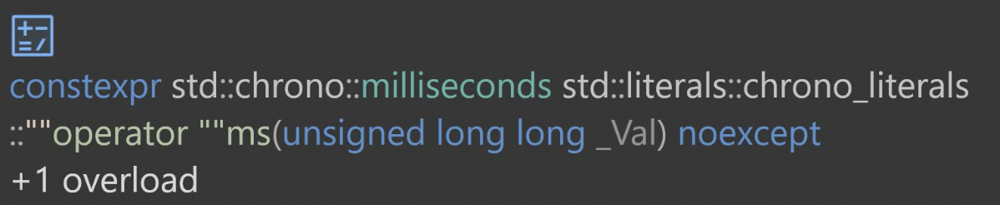
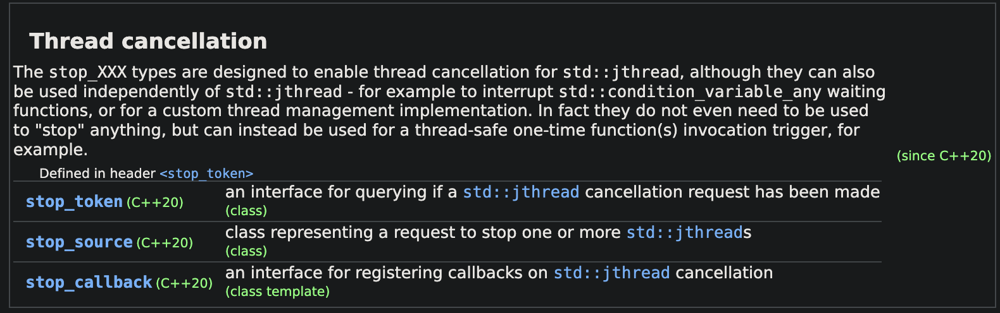

# 内容

1. 线程的构造
2. detach、join
3. mutex、recursive_mutex、shared_mutex
4. lock_guard、unique_lock、shared_lock
5. chrono
6. `std::ref`
7. jthread
    1. 线程取消
8. 条件变量
    1. wait、wait_for、wait_until
9. future、promise
    1. packaged_task
    2. async
10. 信号量
11. 闩锁（latch）、屏障（Barrier）
# 卖票
1. 用`std::thread`构造。
    1. 参数1填函数地址。
    2. 参数2填函数参数，没有则不填。
    3. 遵循的是RAII，构造完即开始运行。
2. 线程对象有`detach`方法用来脱离主线程的管理。防止主线程先于子线程结束导致线程因为整个进程提前终止而未执行完毕。
3. 也可以使用`th.join()`方法来让主线程等待子线程执行结束。相当于WaitForSingleObject
4. `std::this_thread::sleep_for`可以用于线程睡眠。
    1. 可以使用`<chrono>`库下的`std::chrono::milliseconds(n)`来指定时间单位。
    2. `C++17`之后可以使用`using namespace std::chrono_literals`用于把字面常量标识符映射为秒、毫秒等。



```cpp
#include <thread>
#include <chrono>
constinit int tickets = 100;
void station(void);
void station2(void);

int main()
{
    std::thread th(&station);
    std::thread th2(&station2);
    th.detach();
    th2.detach();
    //std::this_thread::sleep_for(std::chrono::milliseconds(10000));
    std::this_thread::sleep_for(10000ms);
}
void station(void)
{
    while (true)
    {
        if (tickets > 0)
        {
            std::wcout << L"Station #1: " << tickets-- << std::endl;
        }
        else
        {
            break;
        }
    }
}
void station2(void)
{
    while (true)
    {
        if (tickets > 0)
        {
            std::wcout << L"Station #2: " << tickets-- << std::endl;
        }
        else
        {
            break;
        }
    }
}
```
## 输出
```
Station #1: 100
Station #1: 99
Station #1: 98
Station #1: 97
Station #1: 96
Station #1: 95
Station #1: 94
Station #1: 93
Station #1: 92
Station #1: 91
Station #1: 90
Station #1: 89
Station #1: 88
Station #1: 87
Station #2: 86
Station #2: 85
Station #2: 84
Station #2: 83
Station #2: 82
Station #2: 81
Station #2: 80
Station #2: 79
Station #2: 78
Station #2: 77
Station #2: 76
Station #2: 75
Station #2: 74
Station #2: 73
Station #2: 72
Station #2: 71
Station #2: 70
Station #2: 69
Station #2: 68
Station #2: 67
Station #2: 66
Station #2: 65
Station #2: 64
Station #2: 63
Station #2: 62
Station #1: 61
Station #1: 60
Station #1: 59
Station #1: 58
Station #1: 57
Station #1: 56
Station #1: 55
Station #1: 54
Station #1: 53
Station #1: 52
Station #1: 51
Station #1: 50
Station #1: 49
Station #1: 48
Station #1: 47
Station #1: 46
Station #1: 45
Station #1: 44
Station #1: 43
Station #1: 42
Station #1: 41
Station #1: 40
Station #1: 39
Station #1: 38
Station #1: 37
Station #1: 36
Station #1: 35
Station #1: 34
Station #1: 33
Station #1: 32
Station #1: 31
Station #1: 30
Station #1: 29
Station #1: 28
Station #1: 27
Station #1: 26
Station #2: 25
Station #2: 24
Station #2: 23
Station #1: 22
Station #1: 21
Station #1: 20
Station #1: 19
Station #1: 18
Station #1: 17
Station #1: 16
Station #1: 15
Station #1: 14
Station #1: 13
Station #1: 12
Station #1: 11
Station #1: 10
Station #1: 9
Station #1: 8
Station #1: 7
Station #1: 6
Station #1: 5
Station #1: 4
Station #1: 3
Station #1: 2
Station #1: 1
Station #2: 0
```
发现把0号票卖掉了，错误。
# mutex（互斥量）
定义于`<mutex>`中。
## 特性
### 构造函数以及不可复制性
在[mutex构造函数](https://legacy.cplusplus.com/reference/mutex/mutex/mutex/)中指出，构造一个mutex对象，初始状态是解锁。
mutex对象不能被复制、移动（复制构造函数和赋值运算符都被删除）
因此，要特别注意你创建的mutex的生命周期，不建议建立在栈帧随时塌陷的位置。
## recursive_mutex（多次互斥量）
单纯的mutex只能锁一次。
`recursive_mutex`可以锁多次，也可以解锁多次。
## 例子
```cpp
#include <mutex>
// ...
std::mutex mx;
// ...
void station(void)
{
    while (true)
    {
        mx.lock();
        if (tickets > 0)
        {
            std::wcout << L"Station #1: " << tickets-- << std::endl;
            mx.unlock();
        }
        else
        {
            mx.unlock();
            break;
        }
    }
}
void station2(void)
{
    while (true)
    {
        mx.lock();
        if (tickets > 0)
        {
            std::wcout << L"Station #2: " << tickets-- << std::endl;
            mx.unlock();
        }
        else
        {
            mx.unlock();
            break;
        }
    }
}
```
## 输出
```
Station #1: 500
Station #1: 499
Station #1: 498
Station #1: 497
Station #1: 496
Station #1: 495
Station #1: 494
Station #1: 493
Station #1: 492
Station #1: 491
Station #1: 490
Station #1: 489
Station #1: 488
Station #1: 487
Station #1: 486
Station #1: 485
Station #1: 484
Station #1: 483
Station #1: 482
Station #1: 481
Station #1: 480
Station #1: 479
Station #1: 478
Station #1: 477
Station #1: 476
Station #1: 475
Station #1: 474
Station #1: 473
Station #1: 472
Station #1: 471
Station #1: 470
Station #1: 469
Station #1: 468
Station #1: 467
Station #1: 466
Station #1: 465
Station #1: 464
Station #1: 463
Station #1: 462
Station #1: 461
Station #1: 460
Station #1: 459
Station #1: 458
Station #1: 457
Station #1: 456
Station #1: 455
Station #1: 454
Station #1: 453
Station #1: 452
Station #1: 451
Station #1: 450
Station #1: 449
Station #1: 448
Station #1: 447
Station #1: 446
Station #1: 445
Station #1: 444
Station #1: 443
Station #1: 442
Station #1: 441
Station #1: 440
Station #1: 439
Station #1: 438
Station #1: 437
Station #1: 436
Station #1: 435
Station #1: 434
Station #1: 433
Station #1: 432
Station #1: 431
Station #1: 430
Station #1: 429
Station #1: 428
Station #1: 427
Station #1: 426
Station #1: 425
Station #1: 424
Station #1: 423
Station #1: 422
Station #1: 421
Station #1: 420
Station #1: 419
Station #1: 418
Station #1: 417
Station #1: 416
Station #1: 415
Station #1: 414
Station #1: 413
Station #1: 412
Station #1: 411
Station #1: 410
Station #1: 409
Station #1: 408
Station #1: 407
Station #1: 406
Station #1: 405
Station #1: 404
Station #1: 403
Station #1: 402
Station #1: 401
Station #1: 400
Station #1: 399
Station #1: 398
Station #1: 397
Station #1: 396
Station #1: 395
Station #1: 394
Station #1: 393
Station #2: 392
Station #2: 391
Station #2: 390
Station #2: 389
Station #2: 388
Station #2: 387
Station #2: 386
Station #2: 385
Station #2: 384
Station #2: 383
Station #2: 382
Station #2: 381
Station #2: 380
Station #2: 379
Station #2: 378
Station #2: 377
Station #2: 376
Station #2: 375
Station #2: 374
Station #2: 373
Station #2: 372
Station #2: 371
Station #2: 370
Station #2: 369
Station #2: 368
Station #2: 367
Station #2: 366
Station #2: 365
Station #2: 364
Station #2: 363
Station #2: 362
Station #2: 361
Station #2: 360
Station #2: 359
Station #2: 358
Station #2: 357
Station #2: 356
Station #2: 355
Station #2: 354
Station #2: 353
Station #2: 352
Station #2: 351
Station #2: 350
Station #2: 349
Station #2: 348
Station #2: 347
Station #2: 346
Station #2: 345
Station #2: 344
Station #2: 343
Station #2: 342
Station #2: 341
Station #2: 340
Station #2: 339
Station #2: 338
Station #2: 337
Station #2: 336
Station #2: 335
Station #2: 334
Station #2: 333
Station #2: 332
Station #2: 331
Station #2: 330
Station #2: 329
Station #2: 328
Station #2: 327
Station #2: 326
Station #2: 325
Station #2: 324
Station #2: 323
Station #2: 322
Station #2: 321
Station #2: 320
Station #2: 319
Station #2: 318
Station #2: 317
Station #2: 316
Station #2: 315
Station #2: 314
Station #2: 313
Station #2: 312
Station #2: 311
Station #2: 310
Station #2: 309
Station #2: 308
Station #2: 307
Station #2: 306
Station #2: 305
Station #2: 304
Station #2: 303
Station #2: 302
Station #2: 301
Station #2: 300
Station #2: 299
Station #2: 298
Station #2: 297
Station #2: 296
Station #2: 295
Station #2: 294
Station #2: 293
Station #2: 292
Station #2: 291
Station #2: 290
Station #2: 289
Station #2: 288
Station #2: 287
Station #2: 286
Station #2: 285
Station #2: 284
Station #2: 283
Station #2: 282
Station #2: 281
Station #2: 280
Station #2: 279
Station #2: 278
Station #2: 277
Station #2: 276
Station #2: 275
Station #2: 274
Station #2: 273
Station #2: 272
Station #2: 271
Station #2: 270
Station #2: 269
Station #2: 268
Station #2: 267
Station #2: 266
Station #2: 265
Station #2: 264
Station #2: 263
Station #2: 262
Station #2: 261
Station #2: 260
Station #2: 259
Station #2: 258
Station #2: 257
Station #2: 256
Station #2: 255
Station #2: 254
Station #2: 253
Station #2: 252
Station #2: 251
Station #2: 250
Station #2: 249
Station #2: 248
Station #2: 247
Station #2: 246
Station #2: 245
Station #2: 244
Station #2: 243
Station #2: 242
Station #2: 241
Station #2: 240
Station #2: 239
Station #2: 238
Station #2: 237
Station #2: 236
Station #2: 235
Station #2: 234
Station #2: 233
Station #2: 232
Station #2: 231
Station #2: 230
Station #2: 229
Station #2: 228
Station #2: 227
Station #2: 226
Station #2: 225
Station #2: 224
Station #2: 223
Station #2: 222
Station #2: 221
Station #2: 220
Station #2: 219
Station #2: 218
Station #2: 217
Station #2: 216
Station #2: 215
Station #2: 214
Station #2: 213
Station #2: 212
Station #2: 211
Station #2: 210
Station #2: 209
Station #2: 208
Station #2: 207
Station #2: 206
Station #2: 205
Station #2: 204
Station #2: 203
Station #2: 202
Station #2: 201
Station #2: 200
Station #2: 199
Station #2: 198
Station #2: 197
Station #2: 196
Station #2: 195
Station #2: 194
Station #2: 193
Station #2: 192
Station #2: 191
Station #2: 190
Station #2: 189
Station #2: 188
Station #2: 187
Station #2: 186
Station #2: 185
Station #2: 184
Station #2: 183
Station #2: 182
Station #2: 181
Station #2: 180
Station #2: 179
Station #2: 178
Station #2: 177
Station #2: 176
Station #2: 175
Station #2: 174
Station #2: 173
Station #2: 172
Station #2: 171
Station #2: 170
Station #2: 169
Station #2: 168
Station #2: 167
Station #2: 166
Station #2: 165
Station #2: 164
Station #2: 163
Station #2: 162
Station #2: 161
Station #2: 160
Station #2: 159
Station #2: 158
Station #2: 157
Station #2: 156
Station #2: 155
Station #2: 154
Station #2: 153
Station #2: 152
Station #2: 151
Station #2: 150
Station #2: 149
Station #2: 148
Station #2: 147
Station #2: 146
Station #2: 145
Station #2: 144
Station #2: 143
Station #2: 142
Station #2: 141
Station #2: 140
Station #2: 139
Station #2: 138
Station #2: 137
Station #2: 136
Station #2: 135
Station #2: 134
Station #2: 133
Station #2: 132
Station #2: 131
Station #2: 130
Station #2: 129
Station #2: 128
Station #2: 127
Station #2: 126
Station #2: 125
Station #2: 124
Station #2: 123
Station #2: 122
Station #2: 121
Station #2: 120
Station #2: 119
Station #2: 118
Station #2: 117
Station #2: 116
Station #2: 115
Station #2: 114
Station #2: 113
Station #2: 112
Station #2: 111
Station #2: 110
Station #2: 109
Station #2: 108
Station #2: 107
Station #2: 106
Station #2: 105
Station #2: 104
Station #2: 103
Station #2: 102
Station #2: 101
Station #2: 100
Station #2: 99
Station #2: 98
Station #2: 97
Station #2: 96
Station #2: 95
Station #2: 94
Station #2: 93
Station #2: 92
Station #2: 91
Station #2: 90
Station #2: 89
Station #2: 88
Station #2: 87
Station #2: 86
Station #2: 85
Station #2: 84
Station #2: 83
Station #2: 82
Station #2: 81
Station #2: 80
Station #2: 79
Station #2: 78
Station #2: 77
Station #2: 76
Station #2: 75
Station #2: 74
Station #2: 73
Station #2: 72
Station #2: 71
Station #2: 70
Station #2: 69
Station #2: 68
Station #2: 67
Station #2: 66
Station #2: 65
Station #2: 64
Station #2: 63
Station #2: 62
Station #2: 61
Station #2: 60
Station #2: 59
Station #2: 58
Station #2: 57
Station #2: 56
Station #2: 55
Station #2: 54
Station #2: 53
Station #2: 52
Station #2: 51
Station #2: 50
Station #2: 49
Station #2: 48
Station #2: 47
Station #2: 46
Station #2: 45
Station #2: 44
Station #2: 43
Station #2: 42
Station #2: 41
Station #2: 40
Station #2: 39
Station #2: 38
Station #2: 37
Station #2: 36
Station #2: 35
Station #2: 34
Station #2: 33
Station #2: 32
Station #2: 31
Station #2: 30
Station #2: 29
Station #2: 28
Station #2: 27
Station #2: 26
Station #2: 25
Station #2: 24
Station #2: 23
Station #2: 22
Station #2: 21
Station #2: 20
Station #2: 19
Station #2: 18
Station #2: 17
Station #2: 16
Station #2: 15
Station #2: 14
Station #2: 13
Station #2: 12
Station #2: 11
Station #2: 10
Station #2: 9
Station #2: 8
Station #2: 7
Station #2: 6
Station #2: 5
Station #2: 4
Station #2: 3
Station #2: 2
Station #2: 1
```
## 分析
可以看到线程1、2各自持有锁的跨度还是挺大的，这是因为在`跨平台C++线程库`在Windows下的执行是用`Windows临界区`实现的。
# 作为引用传入线程函数（`std::ref`）
1. `std::mutex`锁是不可复制的。只能通过引用传递。

```cpp
void station(std::mutex& mx);
int main()
{
    std::mutex mx;
    std::thread th(&station, mx); // error
    th.join();
}
void station(std::mutex& mx)
{
    // ...
}
```
此时，虽然线程函数参数类型为引用，但实际写的代码中，“mx”这个形式和值类型的形式不能区分，编译器无法对其直接解析为引用，产生二义性。（即编译器默认都先按照值传递处理，之后才去处理、区分是否为引用）
2. 因此不能直接裸传，为了显式指出此变量为引用类型，要包装一层“引用包裹器”。`std::reference_wrapper(mx)`，也可以简写为`std::ref(mx)`。在实际使用到该引用类型变量时，包裹器会自己释放出实际内容。

```cpp
void station(std::mutex& mx);
void station2(std::mutex& mx);
int main()
{
    std::mutex mx;
    std::thread th(&station, std::ref(mx));
    std::thread th2(&station2, std::ref(mx));
    th.join();
    th2.join();
}
void station(std::mutex& mx)
{
    // ...
}
void station2(std::mutex& mx)
{
    // ...
}
```
## 解析`std::ref`

```c++
void fun(int n, int & ret)
{
	for (int i = 1; i <= n; ++i)
	{
		cout << "thread fun" << endl;
		std::this_thread::sleep_for(std::chrono::milliseconds(100));
	}
	ret = n;
	cout << "thread fun end" << endl;
	return n;
}
int main()
{
	int x = 10;
	std::thread tha(fun, 5, std::ref(x));
	tha.join();
	cout << x << endl;		//输出5
}
```

```c++
int main()
{
	int x = 10;
	std::thread tha(fun, 5, x);		//编译不通过
	tha.join();
	cout << x << endl;
}
```

为什么直接传x不能编译通过呢？因为thread的构造距离start线程中间有一层可变参模板组件：

```c++
template<class Function, class... Args>
explicit thread(Function&& f, Args&&... args);
```

```c++
template <class _Fn, class... _Args>
explicit thread(_Fn&& _Fx, _Args&&... _Ax)
{
    _Start(_STD forward<_Fn>(_Fx), _STD forward<_Args>(_Ax)...);
}
```

thread的构造需要先通过这个组件，则由于`args`是按`[模板 &&]`接收，如果直接单纯传`x`，则会识别为普通的`int`值传递，在到达`_Start`接口后，`x`的`int`类型与参数类型`int &`不匹配，无法编译通过。

所以需要一个特殊的机制，用`std::ref`显式指出把`x`按引用方式传递（传地址），如此，在经过模板时，按转发引用处理，经过`_Start`接口的完美转发后作为右值**隐式转换**为`int &`类型，如此便可编译通过，达到按引用传参的目的。

为什么是隐式转换？
```c++
//std::ref的底层是reference_wrapper类，其中有隐式转换
template <class _Ty>
class reference_wrapper
{
public:
    using type = _Ty;
    
    template <class _Uty>
    reference_wrapper(_Uty&& _Val)
    {
        _Ty& _Ref = static_cast<_Uty&&>(_Val);
        _Ptr      = &_Ref;	/*_STD addressof(_Ref);*/
    }
    
    operator _Ty&() const noexcept
    {
        return *_Ptr;
    }
private:
    _Ty* _Ptr{};
};
```

测试
```c++
#include<iostream>
#include<thread>
using namespace std;
//std::ref的底层是reference_wrapper类，其中有隐式转换

template <class _Ty>
class my_reference_wrapper
{
public:
    using type = _Ty;

    template <class _Uty>
    my_reference_wrapper(_Uty&& _Val)
    {
        _Ty& _Ref = static_cast<_Uty&&>(_Val);
        _Ptr = &_Ref;	/*_STD addressof(_Ref);*/
    }

    operator _Ty&() const noexcept
    {
        return *_Ptr;
    }
private:
    _Ty* _Ptr{};
};
int fun(int n, int& x)
{
    for (int i = 1; i <= n; ++i)
    {
        cout << "thread fun" << endl;
        std::this_thread::sleep_for(std::chrono::milliseconds(100));
    }
    x = n;
    cout << "thread fun end" << endl;
    return n;
}
int main()
{
    int x = 10;
    
    std::thread tha(fun, 5, my_reference_wrapper<int>(x));
    tha.join();
    cout << x << endl;
}
```

```c++
template <class _Fn, class... _Args>
explicit thread(_Fn&& _Fx, _Args&&... _Ax)
{
    _Start(_STD forward<_Fn>(_Fx), _STD forward<_Args>(_Ax)...);
}
```

构造tha时的第三个参数是`my_reference_wrapper<int>(x)`，是个右值！传入thread可变参模板函数，完美转发，右值叠加右值，依然是右值，调用`_Start`时优先匹配`&&`类型的参数，但是发现没有，而且只有一个匹配的选项是：`(int n, int & x)`，是`int&`类型，于是乎，无奈之举，调用成员函数`operator _Ty()`，即为隐式转换为`&Ty`的左值引用类型。

如此一来，即可把线程函数外部的`x`按引用传递。
# lock_guard
同样定义于`<mutex>`中。用于帮助管理mutex锁。
RAII对象。自动管理生命周期。
需要一个mutex锁来构造。构造后立刻对mutex上锁，直到`lock_guard`自身析构时对mutex解锁。
与mutex一样，`lock_guard`对象无法复制/移动。

>`lock_guard`是一个模板类，需要一个模板参数，如填写`<std::mutex>`。在`C++17`后，不用填写模板参数，可以自动判断程序代码大括号中的参数类型。
```cpp
void station(std::mutex& mx);
void station2(std::mutex& mx);
int main()
{
    std::mutex mx;
    std::thread th(&station, std::ref(mx));
    std::thread th2(&station2, std::ref(mx));
    th.join();
    th2.join();
}
void station(std::mutex& mx)
{
    while (true)
    {
        std::lock_guard<std::mutex> lck{ mx };
        if (tickets > 0)
        {
            std::wcout << L"Station #1: " << tickets-- << std::endl;
        }
        else
        {
            break;
        }
    } // 退出此括号时，lck析构
}
void station2(std::mutex& mx)
{
    while (true)
    {
        std::lock_guard lck{ mx }; // 在`C++17`后，不用填写模板参数，可以自动判断程序代码大括号中的参数类型。
        if (tickets > 0)
        {
            std::wcout << L"Station #2: " << tickets-- << std::endl;
        }
        else
        {
            break;
        }
    } // 退出此括号时，lck析构
}
```
# unique_lock
定义于`<mutex>`中
1. 和`lock_guard`用法一样，但是`unique_lock`支持转移给另一个`unique_lock`。（需要使用`std::move`）
2. 有unlock、release、swap方法。

```cpp
void station(std::mutex& mx);
void station2(std::mutex& mx);
int main()
{
    std::mutex mx;
    std::thread th(&station, std::ref(mx));
    std::thread th2(&station2, std::ref(mx));
    th.join();
    th2.join();
}
void station(std::mutex& mx)
{
    while (true)
    {
        std::unique_lock lck{ mx };
        if (tickets > 0)
        {
            std::wcout << L"Station #1: " << tickets-- << std::endl;
            std::unique_lock lck2 = std::move(lck);
        }
        else
        {
            break;
        }
    } // 退出此括号时，lck2、lck析构
}
// station2 ...
```
## 输出
```
Station #1: 100
Station #1: 99
Station #1: 98
Station #1: 97
Station #1: 96
Station #1: 95
Station #1: 94
Station #1: 93
Station #1: 92
Station #1: 91
Station #1: 90
Station #1: 89
Station #1: 88
Station #1: 87
Station #1: 86
Station #1: 85
Station #1: 84
Station #1: 83
Station #1: 82
Station #1: 81
Station #1: 80
Station #1: 79
Station #1: 78
Station #1: 77
Station #1: 76
Station #1: 75
Station #1: 74
Station #1: 73
Station #1: 72
Station #1: 71
Station #1: 70
Station #1: 69
Station #1: 68
Station #1: 67
Station #1: 66
Station #2: 65
Station #2: 64
Station #2: 63
Station #2: 62
Station #2: 61
Station #2: 60
Station #2: 59
Station #2: 58
Station #2: 57
Station #2: 56
Station #2: 55
Station #2: 54
Station #2: 53
Station #2: 52
Station #2: 51
Station #2: 50
Station #2: 49
Station #2: 48
Station #2: 47
Station #2: 46
Station #2: 45
Station #2: 44
Station #2: 43
Station #2: 42
Station #2: 41
Station #2: 40
Station #2: 39
Station #2: 38
Station #2: 37
Station #2: 36
Station #2: 35
Station #2: 34
Station #2: 33
Station #2: 32
Station #2: 31
Station #2: 30
Station #2: 29
Station #2: 28
Station #2: 27
Station #2: 26
Station #2: 25
Station #2: 24
Station #2: 23
Station #2: 22
Station #2: 21
Station #2: 20
Station #2: 19
Station #2: 18
Station #2: 17
Station #2: 16
Station #2: 15
Station #2: 14
Station #2: 13
Station #2: 12
Station #2: 11
Station #2: 10
Station #2: 9
Station #2: 8
Station #2: 7
Station #2: 6
Station #2: 5
Station #2: 4
Station #2: 3
Station #2: 2
Station #2: 1
```
# shared_mutex（共享互斥量）
定义于`<shared_mutex>`，`C++17`给出的共享互斥量。
Shared mutexes are especially useful when shared data can be safely read by any number of threads simultaneously, but a thread may only write the same data when no other thread is reading or writing at the same time.
消费者可以共同访问，但不能和生产者一起共享。
1. 提供的方法：`lock_shared`用于消费者共享锁。`lock`用于生产者独占锁。
    1. lock和lock，lock和lock_shared都互斥。
2. 在生产者消费者模型中，`lock_shared`、`unlock_shared`用于n个消费者一起进入消费。`lock`、`unlock`用于阻断消费者进入。

```cpp
#include <shared_mutex>
#include <iostream>
#include <thread>
#include <chrono>
#include <mutex>
constinit int tickets{ 0 };
void station(std::shared_mutex& mx);
void station2(std::shared_mutex& mx);
void produce(std::shared_mutex& mx);
using namespace std::chrono_literals;

int main()
{
    std::shared_mutex mx;
    std::thread consumer(&station, std::ref(mx));
    std::thread consumer2(&station2, std::ref(mx));
    std::thread producer(&produce, std::ref(mx));

    consumer.join();
    consumer2.join();
    producer.join();
}
void produce(std::shared_mutex& mx)
{
    while (true)
    {
        mx.lock();
        std::wcout << L"Producer: " << ++tickets << std::endl;
        std::this_thread::sleep_for(500ms);
        mx.unlock();

    }
}
void station(std::shared_mutex& mx)
{
    while (true)
    {
        mx.lock_shared();
        if (tickets > 0)
        {
            std::wcout << L"Station #1: " << tickets-- << std::endl;
            mx.unlock_shared();
        }
        else
        {
            mx.unlock_shared();
        }
    }
}
void station2(std::shared_mutex& mx)
{
    while (true)
    {
        mx.lock_shared();
        if (tickets > 0)
        {
            std::wcout << L"Station #2: " << tickets-- << std::endl;
            mx.unlock_shared();
        }
        else
        {
            mx.unlock_shared();
        }
    }
}
```
## 输出
```
Producer: 1
Station #2: 1
Station #1: 0
Producer: 0
Producer: 1
Producer: 2
Producer: 3
Station #2: 3
Station #1: 2
Station #1: 1
Producer: 1
Producer: 2
Producer: 3
Station #2: 3
Station #2: 2
Station #2: 1
Producer: 1
Station #2: 1
Producer: 1
Producer: 2
Producer: 3
Producer: 4
 ...
```
## 分析
1. 输出中看到1个producer和2个consumer是互斥的，有一方在则另一方不动。
2. 输出中看到0号票有时候也会被卖掉。证明了`mx.lock_shared()`只是让n个消费者同时拿到锁，并且没有做进一步的同步管理。
# shared_lock - 以生产者消费者为例
1. 把开锁解锁的动作让锁管理器接管。
2. lock、unlock动作让`unique_lock`接管
3. lock_shared、unlock_shared动作让`shared_lock`接管。

```cpp
#include <shared_mutex>
#include <iostream>
#include <thread>
#include <chrono>
#include <mutex>
constinit int tickets{ 0 };
void station(std::shared_mutex& mx);
void station2(std::shared_mutex& mx);
void produce(std::shared_mutex& mx);
using namespace std::chrono_literals;

int main()
{
    std::shared_mutex mx;
    std::thread consumer(&station, std::ref(mx));
    std::thread consumer2(&station2, std::ref(mx));
    std::thread producer(&produce, std::ref(mx));

    consumer.join();
    consumer2.join();
    producer.join();
}
void produce(std::shared_mutex& mx)
{
    while (true)
    {
        std::unique_lock lck{ mx };
        std::wcout << L"Producer: " << ++tickets << std::endl;
        std::this_thread::sleep_for(500ms);
    }
}
void station(std::shared_mutex& mx)
{
    while (true)
    {
        std::shared_lock lck{ mx };
        if (tickets > 0)
        {
            std::wcout << L"Station #1: " << tickets-- << std::endl;
        }
        else
        {
        }
    }
}
void station2(std::shared_mutex& mx)
{
    while (true)
    {
        std::shared_lock lck{ mx };
        if (tickets > 0)
        {
            std::wcout << L"Station #2: " << tickets-- << std::endl;
        }
        else
        {
        }
    }
}
```
# chrono
`std::this_thread::sleep_for`可以用于线程睡眠。
1. 可以使用`<chrono>`库下的`std::chrono::milliseconds(n)`来指定时间单位。
2. `C++17`之后可以使用`using namespace std::chrono_literal;`用于把字面常量标识符映射为秒、毫秒等。


```cpp
#include <thread>
#include <chrono>
constinit int tickets = 100;
void station(void);
void station2(void);

int main()
{
    std::thread th(&station);
    std::thread th2(&station2);
    th.detach();
    th2.detach();
    //std::this_thread::sleep_for(std::chrono::milliseconds(10000));
    std::this_thread::sleep_for(10000ms);
}
```
# `C++`线程与lambda表达式结合
使用lambda表达式定义一个线程函数：每100ms打印从0到100。
```cpp
#include <iostream>
#Include <thread>
#include <chrono>

using namespace std::chrono_literals;
int main()
{
    std::thread t1([]() -> void
        {
            for (int i = 0; i <= 100; ++i)
            {
                std::cout << i << std::endl;
                std::this_thread::sleep_for(100ms);
            }
        });
    t1.join();
}
```
## lambda函数参数的处理
lambda表达式作为线程函数，如果有其自己的内部参数，那么就需要传入lambda表达式后，再传入其使用的参数。
```cpp
#include <iostream>
#Include <thread>
#include <chrono>

using namespace std::chrono_literals;
int main()
{
    auto nums{ 100 };
    std::thread t1([](auto nu) -> void
        {
            for (int i = 0; i <= nu; ++i)
            {
                std::cout << i << std::endl;
                std::this_thread::sleep_for(100ms);
            }
            nu = 50; // 带不回去
        }, nums);
    std::thread t2([](int& nu) -> void
        {
            for (int i = 0; i <= nu; ++i)
            {
                std::cout << i << std::endl;
                std::this_thread::sleep_for(100ms);
            }
            nu = 50;  // 带回去修改了nums的值
        }, std::ref(nums));
    t1.join();
    t2.join();
}
```
1. 参数按值传递：lambda形参类型可以用auto。
2. 参数按引用传递：传参时必须用`std::ref`。此时由于有引用包裹器，auto不能推导。所以lambda形参类型不可以用`auto &`，也不可以用`auto &&`，必须明确`ClassName &`
# jthread
`C++20`下的加强版thread类
1. 如果main函数中没写t1的join，那么会先到`return 0;`，之后在main即将return 0时，t1析构时，自动地为t1调用join，则最后主线程等待t1结束后一起退出。如果明确写了join则按照普通thread的join时机。
2. 如果只写detach，那么最后就不会自动加join，主线程退出时子线程也会退出。
## 线程取消

这些 `stop_XXX` 类型都在`<stop_token>`中定义，旨在使`jthread`取消，尽管它们也可以独立使用 `std::jthread` - 例如，中断`std::condition_variable_any`等待函数，或用于自定义线程管理实现。事实上，它们甚至不需要用于“停止”任何东西，而是可以用于线程安全的一次性函数调用触发器。（这段话的意思大概是，`stop_token`只是叫做“停止”，但实际上没有真的停止动作）
### stop_token、stop_requested
1. token会共享一个标记性的对象
2. 线程可以`get_stop_token`获得token
3. 线程可以`request_stop`通知停止
    1. 旧的让线程停止的手段：需要建立如Windows下的Event，通过Event让线程停止。现在这种`stop_token`方法使线程停止更简洁了。


1. 如果要传入`stop_token`，jthread的线程函数中内部的第1个参数必须写`std::stop_token`
2. jthread提供了`request_stop`函数。提供了`get_stop_token`函数。

以下程序表示：
1. 主线程创建t1，内部有一个tok每100ms查看是否有外部请求停止。
2. 程序执行3s后，主线程调用`t1.request_stop()`请求t1停止。
```cpp
#include <iostream>
#include <thread>

using namespace std::chrono_literals;
int main()
{
    std::jthread t1([](std::stop_token tok) -> void
        {
            for (int i = 0; i <= 100; ++i)
            {
                std::cout << i << std::endl;
                if (tok.stop_requested())
                {
                    break;
                }
                std::this_thread::sleep_for(100ms);
            }
        });
        
    std::this_thread::sleep_for(3s);
    t1.request_stop();
    
    t1.join();
    return 0;
}
```
### 应用场景
传输文件过程中，通过token这种类似于信号的东西，用于控制另一个线程。（传统方法是需要WaitForSingleObject，较为繁琐）
这是一种面向对象的设计，token可以通过传参传递，按照事件通知的方式，按需快速使用。
### stop_possible
可看[std::stop_token::stop_possible](https://en.cppreference.com/w/cpp/thread/stop_token/stop_possible)中的代码示例。
### stop_source

jthread对象可以通过调用`get_stop_source`，返回与 `jthread` 对象内部保存的相同共享停止状态关联的 `std::stop_source`。

获取到jthread的source后就不用操作jthread了，可以通过source进行：
1. `source.get_token()`，就相当于`t1.get_stop_token()`
2. `source.request_stop()`

```cpp
#include <iostream>
#include <thread>
#include<stop_token>
using namespace std::chrono_literals;
int main()
{
    std::jthread t1([](std::stop_token tok) -> void
        {
            for (int i = 0; i <= 100; ++i)
            {
                std::cout << i << std::endl;
                if (tok.stop_requested())
                {
                    break;
                }
                std::this_thread::sleep_for(100ms);
            }
        });
    
    auto source = t1.get_stop_source();
    std::this_thread::sleep_for(3s);
    source.request_stop();
}
```
### stop_callback
定义于`<stop_token>`，用于搭配`stop_token`使用，指示线程取消后进行的回调操作。
1. 需要一个`stop_token`和一个函数作为构造
2. 当该`stop_token`对应的线程得到`stop_requested`信号时，调用`stop_callback`构造时绑定的函数。

```cpp
#include <iostream>
#include <thread>
#include <stop_token>
using namespace std::chrono_literals;
int main()
{
    std::jthread t1([](std::stop_token tok) -> void
        {
            for (int i = 0; i <= 100; ++i)
            {
                std::cout << i << std::endl;
                if (tok.stop_requested())
                {
                    break;
                }
                std::this_thread::sleep_for(100ms);
            }
        });

    std::stop_callback cb{ t1.get_stop_token(), []() -> void
        {
            std::wcout << L"Stopped!" << std::endl;
        } };

    std::this_thread::sleep_for(3s);
    t1.request_stop();
}
```
可能的输出：
```
0
1
2
3
4
5
6
7
8
9
10
11
12
13
14
15
16
17
18
19
20
21
22
23
24
25
26
27
Stopped!
28
```
# 条件变量（wait）
从`C++11`就开始引入了

类似于Windows下的信号。
`Modern C++`中通用的用于通知、等待的工具。
需要和锁配套使用，因为cv的wait方法需要传入一个`std::unique_lock<std::mutex>`参数

以下程序说的是：
1. 创建一个t1线程
2. t1线程尝试拿mx锁
3. 拿到mx后，在mx锁上面wait，释放锁，之后休眠（进入等待队列）
4. 如果没有通知则一直阻塞。
5. 主线程休眠3s
6. 主线程notify通知等待队列，唤醒了t1线程。
7. 子线程t1被唤醒后，必须重新获取锁，才能返回从而继续下一步。

综上所述，wait有三大步骤：
1. 释放锁
2. 休眠，进入等待队列
3. 被唤醒，尝试获取锁。
    1. 如果成功则进行下一步操作。
    2. 如果暂时没拿到锁则阻塞，直到拿到锁后才能进行下一步。
        1. 但这是因抢锁而导致阻塞，和wait的等待队列是两码事！
        2. 也就是说（再次强调）：wait是主动阻塞（wait之前拿到了锁，但是条件为假，主动放弃了锁）。而一旦条件为真，且被唤醒后，抢锁没抢到，则是被动阻塞。

除了这三大步骤，还有一大前提：系统假定在wait调用前，其中的mx互斥量已上锁。所以必须在拿到锁之后才能wait。
```cpp
#include <condition_variable>
#include <mutex>
std::mutex mx;
std::condition_variable cv;
using namespace std::chrono_literals;
int main()
{
    std::jthread t1([]() -> void
        {
            std::unique_lock lck{ mx };
            cv.wait(lck);
            for (int i = 0; i <= 100; ++i)
            {
                std::cout << i << std::endl;
                
                std::this_thread::sleep_for(100ms);
            }
        });
    std::this_thread::sleep_for(3s);
    cv.notify_one();
}
```
### 注意事项
据《操作系统导论》P252 30.1节 中的提示：
>推荐在发notify信号时总是持有锁
>
>尽管并不是所有情况下都严格需要，但有效且简单的做法还是在使用条件变量发送notify信号时持有锁（指要发送notify的线程）。有的例子是必须加锁的情况，但也有一些情况可以不加锁，而这可能是你应该避免（避免再去分情况考虑）的。因此，**为了简单**，请在调用 signal（也就是notify） 时持有锁（hold the lock when calling signal）。
>
>这个提示的反面，即调用 wait 时持有锁，但这就不只是建议了，wait 的语义是强制要求前提持有锁的。因为 wait 调用总是假设你调用它时已经持有锁、调用者睡眠之前会释放锁以及返回前重新持有锁。
>
>因此，可以提出一般化形式，保证程序正确：调用 signal 和 wait 时都要持有锁（hold the lock when calling signal or wait）。

就拿上面的例子来说，如果不对`notify_one`加以同步控制的话，有可能t1线程在lck上锁的时候，主线程恰好`notify_one`，导致在其wait之前唤醒，则wait之后再也没有唤醒的机会，程序就一直阻塞了。

所以，在主线程中的`cv.notify_one()`语句之前加锁（记得和t1中mutex变量一致）。
而且既然在`cv.notify_one()`之前加了锁，就要在`cv.notify_one()`之后解锁，是因为wait被唤醒之后还需要得到锁才能脱离阻塞继续下一步操作。
```cpp
int main()
{
    // t1 ...

    std::this_thread::sleep_for(3s);
    
    std::unique_lock lck{ mx };    // add
    cv.notify_one();
    lck.unlock();                  // add
    
}
```
## wait_for
```cpp
template <class Rep, class Period>
cv_status wait_for (unique_lock<mutex>& lck, const chrono::duration<Rep,Period>& rel_time);
```
在wait的基础上，既可以通过获得通知得到唤醒，也可以计时超时得到唤醒。
即：超时后与**被notify**的行为一样，尝试获取锁，如果成功则下一步，如果失败则阻塞。
但返回值有特点，超时则返回`std::cv_status::timeout`，其他情况返回`std::cv_status::no_timeout`
### 用处：结合notify来停止线程
wait是用于通知线程**开始**下一步动作。
而wait_for则可以用于通知线程**停止**。

以下程序是说：2个条件变量，`cv`和`cv2`，`cv`用于`wait`，以决定何时开始。`cv2`用于`wait_for`，结合返回值status，在一段时间等待停止的信号。
主线程：
1. 在释放了cv对应的lck后，子线程wait成功获取到锁开始下一步。
2. 休眠3s，保证子线程可以至少执行3s。
3. 之后与子线程竞争lck2锁，一旦主线程拿到了，当即notify给cv2，之后释放锁。

子线程：
1. 在cv上等待，一旦获取lck则下一步。
2. 每次for循环都先抢lck2锁
    1. 在主线程休眠的3s内，肯定能抢到。并且每次wait_for释放锁也不会被别人抢，即不会被notify，所以返回值应该都是timeout
    2. 3s主线程唤醒后，与主线程竞争lck2锁
        1. 如果子先抢到了，则这一次for循环在wait_for时lck2释放50ms，如果主线程在此期间抢到了，并且发了notify，则status为`no_timeout`，子线程break结束。此情况下只能打印一半。
        2. 也有可能：for每次循环结束时，释放锁，主线程在很小很小的空挡内抢到锁，导致提前notify，错过cv2等待的时机，但是这个可能很小。此情况下1000个数全部输出。

```cpp
#include <condition_variable>
#include <mutex>
#include <iostream>
std::mutex mx, mx2;
std::condition_variable cv, cv2;
using namespace std::chrono_literals;
int main()
{
    std::jthread t1([]() -> void
        {
            std::unique_lock lck{ mx };
            cv.wait(lck);
            std::cout << "Got the Notify to Start!" << std::endl;

            for (int i = 0; i <= 1000; ++i)
            {
                std::cout << i << std::endl;

                std::unique_lock lck2{ mx2 };
                if (auto status = cv2.wait_for(lck2, 50ms);
                    status == std::cv_status::no_timeout)
                {
                    std::cout << "Got the Notify to Out!" << std::endl;
                    break;
                }
                else
                {
                    std::cout << "Timeout: No Notify" << std::endl;
                }
            }
        });
    std::this_thread::sleep_for(1s);
    std::unique_lock lck{ mx };
    cv.notify_one();
    lck.unlock();
    std::this_thread::sleep_for(3s);
    std::unique_lock lck2{ mx2 };
    cv2.notify_one();
    lck2.unlock();
}
```
输出
```
Got the Notify to Start!
0
Timeout: No Notify
1
Timeout: No Notify
2
Timeout: No Notify
3
Timeout: No Notify
4
Timeout: No Notify
5
Timeout: No Notify
6
Timeout: No Notify
7
Timeout: No Notify
8
Timeout: No Notify
9
Timeout: No Notify
10
Timeout: No Notify
11
Timeout: No Notify
12
Timeout: No Notify
13
Timeout: No Notify
14
Timeout: No Notify
15
Timeout: No Notify
16
Timeout: No Notify
17
Timeout: No Notify
18
Timeout: No Notify
19
Timeout: No Notify
20
Timeout: No Notify
21
Timeout: No Notify
22
Timeout: No Notify
23
Timeout: No Notify
24
Timeout: No Notify
25
Timeout: No Notify
26
Timeout: No Notify
27
Timeout: No Notify
28
Timeout: No Notify
29
Timeout: No Notify
30
Timeout: No Notify
31
Timeout: No Notify
32
Timeout: No Notify
33
Timeout: No Notify
34
Timeout: No Notify
35
Timeout: No Notify
36
Timeout: No Notify
37
Timeout: No Notify
38
Timeout: No Notify
39
Timeout: No Notify
40
Timeout: No Notify
41
Timeout: No Notify
42
Timeout: No Notify
43
Timeout: No Notify
44
Timeout: No Notify
45
Timeout: No Notify
46
Timeout: No Notify
47
Timeout: No Notify
48
Got the Notify to Out!
```
### 问题
上面那个程序，经过VS编译运行在Windows11时，很有可能会出现这种情况：
（为了让问题更加明显，主线程部分代码改为以下：加长了第二段睡眠时间，并且在睡眠前后加输出提示）
```cpp
int main()
{
    // ...
    std::this_thread::sleep_for(1s);
    std::wcout << L"After Sleep 1s..." << std::endl;
    
    std::unique_lock lck{ mx };
    cv.notify_one();
    lck.unlock();
    
    std::wcout << L"Before Sleep 8s..." << std::endl;
    std::this_thread::sleep_for(8s);
    std::wcout << L"After Sleep 8s..." << std::endl;
    std::unique_lock lck2{ mx2 };
    cv2.notify_one();
    lck2.unlock();
}
```
主线程明明8秒后才会notify_one，但是某时的输出结果下，居然很快就让子线程停止了，这是怎么回事？
观察输出信息，发现，主线程还没输出`After Sleep 8s...`，子线程就被通知了，证明notify肯定不是主线程发出的。
```
After Sleep 1s...
Before Sleep 8s...
Got the Notify to Start!
0
Timeout: No Notify
1
Timeout: No Notify
2
Timeout: No Notify
3
Timeout: No Notify
4
Timeout: No Notify
5
Got the Notify to Out!

```
### 假唤醒
在`cv2.wait_for`的等待过程中，线程可能会因为假唤醒而提前被唤醒，而不是因为条件变量被通知。

假唤醒可以看作是操作系统故意替程序员`notify_one`，会让子线程会认为`wait_for`已经被唤醒，从而退出循环。
>普通的`wait`在Windows下不会假唤醒。而在Unix、Linux、Solaris、AIX中行为可能会不同。

在当前的代码中，当`wait_for`返回时，仅通过检查`timeout`与否来决定是否退出循环。如果是因为假唤醒而返回，`status == std::cv_status::no_timeout`可能依然为真，这会导致线程提前结束。

为了防止假唤醒带来的问题，通常的做法是在等待后检查共享条件变量状态是否满足。你可以通过在`wait_for`之后再检查一个bool标志（例如`stop_requested`）来决定是否退出循环。
在全局区定义它，初值为false，并且在`cv2.notify_one`语句之前置为true。这样，不仅要通过判断是否timeout，还要判断bool标志，以确信是我们自己发出的唤醒。
```cpp
#include <condition_variable>
#include <mutex>
#include <iostream>
std::mutex mx, mx2;
std::condition_variable cv, cv2;
bool stop_requested = false;
using namespace std::chrono_literals;
int main()
{
    std::jthread t1([]() -> void
        {
            std::unique_lock lck{ mx };
            cv.wait(lck);
            std::cout << "Got the Notify to Start!" << std::endl;

            for (int i = 0; i <= 1000; ++i)
            {
                std::cout << i << std::endl;

                std::unique_lock lck2{ mx2 };
                if (auto status = cv2.wait_for(lck2, 50ms);
                    status == std::cv_status::no_timeout && stop_requested == true)
                {
                    std::cout << "Got the Notify to Out!" << std::endl;
                    break;
                }
                else
                {
                    std::cout << "Timeout: No Notify" << std::endl;
                }
            }
        });
    std::this_thread::sleep_for(1s);
    std::wcout << L"After Sleep 1s..." << std::endl;

    std::unique_lock lck{ mx };
    cv.notify_one();
    lck.unlock();

    std::wcout << L"Before Sleep 8s..." << std::endl;
    std::this_thread::sleep_for(8s);
    std::wcout << L"After Sleep 8s..." << std::endl;
    
    std::unique_lock lck2{ mx2 };
    stop_requested = true;
    cv2.notify_one();
    lck2.unlock();
}
```
输出
```
After Sleep 1s...
Before Sleep 8s...
Got the Notify to Start!
0
Timeout: No Notify
1
Timeout: No Notify
2
Timeout: No Notify
3
Timeout: No Notify
4
Timeout: No Notify
5
Timeout: No Notify
6
Timeout: No Notify
7
Timeout: No Notify
8
Timeout: No Notify
9
Timeout: No Notify
10
Timeout: No Notify
11
Timeout: No Notify
12
Timeout: No Notify
13
Timeout: No Notify
14
Timeout: No Notify
15
Timeout: No Notify
16
Timeout: No Notify
17
Timeout: No Notify
18
Timeout: No Notify
19
Timeout: No Notify
20
Timeout: No Notify
21
Timeout: No Notify
22
Timeout: No Notify
23
Timeout: No Notify
24
Timeout: No Notify
25
Timeout: No Notify
26
Timeout: No Notify
27
Timeout: No Notify
28
Timeout: No Notify
29
Timeout: No Notify
30
Timeout: No Notify
31
Timeout: No Notify
32
Timeout: No Notify
33
Timeout: No Notify
34
Timeout: No Notify
35
Timeout: No Notify
36
Timeout: No Notify
37
Timeout: No Notify
38
Timeout: No Notify
39
Timeout: No Notify
40
Timeout: No Notify
41
Timeout: No Notify
42
Timeout: No Notify
43
Timeout: No Notify
44
Timeout: No Notify
45
Timeout: No Notify
46
Timeout: No Notify
47
Timeout: No Notify
48
Timeout: No Notify
49
Timeout: No Notify
50
Timeout: No Notify
51
Timeout: No Notify
52
Timeout: No Notify
53
Timeout: No Notify
54
Timeout: No Notify
55
Timeout: No Notify
56
Timeout: No Notify
57
Timeout: No Notify
58
Timeout: No Notify
59
Timeout: No Notify
60
Timeout: No Notify
61
Timeout: No Notify
62
Timeout: No Notify
63
Timeout: No Notify
64
Timeout: No Notify
65
Timeout: No Notify
66
Timeout: No Notify
67
Timeout: No Notify
68
Timeout: No Notify
69
Timeout: No Notify
70
Timeout: No Notify
71
Timeout: No Notify
72
Timeout: No Notify
73
Timeout: No Notify
74
Timeout: No Notify
75
Timeout: No Notify
76
Timeout: No Notify
77
Timeout: No Notify
78
Timeout: No Notify
79
Timeout: No Notify
80
Timeout: No Notify
81
Timeout: No Notify
82
Timeout: No Notify
83
Timeout: No Notify
84
Timeout: No Notify
85
Timeout: No Notify
86
Timeout: No Notify
87
Timeout: No Notify
88
Timeout: No Notify
89
Timeout: No Notify
90
Timeout: No Notify
91
Timeout: No Notify
92
Timeout: No Notify
93
Timeout: No Notify
94
Timeout: No Notify
95
Timeout: No Notify
96
Timeout: No Notify
97
Timeout: No Notify
98
Timeout: No Notify
99
Timeout: No Notify
100
Timeout: No Notify
101
Timeout: No Notify
102
Timeout: No Notify
103
Timeout: No Notify
104
Timeout: No Notify
105
Timeout: No Notify
106
Timeout: No Notify
107
Timeout: No Notify
108
Timeout: No Notify
109
Timeout: No Notify
110
Timeout: No Notify
111
Timeout: No Notify
112
Timeout: No Notify
113
Timeout: No Notify
114
Timeout: No Notify
115
Timeout: No Notify
116
Timeout: No Notify
117
Timeout: No Notify
118
Timeout: No Notify
119
Timeout: No Notify
120
Timeout: No Notify
121
Timeout: No Notify
122
Timeout: No Notify
123
Timeout: No Notify
124
Timeout: No Notify
125
Timeout: No Notify
126
Timeout: No Notify
127
Timeout: No Notify
128
Timeout: No Notify
129
After Sleep 8s...
Got the Notify to Out!

```
## wait_until
```cpp
template <class Clock, class Duration>
cv_status wait_until (unique_lock<mutex>& lck, const chrono::time_point<Clock,Duration>& abs_time);
```
和`wait_for`行为一样，不同点在于：
1. `wait_for`的时间是时间段、间隔。
2. `wait_until`的时间是时间点。
# future
在标头 `<future>` 中定义

顾名思义，future就是为了用于获取返回值的。内部包装了一个任务或函数。

future是给期待方使用来get获取值的。
promise是给承诺方使用来set设置值的。

以下程序表示：子线程期待一个值，此值由主线程提供。通过给子线程传入future实现。
主线程定义一个promise，生成一个该promise的future传给t子线程函数。
子线程调用`fut.get()`阻塞式等待主线程对fut相应的promise发送信息。
一旦主线程向promise发送信息，子线程就会被通知，随后返回得到val。
```cpp
#include <future>
#include <chrono>
using namespace std::chrono_literals;
int main()
{
    std::promise<int> prom;
    std::future<int> fut = prom.get_future();
    std::jthread t([](std::future<int> fut) -> void
        {
            std::wcout << L"Start & Wait..." << std::endl;
            int val = fut.get();
            std::wcout << L"Got a value: " << val << std::endl;
        }, std::move(fut));
        
    std::this_thread::sleep_for(5s);
    prom.set_value(50);
    std::this_thread::sleep_for(1s);
}
```
输出：
```
Start & Wait...
Got a value: 50
```
## shared_future
用`shared_future`可以让多个线程同时监听一个共享的future。
调用`fut.share()`即可获得`shared_future`类型的future，可以传入到线程函数中使用。

不要多次调用`fut.share()`，否则之前的`shared_future`会失效。

```cpp
int main()
{
    std::promise<int> prom;
    auto fut = prom.get_future();
    auto shared_fut = fut.share();

    std::jthread t1([](std::shared_future<int> shared_fut) -> void
        {
            std::wcout << L"t1 Start & Wait..." << std::endl;
            auto val = shared_fut.get();
            std::wcout << L"t1 Got a value: " << val << std::endl;
        }, shared_fut);
    std::jthread t2([](std::shared_future<int> shared_fut) -> void
        {
            std::wcout << L"t2 Start & Wait..." << std::endl;
            auto val = shared_fut.get();
            std::wcout << L"t2 Got a value: " << val << std::endl;
        }, shared_fut);
    std::this_thread::sleep_for(5s);
    prom.set_value(50);
    std::this_thread::sleep_for(1s);
}
```
输出：
```
t2 Start & Wait...
t1 Start & Wait...
t2 Got a value: 50
t1 Got a value: 50
```
## packaged_task
用于从子线程获得输出值。

与promise一样，packaged_task 是承诺方，是给出值的。可以调用get_future获得其对应的future。期待方可以通过此future获取其返回值。

创建子线程时，传入定义好的 packaged_task，需要`std::move`移动。

以下程序表示：主线程期待一个值，此值由子线程提供。通过给子线程传入 packaged_task 实现。
```cpp
#include <future>
using namespace std::chrono_literals;
int main()
{
    std::packaged_task<int(int)> pkg{ [](int v) -> int
        {
            for (auto i = v; i >= 0; --i)
            {
                std::cout << i << std::endl;
                std::this_thread::sleep_for(200ms);
            }
            return 3;
        }};
    
    auto fut = pkg.get_future();
    
    std::jthread t(std::move(pkg), 50);
    
    int v = fut.get();          // block
    std::wcout << L"main thread got a value: " << v << std::endl;
}
```
## async
相当于包装好的`thread(packaged_task, ...)`。可以直接返回一个future。并且定义后相当于直接创建了子线程。
1. 参数1：Launch Policy
    1. 有两个选项：`std::launch::deferred`、`std::launch::async`。
    2. 默认是`std::launch::async`，意为立即执行。
    3. `std::launch::deferred`意为在他人`fut.get()`时才执行。
2. 参数2：fn
3. 参数3：函数参数

以下程序表示：主线程期待一个值，此值由子线程提供。通过async创建子线程实现。
```cpp
int main()
{
    auto fut = std::async([](int v) -> int
        {
            for (auto i = v; i > 0; --i)
            {
                std::cout << i << std::endl;
                std::this_thread::sleep_for(200ms);
            }
            return 3;
        }, 50);
    int v = fut.get();
    std::wcout << L"main thread got a value: " << v << std::endl;
}
```
以上是async的简单应用。
### 异步特性（async）
还有一些特性：所谓异步，就是主线程、async动作互不干扰。比如：
async启动后，主线程打印内容至屏幕、Sleep等等，不会出现和子线程输出的错乱（除了换行以外）。
```cpp
int main()
{
    auto fut = std::async([](int v) -> int
        {
            for (auto i = v; i > 0; --i)
            {
                std::cout << i << std::endl;
                std::this_thread::sleep_for(200ms);
            }
            return 3;
        }, 50);
    
    std::wcout << L"main thread begin to Sleep..." << std::endl;
    std::this_thread::sleep_for(5s);
    std::wcout << L"main thread Wake up" << std::endl;
    int v = fut.get();
    std::wcout << L"main thread got a value: " << v << std::endl;
}
```
输出：
```
main thread begin to Sleep...50

49
48
47
46
45
44
43
42
41
40
39
38
37
36
35
34
33
32
31
30
29
28
27
26
main thread Wake up
25
24
23
22
21
20
19
18
17
16
15
14
13
12
11
10
9
8
7
6
5
4
3
2
1
main thread got a value: 3

```
### deferred特性
至于`std::launch::deferred`。经过测试：
```cpp
int main()
{
    auto fut = std::async(std::launch::deferred,
        [](int v) -> int
        {
            for (auto i = v; i > 0; --i)
            {
                std::cout << i << std::endl;
                std::this_thread::sleep_for(200ms);
            }
            return 3;
        }, 50);
    
    std::wcout << L"main thread begin to Sleep..." << std::endl;
    std::this_thread::sleep_for(5s);
    std::wcout << L"main thread Wake up" << std::endl;
    int v = fut.get();
    std::wcout << L"main thread got a value: " << v << std::endl;
}
```
发现，输出：
```
main thread begin to Sleep...
main thread Wake up
50
49
48
47
46
45
44
43
42
41
40
39
38
37
36
35
34
33
32
31
30
29
28
27
26
25
24
23
22
21
20
19
18
17
16
15
14
13
12
11
10
9
8
7
6
5
4
3
2
1
main thread got a value: 3

```
意味着，该启动策略表示等待主线程先执行一部分内容，直到主线程开始`fut.get()`时，async再启动。
# 信号量
`C++20`开始。定义于`<semaphore>`
根据cppreference，信号量是一种轻量级同步原语，用于限制对共享资源的并发访问。信号量相比条件变量更高效，因为条件变量用到了mutex。
分两种：
1. `counting_semaphore`，非负值。
2. `binary_semaphore`，二值。

```cpp
template<std::ptrdiff_t = /* implementation-defined */>
class counting_semaphore;

using binary_semaphore = std::counting_semaphore<1>;
```
## 示例：改写Windows信号量API
用`C++`线程库信号量改写——《Windows_多线程》中[示例：多个进度条同时动画](#示例：多个进度条同时动画)
比如：`std::counting_semaphore<5> semaphore(3);`代表最大值为5，初始值为3。如果最大值不填，则默认给一个超大的数。
以下例子：`std::counting_semaphore<2> semaphore(2);`代表最大值为2，初始值为2。
```cpp
#include <semaphore>
std::counting_semaphore<2> semaphore(2);

// ...
{
    {
        std::jthread t([]() -> void
            {
                std::unique_lock lck{ start_mx };
                start_cv.wait(lck);
                lck.unlock();
                semaphore.acquire();
                for (int i = 0; i < 100; ++i)
                {
                    // ...
                }
                semaphore.release();
            });
    }
}
```
## 二值信号量当作条件变量使用
其实就是：`using binary_semaphore = std::counting_semaphore<1>;`
```cpp
std::binary_semaphore bin_sema{ 0 };
// ...
{
    // ...
    case /* ... */:
    {
        std::jthread t([]() -> void
            {
                bin_sema.acquire();
                bin_sema.release(1);
                
                semaphore.acquire();
                for (int i = 0; i < 100; ++i)
                {
                    // ...
                }
                semaphore.release();
            });
    }
    // ...
    case WM_KETDOWN:
    {
        if (wParam == 'F')
        {
            bin_sema.release(1);
        }
    }
    
}
```
# 闩锁（Latch）、屏障（Barrier）
闩锁和屏障是线程协调机制，允许任意数量的线程阻塞，直到预期数量的线程到达。闩锁不能重复使用，而屏障可以重复使用。

主要用于等待n个线程到位，之后做一些事情。
屏障（Barrier）使用之后可以reset重新使用。