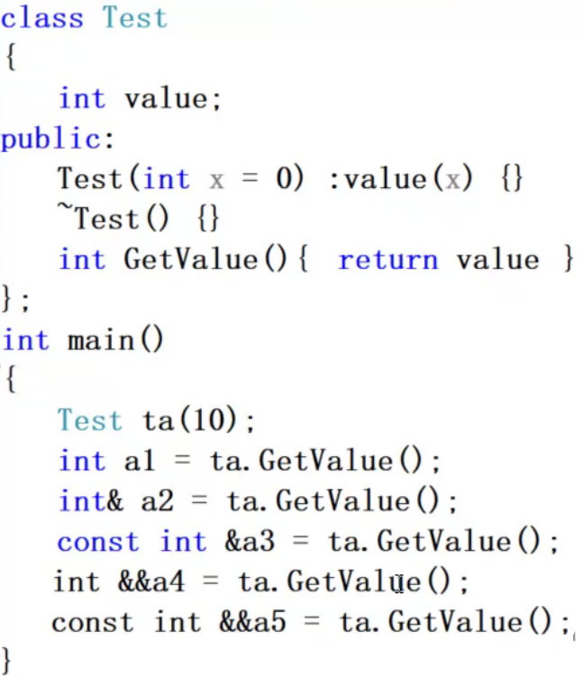
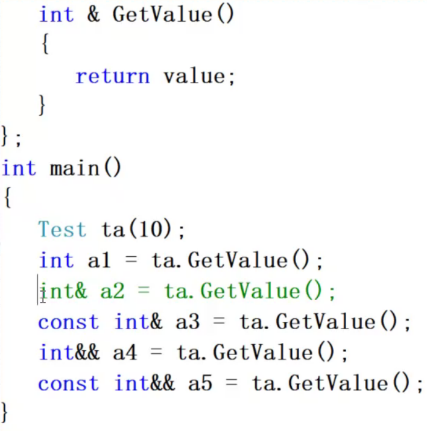
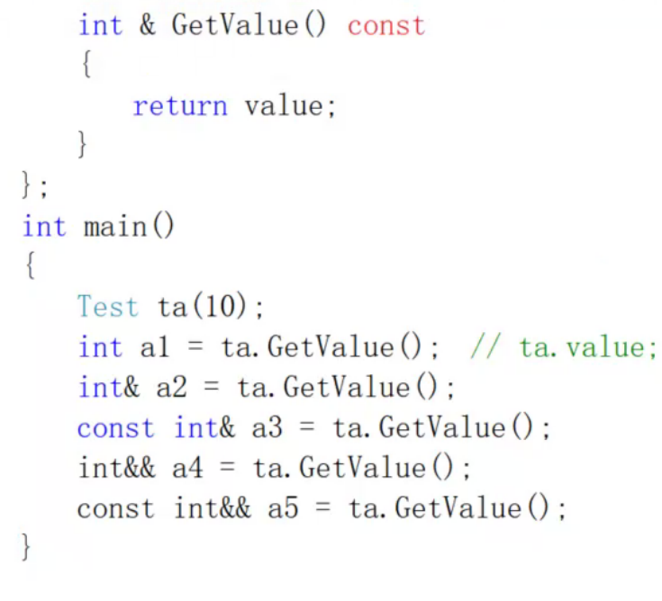

# 内容

GetValue返回的是临时变量副本，由寄存器作为传递媒介。
1. a1可以。因为调用的是public函数。但是得到的是经过寄存器赋值拿到的副本。
2. 应该不可以，因为返回值是一个将亡值，不能对其进行普通引用。
3. 猜测可以对将亡值进行常引用。
## 2

## 3

## 4

## 5

## 6

## 7

`Test ta(10)`一个Int

1. √--编译器优化，直接拷贝构造，一个Int
2. √--没产生
3. √--没产生
4. ×
5. ×
6. √--没产生
7. √--没产生
8. √--没产生
## 8

1. √
2. ×
3. √
4. ×
5. ×
6. ×
7. √
8. ×
9. √
## 9

## 10

1. √
2. √
3. √
4. b1：指针的临时量也算是一个将亡值
5. p1：√
6. p2：√
7. p3：√
8. p4：√
## 11

1. a1：√
2. a2：×
3. a3：√
4. b1：？，×，必须在b1的Int前加const
5. p1：×
6. p2：√
7. p3：×
8. p4：√