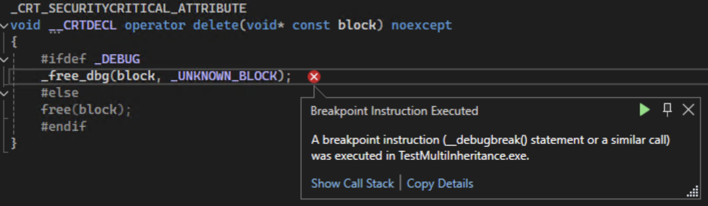

# 对象是什么

对现实事物的抽象。

面向对象的三大特征：封装、继承、多态。（有的还会加一个“抽象”）

面向对象编程：Oriented Object Programming
# 封装

具体地，Cpp的对象是基于C结构体实现的。

把函数和变量封装到一起，这就叫面向对象编程。

因此，面向对象的第一个特性就是封装性。

封装性就在于，不能直接访问对象的变量。这样的好处就是，解耦合。即使换了对象，虽然内容的细节变了，但是对外的方法都是统一的。
## 控制访问权限
那么，如何控制访问权限？就引入了访问域控制符private、public
```cpp
struct Person
{
private:
    int m_age;
public:
    int get_age(void) const
    {
        return m_age;
    }
    void set_age(int age)
    {
        m_age = age;
    }
};
int main()
{
    Person person;
    person.set_age(90);
    std::cout << person.get_age() << std::endl;
}
```
目前，给变量加了private控制，造成无法在类外进行初始化，那么就需要引入公有的构造函数。
```cpp
struct Test
{
public:
    Person(int age)
    {
        m_age = age;
    }
};
```
## class和struct的区别
1. struct默认是public
2. class默认是private
# 多态

只有指针和引用才能产生多态。
## overload - 重载 - 静态多态
overload（重载）是静态多态性。

按照**名字相同**，**参数类型**或**参数个数**的不同来决定能否重载。返回值类型不参与决策。（主要是名字要相同，一名多用，因此叫做重zhong载，即超负荷）
```cpp
{
    int val(void) const
    {
        return _val;
    }
    void val(int val)
    {
        _val = val;
    }
    void val(double val)
    {
        _val = val - 1;
    }
}
```
### 利用静多态写现代风格的get、set
```cpp
class Person
{
private:
    int m_age;
public:
    int age(void) const
    {
        return m_age;
    }
    void age(int age)
    {
        m_age = age;
    }
};
```
### 构造函数的重载
如果不提供自定义构造函数，系统会提供默认的无参数、空定义的构造函数。

析构函数不支持重载。
```cpp
class Test
{
public:
    Test(void) : _val{7}
    {
        std::cout << "Test()" << std::endl;
    }
    Test(int val) : _val{ val }
    {
        std::cout << "Test(int val)" << std::endl;
    }
};
```
#### POD类型的构造
如果类型中所有的成员都是public的，那么这个类型就叫做POD类型，全称Plain Old Data。
>在C++中，POD（Plain Old Data）类型指的是一种传统的数据结构，它的行为和布局类似于C语言中的结构体或基本数据类型。POD类型被认为是“old”的主要原因是它们代表了早期C和C++编程中常见的简单数据结构，而现代C++引入了更多复杂和强大的特性，使POD类型显得相对原始和过时。

这种类型在没有定义构造函数时，可以直接用`{ 1, 2, 3 }`这种形式进行初始化。
```cpp
class Test
{
public:
    int _val;
    int _val2;
    int _val3;
};
int main()
{
    Test test{ 1, 2, 3 };
    
}
```
### 默认值
默认值的重载要注意不能出现二义性。
比如函数有两个参数的默认值全给了，但是和无参数的函数调用冲突了。
默认值只能从右往左连续依次设置。
```cpp
class Test
{
public:
    Test(void) : _val{7}
    {
        std::cout << "Test()" << std::endl;
    }
    Test(int val, int val2 = 12) : _val{ val2 }
    {
        std::cout << "Test(int val, int val2)" << std::endl;
    }
};
int main()
{
    // (10, 12)
    Test test{ 10 };
    // (10, 11)
    Test test{ 10, 11};
}
```
### NULL和nullptr用于重载
```cpp
class Test
{
public:
    void show(int val)
    {
        std::cout << "show(int)" << std::endl;
    }
    void show(int * val)
    {
        std::cout << "show(int*)" << std::endl;
    }
};
int main()
{
    int * c_ptr      = NULL;
    int * cpp_ptr    = nullptr;
    Test test;
    test.show(c_ptr);// 走int*
    test.show(NULL); // 走int
}
```
发现，如果函数参数传入NULL，则cpp认为是整型。
因为Cpp下NULL是整数0的宏定义：
```cpp
#ifndef NULL
    #ifdef __cplusplus
        #define NULL 0
    #else
        #define NULL ((void *)0)
    #endif
#endif
```
Cpp中nullptr是C++11引入的关键字，专门用于表示空指针。类型是`std::nullptr_t`，这是一个专门的类型，可以隐式转换为任何指针类型。
nullptr解决了NULL的类型问题，更加明确和安全。
## override - 重写

1. 要重写，基类成员方法就要加virtual关键字。
2. 此后子类的virtual可以省略。
3. 重写函数必须**函数签名完全一致**。包括返回值类型。
4. 子类如果要重写方法，在`C++11`之后最好加上override关键字，这样可以帮助检查方法名、参数列表是否一致。
### 接口

接口就是定义了一套规范，但是没有具体实现。
```cpp
class IVal
{
public:
    virtual int val(void) = 0;
};
```
如上，纯虚函数，即是一个`C++`的接口。只有虚函数才有这种`= 0`的写法，普通成员函数没有。
如果一个类中有一个纯虚函数，那么这个类就是抽象类。
### 虚函数表

vfptr虚函数表指针，指向一个虚函数表，这个表是一维函数指针数组。虚函数表指针位于基类对象的前4或8个字节。
虚函数表存放于常量区或静态存储区，C++委员会未规定，编译器厂商自行决定。
#### 动态联编
虚函数表的内容由new的实际对象类型决定，和声明的类型无关。
这就叫做**动态联编**。
### 虚的析构函数

如果不给析构函数加虚的话：
```cpp
class A
{
public:
    void func() { std::cout << "call A::func" << std::endl; }
    ~A() { std::cout << "~A()" << std::endl; }
private:
    int ma;
};
class B : public A
{
public:
    void func() { std::cout << "call B::func" << std::endl; }
    ~B() { std::cout << "~B()" << std::endl; }
private:
    int mb;
};

int main()
{
    A* a = new B();
    delete a;
}
```
输出：`~A()`，子类部分内存泄漏。

而如果我们在基类的析构函数加虚了的话，A调用析构函数时，查表，则首先析构的是B，而后再来析构A自己。这样就完美地形成了A派生B，而B返回A的轮回、循环。有种递归的美感。
# 继承

## hidden - 覆盖（隐藏）
隐藏和重载都是名字相同，但隐藏强调的是父子类之间的关系。重载强调的是同一作用域的关系（在一个类中，或在同一个全局区定义的函数）。
### 成员方法的覆盖
父子类的成员方法名字相同（无论参数列表），则父类方法被隐藏（覆盖）。当调用字类对象的该名字方法时，是无法显式调用父类中被隐藏的方法的。但是也可以利用**完全限定符**进行显式调用：`child.Test::val()`

```cpp
class Test
{
public:
    Test(void) : _val{ 5 }
    {
    
    }
    ~Test(void)
    {
    
    }
    void val(int val)
    {
        _val = val;
    }
protected:
    int _val;
}
class Child : public Test
{
public:
    Child(void)
    {
    }
    ~Child(void)
    {
    }
    int val(int a, int b) const
    {
        return _val;
    }
}
void foo(void)
{
    Child child;
    std::out << child.Test::val() << std::endl;
}
int main()
{
    foo();
    return 0;
}
```
### 成员变量的覆盖
变量也可以覆盖。给Child也定义一个`_val`成员变量，调用父类的`val()`方法去观察：
```cpp
class Test
{
public:
    Test(void) : _val{ 5 }
    {
    
    }
    ~Test(void)
    {
    
    }
    void val(int val)
    {
        _val = val;
    }
protected:
    int _val;
}
class Child : public Test
{
public:
    Child(void) : _val{ 22 }
    {
    }
    ~Child(void)
    {
    }
    //int val(int a, int b) const
    //{
    //    return _val;
    //}
private:
    // hidden
    int _val;
}
void foo(void)
{
    Child child;
    std::out << child.val() << std::endl;
}
int main()
{
    foo();
    return 0;
}
// 结果为：5  -- 说明调用父类的val()方法后，返回的_val变量为父类中的_val而不是子类的。
```
现在让子类覆盖父类的`val()`方法：
```cpp
class Child : public Test
{
public:
    Child(void) : _val{ 22 }
    {
    }
    ~Child(void)
    {
    }
    int val(void) const
    {
        return _val;
    }
private:
    // hidden
    int _val;
}
void foo(void)
{
    Child child;
    std::out << child.val() << std::endl;
}
int main()
{
    foo();
    return 0;
}
// 结果为：22  -- 说明调用子类的val()方法后，返回的_val变量为子类中的_val
```
如果我们删除掉子类中`_val`变量的定义：
```cpp
class Child : public Test
{
public:
    Child(void) : // _val{ 22 }
    {
    }
    ~Child(void)
    {
    }
    int val(void) const
    {
        return _val;
    }
private:
    // int _val;
}
void foo(void)
{
    Child child;
    std::out << child.val() << std::endl;
}
int main()
{
    foo();
    return 0;
}
// 结果为：5  -- 调用子类的val()方法后，没找到子类中存在_val变量，因此返回的_val变量为父类中的_val
```
因此，总结下来就是：
1. 如果子类中定义了父类中的同名变量，而没有方法覆盖，则只能调用父类方法，是使用父类的变量。
2. 如果子类中定义了父类中的同名变量，并且定义了子类覆盖方法（父类同名方法），则使用子类的变量。
3. 如果子类没有定义父类中的同名变量，并且没有方法覆盖，则只能调用父类方法，是使用父类的变量。
4. 如果子类没有定义父类中的同名变量，而定义了子类覆盖方法（父类同名方法），则使用父类的变量。
所以：要让子类同名方法使用子类的变量而不是使用父类的同名变量，必须：既覆盖方法、又覆盖变量。
## 多重继承

如果Child继承Base、Base2，如下：
```cpp

class Base
{
public:
    Base(void)
    {
        std::cout << "Base(void)" << std::endl;
    }
    virtual ~Base()
    {
        std::cout << "~Base()" << std::endl;
    }
    virtual void show(void) const
    {
        std::cout << "Base::show(void) const" << std::endl;
    }
};
class Base2
{
public:
    Base2(void)
    {
        std::cout << "Base2(void)" << std::endl;
    }
    virtual ~Base2()
    {
        std::cout << "~Base2()" << std::endl;
    }
    virtual void show(void) const
    {
        std::cout << "Base2::show(void) const" << std::endl;
    }
};
class Child : public Base, public Base2
{
public:
    Child(void)
    {
        std::cout << "Child(void)" << std::endl;
    }
    ~Child()
    {
        std::cout << "~Child()" << std::endl;
    }
    void show(void) const
    {
        std::cout << "Child::show(void) const" << std::endl;
    }
    // 新虚方法
    virtual void newFunc()
    {
        std::cout << "Child::newFunc()" << std::endl;
    }
}
};
// 对应下边的第4条中的前半句。
int main()
{
    Child * child = new Child;
    child->show();
    delete child;
    child = nullptr;
}
// 对应下边的第4条中的后半句，讨论另外的基类是否也会更新虚方法。
int main()
{
    Base2 * base2 = new Child;
    base2->show();
    delete base2;
    base2 = nullptr;
}
// 对应下边的第5条，编译不通过，验证了不会在第二个基类的虚表增加这个派生类的新的虚函数。报错信息：newFunc is not a member of 'Base2'
int main()
{
    Base2* base2 = new Child;
    base2->newFunc();  // error
    delete base2;
    base2 = nullptr;
}
```
那么，Child就有两个同级基类。逻辑上，继承关系链变成了多维的，但是，程序编译肯定是要降维为一维顺序执行的。因此必然规定一个先后次序才行。
1. 每一条支链都可以有一个虚表指针，如果支链上有一个类有虚函数的话，那么虚表指针就在起始有虚函数的基类对象的前4或8个字节。
2. 构造基类对象的顺序按照冒号`:`后的类名顺序来定。
3. 子类重写哪个基类的方法，就相应地在哪个基类的虚表中更新。
4. 如果子类重写的方法和多个基类中的方法相同，默认在第一个基类中正常更新虚表，虚表中的内容直接指向重写的方法；在运行效果上来看，另外的基类也会更新虚方法表，表中记录的函数指针使用了adjustor thunk技术，间接地指向派生类的重写的方法。
    1. 如果多个基类有相同的虚函数，而子类没有重写该方法，那么Child指针指向Child对象在调用此方法名字时，必须指出调用的是哪个基类。
5. 如果在子类新增一个虚函数，那么，只在第一个基类的虚表更新（即在尾部写下这个派生类的新函数）。不会在第二个基类的虚表增加这个派生类的新的虚函数。
### 菱形继承的问题
Diamond

菱形继承的最大问题是数据冗余、二义性问题。
比如，学生、职工继承于人，在职学生继承于学生、职工。在默认的模型中，学生、职工对象内部都会存在人，那么对于在职学生这个角度，会看到两个人。

解决方案一是在今后的调用中均显式加上具体类来源。
解决方案二是使用virtual继承。这会使继承人中的基类对象“消失”，归属于第三层子类，原来的位置变为一个虚基表指针（vbptr，virtual base table pointer），该表记录了本类对象与虚基类对象的偏移地址。

要清楚地知道，不仅是成员变量的冗余问题，两个不同的方案会导致对象的虚表行为改变。

方案一，存在两个虚表。分别在学生中的人、职工中的人。要想调用虚函数，需要显式指出调用学生还是职工。
方案二，只存在单个虚表、共有的一个基类对象。这样的后果是，如果学生和职工都重写了人的方法，那么单个虚表又会不够用了，即出现了二义性。

两个方案都不完美，方案一的缺点在于数据冗余，方案二的缺点在于限制了多态性，即会出现二义性。

总之：
1. 要么选择：有两个基类成员，有两个虚函数表。学生、职工可以同时重写，只不过需要显式调用。但是有矛盾的双份基类数据。
2. 要么：只有一个基类成员，只有一个虚函数表。学生、职工不能同时重写基类的方法。但不需要显式调用。
### 虚继承
虚继承，会产生一个vbptr，指向一个虚基表。表中保存了虚基类在内存中的偏移信息，用于在对象内正确定位虚基类子对象。如果使用虚继承引入了一个基类，则可以确保该虚基类只被构造一次。vbptr 并非 C++ 标准的一部分，而是一些编译器（如 Microsoft Visual C++）在实现虚拟继承时采用的内部机制。
```cpp
#include<iostream>
class A
{
public:
    virtual void func() { std::cout << "call A::func" << std::endl; }
private:
    int ma;
};
class B : virtual public A
{
public:
    void func() { std::cout << "call B::func" << std::endl; }
private:
    int mb;
};
int main()
{
    A * p = new B();
    p->func();
    delete p;
    return 0;
}
```
调用func没问题，输出`call B::func`，但最终会崩溃报错：（注意，以下讨论均基于Windows VS编译器环境，据说Linux `g++`环境下delete p时p会自动偏移回B的位置导致不崩溃，待测试）

这是因为p指向的是A的起始地址（vfptr），而整个B对象在内存中的起始位置是先于A的，而delete、free的时候要看那个位置的上文记录信息。由于p的位置没有信息，那么就会释放一个不该释放的位置。

如何验证呢？发现64位下`sizeof(B)`是32，`sizeof(*p)`是16。如果最后`delete (p - 1);`即不崩溃。

>派生类对象取地址，是基类对象的起始地址。这是定律。 

```
+-----
+vbptr
+-----   ------> 正确的delete的位置
+ mb
+-----   ------> p指向的位置
+vfptr
+-----
+ ma
+-----
```
然而，更明智的做法是：只要把A的析构函数写为虚的，就能正常了：这样，delete p的时候，在调用析构时，就会去查基类（A）中的虚方法表指针，从而先去析构B，然后，再去析构A。
>对比单继承下的虚析构时delete顺序链：派生顺序A-B-C，虚析构时，delete的是A地址，但查表后先去析构C，再析构B，再析构A。

```cpp
class A
{
public:
    virtual void func() { std::cout << "call A::func" << std::endl; }
    virtual ~A() { std::cout << "~A()" << std::endl; }
private:
    int ma;
};

class B : virtual public A
{
public:
    void func() { std::cout << "call B::func" << std::endl; }
    ~B() { std::cout << "~B()" << std::endl; }
private:
    int mb;
};
```
输出：
```
call B::func
~B()
~A()
```
# 对象的本质

实际上，对象只能存储变量。方法是通过转化转移到了代码区。

要区分不同对象，需要用到this指针，因此每一个普通成员方法都有隐含的this指针参数。
比如Child类的`val()`方法实际的完整形式如下：
```cpp
class Child
{
//...
    int val(Child * const this) const
    {
        return this->_val;
    }
//...
}
```
下面是实际调用的过程：
```cpp
形式调用过程：
----------------
Child child;
child.val();
----------------
实际调用过程：
----------------------
Child child;
Child::val(&child);
----------------------
```
## 基类指针指向子类对象

### 静态联编：在编译期就确定死了
```cpp
void foo(void)
{
    Test * base = new Child;
    std::cout << base->val() << std::endl;
}
```

### 动态联编：在运行时才能确定
需要把函数放到数据中。只有数据是动态的，因此要想动态联编只能通过数据的转化。函数也有指针和地址，所以，可以通过改变函数指针的地址来进行动态转换。
```cpp

```
# 类型转换
## dynamic_cast
动态类型转换用于父子类之间切换指针类型。转换成功则返回目标指针类型，不成功则返回空。
```c++
dynamic_cast<Target Type*>(Origin Pointer)
```
1. 从子类转到基类，是上行转换（upcast）
2. 从基类转到子类，是下行转换（downcast）
3. 如果有父子类关系，上行转换肯定会成功，难点在于下行转换。
4. 下行转换，小括号中的指针或引用对应的父类必须要有虚函数。否则编译不通过。编译不通过说明小括号中的类没有虚函数。
5. 下行转换，编译通过，但运行失败了，则说明二者没有父子关系，失败的情况：
    1. 如果下行转换指针，失败则返回空指针，需要通过判断是否为空来判断是否转换成功。
    2. 如果下行转换引用，失败无法返回空引用，只能抛出异常，异常信息是：bad dynamic cast，需要通过异常处理来判断是否成功。

```cpp
class Base
{
public:
    Base()
    {
        std::cout << "Base()" << std::endl;
    }
    virtual ~Base()
    {
        std::cout << "~Base()" << std::endl;
    }
    virtual void show() const
    {
        std::cout << "Base::show()" << std::endl;
    }
};
class Child : public Base
{
public:
    Child()
    {
        std::cout << "Child()" << std::endl;
    }
    ~Child()
    {
        std::cout << "~Child()" << std::endl;
    }
    void show() const
    {
        std::cout << "Child::show()" << std::endl;
    }
};
class Other
{
public:
    void show() const
    {
        std::cout << "Other::show()" << std::endl;
    }
};
// Upcast
// output: Child::show()
int main()
{
    Child* child = new Child;
    Base* base = dynamic_cast<Base*>(child);
    if (base)
    {
        base->show();
        delete base;
        base = nullptr;
    }
    child = nullptr;
}
// Downcast - success
// output: Child::show()
int main()
{
    Base* base = new Child;
    Child* child = dynamic_cast<Child*>(base);
    if (child)
    {
        child->show();
        delete child;
        child = nullptr;
    }
    base = nullptr;
}
// Downcast - error_pointer
// output: Downcast error
int main()
{
    Base* base = new Child;
    Other* other = dynamic_cast<Other*>(base);
    if (other)
    {
        other->show();
        delete other;
        other = nullptr;
    }
    else
    {
        std::cout << "Downcast error" << std::endl;
        delete base;
        base = nullptr;
    }
}
// Downcast - error_reference
// output: Bad dynamic_cast!
int main()
{
    Child child;
    Base& base = child;
    try
    {
        Other& other = dynamic_cast<Other&>(base);
    }
    catch (const std::exception& e)
    {
        std::cout << e.what() << std::endl;
    }
}
```
## static_cast
通俗来说，是复制一个老的值，创建一个新的值。
1. 支持基础普通类型的转换。也可以类实体之间的、父子类指针（引用）之间的转换。
2. 实体之间的转换，实际上是按小括号里的实体复制了一份新的实体。
3. 父子类指针（引用）之间的上下转换，只要有父子关系，都能转换成功。不依赖虚函数表。
    1. 但是，下行转换是强行解释的，因为子指针指向了父对象。
4. 不支持指针和实体之间的转换。支持实体转到引用。
```c++
static_cast<Target Type*>(Origin Pointer)
static_cast<Basic Type>(Basic Type)
```

```cpp
int main()
{
    double d = 15.2;
    auto f = static_cast<float>(d);
}
```

```cpp
class Base
{
public:
    Base()
    {
        std::cout << "Child()" << std::endl;
    }
    virtual ~Base()
    {
        std::cout << "~Base()" << std::endl;
    }
    virtual void show() const
    {
        std::cout << "Base::show()" << std::endl;
    }
};
class Child : public Base
{
public:
    Child()
    {
        std::cout << "Child()" << std::endl;
    }
    ~Child()
    {
        std::cout << "~Child()" << std::endl;
    }
    void show() const
    {
        std::cout << "Child::show()" << std::endl;
    }
};
int main()
{
    Base  * base  = new Child;
    Child * child = static_cast<Child*>(base);
    if (child)
    {
        child->show();
    }
    delete child;
    child = nullptr;
    base = nullptr;
}
```
## reinterpret_cast
用于指针重新解释一个值或对象。
1. 可以两个指针（引用）之间，或值和指针（引用）之间进行转换。
    1. 值和指针（引用）之间进行转换目的是为了把值当作地址用。
2. 基础类型之间不能转换
3. 编译器没有安全检查，正确性由程序员把握。

```cpp
reinterpret_cast<Target Type*>(Origin Pointer)
reinterpret_cast<Target Type*>(Origin Value)
reinterpret_cast<Target Type>(Origin Pointer)
```
## const_cast
1. 主要用于指针引用一个去掉常性的变量，强调对其进行修改。
    1. 也可以用于指针引用一个加上常性的变量，强调不对其进行修改。但是其实没必要，直接在前面指针声明的时候加const就行。
2. 只能进行指针（引用）之间的转换。

```cpp
const_cast<Target Type*>(Origin Pointer)
```

```cpp
int main()
{
    int         a = 123;
    int const * p = &a;

    *p                   = 222;  // error
    *const_cast<int*>(p) = 222;
}
```
既然规定了const，为什么还要给`const_cast`机制？这是为了让程序员有修改const变量的权限。这个显式的机制是为了让程序员保证他们不是在误操作修改。
```cpp
class Base
{
public:
    Base()
    {
        std::cout << "Child()" << std::endl;
    }
    virtual ~Base()
    {
        std::cout << "~Base()" << std::endl;
    }
    virtual void show() /* const */
    {
        std::cout << "Base::show()" << std::endl;
    }
};
class Child : public Base
{
public:
    Child()
    {
        std::cout << "Child()" << std::endl;
    }
    ~Child()
    {
        std::cout << "~Child()" << std::endl;
    }
    void show() /* const */
    {
        std::cout << "Child::show()" << std::endl;
    }
};
int main()
{
    Base const * base = new base;
    base->show();  // error
    const_cast<Base*>(base)->show();
    delete base;
    base = nullptr;
}
```
如上，常对象不能调用非常方法。
解决办法：
1. 修改非常方法为常方法
2. 用`const_cast`临时转换base的类型为非常类型。虽然可能违背了原本的设计，但是这是一种特殊情况下的权限。
## 总结
1. dynamic是唯一必须有虚函数表的
2. static是唯一支持两个基础类型转换的
3. reinterpret可以转换各种指针，包括可以把值和指针互转，但是必须要有一个指针参与。
4. const只能转换指针（引用）。