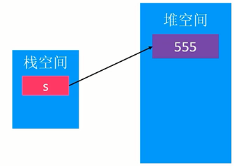
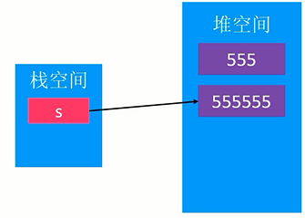
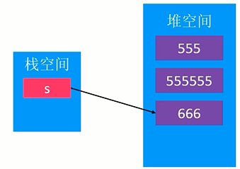
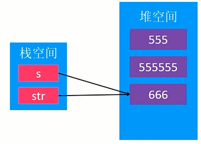
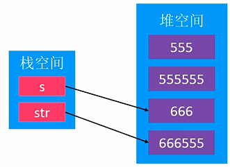
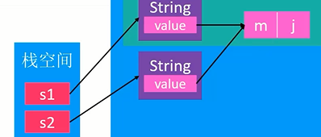
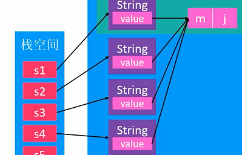

# 字符串

1. Java的字符串是在`java.lang`包中，所以可以直接使用，无需引包。
2. Java 8之前的String是用char数组实现的。即`"abc"`的底层实现为`{'a', 'b', 'c'}`。
3. 从Java 9开始，改为使用byte数组实现。
4. 字符串字面量实际是String类的实例（相当于自动给你new了一个String，假设为s1，但是如果第二次用这个字面量初始化s2的话，就不会重新new了，而是直接把s1的对象引用给s2，详见[`==`](#`==`)）。
5. String对象一旦创建完毕，该对象内部其中的字符内容不可以修改。
    1. 但是String对象指针的指向可以更改。

# 内存位置
```java
public class Main
{
    public static void main(String[] args)
    {
        String s = "555";
        s += "555";
        s = "666";
        test(s);
        System.out.println(s);
    }
    static void test(String str)
    {
        //str += "555";
        str = str + "555";
    }
}
```

String字符串都是new出来的，因此都是在堆空间中。











# 字符串常量池 (String Constant Pool, SCP)

1. 字符串常量池。是指：从Java 7开始，属于堆空间的一部分。（以前是放在方法区中的）
2. 遇到字符串字面量时，会去查SCP。
    1. 如果SCP中匹配到与该字面量内容一致的字符串对象A时，则返回A。
    2. 否则创建一个新的对象D，加入到SCP中，返回D。
```java
String s1 = "xcg";
String s2 = "xcg";
System.out.println(s1 == s2);
```

```java
String s1 = "xcg";
String s2 = new String("xcg");
String s3 = new String(s1);
String s4 = new String(s2);
char[] cs = {'x', 'c', 'g'};
String s5 = new String(cs); //用char数组new String
String s6 = new String(s5); 
System.out.println(s1 == s2);
```

传入常量字符串的new底层：
```java
new String("xcg");
----------------------
public String(String original)
{
    this.value = original.value;
    this.hash = original.hash;
}
```
`"xcg"`的底层空间是只有一份的，在SCP中。而`new String("xcg")`本质上只是新创建了一个String对象，value的拷贝只是把旧地址给了新String中的value指针。即两个value数组是同一个地址的数组。这属于浅拷贝。

因此，`s1`到`s4`只是String对象地址不同，但是，内部的value数组是同一个。


传入字符数组的new底层：
```java
char[] cs = {'x', 'c', 'g'};
new String(cs);
---------------------------------
public String(char value[])
{
    this.value = Arrays.copyOf(value, value.length);
}
---------------------------------
public static char[] copyOf(char[] original, int newLength)
{
    char[] copy = new char[newLength];
    System.arraycopy(original, 0, copy, 0,
                    Math.min(original.length, newLength));
    return copy;
}
```
可以看到，用字符数组去new一个String的话，底层要深拷贝一个数组，即产生一个新数组的地址赋给String对象内部的value指针。

# intern方法

```java
public native String intern();
```
被native关键字修饰，代表不是用Java编写的，可能是C语言。返回一个字符串。

作用是：如果SCP中存在一个与B内容一样的字符串对象A，则返回A；**否则，将B加入到SCP中**，返回B。

看下面的代码：
```java
public class static void main(String[] args)
{
    int a = 1, b = 2, c = 3;
    String s1 = String.format("%d%d%d", a, b, c);
    String s2 = String.format("%d%d%d", a, b, c);
    System.out.println(s1 == s2);  // false
    
    String s3 = s1.intern();
    String s4 = s2.intern();
    System.out.println(s1 == s3);  // true     - intern 第一次调用
    System.out.println(s1 == s4);  // true ??? - intern 第二次调用
    
    String s5 = "123";
    System.out.println(s1 == s5);  // true
    
}
```
s1不等于s2，因为通过format生成的字符串不是字符串常量！因此，s1和s2指向的字符数组不是字符串常量池中的变量。

去SCP观察有没有重复串的情况**仅限于**涉及到字符串字面量的情况，或者用另一个字符串对象直接构造新的。或者：直接调用String类的intern方法，这是手动去观察SCP有无重复串。但是要记住了，intern有一个隐形操作：”**否则，将B加入到SCP中**“！
因此，在s1调用了intern之后，s1的内容`"123"`就放入了常量池中。一旦intern被调用过一次，那么之后s2的intern返回的就是常量池中的地址了。
因此，`s3==s4`。
至于s5，因为是用字符串字面量初始化的，所以隐形调用了intern，所以实际指向的也是s1的value地址。
我们可以推测出，两个字符串直接`==`判断是去判断内部成员的value地址是否一样。即判断是否是浅拷贝。
# 字符串常用方法

## 去除左右空格 - trim

去除首左、尾右的空格
```java
" 123  456  ".trim() // -> 123  456
```
## contains

是否包含目标串（字符串匹配）
```java
"123456".contains("34")
```
## split

将字符串按照分隔符分割为数组
```java
"1_2_3_4".split("_") // -> [1, 2, 3, 4]
```

## compareTo

挨个比较大小
```java
"abc".compareTo("adc")
```

## equals

查看内容是否相等
```java
String s1 = "abc";
String s2 = new String("abc");
s1.equals(s2);
```
## `==`

如果直接用`s1 == s2`去比较字符串，则变成了引用之间的比较。则是去比较的是两个字符串对象的内存地址。
```java
public class Test
{
    public static void main(String[] args)
    {
        String s1 = "123";
        String s2 = "123";
        String s3 = new String("123");
        System.out.println(s1 == s2); // true
        System.out.println(s1 == s3); // false
    }
}
```

## 截取子串 - subString

截取`beginIndex`及之后的，`endIndex`之前的串。左闭右开。
```java
int beginIndex = 2;
int endIndex = 5;
"xcg123go".subString(beginIndex);           // g123go
"xcg123go".subString(beginIndex, endIndex); // g12
```
## 替换目标串 - replace

```java
"xcg123go".replace("123", "Never"); // xcgNervergo
```
# StringBuilder

与String相比，共同点是都实现了CharSequence接口。

在进行字符串频繁的改动时（拼接、替换等），使用StringBuilder。

```java
StringBuilder sb = new StringBuilder();
sb.append("123");
sb.append("456");
```
## 常用方法

append, insert, delete, replace, reverse

## append原理

StringBuilder的底层是也是一个`value = new char[n];`的字符数组。
与String的不同是，这个字符数组有预留空间，记录length来标记数组中有效结尾。
当空间满时，动态扩容。