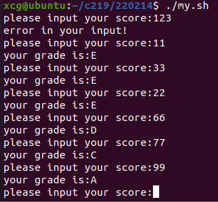

# 内容

1. 编译型语言
2. 解释器
3. 变量：本地变量、环境变量、参数变量
4. 条件：字符串判断、算术、文件测试
5. 控制结构：循环、case
6. 函数
7. 脚本调用脚本，c语言调用脚本
8. awk，sed
# 环境变量

| 类型     | 语法                       | 注意点                               |
| ------ | ------------------------ | --------------------------------- |
| 赋值     | `var=value`              | 不能有空格                             |
| 引用     | `$var`                   | 用双引号包裹是读var的值，用单引号包裹是`$var`这4个字符。 |
| 删除     | unset var                | 不要加`$`符                           |
| 输入     | read `var1` `var2` `...` | 按顺序写入变量，类似于scanf，以回车或者空格分隔        |
| 列出所有变量 | set                      |                                   |
| 全局化变量  | export var               |                                   |
## 特殊变量

都需要搭配`$`使用

| 特殊变量    | 定义           | 注意点                              |
| ------- | ------------ | -------------------------------- |
| ?       | 前一命令的退出状态    | 0代表成功、真；其他非0数代表失败、假的某一状态         |
| $       | 当前Shell的进程ID | echo `$$`才能输出                    |
| !       | 后台运行命令的进程ID  |                                  |
| `1 ~ 9` | 当前脚本的第1到9个参数 |                                  |
| `_`     | 上一个命令的最后一个参数 | 比如在命令行敲入`ls -a`，则echo `$_`输出`-a` |
| PS1     | Shell主提示符    |                                  |
| PS2     | Shell次提示符    |                                  |
## 字符串处理

1. 注意双引号、单引号的功能，双引号引起主要是为了消除空格的影响，保留转义效果；而单引号是把所引的内容**原封不动地**保留。

```sh
a="xcg"
str="$a"	#把a的值赋给了str
echo "$str" #实际输出: xcg

str='$a'	#把"$a"这个 原本的字符串 赋给了str
echo "$str"	#实际输出: $a
```

2. 如果想把某一个命令的运行结果作为字符串返回给str，则有两种方式。
    1. $( )

```sh
str=$(ls)	#把当前目录的文件信息字符串赋给str
```

    2. 反引号

```sh
str=`ls`	##把当前目录的文件信息字符串赋给str
```
## export
在当前shell可以再启动一个shell。如果我们在之前的shell中定义了局部变量，比如`var=hello`，在新启动的shell是看不到的。如果要新shell看到，需要`export var`。
其实新开的这个shell是在之前的shell新运行的一个程序。他俩是不同的进程。同理，如果想让其他进程也能看到之前shell的环境变量，此时就需要export。
# 循环

## 要注意的是对计数变量的处理

有2种方式：

1. let

```sh
i=1
let "i+=1"
```

2. (( ))，双括号中是想要执行的命令/表达式，可以用$取表达式的值。

```sh
i=1
a=$((i++))
```

3. 反引号\`expr ...\`

```sh
i=1
a=`expr $i \* 2`	#*在脚本中有其他意义，需要加\转义为'*'，在此表示乘号
i=`expr $i + 1`		#此方式i自增的方法
```

## for

for循环的次数由in后面值的数目决定

```sh
for i in 1 2 3
do
	echo i=$i
	sleep 1
done

for name in $(ls)
do
	echo "filename: $name"
done
```

## while

判断条件，满足则循环执行。

```sh
#死循环示例
while [ 1 ]
do
	echo "run"
	sleep 1
done
#死循环输出输入的内容，直到输入end
while true
do
	echo "input"
	read line
	if [ "$line" = end ]
	then
		break
	fi
	echo "line=$line"
done
#输出0-9
while [ "$i" -lt 10 ]
do
	echo "i=$i"
	#let "i+=1"
	#((++i))
	i=`expr $i + 1`
done
```

## until

条件没满足时，循环执行；一旦条件满足则退出。

```sh
#本地找file.txt文件，隔一秒找一遍，直到找到，退出。
until [ -f file.txt ]
do
	echo "not find file.txt"
	sleep 1
done
echo "find file.txt"
```

# read

 read命令 -n(不换行) -p(提示语句) -n(字符个数)-t(等待时间) -s(不回显)

# case

```sh
while true
do
    echo "input:"
    read line
    case "$line" in
        yes | Y) 	echo "this is yes";;
        no	| N)	echo "this is no";;
        end)		break;;
        *)			echo "$line";;
    esac
done
#可以搭配正则表达式使用。
read line
case "$line" in
    [Yy][Ee][Ss] | [Yy])echo "this is yes";;
    [Nn][Oo] | [Nn])	echo "this is no";;
    end)				break;;
    *)					echo "$line";;
esac
```

## 正则表达式

上面case的示例中

```sh
[][][]代表三个字符。
[]代表一个字符。
[]里可以填正则表达式。
1.[a-z]表示一个小写的a到z均可
2.[abcde]表示一个字符的可取范围
```

# 函数

三个问题：1、如何传参的问题；2、函数返回值如何获得；3、如何看待函数内定义的变量

## 特点

1. shell脚本中的函数没有声明，需要直接定义在最前面。
2. 调用函数不用加圆括号，而是只有函数名

```sh
fun()
{
	echo "fun run"
}
fun
```

## 参数

注意`$#/$1/$2`在函数中、函数外的区别：在函数中代表函数的参数；而在函数外代表此shell脚本的参数。

```sh
fun()
{
	echo "fun run"
	echo "fun: \$#=$#"	# "$#"代表参数个数
	echo "fun: \$1=$1"	# "$1"表示该函数的第一个参数
	echo "fun: \$2=$2"
}
fun hello 123
#此处就要注意与上面函数中$#/$1/$2的区别了，在函数中代表函数的参数；而在函数外代表此shell脚本的参数。
echo "my.sh: \$#=$#"
echo "my.sh: \$1=$1"
echo "my.sh: \$2=$2"

# 在外部执行脚本时：
# ./my.sh xcg test
	# 输出:
        # fun: $#=2
        # fun: $1=hello
        # fun: $2=123
        # my.sh: $#=2
        # my.sh: $1=xcg
        # my.sh: $2=test
```

## 返回值

```sh
my_add()
{
	if [ "$#" -ne 2 ]	# -ne : not equal
	then
		echo "参数有误"
		return 0
	fi
	res=`expr $1 + $2`
	return $res
}
res=my_add
echo "$res"
# 或者写为
	# my_add
	# echo "$?"
		# "$?"代表上一行语句执行的结果(返回值)。
# 如果想保存返回值，可以：
	# my_add 123 234
	# result=$?
		# 如果连续写两行"$?"，则第二行的结果是0，因为"$?"的执行结果是0，代表执行成功。
```

## 变量生存期问题

函数中的变量可能污染到函数外

```sh
my_test()
{
	str=hello
	echo "my_test:str=$str"
}
my_test
echo "str=$str"
# 打印结果
	# my_test:str=hello
	# str=hello
# 由此可见，函数中的变量污染到了函数外。
```

此问题的原因：
脚本程序的概念并不存在作用域的概念。所以，函数中定义、赋值str语句**执行**后，不管是函数中，还是bash解释器，也就都存在str这个变量。

```sh
my_test()
{
	str=hello
	echo "my_test:str=$str"
}
test2()
{
	echo "test2:str=$str"
}
my_test
echo "str=$str"
test2
# 执行结果
	# my_test:str=hello
	# str=hello
	# test2:str=hello
```

```sh
my_test()
{
	str=hello
	echo "my_test:str=$str"
}
test2()
{
	echo "test2:str=$str"
}

echo "str=$str"
test2
my_test
# 执行结果
	# str=
	# test2:str=
	# my_test:str=hello
# 在执行my_test前，还没有str变量给出，所以，test2和函数外的str都打印为空
```

### 解决变量污染的方法

> 1、可以通过unset在用完变量后，销毁之。

```sh
my_test()
{
	str=hello
	echo "my_test:str=$str"
	unset str
}
my_test
echo "str=$str"
# 执行结果
	# my_test:str=hello
	# str=
```

> 2、可以在变量名前加local

```sh
str="abcdef"
my_test()
{
	local str=hello
	echo "my_test:str=$str"
}
my_test
echo "str=$str"
# 执行结果
	# my_test:str=hello
	# str=abcdef
```

> 注意事项：unset对于local变量，只会局部地销毁这个变量，不影响全局的同名变量。

```sh
#################### 程序1
str="abcdef"
my_test()
{
	local str=hello
	echo "my_test:str=$str"
	unset str
}
my_test
echo "str=$str"
# 执行结果
	# my_test:str=hello
	# str=abcdef

#################### 程序2
str="abcdef"
my_test()
{
	str=hello
	echo "my_test:str=$str"
	unset str
}
my_test
echo "str=$str"
# 执行结果
	# my_test:str=hello
	# str=
```

# 脚本间的调用

```sh
###################### b.sh
#!/usr/bin/bash
echo "b.sh run pid=$$"	# "$$"代表本bash脚本的pid
./d.sh
exit 0
###################### d.sh
#!/usr/bin/bash
echo "d.sh run pid=$$"	# "$$"代表本bash脚本的pid
exit 0
###################### 外部执行: ./b.sh
###################### 执行结果:
        # b.sh run pid=5346
        # d.sh run pid=5347
```

### 脚本间变量的传递问题

```sh
###################### b.sh
#!/usr/bin/bash
echo "b.sh run pid=$$"	# "$$"代表本bash脚本的pid
mystr=hello
echo "b.sh mystr=$mystr"
./d.sh
exit 0
###################### d.sh
#!/usr/bin/bash
echo "d.sh run pid=$$"	# "$$"代表本bash脚本的pid
echo "d.sh mystr=$mystr"
exit 0
###################### 外部执行: ./b.sh
###################### 执行结果:
        # b.sh run pid=5368
        # b.sh mystr=hello
        # d.sh run pid=5369
        # d.sh mystr=
# 注意，此时d.sh没有打印出来b.sh中的mystr，说明两个脚本程序各自运行在不同的进程空间内，变量互不污染。
```

为了在脚本间可以传递变量，可有以下方式

> 1、在一个sh中调用另一个sh时，后面加参数。但是只是能拿到值，变量名字不能通用，需要用“$1”来取出。

```sh
###################### b.sh
#!/usr/bin/bash
echo "b.sh run pid=$$"
mystr=hello
echo "b.sh mystr=$mystr"
./d.sh $mystr			#!!! 后面加参数
exit 0
###################### d.sh
#!/usr/bin/bash
echo "d.sh run pid=$$"
echo "d.sh mystr=$1"	#!!! 需要用“$1”来取出
exit 0
###################### 外部执行: ./b.sh
###################### 执行结果:
        # b.sh run pid=5380
        # b.sh mystr=hello
        # d.sh run pid=5381
        # d.sh mystr=hello
```

> 2、如果想要变量名字通用，可以export改变mystr为环境变量，因为环境变量可以被继承，所以让变量名字通用了。

```sh
##################### b.sh
#!/usr/bin/bash
echo "b.sh run pid=$$"
mystr=hello
export mystr			#export改变mystr为环境变量
echo "b.sh mystr=$mystr"
./d.sh
exit 0
###################### d.sh
#!/usr/bin/bash
echo "d.sh run pid=$$"
echo "d.sh mystr=$mystr"
exit 0
###################### 外部执行: ./b.sh
###################### 执行结果:
        # b.sh run pid=5380
        # b.sh mystr=hello
        # d.sh run pid=5381
        # d.sh mystr=hello
```

> 3、通过source。source的作用是在调用另一个脚本时，不启动另外的sh，而是在自身的解释器中去运行另一个脚本的命令。相当于内联展开于此，所以原来的变量可以复用。但是问题的隐患很多，因为调用的脚本会对原来的脚本造就的环境造成影响。

```sh
##################### b.sh
#!/usr/bin/bash
echo "b.sh run pid=$$"
mystr=hello
echo "b.sh mystr=$mystr"
. ./d.sh	# 前面的“.+空格”中的“.”即代表source
# source ./d.sh
exit 0
###################### d.sh
#!/usr/bin/bash
echo "d.sh run pid=$$"
echo "d.sh mystr=$mystr"
exit 0
###################### 外部执行: ./b.sh
###################### 执行结果: !!!发现pid一样！
        # b.sh run pid=5448
        # b.sh mystr=hello
        # d.sh run pid=5448
        # d.sh mystr=hello
```

source的作用：有时需要对当前的bash进行环境变量的初始化，可以用source(. ./xx.sh)来在本sh直接运行提前写好的配置脚本。

# C程序和脚本间的调用

脚本调用C程序显而易见。

我们讨论C程序调用脚本。

```sh
#!/usr/bin/bash
echo "my.sh pid=$$"
mystr="hello^_^"
echo "mystr=$mystr"
exit 0

```

```c
#include<stdio.h>
#include<stdlib.h>
#include<unistd.h>
#include<string.h>
int main()
{
    printf("main pid=%d\n",getpid());
    execl("./my.sh","my.sh",(char*)0);
    printf("execl err\n");
    exit(0);
}
// 执行结果
	// main pid=5607
	// my.sh pid=5607
	// mystr=hello^_^
// 为什么pid一样呢？因为在main函数中exec了自身。
```

表面上启动的是my.sh，实际上启动的是/usr/bin/bash。

# 练习

* 从键盘读取一个成绩，0~100之外的不可以。把整数值转为等级A、B、C、D。

| 成绩  | 等级 |
| ----- | ---- |
| >= 90 | A    |
| >= 80 | B    |
| >= 70 | C    |
| >= 60 | D    |
| < 60  | E    |

```sh
#!/usr/bin/bash

while [ 1 ]; do
  printf 'please input your score:'
  read score
  if [ $score -ge 0 ] && [ $score -le 100 ]
  then
    grade=$(($score/10))
    #echo $grade
    printf 'your grade is:'
    case $grade in
      9 | 10 ) echo "A";;
      8 ) echo "B";;
      7 ) echo "C";;
      6 ) echo "D";;
      * ) echo "E";;
    esac
  else
    echo "error in your input!"
  fi
done

exit 0
```

测试结果：



* 第一题的优化

```bash
#!/usr/bin/bash
printf '输入你的成绩：'
read score
case $score in
    [0-9] | [1-9][0-9] | 100)
        grade=$(($score/10))
        #echo $grade
        printf "你的成绩是$score，等级："
        case $grade in
            9 | 10 ) echo "优";;
            8 ) echo "良";;
            7 ) echo "中";;
            6 ) echo "及格";;
            * ) echo "不及格";;
        esac;;
    *) echo "error in your input!";;
esac
exit 0
```

* 循环接收用户输入的学生成绩（百分制），若成绩小于60，输出“不及格”；若成绩大于等于60，输出“及格”，按Q(q)键退出。

```bash
#!/bin/bash
while true
do
    read -p "输入成绩：" score
    case $score in
        [Qq]) exit;;
        [0-9] | [1-5][0-9]) echo "不及格";;
        100 | [6-9][0-9])   echo "及格";;
        *)  echo "不合法，请输入0~100";;
    esac
done
```

* 循环接收某门课程的成绩，计算用户已输入的最高分、最低分、平均分，按P(p)键输出计算结果，按Q(q)键退出。

```bash
#!/bin/bash
min=100
max=0
sum=0
count=0
while true
do
    read -p "输入分数：" score
    case $score in
        [0-9] | [1-9][0-9] | 100)
            echo "$score 已录入"
            sum=$(($sum+$score))
            count=$(($count+1))
            if [ $score -gt $max ]
            then max=$score
            fi
            if [ $score -lt $min ]
            then min=$score
            fi;;
        [Pp])
            echo "max = $max"
            echo "min = $min"
            echo "avg = $(($sum/$count))"
            continue;;
        [Qq])   exit;;
        *)      echo "$score 不合法，请重新输入。"
    esac
done
```


# 注意

例：输入一个正整数，判断其是否为质数。正确的程序如下：

```bash
#!/bin/bash

read -p "请输入一个正整数：" number
[ $number -eq 1 ] && echo "$number 不是质数" && exit
for i in `seq 2 $(($number-1))`
do
    [ $[$number % $i] -eq 0 ] && echo "$number不是质数" $$ exit
done
echo "$number是质数" && exit
# 正确的测试结果：
# 	输入 1
# 	输出 1不是质数
# 正确的测试结果：
# 	输入 7
# 	输出 7是质数
```

其中，判断语句如[ \$number -eq 1 ]必须在首尾中括号之间有空格，不然找不到命令。如下是错误的。

```bash
read -p "请输入一个正整数：" number
[$number -eq 1] && echo "$number 不是质数" && exit	#错误
for i in `seq 2 $(($number-1))`
do
    [$[$number % $i] -eq 0] && echo "$number不是质数" $$ exit #错误
done
echo "$number是质数" && exit
# 测试：
# 	输入 1
# 	输出 ./zhishu.sh: line 4: [1: command not found
# 		 1是质数
# 测试：
# 	输入 7
# 	输出 ./zhishu.sh: line 7: [1: command not found
#		./zhishu.sh: line 7: [1: command not found
#		./zhishu.sh: line 7: [3: command not found
#		./zhishu.sh: line 7: [2: command not found
#		./zhishu.sh: line 7: [1: command not found
#		7是质数
```

