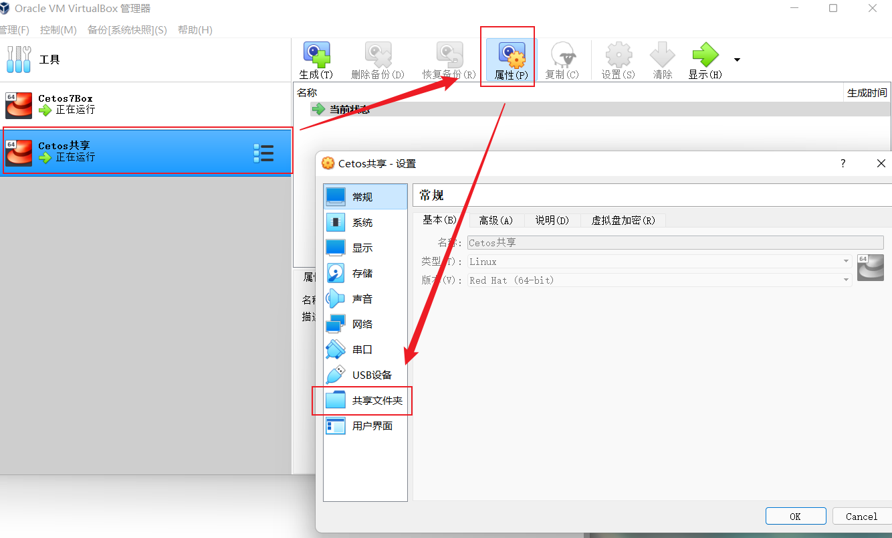
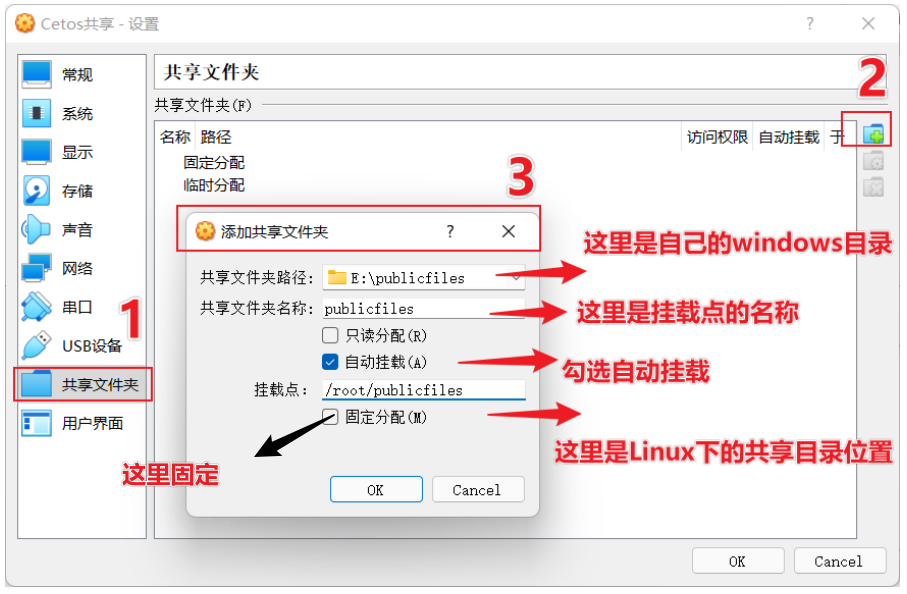

参考：https://blog.csdn.net/qq_33827423/article/details/126019729

1. 在Windows下创建一个文件夹方便作为一个**共享目录**，目录名随意，但尽量方便自己辨识。
2. VirtualBox虚拟机共享文件夹的设置：
   1. 选中需要建立共享的虚拟机并打开`设置-共享文件夹`
      
   2. 添加共享文件夹
      
