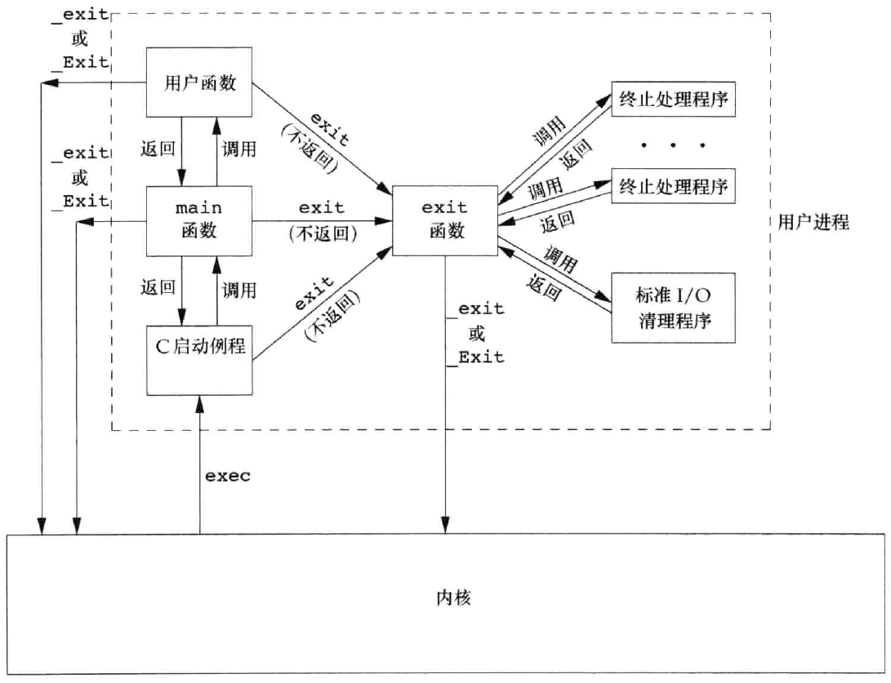
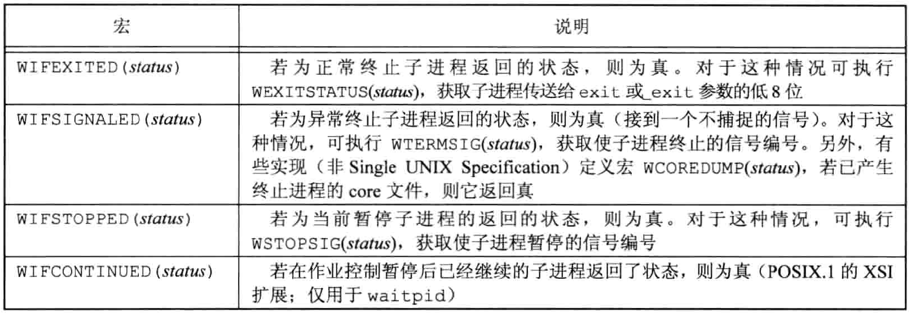
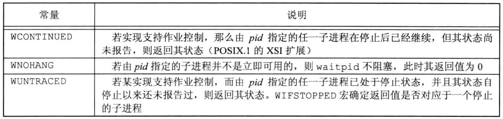
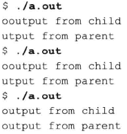

# 内容

1. 
2. `exit`
3. 僵死进程

# 进程终止方式



## 进程5种正常终止方式

1. 从main返回，即在main函数内执行`return`语句，等效于调用`exit`。
2. 调用`exit`函数。此函数由`ISO C`定义，其操作包括调用各终止处理程序（终止处理程序在调用`atexit`函数时登记），然后关闭所有标准I/O流等。因为`ISO C`并不处理文件描述符、多进程（父进程和子进程）以及作业控制，所以这一定义对UNIX系统而言是不完整的。
3. 调用`_exit`或`_Exit`函数。`ISO C`定义`_Exit`，其目的是为进程提供一种无需运行终止处理程序或信号处理程序而终止的方法。对标准I/O流是否进行冲洗取决于实现方式。在UNIX系统中，`_Exit`和`_exit`是同义的，并不冲洗标准I/O流。`_exit`函数由`exit`调用，它处理UNIX系统特定的细节。`_exit`是由`POSIX.1`说明的。

   > 在大多数UNIX系统实现中，`exit(3)`是标准C库中的一个函数，而`_exit(2)`则是一个系统调用。
4. 最后一个线程从其启动例程返回中执行return语句。但是该线程的返回值不用作进程的返回值。当最后一个线程从其启动例程返回时，该进程以终止状态0返回。
5. 从最后一个线程调用`pthread_exit`函数。如同前面一样，在这种情况中，进程终止状态总是0，这与传送给`pthread_exit`的参数无关。

## 进程3种异常终止方式

1. 调用abort。产生`SIGABRT`信号，这是下一种异常终止的一种特例。
2. 当进程接收到某些信号时。信号可由进程自身（如调用`abort`函数）、其他进程或内核产生。例如，若进程引用地址空间之外的存储单元、或者除以0，内核就会为该进程产生相应的信号。
3. 最后一个线程对取消(cancellation)请求做出响应。默认情况下，“取消”以延迟方式发生：一个线程要求取消另一个线程，若干时间之后，目标线程终止。

## 总结

不管进程如何终止，最后都会执行内核中的同一段代码。这段代码为相应进程关闭所有打开描述符，释放它所使用的存储器等。

对上述任意一种终止情形，我们都希望终止进程能够通知其父进程它是如何终止的。对于3个终止函数(`exit`、`_exit`和`_Exit`)，实现这一点的方法是将其退出状态(`exit status`)作为参数传送给函数。在异常终止情况，内核(不是进程本身)产生一个指示其异常终止原因的终止状态(`termination status`)。在任意一种情况下，该终止进程的父进程都能用`wait`或`waitpid`函数取得其终止状态。

注意，这里使用了“**退出状态**”(它是传递给向3个终止函数的参数，或`main`的返回值)和“**终止状态**”两个术语，以表示有所区别。在最后调用`_exit`时，内核将退出状态转换成终止状态。

父进程检查子进程终止状态的方法有很多。如果子进程正常终止，则父进程可以获得子进程的退出状态。

# 父子进程终止问题

## 孤儿进程

在说明`fork`函数时，显而易见，子进程是在父进程调用fork后生成的。上面又说明了子进程将其终止状态返回给父进程。但是如果父进程在子进程之前终止，又将如何呢？其回答是：

如果某进程的父进程已经终止，它们的父进程都改变为`init`进程。我们称这些进程由`init`进程收养。其操作过程大致是：在一个进程终止时，内核逐个检查所有活动进程，以判断它是否是正要终止进程的子进程，如果是，则更改该进程的父进程ID为1 (`init`进程的ID)。这种处理方法保证了每个进程有一个父进程。

## 僵死进程

另一个我们关心的情况是，如果子进程在父进程之前终止，那么父进程又如何能在做相应检查时得到子进程的终止状态呢？如果子进程完全消失了，父进程在最终准备好检查子进程是否终止时是无法获取它的终止状态的。内核为每个终止子进程保存了一定量的信息，所以当终止进程的父进程调用`wait`或`waitpid`时可以得到这些信息。这些信息至少包括进程ID、该进程的终止状态以及该进程使用的CPU时间总量。

内核可以释放终止进程所使用的所有存储区，关闭其所有打开文件。在UNIX术语中，一个已经终止、但是其父进程尚未对其进行善后处理(获取终止子进程的有关信息、释放它仍占用的资源)的进程被称为**僵死进程(zombie)**。`ps(1)`命令将僵死进程的状态打印为`Z`。如果编写一个长期运行的程序，它fork了很多子进程，那么除非父进程等待取得子进程的终止状态，不然这些子进程终止后就会变成僵死进程。

> 最后一个要考虑的问题是：一个由`init`进程收养的进程终止时会发生什么？它会不会变成一个僵死进程？
>
> 对此问题的回答是“否”，因为`init`被编写成无论何时只要有一个子进程终止，init就会调用一个`wait`函数取得其终止状态。这样也就防止了在系统中塞满僵死进程。
>
> 当提及“一个`init`的子进程”时，这指的可能是`init`直接产生的进程（如getty进程），也可能是其父进程已终止，由`init`收养的进程。

# 退出函数

3个函数用于正常终止一个程序：`_exit`和`_Exit`立即进入内核，`exit`则先执行一些清理处理，然后返回内核。

```c
#include<stdlib.h>
void exit(int status);
void _Exit(int status);
#include<unistd.h>
void _exit(int status);
```

调用这三个函数的进程对其他进程有一定影响（如其父进程和子进程）。

> 使用不同头文件的原因是`exit`和`_Exit`是由`ISO C`说明的，而`_exit`是由`POSIX.1`说明的。

由于历史原因，`exit`函数总是执行一个标准I/O库的清理关闭操作：对于所有打开流调用`fclose`函数，这造成输出缓冲中的所有数据都被冲洗（写到文件上）。

3个退出函数都带一个整型参数，称为**终止状态**（或退出状态，`exit status`)。大多数UNIX系统shell都提供检查进程终止状态的方法。如果(a)调用这些函数时不带终止状态，或`(b)main`执行了一个无返回值的`return`语句，或`(c)main`没有声明返回类型为整型，则该进程的终止状态是未定义的。但是，若main的返回类型是整型，并且main执行到最后一条语句时返回（隐式返回），那么该进程的终止状态是0。

> 这种处理是ISO C标准1999版引入的。历史上，若main函数终止时没有显式使用return语句或调用exit函数，那么进程终止状态是未定义的。
>
> 比如以下程序：
> ```c
> #include<stdio.h>
> main()
> {
>     printf("hello, world!\n");
> }
> ```
>
> 对该程序进行编译，然后运行，则可见到其终止码是随机的。如果在不同的系统上编译该程序，我们很可能得到不同的终止码，这**取决于main函数返回时栈和寄存器的内容**
>
> ```bash
> $ gcc hello.c
> $ ./a.out
> hello,world
> $ echo $?	# $? 为终止状态码
> 13
> ```
>
> 现在，我们启用1999 ISO C编译器扩展，则可见到终止码改变了：
>
> ```bash
> $ gcc -std=c99 hello.c	# 启用gcc的1999 ISO C扩展
> hello.c:4: warning: return type defaults to 'int'
> $ ./a.out
> hello,world
> $ echo $?	# $? 为终止状态码
> 0			# 此处处理为0
> ```

main函数返回一个整型值与用该值调用`exit`是等价的。于是在main函数中`exit(0);`等价于`return(0);`。

# wait

当一个进程正常或异常终止时，内核就向其父进程发送`SIGCHLD`信号。因为子进程终止是个异步事件(这可以在父进程运行的任何时候发生)，所以这种信号也是内核向父进程发的异步通知。

父进程可以选择忽略该信号，或者提供一个该信号发生时即被调用执行的函数(信号处理程序)。对于这种信号的系统默认动作是忽略它。

现在需要知道的是调用`wait`或`waitpid`的进程可能会发生什么。

* 如果其所有子进程都还在运行，则阻塞。
* 如果**一个**子进程已终止，正等待父进程获取其终止状态，则取得该子进程的终止状态立即返回。
* 如果它没有任何子进程，则立即出错返回。

如果进程由于接收到`SIGCHLD`信号而调用`wait`， 我们期望`wait`会立即返回。但是如果在随机时间点调用`wait`， 则进程可能会阻塞。

## api

```c
#include<sys/wait.h>
pid_t wait(int * statloc);
pid_t waitpid(pid_t pid, int * statloc, int options);
//两个函数返回值：若成功，返回进程ID；若出错，返回0或-1
```

这两个函数的区别如下。

* 在一个子进程终止前，`wait`使其调用者阻塞；而`waitpid`有一选项，可使调用者不阻塞。
* `waitpid`并不等待在其调用之后的第一个终止子进程，它有若干个选项，可以控制它所等待的进程。

如果子进程已经终止，并且是一个僵死进程，则`wait`立即返回并取得该子进程的状态；否则`wait`使其调用者阻塞，直到一个子进程终止。如调用者阻塞而且它有多个子进程，则在其某一子进程终止时，`wait`就立即返回。因为`wait`返回终止子进程的进程ID，所以它总能了解是哪一个子进程终止了。

这两个函数的参数`statloc`是一个整型指针。如果`statloc`不是一个空指针，则终止进程的**终止状态就存放在它所指向的单元**内。如果不关心终止状态，则可将该参数指定为空指针。

依据传统，这两个函数返回的整型状态字是由实现定义的。其中某些位表示退出状态（正常返回），其他位则指示信号编号（异常返回），有一位指示是否产生了`core`文件等。`POSIX.1`规定，终止状态用定义在`<sys/wait.h>`中的各个宏来查看。有4个互斥的宏可用来取得进程终止的原因，它们的名字都以`WIF`开始。基于这4个宏中哪一个值为真，就可选用其他宏来取得退出状态、信号编号等。



正如前面所述，如果一个进程有几个子进程，那么只要有一个子进程终止，wait就返回。

如果要等待一个指定的进程终止（如果知道要等待进程的ID），那么该如何做呢？在早期的UNIX版本中，必须调用`wait`，然后将其返回的进程ID和所期望的进程ID相比较。如果终止进程不是所期望的，则将该进程ID和终止状态保存起来，然后再次调用`wait`。反复这样做，直到所期望的进程终止。下一次又想等待一个特定进程时，先查看已终止的进程列表，若其中已有要等待的进程，则获取相关信息；否则调用`wait`。其实，我们需要的是等待一个特定进程的函数。POSIX定义了`waitpid`函数以提供这种功能（以及其他一些功能）。
对于`waitpid`函数中`pid`参数的作用解释如下。

| 参数值    | 作用                                                |
| --------- | --------------------------------------------------- |
| `pid==-1` | 等待任一子进程。此种情况下，`waitpid`与`wait`等效。 |
| `pid>0`   | 等待进程ID与pid相等的子进程。                       |
| `pid==0`  | 等待**组ID**等于调用进程组ID的任一子进程。          |
| `pid<-1`  | 等待**组ID**等于pid绝对值的任一子进程。             |

`waitpid`函数返回终止子进程的进程ID，并将该子进程的终止状态存放在由`statloc`指向的存储单元中。

对于`wait`，其唯一的出错是调用进程没有子进程（函数调用被一个信号中断时，也可能返回另一种出错）。但是对于`waitpid`，如果指定的进程或进程组不存在，或者参数`pid`指定的进程不是调用进程的子进程，都可能出错。

options参数使我们能进一步控制`waitpid`的操作。此参数或者是0，或者是下表中常量按位或运算的结果。



waitpid函数提供了wait函数没有提供的3个功能。

1. `waitpid`可等待一个特定的进程；而`wait`则返回任一终止子进程的状态。在讨论`popen`函数时会再说明这一功能。
2. `waitpid`提供了一个`wait`的非阻塞版本。有时希望获取一个子进程的状态，但不想阻塞。
3. `waitpid`通过`WUNTRACED`和`WCONTINUED`选项支持作业控制。

# 避免僵死进程的方法

回忆有关僵死进程的讨论。如果一个进程fork一个子进程，但不要它等待子进程终止，也不希望子进程处于僵死状态直到父进程终止，实现这一要求的诀窍是调用fork两次。

```c
#include<sys/wait.h>
int main(void)
{
    pid_t pid;
    if((pid = fork()) < 0)
    {
        err_sys("fork error");
    }
    else if(pid == 0)	//第一个子进程
    {
        if((pid = fork()) < 0)	//子进程再次fork
        {
            err_sys("fork error");
        }
        else if(pid > 0)		//子进程退出
        {
            exit(0);
        }
        sleep(2);
        printf("child's child, parent pid = %ld\n", (long)getppid());
        exit(0);
    }
    if(waitpid(pid, NULL, 0) != pid)
    {
        err_sys("waitpid error");
    }
    exit(0);
}
```

在fork之后，如果不使第二个子进程休眠，那么它可能比其父进程先执行，于是它打印的父进程ID将是创建它的父进程，而不是`init`进程（进程ID 1）。第二个子进程调用sleep以保证在打印父进程ID时第一个子进程已终止。

执行程序得到：

```
$ ./a.out
$ child's child, parent pid = 1
```

注意，当原先的进程（也就是exec本程序的进程）终止时，shell打印其提示符，这在第二个子进程打印其父进程ID之前。

# 竞争条件

当多个进程都企图对共享数据进行某种处理，而最后的结果又取决于进程运行的顺序时，我们认为发生了**竞争条件(race condition)**。如果在fork之后的某种逻辑显式或隐式地依赖于在fork之后是父进程先运行还是子进程先运行，那么fork函数就会是竞争条件活跃的滋生地。

通常，我们不能预料哪一个进程先运行。即使我们知道哪一个进程先运行，在该进程开始运行后所发生的事情也依赖于系统负载以及内核的调度算法。

在上个程序中，当第二个子进程打印其父进程ID时，我们看到了一个潜在的竞争条件。如果第二个子进程在第一个子进程之前运行，则最终其父进程将会是第一个子进程，则就会成为僵死进程。但是，如果第一个子进程先运行，并有足够的时间到达并执行`exit`（最关键是在第二个子进程退出前，第一个子进程退出，使第二个子进程变为孤儿进程），则第二个子进程的父进程就是`init`。即使在程序中调用`sleep`，也不能保证什么。如果系统负载很重，那么在`sleep`返回之后、第一个子进程得到机会运行之前，第二个子进程可能恢复运行。这种形式的问题很难调试，因为在大部分时间，这种问题并不出现。

如果一个进程希望等待一个子进程终止，则它必须调用`wait`函数中的一个；反过来，如果一个进程要等待其父进程终止，则可使用下列形式的循环：

```c
while(getppid()!=1)
	sleep(1)；
```

这种形式的循环称为轮询(polling)，它的问题是浪费了CPU时间，因为调用者每隔1s都被唤醒，然后进行条件测试。

为了避免竞争条件和轮询，在多个进程之间需要有某种形式的信号发送和接收的方法。在UNIX中可以使用信号机制作为解决此方面问题的一种用法。各种形式的进程间通信(IPC)也可解决此问题。

在父进程和子进程的关系中，常常出现下述情况。在fork之后，父进程和子进程都有一些事情要做。例如，父进程可能要用子进程ID更新日志文件中的一个记录，而子进程则可能要为父进程创建一个文件。在本例中，要求每个进程在执行完它的一套初始化操作后要通知对方，并且在继续运行之前，要等待另一方完成其初始化操作。这种情况可以用代码描述如下：

```c
#include"apue.h"
TELL_WAIT();
if((pid = fork()) < 0)
{
    errsys("fork error");
}
else if(pid == 0)
{
    TELL_PARENT(getppid());
    WAIT_PARENT();
    exit(0);
}
TELL_CHILD(pid);
WAIT_CHILD();
exit(0);
```

假定在头文件`apue.h`中定义了需要使用的各个变量。

5个例程`TELL_WAIT`、`TELL_PARENT`、`TELL_CHILD`、`WAIT_PARENT`以及`WAIT_CHILD`可以是宏，也可以是函数。

实现这些TELL和WAIT例程的不同方法：使用信号的一种实现；使用管道的一种实现。

以下程序，子进程、父进程分别输出两个字符串，因为输出依赖于内核使这两个进程运行的顺序及每个进程运行的时间长度，所以该程序包含了一个竞争条件。

```c
#include"apue.h"
static void charatatime(char *);
int main(void)
{
    pid_t pid;
    if((pid = fork()) < 0)
    {
        err_sys("fork error");
    }
    else if(pid == 0)
    {
        charatatime("output from child\n");
    }
    else
    {
        charatatime("output from parent\n");
    }
    exit(0);
}
static void charatatime(chat * str)
{
    char * ptr;
    int c;
    setbuf(stdout, NULL);	//set unbuffered
    for(ptr = str; (c = *ptr++) != 0; )	//赋值语句的返回值是所赋的值，即*ptr
    {
        putc(c, stdout);
    }
}
```

在程序中将标准输出设置为不带缓冲的，于是每个字符输出都需调用一次`write`。本例的目的是使内核能尽可能多次地在两个进程之间进行切换，以便演示竞争条件。（如果不这样做，可能也就决不会见到下面所示的输出。没有看到具有错误的输出并不意味着竞争条件不存在，这只是意味着在此特定的系统上未能见到它。)下面的实际输出说明该程序的运行结果是会改变的。



修改这个程序，使其使用`TELL`和`WAIT`函数，于是形成了以下程序。行首标以`+`号的行是新增加的行。

```c
    #include"apue.h"
    static void charatatime(char *);
    int main(void)
    {
        pid_t pid;
+       TELL_WAIT();
        if((pid = fork()) < 0)
        {
            err_sys("fork error");
        }
        else if(pid == 0)
        {
+           WAIT_PARENT();	//parent goes first
            charatatime("output from child\n");
        }
        else
        {
            charatatime("output from parent\n");
+           TELL_CHILD(pid);
        }
        exit(0);
    }
    static void charatatime(chat * str)
    {
        char * ptr;
        int c;
        setbuf(stdout, NULL);	//set unbuffered
        for(ptr = str; (c = *ptr++) != 0; )	//赋值语句的返回值是所赋的值，即*ptr
        {
            putc(c, stdout);
        }
    }
```

运行此程序则能得到所预期的两个进程的输出不再交叉混合，且父进程先输出。

如果将fork之后的行改成以下代码，则子进程先输出：
```c
else if(pid == 0)
{
    charatatime("output from child\n");
    TELL_PARENT(getppid());
}
else
{
    WAIT_CHILD();	//child goes first
    charatatime("output from parent\n");
}
```


