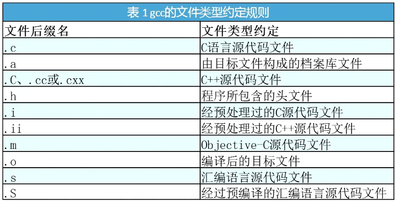
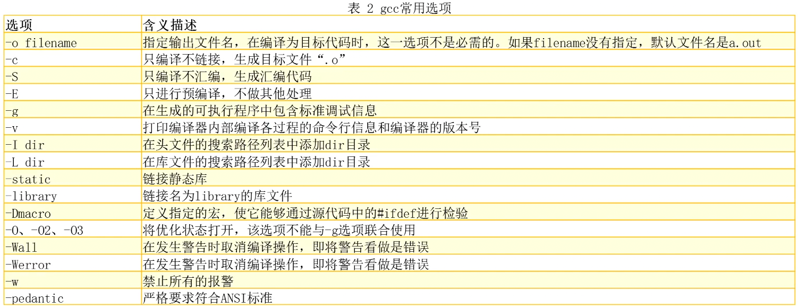
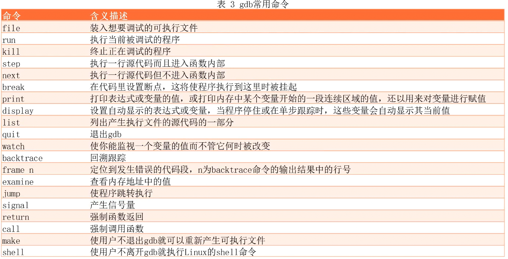

# 内容

1. gcc
2. gdb
# gcc的文件类型约定规则

# gcc常用选项

# gdb - 调试工具

* 调试的对象：可执行程序
* 编译时需要增加调试信息`-g`

## 常用命令

| 命令标识                | 含义           |
| ------------------- | ------------ |
| `l`                 | 显示代码         |
| `Enter（回车键）`        | 重复上一条命令      |
| `b 行号`              | 为某行添加断点      |
| info break          | 查看断点信息(bnum)   |
| delete bnum         | 删除断点对应的编号  |
| `r`、`run`           | 启动程序         |
| `n`、`next`          | 单步执行         |
| `p 变量名`、`print 变量名` | 打印变量名内容      |
| `q`                 | 退出调试         |
| `s`、`step`          | 进入函数         |
| `f`、`finish`        | 跳出函数         |
| `continue`          | 继续程序（到下一个断点） |

