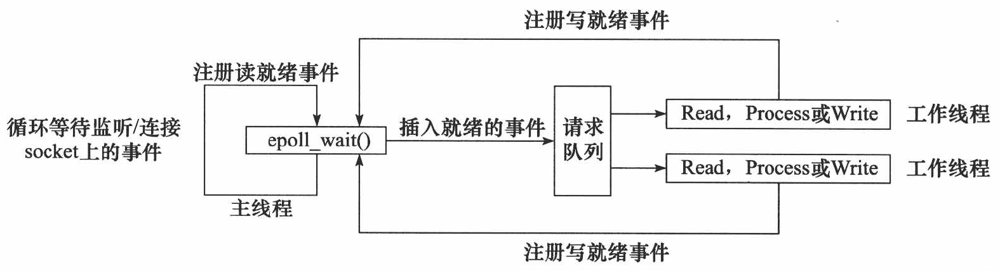
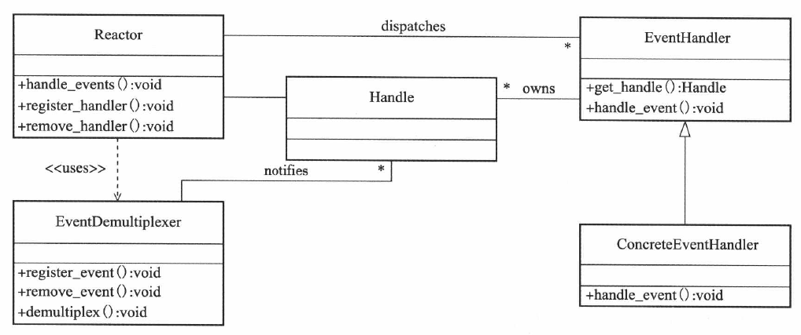

# 内容

1. IO框架库
2. Reactor模式的IO框架库包含哪些组件
3. libevent是一个轻量级的I/O框架库。
# I/O框架库

I/O框架库以库函数的形式，封装了较为底层的系统调用。
各种I/O框架库的实现原理基本相似，要么以Reactor模式实现，要么以Proactor模式实现，要么同时两种模式实现。
# Reactor模式

`Reactor模式`要求**主线程（IO处理单元）只负责监听文件描述符上是否有事件发生**，有的话就立即向工作线程（逻辑单元）通知该事件。除此之外，主线程不做其他实质性的工作。即读写数据、接受新的连接、处理客户请求均在工作线程中完成。
## 工作流程

使用同步I/O模型（以`epoll_wait`为例）实现的`Reactor模式`的工作流程是：

1. **主线程往`epoll`内核事件表中注册`socket`上的读就绪事件**。
2. 主线程调用`epoll_wait`等待`socket`上有数据可读。
3. 当`socket`上有数据可读时，`epoll_wait`通知主线程。**主线程则将`socket`可读事件放入请求队列**。
4. 睡眠在请求队列上的某个**工作线程**被唤醒，它从`socket`读取数据，并处理客户请求，然后**工作线程往`epoll`内核事件表中注册该`socket`上的写就绪事件**。
5. 主线程调用`epoll_wait`等待`socket`可写。
6. 当`socket`可写时，`epoll_wait`通知**主线程**。**主线程将`socket`可写事件放入请求队列**。
7. 睡眠在请求队列上的某个**工作线程**被唤醒，它往`socket`上写入服务器处理客户请求的结果。

总结：主线程注册读事件，可读时，主线程放入请求队列；工作线程读数据，处理请求，工作线程注册写事件；可写时，主线程放入请求队列；工作线程写数据。



## 组件框架

基于Reactor模式的I/O框架库包含如下几个组件：

1. 句柄(Handle)
2. 事件多路分发器(Event Demultiplexer)
3. 事件处理器(Event Handler)和具体的事件处理器(Concrete EventHandler)
4. Reactor。

这些组件的关系如下图所示。



* 句柄
  * 说白了就是文件描述符，句柄在windows上某个资源的id，因为libevent库是跨平台的，所以叫法容易混用。
* 事件多路分发器
  * 事件的到来是随机的、异步的。比如我们无法预知程序何时收到一个客户连接请求，又亦或收到一个暂停信号，所以程序需要循环地等待判断有无事件产生，这就是**事件循环**。
  * 在事件循环中，等待事件一般使用I/O复用技术来实现。I/O框架库一般将系统支持的各种I/O复用系统调用封装成统一的接口，称为**事件多路分发器**。因此事件多路分发器可以理解为封装了IO复用，提供了一个更便于使用的接口。
  * 事件多路分发器的demultiplex方法是等待事件的核心函数，其内部调用的是select、poll、epoll\_wait等函数。
  * 事件多路分发器还需要实现`register_event`和`remove_event`方法，以供调用者给事件多路分发器中添加事件和从中删除事件。
* 事件处理器和具体事件处理器
  * 事件处理器执行事件对应的业务逻辑。它通常包含一个或多个`handle_event`回调函数，这些回调函数在事件循环中被执行。
  * I/O框架库提供的事件处理器通常是一个接口，用户需要继承它来实现自己的事件处理器，即具体事件处理器。**因此，事件处理器中的回调函数一般被声明为虚函数，以支持用户的扩展**。
  * 此外，事件处理器一般还提供一个`get_handle`方法，它返回与该事件处理器关联的句柄。那么，事件处理器和句柄有什么关系？**当事件多路分发器检测到有事件发生时，它是通过句柄来通知应用程序**的。因此，我们必须将事件处理器和句柄绑定，才能在事件发生时获取到正确的事件处理器。
* Reactor是I/O框架库的核心。它提供的几个主要方法是：
  * `handle_events`，该方法执行**事件循环**。重复过程：等待事件，然后依次处理所有就绪事件对应的事件处理器。
  * `register_handler`，该方法调用事件多路分发器的`register_event`方法来给事件多路分发器中注册一个事件。
  * `remove_handler`，该方法调用事件多路分发器的`remove_event`方法来删除事件多路分发器中的一个事件。

# libevent

libevent支持的事件类型

```c
#define EV_TIMEOUT		0x01	/* 定时事件 */
#define EV_READ			0x02	/* 可读事件 */
#define EV_WRITE		0x04	/* 可写事件 */
#define EV_SIGNAL		0x08	/* 信号事件 */
#define EV_PERSIST		0x10	/* 永久事件 */
#define EV_ET			0x20   /*边沿触发事件,需要IO复用系统调用支持,如epoll*/
```

## 编程流程

1. 定义、创建框架示例
2. 向框架示例注册、注销事件：指定具体哪个**base**、哪个**描述符**，哪种**事件**，绑定**回调函数**和**参数**
    1. 有哪些事件：IO事件（`fd`、`EV_READ`、`fun_cb`）、信号事件（`sig`、`EV_SIGNAL`、`sig_cb`）、定时器事件（`-1`、`EV_TIMEOUT`、`tv_cb`）
3. 开启事件循环，实际上就是框架底层调用`select/poll/epoll`
4. 事件发生之后，调用回调函数如`fun_cb`。
## 示例

```c
#include<sys/signal.h>	//SIGINT
#include<event.h>
void signal_cb(int fd, short event, void * argc)
{
    struct event_base* base = (event_base*)argc;
    struct timeval delay = {2, 0};
    printf("Caught an interrupt signal; exiting cleanly in 2 seconds...\n");
    event_base_loopexit(base, &delay);
}
void timeout_cb(int fd, short event, void * argc)
{
    printf("timeout\n");
}
int main()
{
    struct event_base* base = event_init();
    struct event* signal_event = evsignal_new(base, SIGINT, signal_cb, base);
    event_add(signal_event, NULL);
    
    timeval tv = {1, 0};
    struct event* timeout_event = evtimer_new(base, timeout_cb, NULL);
    event_add(timeout_event, &tv);
    
    event_base_dispatch(base);
    
    event_free(timeout_event);
    event_free(signal_event);
    event_base_free(base);
}
```

上面的代码描述了使用Libevent库的主要逻辑：

1. 调用`event_init`函数创建`event_base`对象。一个`event_base`相当于一个Reactor实例。
2. 创建具体的事件处理器，并设置他们所从属的Reactor实例。本例中的**`evsignal_new`**用于创建信号事件处理器，**`evtimer_new`**用于创建定时事件处理器，**它们是定义在`/include/event2/event.h`文件中的宏**，代码如下。其中`evtimer_new`的原型`event_new`的第二个参数默认赋`-1`，第三个参数默认赋`0`。

```c
#define evsignal_new(b, x, cb, arg) \
event_new((b), (x), EV_SIGNAL|EV_PERSIST, (cb), (arg))
#define evtimer_new(b, cb, arg) \
event_new((b), -1, 0, (cb), (arg))
```
3. 回调函数的格式需要统一：`void fun_cb(int fd, short event, void* argc)`

```c
#include<sys/signal.h>	//SIGINT
#include<event.h>
void sig_fun(int fd, short event, void * argc)
{
    printf("sig=%d\n", fd);
}
void timeout_fun(int fd, short event, void * argc)
{
    if(ev & EV_TIMEOUT)
    {
        printf("timeout\n");
    }
}
int main()
{
    struct event_base* base = event_init();
    assert(base != NULL);
    
    struct event* sig_ev = evsignal_new(base, SIGINT, sig_fun, NULL);
    event_add(sig_ev, NULL);
    
    struct timeval tv = {5, 0};
    //定时器不需要fd描述符、也不需要信号代号。
    //所以，相应地:	evtimer_new对应的timeout_fun回调函数中的fd参数默认赋-1
    //				evtimer_new对应的event_new函数的信号代号参数默认赋-1 
    struct event* timeout_ev = evtimer_new(base, timeout_fun, NULL);
    event_add(timeout_ev, &tv);
    
    event_base_dispatch(base);	//开启事件循环
    
    event_free(sig_ev);
    event_free(timeout_ev);
    event_base_free(base);
}
```

`ctrl+c`终止进程的信号代号是2，但是信号事件并没有fd描述符，而是巧妙地复用了fd，写入信号代号。

## 编译测试

`gcc`编译链接命令后需要加后缀`-levent`。

# MainServer

```cpp
class TcpServer;
class ThreadPool;
class Reactor;

class MainServer
{
private:
    TcpServer * m_server;
    ThreadPool * m_pool;
    Reactor * m_reactor;
public:
    MainServer();
    ~MainServer();
    static void ListenEventCallBack(int fd, short events, void * arg);
    
};
```

```cpp
#include"mainServer.h"
#include"tcpServer.h"
MainServer::Mainserver()
{
    m_server = new TcpServer;
}
MainServer::~MainServer()
{
    m_server = new TcpServer(IpAddressPort{"127.0.0.1", 8000});
    m_pool = new ThreadPool(3);
    m_reactor = new Reactor();
    m_reactor->AddEventAndHandler(m_server->GetLfd, EV_READ | EV_PERSIST, MainServer::ListenEventCallBack)
}
MainServer::ListenEventCallBack(int fd, short events, void * arg)
{
    
}
```