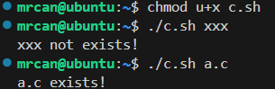

`-e`指定文件是否存在（目录也是文件）

`-d`指定文件是否存在并且是目录

`-f`指定文件是否存在并且是普通文件

`-r`指定文件是否用户可读

`-w`指定文件是否用户可写

`-x`指定文件是否用户可执行

`-O`用户是否是该文件的拥有者
# 不会直接输出结果
结果不会直接输出到屏幕上，可以用`$?`查看该命令的执行结果。
```sh
test -e xxx
echo $?

```
如果输出 0，代表真，表示存在。
测试，如果文件不存在，会输出 1，表示不存在。（`$?`的结果为非 0 时代表假）

>关于`$?`见《Linux_Shell编程》的《特殊变量》一节。

经测试，管道重定向到echo也没有输出结果。
```sh
test -e xxx | echo
（无输出）
```
# 一般和Shell编程的if判断结合
```sh
#!/bin/sh
if (test -e $1)
then
    echo "$1 exists!"
else
    echo "$1 not exists!"
fi
```

```sh
chmod u+x c.sh
./sh xxx
```


# test结合if - 相当于`[]`
if后跟的`[ ... ]`相当于：`(test ...)`

见《Linux_Shell编程#if语句》![[Linux_Shell编程#if语句]]
# test结合比较运算符

```sh
mrcan@ubuntu:~$ test 2 -gt 3
mrcan@ubuntu:~$ echo $? # $? 表示上一个命令的返回结果
1 # 1 表示 假
mrcan@ubuntu:~$ test 20 -gt 3
mrcan@ubuntu:~$ echo $?
0 # 0 表示 真
```

test在和`-gt`（或`-lt`、`-le`等等）结合使用的时候，`-gt`前后不是看作字符串的，是内部把20进行了类似于`expr`的操作转换成了数字再进行比较。

