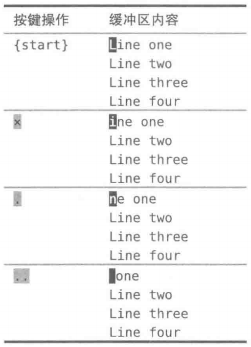
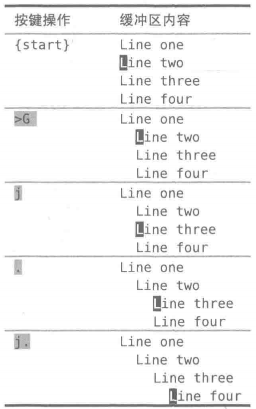
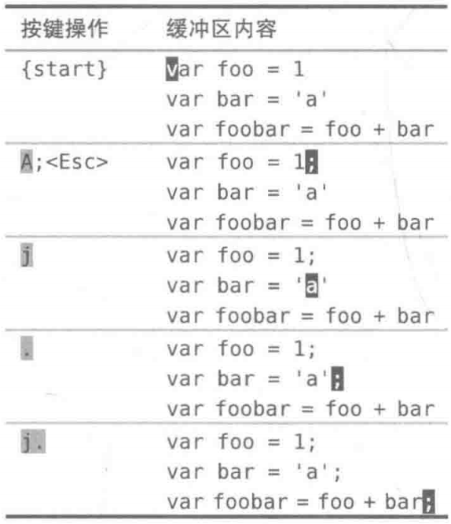

# `.`命令

`.`命令可以让我们重复上次的修改，它是vim中最为强大的多面手。

首先我们要问∶"究竟什么是修改？"

"上次修改"可以指很多东西，一次修改的单位可以是字符、整行，甚至是整个文件。

# 例子：删除x、dd

`x`命令会删除光标下的字符，在这种情况下使用。命令"重复上次修改"时，就会让Vim删除光标下的字符。



dd命令也做删除操作，但它会把整行一起删掉。如果在dd后使用、命令，那么"重复上次修改"会让 Vim删除当前行。

# 例子：缩进`>G`

最后，`>G`命令会增加从当前行到文档末尾处的缩进层级。如果在此命令后使用命令，那么"重复上次修改"会让Vim增加从当前行到文档末尾的缩进层级。在下例中，让光标从第二行开始（vim中，`j`代表向下，`k`代表向上，`h`代表向左，`l`代表向右），以便一目了然地看出差别。



## 总结

`j`代表向下，`k`代表向上，`h`代表向左，`l`代表向右。

# vim会记录每一个按键操作：`.`命令是一个微型的宏

`x`、`dd`以及`>`命令都是在普通模式中执行的命令，不过，每次进入插入模式时，也会形成一次修改。从进入插入模式的那一刻起（例如，输入`i`），直到返回普通模式时为止（输入`<Esc>`），Vim会记录每一个按键操作。做出这样一个修改后再用命令的话，它将会重新执行所有这些按键操作（在插入模式中移动光标也会重置修改状态）。

vim可以录制任意数目的按键操作，然后在以后重复执行它们。这让我们可以把最常重复的工作流程录制下来，并用一个按键重放它们。可以把`.`命令当成一个很小的宏（macro）。

# 减少无关的移动

在每行的结尾添加一个分号。要实现这一点，先得把光标移到行尾，然后切换到插入模式进行修改。`$`命令可以完成移动动作，接着就可以执行`a;<Esc>`完成修改了。

要完成全部修改，需要对所有行做完全相同的操作，但是，由于命令可以重复上次的修改，因此不必重复之前的操作，而是执行两次`j$.`。一个`.`键顶3个`a;<Esc>`，虽然每次省得并不多，不过在重复操作时，累积效应可不小。

`j`命令使光标下移一行，而`$`命令把光标移到行尾。我们用了两下按键，仅仅是为了把光标移到指定位置，以便可以用`.`命令。应该还有改进的余地。

`a`命令在当前光标之后添加内容，`A`命令则在当前行的结尾添加内容。不管光标当前处于什么位置，输入`A`都会进入插入模式，并把光标移到行尾。换句话说，它把`$a`封装成了一个按键操作。Vim提供了不少这样的复合命令。



用`A`来代替`$a`，大大提升了`.`命令的效率。不必再把光标移到行尾，只需保证它位于该行内就行了（可在任意位置）。现在可以重复执行足够多次的`j.`，完成对后续行的修改。

一个键移动，另一个键操作，请留意这种应用模式，更多的例子中将看到它的身影。

虽然这一模式对这个简短的例子来说很好用，但它不是万能的。试想一下，如果我们不得不给连续50行添加分号，即便每修改一次输一次`j`，看起来也是一项很繁重的工作。

## 一箭双雕

我们可以这样说，A命令把两个动作（`$a`）合并成了一次按键，不过它不是唯一一个这样的命令，很多Vim的单键命令都可以被看成两个或多个其他命令的组合，下表列出了类似的一些例子，找出它们之间别的共同点。

| 复合命令 | 等效的长命令                                                 |
| -------- | ------------------------------------------------------------ |
| C        | `c$`                                                         |
| s        | `cl`                                                         |
| S        | `^C`                                                         |
| `|`      | `^i`（`^`命令是移到行首，`i`是进入插入模式，其实也等效于`I`） |
| A        | `$a`                                                         |
| o        | `A<CR>`                                                      |
| O        | `ko`                                                         |

比如：输入`ko`，等于输入了`k$a<CR>`。

它们全都会从普通模式切换到插入模式。这对`.`命令可能产生影响。

# 使修改、移动可重复：`;`和`s`命令

在一个字符前后各添加一个空格。以像下面这样在+号前后各添加一个空格，让肉眼更容易识别。

```
var foo = "method(" + argument1 + "," + argument2 + ")";
```

`s`命令把两个操作合并为一个：它先删除光标下的字符，然后进入插入模式。在删除＋号后，先输入`空格 + 空格`，然后退出插入模式。

先后退一步，然后前进三步，这是个奇怪的小花招，看起来可能不够直接。但这样做最大的好处是：我们可以用`.`命令重复这一修改。我们所要做的只是把光标移到下一个+号处，然后用`.`命令重复这一操作即可。

但是移动光标到指定位置还是太麻烦了。

`f{char}`命令让Vim查找下一处指定字符出现的位置，如果找到了，就直接把光标移到那里。因此，输入`f+`时，光标会直接移到下一个+号所在的位置。

完成第一处修改后，可以重复按`f+`命令跳到下一个+号所在的位置。不过，还有一种更好的方法可以用：`;`命令会重复查找上次`f`命令所查找的字符，因此不用输入4次`f+`，而是只输入一次，后面跟着再用3次`;`命令。

`;`命令带我们到下一个目标字符上，`.`命令则重复上次的修改。因此，可以连续输入3次`;.`来完成全部修改。与其和Vim区分模式的编辑模型做斗争，倒不如与它一起协同工作。然后，就能把特定任务变得容易——在面对重复性工作时，我们需要让移动动作和修改都能够重复，这样就可以达到最佳编辑模式。

## 总结

1. `s`键先删除光标下的字符，然后进入插入模式
2. `f{char}`命令查找下一处指定字符出现的位置，如果找到了，就直接把光标移到那里
3. `;`命令会重复查找上次`f`命令所查找的字符
4. `.`命令重复上次的修改

# 几对儿重复和回退

如果我们知道如何重复之前的操作，而无需每次都输入整条命令，那么就会获得更高的效率。可以先执行一次，随后只需重复即可。

然而，这么少的按键就可以完成这么多的事情，需要很小心地操作才行，不然就很容易出错。当一遍又一遍地连续按`j.j.j.`（`j`，向下一行）时，那种感觉就像是在敲鼓。可是，如果不小心在一行上敲了两次`j`键，或敲了两次`.`键，就很麻烦。当Vim让一个操作或移动可以很方便地重复时，它总是会提供某种方式能回退回来。对命令而言，可以按`u`键撤销上次的修改。如果在使用`f{char}`命令后，不小心按了太多次`;`键，就会偏离我们的目标。不过可以再按`,`键跳回去，这个命令会反方向查找上次`f{char}`所查找的字符。

Vim中可重复执行的命令，以及相应的回退方式。

| 目的                       | 操作                    | 重复 | 回退 |
| -------------------------- | ----------------------- | ---- | ---- |
| 做出一个修改               | `{edit}`                | `.`  | `u`  |
| 在行内查找下一指定字符     | `f{char}`/`t{char}`     | `;`  | `,`  |
| 在行内查找上一指定字符     | `F{char}`/`T{char}`     | `;`  | `,`  |
| 文档中查找下一处匹配字符串 | `/pattern<CR>`          | `n`  | `N`  |
| 文档中查找上一处匹配字符串 | `?pattern<CR>`          | `n`  | `N`  |
| 执行替换                   | `:s/target/replacement` | `&`  | `u`  |
| 执行一系列修改             | `qx{changes}q`          | `@x` | `u`  |

# `.`范式

我们想在一系列行的结尾添加分号。我们先用`A[进入插入模式] ;<Esc>`修改了第一行，做完这步准备后，就可以使用`.`命令对后续行重复此修改。我们使用了`j`命令在行间移动，要完成剩余的修改，只需简单地按足够多次`j.`就可以了。

我们想为每个`+`号的前后各添加一个空格。先用`f+`命令跳到目标字符上，然后用`s`命令把一个字符替换成3个，做完这步准备后，就可以按若干次`;.`完成此任务。

我们想把每处出现单词"content"的地方都替换成"copy"。使用`*`命令来查找目标单词，然后用`cw`命令修改第一处地方。做完这步准备后，就可以用`n`键跳到下一匹配项，然后用`.`键做相同的修改。要完成这项任务，只需简单地按足够多次`n.`就行了。

理想模式：用一键移动，另一键执行

所有这些例子都利用`.`命令重复上次的修改，不过这不是它们唯一的共同点，另外的共同点是它们都只需要按一次键就能把光标移到下一个目标上。

用一次按键移动，另一次按键执行，再没有比这更好的了，这就是理想的解决方案。这一编辑模式，把它叫做"`.`范式"。

## 总结

| 按键      | 作用                                         |
| --------- | -------------------------------------------- |
| A         | 移到行尾并进入插入模式                       |
| j         | 光标向下一行                                 |
| `f{char}` | 光标移到下一个char字符                       |
| s         | 把光标下一个字符删除，进入插入模式           |
| `;`       | 找下一个指定的字符                           |
| `*`       | 查找当前光标下的单词，并把光标移到下一个单词 |
| cw        | 删除光标下的单词，进入插入模式               |

`.`命令记录的是从进入插入模式后，到退出插入模式输入的命令
