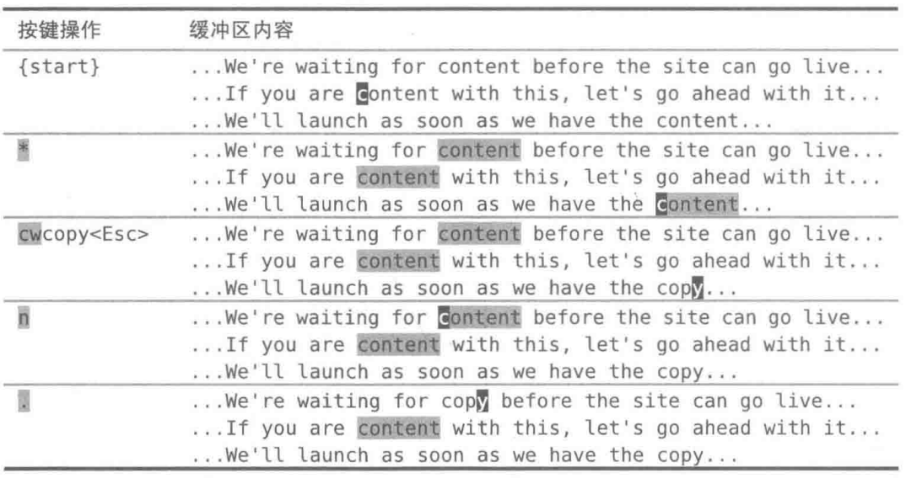

# `@.`/`&`重复Ex命令

`@:`可以用来重复任意Ex命令，或者也可以输入`&`来重复上次的`:substitute`命令（本身也是一条Ex命令）。

Vim提供了一个`:substitute`命令专门用于查找替换任务，不过用上面介绍的技术，也可以手动修改第一处地方，然后再一个个地查找替换其他匹配项。`.`命令可以把我们从繁重的工作中解放出来，而即将登场的另一个有用的单键命令，则能够让我们方使地在匹配项间跳转。

在下面这段文本中，每一行都出现了单词"content"。

```
...We're waiting for content before the site can go live...
...If you are content with this, let's go ahead with it...
...We'll launch as soon as we have the content..
```

假设想用单词"copy"（意义同"copywriting"）来替代"content"。也许只要用替换命令就行了，像下面这样：`:%s/content/copy/g`。但是如果我们运行上面这条命令，就会出现"If you are 'copy' with this,"这样的句子，之所以会有这种问题，是因为"content"一词有两种含义，一个是"copy"的同义词，另一个是"happy"的同义词。用专业的话说，我们是在处理拼写相同，但含义和发音都不同的词。所以在替换时，一定要小心每一步操作。不能想当然地用"copy"替换每一个"content"，而是要时刻留神，对每个地
方都要问"这里要修改吗？"，然后回答"修改"或者"不改"。`:substitute`命令能胜任这项工作。

# `*`命令--查找当前光标下的单词

可以先用`/content`，把光标移动到指定的单词上。然后按`*`键，就可以找到下一个同词。



刚开始，把光标移到单词"content"上，然后使用`*`命令对它进行查找。这会产生两个结果：一是光标跳到下一个匹配项的第一个字符上，二是所有出现这个词的地方都被高亮显示出来。如果没有看到高亮，运行一下 `:set hls`。执行过一次查找"content"的命令后，现在只需按`n`键就可以跳到下一个匹配项。在本例中，按一次`*`，两次`n`，会遍历完所有的匹配项，从而跳回到本次查找的起点。

## 总结

1. `*`命令的作用是光标跳到下一个匹配项的第一个字符上。本质上是先`/\<content\>`搜索匹配项，在点按`n`。
2. 开启搜索匹配项同时高亮：`:set hls`

# 使修改可重复

当光标位于"content"的开头时，就可以着手修改它。这包括两步操作：首先要删除单词"content"，然后输入替代的单词。`cw`命令会删除从光标位置到单词结尾间的字符，并进入插入模式，接下来就可以输入单词"copy"了。**Vim会把我们离开插入模式之前的全部按键操作都记录下来**，因此整个`cw copy<Esc>`会被当成一个修改。也就是说，执行`.`命令会删除从光标到当前单词结尾间的字符，并把它修改为"copy"。

# 合而为一

每次按`n`键时，光标就会跳到下一个"content"单词所在之处，而按键时，它就会把光标下的单词改为"copy"。

如果想替换所有地方，就可以不加思考地一直按`n.n.n.`以完成所有的修改（但是，这种情况下也可以用`:%s/content/copy/g`命令）。然而，由于我们需要留意不符合要求的匹配项，所以在按了`n`之后，要审视一下当前的匹配项，然后决定是否把它改为"copy"。如果需要修改的话，就按`.`命令，反之则不用。无论决定是什么，都可以再次按`n`移到下一个地方，如此循环往复，直到完成全部的修改。
