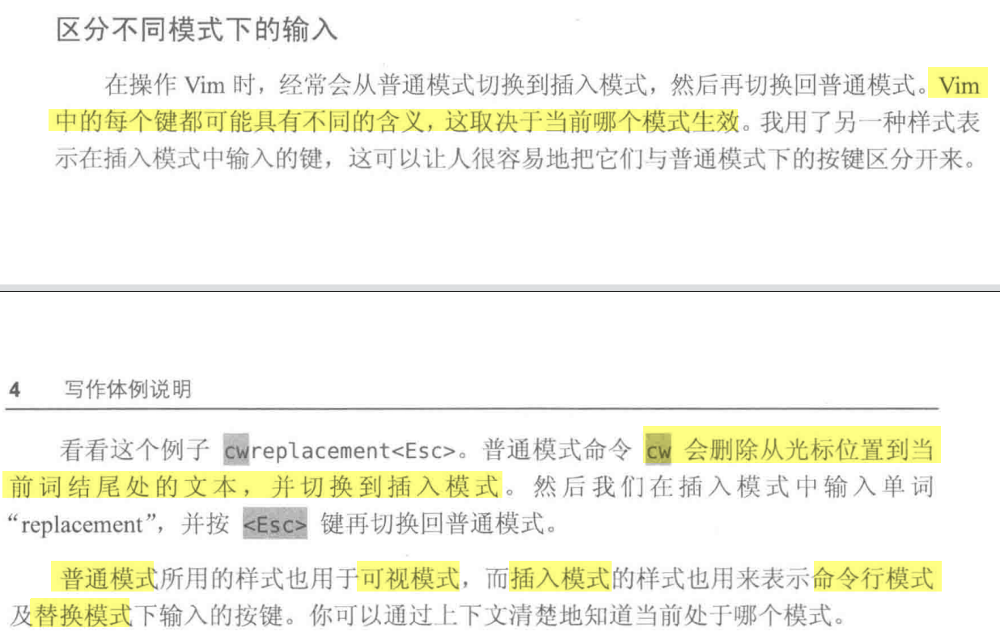
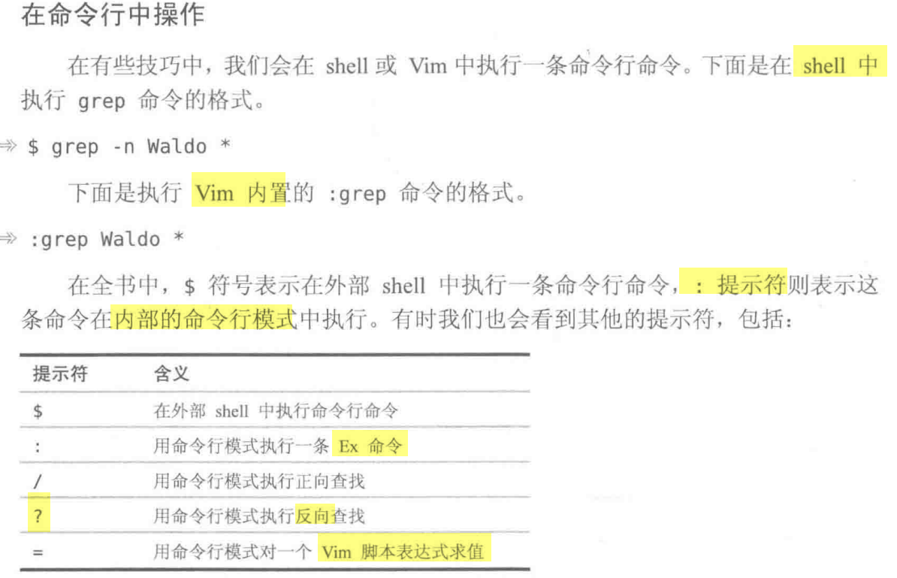

# 命令行模式（普通模式）

也称为交互模式，这是 `vim` 的默认模式，每次使用 `vim` 命令编辑文件的时候，就会先进入这个模式。
- 在这个模式下，你不能输入文本；
- 它可以让我们在文本间移动，删除一行文本，复制粘贴文本，跳转到指定行，撤销操作，等等。
## 常用命令

| 命令  | 作用                                                                   |
| --- | -------------------------------------------------------------------- |
| i   | 切换到输入模式，以输入字符                                                        |
| x   | 删除当前光标所在处的字符                                                         |
| X   | 删除当前光标前一个字符                                                          |
| :   | 切换到底线命令模式，以在最底一行输入命令                                                 |
| gg  | 跳转到文件开头                                                              |
| G   | 跳转到文件末尾                                                              |
| dd  | 剪切：删除光标所在一整行数据，且临时存储到缓存区                                             |
| yy  | 复制：把整行文本到临时缓存区。                                                      |
| p小写 | 粘贴：将指定缓存区内容放在光标位置之下：<br>如果是整行文本则放在当前的下一行，若是非整行文本则放在光标后面              |
| P大写 | 粘贴：将指定缓冲区的内容放到当前光标的位置之上：<br>如果是整行文本则放在这一行并在最后换行，若是非整行文本则放在光标前面       |
| u   | 撤销最近的修改，针对所有修改                                                       |
| U   | 撤销对当前行上做的所有修改                                                        |
| r   | 替换光标位置上的一个字符，但不会进入 `insert` 模式，先按 `r` 再按要替换成的字符，也可以 `2r` 把光标后面两个都替换掉 |
| R   | 替换从光标位置开始的字符，同时改变 `vim` 到文本输入模式                                      |
| .   | 重复上一次的修改 -- 注意该命令是英文符号点                                              |
| >>  | 向右移动本行一段距离                                                           |
| <<  | 向左移动本行一段距离                                                           |

链接：https://juejin.cn/post/7070699702732783623  
## 其他
copy word、delete word：

与w有关的都会加上单词之后的空格。

`cw`删除从光标位置到当前词结尾处的文本（一个单词+空格），并切换到插入模式
`dw`删除光标下的单词+空格
`yw`复制一个单词，`y2w`复制2个单词
`y$`复制从当前光标到行结尾的所有单词
`y0`复制从当前光标到行首的所有单词
`yy`复制一整行
`2yy`复制从当前光标所在行开始的 2 行
# 笔记

样式：**普通模式**所用的样式也用于**可视模式**；而**插入模式**的样式也用来表示**命令行模式**及**替换模式**下输入的按键。可以通过上下文清楚地知道当前处于哪个模式。



## 命令行中操作



# 如何激活查找的字符串所有都高亮

# 可视模式

可视模式允许在缓冲区内选择文本，然后在其上操作。在下例中，用`it`文本对象选中`<a>`标签内的文本。

这会出现一种：高亮显示可视选区。样式与查找匹配项的样式相同。

# 使用Vim原生配置

```bash
vim -u NONE -N
```

`-u NONE`标志让Vim在启动时不加载vimrc，这样，定制项就不会生效，插件也会被禁用。当不加载vimrc文件时，Vim会切换到vi兼容模式，这将导致很多有用的功能被禁用，`-N`标志则会使能`'nocompatible'`选项，防止进入vi兼容模式。

有些Vim的内置功能是由Vim脚本实现的，也就是说，只有在激活插件时，它们才会工作。下面是包含了激活Vim内置插件的最小配置文件。

```
set nocompatible
filetype plugin on
```

在启动Vim时，可以执行如下命令，用该文件取代默认的vimrc。

```
vim -u code/essential.vim
```

> 激活Vim内置的插件功能后，可以使用诸如netrw、omni-completion，以及很多其他的功能。Vim的出厂配置，指的就是激活了内置的插件功能，并且禁用了vi兼容模式时的配置。

# Vim版本

有些Vim功能可以在编译期间被禁用。例如，在配置编译选项时，可以传入`--with-features=tiny`参数，这会禁用除最基本的功能外的其他所有功能（Vim的功能集还包括small、normal、big和huge）。

可以查阅`:h+feature-list`，浏览完整的功能列表。如果发现Vim缺少某个功能，那么也许正在使用一个最小功能集的Vim发行版。可以用`:version`命令检查此功能是否可用。

# 设置行号

临时设置

`:set number`（或`:set nu`）显示行号
`:set nonumber`（或`:set nonu`）取消行号

永久显示行号

1. 查找Vim设定文件`sudo find / -name vimrc`
2. 修改Vim设定文件`/etc/vimrc`，末尾添加`set number`（或`set nu`），保存即可。
