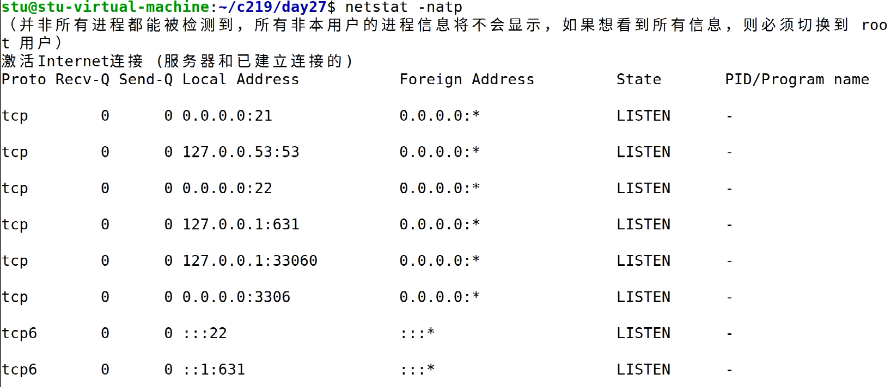
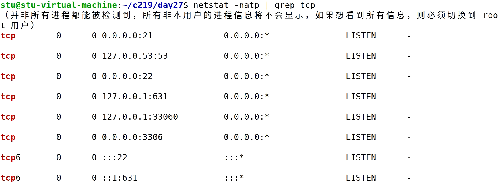
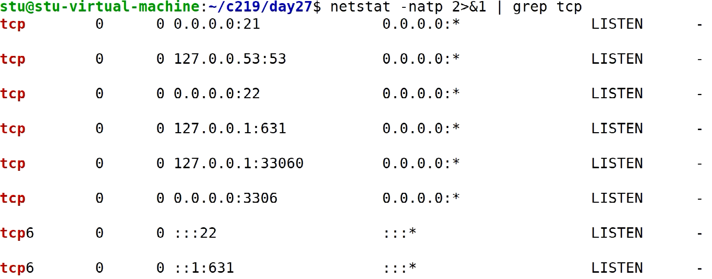
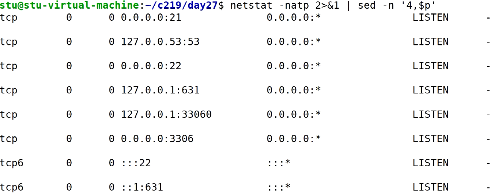
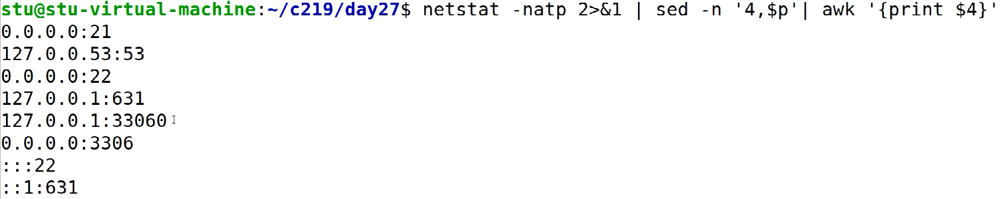
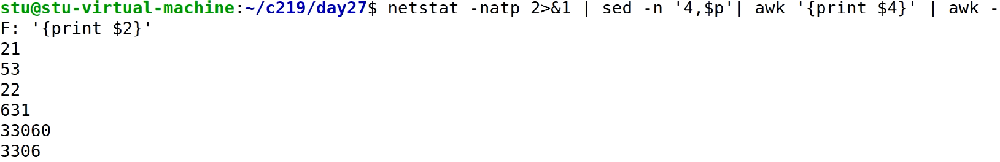
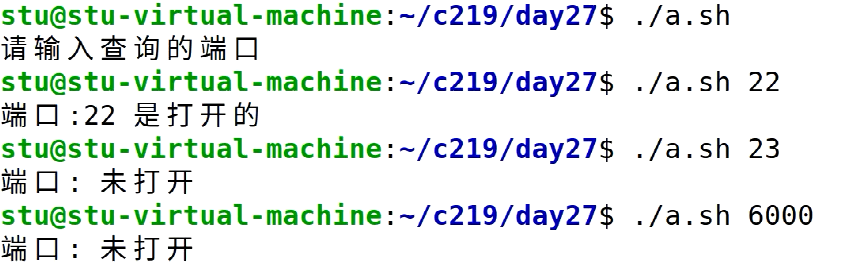
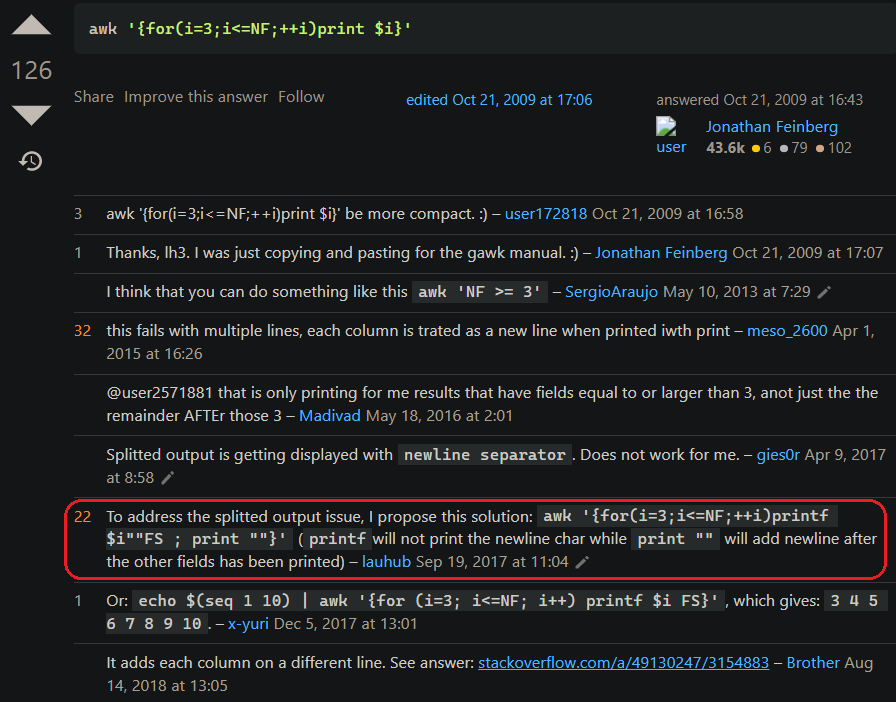
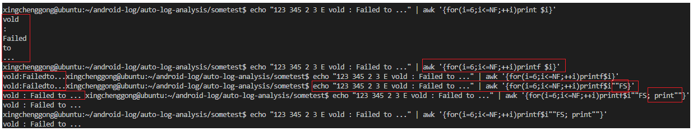

# 内容

1. awk
2. sed

# awk

是按{域,分隔符,域}生成报表的工具。

经典应用有：把**（文本）文件**中浮点数的整数部分解析出来。

```sh
# file.txt
1.7
12.89
23.9
```

```sh
awk -F. '{print $1}' file.txt
# 执行结果
	# 1
	# 12
	# 23
```

重定向：

```sh
awk -F. '{print $1}' file.txt > newfile
cat newfile
# 执行结果(来自newfile)
	# 1
	# 12
	# 23
```

小改动：把**（文本）文件**中浮点数的**小数**部分解析出来。

```sh
awk -F. '{print $2}' file.txt > newfile
cat newfile
# 执行结果(来自newfile)
	# 7
	# 89
	# 9
```

```sh
cp /etc/passwd .
awk -F: '{print $1,$3}' passwd
awk -F: '{if($3 >= 1000) print $1,$3}' passwd
awk -F: 'BEGIN{print "name\t uid"}{print $1"\t"$3}END{print"----end----"}' passwd
```

## 场景--对命令执行输出的信息进行处理

### 编写脚本杀死全部当前正在睡眠的进程

```sh
# some shells are sleeping...
ps -ef | grep sleep | grep -v "grep"
# xcg	4168	4162	0	......
ps -ef | grep sleep | grep -v "grep" | awk '{print $2}' # 4168
```

```sh
#!/usr/bin/bash
PIDS=`ps -ef | grep sleep | grep -v "grep" | awk '{print $2}'`
if [ -z "$PIDS" ]
then
	echo "没有sleeping进程在运行"
	exit 0
fi
for pid in $PIDS		# PIDS不要加双引号，如果加了，那么pid会一次接收整个PIDS。虽然也能(kill xxx xxx,而不是kill xxx,kill xxx)。但是echo只echo一次，输出出现问题。
do
	kill $pid
	echo "进程:$pid 被杀死了"
done
```

### 结合netstat -natp命令

获取端口、地址信息、状态信息去处理

### 结合free命令

# sed

是对文件进行编辑的工具。在某行增删内容。

示例：对文件文本进行简单处理

```sh
# file.txt
1.7
12.89
23.9
```

```sh
sed '2i\3.3' file.txt > newfile # 在第二行之前插入3.3，之后的行下移一行、
# 1.7
# 3.3
# 12.89
# 23.9
```

```sh
sed '2a\3.3' file.txt > newfile # 在第二行下面附加3.3，之后的行下移一行
# 1.7
# 12.89
# 3.3
# 23.9
```

```sh
sed '2,3d' file.txt > newfile # 删除第2、3行
# 1.7
```

```sh
sed '1,2p' file.txt # 打印1~2行，但是默认会重复打印
# 1.7
# 1.7
# 12.89
# 12.89
# 23.9
sed '1,3p' file.txt # 打印1~3行，但是默认会重复打印
# 1.7
# 1.7
# 12.89
# 12.89
# 23.9
# 23.9
sed -n '1,2p' file.txt # 只打印1~2行
# 1.7
# 12.89
```

# 结合

要灵活运用三剑客，应对两种结合方式：

1. 结合，对文件操作
2. 结合，对命令操作

```sh
netstat -natp			 # 未过滤
netstat -natp | grep tcp # 注意，此时 "|" 这个管道只能用来 过滤 标准输出(1)的信息，如果前面的信息有标准错误输出stderr(2)则无法过滤。
netstat -natp 2>&1 | grep tcp # 此时已把标准错误输出2重定向到1,这时再过滤时将会一视同仁。
```

未过滤的结果：


标准错误输出未重定向时：


标准错误输出重定向后（过滤掉上面的提示信息做法1）：


sed剔除前n行后（过滤掉上面的提示信息做法2）：

```sh
netstat -natp | sed -n '4,$p' # 输出4行及之后的全部行
```



结合awk提取第4列（Local Address）：

```sh
netstat -natp | sed -n '4,$p' | awk 'print $4'
```



接上一步，提取地址信息中的端口号。

```sh
netstat -natp | sed -n '4,$p' | awk 'print $4' | awk -F: '{print $2}'
```



但是出现问题，最后的":::22"和"::1:631"被忽略了。需要另分一类特殊处理。

然后，我们用上面这个命令，可以做以下工作：查询某个端口是否被打开？

```sh
#!/usr/bin/bash
if [ "$#" -ne 1 ]
then
	echo "请输入查询的端口"
	exit 0
fi

test_port=$1

PORTS=`netstat -natp 2>&1 | sed -n '4,$p' | awk '{print $4}' | awk -F: '{print $2}'`
if [ -z "$PORTS" ]
then
	echo "没有打开的端口"
	exit 0
fi

port=""
for i in $PORTS
do
	if [ "$i" -eq "$test_port" ]
	then
		port=$i
	fi
done
if [ -n "$port" ]
then
	echo "端口:$port 是打开的"
else
	echo "端口:$port 未打开"
fi
```



# 日积月累

## awk从指定列打印到最后一列

https://stackoverflow.com/questions/1602035/how-to-print-third-column-to-last-column





其中，涉及了两个awk内置变量：NF和FS。


