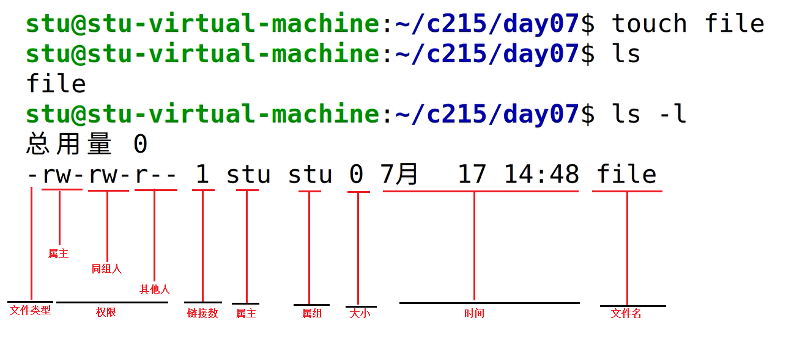

# Linux学习内容
1. 基本操作
2. `gcc/g++`（程序如何编译）
3. 工程文件管理makefile
4. 调试gdb
5. 库文件
6. 进程：复制进程fork、替换进程
7. 进程间通信（比如QQ互发信息）：管道、共享内存、信号量
8. 线程：同步、并发
9. 网络编程：跨主机发送数据（最好有计算机网络基础），TCP、HTTP、I/O复用方法
## 初识内容
1. 目录结构：Linux中的文件夹称为目录
2. 文件类型
3. 权限
4. 命令
## 总结
1. 与Windows相比：Linux多用命令行，我们要掌握基本的命令。
2. 了解系统的目录结构，是个倒状树，记住常见的四五个目录的作用。
3. 用户存放文件，要放到自己的家目录。
# Linux目录结构

| 目录   | 描述                                          | 全拼                                |
| ---- | ------------------------------------------- | --------------------------------- |
| /    | 根目录                                         |                                   |
| bin  | 二进制可执行程序，常用的命令就存放到这了。                       | binary, 表示二进制可执行文件                |
| dev  | 硬件设备文件，把硬件设备抽象成为了文件                         | device, 设备                        |
| lib  | 库文件                                         | library, 库                        |
| mnt  | 临时挂载移动设备                                    | mount                             |
| proc | 将内存中进程的信息映射到了文件中                            | process, 进程                       |
| home | 普通用户的家目录，以用户名为准，如`/home/xcg`                |                                   |
| root | 管理员的家目录                                     |                                   |
| boot | 存放系统启动相关的内核文件                               |                                   |
| etc  | 系统的配置文件                                     | et cetera, "等等"                   |
| usr  | 在系统运行过程中，不经常改变的内容，比如说安装的软件。存放所有命令、库、手册等共享资源 | 不是user的缩写，而是Unix Shared Resources |
| var  | usr目录下的软件产生的数据，会存放于此；除此之外还有邮件、系统日志等。因此经常改变。 |                                   |
## etc

etc不是什么缩写，是"and so on"的意思，来源于法语的"et cetera"，翻译成中文就是"等等"的意思。至于为什么在`/etc`下面存放配置文件，按照原始的UNIX的说法这下面放的都是一堆零零碎碎的东西，就叫etc，这其实是个历史遗留。

这个目录一般用来存放程序所需的整个文件系统的配置文件。

`/etc`目录包含很多文件，许多网络配置文件在其中：
1. `/etc/rc`or`/etc/rc.d`or`/etc/rc*.d`：启动、或改变运行级时运行的scripts或scripts的目录。
2. `/etc/passwd`：用户数据库，其中的域给出了用户名、真实姓名、家目录、加密的口令和用户的其他信息。
3. `/etc/fstab`：启动时mount -a命令(在/etc/rc 或等效的启动文件中)自动mount的文件系统列表。Linux下也包括用swapon -a启用的swap区的信息。
4. `/etc/group`：类似`/etc/passwd`，但说明的不是用户而是组
5. `/etc/issue`：getty在登录提示符前的输出信息，通常包括系统的一段短说明或欢迎信息，内容由系统管理员确定。
6. `/etc/magic`：file的配置文件，包含不同文件格式的说明，file基于它猜测文件类型。
7. `/etc/mtab`：当前安装的文件系统列表，由scripts初始化，并由mount命令自动更新。需要一个当前安装的文件系统的列表时使用，例如df命令。
8. `/etc/shadow`：在安装了影子口令软件的系统上的影子口令文件，影子口令文件将`/etc/passwd`文件中的加密口令移动到`/etc/shadow`中，而后者只对`root`可读，这使破译口令更困难。
9. `/etc/login.defs`：login命令的配置文件。
10. `/etc/profile, /etc/csh.login, /etc/csh.cshrc`：登录或启动时Bourne或Cshells执行的文件，这允许系统管理员为所有用户建立全局缺省环境。
11. `/etc/shells`：列出可信任的shell.chsh命令允许用户在本文件指定范围内改变登录shell。提供一台机器FTP服务的服务进程ftpd检查用户shell是否列在 `/etc/shells`文件中，如果不是将不允许该用户登录
## usr
之前一直没有怎么关注过它，反正程序都是安装在里边的，也没有什么值得追根溯源的东西。那么usr到底是什么的缩写呢，它又是怎么来的呢？讨论中，大部分观点认为：
1. usr是user的缩写；
2. usr是unix system resources的缩写；
3. usr是unix software resources的缩写。
4. usr是unix shared resources

根据常识判断，是user缩写的可能性不大，因为和`/home`冲突了。不过是system resources还是software resources的缩写还真不好说。特此查了好多东西，却发现竟然连wikipedia也模棱两可。`/usr`是linux系统核心所在，包含了所有的共享文件。
它是unix系统中最重要的目录之一，涵盖了二进位制文件，各种文件，各种标头文件，还有各种库文件，还有诸多程序，例如ftp，telnet等等。

曾经的`/usr`还是使用者的家目录，存放着各种使用者文件，但现在已经被`/home`取代了（例如`/usr/someone`已经改为`/home/someone`）。
现代的`/usr`只专门存放各种程序和资料，使用者目录已经转移。虽然`/usr`名称未改，不过其含义已经从“使用者目录” 变成了“unix系统资源” 目录。值得注意的是，在一些unix系统上，仍然把`/usr/someone`当做使用者家目录，如Minix。

`/usr`文件系统经常很大，因为所有程序安装在这里。`/usr`里的所有文件一般来自Linux distribution；本地安装的程序和其他东西在`/usr/local`下。这样可能在升级新版系统或新distribution时无须重新安装全部程序。

由于`/usr`中的文件不和特定的计算机相关，也不会在通常使用中修改，因此可以通过互联网共享这个目录（文件系统），这样，当管理员安装了新的站群软件之后，所有共享这一文件系统的计算机均可以使用新的站群软件。

至此，真相大白。看来就像前一阵子的`/var/run`移到`/run`一样。

真的是不看不知道，一看吓一跳呀。原来linux几经进化，好多目录的诞生和用途已经产生了根本的变化。

* `/usr/bin`: 所有可执行文件，如gcc等（指不包含在 `/sbin` 和 `/bin` 内的）；
* `/usr/include`: 各种标头文件，编译文件等时需要使用；
    * `/usr/include/’package-name’` : 程序特定的标头文件；
* `/usr/lib`: 所有可执行文件所需要的库文件；
* `/usr/local`: 这里主要存放那些手动安装的站群软件，即不是通过“新立得” 或 `apt-get` 安装的站群软件。 它和`/usr`目录具有相类似的目录结构 。让站群软件包管理器来管理`/usr`目录，而把自定义的指令码（scripts）放到`/usr/local`目录下面，应该是个不错的主意。
* `/usr/games`: 曾经包含游戏等文件，现在很少用到；
* `/usr/man`: man 手册，已经移至 `/usr/share/man`；
* `/usr/sbin`: 类似 `/sbin`，root 可以执行。但此目录不包含在环境变数 `$PATH` 中，它包含的程序类似于 `chroot`, `useradd`, `in.tftpd` and `pppconfig`；
* `/usr/share`: 它包含了各种程序间的共享文件，如字型，图示，文件等。（`/usr/local` 对应的目录是 `/usr/loca/share`）;
    * `/usr/share/doc` : 类似应用程序的 man 手册。它包含程序的说明文件，预设配置文件等；
    * `/usr/share/info` : 不常用，已经被 man 代替；
    * `/usr/share/man` : app 的 manual；
    * `/usr/share/icons` : 应用程序的图示等文件，分为png，svg等多种格式；
* `/usr/src` : linux 核心的原始码和说明文件等；
    * `/usr/src/linux` : linux 原始码；
# 文件属性



## 文件类型

| 文件类型           | 符号表示 |
| ------------------ | -------- |
| 普通文件（文档）   | `-`      |
| 目录文件（文件夹） | d        |
| 管道文件           | p        |
| 设备文件           | `c`、`b` |
| 链接文件           | `l`      |
| 套接字文件         | s        |

## 文件权限

| 文件权限 | 符号表示 | 二进制表示 | 十进制数 |
| -------- | -------- | ---------- | -------- |
| 无权限   | `-`      | 0000       | 0        |
| 可读     | r        | 0100       | 4        |
| 可写     | w        | 0010       | 2        |
| 可执行   | x        | 0001       | 1        |

### chmod改权限

| 所有权范围   | 符号表示 |
| ------------ | -------- |
| 自己（属主） | u        |
| 同组人       | g        |
| 其他人       | o        |

```bash
#chmod 改权限
chmod u-w main #属主 去除 写权限
chmod o+w main #其他人 增加 写权限
```

# 基础命令

## 基本文件操作

```bash
# 文件操作基本命令
cd 	#切换目录
pwd #显示当前位置
ls 	#显示当前目录下有哪些文件
ls -l #显示详细信息
ls -a #显示隐藏文件
touch #创建普通文件
touch a.c
mkdir tmp #创建tmp目录（文件夹）
cp
rm
mv
cat
more/less/head/tail	# 优先学习more、tail
vi/vim	#编辑文件
```

### ls

```bash
ls 	#显示当前目录下有哪些文件
ls -l #显示详细信息
ls -a #显示隐藏文件
```

### cd

```bash
#cd 	#切换目录

cd \	#切换位置到根目录下	#也可写作cd /
cd tmp 	#进入tmp这个目录（文件夹）
cd ~ 	#回到家目录
cd .. 	#返回上一层
#绝对路径
#相对路径
```

### cp/mv

```bash
cp	#拷贝
cp a.c b.c #拷贝普通文件
cp -r tmp tmp1 #拷贝文件夹，包括文件夹的内容，参数要加-r
cp file.txt tmp
cp file.txt tmp/file.txt

mv	#1.移动 2.重命名
#mv对文件夹的操作不需要加-r
mv a.c b.c #将a.c重命名为b.c
mv dir1 dir2#将目录1重命名为目录2
mv b.c dir#如果已经有dir这个目录，那么我们将会把b.c移动到dir里；如果不存在dir文件，则会重命名b.c为dir
mv b.c dir/a.c #如果已经有dir这个目录，那么我们将会把b.c移动到dir里并重命名为a.c
```

### rm

```bash
rm	#删除
rm -f 	#不给提示报错的删除
rm -d 	#删除文件夹（只能删除空的）
rm -r 	#递归删除文件夹（包含里面所有内容）
rm -rf	#-r和-f的组合用法，强有力，一定要谨慎使用
rmdir 	#删除空文件夹
```

## 高级文件操作

### cat/more/less/head/tail

```bash
cat #1.打印文件内容 2.向文件输入内容 3.合并文件
cat a.c #打印文件内容
cat > a.txt#键盘输入内容，重定向到文件里。Ctrl+D结束输入。如果a.txt不存在，自动创建。
cat a.c b.c > d.txt#把a.c和b.c的内容按顺序写到d.txt中。合并到另一文件中。
more #分屏幕显示，适于输出超过一个屏幕的文件内容，但只能看一次，空格是翻页，回车是下一行
less #在more的基础上，可以回滚。退出按q
head #默认打印文件前10行
head -3 passwd #打印前三行
tail #默认打印文件后10行
tail -3 passwd #打印后三行 
```

### tar

```bash
tar zxf name.tar.gz #解包
```

### find

```bash
find /home/xcg -name a.c #找某个目录下有无a.c
```

### grep

## vi/vim

### 关于vi的配置

[vi默认的tab缩进是制表符，怎么改为空格？](https://www.cnblogs.com/hydah/archive/2012/04/10/2440225.html)

对于使用vim的程序员来说，shiftwidth，tabstop，softtabstop绝对是经常接触的三个缩进因素。能否有方便美观的，整体化的缩进，主要是由他们相互间的配合决定。在经过一段时间试用后，总结一下我的设置经验。

**shiftwidth**：

这个是**用于程序中自动缩进所使用的空白长度**指示的。一般来说为了保持程序的美观，和下面的参数最好一致。同时它也是符号移位长度的制定者。

**tabstop**：

**定义tab所等同的空格长度**，一般来说最好设置成8，因为如果是其它值的话，可能引起文件在打印之类的场合中看起来很别扭。除非你设置了 **expandtab模式，也就是把tabs转换成空格**，这样的话就不会一起混淆，不过毕竟制表符为8是最常用最普遍的设置，所以一般还是不要改。

**softtabstop**：

如果我们希望改变程序中的缩进怎么办？shiftwidth和tabstop不一样的话，你会发现程序比较难看的。这时候，softtabstop就起作用了。可以从vim的说明中看到，**一旦设置了softtabstop的值时，你按下tab键，插入的是空格和tab制表符的混合**，具体如何混合取决于你设定的softtabstop，举个例子，如果设定softtabstop=8,那么按下tab键，插入的就是正常的一个制表符;如果设定 softtabstop=16,那么插入的就是两个制表符；如果softtabstop=12,那么插入的就是一个制表符加上4个空格；如果 softtabstop=4呢？那么一开始，插入的就是4个空格，此时一旦你再按下一次tab，这次的四个空格就会和上次的四个空格组合起来变成一个制表符。换句话说，softtabstop是“逢8空格进1制表符”,前提是你tabstop=8。

关于**expandtab**

举个例子，在多人一起开发项目时，为了使代码风格尽量保持一致，一般**不允许在代码使用TAB符，而以4个空格代之**。我们可以编辑一个文件，包含下面的内容：
set shiftwidth=4
set expandtab

然后把下面的命令加入到.vimrc中：
autocmd FileType c,cpp set shiftwidth=4 | set expandtab

就可以只在编辑c和cpp文件时实行这种设置了

 

删除掉每一行末尾的空格：

行末：`$`
行首：`^`
空格：`\s`
行末空格：`\s\+$`
行首空格：`^\+\s`
有些人认为行末的空格是无用，浪费而难看的。要删除这些每行后面多余的空格，可以执行如下命令：
`:%s/\s\+$//`
命令前面指明范围是"%"，所以这会作用于整个文件。"substitute" 命令的匹配模式是
`"\s\+$"`。这表示行末（$）前的一个或者多个（\+）空格（\s）。后面我们会介绍怎样
写这样的模式。
替换命令的 "to" 部分是空的："//"。这样就会删除那些匹配的空白字符。
另一种没有用的空格是 Tab 前面的字符。通常这可以删除而不影响格式。但并不是总这样！所以，你最好手工删除它。执行如下命令：
/
你什么都看不见，其实这是一个空格加一个 TAB 键。相当于 "/"。现在，
你可以用 "x" 删除多余的空格，并保证格式没有改变。接着你可以用 "n" 找到下一个
位置并重复这个操作。

### 插入模式(编辑模式)

`命令模式--i/a/o/s-->插入模式--ESC-->命令模式`

- i:在光标所在字符前开始插入
- a:在光标所在字符后开始插入
- o:在光标所在行的下面另起一新行插入
- s:删除光标所在的字符并开始插入
- I:在光标所在行的行首开始插入 如果行首有空格则在空格之后插入
- A:在光标所在行的行尾开始插入
- O:在光标所在行的上面另起一行开始插入
- S:删除光标所在行并开始插入

### 命令模式

`底行命令模式/插入模式--ESC-->命令模式`

```bash
r #只替换一个
R #一直替换 按esc结束
x #删除一个字符，但是不能删除空行
cc #清除整行并进入插入模式
shift+c或C #清楚本行光标及以后的内容，并进入插入模式
/ #对文本进行全文向下搜索字符串string	如：/text
? #对文本进行全文向上搜索字符串string 如：?text
G #切换到末尾行
```

vi打开文件，以搜索"port"为例：

从开头处开始搜索：/port

从结尾处开始搜索：?port

向下搜索：n

向上搜索：N，或者shift+n，或者shift+#

### 底行命令模式

`命令模式--:-->末行模式-->`

1:**wq**保存并退出 2:**q!**强制不保存退出 3:**w**只保存 4:**q**仅退出

```bash
:n #切换到第n行
```

### 练习

1. 复制51到60行，并且粘贴到最后一行后面

   ```bash
   50G		#先跳转到50行
   10yy	#复制光标下10行
   G		#跳转到文件最末
   p		#粘贴复制内容
   ```

2. 删除11到30行之间的20行

   ```bash
   10G		#先跳转到10行
   20dd	#删除光标下20行
   ```

3. 移动到第29行，并且删除15个字符。

   ```bash
   29G		#先跳转到29行
   15x		#x表示删除光标所在位置的一个字符，X表示删除光标所在位置的前面一个字符，前面加数字可以删除指定个。
   ```

## gcc

关于编译链接更多内容请查看文章“Linux_库”。

```bash
gcc -o main main.c
```

## 进程操作

```bash
# 进程操作基本命令
ps		#查看当前终端中运行的进程
kill	#结束进程
jobs 	#查看后台运行的进程
&		#放到后台运行
```

## 帮助手册命令-man

```bash
man #帮助文档 1.命令 2.系统调用 3.库函数
#printf 既有命令也有库函数，而man默认输出命令相关文档，所以要输出库函数时，我们要加 3
man 3 printf
```

# 快捷键

| 功能     | 快捷键     |
| -------- | ---------- |
| 打开终端 | Ctrl+Alt+T |

# 一些需要搜索才知道的操作

1. 网上下载的deb安装包双击后提示”软件无法安装:不支持“。

   ```bash
   sudo dpkg -i google-chrome-stable_current_amd64.deb
   ```

2. 关闭没有必要的动画特效

   ```bash
   gsettings set org.gnome.desktop.interface enable-animations false
   ```

3. 找不到环境文件夹——链接

   https://stackoverflow.com/questions/3655306/ubuntu-usr-bin-env-python-no-such-file-or-directory

   ```bash
   whereis python3
   sudo ln -s /usr/bin/python3 /usr/bin/python
   ```

