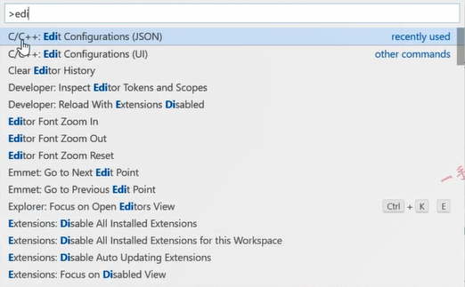
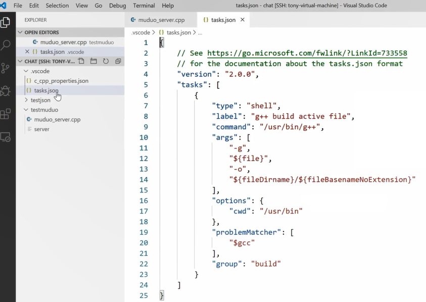

# 内容

1. 切换apt-get源

# 切换源

```bash
sudo cp /etc/apt/sources.list /etc/apt/sources.list.bak #备份原来的列表
sudo vim /etc/apt/sources.list #修改源
# 将文件内容替换成源文件内容
deb http://mirrors.aliyun.com/ubuntu/ trusty main restricted universe multiverse
deb http://mirrors.aliyun.com/ubuntu/ trusty-security main restricted universe multiverse

deb http://mirrors.aliyun.com/ubuntu/ trusty-updates main restricted universe multiverse

deb http://mirrors.aliyun.com/ubuntu/ trusty-proposed main restricted universe multiverse

deb http://mirrors.aliyun.com/ubuntu/ trusty-backports main restricted universe multiverse

deb-src http://mirrors.aliyun.com/ubuntu/ trusty main restricted universe multiverse

deb-src http://mirrors.aliyun.com/ubuntu/ trusty-security main restricted universe multiverse

deb-src http://mirrors.aliyun.com/ubuntu/ trusty-updates main restricted universe multiverse

deb-src http://mirrors.aliyun.com/ubuntu/ trusty-proposed main restricted universe multiverse

deb-src http://mirrors.aliyun.com/ubuntu/ trusty-backports main restricted universe multiverse
# 保存
sudo apt-get update #更新列表
```

# 切换系统运行级别

* runlevel命令可查看系统运行级别
* 可以用init命令动态切换0-6七个级别
  0. 关机
  1. 单用户模式
  2. 多用户无网络服务
  3. 完全的多用户文本界面
  4. 未定义或自定义
  5. 图形化界面
  6. 重启

```bash
runlevel
# 结果:
	# 图形化模式时 -> N 5
	# 命令行模式时 -> 5 3
init 3 #切换到命令行模式
```

# 开发环境

1. ubuntu linux
2. 安装json开发库
3. 安装boost + muduo网络库开发环境[muduo库源码编译安装](https://blog.csdn.net/QIANGWEIYUAN/article/details/89023980)
4. 安装redis环境
5. 安装mysql数据库环境
6. 安装nginx
7. 安装cmake环境

## vscode配置远程连接主机

配置远程开发环境

* [windows+vscode配置远程linux开发环境](https://blog.csdn.net/qq756684177/article/details/94236990)
  1. linux系统运行sshd服务
  2. 在vscode上安装Remote Development插件，其依赖插件会自动安装
* [VS环境创建远程linux跨平台项目](https://blog.csdn.net/QIANGWEIYUAN/article/details/89469717)
* vscode在linux环境下直接开发

## 如何在vscode下配置链接库(.so)

* 配置头文件的搜索路径
* 配置库文件的搜索路径
* 配置需要链接的.so库

按快捷键F1可把vscode的配置对话框打开，进行检索，我们对cpp文件的编译链接进行配置，输入Edit，找C/C++的条目。




此处的json文件就是cpp文件编译的配置文件。


```bash
配置要点：
	g++ -I头文件搜索路径 -L库文件搜索路径 -l库的名称
	includePath可以自定义添加文件的搜索路径	# usr/(local/)include不用加，是全系统通用的
	cppstandard - 如: "cppStandard" : "c++11"
	
```

Ctrl + shift + B - 是对build相关的配置，选择C/C++条目后面的齿轮。点进去发现是一个task.json。




```bash
配置要点：
	"command"是选择哪个路径下的C++编译器
	"args"是编译链接指令后面所带的可加参数的配置信息
		可在最后一行后面加自己相加的参数
		比如: "${...}",
			 "-lmuduo_net",
			 "-lmuduo_base",
			 "-lpthread"
```


除了c_cpp_properties.json、tasks.json还有个launch.json配置文件，是关于调试、运行的。
