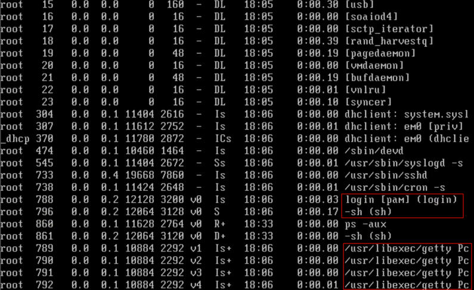

输入以下命令，可以看到全部进程。
```bash
ps -aux | less
```
下面是FreeBSD的 Unix 系统的测试结果：


0 号进程为`[kernel]`。（测试的Ubuntu Linux 系统没有显示 0 号进程）

1号进程为`/sbin/init`。用于初始化。

`[ctypto]`用于加密。

有一个特殊的`[idle]`进程，用于空闲时的调度。某个进程时间片结束，则把权力上交`[idle]`。由`[idle]`决定下一次调用谁。




Unix 系统有多个 getty，是终端程序。一旦有哪个人登录，其中一个 getty 就负责调用 login（登陆器），用于登录相关。
如果用户名、密码匹配，最终就会打开Shell。


