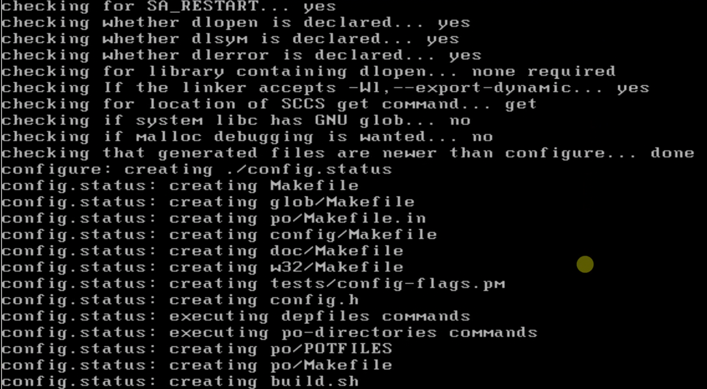

# 解压
大部分源代码包都以`.tar.gz`形式存储。
用`tar -xzvf make-4.2.tar.gz (后面可以加参数，指定解压到哪个目录)`解压。

# 源码目录
```sh
cd make-4.2
ls
```
# configure
每一个项目源码目录下，基本都有configure文件。这是一个可执行文件，内容是Shell脚本。
里面会指示要按照这个软件需要系统有什么必要的环境、前置软件。
```sh
./configure
```



如上，configure会给你检查系统环境。
如果检查无误，则会给你生成`build.sh`以及项目管理文件Makefile。
# make install
```sh
make install
```
会帮你调用系统可用的编译器，进行编译、安装。
一般默认安装位置是`/usr/local/bin`下

如果只是make，则只编译。
如果要安装，需要`make install`。相当于把可执行文件移动到系统可执行目录（`/.../bin`）下。
可以用`make uninstall`卸载。